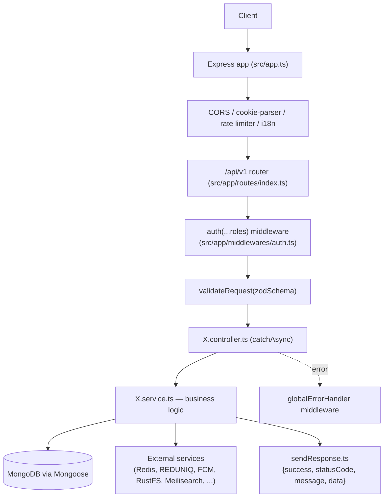

# Architecture Overview

## Overview

Deligo is a monolithic Node.js/Express/TypeScript/MongoDB food-delivery marketplace backend supporting 7 roles (`SUPER_ADMIN`, `ADMIN`, `CUSTOMER`, `FLEET_MANAGER`, `VENDOR`, `SUB_VENDOR`, `DELIVERY_PARTNER`), organized as ~48 feature modules under `src/app/modules/`.

## Purpose

Give a new backend developer the mental model for how the system is put together — stack, module layout, request lifecycle, and how the major infrastructure pieces (Redis, BullMQ, Meilisearch, RustFS, Socket.IO, cron) fit around the core Express app — before diving into individual business modules.

## Technology Stack

| Layer | Technology | Evidence |
|---|---|---|
| Runtime | Node.js | `Dockerfile`, `.github/workflows/deploy.yml` |
| Language | TypeScript 5.4, `strict: true` | `tsconfig.json` |
| Framework | Express 4.19 | `package.json`, `src/app.ts` |
| Database | MongoDB via Mongoose 8.4 | `src/server.ts` |
| Cache/Sessions/Locks | Redis (ioredis), keyspace notifications enabled | `src/app/config/redis.ts` |
| Job queues | BullMQ (`order-queue`, `auth-queue`) | `src/app/BullMQ/*` |
| Search | Meilisearch (self-hosted) | `src/app/lib/meiliClient.ts`, `src/app/modules/Meilisearch/*` |
| Object storage | RustFS (self-hosted, S3-API-compatible via `@aws-sdk/client-s3`) | `src/app/utils/storage.ts`, `docker-compose.yml` |
| Auth | Custom JWT (access+refresh) + bcryptjs + Google/Facebook OAuth token verification | `src/app/modules/Auth/*`, `src/app/utils/verifySocialToken.ts` |
| Validation | Zod | `src/app/middlewares/validateRequest.ts`, per-module `*.validation.ts` |
| Real-time | Socket.IO | `src/app/lib/Socket/*` |
| PDF generation | Puppeteer + Handlebars | `src/app/modules/Invoice/*`, `Agreement/agreement.pdf.service.ts` |
| Payments | REDUNIQ (custom HTTP gateway via axios) | `src/app/modules/Payment/payment.service.ts` |
| SMS/OTP | BulkGate | `src/app/utils/sendMobileOtp.ts` |
| Push | Firebase Cloud Messaging | `src/app/config/firebase.ts` |
| Email | Nodemailer (Gmail SMTP) | `src/app/utils/emailSender.ts` |
| AI | OpenAI, for product descriptions | `src/app/config/openai.ts`, `Ai-Content-Generator/*` |
| Fiscal/e-invoicing | Pasta Digital (Portuguese ATCUD compliance) | `src/app/modules/Invoice/getPdAccessToken.ts` |
| Rate limiting | `express-rate-limit` + `rate-limit-redis` | `src/app/middlewares/rateLimiter.ts` |
| Testing | **None found** — no test framework configured, no `*.test.ts`/`*.spec.ts` files, no `test` script | See [`../08-known-gaps/technical-debt-and-todos.md`](../08-known-gaps/technical-debt-and-todos.md) |

Two dependencies (`stripe`, `@google/genai`) remain listed in `package.json` with no active usage in `src/` — see the known-gaps document.

## Repository Structure

```
src/
  app.ts, server.ts          — Express app wiring / bootstrap (DB connect, seed, socket, cron, queues)
  app/
    modules/                 — ~48 feature modules (see Module Architecture below)
    middlewares/              — auth, error handling, rate limiting, i18n, docs auth, validation
    config/                   — env-var mapping, Redis, BullMQ, Firebase, Multer, OpenAI, Handlebars
    constant/                 — GlobalConstant (roles/status), GlobalInterface, GlobalMessage, GlobalModel, GlobalValidation
    errors/                   — AppError + per-error-type handlers + centralized message dictionary
    utils/                    — shared helpers (distance calc, storage, email, push, IDs, etc.)
    builder/                  — QueryBuilder.ts (generic filter/search/sort/paginate)
    plugins/                  — Mongoose plugins (auth lookup, password hashing)
    lib/                      — Socket.IO setup, Meilisearch client
    cron/                     — node-cron scheduled jobs
    BullMQ/                   — Queue/Worker definitions (order, auth)
    docs/                     — swagger.ts (serves static openapi.json)
    scripts/                  — one-off Meilisearch bulk migration
    interfaces/                — Express Request type augmentation, shared TS interfaces
    routes/index.ts            — central route mounter, ~46 route groups under /api/v1
docs/                          — hand-written integration guides + this project's architecture audit
views/                          — Handlebars email/PDF templates
openapi.json                    — committed, static OpenAPI spec
```

Source: `docs/architecture-audit.md` §3, verified against actual directory listing.

## Module Architecture

Each module under `src/app/modules/*` follows a consistent file convention: `X.model.ts` (Mongoose schema), `X.interface.ts` (TS types), `X.service.ts` (business logic), `X.controller.ts` (HTTP handlers via `catchAsync`), `X.route.ts` (Express router + `auth()` guards), `X.validation.ts` (Zod schemas), `X.messages.ts` (localized message-key dictionary), `X.constant.ts` (enums/searchable fields). Not every module has every file — some (e.g. `Coupon`) are model-only, with no route surface.

Modules grouped by function (see [`role-model.md`](role-model.md) and `03-modules/` for detail per group):

- **Identity & Access**: `Auth`, `AuthUser`, `Permission`, `Profile`, `LoginHistory`, `ActivityLog`
- **People/Accounts**: `Customer`, `Vendor` (incl. `SUB_VENDOR`), `Admin`, `Fleet-Manager`, `Delivery-Partner`
- **Catalog**: `Product`, `Category`, `Add-Ons`, `Ingredients`, `RestrictedItems`, `Tax`
- **Commerce**: `Cart`, `Checkout`, `Order`, `Coupon`, `Offer`, `Ingredient-Order`
- **Payments/Finance**: `Payment`, `Payment-Token`, `Transaction`, `Wallet`, `DeliGo_Balance`, `Payout`, `Points`, `Referral`
- **Logistics**: `Zone`, `Sos`
- **Engagement**: `Rating`, `Notification`, `Support`, `Sponsorships`, `ContactUs`
- **Admin/Ops**: `GlobalSetting`, `Analytics`, `Invoice`, `Agreement`, `Meilisearch`, `Ai-Content-Generator`
- **Infra/logging**: `log` (RequestLog/EmailLog), `ErrorLog`, `Upload`, `Test`

## Request Lifecycle



## Middleware Pipeline

Per-request: CORS, cookie-parser, JSON body parsing, rate limiting (`express-rate-limit` + `rate-limit-redis`), i18n (`Accept-Language` header for `en`/`pt`), then per-route: `auth(...roles)` (JWT verify, RBAC, live permission check for `ADMIN`), `validateRequest`/`validateRequestCookies` (Zod), `validateImageFileRequest` (multipart uploads). Public endpoints are explicit exceptions on specific routes (e.g. `GET /vendors/nearby/open`, `GET /zones/check-point`, `GET /products/open`, `POST /auth/social-login`).

## Error Handling

Centralized `AppError` class plus per-error-type handlers (Zod validation errors, Mongoose `CastError`, Mongoose `ValidationError`, duplicate-key errors) feeding a global error-handling middleware. A centralized message dictionary aggregates per-module `*.messages.ts` files, mapping message keys to localized text and (implicitly, via `AppError`) HTTP status codes. See [`../04-api-reference/error-codes.md`](../04-api-reference/error-codes.md) for the full reference.

## Database

MongoDB via Mongoose. Two-tier identity model: `AuthUser` (credentials, sessions) fully decoupled from role-specific profile collections (`Admin`, `Customer`, `Vendor`, `FleetManager`, `DeliveryPartner`) via a polymorphic `profileId`/`profileModel` link (not a Mongoose discriminator). Mongo sessions/transactions are used for multi-document atomic operations (registration, order stock deduction/restoration, refund persistence, ingredient-order stock release). Near-universal soft-delete (`isDeleted`) pattern. Full detail in [`../05-data-model/collections-reference.md`](../05-data-model/collections-reference.md).

## Redis

Used for: OTP storage (`otp:<role>:<email>`, TTL-based), device/session tracking, refresh-token rotation (`{jti, family}` per device), password-reset tokens (hashed, TTL), rate limiting, and keyspace-notification-driven expiry events (e.g. cart item expiry). Configuration in `src/app/config/redis.ts`. See [`../06-integrations/external-services.md`](../06-integrations/external-services.md).

## BullMQ

Two queues: `order-queue` and `auth-queue` (`src/app/BullMQ/*`). See [`../07-operations/cron-and-background-jobs.md`](../07-operations/cron-and-background-jobs.md) for job-level detail.

## Meilisearch

Self-hosted product search index, kept in sync in real time on product/vendor save (`src/app/modules/Meilisearch/*`, `src/app/lib/meiliClient.ts`). A one-off bulk migration script (`src/app/scripts/meiliBulkMigration.ts`, run via `pnpm meili:migrate`) backfills/reconfigures the index.

## RustFS

Self-hosted S3-API-compatible object store, replacing a prior Cloudinary integration, used for product/vendor images and generated PDFs (`src/app/utils/storage.ts`). See [`../06-integrations/external-services.md`](../06-integrations/external-services.md).

## Socket.IO

Real-time order tracking, live rider location, SOS monitoring, support chat, and vendor status updates (`src/app/lib/Socket/*`).

## Cron Jobs

Scheduled jobs under `src/app/cron/` (`node-cron`) handle vendor opening-hours computation, cart item expiry warnings/cleanup, and order-related sweeps. Full inventory in [`../07-operations/cron-and-background-jobs.md`](../07-operations/cron-and-background-jobs.md).

## External Services

RustFS, REDUNIQ (payments), Pasta Digital (fiscal e-invoicing), Firebase Cloud Messaging (push), Nodemailer/Gmail (email), BulkGate (SMS/OTP), Google Distance Matrix (delivery pricing), Google OAuth / Facebook Graph API (social login), OpenAI (AI product descriptions), Meilisearch, Redis, Socket.IO. Full detail in [`../06-integrations/external-services.md`](../06-integrations/external-services.md).

## Deployment Architecture

Multiple deployment paths coexist — see [`../07-operations/deployment.md`](../07-operations/deployment.md) for the full breakdown: a Docker Compose stack (backend + Redis + Meilisearch + RustFS), a separate PM2/SSH path automated via GitHub Actions (`.github/workflows/deploy.yml`), and a `vercel.json` present in the repo whose active-use status is not confirmed from the codebase alone.

## Related Modules

[`role-model.md`](role-model.md), [`glossary.md`](glossary.md), [`../05-data-model/collections-reference.md`](../05-data-model/collections-reference.md), [`../06-integrations/external-services.md`](../06-integrations/external-services.md), [`../07-operations/deployment.md`](../07-operations/deployment.md).

## Source References

- `docs/architecture-audit.md` (§2, §3, §6, §7 — primary basis for this document, independently verified where noted)
- `package.json`, `tsconfig.json`
- `src/app.ts`, `src/server.ts`
- `src/app/routes/index.ts`
- `src/app/config/redis.ts`, `src/app/config/firebase.ts`, `src/app/config/openai.ts`
