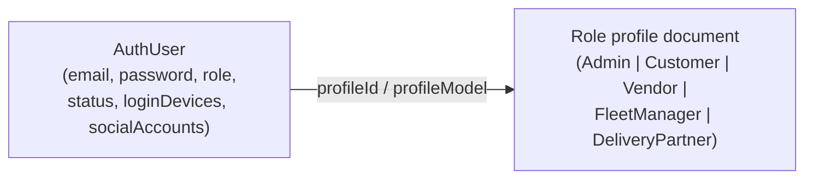
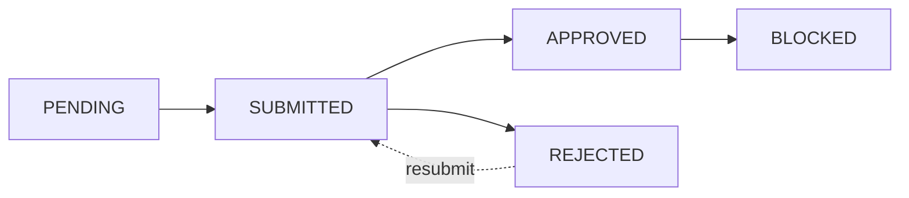

# Role Model

## Overview

Deligo has 7 fixed roles, a 5-state account-status enum, and a two-tier identity architecture that decouples login credentials from role-specific profile data. This document is the reference for "who can do what" at the account level — see [`../02-authentication/permissions-and-rbac.md`](../02-authentication/permissions-and-rbac.md) for the finer-grained `ADMIN` permission layer on top of this.

## Purpose

Give a new developer the complete, accurate picture of the role/account system before they read any module-specific document.

## The AuthUser / Profile architecture

Every user has **two documents**: an `AuthUser` (credentials, sessions, RBAC anchor — in the `AuthUser` collection) and a role-specific **profile** document (`Admin`, `Customer`, `Vendor`, `FleetManager`, or `DeliveryPartner`). They're linked by a polymorphic `profileId`/`profileModel` pair (`refPath`, not a Mongoose discriminator) — fully decoupled collections, not one schema with variants.

This split means: the `auth` middleware authenticates against `AuthUser`, then attaches the **profile document** (not `AuthUser`) as `req.user` for every downstream handler. See [`../02-authentication/session-and-token-management.md`](../02-authentication/session-and-token-management.md).

**No enforced sync mechanism**: `status` is stored on both `AuthUser` and the profile document, and service code updates both manually in every relevant function. No Mongoose hook or transaction guarantee keeps them in lockstep — a future code path that updates one without the other would silently desynchronize them. See [`../08-known-gaps/technical-debt-and-todos.md`](../08-known-gaps/technical-debt-and-todos.md).

## Roles

Source: `src/app/constant/GlobalConstant/user.constant.ts`.

| Role | Profile collection | Self-registerable? | Approval required? |
|---|---|---|---|
| `SUPER_ADMIN` | `Admin` | No (seeded at boot from `SUPER_ADMIN_*` env vars) | No |
| `ADMIN` | `Admin` | No (`SUPER_ADMIN`-onboarded only) | Yes (via the shared Auth workflow) |
| `CUSTOMER` | `Customer` | Yes (OTP-first or social login) | No — auto-`APPROVED` at creation |
| `FLEET_MANAGER` | `FleetManager` | No (`ADMIN`/`SUPER_ADMIN`-onboarded only) | Yes |
| `VENDOR` | `Vendor` | Yes (`POST /auth/register`) | Yes |
| `SUB_VENDOR` | `Vendor` (same collection, `role` differentiates) | No (onboarded by `VENDOR` or `ADMIN`/`SUPER_ADMIN`) | Yes |
| `DELIVERY_PARTNER` | `DeliveryPartner` | Yes (`POST /auth/register`) | Yes |

`ROLE_COLLECTION_MAP` shows `SUPER_ADMIN`+`ADMIN` share the `Admin` collection, and `VENDOR`+`SUB_VENDOR` share the `Vendor` collection — in both cases, differentiated purely by the `role` field, not by separate collections or a discriminator.

## Account status

`USER_STATUS`: `PENDING → SUBMITTED → APPROVED | REJECTED | BLOCKED`.

- `CUSTOMER` bypasses this state machine entirely — `AuthUser.status` is force-set to `APPROVED` at document creation via a schema-level `pre('save')` hook, regardless of OTP-verification state.
- `REJECTED` unlocks the profile document (`isUpdateLocked: false`) so the user can edit and resubmit; `BLOCKED` does not.
- Full mechanics in [`../02-authentication/registration-and-onboarding.md`](../02-authentication/registration-and-onboarding.md).

## Onboarding permission matrix

Who may create an account of a given role (`ROLE_ONBOARD_PERMISSIONS`, `src/app/modules/Auth/auth.constant.ts`):

| Target role | Who may onboard it |
|---|---|
| `delivery-partner` | `ADMIN`, `SUPER_ADMIN`, `FLEET_MANAGER` |
| `sub-vendor` | `ADMIN`, `SUPER_ADMIN`, `VENDOR` |
| `fleet-manager` | `ADMIN`, `SUPER_ADMIN` |
| `vendor` | `ADMIN`, `SUPER_ADMIN` |
| `admin` | `SUPER_ADMIN` only |

## Role behavior summary

### SUPER_ADMIN
Seeded at server boot from env vars (`SUPER_ADMIN_EMAIL`/`_PASSWORD`/etc.), not created via any registration flow. Only role that can onboard another `ADMIN`. **Unconditionally bypasses the ADMIN permission-check layer** — there is no way to restrict a `SUPER_ADMIN`'s access short of a code change; see [`../02-authentication/permissions-and-rbac.md`](../02-authentication/permissions-and-rbac.md). Cannot self-service a password reset (`forgot-password` explicitly rejects this role) and can never be soft- or permanently deleted.

### ADMIN
Onboarded only by `SUPER_ADMIN`. Starts with `permissions: []` and must be explicitly granted actions from the 14-action catalog to do anything beyond role-only-gated routes. The permission check re-queries the database on every request — a revoked permission takes effect on the admin's very next request, not after their token expires.

### CUSTOMER
The only role with no approval workflow. Logs in via OTP (email or contact number) or social login (Google/Facebook) — never a password. Can hold multiple linked social accounts alongside OTP login simultaneously. See [`../02-authentication/login-flows.md`](../02-authentication/login-flows.md).

### VENDOR
Self-registers via `POST /auth/register`, then goes through the standard approval workflow. Once approved, sets brand-identity fields (`businessName`, `businessType`, `restaurantCuisineType`, `isHalal`, `NIF`) that cascade to any `SUB_VENDOR` branches it later onboards. Full detail in [`../03-modules/vendor-and-branches.md`](../03-modules/vendor-and-branches.md).

### SUB_VENDOR (branch architecture)
**Not a separate model** — a `SUB_VENDOR` is a `Vendor` document with `role: 'SUB_VENDOR'`, linked to its parent via `registeredBy: {id: <parent Vendor._id>, model: 'Vendor'}`. There is no dedicated `parentVendorId` schema field; `registeredBy` **is** the entire parent↔branch link. Brand-wide fields (`businessName`/`businessType`) are copied from the parent once at onboarding and thereafter can only be changed on the parent (cascading automatically to every branch) — never directly on a branch, not even by an admin. Everything else (location, hours, menu, inventory) is independent per branch. Full detail, including the onboarding flow and the `copy-to-branch` product-push mechanism, in [`../03-modules/vendor-and-branches.md`](../03-modules/vendor-and-branches.md).

### DELIVERY_PARTNER
Self-registers or is onboarded by `ADMIN`/`SUPER_ADMIN`/`FLEET_MANAGER`. Has **two separate lineage fields**: `registeredBy` (immutable — who originally created the account) and `currentFleetManagerId` (mutable — the canonical *current* fleet assignment, admin-reassignable). This split exists so a partner can move between fleet managers over time without losing the historical record of who onboarded them. The fleet-manager assignment endpoint (`PATCH /delivery-partners/:id/assign-fleet-manager`) currently only supports a **first-time** assignment — it rejects the call outright if the partner already has a different fleet manager assigned, so there is no reassignment path through this endpoint today. Operational status (`IDLE|OFFLINE|ON_DELIVERY`) is separately self-managed and dispatch-managed — see [`../03-modules/delivery-and-dispatch.md`](../03-modules/delivery-and-dispatch.md).

### FLEET_MANAGER
Always admin-onboarded (never self-registers with a branch structure the way vendors can). Manages a pool of delivery partners via `currentFleetManagerId`. Takes a configurable commission cut (`GlobalSettings.commission.fleetManagerPercent`) off the delivery charge of every order fulfilled by a partner in their pool, and can initiate settlement payouts for their own riders. See [`../03-modules/delivery-and-dispatch.md`](../03-modules/delivery-and-dispatch.md) and [`../03-modules/payments-and-payouts.md`](../03-modules/payments-and-payouts.md).

## Edge Cases

- A brand-new `Customer`'s `AuthUser.status` is `APPROVED` in the database before their first OTP verification even completes — `status` and `isEmailVerified`/`requiresOtpVerification` are independent, separately-progressing fields, not a single gate.
- `SUB_VENDOR` inherits brand fields from its parent **only at onboarding time** — this is a one-time copy, not a live reference; only the cascade-on-parent-update mechanism keeps them subsequently in sync.

## Related Modules

[`glossary.md`](glossary.md), [`../02-authentication/`](../02-authentication/registration-and-onboarding.md) (all four documents), [`../03-modules/vendor-and-branches.md`](../03-modules/vendor-and-branches.md), [`../03-modules/delivery-and-dispatch.md`](../03-modules/delivery-and-dispatch.md).

## Source References

- `src/app/constant/GlobalConstant/user.constant.ts` (`USER_ROLE`, `USER_STATUS`, `ROLE_COLLECTION_MAP`, `ROLE_DEVICE_LIMITS`)
- `src/app/modules/Auth/auth.constant.ts` (`ROLE_ONBOARD_PERMISSIONS`)
- `src/app/modules/AuthUser/authUser.model.ts`
- `src/app/modules/Vendor/vendor.model.ts`, `Delivery-Partner/delivery-partner.model.ts`
