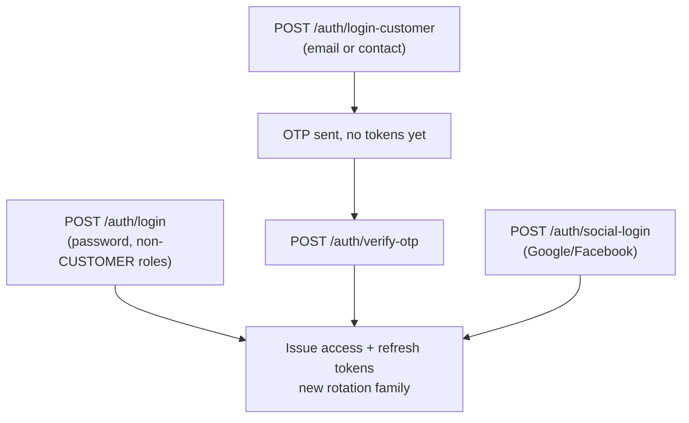

# Login Flows

## Overview

Deligo supports four distinct login mechanisms, split by role: password login (staff/vendor/fleet-manager/delivery-partner roles), OTP-first passwordless login (customers), social login (customers, Google/Facebook), and the shared OTP-verification endpoint both registration and customer login funnel through.

## Purpose

Explain which login endpoint applies to which role, what happens server-side, and how social login integrates with the rest of the account system.

## Architecture / Flow



## Password login — `POST /auth/login`

Non-customer roles only: `AuthUser.findOne({email, role: {$ne: 'CUSTOMER'}})` explicitly excludes `CUSTOMER` — customers can never authenticate here even if they happen to have a password set.

Checks, in order: user exists → not `isDeleted` → not `BLOCKED` → `isEmailVerified` (else `USER_NOT_VERIFIED`) → password provided → bcrypt compare. Every failure branch enqueues a `CREATE_LOGIN_LOG` job with a specific `failureReason` (`INVALID_CREDENTIALS`, `ACCOUNT_DELETED`, `ACCOUNT_LOCKED`, `LIMIT_EXCEEDED`). Same device-limit/registration logic as OTP verification (see [`registration-and-onboarding.md`](registration-and-onboarding.md)). On success: access+refresh tokens issued, a **new** rotation family started, refresh session stored, `CREATE_LOGIN_LOG` SUCCESS logged.

## Customer login (OTP-first, passwordless) — `POST /auth/login-customer`

Accepts `email` **or** `contactNumber`. Runs inside a single Mongo transaction.
- Looks up `Customer` (not `AuthUser`) by the given identifier.
- If the existing customer already has a `referredBy` set and a new `referralCode` is passed → `ALREADY_REFERRED`.
- OTP is generated and stored in Redis (300s TTL) regardless of whether the customer already exists.
- **New customer**: creates `Customer` + `AuthUser` (`requiresOtpVerification: true`). Because of the `AuthUser` schema's `pre('save')` hook, a brand-new customer's `status` is set to `APPROVED` immediately — before OTP verification even completes. `status` and `isEmailVerified`/`requiresOtpVerification` progress independently.
- Contact-number path sends via BulkGate SMS (unless the QA test contact number, which uses a fixed OTP).
- Returns only a message key (`OTP_SENT_EMAIL`/`OTP_SENT_MOBILE`) — no tokens. The client must then call `POST /auth/verify-otp` (the same shared endpoint used by registration) to receive tokens, since it reads the identical `otp:customer:<email|contact>` Redis key.

## Social login — `POST /auth/social-login`

Customer-only. The backend does not perform the OAuth redirect itself — the client app signs the user in with the provider's own SDK (Google Sign-In / Facebook Login SDK), then sends the resulting token to the backend for server-side verification.

| Provider | What the client sends as `token` | Backend verification |
|---|---|---|
| `GOOGLE` | The ID token (a JWT) from Google Sign-In | `google-auth-library`'s `verifyIdToken`, checked against `GOOGLE_OAUTH_CLIENT_IDS` (accepts a match against **any** configured client ID, supporting multiple platforms/apps). Only trusts the returned email if Google's own `email_verified` flag is true. |
| `FACEBOOK` | The access token from Facebook Login | Two-step: `GET /debug_token` (confirms the token belongs to the configured `FACEBOOK_APP_ID`), then `GET /me` for profile fields. Facebook simply omits `email` from the response if the account has no confirmed email on file — a real account state, not a bug. |

```jsonc
POST /api/v1/auth/social-login
{
  "provider": "GOOGLE",                 // or "FACEBOOK"
  "token": "<id-token-or-access-token>",
  "referralCode": "FRIEND123",          // optional, same referral system as login-customer
  "deviceDetails": { "deviceId": "...", "deviceType": "android", "deviceName": "...", "fcmToken": "...", "userAgent": "..." },
  "forceLogin": false
}
```

### Server-side logic (transaction)

1. Existing link — `AuthUser.findOne({role: 'CUSTOMER', 'socialAccounts.provider', 'socialAccounts.providerId'})`.
2. Not found + email present — auto-link: `AuthUser.findOne({role: 'CUSTOMER', email})`; if found, pushes the new provider onto `socialAccounts[]` and marks `isEmailVerified: true`.
3. Still not found — requires `email` (else `400 SOCIAL_EMAIL_REQUIRED`); creates a new `Customer` (name split from the provider's profile) + `AuthUser` with `isEmailVerified: true` and the social account attached. `referralCode` applied identically to `login-customer`.
4. On `11000` duplicate key inside the transaction (the unique index on `{socialAccounts.provider, socialAccounts.providerId}` firing) → `409 SOCIAL_ACCOUNT_ALREADY_LINKED`.
5. Post-transaction: `BLOCKED` check, device-limit check, device registration, JWT issuance — identical shape to every other login path.

### Success response

```jsonc
{ "success": true, "message": "Logged in successfully.", "data": { "accessToken": "...", "refreshToken": "..." } }
```

### Error reference

| errorKey | Meaning |
|---|---|
| `INVALID_SOCIAL_TOKEN` | Token expired, malformed, or fails provider verification |
| `SOCIAL_EMAIL_REQUIRED` | Provider returned no verified email and this is a brand-new signup — nothing to link/create against |
| `SOCIAL_ACCOUNT_ALREADY_LINKED` | This provider account is already linked to a different customer |
| `LIMIT_EXCEEDED` | Already logged in on the max devices for this role |
| `USER_BLOCKED` | Matched/linked account is blocked |
| `GOOGLE_CONFIGURATION_MISSING` / `FACEBOOK_CONFIGURATION_MISSING` | Server-side credentials not configured |

## Business Rules

- A customer can have both a password/OTP login and one or more linked social accounts simultaneously — social login never disables the OTP login path.
- Each provider account can only ever be linked to one Deligo customer account.
- There is no standalone "link social account to my logged-in account" endpoint — linking only happens implicitly via email match during `/social-login`.
- Account status/verification state is shared across all login methods for a given customer — social login on an existing OTP-registered account simply attaches a new credential to the same `AuthUser`/`Customer` pair.

## Getting social-login credentials (operator reference)

- **Google**: Google Cloud Console → Credentials → OAuth client ID, one per platform (Web/Android/iOS). All client IDs go comma-separated into `GOOGLE_OAUTH_CLIENT_IDS`. No client secret needed server-side — only signature/audience verification is performed.
- **Facebook**: Meta for Developers → create an app with the "Authenticate and request data from users with Facebook Login" use case (not a Business-type app — that installs a different product that doesn't support the `email`/`public_profile` scopes needed here). Ensure both `public_profile` and `email` permissions are added. `FACEBOOK_APP_ID`/`FACEBOOK_APP_SECRET` from App settings → Basic. While in Development mode, only accounts added as testers/roles can log in — submit for App Review to go live.

## Edge Cases

- A Google/Facebook account without a confirmed email correctly produces `SOCIAL_EMAIL_REQUIRED` on first-time signup — this is expected provider behavior, not a bug, and is especially common for Facebook accounts that originated as phone-number-only.
- Re-running the identical social-login request logs into the same account, not a duplicate — idempotent by design via the unique provider-account index.

## Related Modules

[`registration-and-onboarding.md`](registration-and-onboarding.md), [`session-and-token-management.md`](session-and-token-management.md), [`../03-modules/loyalty-and-referrals.md`](../03-modules/loyalty-and-referrals.md) for the referral-code mechanics shared by both `login-customer` and `social-login`.

## Source References

- `src/app/modules/Auth/auth.route.ts`, `auth.service.ts` (`loginUser`, `loginCustomer`, `socialLoginCustomer`)
- `src/app/utils/verifySocialToken.ts`
- `src/app/modules/AuthUser/authUser.model.ts`
- `docs/customer-social-login-guide.md` (original integration guide; verified accurate against current code, content integrated above)
