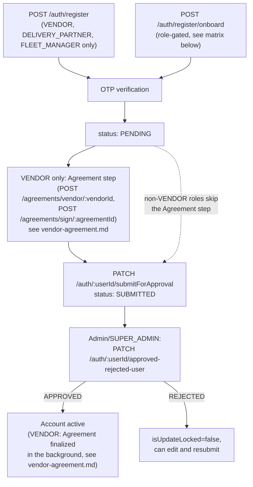

# Registration & Onboarding

## Overview

Deligo has two distinct account-creation paths: **self-registration** (a user signs themselves up) and **onboarding** (an already-approved user or admin creates an account on someone else's behalf). Both flows, plus the approval workflow that follows, are centralized in the `Auth` module — not scattered per-role.

## Purpose

Explain how each role gets an account, who is allowed to create accounts for which other roles, and how the approval state machine works.

## Architecture / Flow

## Self-registration (`POST /auth/register`)

Public endpoint. Zod schema restricts `role` to `VENDOR | DELIVERY_PARTNER | FLEET_MANAGER` — `CUSTOMER` and `ADMIN`/`SUB_VENDOR` cannot self-register through this endpoint.

Server-side (`registerUser`, `auth.service.ts`):
1. Generates `userId` (role-prefixed) and a 4-digit OTP.
2. Looks up all `AuthUser` docs by email across every role first: a verified non-CUSTOMER account with that email (any role) → `409 EMAIL_ALREADY_REGISTERED`; a verified account of the *same* role → `409 EMAIL_ALREADY_VERIFIED`; an *unverified* account with that email is deleted (profile + AuthUser) before creating the new one — unverified stale registrations are silently overwritten by a fresh attempt.
3. Inside a Mongo transaction: creates the role-specific profile document, then the `AuthUser` document with `status: PENDING`.
4. OTP stored in Redis, key `otp:<role>:<email>`, **TTL 300 seconds**.
5. Sends a verification email (fire-and-forget).

## Onboarding (`POST /auth/register/onboard`)

Role-gated creation on someone else's behalf. Requires the caller's own account to be `APPROVED`.

### Onboarding permission matrix (`ROLE_ONBOARD_PERMISSIONS`, `src/app/modules/Auth/auth.constant.ts`)

| Target role | Who may onboard it |
|---|---|
| `delivery-partner` | `ADMIN`, `SUPER_ADMIN`, `FLEET_MANAGER` |
| `sub-vendor` | `ADMIN`, `SUPER_ADMIN`, `VENDOR` |
| `fleet-manager` | `ADMIN`, `SUPER_ADMIN` |
| `vendor` | `ADMIN`, `SUPER_ADMIN` |
| `admin` | `SUPER_ADMIN` only |
| `customer` | `ADMIN`, `SUPER_ADMIN` (defined in the matrix, but not reachable — the onboarding Zod schema excludes `CUSTOMER` as a valid onboarding-request role; customers self-serve via login flows instead — see [`login-flows.md`](login-flows.md)) |

Note: the route-level `auth()` guard for `/register/onboard` allows `ADMIN, FLEET_MANAGER, SUPER_ADMIN, VENDOR` to hit the endpoint at all, but the matrix above is checked again inside the service — e.g. a plain `ADMIN` can call the endpoint requesting `role: 'admin'` in the body, but the service rejects it (`ONBOARD_PERMISSION_DENIED`) since only `SUPER_ADMIN` may onboard an admin.

### `SUB_VENDOR` (branch) onboarding — special case

Fully covered in [`../03-modules/vendor-and-branches.md`](../03-modules/vendor-and-branches.md). Summary: if the caller is a `VENDOR`, the parent is the caller's own record; if `ADMIN`/`SUPER_ADMIN`, a `parentVendorId` is required in the payload (`400 PARENT_VENDOR_ID_REQUIRED_FOR_SUB_VENDOR` if missing, `404 PARENT_VENDOR_NOT_FOUND` if it doesn't resolve to an approved `VENDOR`). The new branch's `registeredBy` is **always** `{id: parentVendor._id, model: 'Vendor'}` — never the calling admin — regardless of who performed the onboarding. Brand-identity fields (`businessName`, `businessType`, `restaurantCuisineType`, `isHalal`, `NIF`) are copied from the parent once, at creation time only.

### Other roles' `registeredBy` resolution

For `VENDOR`/`DELIVERY_PARTNER` onboarding, `registeredBy.model` is set to `'FleetManager'` if the onboarder is a `FLEET_MANAGER`, `'Vendor'` if a `VENDOR`, else `'Admin'`. If a `FLEET_MANAGER` onboards a `DELIVERY_PARTNER`, `currentFleetManagerId` is also set directly to the fleet manager's own `_id` at creation — the new partner is immediately assigned, not left unassigned. `FleetManager` accounts are always admin-onboarded (never self-registered with a branch structure the way vendors can be).

Same email-collision handling as self-registration, plus a defensive cleanup of any stale unverified profile document in the target collection. OTP: same Redis scheme, 300s TTL. Returns `status: PENDING`.

## Agreement step (`VENDOR` only)

Inserted into **both** the self-registration and onboarding flows, immediately before `submitForApproval` — the registration/onboarding flow itself is otherwise unchanged. The Vendor's legal contract (`INITIAL_REGISTRATION` Agreement) is created lazily here, referencing the Vendor by `_id`, not eagerly at `POST /auth/register`/`POST /auth/register/onboard` time — it never was and is not bundled into either creation call. Full detail, including the two-stage signing lifecycle and how the legal/company data is populated without the Vendor re-entering anything, in [`../03-modules/vendor-agreement.md`](../03-modules/vendor-agreement.md).

`SUB_VENDOR`, `DELIVERY_PARTNER`, `FLEET_MANAGER`, and `ADMIN` registration/onboarding skip this step entirely — it applies to `role: 'VENDOR'` only.

## OTP verification (`POST /auth/verify-otp`)

Shared by both registration paths (and by OTP-first customer login — see [`login-flows.md`](login-flows.md)).
- Looks up `AuthUser` by `email`+`role` or `contactNumber`+`role`.
- **Device-limit check happens before OTP validation**: if the device is new and the account is already at its device limit (flat 500 per role, `ROLE_DEVICE_LIMITS` in `src/app/constant/GlobalConstant/user.constant.ts`) without `forceLogin: true` → `403 LIMIT_EXCEEDED`, logged as a failed login attempt.
- **QA/App-Store test bypass**: if the email/contact matches `config.customer.test_customer_email`/`test_customer_contact_number`, the OTP is compared against a fixed configured value instead of Redis — there is no `NODE_ENV==='production'` guard on this in code (see [`../08-known-gaps/technical-debt-and-todos.md`](../08-known-gaps/technical-debt-and-todos.md)).
- On success: OTP Redis key deleted (single use); `isEmailVerified`/`isContactNumberVerified` set true; device registered in `loginDevices`; a fresh JWT rotation family started and refresh session stored (see [`session-and-token-management.md`](session-and-token-management.md)); a `CREATE_LOGIN_LOG` job enqueued.

`POST /auth/resend-otp` re-issues a new OTP with the same 300s Redis TTL; for the email path, already-verified non-CUSTOMER accounts get `EMAIL_ALREADY_VERIFIED_LOGIN` (customers can always resend, since they use OTP as a primary login mechanism, not just email verification).

## Approval workflow

Centralized in `Auth`, applies uniformly to `VENDOR`, `SUB_VENDOR`, `DELIVERY_PARTNER`, `FLEET_MANAGER` (not `CUSTOMER`, which auto-`APPROVED`s at creation — see [`../01-overview/role-model.md`](../01-overview/role-model.md); not `ADMIN`, which has no submit/approve step in this flow).

### `PATCH /auth/:userId/submitForApproval`

Authorization beyond self-submission:
- A `DELIVERY_PARTNER`'s submission may also be made by their **current** fleet manager (`currentFleetManagerId` match).
- A `SUB_VENDOR`'s submission may also be made by its **parent vendor** (`registeredBy` match, mirroring the branch-management pattern in [`vendor-and-branches.md`](../03-modules/vendor-and-branches.md)).
- `ADMIN`/`SUPER_ADMIN` may submit on behalf of anyone.

Sets `AuthUser.status='SUBMITTED'`, locks the profile document (`isUpdateLocked: true`), stamps `submittedForApprovalAt`. Sends a notification email to the user and a push notification to all `ADMIN`/`SUPER_ADMIN`.

**`VENDOR`-only additional gate**: requires an `INITIAL_REGISTRATION` Agreement with `status: VENDOR_SIGNED` and a `posPaymentOption` selected — `400 INITIAL_AGREEMENT_NOT_SIGNED` otherwise. Not applied to any other role, including `SUB_VENDOR`. See [`../03-modules/vendor-agreement.md`](../03-modules/vendor-agreement.md).

### `PATCH /auth/:userId/approved-rejected-user` (ADMIN/SUPER_ADMIN only)

- Caller cannot act on themselves.
- Idempotency guard: rejects if already in the target status.
- `REJECTED`/`BLOCKED` require non-empty `remarks`; `APPROVED` gets a default remark if none supplied.
- Sets `AuthUser.status` and the profile document's `status` **in lockstep** (a manual dual-write — no schema hook enforces this sync; see [`../08-known-gaps/technical-debt-and-todos.md`](../08-known-gaps/technical-debt-and-todos.md)), plus role-specific audit fields (`approvedBy`/`rejectedBy`/`blockedBy`).
- `REJECTED` **unlocks** `isUpdateLocked` — a rejected user can edit their submission and resubmit.
- `BLOCKED` does not touch `isUpdateLocked`.
- A commented-out (disabled) guard exists in the code that would have required a `DELIVERY_PARTNER` to already have a fleet assignment before approval — currently dead code, worth checking if reviving this area.
- Fires a push notification plus a conditional email (skipped for `CUSTOMER` without an email, since customers may be phone-only) to the affected user.
- **`VENDOR`-only side effect on `APPROVED`**: best-effort, non-blocking finalization of the Vendor's `INITIAL_REGISTRATION` Agreement — applies the default DeliGo signature, regenerates the final signed PDF, emails it to the Vendor. Failure here (e.g. the default signature isn't configured) is caught and logged; it never fails the approval itself. See [`../03-modules/vendor-agreement.md`](../03-modules/vendor-agreement.md).

## Business Rules

- Customers bypass this entire approval workflow — `AuthUser.status` is auto-set to `APPROVED` at document creation for any new `profileModel: 'Customer'` document (a schema-level `pre('save')` hook, not just a service-layer default).
- `Admin` accounts (`ADMIN`/`SUPER_ADMIN`) are also created via `POST /auth/register/onboard`, gated `SUPER_ADMIN`-only per the matrix — there is no separate admin-creation endpoint in the `Admin` module itself.

## Authorization

See the onboarding matrix above and [`permissions-and-rbac.md`](permissions-and-rbac.md) for how `auth()` role/permission guards work generally.

## Edge Cases

- Soft-deleting a user (`DELETE /auth/soft-delete/:userId`) clears `loginDevices` entirely (implicit full logout) but does not proactively revoke the user's Redis refresh sessions — those become unusable only because `refreshToken()`'s `AuthUser.findOne({isDeleted:false})` filter excludes them, not because the session was explicitly torn down.
- A `FLEET_MANAGER` may soft-delete a `DELIVERY_PARTNER` they currently manage, in addition to self-deletion — the only cross-account soft-delete permission outside admin roles.
- `SUPER_ADMIN` accounts can never be soft- or permanently deleted through this flow.

## Related Modules

[`login-flows.md`](login-flows.md), [`session-and-token-management.md`](session-and-token-management.md), [`permissions-and-rbac.md`](permissions-and-rbac.md), [`../03-modules/vendor-and-branches.md`](../03-modules/vendor-and-branches.md), [`../03-modules/vendor-agreement.md`](../03-modules/vendor-agreement.md) (the `VENDOR`-only Agreement step and submission gate).

## Source References

- `src/app/modules/Auth/auth.route.ts`, `auth.service.ts`, `auth.constant.ts`
- `src/app/modules/AuthUser/authUser.model.ts`
- `src/app/constant/GlobalConstant/user.constant.ts` (`ROLE_DEVICE_LIMITS`, `USER_STATUS`)
- `src/app/modules/Agreement/agreement.service.ts` (Agreement-related gate/finalization logic invoked from `Auth`)
