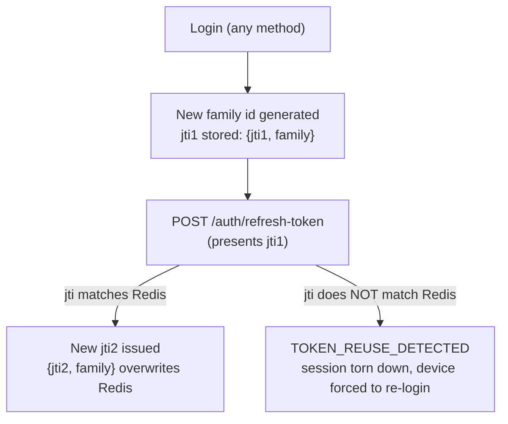

# Session & Token Management

## Overview

Deligo uses a custom JWT access+refresh scheme with Redis-backed device sessions, refresh-token rotation, and reuse detection. This document covers the token shape, the rotation mechanics, and how password changes/resets interact with active sessions.

## Purpose

Explain exactly what's in a token, how a device's session survives across refreshes, and what happens when a refresh token is reused or a password changes.

## JWT payload shape

Consistent across every issuance path (`verifyOtp`, `loginUser`, `socialLoginCustomer`, `refreshToken`):

```ts
{
  userId: string;
  name: { firstName: string; lastName: string };
  email: string;
  contactNumber: string;
  role: TUserRole;
  status: TUserStatus;   // snapshotted at issuance — NOT re-checked from the token; the DB is the source of truth on every request
  deviceId: string;
  jti?: string;          // present ONLY on refresh tokens, absent on access tokens
}
```

- **Access token**: signed with `JWT_ACCESS_SECRET`, expiry `JWT_ACCESS_EXPIRES_IN`. No `jti`.
- **Refresh token**: signed with `JWT_REFRESH_SECRET` (a separate secret from access), expiry `JWT_REFRESH_EXPIRES_IN`. Payload includes `jti` (the rotation-tracking id).
- `family` (the rotation-chain id, see below) is **never embedded in the JWT itself** — it exists only in the Redis session record.

## Device sessions & refresh rotation

Source: `src/app/modules/Auth/authSession.utils.ts`.

Redis key: `refresh_session:<userId>:<deviceId>`. Value: `{jti, family}`.
- `jti` — the id of the *one* currently-valid refresh token for that device.
- `family` — a stable id for the whole rotation chain, set once at login and carried forward unchanged across every subsequent rotation.



- `storeRefreshSession` — called on every login and every successful rotation; **overwrites** the previous record, so the old `jti` is immediately invalidated the instant a rotation succeeds.
- `revokeRefreshSession` — deletes one device's session key (logout, and the reuse-detection kill-switch).
- `revokeAllUserSessions` — scans `refresh_session:<userId>:*` and deletes every match (used on password change).

### `POST /auth/refresh-token`

1. Verifies the refresh JWT's signature/expiry against `JWT_REFRESH_SECRET`.
2. Looks up the `AuthUser`, requires the specific `deviceId` session to still exist with `isLoggedIn !== false` (else `401 SESSION_EXPIRED`).
3. `BLOCKED` check.
4. `passwordChangedAt` vs the token's `iat` check.
5. **Reuse detection**: if no Redis record exists for the device, or the record's `jti` doesn't match the presented token's `jti`, the entire device session is torn down (`revokeRefreshSession` + `loginDevices.$.isLoggedIn=false` + a logout-log job) and `401 TOKEN_REUSE_DETECTED` is thrown. This is a full kill-switch, not a warning — even the legitimate current device must re-login if this fires. **Caution**: a client bug that fires two concurrent refresh calls for the same device can trigger a false-positive reuse detection.
6. On success: new access token + new refresh token (new `jti`, **same `family`**), Redis session overwritten.

## `auth` middleware pipeline

`src/app/middlewares/auth.ts`, executed on every protected request, in order:
1. Extract token — `Authorization: Bearer <token>` header, or fall back to the `accessToken` cookie.
2. No token → `401 AUTHENTICATION_REQUIRED`.
3. Verify JWT signature/expiry against `JWT_ACCESS_SECRET`.
4. `AuthUser.findOne({userId, role})` from the decoded payload → `401 USER_NOT_FOUND` if missing.
5. `isDeleted` check → `401 ACCOUNT_DELETED`.
6. `BLOCKED` check → `403 ACCOUNT_BLOCKED`. Note: only `BLOCKED` is checked here — `PENDING`/`SUBMITTED`/`REJECTED` users still pass this middleware; additional per-route/service logic layers in further restrictions where needed.
7. Device-session validity — the specific `deviceId` from the token must exist in `loginDevices` with `isLoggedIn !== false` → `401 DEVICE_LOGGED_OUT`. This is what makes logout and reuse-detection revocation take effect immediately even though the access token itself remains cryptographically valid until its own expiry.
8. `passwordChangedAt` vs token `iat` → `401 PASSWORD_RECENTLY_CHANGED` if the token predates a password change.
9. RBAC role check → `403 COMMON_ACCESS_DENIED` if the caller's role isn't in the route's allowed list.
10. **Profile-doc lookup as `req.user`** — the full Mongoose profile document (`Admin`/`Customer`/`Vendor`/`FleetManager`/`DeliveryPartner`), not the `AuthUser` doc and not the JWT payload. Downstream code casts this `as TCurrentUser`.
11. `ADMIN`-only live permission check — see [`permissions-and-rbac.md`](permissions-and-rbac.md).

## Password change & reset

### `POST /auth/change-password` (not available to `CUSTOMER`; also not to `SUPER_ADMIN`-only-guarded — allowed roles are `ADMIN, CUSTOMER→blocked in service, DELIVERY_PARTNER, VENDOR, SUB_VENDOR, FLEET_MANAGER`)
- Forbidden for `CUSTOMER` (`CUSTOMER_PASSWORD_CHANGE_DENIED` — customers have no password, OTP/social only).
- Blocks `REJECTED`/`BLOCKED` accounts.
- Verifies the old password, hashes the new one manually (`bcryptjs.hash`, since the update goes through `updateOne` which bypasses the schema's save-hook hashing), sets `passwordChangedAt: new Date()`.
- **Logout-everywhere**: calls `revokeAllUserSessions()` — every device's refresh session is deleted from Redis. Access tokens aren't individually revoked (they self-expire), but the middleware's `passwordChangedAt` vs `iat` check additionally rejects any still-valid access token issued before the change.

### `POST /auth/forgot-password` / `POST /auth/reset-password`
- Forbidden for `CUSTOMER` and `SUPER_ADMIN` (the seeded super-admin cannot self-service reset).
- `forgot-password`: requires `isEmailVerified`, not `BLOCKED`. Generates a random 32-byte token (not persisted on the document), stores its SHA-256 hash in Redis (`reset-token:<hash>`, **10-minute TTL**) with the user's identity. Emails the unhashed token as a link built from the role-specific `FRONTEND_URL_*`.
- `reset-password`: re-hashes the submitted token, looks it up in Redis, validates the embedded identity matches the request. Sets every `loginDevices[].isLoggedIn = false` — but, notably, does **not** also call `revokeAllUserSessions()` the way `change-password` does, so Redis refresh sessions for other devices aren't proactively deleted (they'd still fail the middleware's device-session check via the Mongo-side flag, and `refreshToken()` separately checks `passwordChangedAt`, so old refresh tokens are still effectively blocked — just via a different mechanism than `change-password` uses). Sets the new password via `.save()` (so the schema's hash-on-save hook applies normally, unlike `change-password`'s manual `updateOne` hash). Deletes the Redis reset-token key (single use).

## Logout

`POST /auth/logout` — requires the device to already exist in `loginDevices`. Sets that device's `isLoggedIn: false`, calls `revokeRefreshSession()` (deletes the Redis session key entirely, burning the whole rotation family for that device), and enqueues an `UPDATE_LOGOUT_LOG` job to close out the matching `LoginHistory` row.

## Redis usage summary

| Key pattern | Purpose | TTL |
|---|---|---|
| `otp:<role>:<email\|contact>` | Registration/login OTP | 300s |
| `refresh_session:<userId>:<deviceId>` | `{jti, family}` rotation state | tied to refresh token expiry |
| `reset-token:<sha256hash>` | Password reset token lookup | 600s |

## Business Rules

- Device limit is a flat **500 per role** for all 7 roles (`ROLE_DEVICE_LIMITS`, `src/app/constant/GlobalConstant/user.constant.ts`) — the structure suggests per-role differentiation but all values are currently identical. A code fallback of `3` applies if a role is ever missing from the map (currently unreachable since all 7 are present).
- Device registration on login/OTP-verify uses `$slice: -deviceLimit` eviction of the oldest device when at/over the limit and `forceLogin: true` is sent.

## Edge Cases

- Soft-deleting or permanently deleting a user clears `loginDevices` but does not proactively purge Redis refresh sessions — those become unusable via the `isDeleted:false` filter in `refreshToken()`'s lookup, not through explicit revocation.
- `reset-password`'s asymmetry with `change-password` (no `revokeAllUserSessions()` call) means a password reset is slightly less aggressive about immediately killing other devices' Redis sessions, though the net effect (old sessions become unusable) is the same via a different check.

## Related Modules

[`registration-and-onboarding.md`](registration-and-onboarding.md), [`login-flows.md`](login-flows.md), [`permissions-and-rbac.md`](permissions-and-rbac.md), [`../06-integrations/external-services.md`](../06-integrations/external-services.md) for Redis configuration.

## Source References

- `src/app/modules/Auth/auth.service.ts`, `authSession.utils.ts`, `auth.route.ts`
- `src/app/middlewares/auth.ts`
- `src/app/utils/verifyJWT.ts`
- `src/app/plugins/passwordPlugin.ts`
- `src/app/constant/GlobalConstant/user.constant.ts`
