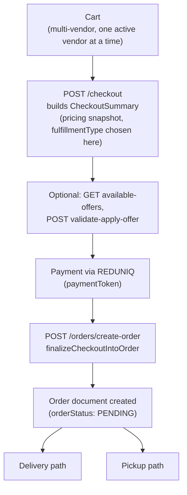
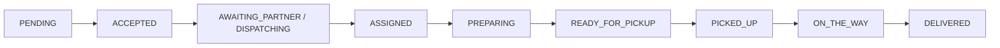
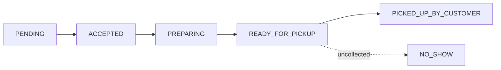

# Cart, Checkout & Order

## Overview

The core marketplace transaction flow: **Cart → Checkout (pricing snapshot) → Payment (REDUNIQ) → Order**. This is the single most important document in the module set — it covers item selection, offer/promo application, delivery vs. self-pickup fulfillment, the 15-state order lifecycle, and delivery-partner dispatch handoff.

Source: `src/app/modules/{Cart,Checkout,Order,Offer,Coupon}/*`; original integration guides `docs/order-flow-guide.md` and `docs/offers-integration-guide.md` (content preserved and reorganized below).

## Purpose

Let a customer build an order from one vendor's menu at a time, price it accurately (including delivery charge, tax, and any offer/promo discount), take payment, and hand the resulting order through vendor preparation and either delivery-partner dispatch or in-person pickup verification.

## Architecture / Flow



### Cart

One `Cart` document per customer. Can hold items from **multiple vendors simultaneously**, but only one vendor's items may be `isActive: true` at a time — enforced in `toggleCartItemStatus` (`src/app/modules/Cart/cart.service.ts`). Switching the active vendor deactivates the previous vendor's items rather than deleting them. Cart items expire after 12h of inactivity, with a 30-minute pre-expiry warning notification (`src/app/cron/cart.cron.ts`).

### Checkout — `CheckoutSummary` pricing snapshot

`POST /checkout` builds a `CheckoutSummary` from either the active cart (`useCart: true`) or an ad hoc single-item request (`useCart: false, items: [...]`). This is where `fulfillmentType` (`DELIVERY` | `PICKUP`) is chosen — fixed for the checkout's lifetime once set. Every new checkout call for the same customer+vendor **replaces** any prior pending checkout (the old one is deleted).

- `DELIVERY` requires the customer to already have an `isActive: true` address in `deliveryAddresses` on their profile, otherwise `400 DELIVERY_ADDRESS_INCOMPLETE`.
- `PICKUP` skips address lookup and the Google Distance Matrix call entirely; `delivery.charge`, `fleet.fee`, and `rider.riderNetEarnings` all compute to `0`.
- Response includes `items[]`, `orderCalculation`, `delivery`, `payoutSummary`, and `offer: {isApplied: false, offerApplied: null}` — no discount applied yet at this step.

### Offers & Promotions

**Offers are calculated only at checkout, never in the Cart.** The Cart is just a bag of items; nothing about pricing/discounts happens until a `CheckoutSummary` exists.

#### Offer types

| Type | What it does | Needs a promo code? |
|---|---|---|
| `PERCENT` | % off the cart, optional `maxDiscountAmount` cap | Optional (see `isAutoApply`) |
| `FLAT` | Fixed amount off the cart | Optional |
| `FREE_DELIVERY` | **Disabled** — cannot be created, updated, listed, or applied | n/a |
| `BOGO` | Buy X (or category Y), get Z free | Never — always auto-applied, vendor-only |

`FREE_DELIVERY` is currently disabled at the code level: create/update requests with this type are rejected (`400 FREE_DELIVERY_CREATION_DISABLED` / `FREE_DELIVERY_UPDATE_DISABLED`) before any other field is checked; existing `FREE_DELIVERY` offers in the database are excluded from `available-offers` and `validate-apply-offer` but remain visible to admin/vendor management for deactivation.

`BOGO` is vendor-exclusive — admins cannot create/edit BOGO offers (`403 BOGO_CREATION_RESTRICTED_TO_VENDOR`), since a BOGO discount reduces the vendor's own payout on the given-away item.

#### Vendor-side offer management (`{{API_BASE}}/api/v1/offers`)

Requires `VENDOR`/`SUB_VENDOR` with `status: APPROVED` (or `ADMIN`/`SUPER_ADMIN` for non-BOGO types).

| Method | Path | Roles | Purpose |
|---|---|---|---|
| POST | `/create-offer` | ADMIN, SUPER_ADMIN, VENDOR, SUB_VENDOR | Create an offer |
| PATCH | `/:offerId` | ADMIN, SUPER_ADMIN, VENDOR, SUB_VENDOR | Update an offer |
| PATCH | `/toggle-status/:offerId` | ADMIN, SUPER_ADMIN, VENDOR, SUB_VENDOR | Flip `isActive` |
| GET | `/` | ADMIN, SUPER_ADMIN, VENDOR, SUB_VENDOR, CUSTOMER | List offers (vendors see only their own) |
| GET | `/:offerId` | ADMIN, SUPER_ADMIN, VENDOR, SUB_VENDOR, CUSTOMER | Get one offer |
| DELETE | `/soft-delete/:offerId` | ADMIN, SUPER_ADMIN, VENDOR, SUB_VENDOR | Soft delete (must be inactive first) |
| DELETE | `/permanent-delete/:offerId` | ADMIN, SUPER_ADMIN in practice (route also accepts VENDOR, service rejects) | Hard delete |

`vendorId`/`isGlobal`/`adminId` are never client-supplied — the server derives them (vendor calls always get `vendorId: <caller>`, `isGlobal: false`). A `SUB_VENDOR` acts under its parent vendor for ownership checks.

**BOGO configuration** (`bogo` block): `buyQty`, `getQty`, and a trigger of either `buyProductId` or `buyCategoryId` (not both). `getProductId`/`getVariationSku` default to the buy-side values if omitted. Ownership of `buyProductId`/`buyCategoryId`'s products/`getProductId` is enforced (`403 BOGO_BUY_PRODUCT_NOT_OWNED` / `BOGO_GET_PRODUCT_NOT_OWNED`). `buyCategoryId` matches a product whose single `category` equals the trigger id (`offer.utils.ts`). `buyCategoryId` should be one of the vendor's own `ProductCategory` ids (categories are vendor-owned as of 2026-08-29). See [`product-and-catalog.md`](product-and-catalog.md).

  > The `Product.additionalCategories[]` multi-tag field (added 2026-08-24) was removed on 2026-08-29 along with the move to vendor-owned categories — a BOGO `buyCategoryId` now matches on the product's single `category` only.

- **Product-level (default)** — leave variation SKUs unset: every variation of the product counts toward the trigger together, and the free unit comes from the cheapest matching variation in the cart.
- **Variation-level (strict)** — set `buyVariationSku` to pin the trigger to one exact variation; other variations don't count.
- The math: `buyQty:2, getQty:1` requires **3** units in the cart total (2 paid + 1 free), not 2.
- Addons are **not** free by default on the reward unit unless the vendor sets `bogo.includeAddons: true`.

Update notes: only the offer's own vendor can update it (`403 NOT_AUTHORIZED_TO_UPDATE_OFFER`); switching to/from `BOGO` or editing an existing BOGO's config is vendor-only; partial `bogo` updates merge onto the existing config; an expired offer can't be updated unless the payload extends `expiresAt`; `maxUsageCount` can't be set below current `usageCount`. `toggle-status` reactivation of an expired offer is blocked until `expiresAt` is extended. `soft-delete` requires `isActive: false` first; `permanent-delete` requires it already soft-deleted.

#### Customer-side offer flow

```
1. POST /checkout                             → create a checkout summary (no offer applied yet)
2. GET  /offers/available-offers/:checkoutId   → (optional) show what the customer qualifies for
3. POST /offers/validate-apply-offer           → apply a BOGO (by _id) or a coupon code
4. GET  /checkout/summary/:checkoutSummaryId   → re-fetch at any time
```

`available-offers` annotates each active offer for that vendor (+ global ones) with `isEligible` and a ready-to-display `message` — clients should not re-derive eligibility, since rules (expiry, min order, usage limit, BOGO trigger quantity) can change server-side.

`validate-apply-offer`: only one offer applies at a time — reapplying with a different `offerIdentifier` replaces the previous one (recalculating from clean state first); reapplying with the same one is a no-op. BOGO offers are looked up by `_id` (auto-apply, no code); coupon-style offers by their `code` string.

Success response fields worth noting: `offer.offerApplied.bogoSnapshot` (only present for BOGO discounts, `freeQty >= 1`) — use `freeQty` (units actually granted free in *this* cart) for UI, not `getQty` (the offer's fixed config, which can differ if the cart doesn't hold enough reward-item units).

#### Offer error reference

| errorKey | Typical cause |
|---|---|
| `OFFER_CODE_ALREADY_EXISTS` | Manual code already used by another active offer |
| `VALID_DISCOUNT_VALUE_REQUIRED` | Missing/invalid `discountValue` for PERCENT/FLAT |
| `FREE_DELIVERY_CREATION_DISABLED` / `FREE_DELIVERY_UPDATE_DISABLED` | Offer type disabled |
| `BOGO_CREATION_RESTRICTED_TO_VENDOR` | Non-vendor tried to create/edit a BOGO offer |
| `BOGO_REQUIRES_BUY_TRIGGER_AND_QUANTITIES` | Missing `buyQty`/`getQty`/trigger |
| `BOGO_BUY_PRODUCT_NOT_OWNED` / `BOGO_GET_PRODUCT_NOT_OWNED` | Referenced product isn't the vendor's |
| `PERCENTAGE_RANGE_INVALID` | PERCENT `discountValue` not in 1-100 |
| `MAX_USAGE_LESS_THAN_CURRENT_USAGE` | `maxUsageCount` below current `usageCount` |
| `ACTIVE_OFFER_MUST_BE_DEACTIVATED_BEFORE_DELETING` | Soft-delete needs `isActive:false` first |
| `INVALID_OFFER_OR_PROMO_CODE` | Code/ID doesn't exist, expired, or wrong vendor |
| `MIN_ORDER_AMOUNT_REQUIRED_TEMPLATE` | Cart below the offer's minimum |
| `OFFER_NOT_VALID_FOR_CART_PRODUCTS` | Offer restricted to specific products not in cart |
| `BOGO_ADD_MORE_QTY_TO_UNLOCK` | Cart doesn't hold a full `buyQty+getQty` tier yet |
| `OFFER_USAGE_LIMIT_EXCEEDED` | Customer already redeemed `userUsageLimit` times |
| `CHECKOUT_SESSION_NOT_FOUND` | Stale/expired `checkoutId` |
| `CANNOT_APPLY_OFFER_TO_COMPLETED_CHECKOUT` | Checkout already converted to an order |

**`Coupon` model** exists but has no HTTP route surface of its own — it is used only internally by the Referral module, not as a customer-manageable feature (see [`loyalty-and-referrals.md`](loyalty-and-referrals.md)). Not confirmed from the current codebase whether `Coupon` and `Offer` share any code path beyond both being promo mechanisms — treat them as separate systems unless verified otherwise.

### Order creation & payment

`POST /orders/create-order` (`finalizeCheckoutIntoOrder`) copies the `CheckoutSummary` into a new `Order` document after payment verification against REDUNIQ (`paymentToken`), atomically reserves offer usage, and (for `PICKUP` orders) generates the pickup code. **Delivery orders reserve stock only on `ACCEPTED`**, not at order creation.

### Fulfillment types

| Type | Meaning | Delivery partner involved? | Address required |
|---|---|---|---|
| `DELIVERY` | Rider brings the order to the customer | Yes — dispatch/claim flow | `deliveryAddress` |
| `PICKUP` | Customer collects in person | No | none (uses vendor's `pickupAddress`, set on `ACCEPTED`) |

### Order status reference (15 states)

| Status | Flow | Meaning |
|---|---|---|
| `PENDING` | both | Order placed & paid, awaiting vendor decision |
| `ACCEPTED` | both | Vendor accepted; stock deducted; `pickupAddress` snapshot set |
| `REJECTED` | both | Vendor rejected before accepting (refund owed) |
| `PREPARING` | both | Kitchen preparing |
| `AWAITING_PARTNER` | delivery | Accepted, no rider found nearby yet |
| `DISPATCHING` | delivery | Broadcast to nearby riders, awaiting claim |
| `ASSIGNED` | delivery | A rider claimed the order |
| `REASSIGNMENT_NEEDED` | delivery | Assigned rider backed out, needs re-dispatch |
| `READY_FOR_PICKUP` | both | Food ready — rider pickup point (delivery) or counter pickup (pickup) |
| `PICKED_UP` | delivery | Rider picked up from vendor |
| `ON_THE_WAY` | delivery | Rider en route |
| `DELIVERED` | delivery | Rider delivered, customer handoff OTP verified (terminal) |
| `PICKED_UP_BY_CUSTOMER` | pickup | Customer verified at counter (terminal) |
| `NO_SHOW` | pickup | Customer never collected within the pickup window (terminal, refund owed) |
| `CANCELED` | both | Canceled by customer/vendor/admin |

Source: `src/app/modules/Order/order.constant.ts`.

### Home Delivery lifecycle



| # | Actor | Action | Endpoint | Effect |
|---|---|---|---|---|
| 1 | Customer | Checkout → pay | `POST /orders/create-order` | Order created, `PENDING`, stock not yet deducted |
| 2 | Vendor | Accept | `PATCH /:orderId/status {type:"ACCEPTED"}` | Stock deducted, `pickupAddress` snapshot set, customer notified |
| 3 | Vendor | Broadcast to riders | `PATCH /:orderId/broadcast-order` | Geo-search in tiers (3km → 4km → 5km); → `DISPATCHING`, 120s claim window; no rider found → `AWAITING_PARTNER` |
| 4 | Rider | Claim | `PATCH /:orderId/accept-dispatch-order {action:"ACCEPT"}` | First to claim wins; → `ASSIGNED`, `deliveryPartnerId` set; other riders' popups cleared via socket |
| 4b | Rider | Decline | `PATCH /:orderId/accept-dispatch-order {action:"REJECT"}` | Removed from `dispatchPartnerPool`; last rider declining → falls back to `AWAITING_PARTNER` |
| 5 | Vendor | Start preparing | `PATCH /:orderId/status {type:"PREPARING"}` | Requires `ASSIGNED` first |
| 6 | Vendor | Mark ready | `PATCH /:orderId/status {type:"READY_FOR_PICKUP"}` | Requires `PREPARING` first; rider notified |
| 7 | Rider | Picked up | `PATCH /:orderId/update-order-status {orderStatus:"PICKED_UP"}` | Requires `READY_FOR_PICKUP`; server generates a 6-digit `deliveryOtp.code` and pushes it to the customer (`DELIVERY_OTP_TO_CUSTOMER`) |
| 8 | Rider | En route | `PATCH /:orderId/update-order-status {orderStatus:"ON_THE_WAY"}` | Requires `PICKED_UP` |
| 9 | Rider | Delivered | `PATCH /:orderId/update-order-status {orderStatus:"DELIVERED", otp}` | Requires `ON_THE_WAY`; `otp` must match `deliveryOtp.code` (customer reads it from the push or `GET /:orderId`); mismatch → `401 INVALID_DELIVERY_OTP` and increments a lockout counter; 5th wrong attempt → `403 DELIVERY_OTP_MAX_ATTEMPTS_EXCEEDED`; no OTP ever generated (e.g. `PICKED_UP` step skipped) → `400 DELIVERY_OTP_NOT_GENERATED`; terminal |
| — | Rider | Can't complete | `{orderStatus:"REASSIGNMENT_NEEDED", reason}` | Frees rider; → `ASSIGNED`, needs a fresh broadcast |

**Cancellation:** Customer — `PATCH /:orderId/cancel {reason}`, any time before `DELIVERED`/`CANCELED`/`REJECTED`, refunded only if still `PENDING`. Vendor — `PATCH /:orderId/status {type:"CANCELED", reason}`, blocked once `ASSIGNED` or later.

### Self-Pickup / Takeaway lifecycle



No delivery partner is ever involved — `deliveryPartnerId` stays `null`, and dispatch/broadcast endpoints reject pickup orders outright.

| # | Actor | Action | Endpoint | Effect |
|---|---|---|---|---|
| 1 | Customer | Checkout → pay | `POST /orders/create-order` | `fulfillmentType: PICKUP`; a random 6-digit **pickup code** generated server-side (`pickup.code`, stored as-is, not hashed), returned immediately and re-fetchable via `GET /:orderId` |
| 2 | Vendor | Accept | `{type:"ACCEPTED"}` | Stock deducted, `pickupAddress` snapshot = vendor's storefront |
| 3 | Vendor | Start preparing | `{type:"PREPARING"}` | Requires `ACCEPTED` directly — no `ASSIGNED` gate |
| 4 | Vendor | Mark ready | `{type:"READY_FOR_PICKUP"}` | Requires `PREPARING`; stamps `pickup.readyAt`; customer notified |
| 5 | Customer | Shows up at counter | (no API call) | — |
| 6 | Vendor | Verify code | `PATCH /:orderId/verify-pickup {code}` | Matches against `pickup.code`; success → `PICKED_UP_BY_CUSTOMER` (terminal), stamps `verifiedAt`/`verifiedBy`; mismatch → `401 INVALID_PICKUP_CODE` (no lockout enforced) |
| — | Vendor | Customer never came | `{type:"NO_SHOW", reason?}` | Only valid from `READY_FOR_PICKUP`; restores stock, `refundStatus: PENDING`, terminal |

**Cancellation:** Customer — same rule as delivery; blocked once `PICKED_UP_BY_CUSTOMER`/`NO_SHOW`. Vendor — blocked once `READY_FOR_PICKUP` or later (use `NO_SHOW` instead).

**Correction to `docs/order-flow-guide.md`:** that guide states no automatic cron sweeps uncollected pickup orders to `NO_SHOW`. This is now out of date — `src/app/cron/order.cron.ts` implements `handleAutoNoShowCron`, scheduled every 5 minutes, which auto-marks `READY_FOR_PICKUP` self-pickup orders `NO_SHOW` once the vendor's closing time passes (RESTAURANT vendors: same-day closing time; STORE vendors: the customer's scheduled `pickup.pickupTime` date). See [`../07-operations/cron-and-background-jobs.md`](../07-operations/cron-and-background-jobs.md).

## API / Technical Details

### Endpoints reference

| Method | Path | Roles | Purpose |
|---|---|---|---|
| POST | `/api/v1/checkout` | CUSTOMER | Build a `CheckoutSummary`; chooses `fulfillmentType` |
| GET | `/api/v1/checkout/summary/:checkoutSummaryId` | CUSTOMER | Re-fetch a pending checkout summary |
| POST | `/orders/create-order` | CUSTOMER | Finalize checkout after payment verification |
| POST | `/orders/reorder/:orderId` | CUSTOMER | Re-add a past order's items to cart |
| PATCH | `/orders/:orderId/cancel` | CUSTOMER | Cancel own order |
| PATCH | `/orders/:orderId/status` | VENDOR, SUB_VENDOR | Accept / Reject / Preparing / Ready / Cancel / No-show |
| PATCH | `/orders/:orderId/verify-pickup` | VENDOR, SUB_VENDOR | Verify pickup code at the counter |
| PATCH | `/orders/:orderId/broadcast-order` | VENDOR, SUB_VENDOR | Broadcast to nearby riders (delivery only) |
| PATCH | `/orders/:orderId/accept-dispatch-order` | DELIVERY_PARTNER | Claim or decline a broadcast order |
| PATCH | `/orders/:orderId/update-order-status` | DELIVERY_PARTNER | Picked-up / On-the-way / Delivered / Reassignment-needed |
| GET | `/orders` | ADMIN, SUPER_ADMIN, VENDOR, SUB_VENDOR, DELIVERY_PARTNER, FLEET_MANAGER, CUSTOMER | List orders, auto-scoped to caller |
| GET | `/orders/:orderId` | CUSTOMER, VENDOR, ADMIN, SUPER_ADMIN, DELIVERY_PARTNER | Get one order, role-scoped |
| GET | `/orders/:orderId/download-invoice-pdf` | CUSTOMER, VENDOR, SUB_VENDOR, ADMIN, SUPER_ADMIN | Download invoice PDF |
| GET | `/orders/delivery-partner/dispatch-order` | DELIVERY_PARTNER | Orders currently broadcast to this rider |
| GET | `/orders/delivery-partner/current-order` | DELIVERY_PARTNER | This rider's active order |

Cross-checked against `src/app/modules/Order/order.route.ts` — matches exactly, with one undocumented duplicate: `GET /orders/delivery-partner-dispatch-order` (no slash) aliases the same controller as the documented `/orders/delivery-partner/dispatch-order`. See `04-api-reference/endpoint-index.md` for the repo-wide index and a separate route-shadowing concern on this same route group.

### Data model — key `Order` fields

```ts
fulfillmentType: 'DELIVERY' | 'PICKUP';

pickup?: {
  code: string;               // 6-digit, select:false by default
  generatedAt: Date;
  pickupTime?: Date | null;   // customer-requested pickup time, set at checkout
  readyAt?: Date | null;
  verifiedAt?: Date | null;
  verifiedBy?: ObjectId | null;
};

deliveryOtp?: {                // DELIVERY orders only — handoff code the rider collects from the customer
  code: string;                // 6-digit, select:false by default; generated on the PICKED_UP transition
  generatedAt: Date;
  attempts: number;            // wrong DELIVERED attempts; locked out at 5 (DELIVERY_OTP_MAX_ATTEMPTS)
  verifiedAt?: Date | null;
  verifiedBy?: ObjectId | null;
};

deliveryAddress?: TAddress;   // required only when fulfillmentType === 'DELIVERY'
pickupAddress?: TAddress;     // vendor's storefront, set on ACCEPTED for both flows
```

### Delivery charge calculation

Single canonical implementation in `src/app/modules/Checkout/checkout.service.ts`: `baseCharge + (distanceKm × chargePerKm)`, distance sourced from Google Distance Matrix, plus VAT, all rates from the singleton `GlobalSettings.delivery` document. Zero for pickup orders. `Zone` has no delivery-pricing role — used only for geofencing/address zoning (see [`delivery-and-dispatch.md`](delivery-and-dispatch.md)).

### Pickup slots

Implemented once, in `checkout.service.ts`: same-day only for `RESTAURANT` vendors, up to 2 days ahead for `STORE` vendors, must land on a 30-minute slot, checked against vendor opening hours.

## Business Rules (product creation cross-reference)

Product creation (relevant to what can appear in a cart) forbids stock tracking for `RESTAURANT`-type vendors — stock is a `STORE`-only feature. Full detail in [`product-and-catalog.md`](product-and-catalog.md).

## Edge Cases

- **Order race conditions**: the delivery-partner claim path (`accept-dispatch-order`) uses an atomic `findOneAndUpdate` guard (condition: `orderStatus:'DISPATCHING', deliveryPartnerId:null, dispatchPartnerPool:{$in:[myId]}, dispatchExpiresAt:{$gt:now}`) so two riders can't both win the same broadcast; a stale/lost claim returns `409 ORDER_ALREADY_CLAIMED_OR_EXPIRED`. The 120-second claim window is enforced both proactively (a per-minute cron, `handleOrderExpiryCron`) and reactively (any partner hitting `accept-dispatch-order` after expiry self-heals the order to `AWAITING_PARTNER` inline). Full detail in [`delivery-and-dispatch.md`](delivery-and-dispatch.md).
- **Stock reservation timing**: delivery orders reserve stock only on `ACCEPTED`, not at order creation — a `PENDING` order does not yet hold inventory.
- **Refund behavior**: customer cancellation refunds only if still `PENDING`; `NO_SHOW` sets `refundStatus: PENDING`; `REJECTED` implies a refund is owed. Actual refund execution is a Payment-module concern — see [`payments-and-payouts.md`](payments-and-payouts.md).
- Every status transition is logged to `statusHistory` on the order.
- **Delivery OTP lockout**: unlike the self-pickup `verify-pickup` code (no lockout), `deliveryOtp.attempts` increments on every wrong `otp` submitted at `DELIVERED` and locks the rider out (`403 DELIVERY_OTP_MAX_ATTEMPTS_EXCEEDED`) after 5 wrong tries — the rider needs support/admin intervention to complete the order past that point (no reset endpoint currently exists). A fresh `deliveryOtp` (with `attempts` reset to 0) is only ever generated on a `PICKED_UP` transition.
- `GET /:orderId` for a customer fetching another customer's order returns `404`, not `403` — deliberate, to avoid leaking order existence.

## Validation

Zod schemas per module (`checkout.validation.ts`, `order.validation.ts`, `offer.validation.ts`) applied via `validateRequest`. Status transitions themselves are enforced in service code via explicit current-status checks per actor, not via the validation layer.

## Authorization

Role-scoped throughout via `auth(...)` middleware — see the endpoint tables above and [`../02-authentication/permissions-and-rbac.md`](../02-authentication/permissions-and-rbac.md).

## Related Modules

Vendor & Branches ([`vendor-and-branches.md`](vendor-and-branches.md)), Product & Catalog ([`product-and-catalog.md`](product-and-catalog.md)), Delivery & Dispatch ([`delivery-and-dispatch.md`](delivery-and-dispatch.md)), Payments & Payouts ([`payments-and-payouts.md`](payments-and-payouts.md)), Loyalty & Referrals ([`loyalty-and-referrals.md`](loyalty-and-referrals.md)) for `Coupon`.

## Source References

- `src/app/modules/Cart/cart.service.ts`, `cart.model.ts`
- `src/app/modules/Checkout/checkout.service.ts` (pickup slots, delivery charge)
- `src/app/modules/Order/order.service.ts`, `order.constant.ts`, `order.route.ts`
- `src/app/modules/Offer/offer.service.ts`, `offer.route.ts`
- `src/app/modules/Coupon/coupon.model.ts`
- `src/app/cron/cart.cron.ts`, `src/app/cron/order.cron.ts`
- `docs/order-flow-guide.md`, `docs/offers-integration-guide.md` (original integration guides; this document reorganizes and preserves their content)
