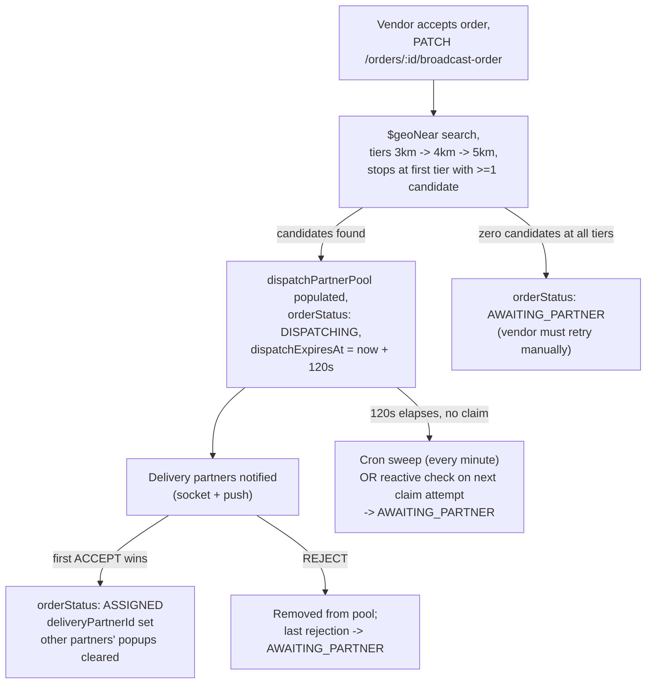

# Delivery & Dispatch

## Overview

Covers the `DeliveryPartner` and `FleetManager` modules, the order-broadcast dispatch mechanism, and the (currently unused) `Zone` geofencing feature. Dispatch logic itself lives in `Order/order.service.ts`, not a dedicated dispatch module.

## Purpose

Explain how a delivery partner gets matched to a delivery order, the fleet-manager hierarchy, and what Zone is actually used for today (and isn't).

## Architecture / Flow

## DeliveryPartner

Fields of note (full list in [`../05-data-model/collections-reference.md`](../05-data-model/collections-reference.md)):
- `registeredBy: {id, model: Admin|FleetManager}` — **immutable**, who originally created the account.
- `currentFleetManagerId` → `FleetManager` — **mutable**, the canonical current assignment. This split exists specifically so a partner can be reassigned between fleet managers without losing the original-onboarder record.
- `operationalData.currentStatus`: `IDLE | OFFLINE | ON_DELIVERY` (default `OFFLINE`).
- `operationalData.currentOrderId` — the partner's single active order. Despite a stale interface comment implying a list, this is a **singular** field, not an array.
- `currentSessionLocation` — updated only via `PATCH /delivery-partners/:id/liveLocation` (self only); rejects `geoAccuracy > 100`.

### Status transitions

`PATCH /delivery-partners/status/change` (self only) only allows `OFFLINE → IDLE` (from `OFFLINE`) and `IDLE → OFFLINE` (from `IDLE`). **A partner cannot self-transition to/from `ON_DELIVERY`** — that state is only ever set by the server, when a dispatch is claimed or a delivery completes.

### Fleet assignment

`PATCH /delivery-partners/:id/assign-fleet-manager` (`ADMIN`/`SUPER_ADMIN` only) supports **first-time assignment only**. If the partner already has a `currentFleetManagerId` set to a *different* fleet manager, the call is rejected outright (`400 DELIVERY_PARTNER_ALREADY_ASSIGNED_TO_FLEET_MANAGER`) — there is no reassignment path through this endpoint once assigned. Reassigning to the same fleet manager is also rejected as a no-op. The target fleet manager must itself be `APPROVED`.

## FleetManager

A business-entity account owning/managing a pool of delivery partners. Always admin-onboarded (`registeredBy` → `Admin`, a single ref, not polymorphic — unlike `DeliveryPartner`'s). No fleet-manager-initiated "claim a partner" endpoint exists; assignment is exclusively admin-driven, as above.

**Financial cut**: confirmed in `checkout.service.ts` — the delivery charge is split at checkout time: `fleetFee = deliveryChargeBase × (GlobalSettings.commission.fleetManagerPercent / 100)`, `riderNetEarnings = deliveryChargeBase − fleetFee`. Every delivery order's payout snapshot bakes in this commission, globally configured (not per-fleet-manager).

## Dispatch mechanics

`broadcastOrderToPartners` (`PATCH /orders/:orderId/broadcast-order`, `VENDOR`/`SUB_VENDOR` only):
1. Requires the caller's `currentSessionLocation` to be set (`400 VENDOR_LOCATION_NOT_SET`).
2. Rejects `PICKUP` orders outright (`400 NOT_APPLICABLE_TO_PICKUP_ORDER`).
3. Rejects if `dispatchPartnerPool` is already non-empty — can't double-broadcast.
4. Only valid from `ACCEPTED | AWAITING_PARTNER | REASSIGNMENT_NEEDED`.
5. **Geo-search**: `$geoNear` aggregation per radius tier — `[3000, 4000, 5000]` meters — filtered to `isDeleted:false, status:'APPROVED', operationalData.currentStatus:'IDLE'`, `$limit: 10` candidates. **Stops at the first tier that returns ≥1 result** — tiers are not merged.
6. Zero eligible partners at all three tiers → order → `AWAITING_PARTNER`, throws `400 NO_PARTNER_FOUND` (no automatic retry — the vendor must re-broadcast manually later).
7. Otherwise: `dispatchExpiresAt = now + 120s` (hardcoded), order → `DISPATCHING`, all candidate IDs added to `dispatchPartnerPool`, each candidate notified via Socket.IO (`NEW_ORDER_AVAILABLE`) and FCM push.

`partnerAcceptsDispatchedOrder` (`PATCH /orders/:orderId/accept-dispatch-order`, `DELIVERY_PARTNER`):
- Rejects immediately if the caller already has an active order and tries `ACCEPT` (`403 PARTNER_ALREADY_HAS_ACTIVE_ORDER`).
- Runs in a transaction. If `dispatchExpiresAt` has already passed while still `DISPATCHING`, self-heals the order to `AWAITING_PARTNER` inline and returns `ORDER_REQUEST_EXPIRED` — so the 120-second window is enforced **both reactively** (whoever hits this endpoint after expiry) **and proactively** (the per-minute cron, see [`../07-operations/cron-and-background-jobs.md`](../07-operations/cron-and-background-jobs.md)).
- `REJECT`: removes the caller from the pool; if they were the last one in the pool, the order falls back to `AWAITING_PARTNER`.
- `ACCEPT`: a single **atomic `findOneAndUpdate`** guarded on `{orderStatus:'DISPATCHING', deliveryPartnerId:null, dispatchPartnerPool:{$in:[myId]}, dispatchExpiresAt:{$gt:now}}` — this is the race-condition guard ensuring two riders can't both win the same broadcast. If another partner already won, returns `null` → `409 ORDER_ALREADY_CLAIMED_OR_EXPIRED`. On success: order → `ASSIGNED`, partner's `currentOrderId`/`currentStatus: ON_DELIVERY` set, pool cleared, other pooled partners get a `REMOVE_ORDER_POPUP` socket event to clear their now-stale popups.

## Zone — confirmed disconnected from pricing and dispatch

`Zone` (`district`, `zoneName`, `boundary` GeoJSON Polygon, `isOperational`, `minDeliveryFee`, `maxDeliveryDistanceKm`) has full admin CRUD plus a public `GET /zones/check-point` (point-in-polygon lookup). **Confirmed via a repo-wide search: no module outside `Zone` itself ever calls into its service.** Delivery pricing is entirely `baseCharge + distanceKm × chargePerKm` from `GlobalSettings.delivery` (Google Distance Matrix for `distanceKm`) — zero Zone involvement. Dispatch geo-search (above) also runs its own raw `$geoNear` against `DeliveryPartner.currentSessionLocation` directly — it never consults `Zone` boundaries or `DeliveryPartner.operationalData.assignmentZoneId`/`currentZoneId` (which exist on the schema but are never populated or read by any dispatch code — the same "aspirational field" pattern as `Zone` itself). Today, `Zone` is a pure standalone geofencing/admin catalog with no live consumer in the order/checkout/dispatch pipeline. See [`../08-known-gaps/technical-debt-and-todos.md`](../08-known-gaps/technical-debt-and-todos.md).

## SOS

`Sos` documents can be triggered by `ADMIN`, `DELIVERY_PARTNER`, `VENDOR`/`SUB_VENDOR`, or `FLEET_MANAGER` staff — requires the caller's `currentSessionLocation` to already be set (`400 COULD_NOT_DETERMINE_CURRENT_LOCATION_ENABLE_GPS`). Broadcasts via Socket.IO to a fixed `SOS_ALERTS_POOL` room (not geo/role-targeted — all admin dashboards presumably subscribe). Status workflow is `ADMIN`/`SUPER_ADMIN`-only; `RESOLVED` is terminal. `GET /sos/nearby` uses a hardcoded 5000m radius centered on the *requesting admin's* own location. `FLEET_MANAGER` list/detail access is scoped to SOS alerts raised by delivery partners currently under their `currentFleetManagerId`. Full ticketing/support detail in [`support-and-safety.md`](support-and-safety.md).

## Database Impact

`DeliveryPartner`'s compound `2dsphere` index (`isDeleted, status, operationalData.currentStatus, currentSessionLocation`) is what makes the dispatch `$geoNear` query efficient — equality fields deliberately lead the geo key. See [`../05-data-model/collections-reference.md`](../05-data-model/collections-reference.md).

## Edge Cases

- **Capacity check is a no-op**: `broadcastOrderToPartners`'s candidate filter includes a capacity-headroom expression referencing `operationalData.currentOrderIds` (plural, array) — a field that **does not exist anywhere in the schema** (the real field is the singular `currentOrderId`). Because of the `$ifNull` fallback to `[]`, this check always evaluates true and never actually filters anyone out by capacity. Low real-world impact since the query already filters to `IDLE` status (a partner mid-delivery is `ON_DELIVERY`, not `IDLE`), but worth knowing if "capacity" is ever discussed as an enforced concept.
- There is a duplicate route (`GET /orders/delivery-partner-dispatch-order`, no slash) aliasing the same controller as the documented `/orders/delivery-partner/dispatch-order` — see [`../04-api-reference/endpoint-index.md`](../04-api-reference/endpoint-index.md) for a related route-ordering concern.

## Related Modules

[`cart-checkout-order.md`](cart-checkout-order.md) for the order lifecycle dispatch fits into, [`payments-and-payouts.md`](payments-and-payouts.md) for fleet-manager commission and settlement, [`support-and-safety.md`](support-and-safety.md) for SOS ticketing detail.

## Source References

- `src/app/modules/Delivery-Partner/delivery-partner.model.ts`, `.service.ts`, `.route.ts`
- `src/app/modules/Fleet-Manager/fleet-manager.model.ts`, `.service.ts`
- `src/app/modules/Order/order.service.ts` (`broadcastOrderToPartners`, `partnerAcceptsDispatchedOrder`, `order.constant.ts` for `DELIVERY_SEARCH_TIERS_METERS`)
- `src/app/modules/Zone/zone.model.ts`, `.service.ts`
- `src/app/modules/Sos/sos.model.ts`, `.service.ts`
- `src/app/cron/order.cron.ts` (`handleOrderExpiryCron`)
