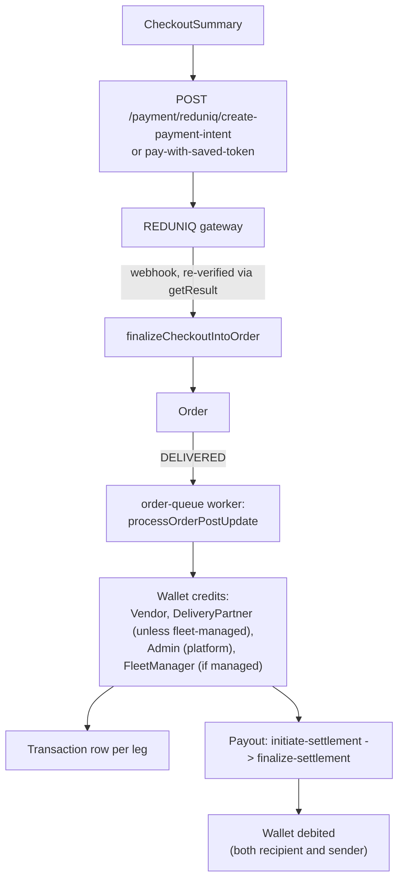

# Payments & Payouts

## Overview

Covers the REDUNIQ payment gateway integration, saved-card tokenization, the append-only Transaction ledger, per-user Wallet balances, and the Payout settlement flow that moves money out of those wallets to vendors/delivery-partners/fleet-managers.

## Purpose

Explain how a customer's payment becomes an order, how earnings flow into wallets, and how those wallets get settled.

## Architecture / Flow

## Payment (REDUNIQ)

No dedicated `Payment` collection — state lives on `CheckoutSummary`/`Order`. All gateway calls go through a single REDUNIQ endpoint with a `method` field switching behavior: `initPayment`, `doPaymentToken`, `doRefund`, `doVoid`, `getResult`. Payment-method → REDUNIQ product code: `CARD:113, MB_WAY:110, APPLE_PAY:115, PAYPAL:105, GOOGLE_PAY:114`.

**Success detection**: a fixed set of REDUNIQ response codes (`00000000`, `17000000000`, `900000000`, `13000000000`) or `transaction.status === '1'`.

### Flows

- `POST /payment/reduniq/create-payment-intent` (CUSTOMER) — initiates the hosted-page payment for a `CheckoutSummary`; `saveCard: true` triggers card tokenization, but **only for the `CARD` method**.
- `POST /payment/reduniq/pay-with-saved-token` (CUSTOMER) — one-click payment with a saved `PaymentToken`, synchronous (no redirect), calls `finalizeCheckoutIntoOrder` directly.
- `POST /payment/reduniq/notification` (public, webhook) — **never trusts the POSTed status directly**: verifies the token matches what the app itself issued (`summary.gatewayPaymentToken`), then re-confirms via a server-side `getResult` call before finalizing the order.
- `POST /payment/reduniq/handle-payment-failure/:checkoutSummaryId` (CUSTOMER) — resets `paymentStatus` to `FAILED` if not yet converted to an order.
- `POST /payment/reduniq/refund/:orderId` (ADMIN/SUPER_ADMIN) — full refund only, requires the order be `REJECTED`/`CANCELED` and `refundStatus !== NOT_APPLICABLE`.
- `POST /payment/ingredient/create-payment-intent` (VENDOR/SUB_VENDOR) — the separate ingredient-restocking payment flow, see [`product-and-catalog.md`](product-and-catalog.md).

### Refunds

`refundRedUniqPayment` calls `doRefund`; on specific already-voidable gateway codes, falls back to `doVoid` instead. On success, `persistRefundRecord()` runs the order update and `Transaction.create` inside one Mongo transaction, so a mid-write crash can't leave `Order.paymentStatus:'REFUNDED'` without a matching audit row. `REFUND_STATUS`: `NOT_APPLICABLE|PENDING|REFUNDED|FAILED`. A refund success email is sent fire-and-forget.

**Known gateway quirk**: `doPaymentToken` (saved-card payment) returns an empty 500 for this specific merchant account — surfaced as `SAVED_TOKEN_PAYMENT_TEMPORARILY_UNAVAILABLE` rather than a generic gateway error.

## Payment Token

Stores masked card metadata only (`last4`, `expiryDate`, `cardBrand`, `cardHolderName`) — raw PAN/CVV is relayed in-memory to REDUNIQ and never persisted. Upserted by **card fingerprint** (`customerId + cardBrand + last4 + expiryDate`), not `tokenId`, since REDUNIQ issues a new `tokenId` per tokenization even for the same physical card. `PATCH /payment-tokens/:id/disable` calls REDUNIQ's `disablePaymentToken` action (a code comment clarifies an earlier, incorrect attempt used `disableRecurringPayment`, which targets subscriptions, a different resource type) and promotes the next most-recent active card to default.

## Transaction

An append-only audit ledger — no update/delete HTTP endpoints exist. 13 `type` values: `ORDER_PAYMENT, VENDOR_EARNING, FLEET_EARNING, DELIVERY_PARTNER_EARNING, VENDOR_SETTLEMENT, FLEET_SETTLEMENT, DELIVERY_PARTNER_SETTLEMENT, PLATFORM_COMMISSION, INGREDIENT_PURCHASE, REFERRAL_BONUS, PLATFORM_TAX_COLLECTION, PLATFORM_SERVICE_CHARGE, REFUND`. Polymorphic `{userId, userModel}` across `Customer|Vendor|FleetManager|DeliveryPartner|Admin`.

## Wallet

Per-user running balance (`currentBalance`, `lockedBalance`, `lifetimeEarnings`, `currentTaxLiability`). **No create/update HTTP endpoints** — entirely read-only via REST (`GET /wallets`, `/me`, `/:walletId`); all writes come from other modules' service code, lazily upserting a wallet on first earning (no explicit `Wallet.create` call anywhere in the codebase).

### Crediting on delivery (`order-queue` worker, `processOrderPostUpdate`, triggered on `orderStatus: DELIVERED`)

Inside one Mongo transaction:
- Credits the **Vendor** wallet with `vendorNetPayout`.
- Credits the **DeliveryPartner** wallet with `riderNetEarnings` — **only if the partner is not fleet-managed**; fleet-managed riders are paid via their Fleet Manager's pooled wallet instead, to avoid double-payout.
- Credits the platform's `SYSTEM_ADMIN` wallet (resolved via `Admin.findOne({role:'SUPER_ADMIN'})`) with total cash inflow plus commission, VAT, and service charge.
- If fleet-managed, credits the **FleetManager** wallet with `fee + riderNetEarnings` pooled together.
- Inserts a matching `Transaction` row per party.
- `normalizeWalletFields()` runs a `$round`-to-2-decimals aggregation update afterward to guard against float drift accumulating across many small credits.

## Payout

Fields: `payoutId`, `userId`/`userModel` (`Vendor|DeliveryPartner|FleetManager`), `senderId`/`senderModel` (`Admin|FleetManager`), `amount`, `status` (`PENDING|PROCESSING|PAID`), `paymentMethod` (`BANK_TRANSFER|MOBILE_BANKING|CASH`), `bankDetails`, `payoutProof`.

**Index**: `{userId:1, status:1}` unique, partial on `status:'PENDING'` — closes the create-time TOCTOU race so a user can never have two pending payouts simultaneously. `PROCESSING` is deliberately excluded from the partial index, since it's described in code as a transient state that never persists outside an active transaction.

### Flow

1. **`POST /payouts/initiate-settlement`** (`FLEET_MANAGER`, for their own riders only) — requires complete bank details; blocks if an existing `PENDING` payout exists; computes `availableAmount = currentBalance − lockedBalance`; **locks** that amount and creates the `Payout` doc, all in one transaction.
2. **`POST /payouts/finalize-settlement/:payoutId`** (`ADMIN`/`SUPER_ADMIN`/`FLEET_MANAGER`, fleet manager restricted to own riders) — atomic `findOneAndUpdate({payoutId, status:'PENDING'}, {$set:{status:'PROCESSING'}})` closes the concurrent-finalize race; requires an uploaded `payoutProof`; debits **both** the recipient's wallet (`currentBalance -= amount, lockedBalance -= amount`) **and the sender's wallet** by the same amount (so an Admin's or Fleet Manager's own pooled wallet decreases when they pay someone out); creates a matching `Transaction`; sets `status:'PAID'`.
3. **Automated settlement** — a daily cron (`handlePayoutAutomatedCron`, see [`../07-operations/cron-and-background-jobs.md`](../07-operations/cron-and-background-jobs.md)) runs only if `GlobalSettings.payout.autoGenerate` is on and today (Lisbon time) is a configured payout day. Finds wallets with `available >= minPayoutAmount` (excluding users with an existing pending payout, and fleet-managed delivery partners, who are settled via their fleet manager instead), auto-creates `PENDING` payouts and locks balances. Missing bank details → a push alert and skip, rather than a failure.

## Business Rules

- Fleet-managed delivery partners never receive a direct wallet credit or a direct automated payout — their earnings flow through their fleet manager's pooled wallet/payout instead.
- A payout can only be finalized once its `payoutProof` is uploaded — there is no proof-less settlement path for `ADMIN`/`FLEET_MANAGER`.

## Database Impact

See [`../05-data-model/collections-reference.md`](../05-data-model/collections-reference.md) for `Payment-Token`, `Transaction`, `Wallet`, `Payout` field/index detail.

## Edge Cases

- **Hardcoded fallback ObjectId in `getMyWallet`**: `wallet.service.ts` uses a hardcoded ObjectId literal as a fallback for resolving the platform (`ADMIN`/`SUPER_ADMIN`) wallet, instead of dynamically resolving `Admin.findOne({role:'SUPER_ADMIN'})` the way the order-completion worker and payout service correctly do elsewhere. If that specific document is ever deleted or reseeded with a different ID, the admin "my wallet" view could silently fail to find the correct wallet even though it exists. See [`../08-known-gaps/technical-debt-and-todos.md`](../08-known-gaps/technical-debt-and-todos.md).
- `stripe` remains an unused dependency in `package.json` — REDUNIQ is the only payment gateway actually integrated.

## Related Modules

[`cart-checkout-order.md`](cart-checkout-order.md), [`delivery-and-dispatch.md`](delivery-and-dispatch.md) for fleet-manager commission mechanics, [`loyalty-and-referrals.md`](loyalty-and-referrals.md) for `DeliGoBalance`'s (separate, unrelated) balance concept, [`../06-integrations/external-services.md`](../06-integrations/external-services.md) for REDUNIQ integration detail.

## Source References

- `src/app/modules/Payment/payment.service.ts`, `payment.route.ts`
- `src/app/modules/Payment-Token/payment-token.model.ts`, `.service.ts`
- `src/app/modules/Transaction/transaction.model.ts`
- `src/app/modules/Wallet/wallet.model.ts`, `.service.ts`
- `src/app/modules/Payout/payout.model.ts`, `.service.ts`, `payout.cron.ts`
- `src/app/BullMQ/Workers/order.worker.ts` (`processOrderPostUpdate`)
