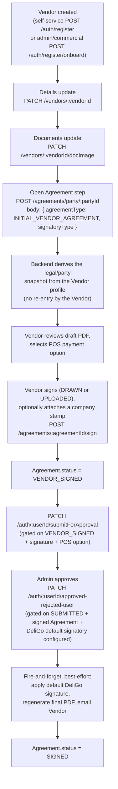

# Vendor Agreement

## Overview

The `Agreement` module is a **generic, party-agnostic legal-contract domain** — not a Vendor-only feature. Every Agreement document has a **1:N** relationship with whichever party it belongs to via `Agreement.partyId → <partyModel>._id` (`Agreement.partyModel` names which collection, e.g. `"Vendor"` today). The only agreement type with a real, registered `AGREEMENT_CONFIG` entry right now is `INITIAL_VENDOR_AGREEMENT` — every Vendor gets exactly one, mandatory, before their registration can be approved — but the routes, controller, service, model, and PDF pipeline underneath it are all already generic across any future party type (Fleet Manager, POS Device agreements, addenda, renewals, ...). This document describes the current (post-genericization) architecture and, in the section immediately below, the concrete before/after of what changed to get here.

This module superseded an earlier 1:1, OTP-verified design (`agreementCode`, `Agreement.email` unique, `PENDING_VERIFICATION → VERIFIED → DRAFT → SIGNED → EMAILED` status) that some other documents in this repository may still describe — this document is the current source of truth; if another page's Agreement content conflicts with this one, this one wins. See the Decision Log for why the model changed.

## API/Domain Evolution — OLD vs NEW

The Agreement domain went through two genericization passes, both **before production release**, both purely architectural (the Vendor business flow itself — registration → sign → approve → DeliGo signature → final PDF → email — never changed behavior). If you find another doc, a Postman collection, client code, or a code comment still using the 🔴 OLD forms below, it's stale — update it to the 🟢 NEW form.

### 🔄 Route changes

#### 🔴 OLD
```
POST /agreements/vendor/:vendorId
```
#### 🟢 NEW
```
POST /agreements/party/:partyId
```
**Why changed:** the create/load endpoint is generic across every agreement type — `agreementType` in the body (not the URL) picks the `AGREEMENT_CONFIG` entry that decides which party model `:partyId` resolves against, which snapshot builder runs, and which PDF template is used. A Vendor-shaped URL would have meant a second, near-duplicate route (`/agreements/fleet-manager/:fleetManagerId`, etc.) for every future party type — exactly what this refactor avoids.

---

#### 🔴 OLD
```
GET /agreements/vendor/:vendorId
```
#### 🟢 NEW
```
GET /agreements/party/:partyId
```
**Why changed:** same reasoning as above. This endpoint returns a party's *entire* agreement history (every type, all time), so it was the clearest existing signal that the route couldn't stay Vendor-shaped — a single party legitimately holds agreements of multiple types.

---

#### 🔴 OLD
```
POST /agreements/sign/:agreementId
```
#### 🟢 NEW
```
POST /agreements/:agreementId/sign
```
**Why changed:** cosmetic REST-nesting cleanup done in the same pass — `:agreementId` is now consistently the leading resource segment across every agreement-scoped route (`GET/PATCH /agreements/:agreementId`, `POST /agreements/:agreementId/sign`), rather than `sign` appearing as a pseudo-namespace before the id.

---

**Unchanged routes** (already generic, no rename needed): `GET /agreements/:agreementId`, `PATCH /agreements/:agreementId`, `GET /agreements`.

### 🔄 Field/enum renames (Agreement model, request/response bodies)

| 🔴 OLD | 🟢 NEW | Why |
|---|---|---|
| `Agreement.vendorId` | `Agreement.partyId` (+ new `Agreement.partyModel: "Vendor"`, a Mongoose `refPath` discriminator) | The FK now points at any party collection, not only `Vendor`. `partyModel` names which one, mirroring the existing `createdBy`/`createdByModel` pattern. |
| `establishmentName` | `partyLegalName` | "Establishment" implied a business premises; the field is really "this party's legal name," equally valid for a Vendor or any future party type. |
| `establishmentSignaturePath`, `establishmentSignatureMethod`, `establishmentSignatoryType` | `partySignaturePath`, `partySignatureMethod`, `partySignatoryType` | Same reasoning — generic "party," not "establishment." |
| `establishmentStampPath` | `partyStampPath` | Same. |
| `companyRepresentativeName` / `companyRepresentativeRole` | `partyRepresentativeName` / `partyRepresentativeRole` | "Company" assumed a business party; a future individual-signatory party type still has a representative concept. |
| `companyIban` | `partyIban` | Same generalization. |
| `agentSignaturePath` (Agreement field) / `agentName` / `agentRole` / `agentSignature` / `agentStamp` (PDF-service data) | `deligoSignaturePath` / `deligoSignatoryName` / `deligoSignatoryRole` / `deligoSignature` / `deligoStamp` | "Agent" was ambiguous (agent of whom?) — these are unambiguously DeliGo's own signature/stamp fields, matching the existing `GlobalSettings.agreement.deligoSignatureUrl` naming they're sourced from. |
| `signatoryType: "VENDOR"` | `signatoryType: "SELF"` (enum renamed `ESTABLISHMENT_SIGNATORY_TYPE` → `PARTY_SIGNATORY_TYPE`) | A literal `"VENDOR"` value on a generic, multi-party enum was actively wrong for any non-Vendor party self-signing. `AUTHORIZED_REPRESENTATIVE` is unchanged. |
| `vatNumber` | *(removed entirely)* | Dropped in an earlier pass — not part of this genericization, listed here only so it isn't mistaken for a rename. |

**Not renamed, still correct as-is**: `commercialName`, `headOfficeAddress`, `zipCode`, `country`, `email`, `contactNumber`, `nif`, `status`, `posPaymentOption`, `signedAt`, `deligoSignedAt`, `emailedAt`, `createdBy`/`createdByModel`, `deligoRepresentativeName`/`deligoRepresentativeRole` (these were already generic/DeliGo-specific and needed no change).

### 🟢 NEW — `AGREEMENT_CONFIG` (the actual extensibility mechanism)

A single registry, `agreement.config.ts`, keyed by `agreementType`, is now the one place that declares — per type — its `partyModel`, `partyLookupField`, `selfAccessRole`, PDF `template`, whether `requiresPosPayment`/`requiresPartyStamp`, whether it `singletonPerParty`, when it `finalizeOn` (`'ON_SIGN'` vs `'ON_ADMIN_APPROVAL'`), and its `buildSnapshot` function (`agreement.snapshotBuilders.ts`). Every function in `agreement.service.ts` reads this config instead of branching on `agreementType === 'INITIAL_VENDOR_AGREEMENT'`. **Practical consequence for future work**: adding a new agreement type (Fleet Manager, POS Device, ...) should require *only* a new `AGREEMENT_TYPE` value, a new `AGREEMENT_CONFIG` entry, a snapshot builder if the party model differs, a template — and, for a self-service party role, adding that role to the existing `auth(...)` allowlist in `agreement.route.ts`. It should **not** require a new route, a new Agreement field, or a new `if (agreementType === ...)` branch anywhere.

### 🟢 NEW — generic party resolution for `GET /agreements/party/:partyId`

Since this endpoint spans every agreement type for one party at once, it can't look up a `partyModel` from a single `agreementType` the way create does. It now resolves `:partyId` the same way the rest of the codebase resolves any human-readable lookup id: `AuthUser.findOne({ userId })` → `.role` + `.profileId` → `ROLE_COLLECTION_MAP[role]` for the party model. Self-access is checked against the *resolved party's own role*, not a hardcoded `'VENDOR'` string. `agreement.service.ts` no longer imports the `Vendor` model at all.

## Purpose

Explain the Agreement step's place inside Vendor Registration/Onboarding, its two-stage signing lifecycle, how its legal/party data is populated, how the DeliGo-side signature is applied, and how a frontend should integrate against it end to end — using the current, generic route/field names throughout.

## Architecture / Flow

The Agreement step is inserted into the **existing, otherwise-unchanged** Vendor Registration/Onboarding flow, immediately before the final submission — it is not a separate flow and does not replace any existing step:



Two distinct callers exercise the same endpoints:
- **`VENDOR`** — self-service registration, managing their own agreement directly. Every `:partyId`-scoped call is checked server-side against the caller's own account (`403 COMMON_ACCESS_DENIED` otherwise) — there is no route-level restriction preventing a Vendor from passing another party's id, so this check exists specifically because `VENDOR` was added as a caller of what used to be admin-only routes.
- **`ADMIN` / `SUPER_ADMIN`** (`CAN_MANAGE_AGREEMENTS` permission for a plain `ADMIN`) — the Commercial, acting on the Vendor's behalf on their own authenticated tablet while the Vendor is physically present, during onboarding. Also the only caller for later independent agreements once a Vendor is already `APPROVED`.

`SUB_VENDOR` never calls any Agreement endpoint and is never gated on one — see Business Rules.

## Business Rules

### Legal/party data is still derived, but the signatory choice is not

Opening the Agreement (`POST /agreements/party/:partyId` with `agreementType: INITIAL_VENDOR_AGREEMENT`) derives the legal/party snapshot server-side from the Vendor's own already-submitted profile (`buildVendorAgreementSnapshot`, `agreement.snapshotBuilders.ts`, registered against `INITIAL_VENDOR_AGREEMENT` in `agreement.config.ts`) — but the body is **not** empty: it must always include `signatoryType`, and conditionally `partyRepresentativeName`/`partyRepresentativeRole` (see next section).

| Agreement field | Derived from | Required? |
|---|---|---|
| `partyLegalName` | `Vendor.name.{firstName, lastName}` joined — **the Vendor's own personal name**, not the business name | Yes |
| `commercialName` | `Vendor.businessDetails.businessName` — the trading/business name | Yes |
| `nif` | `Vendor.businessDetails.NIF` | Yes |
| `contactNumber` | `Vendor.contactNumber` | Yes |
| `email` | `Vendor.email` | Yes |
| `headOfficeAddress` | `Vendor.businessLocation.{street, city, state}` joined | No |
| `zipCode` | `Vendor.businessLocation.postalCode` | No |
| `country` | `Vendor.businessLocation.country` | No |
| `partyIban` | `Vendor.bankDetails.iban` | No |

`partyLegalName` and `commercialName` come from two different Vendor fields and are both now required inputs to the snapshot — do not confuse them. There is no `vatNumber` field anywhere in the Agreement model; it was removed entirely (see Decision Log) and must not be sent or expected in a payload.

If any required field is missing, the call fails with `400 PARTY_PROFILE_INCOMPLETE_FOR_AGREEMENT` — the Details-update step must actually be completed first. This is enforced server-side regardless of what order a frontend calls things in.

Once created, the Agreement's snapshot is **independent of the Vendor profile** — it is copied once, at creation (or updated on a signatory-changing re-open, see below), and never re-read; a later edit to the Vendor's own `businessDetails`/`contactNumber` does not change an already-created Agreement.

### Who signs: the party or an Authorized Representative

`signatoryType: "SELF" | "AUTHORIZED_REPRESENTATIVE"` is a **required** field on `POST /agreements/party/:partyId`, decided when the Agreement is opened (not at signing time):

- **`SELF`** — the Vendor signs personally. `partyRepresentativeName` is auto-set to the Vendor's own name and `partyRepresentativeRole` to a fixed default (`"Proprietário"`). No representative fields are accepted or needed in the body. The signed PDF's "Cargo" (role) row is hidden entirely for this case.
- **`AUTHORIZED_REPRESENTATIVE`** — someone else signs on the Vendor's behalf. `partyRepresentativeName` and `partyRepresentativeRole` are then **required** in the body (`400 <field>` validation error otherwise, enforced by a `.superRefine` in `createAgreementValidationSchema`). Both are printed on the PDF, including the Cargo row.

> 🔴 OLD: this value used to be `signatoryType: "VENDOR"`. 🟢 NEW: it's `signatoryType: "SELF"` — see the Evolution section above.

The same choice can be changed later — while the Agreement is still `UNSIGNED` — either via `PATCH /agreements/:agreementId` (see Validation) or by re-calling `POST /agreements/party/:partyId` with a different `signatoryType`/representative (see "Re-opening the Agreement step" below).

### Two-stage signing

`Agreement.status`: `UNSIGNED → VENDOR_SIGNED → SIGNED`.

1. **`POST /agreements/:agreementId/sign`** — the party signs. Body: `{ partySignatureMethod: "DRAWN" | "UPLOADED", partySignature, partyStamp?, posPaymentOption }`.
   - `partySignature` is **required**. Its expected shape depends on `partySignatureMethod`: `DRAWN` → a base64 data-URI (`data:image/(png|jpg|jpeg|webp);base64,...`, a canvas `toDataURL()` export, max 5MB decoded); `UPLOADED` → a plain URL that must already point into DeliGo's own RustFS bucket (obtained by uploading the file first via `POST /uploads`, see the Frontend Integration Guide below — an arbitrary external URL is rejected).
   - `partyStamp` is **optional** and, regardless of `partySignatureMethod`, is **always** a RustFS URL (never base64 — a stamp has no "drawn" concept). If omitted, the signed PDF simply has no "Carimbo da Empresa" row.
   - `posPaymentOption` is required for `INITIAL_VENDOR_AGREEMENT` specifically (`AGREEMENT_CONFIG[...].requiresPosPayment`) — a future agreement type not needing POS at all can set this to `false` in its own config without any change to this endpoint's code.
   - Generates an interim PDF (party signature/stamp visible, DeliGo's slot still blank), sets `status: VENDOR_SIGNED`, `signedAt`. **Does not email.**
2. **Finalization** (`applyDeligoSignatureAndFinalize`, `agreement.service.ts`) — loads the **one global default DeliGo authorized signatory** from `GlobalSettings.agreement` (see [`admin-and-settings.md`](admin-and-settings.md)), regenerates the PDF with both signatures/stamps, uploads to RustFS **overwriting** `signedPdfPath` (the party-only interim PDF is not preserved as a separate artifact), sets `status: SIGNED`, `deligoSignedAt`, emails the final PDF to the party's registered email, sets `emailedAt`.
   - For `INITIAL_VENDOR_AGREEMENT` (`AGREEMENT_CONFIG[...].finalizeOn === 'ON_ADMIN_APPROVAL'`): finalization is deferred until the Vendor is **approved** (`AgreementService.finalizeAgreementForApprovedParty`, called fire-and-forget from `Auth`'s approval hook — see "Approval gate" below). A registration that gets rejected should not trigger a "your contract is confirmed" email.
   - For any type configured `finalizeOn: 'ON_SIGN'`: finalization runs automatically, in the same request, immediately after `signAgreement` — there is no separate manual finalization endpoint. (As of this writing, `AGREEMENT_TYPE` only has one registered value, `INITIAL_VENDOR_AGREEMENT` — the `ON_SIGN` path is generic and implemented, but not yet exercisable end-to-end until a second type is registered.)

The default signature is a **platform-wide config value**, deliberately never derived from whichever Admin performs the approval/finalization action.

### Submission gate

`PATCH /auth/:userId/submitForApproval`, for `role === 'VENDOR'` only, requires a single `Agreement` document matching **all** of: `agreementType: INITIAL_VENDOR_AGREEMENT`, `status: VENDOR_SIGNED`, `posPaymentOption: { $ne: null }`, `partySignaturePath: { $ne: null }` (all implied by `VENDOR_SIGNED` already, but asserted explicitly too — `partyStampPath` is intentionally **not** required here, since the stamp is optional). Missing any of these → `400 INITIAL_AGREEMENT_NOT_SIGNED`. Full detail in [`../02-authentication/registration-and-onboarding.md`](../02-authentication/registration-and-onboarding.md).

### Approval gate (hard preconditions before `APPROVED`)

`PATCH /auth/:userId/approved-rejected-user`, when `role === 'VENDOR'` and the target status is `APPROVED`, enforces three preconditions **before** changing status:

1. `authUser.status === 'SUBMITTED'` → otherwise `400 VENDOR_NOT_SUBMITTED_FOR_APPROVAL`.
2. A matching Agreement at `VENDOR_SIGNED` with `posPaymentOption`/`partySignaturePath` set (same shape as the submission gate) → otherwise `400 VENDOR_AGREEMENT_NOT_SIGNED_FOR_APPROVAL`.
3. `GlobalSettings.agreement.deligoSignatureUrl`, `.deligoSignatoryName`, and `.deligoSignatoryRole` **all** set → otherwise `400 DELIGO_DEFAULT_SIGNATORY_NOT_CONFIGURED_FOR_APPROVAL`. This exists so a missing platform config fails the approval call loudly, instead of the Agreement silently getting stuck (see the corrected Edge Case below).

If all three pass, approval proceeds and `finalizeAgreementForApprovedParty(partyId, 'INITIAL_VENDOR_AGREEMENT')` is invoked **fire-and-forget** (not awaited) — the endpoint responds as soon as the status-change transaction commits; PDF rendering (Puppeteer), RustFS upload, and the confirmation email all happen afterward, in the background. A frontend that immediately re-fetches the Agreement after a successful approval may still briefly see `VENDOR_SIGNED` for a few seconds before it flips to `SIGNED` — poll or re-fetch rather than assuming it's instantly done.

### Re-opening the Agreement step

`POST /agreements/party/:partyId` enforces at most one `INITIAL_VENDOR_AGREEMENT` per party, ever, via a partial unique index on `{partyId, agreementType}` (config: `AGREEMENT_CONFIG[...].singletonPerParty`). Calling it again is **idempotent** (create/load), not a hard failure:
- If the existing Agreement is no longer `UNSIGNED` (already signed), the existing document is returned as-is (`200`).
- If it's still `UNSIGNED` and the `signatoryType`/representative fields are unchanged, the existing document is returned as-is (no PDF regeneration).
- If it's still `UNSIGNED` and the `signatoryType`/representative fields **differ** from what's stored, they're updated in place and the existing document is returned.
- `409 AGREEMENT_TYPE_ALREADY_EXISTS` is now only possible for a non-`singletonPerParty` type, or the rare case where the duplicate-key error fires but the "existing" document can't actually be found.

A frontend can therefore safely call this endpoint every time the Vendor lands on the Agreement step, without a separate "does one already exist" check first.

### Rejected registrations

If the Vendor is rejected after signing, the Agreement is simply left at `VENDOR_SIGNED` forever — no cleanup/expiry mechanism exists.

### Sub Vendors never have their own Agreement

`SUB_VENDOR` never calls any Agreement endpoint, and `submitForApproval`'s Agreement gate is scoped to `role === 'VENDOR'` only — a Sub Vendor's submission is never blocked on an Agreement. Instead, it's covered by its **parent** Vendor's `INITIAL_VENDOR_AGREEMENT`, surfaced as a computed (not stored) `coveredByAgreement` field on the Sub Vendor's own `GET /vendors/:vendorId` and `GET /vendors/:vendorId/branches` responses:
```ts
coveredByAgreement: {
  vendorId: ObjectId,      // the PARENT vendor's id — deliberately still named
                           // vendorId here, not partyId: this is a Vendor/
                           // Sub-Vendor-only computed field on the Vendor
                           // module's own response, unrelated to the
                           // Agreement module's generic partyId field.
  agreementId: ObjectId,
  status: "UNSIGNED" | "VENDOR_SIGNED" | "SIGNED",
  signedAt?: Date,
} | null
```
See [`vendor-and-branches.md`](vendor-and-branches.md).

## Database Impact

`Agreement` collection. Key fields beyond the ones already covered above: `agreementType` (backend-owned enum, extensible — add a value + an `AGREEMENT_CONFIG` entry in `agreement.config.ts`), `draftPdfPath` (generated at creation, no signatures), `partySignaturePath`/`partySignatureMethod`, `partyStampPath` (nullable — the stamp is optional), `partySignatoryType: "SELF" | "AUTHORIZED_REPRESENTATIVE"`, `deligoSignaturePath` (set only by finalization, never by the party-facing sign endpoint), `createdBy` + `createdByModel: "Admin" | "Vendor"` (a Mongoose `refPath` — `createdBy` can now be either collection, since a self-service Vendor can be the creator, not just an Admin/Commercial). Full field list in [`../05-data-model/collections-reference.md`](../05-data-model/collections-reference.md).

`GlobalSettings.agreement` sub-object (`deligoSignatureUrl`, `deligoSignatoryName`, `deligoSignatoryRole`, `deligoCompanyStampUrl`) holds the one global default DeliGo signatory (+ optional company stamp) — see [`admin-and-settings.md`](admin-and-settings.md).

## Validation

`agreement.validation.ts`.
- `createAgreementValidationSchema` always requires `signatoryType`. Whether `partyLegalName`/`email`/`contactNumber`/`nif` are required in the body is driven by `AGREEMENT_CONFIG[agreementType].autoDeriveSnapshotFromParty` — `false` for a type meaning the payload must supply them directly (the old, pre-derivation manual-entry shape, kept for future non-derived agreement types); `INITIAL_VENDOR_AGREEMENT` derives them instead, so none of the four are required in its body. When `signatoryType === AUTHORIZED_REPRESENTATIVE`, the same `.superRefine` requires `partyRepresentativeName`/`partyRepresentativeRole`.
- `editAgreementValidationSchema` accepts the same optional party fields plus an optional `signatoryType` — only while the Agreement is still `UNSIGNED` (`400 AGREEMENT_ALREADY_SIGNED_CANNOT_EDIT` otherwise). Switching to `AUTHORIZED_REPRESENTATIVE` without representative name/role already set fails with `400 AUTHORIZED_REPRESENTATIVE_DETAILS_REQUIRED`.
- `signAgreementValidationSchema` requires `partySignatureMethod` and `partySignature` (format branches on the method — base64 for `DRAWN`, capped ~7,000,000 chars as a fast client-facing check ahead of the authoritative byte-accurate 5MB check in `agreement.utils.ts#saveSignatureImage`; a RustFS URL for `UPLOADED`). `posPaymentOption` and `partyStamp` are format-checked here but **not** required by the schema itself — actual requiredness is enforced in `agreement.service.ts#signAgreement` from `AGREEMENT_CONFIG[agreementType].requiresPosPayment`/`.requiresPartyStamp`, since the target Agreement's `agreementType` isn't known until the service loads it by `:agreementId`.

## Authorization

| Method | Path | Callers |
|---|---|---|
| POST | `/agreements/party/:partyId` | VENDOR (self, ownership-checked), ADMIN, SUPER_ADMIN (+`CAN_MANAGE_AGREEMENTS`) — idempotent create/load |
| GET | `/agreements/party/:partyId` | VENDOR (self), ADMIN, SUPER_ADMIN — full agreement **history** for one party (all types, paginated), not a single agreement |
| POST | `/agreements/:agreementId/sign` | VENDOR (self), ADMIN, SUPER_ADMIN |
| GET | `/agreements/:agreementId` | VENDOR (self), ADMIN, SUPER_ADMIN — fetch one agreement by its own id |
| PATCH | `/agreements/:agreementId` | ADMIN, SUPER_ADMIN, VENDOR (self) — editable only while `status: UNSIGNED` (`400 AGREEMENT_ALREADY_SIGNED_CANNOT_EDIT` otherwise) |
| GET | `/agreements` | ADMIN, SUPER_ADMIN only — admin-wide list/search across all parties |

> 🔴 OLD paths were `/agreements/vendor/:vendorId` (create + history) and `/agreements/sign/:agreementId` — see the Evolution section above.

Ownership for `ADMIN`/`SUPER_ADMIN` listing is scoped by `createdBy` (a `SUPER_ADMIN` sees everything; a plain `ADMIN` sees only agreements they personally created). Ownership for a self-service party (`VENDOR` today) is scoped by `partyId` matching the caller's own profile `_id` — a completely different dimension, checked via `assertPartySelfAccess`/`assertOwnership` in `agreement.service.ts`, not the `createdBy` filter. Both checks are driven by `AGREEMENT_CONFIG[agreementType].selfAccessRole` (create/sign/edit/get-by-id) or the resolved party's own role (the multi-type history list) — never a hardcoded `'VENDOR'` check. **Route-level note**: the `auth(...)` allowlist on each route is still a static list (Express route guards can't be data-driven per-request) — adding a second self-service party role later means adding that role string to the existing `auth(...)` calls in `agreement.route.ts`, not creating a new route.

## Edge Cases

- The DeliGo-side printed name/role differs between the interim and final PDF: the interim (party-only) PDF prints `Agreement.deligoRepresentativeName`/`Role` (or falls back to `"Agente DeliGo"`) — a per-agreement snapshot field with no bearing on legal validity since no signature is shown yet. The **final** PDF ignores that field entirely and always uses `GlobalSettings.agreement.deligoSignatoryName`/`Role` instead — the actual identity of whoever is legally signing.
- `AGREEMENT_TYPE` currently has exactly one registered value. The "future agreement types reuse the same generic routes/service, driven entirely by `AGREEMENT_CONFIG`" design is real, generic code, but genuinely untestable end-to-end until a second type is registered.
- Approving a Vendor when the default DeliGo signature isn't configured is rejected outright by the approval gate (above) with `400 DELIGO_DEFAULT_SIGNATORY_NOT_CONFIGURED_FOR_APPROVAL` — it cannot silently leave the Agreement stuck at `VENDOR_SIGNED` with the approval call itself reporting success. `deligoCompanyStampUrl` is intentionally **not** part of this check — a missing company stamp does not block approval.
- Finalization after approval is fire-and-forget (see "Approval gate"): a failure there (e.g. RustFS or email transiently down) is only logged, never surfaced back to the Admin who approved — the Agreement is left at `VENDOR_SIGNED` with no retry.

## Frontend Integration Guide

Practical call sequence for a client building the Vendor-side Agreement step (Commercial-tablet onboarding is identical, just called by an authenticated `ADMIN`/`SUPER_ADMIN` instead of the Vendor).

> 🔴 If your client code still calls `/agreements/vendor/:vendorId` or `/agreements/sign/:agreementId`, or still sends `establishmentSignature`/`companyRepresentativeName`/`signatoryType: "VENDOR"` — it's calling the pre-genericization API and needs updating to the 🟢 forms below.

**1. Open the Agreement.** Call this every time the Vendor lands on the step — it's idempotent, so there's no need to check for an existing agreement first.

```http
POST /agreements/party/:partyId
{
  "agreementType": "INITIAL_VENDOR_AGREEMENT",
  "signatoryType": "SELF"
  // if signatoryType is "AUTHORIZED_REPRESENTATIVE", also send:
  // "partyRepresentativeName": "Jane Doe",
  // "partyRepresentativeRole": "Gerente Geral"
}
```
`:partyId` is the Vendor's own human-readable `userId` (e.g. `V12345678`), never the Mongo `_id`. Response `data` is the `Agreement` document, including `draftPdfPath` (a RustFS URL) — render/download this to let the Vendor review the contract before signing.

**2. Collect the signature (and optionally a stamp).**
- **Drawn signature**: capture on a `<canvas>`, export with `toDataURL('image/png')` → send as-is as `partySignature` with `partySignatureMethod: "DRAWN"`.
- **Uploaded signature/stamp image**: upload the file first via `POST /uploads` (multipart form-data, field name `files`, up to 5 files, any of `ADMIN`/`SUPER_ADMIN`/`VENDOR`/etc. may call it) → it returns an array of RustFS URLs → use one as `partySignature` (with `partySignatureMethod: "UPLOADED"`) and/or `partyStamp`. A URL from anywhere other than DeliGo's own RustFS bucket is rejected. `partyStamp` is **always** a URL this way, even when the signature itself is `DRAWN` — there is no "drawn stamp" option.

**3. Sign.**

```http
POST /agreements/:agreementId/sign
{
  "partySignatureMethod": "DRAWN",
  "partySignature": "data:image/png;base64,....",
  "partyStamp": "https://<rustfs-endpoint>/<bucket>/uploads/....png",  // optional
  "posPaymentOption": "THREE_INSTALLMENTS"
}
```
On success, `Agreement.status` becomes `VENDOR_SIGNED` and an interim PDF (`signedPdfPath`) is available — DeliGo's side is still blank at this point, nothing is emailed yet.

**4. Submit for approval, then wait for Admin approval.** These are outside the Agreement module (`PATCH /auth/:userId/submitForApproval`, `PATCH /auth/:userId/approved-rejected-user`) but both are gated on the Agreement state described above. After a successful approval response, do **not** assume the Agreement is already `SIGNED` — finalization runs in the background; poll `GET /agreements/:agreementId` if the UI needs to reflect the final, DeliGo-countersigned state and PDF.

**Error codes worth handling explicitly** (full text/pt-PT in `agreement.messages.ts` / `auth.messages.ts`):

| Code | When | What the user should do |
|---|---|---|
| `PARTY_PROFILE_INCOMPLETE_FOR_AGREEMENT` | Opening the Agreement before the Vendor's Details step is complete | Go back and complete Details first |
| `AUTHORIZED_REPRESENTATIVE_DETAILS_REQUIRED` | `signatoryType: AUTHORIZED_REPRESENTATIVE` without name/role | Provide both fields |
| `NOT_READY_FOR_SIGNING` | Signing an Agreement that isn't `UNSIGNED` | Reload the Agreement's current state |
| `INVALID_SIGNATURE_FORMAT` / `SIGNATURE_FILE_TOO_LARGE` | Bad/too-large signature image | Re-capture or re-upload |
| `INVALID_STAMP_FORMAT` / `STAMP_FILE_TOO_LARGE` | Bad/too-large stamp image | Re-upload |
| `PARTY_STAMP_REQUIRED` | Signing a type whose config requires a stamp, without one (not triggered by `INITIAL_VENDOR_AGREEMENT` today — its stamp stays optional) | Attach a stamp before signing |
| `AGREEMENT_ALREADY_SIGNED_CANNOT_EDIT` | Editing a signed Agreement | Not editable once signed — no recovery path |
| `INITIAL_AGREEMENT_NOT_SIGNED` | Submitting for approval before signing | Complete the Agreement step first |
| `VENDOR_NOT_SUBMITTED_FOR_APPROVAL` / `VENDOR_AGREEMENT_NOT_SIGNED_FOR_APPROVAL` / `DELIGO_DEFAULT_SIGNATORY_NOT_CONFIGURED_FOR_APPROVAL` | Admin tries to approve out of order, or platform config is incomplete | Vendor/Admin-side issue, not something the Vendor's own UI can fix — the last one is an operator config gap |

## Related Modules

[`../02-authentication/registration-and-onboarding.md`](../02-authentication/registration-and-onboarding.md) (where the Agreement step sits in the overall flow), [`vendor-and-branches.md`](vendor-and-branches.md) (`coveredByAgreement` for Sub Vendors), [`admin-and-settings.md`](admin-and-settings.md) (`GlobalSettings.agreement` default signature config), [`../06-integrations/external-services.md`](../06-integrations/external-services.md) (RustFS storage, Puppeteer/Handlebars PDF generation — same infrastructure Invoice uses).

## Source References

- `src/app/modules/Agreement/agreement.model.ts`, `.interface.ts`, `.service.ts`, `.config.ts`, `.snapshotBuilders.ts`, `.validation.ts`, `.route.ts`, `.controller.ts`, `.messages.ts`, `.utils.ts`, `agreement.pdf.service.ts`
- `src/app/modules/GlobalSetting/globalSetting.model.ts`, `.interface.ts`, `.service.ts` (`getDeligoDefaultSignature`)
- `src/app/modules/Auth/auth.service.ts` (`submitForApproval`'s and `approvedOrRejectedUser`'s Agreement gates, the fire-and-forget call to `finalizeAgreementForApprovedParty`), `.messages.ts`
- `src/app/modules/AuthUser/authUser.model.ts`, `.interface.ts` (generic `:partyId` resolution for the multi-type history endpoint) + `src/app/constant/GlobalConstant/user.constant.ts` (`ROLE_COLLECTION_MAP`)
- `src/app/modules/Upload/upload.route.ts`, `.controller.ts`, `.service.ts` (`POST /uploads`, used to obtain RustFS URLs for `UPLOADED` signatures and stamps)
- `src/app/modules/Vendor/vendor.service.ts` (`coveredByAgreement` computation)
- `views/agreement.template.hbs` (Handlebars PDF template, `ASSINATURAS` signature section)
