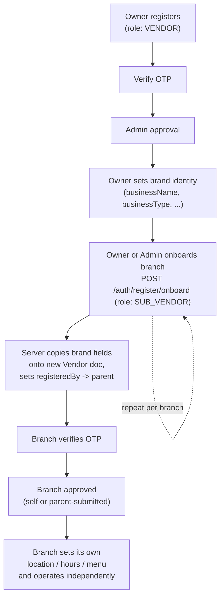

# Vendor & Branches (`SUB_VENDOR`)

## Overview

The `Vendor` module models both standalone merchants and multi-branch/chain merchants. There is **no separate `Branch` or `Outlet` model** — a branch is simply another `Vendor` document with `role: 'SUB_VENDOR'`, linked back to the owning brand account via `registeredBy: { id, model: 'Vendor' }`. This lets every downstream module (`Product`, `Cart`, `Order`, `Checkout`, `Payment`, `Invoice`, Meilisearch sync) treat a branch exactly like any single-location vendor — each branch's `vendorId` is just its own `Vendor._id`.

Source: `src/app/modules/Vendor/vendor.model.ts`, `vendor.interface.ts`, `vendor.service.ts`, `vendor.route.ts`; `src/app/modules/Auth/auth.service.ts` (onboarding, approval); full original write-up in `docs/vendor-branch-flow-guide.md` (preserved content below, reorganized).

## Purpose

Support both simple single-location restaurants/stores and multi-branch brands under one data model, without forcing a second collection or a parallel set of APIs for "chain" merchants.

## Architecture / Flow — Brand vs. Branch

| | Parent (`role: VENDOR`) | Branch (`role: SUB_VENDOR`) |
|---|---|---|
| Login / credentials | own `AuthUser` + `userId` | own `AuthUser` + `userId` (fully separate account) |
| Brand identity (`businessName`, `businessType`, `restaurantCuisineType`, `isHalal`, `NIF`) | source of truth | copied from parent **at onboarding time only** |
| `businessDetails.businessType` / `businessName` | editable — cascades to every branch automatically | locked — cannot be set directly on a branch by anyone, including staff (`403 SUB_VENDOR_CANNOT_CHANGE_BRAND_FIELDS`) |
| `businessDetails.branchName` | usually blank | its own — never inherited |
| Location, hours, delivery zone, menu, inventory, staff | its own | its own — set independently after onboarding |
| `businessDetails.totalBranches` | auto-recomputed | not applicable |

## Business Rules

### Full lifecycle

| # | Actor | Action | Endpoint | Effect |
|---|---|---|---|---|
| 1 | Owner | Register the brand | `POST /auth/register` `{email, role:"VENDOR", password}` | Creates one `Vendor` doc + one `AuthUser`, sends OTP |
| 2 | Owner | Verify email | `POST /auth/verify-otp` | Marks email verified |
| 3 | Admin | Approve the vendor | `PATCH /auth/:userId/approved-rejected-user` `{status:"APPROVED"}` | Vendor can log in and operate |
| 4 | Owner | Set brand identity | `PATCH /vendors/:vendorId` `{businessDetails:{businessName, businessType, restaurantCuisineType, isHalal, NIF}}` | Data every future branch inherits |
| 5 | Owner or admin | Onboard a branch | `POST /auth/register/onboard` `{email, role:"SUB_VENDOR", password}` (as owner), or same + `parentVendorId` (as `ADMIN`/`SUPER_ADMIN`) | New `Vendor` doc with `registeredBy` pointing at the parent; brand fields copied; `totalBranches` recomputed; OTP sent |
| 6 | Branch or owner | Verify, submit for review, get approved | `POST /auth/verify-otp` → `PATCH /auth/:branchUserId/submitForApproval` → admin approval | Same as steps 2-3, for the branch's own `userId` |
| 7 | Branch or owner | Set branch location/hours/name | `PATCH /vendors/:branchVendorId` `{businessLocation, businessDetails:{branchName, openingHours, closingHours, closingDays}}` | Branch-specific, never shared |
| 8 | Anyone in the family / admin | List brand + all branches | `GET /vendors/:vendorId/branches` | Returns `{brand, branches: [...]}` |

### Who can edit a branch

`PATCH /vendors/:branchVendorId` (and its doc-image variants) accepts the request from:
- **Staff** — `ADMIN`/`SUPER_ADMIN`.
- **The branch itself** — `currentUser.userId === existingVendor.userId`.
- **The parent owner** — caller is `role: 'VENDOR'` and the target's `registeredBy.id` points back at the caller (`registeredBy.model: 'Vendor'`). This shared `isParentOfBranch` check is also used by `copy-to-branch` and the sibling-lookup endpoint.

Anyone else gets `403 COMMON_ACCESS_DENIED`. **Exception:** `businessType`/`businessName` can never be set directly on a branch through this endpoint, not even by staff (see below).

The same parent-permission pattern applies to `PATCH /auth/:branchUserId/submitForApproval` — a `VENDOR` can submit the review request for a branch it registered, mirroring the existing `FLEET_MANAGER` → `DELIVERY_PARTNER` case in the same function (`src/app/modules/Auth/auth.service.ts`).

### Brand-wide fields cascade (`businessType` / `businessName`)

Enforced in `vendorUpdate` (`vendor.service.ts`):

1. **They can only be set on the parent's own record.** A `PATCH` targeting a `SUB_VENDOR` with `businessDetails.businessType` or `businessName` in the payload is rejected with `403 SUB_VENDOR_CANNOT_CHANGE_BRAND_FIELDS`, regardless of caller — including `ADMIN`/`SUPER_ADMIN`. This is deliberately not staff-bypassable: an admin's direct edit on a branch would be silently overwritten the next time the parent's field cascades. The only sanctioned path is to fix it on the parent.
2. **Changing it on the parent cascades to every branch.** When the `PATCH` target is the parent and the payload includes `businessType`/`businessName`, after the parent updates, the same field(s) are pushed onto every active `SUB_VENDOR` under it — one `Vendor.findOneAndUpdate` per branch (not a bulk `updateMany`), so each branch's Meilisearch resync hook fires individually and its indexed products reflect the new brand name/type immediately.

### Naming a branch (`businessDetails.branchName`)

`businessName` is the brand name and identical across every branch (copied from the parent at onboarding). `branchName` is an optional, free-text nickname for a specific location (e.g. "Downtown", "Airport Branch") that:
- Defaults to `''` and is **never** copied from the parent at onboarding (unlike `businessName`/`businessType`/`restaurantCuisineType`/`isHalal`/`NIF`).
- Is set via `PATCH /vendors/:branchVendorId {businessDetails:{branchName:"Downtown"}}`, by the branch itself once approved, or by the parent/admin.

Recommended display: `businessName + (branchName ? " — " + branchName : businessLocation.street)`.

### `POST /auth/register/onboard` — onboarding a branch

Callable by an already-approved `VENDOR` (onboarding their own branch), or by `ADMIN`/`SUPER_ADMIN` onboarding a branch on behalf of a vendor (requires `parentVendorId` — omitting it returns `400 PARENT_VENDOR_ID_REQUIRED_FOR_SUB_VENDOR`; an unresolvable/unapproved vendor ID returns `404 PARENT_VENDOR_NOT_FOUND`).

Server-side (`onboardUser`, `auth.service.ts`):
1. Checks `ROLE_ONBOARD_PERMISSIONS['sub-vendor']` — only `VENDOR`, `ADMIN`, `SUPER_ADMIN` may onboard a `SUB_VENDOR`.
2. Resolves the parent `Vendor` doc — the caller themselves if a `VENDOR`, or the vendor named by `parentVendorId` if staff.
3. Sets `registeredBy: { id: <parent Vendor._id>, model: 'Vendor' }` on the new document — always `model: 'Vendor'` for a `SUB_VENDOR` regardless of who onboarded it.
4. Copies `businessName`, `businessType`, `restaurantCuisineType`, `isHalal`, `NIF` from the parent's current `businessDetails`. Everything else is left at schema defaults.
5. Generates a new `userId` (`SV-xxxxxxxx`) and a brand-new, fully independent `AuthUser` credential.
6. Recomputes the parent's `businessDetails.totalBranches`.

### `GET /vendors/:vendorId/branches` — sibling lookup

Works whether `vendorId` belongs to the parent or a branch (parent resolved via `registeredBy.id` if a branch was passed). Returns `{brand, branches: [...]}`.

**Access control:** `ADMIN`/`SUPER_ADMIN` always allowed. Otherwise the caller's own `userId` must appear somewhere in the family (parent or a sibling branch).

### `POST /products/:productId/copy-to-branch` — pushing a menu item to a branch

Branches build their own menus manually by default — no shared/live-linked catalog exists between a parent and its branches. This endpoint is the one deliberate exception: a one-time copy of a single product from the owner's menu into one specific branch. Only the parent `VENDOR` can call it (`auth('VENDOR')`); it can only push the caller's own products into a branch actually registered under the caller.

Server-side (`copyProductToBranch`, `product.service.ts`):
1. **Ownership checks** — source product belongs to caller; target `vendorId` is a `SUB_VENDOR` registered under the caller. Failures: `404 PRODUCT_NOT_FOUND` / `403 TARGET_VENDOR_NOT_YOUR_BRANCH`.
2. **Category check** — the branch's `businessType` must match the product's category (`403/400 CATEGORY_NOT_UNDER_BUSINESS_TYPE`).
3. **Addon groups are cloned, never shared** — `AddonGroup.vendorId` is a hard ownership field, so a branch's product can never reference the parent's addon group. For each addon group on the source product: reused if the branch already has one with a matching bilingual `title`; otherwise a fresh `AddonGroup` is created under the branch, with newly generated option SKUs.
4. **A brand-new, fully independent `Product` is created** — new `productId`/`sku`/`slug`, `vendorId` set to the branch (not the caller), fresh variation SKUs, pricing/stock/images copied from the source, tax rate re-applied from current config.

After the copy, the branch's product has zero coupling back to the original — repricing, editing addons, or deleting it doesn't affect the parent's menu or any other branch. There is no bulk "push to all branches" action and no ongoing sync after the copy.

### Branch count (`totalBranches`)

Not a manually-trusted number — recomputed at every point the branch set changes:

| Trigger | Where |
|---|---|
| Branch onboarded | `onboardUser` |
| Branch soft-deleted | `softDeleteUser` |
| Branch permanently deleted | `permanentDeleteUser` |

All three funnel through `recomputeParentBranchCount` (`auth.service.ts`): `Vendor.countDocuments({'registeredBy.id': parentId, role:'SUB_VENDOR', isDeleted:false})`, then `totalBranches = count + 1`. A manual edit via `PATCH /vendors/:vendorId` is corrected back to reality the next time a branch is added/removed.

### Vendor approval & opening hours

Vendor approval is centralized in `Auth` (`submitForApproval`/`approvedOrRejectedUser`, `src/app/modules/Auth/auth.service.ts`), not a Vendor-module concern — see [`../02-authentication/registration-and-onboarding.md`](../02-authentication/registration-and-onboarding.md).

Opening hours use a dual mechanism: a manual toggle (`isManualControl`) plus a per-minute cron (`src/app/cron/vendorStore.crone.ts`) that computes open/closed from `openingHours`/`closingHours`/`closingDays`, with overnight-wraparound handling in `Europe/Lisbon` time, resetting manual overrides nightly at 00:00–00:05. See [`../07-operations/cron-and-background-jobs.md`](../07-operations/cron-and-background-jobs.md).

## Database Impact

`Vendor` collection shared by both `VENDOR` and `SUB_VENDOR` roles, differentiated by the `role` field. Key relationship: `registeredBy: {id, model}` → `Vendor` (branch's parent) — see [`../05-data-model/collections-reference.md`](../05-data-model/collections-reference.md) for full field/index detail.

## Validation

Brand-field lock (`SUB_VENDOR_CANNOT_CHANGE_BRAND_FIELDS`) and ownership checks (`isParentOfBranch`) are enforced in `vendor.service.ts`, not in Zod schemas — see `vendor.validation.ts` for request-shape validation and `product.service.ts`/`createProduct.utils.ts` for `copy-to-branch`'s category/addon validation.

## Authorization

Summarized in the tables above. Onboarding permission matrix (who may create which role) is centralized in `ROLE_ONBOARD_PERMISSIONS` (`src/app/modules/Auth/auth.constant.ts`) — see [`../02-authentication/permissions-and-rbac.md`](../02-authentication/permissions-and-rbac.md).

## Edge Cases

- Admin-onboarded branches historically got `registeredBy.model: 'Admin'` (pointing at the admin, not a vendor) — an orphaned branch invisible to sibling lookup, the cascade, and parent-manages-branch checks. This is now fixed: `registeredBy.model` is always `'Vendor'` for a `SUB_VENDOR`. Confirm current behavior directly against `auth.service.ts` if working on this area, since the codebase and audit note this was a recent change.
- A vendor can still type any number into `totalBranches` manually; it self-corrects on the next branch add/remove, not immediately.
- `copy-to-branch` performs a one-time copy only — there is no ongoing sync, and no bulk "all branches" variant.

## Related Modules

Product/Catalog ([`product-and-catalog.md`](product-and-catalog.md)), Auth ([`../02-authentication/registration-and-onboarding.md`](../02-authentication/registration-and-onboarding.md)), Order/Checkout ([`cart-checkout-order.md`](cart-checkout-order.md)), Meilisearch ([`../06-integrations/external-services.md`](../06-integrations/external-services.md)).

## Known Limitations (as documented in `docs/vendor-branch-flow-guide.md`)

- **No customer-facing brand grouping** — `getAllVendorsForCustomer` and Meilisearch sync treat every `Vendor` doc as an unrelated listing; a customer searching does not see "5 branches of Pizza Co near you" grouped — each branch is its own independent card.
- **No brand-level owner dashboard** — no aggregated view across branches' orders/analytics; each branch's dashboard shows only its own data.
- **No bulk/all-branches product push and no ongoing sync** after a `copy-to-branch` copy.

## Source References

- `src/app/modules/Vendor/vendor.model.ts`, `vendor.interface.ts`, `vendor.service.ts`, `vendor.route.ts`
- `src/app/modules/Auth/auth.service.ts` (`onboardUser`, `submitForApproval`, `approvedOrRejectedUser`, `recomputeParentBranchCount`)
- `src/app/modules/Product/product.service.ts` (`copyProductToBranch`), `createProduct.utils.ts`
- `src/app/cron/vendorStore.crone.ts`
- `docs/vendor-branch-flow-guide.md` (original integration guide; this document reorganizes and preserves its content)
