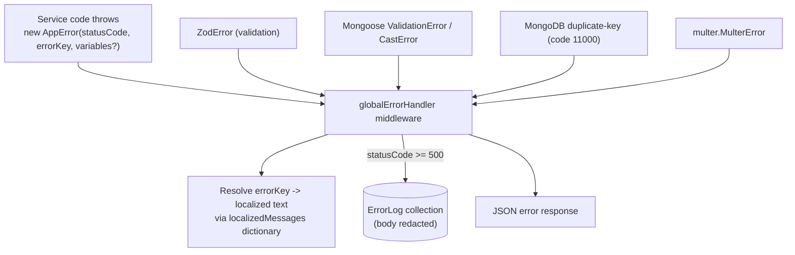

# Error Codes & Message System

## Overview

Deligo uses a centralized, bilingual (English/Portuguese) message-key dictionary rather than hardcoded error strings scattered through the codebase. Every thrown application error references a typed key (`TMessageKey`); the actual localized text is resolved only at the response layer, based on the request's `Accept-Language`.

## Purpose

Give a developer the vocabulary to recognize error categories, understand the response shape, and know where to look for the source of a specific message key.

## Architecture / Flow



## Message dictionary

`src/app/errors/messages.ts` aggregates one `*Messages` object per module's `*.messages.ts` file (one per business module that defines messages) plus `globalCommonMessages` (`src/app/constant/GlobalMessage/global.messages.ts`) into a single flat `localizedMessages` object. `TMessageKey = keyof typeof localizedMessages` is a compile-time union of every valid key in the app, used by `AppError`, `sendResponse`, and `globalErrorHandler`.

Each entry has shape `{ en: string | (vars) => string, pt: string | (vars) => string }` — either a static string or an interpolating function. Example categories, by module (representative, not exhaustive):

| Module | Example keys |
|---|---|
| Auth | `EMAIL_ALREADY_REGISTERED`, `INVALID_OTP`, `INVALID_OR_EXPIRED_OTP`, `LOGIN_SUCCESS`, `AUTHENTICATION_REQUIRED`, `ACCOUNT_BLOCKED`, `DEVICE_LOGGED_OUT`, `PASSWORD_RECENTLY_CHANGED`, `TOKEN_REUSE_DETECTED`, `SOCIAL_EMAIL_REQUIRED`, `PARENT_VENDOR_ID_REQUIRED_FOR_SUB_VENDOR` |
| Order | `CANNOT_ACCEPT_ORDER_FROM_CURRENT_STATUS`, `ORDER_MUST_BE_PENDING_TO_ACCEPT`, `INVALID_PICKUP_CODE`, `INVALID_DELIVERY_OTP`, `DELIVERY_OTP_MAX_ATTEMPTS_EXCEEDED`, `ORDER_ALREADY_CLAIMED_OR_EXPIRED`, `NO_PARTNER_FOUND`, `PARTNER_ALREADY_HAS_ACTIVE_ORDER` |
| Vendor | `SUB_VENDOR_CANNOT_CHANGE_BRAND_FIELDS`, `VENDOR_UPDATE_LOCKED_CONTACT_SUPPORT`, `GEO_ACCURACY_LESS_THAN_100` |
| Agreement | `VENDOR_PROFILE_INCOMPLETE_FOR_AGREEMENT`, `NOT_READY_FOR_SIGNING`, `INVALID_SIGNATURE_FORMAT`, `SIGNATURE_FILE_TOO_LARGE`, `DELIGO_DEFAULT_SIGNATURE_NOT_CONFIGURED`, `AGREEMENT_TYPE_ALREADY_EXISTS`, `AGREEMENT_ALREADY_SIGNED_CANNOT_EDIT`, `INITIAL_AGREEMENT_NOT_SIGNED` (thrown from `Auth`) — see [`../03-modules/vendor-agreement.md`](../03-modules/vendor-agreement.md) |
| Payment | `PAYMENT_ALREADY_IN_PROCESS`, `PAYMENT_GATEWAY_TEMP_UNAVAILABLE_502`, `GATEWAY_ERROR`, `PAYMENT_ALREADY_REFUNDED`, `PAYMENT_TOKEN_MISMATCH` |
| Product | `PRICE_REQUIRED_WHEN_NO_VARIATIONS`, `VARIATION_SKU_ALREADY_IN_USE`, `INSUFFICIENT_STOCK_WITH_AVAILABLE`, `CANNOT_DELETE_PRODUCT_WITH_ACTIVE_ORDER` |
| Global common | `SOMETHING_WENT_WRONG`, `VALIDATION_ERROR`, `MONGOOSE_VALIDATION_ERROR`, `INVALID_ID_ERROR`, `DUPLICATE_ENTRY_ERROR`, `COMMON_NOT_FOUND`, `COMMON_ACCESS_DENIED`, `RATE_LIMIT_EXCEEDED` |

**Naming inconsistency:** the `Invoice` module's message file is `invoice.message.ts` (singular), unlike every other module's `*.messages.ts` (plural) — a minor inconsistency worth knowing if searching the codebase.

## Error classes & handlers

Source: `src/app/errors/*.ts`.

- **`AppError`** — `class AppError extends Error`, constructed as `new AppError(statusCode, errorKey: TMessageKey, variables?, stack?)`. This is the standard way application/business-rule errors are thrown throughout the codebase — the key architectural point is that thrown errors reference a **typed message-dictionary key**, not a raw string.
- **`handleZodError`** — converts a `ZodError` into `{statusCode: 400, message, errorSources}`. Maps Zod's built-in issue codes to generic parameterized keys (`VALIDATION_REQUIRED`, `VALIDATION_INVALID_TYPE`, `VALIDATION_TOO_SMALL`, `VALIDATION_TOO_BIG`, `VALIDATION_INVALID_FORMAT`, `VALIDATION_INVALID_ENUM`) so every Zod field error is auto-localized without per-schema translation work. Custom `.refine()`/`ctx.addIssue()` business-rule checks can opt into a specific key via `params: {messageKey, variables}`. Overall key: `VALIDATION_ERROR`.
- **`handleValidationError`** — Mongoose `ValidationError`. Message text comes from Mongoose's own validator messages (not localized per-field). Overall key: `MONGOOSE_VALIDATION_ERROR`, statusCode 400.
- **`handleCastError`** — Mongoose `CastError` (e.g. invalid ObjectId in a URL param). Key: `INVALID_ID_ERROR`, statusCode 400.
- **`handlerDuplicateError`** — MongoDB duplicate-key errors (`err.code === 11000`). Extracts the duplicated value from the driver's message via regex, key: `DUPLICATE_ENTRY_ERROR` with `{value}`, statusCode 400.

Two integrations (`src/app/utils/storage.ts` for RustFS, `src/app/modules/Invoice/getPdAccessToken.ts` for Pasta Digital) throw plain `Error` objects rather than `AppError` — these bypass the structured `messageKey`/i18n behavior and surface as generic 500s. Worth knowing if debugging an upload or fiscal-sync failure.

## Global error-handling middleware

`src/app/middlewares/globalErrorHandler.ts`, registered last in `app.ts`. Dispatch order:
1. Resolves request language (`req.lang`, default `en`).
2. Defaults to statusCode 500 / `SOMETHING_WENT_WRONG`.
3. **Cleanup side effect**: if the request had files uploaded (`req.uploadedFiles`) during this request, deletes them from RustFS before responding — avoids orphaned files on a failed request.
4. Branches by error type, in order: `multer.MulterError` → `ZodError` → Mongoose `ValidationError` (by `err.name`) → Mongoose `CastError` (by `err.name`) → Mongo duplicate key (`err.code === 11000`) → `AppError` (resolves `errorKey` via the dictionary, falls back to `err.message` if the key isn't found) → generic `Error` fallback (uses `err.message` directly, not localized).
5. **Server-error logging**: if `statusCode >= 500`, persists an `ErrorLog` document with message, stack, statusCode, `userId` (from `req.user` if present), and redacted request details. Body redaction (`redactSensitiveFields`, recursive, max depth 3) replaces any key matching `/password|token|secret|otp|pin|cvv|cvc|cardnumber|nif/i` with `********` before logging — sensitive fields never land in the DB error log.
6. In `development` mode, the response additionally includes the raw `err` object and `err.stack`; stripped in production.

Multer file-upload errors map specifically: `LIMIT_FILE_SIZE` → `FILE_TOO_LARGE`, `LIMIT_FILE_COUNT` → `FILE_COUNT_EXCEEDED`, `LIMIT_UNEXPECTED_FILE` → `UNEXPECTED_FILE_FIELD`.

## API / Technical Details — Response envelopes

**Success** (`src/app/utils/sendResponse.ts`):
```json
{ "success": true, "message": "string | undefined", "meta": { "total": 0, "page": 1, "limit": 10, "totalPage": 1 }, "data": {} }
```
`message` is only populated if the controller passed a `messageKey`; `meta` only appears on paginated list responses.

**Error** (from `globalErrorHandler`, matches `openapi.json`'s documented envelope):
```json
{ "success": false, "message": "string", "errorSources": [ { "path": "string", "message": "string" } ], "err": {}, "stack": "string" }
```
(`err`/`stack` present only when `NODE_ENV === 'development'`.)

**404 — route not found** (`src/app/middlewares/notFound.ts`, separate from the global handler, hardcoded, not localized/not from the dictionary):
```json
{ "success": false, "message": "API Not Found !!", "error": "" }
```

## Rate limiting

`src/app/middlewares/rateLimiter.ts`, two Redis-backed (`rate-limit-redis`) limiter instances, both keyed by `req.ip` (deliberately not `X-Forwarded-For`, to prevent header-spoofing bypass):
- `global`: 100 requests/minute, applied to every request in `app.ts`.
- `auth`: 10 requests/minute, applied selectively inside Auth/Profile routes via `rateLimiter('auth')`.

On limit exceeded, both throw `AppError(429, 'RATE_LIMIT_EXCEEDED', {messagePrefix, secondsLeft})`, handled through the same `AppError` branch above.

## Edge Cases

- Falling back to `err.message` for an unrecognized `AppError.errorKey`, or for any generic `Error`, means some error text can bypass localization entirely — a caller building error UI purely off known message keys should not assume every error response's `message` is in the dictionary.
- The 404 handler's response shape (`error: ""`) differs from the standard error envelope (`errorSources: []`) — clients should not assume a uniform error shape across all failure modes.

## Related Modules

[`endpoint-index.md`](endpoint-index.md) for the endpoints these errors originate from; [`../08-known-gaps/technical-debt-and-todos.md`](../08-known-gaps/technical-debt-and-todos.md) for the RustFS/Pasta Digital non-`AppError` inconsistency.

## Source References

- `src/app/errors/AppError.ts`, `handleZodError.ts`, `handleValidationError.ts`, `handleCastError.ts`, `handlerDuplicateError.ts`, `messages.ts`
- `src/app/middlewares/globalErrorHandler.ts`, `notFound.ts`, `rateLimiter.ts`
- `src/app/utils/sendResponse.ts`
- `src/app/constant/GlobalMessage/global.messages.ts`
- `src/app/modules/*/​*.messages.ts` (per-module message dictionaries, ~40 files)
- `src/app/modules/ErrorLog/errorLog.schema.ts`
