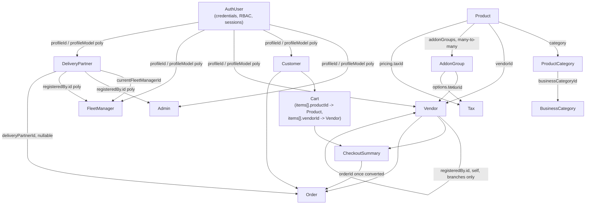
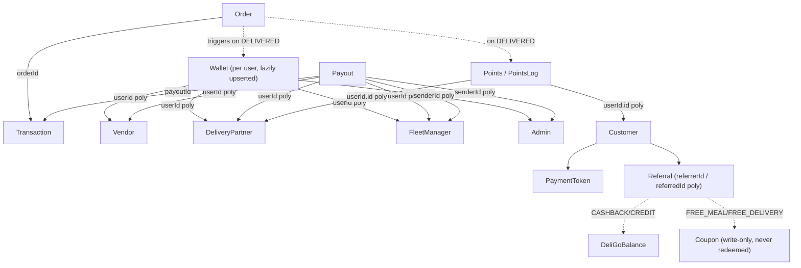
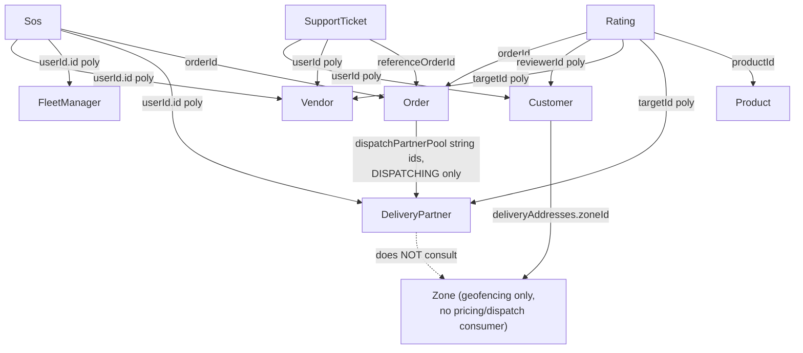

# Data Model Relationships

## Overview

Cross-collection relationships confirmed directly from Mongoose `ref`/`refPath` declarations in `*.model.ts` files — not inferred from naming convention alone. Polymorphic (`refPath`) relationships are marked `[poly]`. A few fields *look* like relationships but are plain strings with no `ref` at all — these are called out explicitly since they represent a naming-convention-only link, not an enforced/populatable one.

## Purpose

Give a new developer an accurate mental map of how collections connect, without having to grep every model file — including the places where a relationship is weaker or absent compared to what its field name suggests.

## Core identity & commerce flow

## Payments, payouts & loyalty

## Order dispatch & support

## Full relationship list (by domain)

**Identity / Access**
- `AuthUser.profileId` → `Customer | Vendor | FleetManager | DeliveryPartner | Admin` [poly, `refPath: profileModel`]
- `Admin.registeredBy`, `approvedBy`, `rejectedBy`, `blockedBy` → `Admin` (self)
- `LoginHistory.userId` → `AuthUser`
- `ActivityLog.authUserId` → `AuthUser`
- `Permission.createdBy` / `updatedBy` → `Admin`

**People / Accounts**
- `Vendor.registeredBy.id` → `Admin | Vendor` [poly — self-referential for `SUB_VENDOR` branches, this is the entire parent↔branch link]
- `Vendor.approvedBy` / `rejectedBy` / `blockedBy` → `Admin`
- `Vendor.businessDetails.businessType` → `BusinessCategory`
- `Vendor.cuisinesData` (virtual populate) → `Cuisine`, matched by `slug` string, **not** an ObjectId ref
- `Customer.referredBy` → `Customer` (self)
- `Customer.approvedBy` / `rejectedBy` / `blockedBy` → `Admin`
- `Customer.deliveryAddresses[].zoneId` → `Zone`
- `DeliveryPartner.registeredBy.id` → `Admin | FleetManager` [poly, immutable — who onboarded them]
- `DeliveryPartner.currentFleetManagerId` → `FleetManager` [mutable — canonical current assignment, admin-reassignable]
- `DeliveryPartner.operationalData.assignmentZoneId` / `currentZoneId` → `Zone` — **declared but never populated/read by any dispatch code**
- `DeliveryPartner.operationalData.currentOrderId` → `Order`
- `DeliveryPartner.approvedBy` / `rejectedBy` / `blockedBy` → `Admin`
- `FleetManager.registeredBy` → `Admin`
- `FleetManager.approvedBy` / `rejectedBy` / `blockedBy` → `Admin`

**Catalog**
- `Product.vendorId` → `Vendor`
- `Product.category` → `ProductCategory`
- `Product.addonGroups[]` → `AddonGroup` (many-to-many)
- `Product.pricing.taxId` → `Tax`
- `Product.approvedBy` → `Admin`
- `ProductCategory.businessCategoryId` → `BusinessCategory`
- `AddonGroup.vendorId` → `Vendor`
- `AddonGroup.options[].tax` → `Tax`
- `Ingredient.tax` → `Tax`

**Commerce**
- `Cart.customerId` → `Customer`
- `Cart.items[].productId` / `vendorId` → `Product` / `Vendor`
- `CheckoutSummary.customerId` / `vendorId` → `Customer` / `Vendor`
- `CheckoutSummary.items[].productId` / `vendorId` → `Product` / `Vendor`
- `CheckoutSummary.offer.offerApplied.bogoSnapshot.productId` → `Product`
- `CheckoutSummary.orderId` → `Order` (set once converted)
- `Order.customerId` / `vendorId` / `deliveryPartnerId` → `Customer` / `Vendor` / `DeliveryPartner`
- `Order.items[].productId` → `Product`
- `Order.statusHistory[].updatedBy`, `Order.pickup.verifiedBy` → **`'User'`, a model name with no corresponding collection** — dangling/dead reference, likely legacy
- `Offer.adminId` → `Admin`; `Offer.vendorId` → `Vendor`
- `Offer.bogo.buyProductId` / `getProductId` → `Product`; `Offer.bogo.buyCategoryId` → `ProductCategory`
- `Offer.applicableCategories[]` → `ProductCategory`; `Offer.applicableProducts[]` → `Product`
- `Coupon.userId` → `Customer | Vendor | DeliveryPartner | FleetManager | Admin` [poly]
- `IngredientOrder.vendorId` → `Vendor`; `IngredientOrder.adminId` → `Admin`
- `IngredientOrder.orderDetails[].ingredientId` → `Ingredient`

**Payments / Finance**
- `PaymentToken.customerId` → `Customer`
- `Payout.userId` → `Vendor | DeliveryPartner | FleetManager` [poly]
- `Payout.senderId` → `Admin | FleetManager` [poly]
- `Transaction.orderId` → `Order`; `Transaction.payoutId` → `Payout`
- `Transaction.userId` → `Customer | Vendor | FleetManager | DeliveryPartner | Admin` [poly]
- `Transaction.processedBy` → `Admin | FleetManager` [poly]
- `Wallet.userId` → `Admin | Customer | Vendor | FleetManager | DeliveryPartner` [poly]
- `DeliGoBalance.userId` → `Customer | Vendor | DeliveryPartner | FleetManager` [poly]
- `Points.userId.id` / `PointsLog.userId.id` → `Admin | Vendor | FleetManager | DeliveryPartner | Customer` [poly]
- `PointsLog.referenceId` → `Order | Referral | RewardClaim` [poly by `onModel` — **`RewardClaim` has no corresponding collection**]
- `Referral.referrerId` / `referredId` → `Customer | Vendor | DeliveryPartner` [poly]
- `Referral.referenceOrderId` → `Order`

**Logistics**
- `Zone` has no outbound refs — it is only ever referenced *from* `Customer` and `DeliveryPartner`, and even the latter reference is unread by dispatch logic (see [`../03-modules/delivery-and-dispatch.md`](../03-modules/delivery-and-dispatch.md)).

**Engagement**
- `Rating.reviewerId` → `Customer | Vendor | DeliveryPartner` [poly]; `Rating.targetId` → `Customer | Vendor | DeliveryPartner | Product` [poly]
- `Rating.productId` → `Product`; `Rating.orderId` → `Order`
- `Notification.receiverId` — plain string, matched to a collection by `receiverRole` convention, **not a Mongoose ref**
- `Sos.userId.id` → `Vendor | FleetManager | DeliveryPartner` [poly]; `Sos.orderId` → `Order`; `Sos.resolvedBy` → `Admin`
- `SupportTicket.userId` → `Admin | Customer | Vendor | FleetManager | DeliveryPartner` [poly]
- `SupportTicket.assignedAdminId` / `closedBy` → `Admin`; `SupportTicket.referenceOrderId` → `Order`
- `SupportMessage.ticketId` → `SupportTicket.ticketId` — value match on a string field, **not an ObjectId ref**

**Admin / Ops**
- `GlobalSettings.meta.updatedBy` → `Admin`
- `Agreement.createdBy` → `Admin`

**Infra / logging** — no `ref:` fields; `ErrorLog.userId`, `Notification.receiverId`, `EmailLog.to` are all loose strings.

**Standalone collections** (no outbound or inbound `ref` relationships): `RestrictedItem`, `Sponsorship`, `Permission` (targeted by `Admin.permissions[]` via string action code, not an ObjectId ref), `Counter`.

## Edge Cases

- **Polymorphic fields require `refPath`-aware populate calls.** Code (or documentation) that assumes a fixed `ref` on any field marked `[poly]` above will not populate correctly for every document.
- **Three relationships are weaker than their field name implies**: `Vendor.businessDetails.deliveryZoneId` is a plain `String`, not an ObjectId ref to `Zone`; `Order.statusHistory[].updatedBy`/`pickup.verifiedBy` point at a non-existent `'User'` model; `SupportMessage.ticketId` and `Notification.receiverId` are string-value matches, not Mongoose refs.
- **`RewardClaim`** appears in `PointsLog.onModel`'s enum but has no backing collection — a forward-looking/unbuilt reference.

## Related Modules

[`collections-reference.md`](collections-reference.md) for full field-level detail per collection.

## Source References

Every `src/app/modules/*/​*.model.ts`, cross-checked for `ref:`/`refPath:` declarations.
