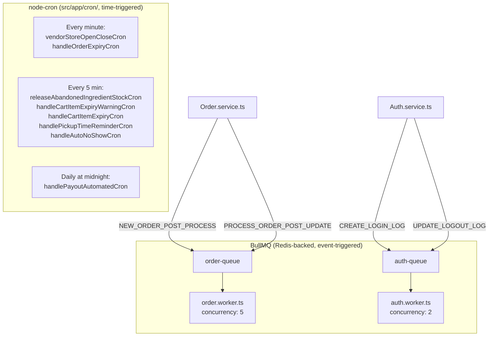

# Cron & Background Jobs

## Overview

Two mechanisms handle asynchronous/scheduled work: `node-cron` jobs (`src/app/cron/`, time-triggered) and BullMQ queues (`src/app/BullMQ/`, event-triggered, backed by Redis). Every handler in both systems wraps its logic in try/catch and logs failures — one job failing never crashes the process or blocks other jobs.

## Purpose

Give a developer a complete inventory of what runs on a schedule or in the background, so they know where to look when something should have happened automatically but didn't.

## Architecture / Flow

## Cron jobs (`node-cron`, orchestrated by `src/app/cron/index.ts`)

| Schedule | Handler(s) | File |
|---|---|---|
| Every minute (`* * * * *`) | `vendorStoreOpenCloseCron`, then `handleOrderExpiryCron` | `vendorStore.crone.ts`, `order.cron.ts` |
| Every 5 minutes (`*/5 * * * *`) | `releaseAbandonedIngredientStockCron` | `ingredientOrder.crone.ts` |
| Every 5 minutes | `handleCartItemExpiryWarningCron`, then `handleCartItemExpiryCron` | `cart.cron.ts` |
| Every 5 minutes | `handlePickupTimeReminderCron` | `order.cron.ts` |
| Every 5 minutes | `handleAutoNoShowCron` | `order.cron.ts` |
| Daily at midnight (`0 0 * * *`) | `handlePayoutAutomatedCron` | `payout.cron.ts` |

### `vendorStoreOpenCloseCron` (every minute)
Two responsibilities: (1) between `00:00`–`00:05` Lisbon time, resets every `APPROVED`, non-deleted vendor's `businessDetails.isManualControl` back to `false` (nightly manual-override reset); (2) for every `APPROVED` vendor not under manual control, computes `shouldBeOpen` from `openingHours`/`closingHours`/`closingDays` (with explicit overnight-wraparound handling), and if it differs from the stored `isStoreOpen`, updates the DB and emits a Socket.IO event (`emitVendorStoreStatusUpdate`, `source: 'cron'`) so connected clients get a live push. Touches: `Vendor`.

### `handleOrderExpiryCron` (every minute)
Finds `Order`s in `DISPATCHING` status whose `dispatchExpiresAt` has passed; atomically flips them to `AWAITING_PARTNER` (guarded update on the original status to avoid races), clears `dispatchPartnerPool`, appends a `statusHistory` entry, emits `REMOVE_ORDER_POPUP` to each pooled delivery partner and `ORDER_DISPATCH_EXPIRED` to the vendor. This is the same 120-second dispatch-expiry mechanism also enforced reactively when any partner hits `accept-dispatch-order` after expiry (see [`../03-modules/delivery-and-dispatch.md`](../03-modules/delivery-and-dispatch.md)). Touches: `Order`, `Vendor`.

### `handleCartItemExpiryWarningCron` / `handleCartItemExpiryCron` (every 5 minutes)
Implements the 12-hour cart-inactivity expiry with a 30-minute warning: the warning job finds items whose `lastActivityAt` crossed the warn threshold (`12h - 30min` ago) and marks them notified with a push; the removal job deletes items that were notified **and** whose 30-minute lead time has since elapsed — guaranteeing no removal without a prior warning even if a tick runs late. Deletes the whole `Cart` if it becomes empty, otherwise recalculates totals; invalidates the Redis cart cache key in all paths. Touches: `Cart`, `Customer`, Redis.

### `handlePickupTimeReminderCron` (every 5 minutes)
Finds non-terminal pickup orders whose `pickup.pickupTime` falls within the next 15 minutes and haven't yet been reminded (`pickup.reminderSentAt: null`); sends a bilingual push and stamps `reminderSentAt`. Touches: `Order`, `Customer`.

### `handleAutoNoShowCron` (every 5 minutes)
Auto-marks self-pickup orders `NO_SHOW` once uncollected past the vendor's closing time — RESTAURANT vendors use same-day closing time (pickup is always same-day for restaurants); STORE vendors use the customer's actual scheduled `pickup.pickupTime` date (STORE pickup can be scheduled up to 2 days ahead). This corrects an earlier limitation noted in the original `docs/order-flow-guide.md`, which predates this cron. Touches: `Order`, `Vendor` (populated).

### `releaseAbandonedIngredientStockCron` (every 5 minutes)
Inside a Mongo session/transaction, finds `IngredientOrder`s stuck in `paymentStatus: PROCESSING`/`orderStatus: PENDING` beyond a 15-minute lock timeout; restores reserved stock back to `Ingredient` documents and deletes the abandoned order record. Touches: `IngredientOrder`, `Ingredient`.

### `handlePayoutAutomatedCron` (daily at midnight)
Reads `GlobalSettings.payout`; no-ops if `autoGenerate` is off. Otherwise, if today (Lisbon time) is one of the configured `payoutDays`, calls `PayoutServices.initiateAutomatedSettlement()`, which auto-creates `PENDING` payouts for wallets with `available >= minPayoutAmount` (excluding users with an existing pending payout, and fleet-managed delivery partners, who are settled via their fleet manager instead). Touches: `GlobalSettings`, `Payout` (via service call). See [`../03-modules/payments-and-payouts.md`](../03-modules/payments-and-payouts.md).

## BullMQ

Config: `src/app/config/bullmq.ts` — a shared `queueConnection` (ioredis-compatible) built from `config.redis.{host,port,password}` with `maxRetriesPerRequest: null` (a BullMQ requirement for blocking commands).

Both queues share `defaultJobOptions`: 3 attempts, exponential backoff starting at 5000ms, `removeOnComplete: true` (completed jobs aren't retained in Redis).

### `order-queue` (`src/app/BullMQ/Queue/order.queue.ts`)
Worker: `order.worker.ts`, concurrency 5.

**`NEW_ORDER_POST_PROCESS`** — pushed from `order.service.ts` (`finalizeCheckoutIntoOrder`) after payment confirmation. Handler (`processNewOrderPostProcess`):
1. Syncs the order to Pasta Digital (`OrderPdService.syncOrderWithPd`).
2. Sends an invoice email with PDF attachment to the customer (own try/catch — a mailer failure doesn't fail the job).
3. Pushes an FCM notification to the vendor.
4. Removes the ordered items from both the Redis cart cache and the `Cart` document, recalculating totals for whatever remains (cart auto-healing after checkout).

**`PROCESS_ORDER_POST_UPDATE`** — pushed after any order status transition. Handler (`processOrderPostUpdate`): on `orderStatus === 'DELIVERED'`, inside one Mongo transaction: awards customer/delivery-partner loyalty points, distributes referral bonuses, and performs a full ledger split across Vendor/DeliveryPartner (unless fleet-managed)/Admin/FleetManager wallets, generating a matching `Transaction` row per leg; updates the delivery partner's `operationalData` (clears current order, sets `IDLE`, increments counters). On `orderStatus === 'REASSIGNMENT_NEEDED'`, resets the delivery partner to `IDLE` and increments cancellation counters. After the transaction commits, sends push notifications (customer always; vendor only for `ON_THE_WAY`/`DELIVERED`) — notification failures here are caught separately and only logged. Full financial mechanics in [`../03-modules/payments-and-payouts.md`](../03-modules/payments-and-payouts.md).

### `auth-queue` (`src/app/BullMQ/Queue/auth.queue.ts`)
Worker: `auth.worker.ts`, concurrency 2.

**`CREATE_LOGIN_LOG`** — pushed from 9 call sites across `auth.service.ts` (every login variant: password, OTP, social, onboarding). Creates a `LoginHistory` document, normalizing the client-supplied device-type string into a fixed enum. Re-throws on failure (BullMQ retry applies).

**`UPDATE_LOGOUT_LOG`** — pushed on logout and on password-change-triggered session revocation. Finds the still-open `LoginHistory` record (matching `sessionId`+`userId`, no `logoutAt` yet), computes `durationSec`, stamps `logoutAt`. If no matching open record is found, logs a warning and no-ops rather than throwing.

## Edge Cases

- Auth-queue and order-queue jobs are asynchronous relative to the triggering HTTP request — a client receiving a successful response does not guarantee the corresponding login-history row, invoice email, or wallet credit has been written yet (typically within seconds, but not synchronously).
- `handlePayoutAutomatedCron` and `handleAutoNoShowCron`/`handlePickupTimeReminderCron` all depend on `GlobalSettings`/vendor data being correctly configured — a misconfigured `payoutDays` or vendor `closingHours` silently changes when these fire, with no alerting if the expected trigger never occurs.

## Related Modules

[`../03-modules/cart-checkout-order.md`](../03-modules/cart-checkout-order.md), [`../03-modules/delivery-and-dispatch.md`](../03-modules/delivery-and-dispatch.md), [`../03-modules/payments-and-payouts.md`](../03-modules/payments-and-payouts.md), [`../02-authentication/session-and-token-management.md`](../02-authentication/session-and-token-management.md).

## Source References

- `src/app/cron/index.ts`, `vendorStore.crone.ts`, `order.cron.ts`, `cart.cron.ts`, `ingredientOrder.crone.ts`, `payout.cron.ts`
- `src/app/config/bullmq.ts`
- `src/app/BullMQ/Queue/order.queue.ts`, `auth.queue.ts`
- `src/app/BullMQ/Workers/order.worker.ts`, `auth.worker.ts`, `index.ts`
- `src/app/modules/Order/order.service.ts`, `src/app/modules/Auth/auth.service.ts`
