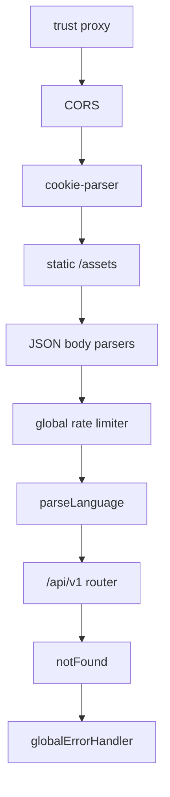
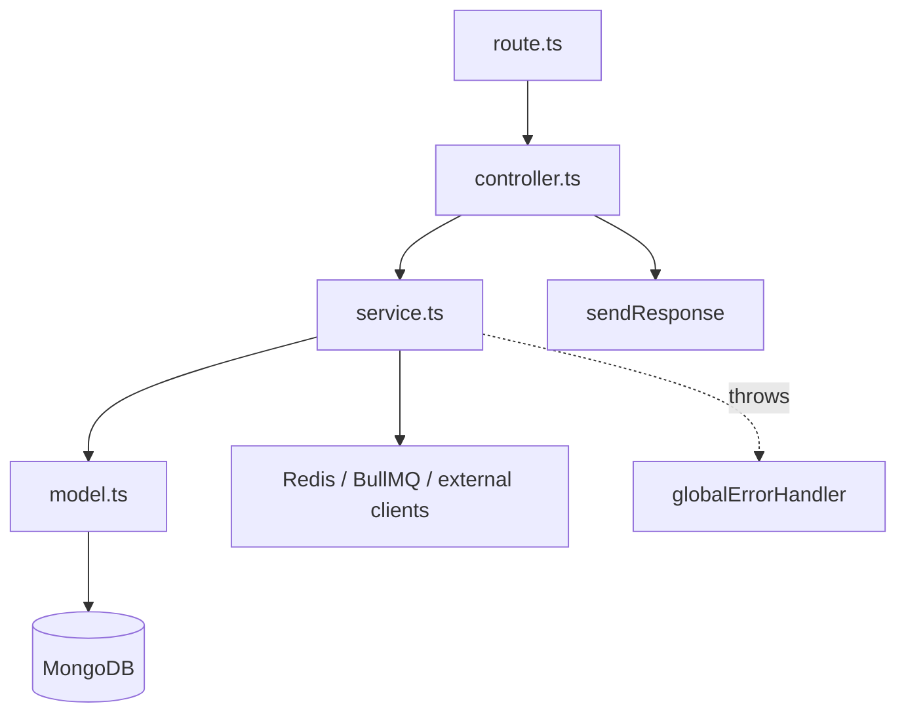
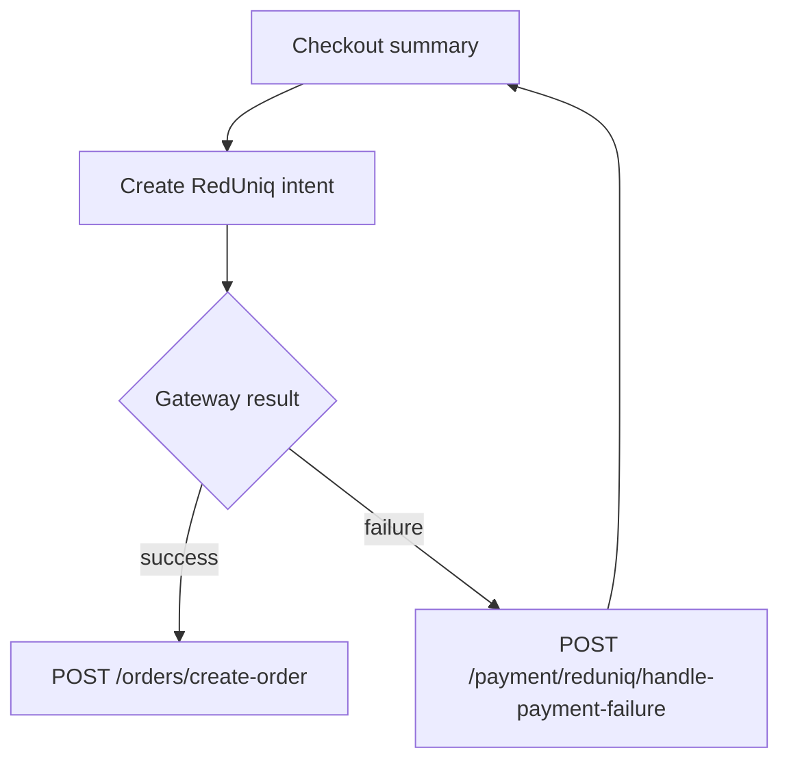
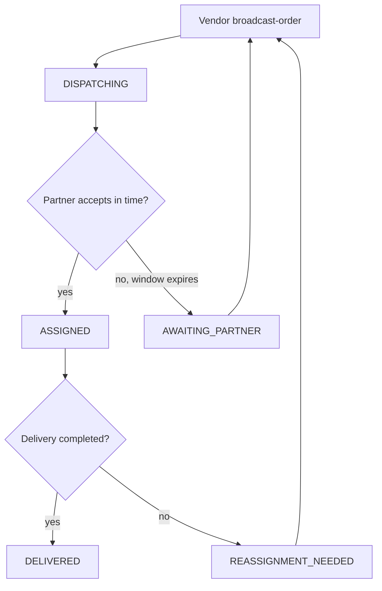
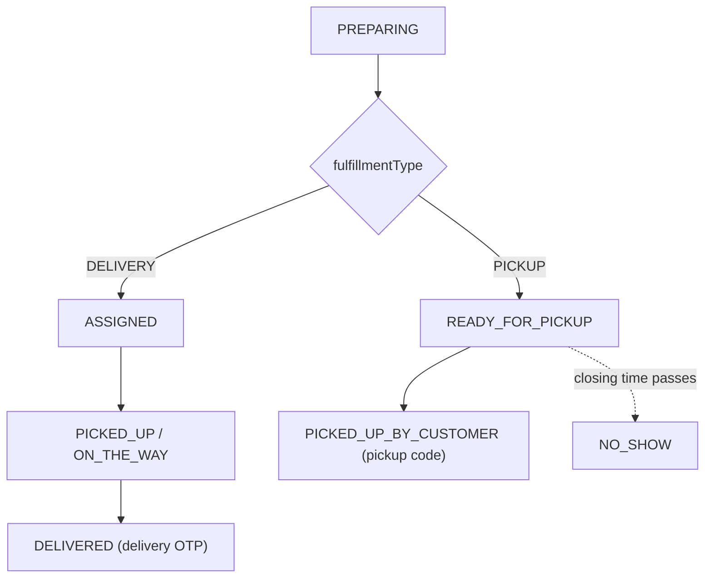

# Architecture

The backend is a **modular monolith**. One process serves the REST API, the
Socket.IO channel, the cron scheduler, and the BullMQ workers. All feature code
lives under `src/app/modules/<Feature>/` and follows the same file layout.

## Bootstrap

Two files start the process:

| File | Responsibility |
| --- | --- |
| `src/app.ts` | Builds the Express `Application`: middleware chain, the `/api/v1` router, the health route (`GET /`), `notFound`, and `globalErrorHandler`. Exports the app; starts nothing. |
| `src/server.ts` | Wraps the app in an `http.Server` and runs `bootstrap()`. |

`bootstrap()` in `src/server.ts` runs these steps in order:

1. `mongoose.connect(config.db_url)`
2. `seed()` — creates the `SUPER_ADMIN` (from env) and a default `GlobalSettings`
   document if missing, inside a transaction (`src/app/utils/seeding.ts`)
3. `initializeSocket(server)` — attaches Socket.IO
4. `RedisService.initKeySpaceNotification()`
5. `initializeMeilisearchIndexes()` — creates/configures the `food_items` index;
   **non-fatal** if Meilisearch is unreachable
6. `initAllCronJobs()`
7. `server.listen(config.port)`

BullMQ workers are started as an import side effect
(`import './app/BullMQ/Workers/index'` at the top of `server.ts`).

`process.on` handlers cover `uncaughtException`, `unhandledRejection`,
`SIGTERM`, and `SIGINT` with a graceful `server.close()`.

## Application middleware chain

Order matters; this is the exact sequence in `src/app.ts`:



- **CORS** — origin is allowed only if it is in `config.origins` (comma-split
  `ORIGINS`); credentials are enabled so the `accessToken` cookie is accepted.
- **Rate limiting** (`src/app/middlewares/rateLimiter.ts`) — a Redis-backed
  `express-rate-limit`. `global` = 100/min/IP; `auth` = 10/min/IP and is applied
  again inside `auth.route.ts` on sensitive endpoints. On trip it throws
  `AppError(429, 'RATE_LIMIT_EXCEEDED')`.
- **`parseLanguage`** — reads `Accept-Language`, keeps it only if it is a
  supported code, else `en`. Everything downstream localizes off `req.lang`.

## Per-route middleware pattern

Each route composes the same two guards before its controller:

```ts
router.post(
  '/create-order',
  auth('CUSTOMER'),                                   // authN + authZ
  validateRequest(OrderValidation.createOrder...),    // Zod body validation
  OrderControllers.createOrderAfterRedUniqPayment,
);
```

### `auth(...roles[, permissions[]])` — `src/app/middlewares/auth.ts`

A single middleware factory that does a lot:

1. Extracts the token from `Authorization` (`Bearer` or raw) or the
   `accessToken` cookie; `401 AUTHENTICATION_REQUIRED` if absent.
2. `verifyToken` against `JWT_ACCESS_SECRET`.
3. Loads the `AuthUser` by `{ userId, role }`; rejects if missing, `isDeleted`,
   or `status === BLOCKED`.
4. **Device session check** — the token's `deviceId` must exist in
   `authUser.loginDevices` and be `isLoggedIn: true`, else `DEVICE_LOGGED_OUT`.
5. **Password-change check** — if `passwordChangedAt` is newer than the token
   `iat`, reject with `PASSWORD_RECENTLY_CHANGED`.
6. **Role check** — `requiredRoles` must include the token role.
7. Loads the role profile document via `mongoose.model(authUser.profileModel)`
   and attaches it as `req.user`.
8. **Admin permission check** — when called as
   `auth('ADMIN', ['SOME_ACTION'])`, every listed `TPermissionAction` must be
   present in the admin's `permissions[]`.
9. **Agreement gate** — for roles that require a signed legal agreement, a
   non-GET or order-restricted request by an `APPROVED` user with an unsigned
   current agreement is blocked with `403 AGREEMENT_RESIGN_REQUIRED` (carrying a
   structured `data` payload). Exempt paths are configured in
   `Agreement/agreement.config.ts`.

### `validateRequest(schema)` — `src/app/middlewares/validateRequest.ts`

Runs `schema.parseAsync({ body })` and **replaces `req.body` with the parsed
value**. `validateRequestCookies` does the same for `{ cookies }`. A `ZodError`
is normalized by `handleZodError` in the global error handler.

## Module anatomy

Every feature under `src/app/modules/<Feature>/` uses the same suffix
convention. Not every module has every file, but the roles are fixed:

| File | Role |
| --- | --- |
| `*.route.ts` | Express `Router`; wires `auth` + `validateRequest` + controller. Exported and registered in `src/app/routes/index.ts`. |
| `*.controller.ts` | Thin. Unwraps `req`, calls the service, shapes the response through `sendResponse`. Wrapped in `catchAsync`. |
| `*.service.ts` | All business logic and persistence. Returns `{ messageKey, variables?, data, meta? }`. |
| `*.model.ts` | Mongoose schema + model. |
| `*.interface.ts` | TypeScript types for the module. |
| `*.validation.ts` | Zod schemas. |
| `*.constant.ts` | Enums / literals (statuses, tiers, limits). |
| `*.messages.ts` | `{ KEY: { en, pt } }` localization map, merged into `src/app/errors/messages.ts`. |
| `*.pushMessages.ts` / `*.emails.ts` | Notification / email copy for the module. |
| `*.utils.ts` | Response formatting and pure helpers. |
| `*.worker.ts` | BullMQ job handlers for the module. |

The HTTP router (`src/app/routes/index.ts`) mounts ~45 module routers under
`/api/v1` (e.g. `/auth`, `/orders`, `/payment`, `/wallets`, `/vendors`,
`/search`).



The service layer is where `QueryBuilder`, transactions, queue producers, and
the circuit-breakered integration clients are used — see
[Shared infrastructure](#shared-infrastructure) below.

## Shared infrastructure

| Concern | Where | Notes |
| --- | --- | --- |
| Config | `src/app/config/index.ts` | One default-export object reading `process.env`; loads `.env` from the process CWD. |
| Errors | `src/app/errors/` | `AppError(statusCode, messageKey, variables?, stack?, data?)`; handlers for Zod, Mongoose `ValidationError`/`CastError`, duplicate-key `11000`, Multer. |
| Responses | `src/app/utils/sendResponse.ts` | Localizes `messageKey` with `req.lang`, emits `{ success, message, meta, data }`. |
| Async wrapper | `src/app/utils/catchAsync.ts` | Forwards rejected promises to `next(error)`. |
| Pagination / filtering | `src/app/builder/QueryBuilder.ts` | `search / filter / sort / paginate / fields / countTotal`. |
| Localization | `parseLanguage` + `resolveLocalizedMessage` | `en` / `pt`; message values may be strings or `(vars) => string`. |
| IDs | `src/app/utils/*` | `customNanoId` (A–Z0–9); prefixes such as `C-`, `V-`, `SV-`, `D-`, `FM-`, `A-`, `SA-` for users and `TXN-` for transactions. |
| Storage | `src/app/utils/storage.ts` | Uploads to RustFS; throws on missing config at import time. |
| Circuit breakers | `src/app/utils/circuitBreaker.ts` | `opossum` wrapper (default 50% error threshold, 20s reset) used by every outbound integration. |

## Background processing

Two independent mechanisms.

### `node-cron` — `src/app/cron/index.ts`

| Schedule | Job(s) |
| --- | --- |
| `* * * * *` | `vendorStoreOpenCloseCron`, `handleOrderExpiryCron` |
| `*/5 * * * *` | abandoned ingredient-stock release; cart-item expiry + pre-expiry warning; self-pickup reminder; auto-`NO_SHOW` for uncollected pickup orders |
| `0 0 * * *` (Europe/Lisbon) | `handlePayoutAutomatedCron` |
| `0 3 * * *` (Europe/Lisbon) | `handleActivityLogRetentionCron` |

The daily jobs pin `timezone: config.default_timezone` so they fire on platform
time regardless of the host clock.

### BullMQ — `src/app/BullMQ/`

Redis-backed queues with retries. Producers call `queue.add(jobName, data)`;
workers are registered on process start.

| Queue | Job names | Handler |
| --- | --- | --- |
| `order-queue` | `NEW_ORDER_POST_PROCESS`, `PROCESS_ORDER_POST_UPDATE` | `Order/order.worker.ts` (concurrency 5) |
| `auth-queue` | `CREATE_LOGIN_LOG`, `UPDATE_LOGOUT_LOG` | `BullMQ/Workers/auth.worker.ts` |
| `agreement-queue` | `NOTIFY_AGREEMENT_VERSION_PUBLISHED` | `BullMQ/Workers/agreement.worker.ts` |

`order-queue` uses `attempts: 3` with exponential backoff and
`removeOnComplete`. Post-processing (notifications, logs, side effects) is moved
off the request path this way, so order creation and status changes respond
quickly.

## Realtime (Socket.IO)

Initialized in `src/app/lib/Socket/index.ts` on the shared HTTP server, with the
same CORS allowlist as the REST app.

- **Handshake auth** (`Socket/auth.middleware.ts`) — `jwt.verify` on
  `socket.handshake.auth.token` with `JWT_ACCESS_SECRET`; the decoded user is
  put on `socket.data.user`. No token / bad token ⇒ connection rejected.
- On `connection`, event groups are registered: support chat, rider live
  location, SOS alerts, order events, shop (vendor) open/close status.
- Server code emits to rooms like `user_<userId>` (e.g. the cron layer emits
  `ORDER_DISPATCH_EXPIRED` to the vendor's room).
- `getIO()` exposes the singleton to non-socket code; it throws
  `SOCKET_NOT_INITIALIZED` if called before boot.

## External integrations

Each has a dedicated client and an `opossum` circuit breaker; most also retry
transient failures via `withRetry`.

| Integration | Client | Used for |
| --- | --- | --- |
| RedUniq (REDUNIQ) | `src/app/lib/httpClients/redUniqClient.ts` | Card / MB WAY payments, saved-card tokens, refunds, gateway notification webhook (`POST /payment/reduniq/notification`, unauthenticated) |
| Pasta Digital | `src/app/lib/httpClients/pastaDigitalClient.ts` | Fiscal e-invoice creation and invoice-PDF retrieval |
| Google Maps | `src/app/lib/httpClients/googleMapsClient.ts` | Road distance / geocoding for delivery pricing and dispatch |
| Firebase Cloud Messaging | `src/app/config/firebase.ts` + `utils/sendPushNotification.ts` | Push notifications; invalid-token errors are detected and pruned |
| Gmail SMTP (Nodemailer) | `src/app/utils/emailSender.ts` | Transactional email from Handlebars templates in `views/` |
| BulkGate | `src/app/utils/sendMobileOtp.ts` | SMS OTP |
| Google / Facebook OAuth | `src/app/utils/verifySocialToken.ts` | Customer social login token verification |
| Meilisearch | `src/app/lib/meiliClient.ts` | Food search index |
| OpenAI | `src/app/config/openai.ts` | AI product descriptions |
| RustFS (S3 API) | `src/app/utils/storage.ts` | Image and generated-PDF storage |

## Important cross-module flows

- **Checkout → payment → order.** `Checkout` builds and stores a checkout
  summary; `Payment` creates a RedUniq intent against that summary; on a
  successful gateway notification the client calls `Order` `create-order`, which
  writes the `Order` plus its payout math and enqueues
  `NEW_ORDER_POST_PROCESS`.
- **Dispatch.** A vendor calls `broadcast-order`; the order moves to
  `DISPATCHING` with a `dispatchPartnerPool` and a `dispatchExpiresAt`.
  Delivery partners accept via `accept-dispatch-order`; `handleOrderExpiryCron`
  clears expired dispatch windows and notifies the vendor. Search widens over
  distance tiers (`DELIVERY_SEARCH_TIERS_METERS = [3000, 4000, 5000]`).
- **Self-pickup.** `PICKUP` orders generate a 6-digit `pickup.code`
  (`select: false`); the vendor verifies it at `verify-pickup`. A
  `READY_FOR_PICKUP` pickup order still uncollected once the vendor's closing
  time passes is auto-marked `NO_SHOW` by the `*/5` cron.
- **Settlement.** Order completion produces `Transaction` ledger rows and moves
  balances on the recipients' `Wallet`; `Payout` batches owed balances to
  vendors, riders, and fleet managers, driven by the midnight payout cron.
- **Agreements.** New users in gated roles must sign the current agreement
  version; the `auth` middleware enforces re-signing when a new version is
  published (notified through `agreement-queue`).

### Branch cases

**Payment — success vs. failure.** No `Order` exists until the payment clears.



**Delivery dispatch — accept, expiry, reassignment.** `broadcast-order` is valid
from `AWAITING_PARTNER` and `REASSIGNMENT_NEEDED`, so both paths loop back to a
re-broadcast.



**Fulfilment — delivery vs. pickup terminal states.**



See **[Data Model](../02-platform/data-model.md)** for the collections these
flows touch and **[Conventions](./conventions.md)** for the code patterns they
share.
