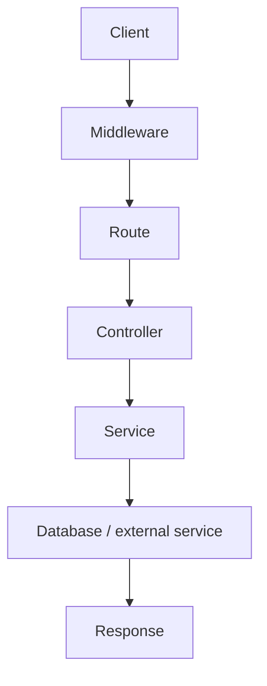
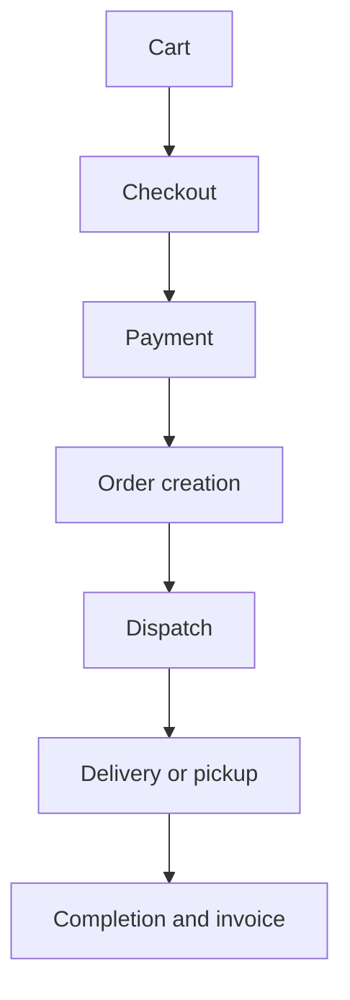

# System Overview

The Deligo backend (`DeliGo` in `package.json`) is the single API server behind the
Deligo food-delivery marketplace. It is a **Node.js / Express / TypeScript
monolith backed by MongoDB**, exposing one versioned REST surface under
`/api/v1` plus a Socket.IO realtime channel on the same HTTP server.

It is built for the Portuguese market: the platform timezone is hard-coded to
`Europe/Lisbon` (`src/app/config/index.ts`), amounts are handled in euros, and
VAT rates, fiscal e-invoicing, and payment rails are Portugal-specific.

## What the backend does

| Area | Responsibility |
| --- | --- |
| Identity & access | Registration, OTP/email verification, login (password, customer OTP, Google/Facebook social), JWT sessions with per-device tracking, RBAC + admin permissions, legal-agreement e-signing gate |
| Catalog | Vendors/branches, products with variations and add-ons, categories, ingredients, Meilisearch-backed food search |
| Ordering | Cart, checkout summary, payment intent, order creation, vendor accept/reject/prepare, delivery-partner dispatch and tracking, self-pickup with pickup codes, delivery OTP, reorder, cancellation/refund |
| Money | Wallets, transactions ledger, payouts to vendors/riders/fleet managers, platform commission & service charge, coupons/offers, loyalty points, referrals |
| Fulfilment support | Zones, taxes, global settings, ratings, support tickets, SOS alerts, sponsorships |
| Fiscal | Order invoice sync and PDF retrieval via the Pasta Digital e-invoicing service |
| Platform ops | Notifications (push/email/SMS), analytics, activity log, login history, error log, AI product-description generation |

## Actors and roles

Roles are defined in `src/app/constant/GlobalConstant/user.constant.ts`
(`USER_ROLE`). Every authenticated request carries exactly one role.

| Role | Typical user | Notes |
| --- | --- | --- |
| `SUPER_ADMIN` | Platform owner | Seeded from env on boot; stored in the `Admin` collection |
| `ADMIN` | Back-office staff | Additional fine-grained `permissions[]` checked per route |
| `FLEET_MANAGER` | Manages a pool of delivery partners | Can onboard delivery partners, process their payouts |
| `VENDOR` | Restaurant / store owner (parent account) | Can onboard its own branches |
| `SUB_VENDOR` | A branch of a vendor | Same `Vendor` collection, `parentVendorId` set |
| `DELIVERY_PARTNER` | Rider | Receives dispatched orders, live-location tracking |
| `CUSTOMER` | End user | Auto-approved on creation; may sign in with OTP or social login |

`SUB_VENDOR` accounts are stored in the **same `Vendor` collection** as their
parent (`ROLE_COLLECTION_MAP`), distinguished by `role` and `parentVendorId`.

## Technology stack

| Concern | Implementation |
| --- | --- |
| Runtime / language | Node.js 20 (Docker), TypeScript compiled to CommonJS, `target: es2016` (`tsconfig.json`) |
| HTTP framework | Express 4 (`src/app.ts`) |
| Database | MongoDB via Mongoose 8; transactions (`session.startTransaction`) used for multi-document writes |
| Validation | Zod schemas via `validateRequest` middleware |
| Auth | `jsonwebtoken` access/refresh tokens; `bcryptjs` password hashing |
| Cache / queues | Redis (`ioredis`) for cache, OTP storage, and the rate-limit store; BullMQ for background jobs |
| Realtime | Socket.IO bound to the same HTTP server |
| Search | Meilisearch (`food_items` index) |
| Scheduling | `node-cron` |
| Payments | RedUniq (REDUNIQ) gateway via a circuit-breakered Axios client, incl. saved-card tokens |
| Fiscal e-invoicing | Pasta Digital HTTP API |
| Notifications | Firebase Admin (FCM push), Nodemailer over Gmail SMTP (Handlebars templates), BulkGate (SMS OTP) |
| Files | RustFS (S3-compatible) via `@aws-sdk/client-s3`, images processed with `sharp` |
| PDF | Puppeteer + Handlebars (agreements, invoices) |
| Maps | Google Maps (distance / geocoding) |
| AI | OpenAI (`openai.responses.create`) for product descriptions |
| Resilience | `opossum` circuit breakers wrap every outbound third-party call |

## Request lifecycle at a glance

Each stage, and the mechanism behind it:

| Stage | What happens |
| --- | --- |
| **Client** | REST call to `/api/v1/...` (or a Socket.IO event). |
| **Middleware** | CORS allowlist, cookie-parser, JSON body, global rate limiter (Redis), `parseLanguage` (`en` / `pt`). |
| **Route** | `auth(roles[, permissions])`, then `validateRequest(zodSchema)`. |
| **Controller** | Thin — unwraps the request, calls one service function, passes the result to `sendResponse`. |
| **Service** | All business logic and persistence; returns `{ messageKey, data, meta }`. |
| **Database / external service** | MongoDB (a transaction when several documents change), or a circuit-breakered third-party call. |
| **Response** | `sendResponse` localizes the message key off `req.lang`. Any thrown error jumps straight to `globalErrorHandler`. |

The **[Architecture](./architecture.md)** page has the full middleware chain and
the per-route guard details.

## End-to-end order flow

| Phase | What it covers |
| --- | --- |
| **Cart** | Browse / search the catalog and add items (`/carts`). |
| **Checkout** | `POST /checkout` builds and stores a checkout summary. |
| **Payment** | A RedUniq payment intent is created against the summary; the gateway confirms through its notification webhook. |
| **Order creation** | `POST /orders/create-order` writes the `Order` and its payout math, then enqueues `NEW_ORDER_POST_PROCESS`. |
| **Dispatch** | Vendor accepts and prepares. For delivery, `broadcast-order` moves the order to `DISPATCHING` for a rider pool; for pickup it becomes `READY_FOR_PICKUP`. |
| **Delivery or pickup** | Rider: picked up → on the way → delivered (delivery OTP). Pickup: the customer collects with the pickup code. |
| **Completion and invoice** | `Transaction` ledger rows and a `Wallet` credit, later batched into a `Payout`; the fiscal invoice syncs through Pasta Digital. |

The **[Architecture](./architecture.md)** page expands each phase and diagrams
the branch cases — payment failure, rider reassignment, and pickup vs. delivery.

## Where to go next

- **[Architecture](./architecture.md)** — bootstrap, request lifecycle, module
  anatomy, background processing, realtime, and integrations in depth.
- **[Local Development](./local-development.md)** — how to run the backend and its
  infrastructure locally.
- **[Conventions](./conventions.md)** — the repeating patterns every module
  follows (error handling, response envelope, QueryBuilder, message keys).
- **[Data Model](../02-platform/data-model.md)** — the core collections and how
  identity, orders, and money relate.
