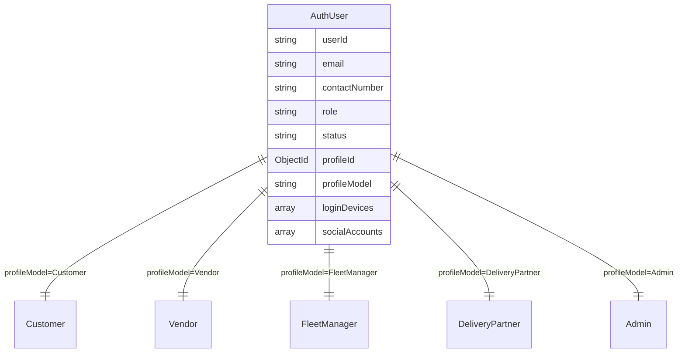
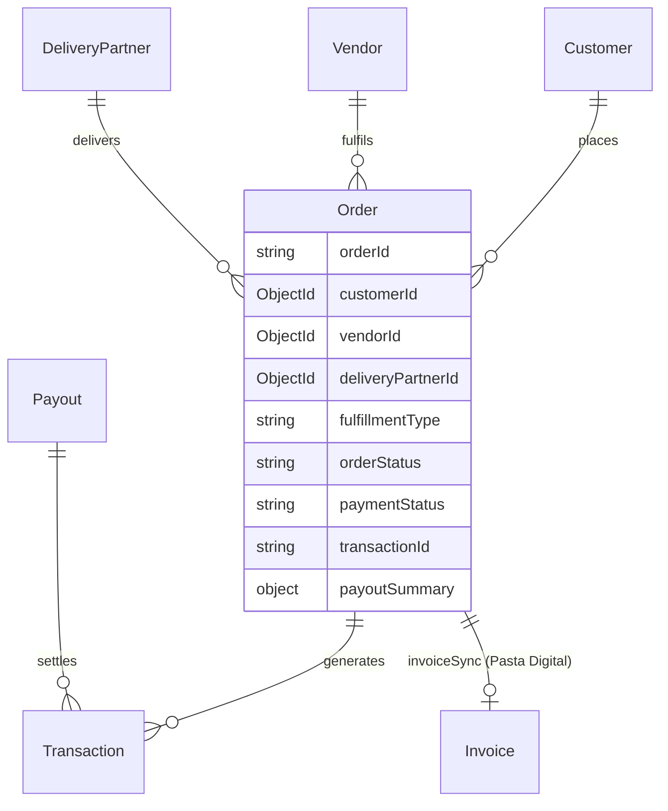
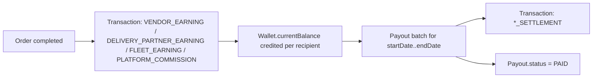

# Data Model

This page covers the **system-level** data model — the collections you need to
understand any feature, and the relationships between them. It is not a
field-by-field schema dump; read the individual `*.model.ts` files for that.

All models use Mongoose. Cross-collection links are either a plain `ObjectId`
`ref`, or a **dynamic reference** (`refPath`) where a companion `*Model` string
field names the target collection — this pattern is everywhere money and users
meet, because a "user" can be any of five profile collections.

## Two-tier identity: `AuthUser` → role profile

Identity is split into two documents:

| Collection | Holds | Notes |
| --- | --- | --- |
| `AuthUser` | Credentials and session state: `email` / `contactNumber`, `password` (hashed, `select` off), `role`, `status`, `loginDevices[]`, `socialAccounts[]`, `isEmailVerified`, `passwordChangedAt`, `twoFactorEnabled`, `isDeleted` | One per (identity, role). `userId` is the shared business key. |
| Role profile | Everything domain-specific about that user | One of five collections, chosen by `profileModel`. |

`AuthUser.profileId` + `AuthUser.profileModel` point at the profile document;
`AuthUser.userId` (e.g. `V-8F3KD91A`) is duplicated onto the profile as its own
`userId` and is the value that travels inside JWTs.

### Role → collection map

From `src/app/constant/GlobalConstant/user.constant.ts` (`ROLE_COLLECTION_MAP`):

| Role | Profile collection |
| --- | --- |
| `SUPER_ADMIN`, `ADMIN` | `Admin` |
| `CUSTOMER` | `Customer` |
| `FLEET_MANAGER` | `FleetManager` |
| `VENDOR`, `SUB_VENDOR` | `Vendor` |
| `DELIVERY_PARTNER` | `DeliveryPartner` |

Two roles share the `Vendor` collection and two share `Admin`, so lookups key on
**both** `userId` and `role`. After `auth` runs, `req.user` is the *profile*
document with `req.user.authUserId` set to the `AuthUser._id`.

### Status lifecycle

`AuthUser.status` ∈ `PENDING · SUBMITTED · APPROVED · REJECTED · BLOCKED`
(`USER_STATUS`). Customers are forced to `APPROVED` on creation (schema
`pre('save')` and the `Customer` schema default); vendors, delivery partners,
fleet managers and admins move through the approval flow. `auth` blocks
`BLOCKED` and `isDeleted` accounts outright.

### Sessions

`AuthUser.loginDevices[]` (`loginDeviceSchema`) is the session store: one entry
per device with `deviceId`, `fcmToken`, `isLoggedIn`, `lastLogin` / `lastLogout`.
A JWT is only valid while its `deviceId` entry exists and `isLoggedIn === true`,
which is what makes remote logout and "log out everywhere" possible without
server-side token storage. `LoginHistory` is a separate audit collection written
asynchronously via the `auth-queue`.

## Profile collections

| Collection | Key domain fields |
| --- | --- |
| `Customer` | `deliveryAddresses[]` (each with `zoneId`, `addressType`), `currentSessionLocation`, `NIF` |
| `Vendor` | `role` (`VENDOR` / `SUB_VENDOR`), `parentVendorId`, `registeredBy`, `businessDetails` (hours, cuisine, `NIF`, `preparationTimeMinutes`, `isStoreOpen`), `businessLocation`, `bankDetails`, `currentSessionLocation` |
| `DeliveryPartner` | vehicle / document details, live location, availability, fleet-manager link |
| `FleetManager` | manages a pool of delivery partners; can process their payouts |
| `Admin` | `permissions[]` (fine-grained `TPermissionAction` list checked by `auth`) |

### Vendor ↔ branch

`Vendor` is self-referential. A parent account has `role: 'VENDOR'` and
`parentVendorId: null`; each branch is another document in the same collection
with `role: 'SUB_VENDOR'` and `parentVendorId` pointing at the parent's `_id`.
`businessDetails.totalBranches` / `activeBranches` track the rollup.

## Identifiers and prefixes

| Entity | Format | Source |
| --- | --- | --- |
| User (`userId`) | `<PREFIX>-<8 char nanoid>` | `generateUserId.ts` |
| — Customer | `C-…` | |
| — Vendor / Sub-vendor | `V-…` / `SV-…` | |
| — Delivery partner | `D-…` | |
| — Fleet manager | `FM-…` | |
| — Admin / Super admin | `A-…` / `SA-…` | |
| Transaction (`transactionId`) | `TXN-<8>` | `generateTransactionId.ts` |
| Order (`orderId`) | assigned on creation, `unique` | `Order` model |
| Payout / support ticket / referral code | dedicated generators in `src/app/utils/` | |

nanoid alphabet is `1234567890ABCDEFGHIJKLMNOPQRSTUVWXYZ` (`customNanoId.ts`).
`ROLE_PREFIX_MAP` maps a prefix back to a role.

## Order

`Order` is the system's hub document and is heavily **denormalized on
purpose** — it snapshots prices, tax, commission, and payout math at creation
time so later catalog or settings changes never rewrite financial history.

Notable embedded structures (`src/app/modules/Order/order.model.ts`):

| Field | Purpose |
| --- | --- |
| `items[]` | Per-line snapshot: `productPricing`, `addons[]`, `itemSummary`, `commission` (DeliGo rate + VAT), `vendor` split (`vendorNetEarnings`) |
| `orderCalculation` | Subtotal, discounts, tax, service charge (+ VAT) |
| `delivery` | Charge, VAT, distance, estimated time |
| `payoutSummary` | The full split: `deliGoCommission` (incl. `totalPlatformGrossHolding`), `fleet`, `vendor.vendorNetPayout`, `rider.riderNetEarnings` |
| `paymentMethod` / `paymentStatus` / `transactionId` / `isPaid` | Payment linkage (method ∈ `CARD · MB_WAY · APPLE_PAY · PAYPAL · GOOGLE_PAY · OTHER`) |
| `orderStatus` + `statusHistory[]` | State machine + audit trail |
| `fulfillmentType` | `DELIVERY` or `PICKUP` |
| `pickup` | Self-pickup: 6-digit `code` (`select: false`), `readyAt`, `verifiedAt` |
| `deliveryOtp` | Delivery handoff OTP (`select: false`), `attempts` |
| `dispatchPartnerPool[]` / `dispatchExpiresAt` | Rider broadcast state while `DISPATCHING` |
| `invoiceSync` | Pasta Digital e-invoice result (`invoiceNo`, `atcud`, `signature`, `isSynced`) |
| `refundStatus` | `NOT_APPLICABLE · PENDING · REFUNDED · FAILED` |

`orderStatus` values (`ORDER_STATUS`): `PENDING · ACCEPTED · REJECTED ·
AWAITING_PARTNER · DISPATCHING · ASSIGNED · REASSIGNMENT_NEEDED · PREPARING ·
READY_FOR_PICKUP · PICKED_UP · ON_THE_WAY · DELIVERED · PICKED_UP_BY_CUSTOMER ·
CANCELED · NO_SHOW`.

## Money: wallet, transaction, payout

Three collections model platform money, plus two more for loyalty.

### `Transaction` — the ledger

Append-only record of every money movement. `userId` + `userModel` (dynamic
ref), optional `orderId` and `payoutId` links, `baseAmount` / `taxAmount` /
`totalAmount`, `status` ∈ `PENDING · SUCCESS · FAILED`, and a `type`:

`ORDER_PAYMENT · VENDOR_EARNING · FLEET_EARNING · DELIVERY_PARTNER_EARNING ·
VENDOR_SETTLEMENT · FLEET_SETTLEMENT · DELIVERY_PARTNER_SETTLEMENT ·
PLATFORM_COMMISSION · INGREDIENT_PURCHASE · REFERRAL_BONUS ·
PLATFORM_TAX_COLLECTION · PLATFORM_SERVICE_CHARGE · REFUND`.

### `Wallet` — running balances

One per user (`userId` unique, `userModel` dynamic ref). Tracks
`currentBalance`, `lockedBalance`, `lifetimeEarnings`, `currentTaxLiability`,
`lifetimeTaxProcessed`, `lastSettlementDate`. Order completion credits the
recipients' wallets; it is read by payouts and analytics.

### `Payout` — settlement batches

Money leaving the platform to a `Vendor`, `DeliveryPartner`, or `FleetManager`
(`userId` / `userModel`), initiated by an `Admin` or `FleetManager`
(`senderId` / `senderModel`). Covers a `startDate`–`endDate` window, carries
`amount`, `paymentMethod` (`BANK_TRANSFER · MOBILE_BANKING · CASH`),
`bankDetails`, `payoutProof`, and `status` ∈ `PENDING · PROCESSING · PAID`. A
**partial unique index** on `{ userId, status: 'PENDING' }` enforces at most one
open payout per user. The midnight payout cron creates these automatically.

### Loyalty: `Points` / `PointsLog`

`Points` is one balance document per user (`userId.id` + `userId.model`,
compound-unique), with `currentPoints` / `totalEarned` / `totalSpent` /
`expiryDate`. `PointsLog` is the per-event history (`EARN · REDEEM ·
REFERRAL_BONUS · REFUND · ADJUSTMENT · …`) referencing an `Order`, `Referral`,
or `RewardClaim`. A partial-unique index on
`{ userId.id, referenceId, transactionType: 'EARN' }` blocks double-crediting
the same order.

### `DeliGoBalance`

A separate per-user balance (`totalBalance`, `pendingBalance`, `totalEarned`,
`status`) used by the **referral** flow (`Referral/referral.service.ts`). It is
distinct from `Wallet`.

## Configuration: `GlobalSettings`

A single document (seeded on boot) holding platform-wide numbers the order math
reads: `delivery` pricing (base charge, per-km, min/max, free-above, max
distance, VAT), `commission` (`platformPercent`, `platformVatRate`,
`fleetManagerPercent`, `serviceCharge`), `ingredientsOrder` charges, order
rules, and referral milestones. Changing this document changes pricing for all
*future* orders only — existing orders keep their snapshot.

## Operational / audit collections

| Collection | Written by | Purpose |
| --- | --- | --- |
| `LoginHistory` | `auth-queue` worker | Login / logout audit |
| `ActivityLog` | services via `createActivityLog` | Business-event trail; pruned by the 03:00 retention cron |
| `ErrorLog` | `globalErrorHandler` | Every `5xx`, with sensitive fields redacted |
| `EmailLog` | `emailSender` | Outbound email record |
| `Notification` | notification service | In-app notification feed (paginated with QueryBuilder) |
