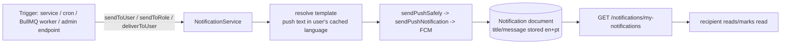

# Notification Flow

Describes the notification implementation as it exists in the repository. Paths are relative to `src/app/`. Anything not fully verifiable is marked **(unverified)** or listed under "Ambiguities".

## 1. Overview

There is one persisted, per-user notification system, `NotificationService` (`modules/Notification/notification.service.ts`), with these channels:

| Channel | Used by | Persisted? |
| --- | --- | --- |
| FCM push (Firebase Admin, data-only messages) | `NotificationService` | Yes, as a `Notification` document |
| In-app notification list (REST) | `/api/v1/notifications/*` | Reads the `Notification` collection |
| Email (Nodemailer via `EmailHelper`) | Order emails, cart-expiry, agreement, stock alert, refund, broadcast | Only in `EmailLog` (see §4); not linked to `Notification` |
| Socket.IO | Order status/OTP events, support and SOS alerts | No |

Notification data lives in the MongoDB `Notification` collection. FCM tokens live on `AuthUser.loginDevices[].fcmToken`. Socket.IO is **not** used by `NotificationService` (§6).

Major components: `notification.service.ts` (create/deliver/list/read/delete), `utils/sendPushNotification.ts` (FCM send behind a circuit breaker), `utils/notificationTemplates.ts` + `utils/resolveLocalizedNotification.ts` (message templates), `utils/userLanguageCache.ts` (per-user language), `config/firebase.ts` (Firebase Admin init), per-module `*.pushMessages.ts` templates.

## 2. Notification Architecture

Order of operations inside `deliverToUser`: load `AuthUser` by `userId` -> resolve push text -> send push to every non-empty token -> **then** create the `Notification` document. Push failures are swallowed inside `sendPushSafely`, so the document is written regardless of push outcome. `sendToUser` wraps this in `setImmediate` (fire-and-forget; errors only logged), so callers never await or see delivery failures. `deliverToUser` is exported and awaited directly only by the agreement worker.

Notifications are created after the triggering DB transaction commits (order flows push via `notificationsToEmit` or after `commitTransaction`); the notification write itself is never part of a business transaction.

## 3. Notification Data Model

`modules/Notification/notification.model.ts` (`timestamps: true`; no indexes, no TTL):

| Field | Purpose |
| --- | --- |
| `receiverId` (string) | Recipient's `AuthUser.userId` (custom id such as `C-...`), not an ObjectId. All ownership checks compare against `currentUser.userId`. |
| `receiverRole` | `AuthUser.role` at creation time. |
| `title`, `message` | `{ en, pt }`, both required. |
| `type` | `ORDER, OFFER, SYSTEM, PAYOUT, ACCOUNT, PAYOUT_ALERT, TRANSACTION, PROMOTIONAL, STOCK_ALERT, AGREEMENT, OTHER` (default `OTHER`). Senders found in code use `ORDER, ACCOUNT, PAYOUT, PAYOUT_ALERT, STOCK_ALERT, AGREEMENT, OTHER`, and `PROMOTIONAL` for broadcasts. `OFFER`, `SYSTEM`, `TRANSACTION` have no sender. |
| `data` | Free-form string map sent as the FCM `data` payload and stored (e.g. `orderId`, `orderStatus`; dispatch offers include JSON strings of delivery details and addresses). Its own `data.type` (e.g. `ORDER_STATUS`, `CART_ITEM_EXPIRY_WARNING`) is independent of the `type` column. |
| `isRead` | Default `false`. |
| `isActive` | Default `true`; only set to `false` by cart-expiry cleanup (§10). |
| `isDeleted` | Soft-delete flag, default `false`. |

## 4. Notification Creation Flow

Entry points (all in `notification.service.ts`):

| Function | Recipients | Push + record behavior |
| --- | --- | --- |
| `sendToUser(userId, content, data, channelId, type)` | One `AuthUser` | Async wrapper over `deliverToUser`. Record is written even when the user has no FCM token (a warning is logged). Returns silently if no `AuthUser` matches. |
| `deliverToUser(...)` | One `AuthUser` | Same logic, awaited by the caller. |
| `sendToRole(roles, content, data, channelId, type)` | Every non-deleted `AuthUser` in `roles` that has at least one non-empty `fcmToken` | Users with no token are not selected, so they get **no push and no record**. |
| `sendBroadcastNotification(payload)` | Admin broadcast, see below | Streams users with a cursor in `setImmediate`. |

`content` is either `{ messageKey, variables }` (template from `notificationTemplates.ts`, localized) or a raw `{ title, body }` (used only by broadcast). A key missing from the templates yields title = key, body = `''`. `channelId` is `'order_notification'` or `'default'` and travels inside the FCM data payload. Recipient `userId` values come from the triggering code path (profile `userId` of vendor, customer, rider, or admin roles).

Broadcast (`POST /notifications/broadcast`, `auth('ADMIN','SUPER_ADMIN')`, controller also writes an activity log): `communicationType` `EMAIL | PUSH | BOTH`, `targetAudience` (non-empty array of role strings, not enum-validated; upper-cased before matching `AuthUser.role`), optional `customUserIds`, `{name}` in the body is replaced with the profile first name. PUSH/BOTH only select users with a token; EMAIL sends `broadcast-email` when the user has an email. A `Notification` is stored for every processed user (title/body copied to both `en` and `pt`, `type` default `PROMOTIONAL`). The HTTP response returns immediately (`BROADCAST_PROCESSING_STARTED`).

Email: `EmailHelper.sendEmail` writes an `EmailLog` unless called with `shouldLog: false` (`utils/emailSender.ts`). Order emails go through `sendOrderNotificationEmail` (`modules/Order/order.emails.ts`), which localizes with the user's cached language and threads messages using `Order.emailThreadMessageId`.

## 5. FCM / Push Notification Flow

- **Token storage:** `AuthUser.loginDevices[]` (`constant/GlobalModel/user.model.ts`), one entry per `deviceId`, field `fcmToken` (default `''`). Set from `deviceDetails.fcmToken` on password login, OTP verification, and social login (`modules/Auth/auth.service.ts`), and updated by `POST /auth/update-fcm-token` (`updateFcmToken`: matches `profileId` + `deviceId`, also sets `isLoggedIn: true`; `DEVICE_NOT_REGISTERED` if the device is unknown).
- **Retrieval:** `deliverToUser` / `sendToRole` read all `loginDevices` with a non-empty token and de-duplicate tokens. `isLoggedIn` is **not** checked. Logout (`logoutUser`) sets `isLoggedIn: false` but does not clear `fcmToken`, so logged-out devices continue to receive pushes until the token is cleared as invalid.
- **Multiple devices:** supported; one push per unique token, sent in parallel (`Promise.allSettled`).
- **Send:** `sendPushNotification` (`utils/sendPushNotification.ts`) sends a **data-only** message (no FCM `notification` block): `data` = `title`, `body`, `imageUrl`, `sound`, `channelId` plus the caller's `data`; Android priority `high`; APNs priority `5`, `content-available`. The client is responsible for rendering. `fcm.send` runs through `fcmBreaker` (timeout 8 s, reset 20 s; invalid-token errors do not count as breaker failures).
- **Missing/invalid token:** tokens that are empty, `'malmo'`, or shorter than 20 characters are rejected locally with `messaging/invalid-argument`. On the FCM errors `registration-token-not-registered`, `invalid-registration-token`, `invalid-argument`, `mismatched-credential` (or matching message text), `sendPushSafely` blanks the token with `AuthUser.updateOne({ 'loginDevices.fcmToken': token }, { $set: { 'loginDevices.$.fcmToken': '' } })`, which updates one matching device entry. Other errors are logged only; there is no retry.
- **Startup:** `config/firebase.ts` calls `process.exit(1)` if `FIREBASE_SERVICE_ACCOUNT` is missing or invalid JSON.
- `POST /test/send-notification` (`auth('ADMIN','SUPER_ADMIN')`) uses `sendTestPushNotification` directly; nothing is persisted.

## 6. Socket.IO Notification Flow

`NotificationService` never emits Socket.IO events. Notification-like realtime alerts that do exist are separate, non-persisted events on the shared socket server (auth: JWT signature only; unlike HTTP `auth()`, no `AuthUser` reload):

| Event | Emitted to | When | Source |
| --- | --- | --- | --- |
| `incoming-notification` | room `admin-notifications-room` (joined by `ADMIN`/`SUPER_ADMIN` on connect) | A non-admin sends a support chat message | `lib/Socket/events/support.events.ts` (`send-message`) |
| `new-sos-alert` | room `SOS_ALERTS_POOL` (joined via `join-sos-monitoring` by ADMIN/SUPER_ADMIN/FLEET_MANAGER) | SOS triggered | `modules/Sos/sos.service.ts` |

**Order-related realtime events.** These accompany the order transitions, are not persisted, and are separate from `NotificationService` (a push can be sent for the same transition, but the two are independent calls):

| Event | Emitted to | When | Source |
| --- | --- | --- | --- |
| `ORDER_STATUS_UPDATED` (`{ orderId, orderStatus, order, timestamp }`) | `order_<orderId>` plus the `user_<userId>` rooms of the customer, vendor, and assigned rider that are known for the transition | After most order status changes: vendor actions, cancel, dispatch/retry/escalation, rider accept and status updates, admin assign, pickup verification, and the auto-accept, auto-ready, and auto no-show crons. **Not** emitted by the dispatch-expiry cron (`handleOrderExpiryCron`). | `lib/Socket/orderSocket.ts` `emitOrderStatusUpdate`, called from `order.service.ts` |
| `DELIVERY_OTP_GENERATED` (`{ orderId, otp, generatedAt }`) | `user_<customer>` | Rider sets `PICKED_UP` | `order.service.ts` `updateOrderStatusByDeliveryPartner` |
| `ORDER_ACCEPTED_BY_PARTNER` (`{ orderId, partnerName }`) | `user_<vendor>` | A rider accepts a dispatch offer, or an admin assigns a rider | `partnerAcceptsDispatchedOrder`, `assignDeliveryPartnerByAdmin` |
| `REMOVE_ORDER_POPUP` (`{ orderId }`) | `user_<rider>` (the rider who accepted, rejected, or hit an expired offer) and `partner_pool_<poolId>` for each rider id in the offered pool | Rider accepts/rejects/finds the offer expired, and the dispatch-expiry cron | `partnerAcceptsDispatchedOrder`, `cron/order.cron.ts` |
| `ORDER_DISPATCH_EXPIRED` (`{ orderId, message }`) | `user_<vendor>` | Dispatch window expired (cron) | `cron/order.cron.ts` `handleOrderExpiryCron` |

Rooms: every socket joins its own `user_<userId>` room on connect (`lib/Socket/events/order.events.ts`). No server code joins `order_<orderId>` or `partner_pool_<id>`, so events sent only to those rooms reach nobody; `order_pool_<orderId>` can be joined (`join-order-pool`) but nothing emits to it. Rider dispatch offers themselves are delivered by push (§7), not by a socket event. Because the OTP and pickup code are also sent in push text (§7), the `DELIVERY_OTP_GENERATED` payload carries the OTP in clear as well.

## 7. Order Notifications

| Trigger/Event | Recipient | Channel | Source |
| --- | --- | --- | --- |
| Order created after verified payment (`NEW_ORDER_POST_PROCESS` job) | Owning vendor/sub-vendor (`ORDER_NEW_TO_VENDOR`) | Push + record, channel `order_notification` | `modules/Order/order.worker.ts` `processNewOrderPostProcess` |
| Same job | Customer | Email with invoice PDF (no push/record) | same |
| Vendor accepts (manual or auto-accept) | Customer | Email `ACCEPTED` only (no push/record) | `order.service.ts` `applyOrderAcceptedEffects` |
| Vendor rejects (`PENDING` only) | Customer (`ORDER_REJECTED_TO_CUSTOMER`) | Push + record; email `REJECTED` | `order.service.ts` `updateOrderStatusByVendor` |
| Customer cancels | Vendor (`ORDER_CANCELED_BY_CUSTOMER_TO_VENDOR`) unless the order is already `PICKED_UP`/`ON_THE_WAY`; the assigned rider, if any (`ORDER_CANCELED_BY_CUSTOMER_TO_RIDER`) | Push + record | `order.service.ts` `cancelOrderByCustomer` |
| Pickup order becomes `READY_FOR_PICKUP` (vendor action or auto-ready cron) | Customer (`ORDER_PICKUP_CODE_TO_CUSTOMER`, code in text) | Push + record; email `PICKUP_CODE` | `order.service.ts` `applyReadyForPickupEffects` |
| Pickup ~15 min away (cron, every 5 min; guarded by `pickup.reminderSentAt`) | Customer (`ORDER_PICKUP_TIME_REMINDER_TO_CUSTOMER`) | Push + record | `cron/order.cron.ts` `handlePickupTimeReminderCron` |
| Dispatch offer (auto, retry, manual broadcast) | Each rider in the offered pool (`ORDER_NEW_DISPATCH_TO_PARTNER`) | Push + record, channel `order_notification` | `order.service.ts` `dispatchOrderToPartners` |
| Rider accepts dispatch | Vendor (`ORDER_ACCEPTED_BY_PARTNER_TO_VENDOR`) | Push + record (plus socket `ORDER_ACCEPTED_BY_PARTNER`) | `order.service.ts` `partnerAcceptsDispatchedOrder` |
| Dispatch escalated (no rider by `estimatedReadyAt`) | All `ADMIN`/`SUPER_ADMIN` with a token (`ORDER_DISPATCH_ESCALATED_TO_ADMIN`) | Push + record, `order_notification` | `order.service.ts` `autoEscalateDispatchOrder` |
| Admin assigns a rider | Rider (`ORDER_ASSIGNED_BY_ADMIN_TO_PARTNER`, `order_notification`); vendor (`ORDER_ACCEPTED_BY_PARTNER_TO_VENDOR`) | Push + record (plus socket `ORDER_ACCEPTED_BY_PARTNER` to the vendor) | `order.service.ts` `assignDeliveryPartnerByAdmin` |
| Rider sets `PICKED_UP` (OTP generated) | Customer (`DELIVERY_OTP_TO_CUSTOMER`, OTP in text) | Push + record; email `DELIVERY_CODE`; socket `DELIVERY_OTP_GENERATED` | `order.service.ts` `updateOrderStatusByDeliveryPartner` |
| Rider status `ON_THE_WAY` / `DELIVERED` (`PROCESS_ORDER_POST_UPDATE` job) | Vendor (`ORDER_STATUS_UPDATE_TO_VENDOR`) | Push + record | `order.worker.ts` `processOrderPostUpdate` |
| `DELIVERED` or `PICKED_UP_BY_CUSTOMER` (same job) | Customer | Email `DELIVERED` (no push/record) | same |
| Admin refund processed | Customer | Email (`refund-success`, not logged) | `modules/Payment/payment.service.ts` `sendRefundSuccessEmail` |

No push was found for: rider `REASSIGNMENT_NEEDED` (neither the vendor nor an admin is told; only the retry or escalation follows), `NO_SHOW`, a vendor `CANCELED` action (no push or email goes to anyone; only the `ORDER_STATUS_UPDATED` socket event is emitted, unlike vendor rejection above, which notifies the customer), auto-accept (vendor), `PREPARING`/`ACCEPTED`, `ASSIGNED`, `ON_THE_WAY`, or `DELIVERED` (customer; `DELIVERED` sends only an email), or `READY_FOR_PICKUP` on a delivery order (the pickup-ready notification is for pickup orders only). In total, an order gives the customer a push only for vendor rejection, pickup-ready (with the code), the pickup reminder, and the delivery OTP. Payment intent, payment failure, and rating have no `NotificationService` calls. The `ORDER_NEED_MORE_TIME_TO_CUSTOMER` template exists but no caller was found.

The order status changes that trigger these notifications are defined in [Order Lifecycle](../03-orders/order-lifecycle.md).

Both the pickup code and the delivery OTP appear in plain text in the push body and therefore in the stored `Notification.message`.

## 8. Other Notification Sources

| Source | Trigger | Recipient | Channel | Source |
| --- | --- | --- | --- | --- |
| Account | User submits profile for approval | All ADMIN/SUPER_ADMIN with a token (`NEW_SUBMISSION_FOR_APPROVAL_TO_ADMIN`, type `ACCOUNT`) | Push + record | `Auth/auth.service.ts` `submitForApproval` |
| Account | Admin approves/rejects/blocks (`ACCOUNT_STATUS_<status>`) | The user | Push + record | `approvedOrRejectedUser` |
| Account | Admin requests corrections | The user (`CORRECTION_REQUEST_TO_USER`) | Push + record | `requestCorrections` |
| Account | User confirms corrections | All ADMIN/SUPER_ADMIN with a token (`CORRECTION_CONFIRMED_TO_ADMIN`) | Push + record | `confirmCorrections` |
| Payout | Settlement initiated (fleet manager route) / bank details incomplete | Target user (`PAYOUT_SETTLEMENT_INITIATED`, `PAYOUT_BANK_DETAILS_INCOMPLETE`) | Push + record (`PAYOUT` / `PAYOUT_ALERT`) | `Payout/payout.service.ts` `initiateSettlement` |
| Payout | Settlement finalized (ADMIN/SUPER_ADMIN/FLEET_MANAGER) | Payout owner (`PAYOUT_SETTLEMENT_COMPLETED`) | Push + record | `finalizeSettlement` |
| Payout (cron) | Daily 00:00 automated settlement skips a user with incomplete bank details | That user (`PAYOUT_BULK_BANK_DETAILS_INCOMPLETE`) | Push + record | `initiateAutomatedSettlement` via `cron/payout.cron.ts` |
| Cart (cron, every 5 min) | Cart item near 12 h inactivity expiry | Customer (`CART_ITEM_EXPIRY_WARNING`, type `OTHER`; `data.cartId`, `data.itemKeys`) | Push + record; email | `cron/cart.cron.ts` |
| Agreement | Agreement version published, per affected party (`NOTIFY_AGREEMENT_VERSION_PUBLISHED` job, queue `agreement-queue`) | The vendor/fleet manager (`AGREEMENT_VERSION_PUBLISHED`, type `AGREEMENT`) | Push + record via awaited `deliverToUser`; email | `modules/Agreement/agreement.worker.ts` (registered by `BullMQ/Workers/agreement.worker.ts`; enqueued in `agreement-version.service.ts`) |
| Inventory | Admin calls `POST /products/notify-vendor/:productId` | The vendor (`PRODUCT_LOW_STOCK` / `PRODUCT_OUT_OF_STOCK`, type `STOCK_ALERT`) | Push + record; email | `Product/product.service.ts` `notifyVendorStockAlert` |
| Ingredients | Vendor's ingredient order confirmed | All ADMIN/SUPER_ADMIN with a token (`NEW_INGREDIENT_PURCHASE_TO_ADMIN`, type `OTHER`) | Push + record | `Ingredient-Order/ing-order.service.ts` `confirmIngredientOrder` |
| Broadcast | Admin `POST /notifications/broadcast` | Selected roles/users | Push and/or email + record | `sendBroadcastNotification` |
| Support / SOS | Support message, SOS trigger | Admins / SOS monitors | Socket only (§6) | — |

Offers, ratings, referrals, points, customer profile changes, and delivery-partner/fleet-manager profile flows have no notification calls.

## 9. Read / Unread Flow

- **List:** `GET /notifications/my-notifications` (all seven roles): `QueryBuilder` over `{ receiverId: currentUser.userId, isActive: { $ne: false } }` with search on `title/message` (en, pt) and `receiverRole`, plus the usual filter/sort/paginate/fields. `isDeleted` is **not** in the base filter, so soft-deleted notifications are still returned unless the client adds `isDeleted=false`. Each item's `title`/`message` is localized to `req.lang`.
- **Admin/all:** `GET /notifications/all`: non-`ADMIN`/`SUPER_ADMIN` roles are forced to `receiverId = own userId`; admins see all notifications (no `isDeleted`/`isActive` filter).
- **Unread count:** there is no dedicated endpoint or aggregate. The only mechanism in code is `isRead=false` as a filter with `meta.total` from the list response **(client behavior unverified)**.
- **Mark one read:** `PATCH /notifications/:id/read`; rejects if `receiverId !== currentUser.userId` (`COMMON_ACCESS_DENIED`).
- **Mark all read:** `PATCH /notifications/mark-all-as-read`: `updateMany({ receiverId: own userId }, { isRead: true })`; includes inactive and soft-deleted rows.
- **Delete:**
  - Soft delete single/multiple/all (`DELETE /:id/soft-delete`, `/soft-delete`, `/soft-delete-all`): restricted to own `receiverId`, except `SUPER_ADMIN`, whose queries have no `receiverId` restriction (so `soft-delete-all` by a `SUPER_ADMIN` affects every user's notifications).
  - Permanent delete single/multiple/all (`DELETE /:id/permanent-delete`, `/permanent-delete`, `/permanent-delete-all`): the routes accept all seven roles, but the service returns `403 COMMON_ACCESS_DENIED` unless the caller is `SUPER_ADMIN`. Only rows already soft-deleted are removed (`deleteMany({ isDeleted: true })` for "all", also global); otherwise a `400` (`MUST_SOFT_DELETE_BEFORE_PERMANENT` / `COMMON_MUST_SOFT_DELETE_FIRST` / `NO_SOFT_DELETED_FOUND_FOR_PERMANENT`).
- **Route access:** every `/notifications` route except `POST /notifications/broadcast` (`ADMIN`/`SUPER_ADMIN`) accepts all seven roles (`CUSTOMER`, `VENDOR`, `SUB_VENDOR`, `DELIVERY_PARTNER`, `FLEET_MANAGER`, `ADMIN`, `SUPER_ADMIN`); ownership is enforced in the service.

## 10. Notification Retention / Cleanup

- There is **no** cron, TTL index, or worker that deletes or archives `Notification` documents. `cron/index.ts` has no notification job (its retention job covers activity logs only).
- Removal happens only through the manual soft/permanent delete endpoints above.
- `isActive` deactivation (soft, per row) applies only to `CART_ITEM_EXPIRY_WARNING` notifications, via `NotificationService.deactivateCartExpiryNotifications(cartId, remainingItemKeys | null)`. It is called when the cart is cleared, items are removed (`Cart/cart.service.ts`), the cart-expiry cron removes items (`cron/cart.cron.ts`), and after order placement (`order.worker.ts`). With `null` all warnings for the cart are deactivated; otherwise only those whose `data.itemKeys` are all absent from the remaining cart items. Deactivated rows disappear from `my-notifications` (`isActive: { $ne: false }`).

## 11. Localization

- Supported languages: `en`, `pt` (`SUPPORTED_LANGUAGES`).
- **Push text** is generated at send time in the recipient's cached language: `getUserLanguageCache(userId)` reads Redis `user:lang:<userId>`, written by the HTTP `auth` middleware on every authenticated request from `req.lang` (from `Accept-Language`; TTL 90 days). Default `en`.
- **Stored text** is localized for every supported language at creation (`resolveAllLocalizedNotification`), so the record is language-independent. Raw broadcast text is copied into both `en` and `pt`.
- **List responses** localize per request (`formatNotificationResponse` using `req.lang`); legacy plain-string `title`/`message` values pass through unchanged.
- Order emails are localized with the same language cache; the broadcast email uses the broadcast text as written.

## 12. Important Invariants

- Recipient ownership is by `AuthUser.userId` string in `receiverId`; read/mark-read/soft-delete checks depend on it (`SUPER_ADMIN` bypasses the soft-delete restriction).
- Persistence and push are independent: a `Notification` is written after the push attempt regardless of push success. `sendToUser` never throws to its caller; do not rely on it for delivery guarantees. `sendToRole` records only for users that have an FCM token.
- FCM tokens are per device in `loginDevices`; invalid tokens are blanked by `sendPushSafely`. Push delivery does not consider `isLoggedIn`.
- Push messages are data-only; title, body, and `channelId` are inside `data`, and `data` values must be strings.
- No deduplication or idempotency exists for notifications (the only guard is `pickup.reminderSentAt` for the pickup reminder, and `dispatchEscalatedAt` for the escalation notice).
- Template text is stored in both languages at creation; push text uses the cached language at send time.
- Notification calls are made after the business transaction commits; they are not inside transactions.
- `getMyNotifications` hides `isActive: false` rows but not `isDeleted: true` rows.

## 13. Source Map

| Area | File / function |
| --- | --- |
| Create/deliver | `modules/Notification/notification.service.ts`: `sendToUser`, `deliverToUser`, `sendToRole`, `sendPushSafely`, `logNotification`, `sendBroadcastNotification` |
| List/read/delete | same file: `getMyNotifications`, `getAllNotifications`, `markAsRead`, `markAllAsRead`, soft/permanent delete functions; routes in `notification.route.ts` |
| Model / response format | `notification.model.ts`, `notification.utils.ts` (`formatNotificationResponse`) |
| FCM | `utils/sendPushNotification.ts`, `config/firebase.ts`, `utils/circuitBreaker.ts` |
| Templates / localization | `utils/notificationTemplates.ts`, `utils/resolveLocalizedNotification.ts`, `modules/*/*.pushMessages.ts`, `utils/userLanguageCache.ts` |
| Token handling | `modules/Auth/auth.service.ts` (`updateFcmToken`, login/verify/social login, `logoutUser`), `constant/GlobalModel/user.model.ts` |
| Order triggers | `modules/Order/order.service.ts`, `order.worker.ts`, `order.emails.ts`, `cron/order.cron.ts` |
| Other triggers | `Auth/auth.service.ts`, `Payout/payout.service.ts`, `cron/cart.cron.ts`, `Agreement/agreement.worker.ts`, `Product/product.service.ts`, `Ingredient-Order/ing-order.service.ts` |
| Socket alerts | `lib/Socket/events/support.events.ts`, `modules/Sos/sos.service.ts` |

## Ambiguities and gaps found

- No unread-count endpoint; behavior depends on clients filtering `isRead=false`.
- Soft-deleted notifications are not excluded from `my-notifications` by the service.
- No retention/cleanup of notifications exists; the collection has no indexes or TTL.
- `TBroadcastNotificationPayload.targetAudience` is typed as a single role string, but validation and the service treat it as an array of unvalidated strings.
- `ORDER_NEED_MORE_TIME_TO_CUSTOMER` has a template but no trigger; `OFFER`, `SYSTEM`, `TRANSACTION` types have no sender.
- Logged-out devices keep their `fcmToken` and continue to receive pushes.
- Whether the agreement job (3 attempts) can create duplicate notifications on retry after a later step fails was not traced.

---

## Related documentation

- [Authentication](../03-identity-access/authentication.md) — per-device
  sessions, `loginDevices`, and FCM token handling.
- [User Lifecycle](../03-identity-access/user-lifecycle.md) — the account
  submission, approval, and correction transitions that send notifications.
- [Order Lifecycle](../03-orders/order-lifecycle.md) — the order statuses and
  transitions that trigger the order notifications in §7.
- [Data Model](./data-model.md) — the `AuthUser` collection and its
  `loginDevices`.
- [Architecture](../01-introduction/architecture.md) — where Socket.IO, cron,
  and the BullMQ workers are started.
