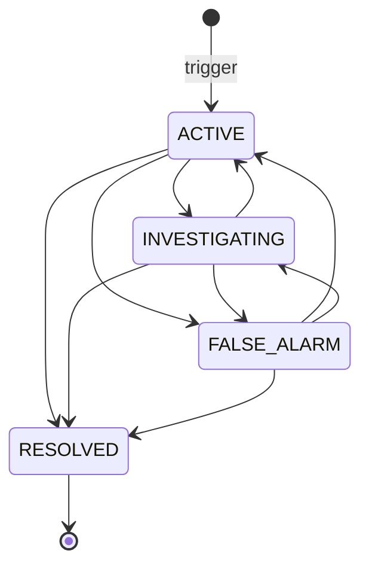

# SOS

An SOS is an emergency alert raised by a vendor, branch, fleet manager or rider (and, by
the route, an admin). It is stored with the sender's location, pushed to monitors over
Socket.IO, and worked by admins through a small status workflow. It is separate from
[Support](./support.md) and from an order.

Paths are relative to `src/app/`; the module is `modules/Sos/`, the socket events are in
`lib/Socket/events/sosAlerts.events.ts`. Statements come from the committed code, read but
not run, unless marked **Executed** (a probe ran the real model schema with no database),
**Inferred** or **Unresolved**. Uncommitted working-tree features (including delivery
exceptions raised by riders on orders) are not described.

---

## At a glance

| Question | Answer |
| --- | --- |
| Model | `Sos` (`SosModel`), with a `2dsphere` index on `location`. |
| Who can trigger | `POST /api/v1/sos/trigger`: `ADMIN`, `DELIVERY_PARTNER`, `VENDOR`, `SUB_VENDOR`, `FLEET_MANAGER`. Not customers and not `SUPER_ADMIN`. **Executed:** an `ADMIN` alert fails model validation, see [the mismatches](#mismatches-and-inconsistencies). |
| Statuses | `ACTIVE`, `INVESTIGATING`, `RESOLVED`, `FALSE_ALARM`. |
| Who manages | `ADMIN` and `SUPER_ADMIN` change the status. |
| Notification | Socket.IO only. No push, email or `Notification` record. |
| Audit | `SOS_STATUS_CHANGED` when an admin changes the status. Triggering is not logged. |

---

## Data model

| Field | Notes |
| --- | --- |
| `userId.id`, `userId.model` | The sender's profile `_id` and collection. The model enum allows only `Vendor`, `FleetManager`, `DeliveryPartner` (a `SUB_VENDOR` maps to `Vendor`). |
| `role` | The sender's role. |
| `orderId` | Optional `Order` reference. The request body accepts any string. |
| `status` | `ACTIVE` (default), `INVESTIGATING`, `RESOLVED`, `FALSE_ALARM`. |
| `userNote` | The sender's note, at most 200 characters. An admin's note is appended to this same field. |
| `issueTags` | Any of `Accident`, `Medical Emergency`, `Fire`, `Crime`, `Natural Disaster`, `Other`. The trigger body requires the array. |
| `location` | A GeoJSON `Point` taken from the sender's stored `currentSessionLocation`. |
| `deviceSnapshot` | Optional battery level, device model, OS version, app version and network type from the client. |
| `resolvedBy`, `resolvedAt` | `resolvedBy` is set by **every** status change; `resolvedAt` only when the status becomes `RESOLVED`. |

---

## Triggering

`POST /sos/trigger` with `userNote` (max 200), `issueTags`, optional `orderId` and
`deviceSnapshot` (strict body). The service:

1. Reads the caller's `currentSessionLocation`. Without one it fails with `COULD_NOT_DETERMINE_CURRENT_LOCATION_ENABLE_GPS`. The location is **not** taken from the request; it is whatever the profile last stored (for a rider, see the live location update in [Delivery Dispatch](../03-orders/delivery-dispatch.md)).
2. Creates the alert with status `ACTIVE` and the location.
3. Emits `new-sos-alert` (`{ message, data: <the alert> }`) to the room `SOS_ALERTS_POOL`.

There is no rate limit, no duplicate check (a user can open several alerts) and no
activity-log entry. Nothing is sent to the sender's own socket room.

---

## Status workflow

`PATCH /sos/:id/status` (`ADMIN`, `SUPER_ADMIN`; body `status` and optional `note`, at most
250 characters):

- A `RESOLVED` alert cannot be changed (`RESOLVED_SOS_CANNOT_BE_CHANGED`).
- Setting the current status again is refused (`SOS_ALREADY_IN_STATUS`).
- Any other change is allowed, in any direction. `FALSE_ALARM` is **not** final.
- The status, `resolvedBy` (the caller) and, when given, the note are saved. The note is appended to `userNote` as `<old> | Admin Note: <note>`. **Inferred:** the combined text is validated against the 200-character limit when the update runs validators, so a long note can be rejected even though the request allows 250.
- After saving, the server emits `sos-status-updated-<id>` with the alert to **all connected sockets** (a global emit, not a room).
- The controller writes `SOS_STATUS_CHANGED` (type `WARNING`, `metadata.newStatus`).

---

## Reading alerts over REST

| Endpoint | Roles | Behavior |
| --- | --- | --- |
| `GET /sos` | `ADMIN`, `SUPER_ADMIN`, `FLEET_MANAGER`, `VENDOR`, `SUB_VENDOR` | Admins see all. A fleet manager sees alerts of riders it manages (`currentFleetManagerId`). A vendor or branch sees its own. Search on `status`, `role`, `issueTags`; filter, sort, pagination, fields. The populated sender and resolver fields depend on the caller's role. **Riders cannot list their own alerts.** |
| `GET /sos/:id` | `ADMIN`, `SUPER_ADMIN`, `FLEET_MANAGER` | A fleet manager is refused (`403`) unless the sender is one of its riders. **Inferred:** that also refuses an alert the fleet manager raised itself. |
| `GET /sos/nearby` | `ADMIN`, `SUPER_ADMIN` | `ACTIVE` alerts within 5 km of the admin's own `currentSessionLocation` (`400` if the admin has none). |
| `GET /sos/user/:id` | `ADMIN`, `SUPER_ADMIN` | History of one sender by the sender's profile `_id`. |
| `GET /sos/stats` | `ADMIN`, `SUPER_ADMIN` | Counts of all alerts by sender type (`Vendor`, `FleetManager`, `DeliveryPartner`) and a total. |

---

## Socket.IO

| Event | Who | Effect |
| --- | --- | --- |
| `join-sos-monitoring` | `ADMIN`, `SUPER_ADMIN`, `FLEET_MANAGER` | Joins `SOS_ALERTS_POOL`. Other roles are silently ignored. |
| `new-sos-alert` (server) | room `SOS_ALERTS_POOL` | The full alert on trigger. |
| `sos-location-stream` `{ sosId, latitude, longitude, geoAccuracy? }` | any connected socket | Ignores the message if coordinates are out of range or `geoAccuracy` is above 100. Otherwise emits `sos-live-location-<sosId>` to the pool and, at most once per 3 seconds per `sosId` (an in-memory map in that process), overwrites the alert's stored `location`. |
| `sos-status-updated-<id>` (server) | all sockets | After an admin status change. |

---

## Mismatches and inconsistencies

1. **An admin cannot raise an SOS.** The route admits `ADMIN`, but the model's `userId.model` enum has no `Admin`. **Executed:** validating an alert with `model: Admin` reports an error on `userId.model`, while `Vendor` is valid. `SUPER_ADMIN` is not on the route at all.
2. **The live-location stream has no authorization.** `sos-location-stream` does not check the caller's role or that the alert belongs to the caller, so any authenticated socket can post a location for any alert id and, throttled, rewrite its stored location.
3. **Fleet managers who monitor get every alert.** `join-sos-monitoring` puts a fleet manager in the same room as admins, and `new-sos-alert` goes to the whole room, while the REST list limits a fleet manager to its own riders.
4. **Status changes are broadcast globally** (`sos-status-updated-<id>`), so every connected client receives the alert payload.
5. **Riders cannot list their own alerts**, although they can trigger them.
6. **`resolvedBy` is set on every change**, not only on resolution, and admin notes are merged into the sender's note.
7. **No notification path.** An alert raised while no admin or fleet manager is connected to the pool is stored and visible through REST, but reaches nobody in real time.
8. **`orderId` is not validated** as an ObjectId (**Inferred:** an invalid value fails at the database cast).

---

## Unverified or inferred behavior

- Only the model validation in #1 was executed. Socket behavior and the note-length effect are read from the code.
- Whether any client shows an SOS differently for fleet managers is not known from the backend.

---

## Related documentation

- [Support](./support.md): the separate support chat channel.
- [Notification Flow](./notification-flow.md#6-socketio-notification-flow): the `new-sos-alert` event among the realtime alerts.
- [Order Tracking and Realtime](../03-orders/order-tracking-and-realtime.md#socketio): the socket connection and its authentication.
- [Delivery Dispatch](../03-orders/delivery-dispatch.md): how a rider's session location is kept up to date.
- [Activity Logs](../12-activity-logs/activity-logs.md): the `SOS_STATUS_CHANGED` entry.
