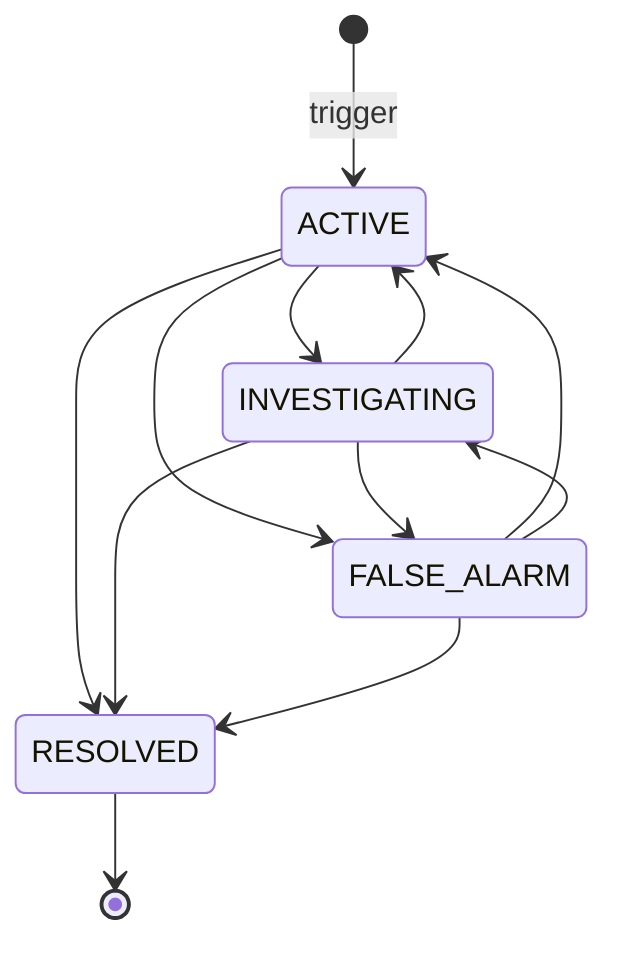

# SOS

An SOS is an emergency alert raised by a vendor, branch, fleet manager or rider (and, by
the route, an admin). It is stored with the sender's location, pushed to monitors over
Socket.IO, and worked by admins through a small status workflow. It is separate from
[Support](./support.md).

A rider SOS that is tied to an order has an extra order-level side. A rider can raise it
only once the order is `READY_FOR_PICKUP`, `PICKED_UP` or `ON_THE_WAY`; every earlier status
and the terminal statuses are refused. An accepted SOS also opens a `RIDER_SOS` delivery
exception on the order so that admins can acknowledge it, let the rider continue, replace
the rider, or cancel the order after a fault. That side is covered in [Rider SOS on an order](#rider-sos-on-an-order) and
[Admin handling of a rider SOS](#admin-handling-of-a-rider-sos). The wider set of delivery
recovery flows (OTP lock, verification issue, receipt confirmation, manual completion, which
stay in-transit only) is
in [Delivery Exceptions and Verification](../03-orders/delivery-exceptions.md); this page
keeps to the SOS.

Paths are relative to `src/app/`; the module is `modules/Sos/`, the order-linked logic is
in `modules/Order/order.deliveryException.service.ts`, and the socket events are in
`lib/Socket/events/sosAlerts.events.ts` and `modules/Sos/sos.socket.ts`. Statements come
from the committed code, read but not run, unless marked **Executed** (a probe ran the real
model schema with no database), **Inferred** or **Unresolved**.

---

## At a glance

| Question | Answer |
| --- | --- |
| Model | `Sos` (`SosModel`), with a `2dsphere` index on `location` and a partial unique index on `(userId.id, orderId)` for `ACTIVE` alerts that have an order. |
| Who can trigger | `POST /api/v1/sos/trigger`: `ADMIN`, `DELIVERY_PARTNER`, `VENDOR`, `SUB_VENDOR`, `FLEET_MANAGER`. Not customers and not `SUPER_ADMIN`. A rider can also use `POST /api/v1/orders/:orderId/sos`. **Executed:** an `ADMIN` alert fails model validation, see [the mismatches](#mismatches-and-inconsistencies). |
| Statuses | `ACTIVE`, `INVESTIGATING`, `RESOLVED`, `FALSE_ALARM`. |
| Who manages | `ADMIN` and `SUPER_ADMIN` change the status. For an order-linked rider SOS they also use the order routes (`CAN_MANAGE_ORDERS` for an `ADMIN`). |
| Notification | A plain alert: Socket.IO only. A rider SOS on an order also pushes `ADMIN` / `SUPER_ADMIN` (`DELIVERY_SOS_TO_ADMIN`, with a stored record). The customer is never told about the SOS. |
| Allowed order statuses (rider SOS on an order) | `READY_FOR_PICKUP`, `PICKED_UP`, `ON_THE_WAY` only. `ASSIGNED` and earlier, `DELIVERED` and `CANCELED` are refused with `400` (`RIDER_SOS_NOT_ALLOWED_AT_ORDER_STATUS`). |
| Order effect | Never changes `orderStatus`. Never cancels an order by itself. Every accepted rider SOS on an order opens a `RIDER_SOS` exception, which is a flag for admins, not a lock on the rider. |
| Audit | `SOS_STATUS_CHANGED` when an admin changes the status; order-linked actions write their own `ORDER_*` entries (see [Activity logging](#activity-logging)). A plain trigger is not logged. |

---

## Data model

| Field | Notes |
| --- | --- |
| `userId.id`, `userId.model` | The sender's profile `_id` and collection. The model enum allows only `Vendor`, `FleetManager`, `DeliveryPartner` (a `SUB_VENDOR` maps to `Vendor`). |
| `role` | The sender's role. |
| `orderId` | Optional `Order` reference (an ObjectId, `null` by default). Set only after the order lookup and ownership check described below. |
| `status` | `ACTIVE` (default), `INVESTIGATING`, `RESOLVED`, `FALSE_ALARM`. |
| `userNote` | The sender's note, at most 200 characters. An admin's note appended through `PATCH /sos/:id/status` goes into this same field. |
| `issueTags` | Any of `Accident`, `Medical Emergency`, `Fire`, `Crime`, `Natural Disaster`, `Vehicle Breakdown`, `Customer Unreachable`, `Unsafe Location`, `Order Issue`, `Other`. The trigger body requires the array. `Vehicle Breakdown`, `Customer Unreachable`, `Unsafe Location` and `Order Issue` are the operational tags, for situations that are not emergencies but still need operations. |
| `location` | A GeoJSON `Point`. A plain trigger takes it from the sender's stored `currentSessionLocation`; a rider SOS on an order may supply a fresh one (see [Location and stale locations](#location-and-stale-locations)). |
| `locationStale`, `locationCapturedAt` | Set by the rider SOS on an order: whether the position was older than 2 minutes (or of unknown age), and when it was captured when that is known. |
| `occurredAt` | Set by the rider SOS on an order: when the rider pressed the button (for a queued or offline press). `createdAt` stays the server time. |
| `deviceSnapshot` | Optional battery level, device model, OS version, app version and network type from the client. |
| `resolvedBy`, `resolvedAt` | `resolvedBy` is set by **every** status change; `resolvedAt` only when the status becomes `RESOLVED` or `FALSE_ALARM` through an order action, or `RESOLVED` through the status route. |

---

## Triggering

### Plain alert (`POST /sos/trigger`)

Body (strict): `userNote` (max 200), `issueTags`, and optionally `orderId`, `currentLocation`
(`latitude` -90..90, `longitude` -180..180, optional ISO `capturedAt`), `occurredAt` (ISO
datetime) and `deviceSnapshot`.

For every role **except** a rider sending an `orderId`:

1. If `orderId` is given, it must be an order the caller owns, otherwise `404`
   (the same answer for a missing order and someone else's, so ids cannot be probed). A
   `VENDOR` / `SUB_VENDOR` must be the order's `vendorId`; a `FLEET_MANAGER` must manage the
   rider currently on the order. An `ADMIN` with an `orderId` always gets `404`. The id may
   be the Mongo `_id` or the display `orderId`.
2. Reads the caller's `currentSessionLocation`. Without one it fails with `COULD_NOT_DETERMINE_CURRENT_LOCATION_ENABLE_GPS`. A supplied `currentLocation` and `occurredAt` are **not** used on this path; the location is whatever the profile last stored (for a rider, see the live location update in [Delivery Dispatch](../03-orders/delivery-dispatch.md)).
3. Creates the alert with status `ACTIVE` and the location.
4. Emits `new-sos-alert` (`{ message, data: <the alert> }`) to the room `SOS_ALERTS_POOL`.

There is no rate limit and no activity-log entry for a plain alert. Nothing is sent to the
sender's own socket room. A user without an `orderId` can open several alerts.

### Rider SOS on an order

A `DELIVERY_PARTNER` that sends an `orderId` to `POST /sos/trigger`, or calls
`POST /orders/:orderId/sos` (`auth('DELIVERY_PARTNER')`, body without `orderId`), goes through
`raiseRiderSos`. Both reach the same code; the order route answers `201` with
`{ sos, alreadyActive, holdsOrder, orderId, orderStatus }`, while `/sos/trigger` returns only
the alert.

---

## Rider SOS on an order

### Authorization and ownership

- The caller must be a `DELIVERY_PARTNER` and must be the rider **currently assigned** to the
  order (`deliveryPartnerId` equals the caller). The order may be addressed by Mongo `_id` or
  display `orderId`; soft-deleted orders are excluded.
- A missing order, an unassigned order and another rider's order all return the same `404`,
  so order ids cannot be probed.
- This path checks the role and the assignment. It does not check the rider profile's
  `APPROVED` status.
- The order's status is checked after ownership (next section): a rider who is not assigned to
  the order gets `404` whatever the status, and an assigned rider on a status that is not
  allowed gets `400`.

### Which order statuses allow an SOS

A rider SOS is allowed only at `READY_FOR_PICKUP`, `PICKED_UP` and `ON_THE_WAY`
(`RIDER_SOS_ORDER_STATUSES`). The check runs before any location is read or anything is
written.

| Order status | Result |
| --- | --- |
| `PENDING`, `PREPARING`, `DISPATCHING`, `AWAITING_PARTNER`, `REASSIGNMENT_NEEDED`, `ASSIGNED` | **Refused** (`400`, `RIDER_SOS_NOT_ALLOWED_AT_ORDER_STATUS`). No alert, no exception, no admin notification. A rider who cannot do an `ASSIGNED` order uses `REASSIGNMENT_NEEDED`, which is unchanged and available only from `ASSIGNED`. |
| `READY_FOR_PICKUP` | **Allowed.** The food is still at the vendor. |
| `PICKED_UP`, `ON_THE_WAY` | **Allowed.** The food is with the rider. |
| `DELIVERED`, `CANCELED` and every other terminal status | **Refused** (`400`), even when the order still names the rider. |

The status never changes and no SOS cancels an order. Every accepted SOS:

- creates the `Sos` alert (`ACTIVE`) with the order attached;
- opens the `RIDER_SOS` delivery exception (`OPEN`) with the issue tags, the rider's note and
  the location, or records a repeat on an exception that is already open;
- alerts admins (`DELIVERY_SOS_TO_ADMIN` push, `new-sos-alert`) and emits
  `DELIVERY_EXCEPTION_UPDATED` (`OPENED`);
- returns `holdsOrder: true`. The field is always `true` now and is kept so existing clients
  keep working.

What differs between the allowed statuses is only what the admin tools do afterwards:

| | `READY_FOR_PICKUP` | `PICKED_UP` / `ON_THE_WAY` |
| --- | --- | --- |
| Acknowledge, resolve (rider continues or false alarm) | Available | Available |
| Replace the rider | Available. No delivery code exists yet, so none is created or sent; the new rider gets the normal assignment push and goes to the vendor | Available. A new delivery code goes to the customer and the new rider collects the food from the handover location |
| Fault cancellation | Available | Available |
| OTP reset, verification issue, receipt confirmation, manual completion | Not available (in transit only) | Available where their own rules allow |
| Nearby riders origin | The order's `pickupAddress` | The incident or rider location |

An open exception is a flag for admins, not a lock on the rider: it does not block the
rider's own status updates, so a rider with an open SOS can still move from `READY_FOR_PICKUP`
to `PICKED_UP`, and the exception then simply continues as an in-transit one. A rider delivering the
order, or a customer cancelling it, closes the exception (`ORDER_CLOSED`).

### Location and stale locations

- **Fresh location from the device.** An optional `currentLocation` (`latitude`, `longitude`,
  optional `capturedAt`) is used when the coordinates are valid (finite numbers, longitude
  within +/-180, latitude within +/-90; the request schema enforces the same ranges and rejects
  an out-of-range value). If `capturedAt` is missing or not a valid date, the time of the
  request is used.
- **Fallback.** Without a usable fresh location, the rider's stored `currentSessionLocation`
  is used, together with its last update time.
- **No location at all.** If neither exists, the request fails with
  `COULD_NOT_DETERMINE_CURRENT_LOCATION_ENABLE_GPS` (`400`) and nothing is created.
- **Stale flag.** A location is marked stale when it was captured more than 2 minutes before
  the request, or when its capture time is unknown (a fallback location with no update time).
  The flag is stored on the alert (`locationStale`) and on the exception location
  (`isStale`), and shown to admins in the exception queue. A stale location is **never
  rejected**; it is still accepted and still used as the search origin for nearby riders.
- **`occurredAt`.** The device's press time is accepted but clamped: never in the future, and
  never more than 24 hours in the past. An invalid value falls back to the request time.

### Duplicate presses (idempotency)

- **Repeat while the exception is live.** If a `RIDER_SOS` exception is already `OPEN` or `ACKNOWLEDGED`, the press is
  treated as a repeat: the exception's `reportCount` is incremented and its `lastReportedAt` and
  location are refreshed, the alert's location is refreshed while it is still `ACTIVE` or
  `INVESTIGATING`, and the response has `alreadyActive: true`. **No** new alert, admin push,
  socket alert, `DELIVERY_EXCEPTION_UPDATED` event or activity-log entry is produced.
- **Unique index.** The partial unique index on `(userId.id, orderId)` for `ACTIVE` alerts
  collapses concurrent presses into one alert, so simultaneous presses cannot create two.
- **Lost record healing.** If the exception exists but its alert record is missing, the alert is
  re-created and linked; if a live alert already exists for the rider and order (for example
  raised earlier through the plain endpoint), it is attached to the exception instead of
  creating another.
- **After a resolution.** If the previous exception was closed (for example the rider was told to
  continue), a new press opens a new exception and a new alert.

### An SOS during a delivery OTP lock

If a `DELIVERY_OTP_LOCKED` exception is open when the rider raises an SOS, the SOS **takes
over** the exception: its type becomes `RIDER_SOS`, it is reopened as `OPEN` (any
acknowledgement is cleared) and the report count increases. The code lock itself stays on
`deliveryOtp.lockedAt` and still needs an OTP reset; resolving the SOS exception is refused
while the code is locked (`DELIVERY_OTP_STILL_LOCKED`). The reverse never happens: a lock does
not replace an open SOS.

---

## Status workflow

`PATCH /sos/:id/status` (`ADMIN`, `SUPER_ADMIN`; body `status` and optional `note`, at most
250 characters):

- A `RESOLVED` alert cannot be changed (`RESOLVED_SOS_CANNOT_BE_CHANGED`).
- Setting the current status again is refused (`SOS_ALREADY_IN_STATUS`).
- Any other change is allowed, in any direction. `FALSE_ALARM` is **not** final.
- The status, `resolvedBy` (the caller) and, when given, the note are saved. The note is appended to `userNote` as `<old> | Admin Note: <note>`. **Inferred:** the combined text is validated against the 200-character limit when the update runs validators, so a long note can be rejected even though the request allows 250.
- After saving, the server emits `sos-status-updated-<id>` with the alert to the `SOS_ALERTS_POOL` room and to the alert owner's personal `user_<userId>` room (not to every socket).
- The controller writes `SOS_STATUS_CHANGED` (type `WARNING`, `metadata.newStatus`).

This route changes only the alert. It does **not** touch the order's exception, so for an order
with a `RIDER_SOS` exception the order routes below are the way to act on the order itself.

### How the order actions move the alert

For an alert linked to a `RIDER_SOS` exception, the order actions update the `Sos` record too,
each with a conditional write that only applies while the alert is still live:

| Order action | Alert becomes | Socket event |
| --- | --- | --- |
| Admin acknowledges the exception | `INVESTIGATING` (only from `ACTIVE`), `resolvedBy` set | `sos-status-updated-<id>` |
| Admin resolves with `RIDER_CONTINUES` | `RESOLVED` (`resolvedBy`, `resolvedAt`) | `sos-status-updated-<id>` |
| Admin resolves with `FALSE_ALARM` | `FALSE_ALARM` (`resolvedBy`, `resolvedAt`) | `sos-status-updated-<id>` |
| Admin replaces the rider | `RESOLVED` (`resolvedBy`, `resolvedAt`), written in the replacement transaction | None for the alert |

Fault cancellation, manual completion, the rider delivering the order and a customer
cancellation close the **exception** but leave the linked `Sos` record as it is. An admin then
closes the alert with `PATCH /sos/:id/status`.

---

## Admin handling of a rider SOS

All routes use `auth('ADMIN', 'SUPER_ADMIN', ['CAN_MANAGE_ORDERS'])`; the permission is enforced
only for `ADMIN`. The SOS actions (queue, acknowledge, resolve, replace, fault cancel) apply to a delivery order that is `READY_FOR_PICKUP`, `PICKED_UP` or `ON_THE_WAY`.

### Queue

`GET /orders/delivery-exceptions` lists live exceptions on `READY_FOR_PICKUP`, `PICKED_UP` and `ON_THE_WAY` orders (filter by `status`, `type`,
paging) with the exception's type and status, issue tags, the rider's note, the location with its
`isStale` flag and capture time, the rider's name, contact and last known position, the vendor
name, and the OTP attempt counters (never the code).

### Acknowledge

`PATCH /orders/:orderId/delivery-exception/acknowledge` moves an `OPEN` exception to
`ACKNOWLEDGED` (`acknowledgedBy`, `acknowledgedAt`) and the linked alert to `INVESTIGATING`.
For a `RIDER_SOS` the rider gets a push (`DELIVERY_EXCEPTION_ACKNOWLEDGED_TO_PARTNER`: operations
has seen the alert and the rider should stay safe and wait). An exception that is already
acknowledged returns `409`.

### Resolve (the rider can continue, or a false alarm)

`PATCH /orders/:orderId/delivery-exception/resolve`, body `resolution` (`RIDER_CONTINUES` or
`FALSE_ALARM`) and `note` (required, max 500). Only a `RIDER_SOS` can be resolved this way
(`DELIVERY_EXCEPTION_RESOLVE_INVALID_FOR_TYPE` otherwise), and not while the delivery code is
still locked. The exception becomes `RESOLVED`, the linked alert `RESOLVED` or `FALSE_ALARM`, the
rider gets a push (`DELIVERY_EXCEPTION_RESOLVED_TO_PARTNER`: the alert is closed and the delivery
may continue), and the order status is unchanged.

### Replace the rider

`PATCH /orders/:orderId/replace-partner`, body `deliveryPartnerId` (24-hex) and `note` (required,
max 500). This is the recovery for a `RIDER_SOS`; a locked OTP never replaces the rider.

Conditions, all checked in one transaction:

- The order is a delivery order at `READY_FOR_PICKUP`, `PICKED_UP` or `ON_THE_WAY`, with an `OPEN`
  or `ACKNOWLEDGED` **`RIDER_SOS`** exception and a rider on it. Without that: `NO_ACTIVE_DELIVERY_EXCEPTION`, or
  `PARTNER_REPLACEMENT_REQUIRES_SOS` for an OTP lock.
- The new rider differs from the current one (`PARTNER_REPLACEMENT_SAME_PARTNER`) and is
  `APPROVED`, `IDLE`, not deleted and holding no order; they are claimed as part of the
  transaction (`ON_DELIVERY`, `currentOrderId` set). The usual errors apply:
  `NOT_FOUND_MESSAGE`, `PARTNER_NOT_APPROVED_FOR_ASSIGNMENT`, `PARTNER_NOT_AVAILABLE_FOR_ASSIGNMENT`.
  No distance limit is enforced; the admin chooses from the nearby list below.

What the swap does, in one conditional write that pins the old rider, an SOS-eligible status and
the open `RIDER_SOS` exception:

- Sets `deliveryPartnerId` to the new rider. The order status is unchanged.
- **New delivery OTP (in transit only).** When the food is with the rider (`PICKED_UP` /
  `ON_THE_WAY`), a fresh random code replaces the old one: attempts back to 0, any lock cleared,
  `generation` and `resetCount` incremented, `resetAt` / `resetBy` recorded. The old code can never
  be valid again. The new code goes only to the customer, and the new rider gets the handover
  message with the incident location. At `READY_FOR_PICKUP` there is no delivery code yet (it is
  generated when the rider picks the food up), so none is created or sent, the customer gets no
  code push, and the new rider gets the same push as an admin assignment and goes to the vendor.
- Resolves the exception with `PARTNER_REPLACED` (note, resolver and role recorded).
- **Old rider handling.** The old rider's order link is cleared and the rider is set `OFFLINE` with
  `isWorking: false` (they must choose to go online again), and their id is added to the order's
  `dispatchRejectedPartnerPool`. Dispatch excludes that pool when it picks candidates, and the
  admin nearby list excludes it too, so the replaced rider is never offered this order again.
- A rider handover claim or receipt confirmation is voided (`deliveryVerification` is removed), so
  it cannot later justify paying the replacement.
- The linked alert becomes `RESOLVED` in the same transaction.

The delivery is settled to the rider who completes it, so the replaced rider earns nothing from it.

### Nearby riders for an SOS

`GET /orders/:orderId/nearby-partners` (read-only, nothing reserved) searches around a different
origin once the order is in transit, and reports it in `searchOrigin.source`. At `READY_FOR_PICKUP`
the food is still at the vendor, so the search stays around the `pickupAddress`:

| Order | Origin | `source` |
| --- | --- | --- |
| Before pickup, including `READY_FOR_PICKUP` with an open SOS | The order's `pickupAddress` | `PICKUP_ADDRESS` |
| `PICKED_UP` / `ON_THE_WAY` with an `OPEN` or `ACKNOWLEDGED` exception that has a usable location | The reported incident location (even if marked stale) | `INCIDENT_LOCATION` |
| `PICKED_UP` / `ON_THE_WAY` otherwise | The assigned rider's current session location | `RIDER_LOCATION` |
| In transit but no usable coordinates at all | Falls back to the `pickupAddress` | `PICKUP_ADDRESS` |

The search covers 5 km, returns up to 20 approved, `IDLE` riders holding no order, nearest first,
and excludes the order's rejected pool (so a replaced rider does not reappear).

### Fault cancellation when no replacement is possible

If the rider cannot continue and no replacement is available, the admin uses
`PATCH /orders/:orderId/fault-cancel` (body `reason`, 10-500 characters). It is **never
automatic**, and an SOS on its own does not cancel anything. It needs an open `RIDER_SOS`, at
`READY_FOR_PICKUP` or in transit (or the customer's explicit NO to a receipt confirmation, which
only exists in transit); a locked OTP alone is refused. The order
becomes `CANCELED` with `refundStatus: PENDING`, any open exception is closed in the same
transaction, and the rider is released and set `OFFLINE`. No stock is restored and no vendor, fleet
or platform settlement runs; this holds at `READY_FOR_PICKUP` too, even though the vendor had
already prepared the food. The refund itself is the existing admin refund route. See
[Delivery Exceptions and Verification](../03-orders/delivery-exceptions.md#fault-cancellation) and
[Cancellations, Refunds and Settlement](../03-orders/cancellations-refunds-settlement.md#refunds).

---

## Notifications and realtime events

### Who is told what

| Event | Recipient | What they get |
| --- | --- | --- |
| Rider SOS raised (new alert, or a newly opened or upgraded exception) | `ADMIN` / `SUPER_ADMIN` | Push + stored record `DELIVERY_SOS_TO_ADMIN` ("<rider> raised an SOS during delivery"), channel `order_notification`, data `orderId`, `orderStatus`, `type: DELIVERY_SOS`, `sosId`; socket `new-sos-alert` with an extra `order` block (`orderId`, `orderStatus`, `holdsOrder`) |
| Duplicate press | Nobody | Silent |
| Exception acknowledged / resolved | The rider | `DELIVERY_EXCEPTION_ACKNOWLEDGED_TO_PARTNER` (only for a `RIDER_SOS`) / `DELIVERY_EXCEPTION_RESOLVED_TO_PARTNER` |
| Rider replaced | The new rider; the old rider; the customer | `ORDER_HANDOVER_ASSIGNED_TO_PARTNER` (the data carries `handoverLatitude` and `handoverLongitude` when the incident location is usable); `ORDER_HANDED_OVER_FROM_PARTNER` (you are set offline); the customer: `DELIVERY_PARTNER_CHANGED_TO_CUSTOMER` push, socket `DELIVERY_OTP_GENERATED` and an email, all carrying the **new** delivery code |
| Rider replaced | Customer, vendor, new rider and old rider rooms | `ORDER_STATUS_UPDATED` (status unchanged) |
| Fault cancel | The customer; the rider | `ORDER_FAULT_CANCELED_TO_CUSTOMER` (the order is canceled, a full refund follows); `ORDER_CANCELED_BY_ADMIN_TO_PARTNER` |

**The customer is not told about the SOS.** Raising, acknowledging or resolving an SOS sends the
customer nothing, and none of the customer messages above contains the SOS reason, the issue tags
or the rider's note. The customer learns of a replacement through the new-rider message and the new
code, and of a fault cancellation through the cancellation message. The vendor gets no push; it only
sees the `ORDER_STATUS_UPDATED` event on replacement or cancellation.

### Socket events

| Event | Room | Payload |
| --- | --- | --- |
| `new-sos-alert` | `SOS_ALERTS_POOL` | `{ message, data: <alert> }`; for an order SOS also `order: { orderId, orderStatus, holdsOrder }` |
| `DELIVERY_EXCEPTION_UPDATED` | `DELIVERY_EXCEPTION_ADMINS` | `{ orderId, orderStatus, event, exceptionType?, exceptionStatus?, timestamp }`, status only (no names, notes, locations or codes). For an SOS the `event` is `OPENED` (in-transit SOS only), `ACKNOWLEDGED`, `RESOLVED`, `PARTNER_REPLACED` or `ORDER_CANCELED` |
| `sos-status-updated-<id>` | `SOS_ALERTS_POOL` and the owner's `user_<userId>` | The alert, after an admin status change or an order action from the table above |

An admin socket joins `DELIVERY_EXCEPTION_ADMINS` when it sends `join-sos-monitoring` (see
[Socket.IO](#socketio)); fleet managers join only the SOS pool.

---

## Activity logging

All entries are recorded against the order (entity type `ORDER`) with the acting user. None carries
an OTP value or the rider's note.

| Action | Written when | Type | Metadata |
| --- | --- | --- | --- |
| `ORDER_DELIVERY_SOS_RAISED` | A rider SOS creates a new alert or opens or upgrades an exception (not for a duplicate press) | `DANGER` | `orderStatus`, `holdsOrder`, `issueTags`, `locationStale`, `sosId` |
| `ORDER_DELIVERY_EXCEPTION_ACKNOWLEDGED` | An admin acknowledges | `INFO` | `exceptionType` |
| `ORDER_DELIVERY_EXCEPTION_RESOLVED` | An admin resolves | `INFO` | `resolution`, `note` |
| `ORDER_PARTNER_REPLACED` | An admin replaces the rider | `WARNING` | previous and new rider ids, `note`, OTP `generation`, `exceptionType`, `sosId` |
| `ORDER_FAULT_CANCELED` | An admin fault-cancels | `DANGER` | `reason`, `exceptionType`, `basis`, rider id, `refundStatus` |
| `SOS_STATUS_CHANGED` | An admin changes a status through `PATCH /sos/:id/status` only (entity type `SOS`) | `WARNING` | `newStatus` |

The alert status changes made by the order actions above are **not** written as `SOS_STATUS_CHANGED`;
their audit trail is the order entries.

---

## Concurrency and atomicity

- **One live alert per rider and order.** The partial unique index on `(userId.id, orderId)` for
  `ACTIVE` alerts makes concurrent duplicate presses collapse into one alert.
- **The exception is claimed with conditional writes.** Opening, upgrading from an OTP lock and
  recording a repeat are three separate conditional updates tried in turn (up to 3 attempts), each
  pinned to the assigned rider, an SOS-eligible status and the exception's current state, so
  simultaneous presses cannot open two exceptions or double-count the alert. If all attempts fail the
  request fails with a retry message instead of guessing.
- **Only the winner alerts.** The admin push, socket alert, activity-log entry and `OPENED` event are
  produced only for a new alert or a newly opened exception.
- **Acknowledge and resolve are conditional.** Each updates the exception only from the expected
  state, and the linked alert only while it is still `ACTIVE` / `INVESTIGATING`, so repeats and
  concurrent admins do not double-apply.
- **Replacement is one transaction.** Claiming the new rider, swapping the rider and OTP, closing the
  exception, voiding the verification report, releasing the old rider and resolving the alert commit
  together. The swap is pinned to the old rider, the status and the open `RIDER_SOS` exception, so it
  cannot race a rider delivery, a cancellation or another replacement; if it loses, the transaction
  rolls back, including the new rider's claim.
- **Fault cancel is one transaction** that also closes the exception and releases the rider, and
  exactly one of several concurrent cancels or completions can win.

---

## Reading alerts over REST

| Endpoint | Roles | Behavior |
| --- | --- | --- |
| `GET /sos` | `ADMIN`, `SUPER_ADMIN`, `FLEET_MANAGER`, `VENDOR`, `SUB_VENDOR` | Admins see all. A fleet manager sees alerts of riders it manages (`currentFleetManagerId`). A vendor or branch sees its own. Search on `status`, `role`, `issueTags`; filter, sort, pagination, fields. The populated sender and resolver fields depend on the caller's role. **Riders cannot list their own alerts.** |
| `GET /sos/:id` | `ADMIN`, `SUPER_ADMIN`, `FLEET_MANAGER` | A fleet manager is refused (`403`) unless the sender is one of its riders. **Inferred:** that also refuses an alert the fleet manager raised itself. |
| `GET /sos/nearby` | `ADMIN`, `SUPER_ADMIN` | `ACTIVE` alerts within 5 km of the admin's own `currentSessionLocation` (`400` if the admin has none). |
| `GET /sos/user/:id` | `ADMIN`, `SUPER_ADMIN` | History of one sender by the sender's profile `_id`. |
| `GET /sos/stats` | `ADMIN`, `SUPER_ADMIN` | Counts of all alerts by sender type (`Vendor`, `FleetManager`, `DeliveryPartner`) and a total. |

---

## Socket.IO

| Event | Who | Effect |
| --- | --- | --- |
| `join-sos-monitoring` | `ADMIN`, `SUPER_ADMIN`, `FLEET_MANAGER` | Joins `SOS_ALERTS_POOL`. An `ADMIN` or `SUPER_ADMIN` also joins `DELIVERY_EXCEPTION_ADMINS`. Other roles are silently ignored. |
| `new-sos-alert` (server) | room `SOS_ALERTS_POOL` | The full alert on trigger (with the `order` block for a rider SOS on an order). |
| `sos-location-stream` `{ sosId, latitude, longitude, geoAccuracy? }` | the alert's owner | The socket's user must own the alert and it must still be `ACTIVE` or `INVESTIGATING` (a positive check is trusted for 60 seconds per socket). Otherwise the message is ignored, as it is when coordinates are out of range or `geoAccuracy` is above 100. Otherwise it emits `sos-live-location-<sosId>` to the pool and, at most once per 3 seconds per `sosId` (an in-memory map in that process), overwrites the alert's stored `location`. |
| `sos-status-updated-<id>` (server) | `SOS_ALERTS_POOL` and the owner's `user_<userId>` room | After an admin status change or an order action. |
| `DELIVERY_EXCEPTION_UPDATED` (server) | `DELIVERY_EXCEPTION_ADMINS` | Order-exception status events, see above. |

---

## Mismatches and inconsistencies

1. **An admin cannot raise an SOS.** The route admits `ADMIN`, but the model's `userId.model` enum has no `Admin`. **Executed:** validating an alert with `model: Admin` reports an error on `userId.model`, while `Vendor` is valid. `SUPER_ADMIN` is not on the route at all.
2. **Fleet managers who monitor get every alert.** `join-sos-monitoring` puts a fleet manager in the same room as admins, and `new-sos-alert` goes to the whole room, while the REST list limits a fleet manager to its own riders.
3. **Riders cannot list their own alerts**, although they can trigger them.
4. **`resolvedBy` is set on every change**, not only on resolution, and admin notes are merged into the sender's note.
5. **An alert with nobody connected.** An alert raised while no admin or fleet manager is connected to the pool is stored and visible through REST and, for a rider SOS on an order, still pushed to admins; a plain alert reaches nobody in real time.
6. **The order and the alert are closed separately.** Fault cancellation, manual completion, a rider delivery and a customer cancellation end the exception but leave the linked alert in its current status (often `ACTIVE` or `INVESTIGATING`) until an admin changes it. Meanwhile the owner's `sos-location-stream` is still accepted for a live alert.
7. **The generic path does not handle the duplicate index.** For a vendor, branch or fleet manager alert on an order, a second `ACTIVE` alert for the same user and order hits the unique index. **Inferred:** it surfaces as an error rather than a quiet repeat, since only the rider path catches that case.
8. **The plain trigger ignores the richer fields.** `currentLocation` and `occurredAt` are validated but unused outside the rider-on-order path, so a plain alert has no stale flag or `occurredAt`.
9. **A hold is a flag.** An open `RIDER_SOS` exception does not stop the rider's own status updates; only the admin actions and the exception's closure on delivery or cancel change its state.
10. **A fault cancel at `READY_FOR_PICKUP` pays nobody.** The vendor has already prepared the food, but a fault cancellation restores no stock and runs no vendor, fleet or platform settlement; only the customer's refund follows. The backend applies the same rule at every allowed status.

---

## Unverified or inferred behavior

- Only the model validation in #1 was executed. Socket behavior, the note-length effect and #7 are read from the code.
- Whether any client shows an SOS differently for fleet managers, or reacts to `holdsOrder`, is not known from the backend.
- How the rider app handles the `400` for a status that does not allow an SOS (for example `ASSIGNED`) is not known from the backend.
- The backend refuses an SOS at `ASSIGNED`; whether a rider who is blocked there is guided to `REASSIGNMENT_NEEDED` in the app is not known.

---

## Related documentation

- [Delivery Exceptions and Verification](../03-orders/delivery-exceptions.md): the exception flows around a ready or in-transit order (OTP lock, verification issue, receipt confirmation, manual completion, fault cancellation).
- [Delivery Dispatch and Riders](../03-orders/delivery-dispatch.md): the rider's session location, dispatch and the rejected pool.
- [Cancellations, Refunds and Settlement](../03-orders/cancellations-refunds-settlement.md): the refund after a fault cancellation.
- [Support](./support.md): the separate support chat channel.
- [Notification Flow](./notification-flow.md#6-socketio-notification-flow): the `new-sos-alert` event among the realtime alerts.
- [Order Tracking and Realtime](../03-orders/order-tracking-and-realtime.md#socketio): the socket connection and its authentication.
- [Activity Logs](../12-activity-logs/activity-logs.md): the `SOS_STATUS_CHANGED` entry.
