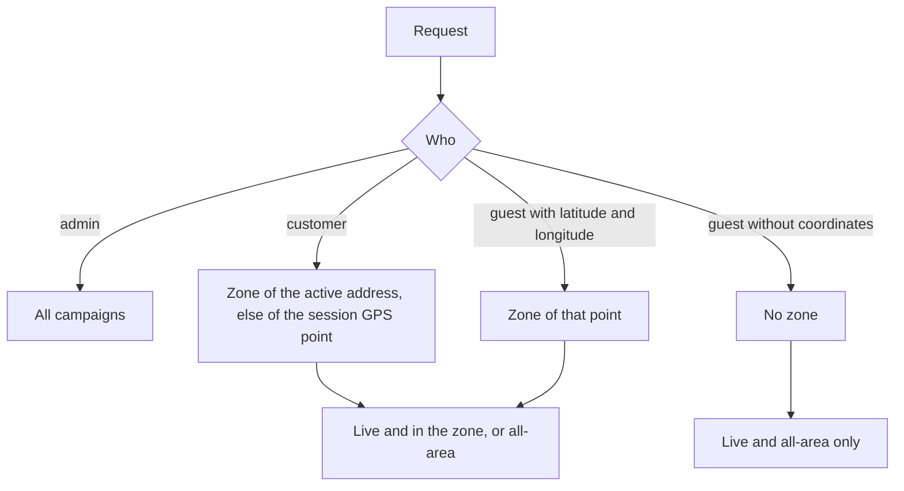

# Sponsorships

A **sponsorship** is a banner campaign that an admin schedules for customers: a sponsor
name, a banner image, an optional link, a date window and, optionally, the delivery zones
it is shown in. The backend stores campaigns and decides which ones a customer or guest
may see. It does not serve ads, count impressions or clicks, or connect a campaign to an
offer.

Paths are relative to `src/app/`; the module is `modules/Sponsorships/`. Statements come
from the committed code, read but not run, unless marked **Inferred** or **Unresolved**.
Uncommitted working-tree features are not described.

---

## At a glance

| Question | Answer |
| --- | --- |
| Model | `Sponsorship`. |
| Who manages | `ADMIN` and `SUPER_ADMIN`, without a permission action. |
| Who reads | Admins (everything), `CUSTOMER` (live campaigns for their zone), and anyone without a login (`/sponsorships/open`, live campaigns for a zone or all-area ones). |
| Zone targeting | Through `targetZoneIds`; an empty list means "all areas". |
| Notifications | None. |
| Audit | Only `SPONSORSHIP_PERMANENTLY_DELETED`. Creation, updates and soft deletes are not logged. |

---

## Data model

| Field | Notes |
| --- | --- |
| `sponsorName` | At least 3 characters (create and update). |
| `sponsorType` | `Ads`, `Offer` or `Other`. A label only: a campaign of type `Offer` is **not linked** to any `Offer`. |
| `startDate`, `endDate` | Required; the schema demands `endDate` after `startDate` when both are sent. |
| `bannerImage` | Required URL, stored from an uploaded file. |
| `url` | Optional link, validated as a URL. |
| `targetZoneIds` | Optional list of `Zone` references. |
| `isActive`, `isDeleted` | Activation and soft-delete flags. |

---

## Admin operations

| Endpoint | Behavior |
| --- | --- |
| `POST /api/v1/sponsorships/create-sponsorship` | Multipart with one file (`file`, the banner) and the fields above. The caller must be `APPROVED`. The banner must come as a file, not as a `bannerImage` field (`BANNER_IMAGE_MUST_BE_FILE`). Every `targetZoneIds` entry must exist (`SPONSORSHIP_ZONE_NOT_FOUND`). A campaign with the **same name and start date** already existing is refused. Without a file the model's required `bannerImage` fails the create. |
| `PATCH /api/v1/sponsorships/update-sponsorship/:id` | Partial multipart update. A new file replaces the banner and the old file is deleted from storage in the background. The name and start date duplicate check is repeated excluding itself. The zones are re-validated. |
| `DELETE /api/v1/sponsorships/soft-delete/:id` | Sets `isDeleted: true` and `isActive: false`. An already deleted campaign is refused (with `403`). |
| `DELETE /api/v1/sponsorships/permanent-delete/:id` | Requires a prior soft delete (`403 ...NOT_SOFT_DELETED...`). Removes the row and writes `SPONSORSHIP_PERMANENTLY_DELETED`. |
| `GET /api/v1/sponsorships`, `GET /api/v1/sponsorships/:id` | For an admin: every campaign (including deleted and inactive), with the target zones populated (`zoneId`, `zoneName`, `district`). |

Create, both reads, soft delete and permanent delete also require the caller's status to be
`APPROVED`; the update service does not check it (the route still requires an admin role).

---

## What a customer or guest sees

A campaign is **live** when it is not deleted, `isActive` is true, and `startDate <= now <= endDate`.
The visibility rule (`customerVisibleFilter`) is: live **and** (targeted to no zone, **or**
targeted to the viewer's zone).

- **Customer** (`GET /sponsorships`, `GET /sponsorships/:id`, role `CUSTOMER`): the zone comes from the customer's active delivery address if it has coordinates, otherwise from the stored session location (see [Customer Addresses and Location](../03-identity-access/customer-addresses.md)). If no zone contains the point, only all-area campaigns are returned. A zone is found only among **operational, non-deleted** zones.
- **Guest** (`GET /sponsorships/open`): optional query parameters `latitude` and `longitude` (note: not `lat` and `lng`). Both must be given together, finite and in range (`INVALID_LAT_LNG_COORDINATES` otherwise). Without them only all-area campaigns are returned.
- **The list** supports search on `sponsorName` and `sponsorType`, `filter`, sort, pagination and fields.
- **A single campaign for a customer** (`GET /sponsorships/:id`) is refused when it is deleted or inactive, but it does **not** re-check the date window or the zone, so a customer who knows an id can read an expired or out-of-zone campaign (**Inferred** from the service).

---

## Mismatches and inconsistencies

1. **`sponsorType: Offer` is decorative.** There is no relationship with the Offer engine (see [Offers](../09-offers-and-coupons/offers.md)).
2. **No tracking.** Impressions, clicks and conversions are not recorded.
3. **Weak update validation.** The end-after-start check applies only when both dates are in the same request, so updating one date can leave `endDate` before `startDate` (**Inferred**).
4. **Single read skips the window and zone** for customers.
5. **Audit gap.** Only the permanent delete is logged, so who created, edited or removed a live campaign is not recorded.
6. **Deleted zones.** A zone cannot be permanently deleted while a campaign targets it, but a non-operational zone simply stops matching points, so a campaign targeted only at such a zone becomes invisible to everyone (**Inferred**).
7. **Soft-deleted campaign errors use `403`**, not `404` or `409`.

---

## Unverified or inferred behavior

- Nothing on this page was executed. The visibility rule is read from `customerVisibleFilter` and the zone lookup helper.
- How clients choose a banner position or track a click is not known from the backend.

---

## Related documentation

- [Platform Settings](./platform-settings.md#zones): zones, their overlap rules and the delete guard that protects targeted zones.
- [Customer Addresses and Location](../03-identity-access/customer-addresses.md): the active address and session location used to find the customer's zone.
- [Offers](../09-offers-and-coupons/offers.md): the actual discount engine, unrelated to campaign type `Offer`.
- [Activity Logs](../12-activity-logs/activity-logs.md): the permanent-delete entry.
