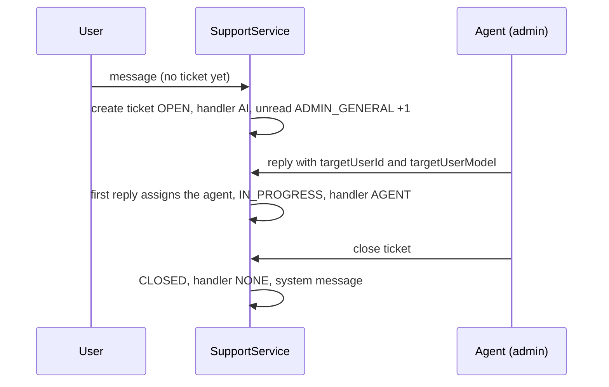

# Support

Support is a one-to-one chat between a user and the back-office. A user writes to
"support", an `ADMIN` or `SUPER_ADMIN` answers, and the conversation is stored as a
**ticket** with **messages**. There is a REST API and a Socket.IO API over the same service.

Paths are relative to `src/app/`; the module is `modules/Support/`, the socket events are in
`lib/Socket/events/support.events.ts`. Statements come from the committed code, read but not
run, unless marked **Inferred** or **Unresolved**. Uncommitted working-tree features are not described.

---

## At a glance

| Question | Answer |
| --- | --- |
| Models | `SupportTicket`, `SupportMessage`, and a `Counter` used for ticket ids. |
| Ticket id | `TIC-<YYMM>-<5-digit serial>` (for example `TIC-2601-00001`), the serial counting per month. |
| Who can write | `CUSTOMER`, `VENDOR`, `FLEET_MANAGER`, `DELIVERY_PARTNER` (REST and socket), plus `ADMIN` and `SUPER_ADMIN` as agents. **`SUB_VENDOR` is not allowed on the REST send route.** |
| One open ticket per user | A user has at most one ticket that is not `CLOSED`. Writing again continues it; after it is closed, the next message opens a new one. |
| Statuses | `OPEN`, `IN_PROGRESS`, `CLOSED`. |
| Notifications | None through `NotificationService`. Realtime alerts go over Socket.IO only, and only for messages sent over the socket. |
| Audit | `SUPPORT_TICKET_CLOSED` is logged when a ticket is closed through the REST route. |

---

## Data model

### `SupportTicket`

| Field | Notes |
| --- | --- |
| `ticketId` | Unique, see above. |
| `userId`, `userModel` | The customer, vendor, fleet manager or rider who owns the ticket (profile `_id` and collection). `Admin` is allowed by the enum but a ticket is created for a user, not an agent. |
| `category` | `ORDER_ISSUE`, `PAYMENT`, `IVA_INVOICE`, `TECHNICAL`, `GENERAL` (default). |
| `referenceOrderId` | Optional Mongo `_id` of an `Order`. |
| `status` | `OPEN`, `IN_PROGRESS`, `CLOSED`. |
| `activeHandler` | `AI` (set when created), `AGENT` (set on the first agent reply), `NONE` (set on close). |
| `assignedAdminId` | The first agent who replied. |
| `lastMessage`, `lastMessageSender`, `lastMessageTime` | Denormalized from the newest message. |
| `unreadCount` | A map from a user id (or `ADMIN_GENERAL`) to a count. |
| `closedAt`, `closedBy` | Set on close. `closedBy` is declared as a reference to `Admin`. |

### `SupportMessage`

| Field | Notes |
| --- | --- |
| `ticketId`, `senderId`, `senderRole` | `senderId` is the sender's custom `userId` (for example `C-...`). |
| `message`, `messageType` | `TEXT` (default), `IMAGE`, `AUDIO`, `LOCATION`, `SYSTEM`. |
| `attachments` | URL strings. The send schema requires each to be a valid URL. |
| `readBy` | A map from a user id to `true`. |

---

## Flow

### Sending a message (`createMessage`)

Shared by `POST /api/v1/support/send-message` and the socket event `send-message`.

1. **The owner of the ticket.** For a normal user it is the caller. For an agent it comes from the body: `targetUserObjectId`, `targetUserId` (custom id) and `targetUserModel`; these are not checked against the database, so they must be right (**Inferred**).
2. **Order reference.** If `referenceOrderId` (a Mongo `_id`) is sent by a non-agent, the order must exist and belong to the caller: a customer to its own `customerId`, a vendor to its own `vendorId`, a rider to its own `deliveryPartnerId` (`COMMON_UNAUTHORIZED_ACTION` otherwise). A fleet manager's order reference is not checked.
3. **Ticket.** The owner's non-closed ticket is reused. If there is none, a non-agent creates one (`OPEN`, handler `AI`, the category sent), while an **agent cannot create one** (`NO_ACTIVE_TICKET_AGENTS_CANNOT_CREATE`). On reuse, a `GENERAL` ticket takes the new category, and a missing order reference is filled in.
4. **Message.** It is stored with `readBy` set for the sender.
5. **Counters.** An agent's message increments the ticket owner's unread count. The first agent message sets `assignedAdminId`, status `IN_PROGRESS`, handler `AGENT`, and moves the `ADMIN_GENERAL` unread count to that agent. A user's message increments `ADMIN_GENERAL`.
6. The ticket's last-message fields are updated and saved.

There is **no AI responder** in the code. `activeHandler: 'AI'` is only a label: nothing
reads it, so an unanswered ticket simply waits for an agent.

### Reading

| Endpoint | Roles | Behavior |
| --- | --- | --- |
| `GET /support/tickets` | all seven roles | Agents see every ticket. Anyone else sees tickets whose `userId` is their profile `_id`. Search is on `ticketId` and `lastMessage`; `filter`, sort, pagination, fields apply. Owner, order and assigned admin are populated. |
| `GET /support/tickets/:ticketId/messages` | `ADMIN`, `SUPER_ADMIN`, `CUSTOMER`, `VENDOR`, `FLEET_MANAGER`, `DELIVERY_PARTNER` | Messages of a ticket (sort, pagination, fields). A non-agent who is not the owner gets `403`. |
| `PATCH /support/tickets/:ticketId/read` | same six | Sets `readBy` for every message not yet read by the caller, zeroes the caller's unread count (and `ADMIN_GENERAL` for an agent). Same ownership rule. |
| `PATCH /support/tickets/:ticketId/close` | `ADMIN`, `SUPER_ADMIN` | Closes an active ticket (below). |

### Closing

`closeTicket` finds a ticket that is not `CLOSED` and sets `status: CLOSED`, `closedAt`,
`closedBy` (the caller's profile id), `activeHandler: NONE`, then stores a `SYSTEM` message
with a **fixed Portuguese text** (`SUPPORT_CLOSED_SYSTEM_MESSAGE.pt`). The REST controller
then writes the `SUPPORT_TICKET_CLOSED` log. Nothing is sent to the user except, over the
socket path, a `conversation-closed` event.

---

## Socket.IO events

Registered per connection by `registerSupportEvents`. The connection itself only checks the
access-token signature (see [Order Tracking and Realtime](../03-orders/order-tracking-and-realtime.md#socketio)).

| Event (client to server) | Effect |
| --- | --- |
| `join-conversation` `{ ticketId }` | Joins the room named by the raw ticket id. **No ownership check.** |
| `typing` `{ ticketId, isTyping }` | Emits `user-typing` to the others in the room. |
| `send-message` | Runs `createMessage`, joins the sender to the ticket room, emits `new-message` to the room and, for a non-agent sender, `incoming-notification` (ticket id, sender name, first 50 characters) to `admin-notifications-room`. Errors come back as `chat-error`. |
| `mark-read` | Runs the same service call as REST (with its ownership check) and emits `read-update` to the room. Failures are silent. |
| `close-conversation` | Runs `closeTicket` and emits `conversation-closed` to the room. Errors come back as `chat-error`. |
| `leave-conversation` | Leaves the room. |

Every `ADMIN` and `SUPER_ADMIN` joins `admin-notifications-room` when connecting. The
REST `send-message` route emits **nothing**, so a message sent over REST is stored but not
pushed to anyone's socket (**Inferred** from the controller, which has no emit).

---

## Who can do what

| Action | C | V | SV | DP | FM | A / SA |
| --- | --- | --- | --- | --- | --- | --- |
| Send over REST | yes | yes | **no** | yes | yes | yes (agent) |
| List tickets | own | own | own | own | own | all |
| Read messages, mark read | own | own | **no** | own | own | all |
| Close over REST | no | no | no | no | no | yes |
| Close over the socket | yes | yes | yes | yes | yes | yes |

---

## Mismatches and inconsistencies

1. **Any connected user can close any open ticket over the socket.** `close-conversation` has no role check, and `closeTicket` checks neither role nor ownership, so a socket holding a valid token and a ticket id can close it. The REST route is restricted to admins. (`closedBy` is also declared as an `Admin` reference but can then hold another profile's id.)
2. **Any connected user can join any ticket room.** `join-conversation` does not check that the ticket belongs to the caller, so the room's `new-message`, `read-update` and typing events can be received by anyone who knows or guesses a ticket id. `GET .../messages` is protected; the room is not.
3. **The AI handler is a placeholder.** `activeHandler` starts as `AI` and nothing implements it.
4. **`SUB_VENDOR` is half-supported.** It is allowed to list tickets but not to send, read or mark read over REST, although the service code handles `SUB_VENDOR` when validating an order reference.
5. **Agent replies trust the body.** `targetUserObjectId`, `targetUserId` and `targetUserModel` are not cross-checked.
6. **REST and socket behave differently.** REST `send-message` does not emit events and does not notify admins; REST close writes an activity log, the socket close does not.
7. **The closing message is always Portuguese.**
8. **No push notification or email** is sent for any support event, including the first message of a new ticket.

---

## Unverified or inferred behavior

- Nothing on this page was executed. Room-membership effects (#2) follow from the Socket.IO room model and the handler code.
- How the client chooses `targetUserModel` for an agent reply, and how an unanswered `AI` ticket is presented, is not known from the backend.

---

## Related documentation

- [SOS](./sos.md): the emergency alert channel, which is separate from support.
- [Notification Flow](./notification-flow.md#6-socketio-notification-flow): the `incoming-notification` event among the other realtime alerts.
- [Order Tracking and Realtime](../03-orders/order-tracking-and-realtime.md#socketio): the socket connection and its authentication.
- [Activity Logs](../12-activity-logs/activity-logs.md): the `SUPPORT_TICKET_CLOSED` entry.
