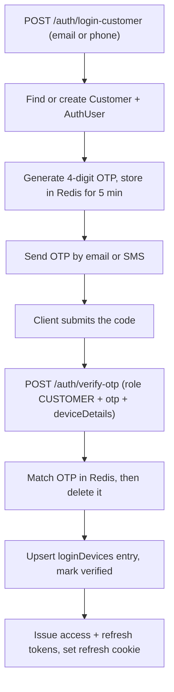
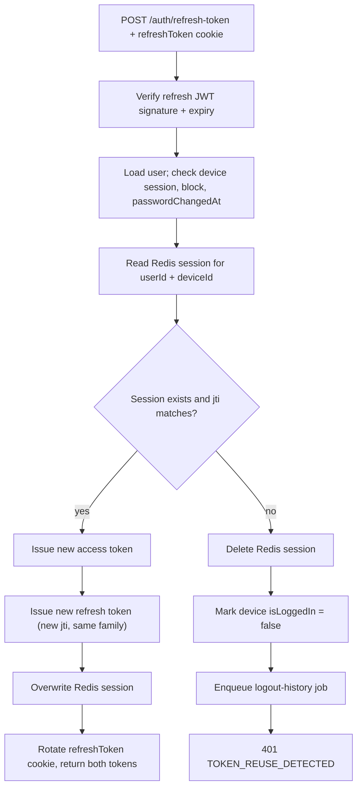
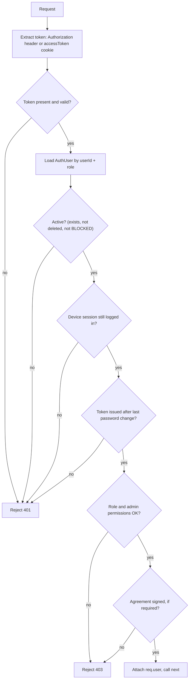

# Authentication

Authentication in the Deligo backend is built around a dedicated `AuthUser`
credential document, stateless JWTs, and a per-device session list stored on
that document. This page describes the system exactly as implemented in
`src/app/modules/Auth/` and `src/app/middlewares/auth.ts`.

Related reading: the [Data Model](../02-platform/data-model.md) page covers the
`AuthUser` ↔ profile split in more depth, and
[Architecture](../01-introduction/architecture.md) places the `auth()`
middleware in the wider request lifecycle.

---

## `AuthUser` identity model

Every account is two documents:

| Document | Collection | Holds |
| --- | --- | --- |
| **Credential** | `AuthUser` | `userId`, `role`, `email` / `contactNumber`, hashed `password`, `status`, `isDeleted`, `isEmailVerified` / `isContactNumberVerified`, `socialAccounts[]`, `loginDevices[]`, `passwordChangedAt` |
| **Profile** | `Customer` \| `Vendor` \| `FleetManager` \| `DeliveryPartner` \| `Admin` | All domain data for that user |

`AuthUser.profileId` + `AuthUser.profileModel` link the credential to its
profile. `AuthUser.userId` (e.g. `V-8F3KD91A`) is the shared business key and is
the value carried inside every JWT.

### Role / profile relationship

`ROLE_COLLECTION_MAP` (`src/app/constant/GlobalConstant/user.constant.ts`)
decides which profile collection a role uses:

| Role | Profile collection |
| --- | --- |
| `SUPER_ADMIN`, `ADMIN` | `Admin` |
| `CUSTOMER` | `Customer` |
| `FLEET_MANAGER` | `FleetManager` |
| `VENDOR`, `SUB_VENDOR` | `Vendor` |
| `DELIVERY_PARTNER` | `DeliveryPartner` |

`AuthUser` has partial-unique indexes on `{ email, role }` and
`{ contactNumber, role }`. The **same email can therefore exist once per role** —
a person who is both a customer and a vendor has two independent `AuthUser`
documents, and every lookup in the auth code keys on `email`/`userId` **and**
`role`.

### Account status

`status` is one of `PENDING · SUBMITTED · APPROVED · REJECTED · BLOCKED`.
Newly created `Customer` credentials are forced to `APPROVED` by a schema
`pre('save')` hook; other roles start `PENDING` and move through an approval
flow. For authentication specifically:

- `BLOCKED` and `isDeleted` are rejected by the `auth()` middleware on **every**
  request.
- Password login additionally requires `isEmailVerified === true`.
- The agreement re-sign gate only applies to `APPROVED` users in gated roles.
- `PENDING` / `SUBMITTED` users can still authenticate and call endpoints their
  role allows.

---

## Authentication methods

| Method | Endpoint | Who | Credential | Result |
| --- | --- | --- | --- | --- |
| Password login | `POST /api/v1/auth/login` | `VENDOR`, `SUB_VENDOR`, `FLEET_MANAGER`, `DELIVERY_PARTNER`, `ADMIN`, `SUPER_ADMIN` | email + password | access + refresh token |
| Customer OTP login | `POST /api/v1/auth/login-customer` → `POST /api/v1/auth/verify-otp` | `CUSTOMER` | email **or** phone + 4-digit OTP | access + refresh token |
| Social login | `POST /api/v1/auth/social-login` | `CUSTOMER` | Google ID token or Facebook access token | access + refresh token |
| Registration + email verification | `POST /api/v1/auth/register` → `POST /api/v1/auth/verify-otp` | `VENDOR`, `DELIVERY_PARTNER`, `FLEET_MANAGER` | email + password + emailed OTP | access + refresh token |

Customers are **never** registered explicitly — the first `login-customer` or
`social-login` call creates the `Customer` + `AuthUser` pair on the fly.
`ADMIN` and `SUB_VENDOR` accounts are created through the authenticated
`POST /api/v1/auth/register/onboard` endpoint, not `/register`.

All `/auth/*` endpoints are additionally rate-limited at 10 requests/minute/IP
(`rateLimiter('auth')`).

---

## Token architecture

Two JWTs, signed with **different secrets** and **different lifetimes** (both
from environment configuration — `JWT_ACCESS_SECRET` / `JWT_ACCESS_EXPIRES_IN`
and `JWT_REFRESH_SECRET` / `JWT_REFRESH_EXPIRES_IN`).

| | Access token | Refresh token |
| --- | --- | --- |
| Secret | `jwt_access_secret` | `jwt_refresh_secret` |
| Lifetime | short | long |
| Sent by client as | `Authorization` header (or `accessToken` cookie) | `refreshToken` cookie |
| Server-side state | none | one Redis record per device |
| Purpose | authorize API + socket calls | obtain a new access token |

Both tokens carry the same payload — `userId`, `name`, `email`,
`contactNumber`, `role`, `status`, `deviceId` — created by `createToken()` in
`src/app/utils/verifyJWT.ts`. The refresh token additionally carries a `jti`
(a UUID identifying that single issuance).

### Bearer vs. cookie

The `auth()` middleware resolves the access token in this order
(`src/app/middlewares/auth.ts`):

1. `Authorization: Bearer <token>` — the `Bearer ` prefix is stripped.
2. `Authorization: <token>` — a bare header value is also accepted.
3. `req.cookies.accessToken` — used only if no header was supplied.

The **server never sets an `accessToken` cookie** — login responses set only the
`httpOnly` `refreshToken` cookie and return both tokens in the JSON body. The
cookie fallback exists for clients that choose to store the access token that
way. The refresh token is read exclusively from the `refreshToken` cookie
(`validateRequestCookies` enforces its presence on `/auth/refresh-token`).

Cookies are set with `httpOnly: true` and `secure: true` when
`NODE_ENV === 'production'`.

### Socket.IO

Socket connections authenticate separately: `socketAuthMiddleware`
(`src/app/lib/Socket/auth.middleware.ts`) reads `socket.handshake.auth.token`
and runs `jwt.verify` against `jwt_access_secret`. It does **not** re-check the
database, block status, or device session — it only validates the access-token
signature and expiry and attaches the decoded payload to `socket.data.user`.

---

## Per-device sessions (`loginDevices`)

Each `AuthUser` carries `loginDevices: TLoginDevice[]`. One entry per device:

| Field | Meaning |
| --- | --- |
| `deviceId` | Client-supplied stable device identifier (the session key) |
| `deviceType`, `deviceName`, `userAgent`, `ip` | Diagnostics captured at login |
| `fcmToken` | Push token for this device |
| `isLoggedIn` | `false` after logout / reuse detection / password reset |
| `lastLogin`, `lastLogout` | Timestamps |
| `isVerified` | Set `true` when the device is registered by a successful auth |

**How a login updates the list** (identical in password, OTP, and social flows):

- Existing `deviceId` → the entry is replaced in place (MongoDB `arrayFilters`).
- New `deviceId`, under the limit → the entry is pushed.
- New `deviceId`, at the limit → `403 LIMIT_EXCEEDED`, unless the request sets
  `forceLogin: true`, in which case the array is pushed and trimmed to the
  newest N (`$slice: -deviceLimit`), evicting the oldest device.

The limit comes from `ROLE_DEVICE_LIMITS` — **500 for every role** as currently
configured (the code falls back to 3 only if a role is missing from that map).

A JWT is bound to its `deviceId`. If that device's entry is missing or
`isLoggedIn === false`, both `auth()` and the refresh flow reject the token —
this is what makes server-side logout and "log out this device" possible
without a token blocklist.

---

## Flow: password login

**1. Entry point** — `POST /api/v1/auth/login`, `AuthControllers.loginUser`.
The controller injects the request IP into `deviceDetails` before calling the
service.

**2. Service** — `AuthServices.loginUser` (`auth.service.ts`).

**3. Validation** — `loginValidationSchema`: `email`, `password`, and a
`deviceDetails` object (`deviceId`, `deviceType`, `deviceName` required;
`fcmToken`, `userAgent` optional), plus optional `forceLogin`.

**4. Checks and token creation**

- `AuthUser.findOne({ email, role: { $ne: 'CUSTOMER' } })` — customers cannot use
  this endpoint.
- Reject if `isDeleted` (`ACCOUNT_DELETED`), `status === BLOCKED`
  (`USER_BLOCKED`), or `!isEmailVerified` (`USER_NOT_VERIFIED`).
- `AuthUser.isPasswordMatched(password, user.password)` — bcrypt compare;
  mismatch → `401 PASSWORD_NOT_MATCHED`.
- Upsert the `loginDevices` entry (see [above](#per-device-sessions-logindevices)).
- Mint an access token, then a refresh token with a fresh `jti` and a new
  rotation `family`.

**5. Database interaction** — one `findOneAndUpdate` on `AuthUser` for the
device entry; a Redis write `storeRefreshSession(userId, deviceId, jti, family, ttl)`
under key `refresh_session:<userId>:<deviceId>`; a `CREATE_LOGIN_LOG` job on the
`auth-queue` (success or failure, with a `failureReason`).

**6. Response** — `200` with `messageKey: LOGIN_SUCCESS`, body
`{ accessToken, refreshToken }`, and the `refreshToken` cookie set.

Every failure branch also enqueues a `CREATE_LOGIN_LOG` job with the reason
(`INVALID_CREDENTIALS`, `ACCOUNT_DELETED`, `ACCOUNT_LOCKED`, `LIMIT_EXCEEDED`).

---

## Flow: customer OTP login

Two calls. The first sends an OTP; the second is the shared `verify-otp`
endpoint that actually issues tokens.

### Step 1 — request the OTP

**Entry point** — `POST /api/v1/auth/login-customer`,
`AuthControllers.loginCustomer` (clears any stale `refreshToken` cookie first).

**Service** — `AuthServices.loginCustomer`. Validation
(`loginCustomerValidationSchema`) requires `email` **or** `contactNumber`, with
an optional `referralCode`.

Inside a MongoDB transaction:

- Look up the `Customer` by email or phone. If none exists, create the
  `Customer` + `AuthUser` (`role: CUSTOMER`, `requiresOtpVerification: true`).
- If a `referralCode` is supplied and the customer has no `referredBy`, create a
  referral entry.
- Generate a 4-digit OTP (`generateOtp`), store it in Redis under
  `otp:customer:<email|phone>` with a 300-second TTL.
- Email path: render the `verify-email` template and send via SMTP.
  Phone path: send via BulkGate (`sendMobileOtp`).

**Response** — `200`, `data: null`, `messageKey: OTP_SENT_EMAIL` or
`OTP_SENT_MOBILE`. No token is issued here.

A configurable test account (a fixed email / phone with a fixed OTP) short-
circuits real OTP delivery for QA; its values come from environment
configuration and are never returned in a response.

### Step 2 — verify the OTP

**Entry point** — `POST /api/v1/auth/verify-otp`, `AuthControllers.verifyOtp`.

**Service** — `AuthServices.verifyOtp`. Validation
(`verifyOtpValidationSchema`) requires `role`, `otp`, `email` **or**
`contactNumber`, and an optional `deviceDetails` object.

- Load the `AuthUser` by `{ email|contactNumber, role, isDeleted: false }`.
- Enforce the device limit (with the same `forceLogin` override).
- Compare `otp` against the Redis value; on success **delete the key**
  (single-use). Wrong or expired → `401 INVALID_OR_EXPIRED_OTP`.
- Set `isEmailVerified` / `isContactNumberVerified` and clear
  `requiresOtpVerification`; upsert the `loginDevices` entry.
- Mint access + refresh tokens (new `jti` + `family`), write the Redis refresh
  session, enqueue a login-history job, and (first email verification only) send
  the welcome email.

**Response** — `200`, body `{ accessToken, refreshToken }`, `refreshToken`
cookie set, `messageKey: VERIFY_EMAIL_SUCCESS` / `VERIFY_CONTACT_SUCCESS`.

The same `verify-otp` endpoint completes non-customer **registration** — the
`register` call emails an OTP under `otp:<role>:<email>`, and `verify-otp` with
that role issues the first token pair.

### Resend

`POST /api/v1/auth/resend-otp` (`AuthServices.resendOtp`) issues a fresh OTP
(new 300-second TTL) and sets `requiresOtpVerification: true`. For non-customer
roles it refuses if the email is already verified (`EMAIL_ALREADY_VERIFIED_LOGIN`).

---

## Flow: customer social login

**1. Entry point** — `POST /api/v1/auth/social-login`,
`AuthControllers.socialLoginCustomer` (adds request IP to `deviceDetails`).

**2. Service** — `AuthServices.socialLoginCustomer`.

**3. Validation** — `socialLoginValidationSchema`: `provider` (`GOOGLE` |
`FACEBOOK`), `token`, `deviceDetails` (`deviceId`, `deviceType` required),
optional `referralCode` and `forceLogin`.

**4. Token verification and account resolution**

- `verifyGoogleIdToken` (via `google-auth-library`, audience =
  `GOOGLE_OAUTH_CLIENT_IDS`) or `verifyFacebookAccessToken` (Graph
  `debug_token` + `/me`, with an app-id match check). Both calls are wrapped in
  circuit breakers. A Google email is only trusted when `email_verified` is
  true.
- Resolve the `AuthUser` in this order, inside a transaction:
  1. Match on `socialAccounts.provider` + `providerId`.
  2. Otherwise match on `email` — if found, **link** the social account to the
     existing customer and set `isEmailVerified: true`.
  3. Otherwise create a new `Customer` + `AuthUser` (`isEmailVerified: true`,
     `socialAccounts` seeded). No email from the provider → `400
     SOCIAL_EMAIL_REQUIRED`.
- Reject `BLOCKED` accounts; enforce the device limit; upsert the
  `loginDevices` entry.

**5. Database interaction** — `Customer` / `AuthUser` create-or-update in a
transaction; `AuthUser` device update; Redis refresh session; `auth-queue`
login-history job (success or a specific failure reason). A unique-index
violation (`11000`) on the social account surfaces as `409
SOCIAL_ACCOUNT_ALREADY_LINKED`.

**6. Response** — `200`, body `{ accessToken, refreshToken }`, `refreshToken`
cookie set, `messageKey: SOCIAL_LOGIN_SUCCESS`. No OTP step.

---

## Flow: refresh token (rotation + reuse detection)

**1. Entry point** — `POST /api/v1/auth/refresh-token`,
`AuthControllers.refreshToken`. `validateRequestCookies` requires the
`refreshToken` cookie.

**2. Service** — `AuthServices.refreshToken`.

**3. Validation / checks** — verify signature and expiry against
`jwt_refresh_secret`; load `AuthUser` by `userId`; require the token's `deviceId`
to be a device with `isLoggedIn !== false`; reject `BLOCKED`; reject if
`passwordChangedAt` is newer than the token's `iat`.

**4. Rotation** — Redis holds `{ jti, family }`: the single refresh token
currently valid for that device.

- **Match** → mint a new access token and a new refresh token with a **new
  `jti` but the same `family`**, then overwrite the Redis record so the
  presented token can never be reused.
- **No record, or `jti` mismatch** → treat as a replayed/stolen token: delete
  the Redis session, set the device `isLoggedIn: false`, enqueue an
  `UPDATE_LOGOUT_LOG` job, and throw `401 TOKEN_REUSE_DETECTED`. That device
  must log in again.

**5. Database interaction** — read + write the Redis session key; on reuse, one
`AuthUser` device update and a queue job.

**6. Response** — `200`, `data: { accessToken, refreshToken }`, and the
`refreshToken` cookie is replaced with the new value.

---

## Flow: logout

**Entry point** — `POST /api/v1/auth/logout` (`auth()` for all roles),
`AuthControllers.logoutUser`. Body: `{ deviceId }`
(`logoutValidationSchema`). The controller clears the `refreshToken` cookie.

**Service** — `AuthServices.logoutUser`:

1. Find the `AuthUser` by `userId`; the `deviceId` must be a known device
   (`404 DEVICE_SESSION_NOT_FOUND` otherwise).
2. Set that device's `isLoggedIn: false` and `lastLogout: now`.
3. `revokeRefreshSession(userId, deviceId)` — delete the Redis refresh record.
4. Enqueue an `UPDATE_LOGOUT_LOG` job.

**Result** — the access token for that device now fails `auth()` with
`DEVICE_LOGGED_OUT`; the refresh token fails with `SESSION_EXPIRED`. Other
devices are unaffected.

---

## Flow: forgot / reset password

Password recovery is for staff-type roles only. `CUSTOMER` is rejected
(`CUSTOMER_PASSWORD_RESET_DENIED`) and `SUPER_ADMIN` cannot be reset
(`SUPER_ADMIN_PASSWORD_RESET_DENIED`).

### Forgot password

**Entry point** — `POST /api/v1/auth/forgot-password`
(`forgotPasswordValidationSchema`: `email`, `role`).
**Service** — `AuthServices.forgotPassword`:

- Load the `AuthUser` by `{ email, role, isDeleted: false }`; require
  `isEmailVerified`; reject `BLOCKED`.
- `createPasswordResetToken()` → `crypto.randomBytes(32)` hex string. The raw
  token goes into a role-specific frontend reset URL sent by email.
- Redis stores `reset-token:<sha256(token)>` → `{ userId, email, role }` with a
  **600-second TTL**. The raw token is never persisted.

**Response** — `200`, `messageKey: PASSWORD_RESET_LINK_SUCCESS`.

### Reset password

**Entry point** — `POST /api/v1/auth/reset-password`
(`resetPasswordValidationSchema`: `email`, `role`, `token`, `newPassword`).
**Service** — `AuthServices.resetPassword`:

- Hash the supplied `token`, look up `reset-token:<hash>` in Redis
  (`400 TOKEN_INVALID_OR_EXPIRED` if absent), and confirm the stored `email` and
  `role` match the request (`400 TOKEN_MISMATCH`).
- Reject `BLOCKED` / `REJECTED` accounts.
- Set every `loginDevices` entry to `isLoggedIn: false`, assign the new
  password (hashed by the model `pre('save')` hook), set
  `passwordChangedAt: now`, and `save()`.
- Delete the Redis reset-token key (single use).

**Response** — `200`, `messageKey: PASSWORD_RESET_SUCCESS`. Every existing
session is now invalid.

### Change password (authenticated)

`POST /api/v1/auth/change-password` (`auth()` for all non-customer roles;
`CUSTOMER` is rejected). `AuthServices.changePassword` verifies `oldPassword`
with bcrypt, rejects `REJECTED` / `BLOCKED`, stores the new hash with
`passwordChangedAt: now`, and — unlike reset — additionally calls
`revokeAllUserSessions(userId)`, deleting **all** `refresh_session:<userId>:*`
Redis keys.

---

## Flow: FCM token / device handling

Push tokens live on the per-device `loginDevices` entry, set two ways:

| When | How |
| --- | --- |
| At login | `deviceDetails.fcmToken` in the login / verify-otp / social-login body is written onto the device entry |
| Later / on refresh | `POST /api/v1/auth/update-fcm-token` |

`POST /api/v1/auth/update-fcm-token` (`auth()` for all roles,
`AuthControllers.updateFcmToken`) takes `{ token, deviceId }`. The service
(`AuthServices.updateFcmToken`) does one targeted update:

`AuthUser.findOneAndUpdate({ profileId, 'loginDevices.deviceId': deviceId }, { $set: { 'loginDevices.$.fcmToken': token, 'loginDevices.$.isLoggedIn': true, 'loginDevices.$.lastLogin': now } })`

If no device matches, it returns `404 DEVICE_NOT_REGISTERED`. Both `token` and
`deviceId` are required (`400 FCM_REQUIRED`).

---

## Authentication middleware — `auth()`

`src/app/middlewares/auth.ts` exports a single factory used on protected
routes. `auth('CUSTOMER')` requires that role; `auth('ADMIN', ['SOME_ACTION'])`
requires the role **and**, for `ADMIN`, that every listed permission is present
in the admin profile's `permissions[]`.

Each rejection maps to a specific message key:

| Check | Failure | Status |
| --- | --- | --- |
| Token present | `AUTHENTICATION_REQUIRED` | 401 |
| Signature / expiry (`jwt_access_secret`) | `NOT_AUTHORIZED` | 401 |
| `AuthUser` exists for `{ userId, role }` | `USER_NOT_FOUND` | 401 |
| Not soft-deleted | `ACCOUNT_DELETED` | 401 |
| Not blocked | `ACCOUNT_BLOCKED` | 403 |
| `deviceId` present in `loginDevices` and `isLoggedIn !== false` | `DEVICE_LOGGED_OUT` | 401 |
| `passwordChangedAt` (seconds) not greater than token `iat` | `PASSWORD_RECENTLY_CHANGED` | 401 |
| Role in the allowed list | `COMMON_ACCESS_DENIED` | 403 |
| Admin has every required permission | `ADMIN_ACTION_PERMISSION_DENIED` | 403 |
| Agreement signed (APPROVED gated roles, non-exempt path, non-GET or order route) | `AGREEMENT_RESIGN_REQUIRED` | 403 |

On success, `req.user` is the **profile document** (from
`AuthUser.profileModel`), with `req.user.authUserId` set to the `AuthUser._id`.
The middleware also refreshes the user's cached language preference in Redis
(`user:lang:<userId>`, 90-day TTL) from `req.lang`.

---

## `passwordChangedAt` token invalidation

`passwordChangedAt` is the mechanism that retires JWTs issued before a password
change, without any token blocklist:

1. `changePassword` and `resetPassword` both set `passwordChangedAt: new Date()`
   on the `AuthUser`.
2. On every request, `auth()` compares `floor(passwordChangedAt / 1000)` with
   the token's `iat`. If the password changed after the token was issued, the
   request is rejected with `PASSWORD_RECENTLY_CHANGED`.
3. The refresh flow performs the same check via
   `AuthUser.isJWTIssuedBeforePasswordChanged(passwordChangedAt, iat)` and
   rejects with `NOT_AUTHORIZED`.
4. Both flows also mark devices logged out, and `changePassword` additionally
   purges the Redis refresh sessions (`revokeAllUserSessions`). Access tokens
   expire quickly on their own; this check closes the gap until they do.

---

## Security and business rules (as implemented)

| Rule | Where |
| --- | --- |
| Passwords hashed with bcrypt at a configurable cost (`bcrypt_salt_rounds`); the field is `select: false` and stripped from every `toJSON` / `toObject` | `passwordPlugin` |
| Password policy: 8–64 chars, at least one lowercase, uppercase, digit, and special character | `PasswordValidation.strongPasswordSchema` |
| New password must differ from the old one | `changePasswordValidationSchema` |
| Access and refresh tokens use separate secrets | `verifyJWT.ts` / `config` |
| Refresh tokens are single-use and rotate on every call; a replay burns the whole device family | `AuthServices.refreshToken` + `authSession.utils.ts` |
| Refresh sessions are per device, stored in Redis with a TTL equal to the refresh-token lifetime | `storeRefreshSession` |
| Every JWT is bound to a `deviceId`; a logged-out device's tokens stop working immediately | `auth()` + `refreshToken` |
| Per-role device cap (`ROLE_DEVICE_LIMITS`, currently 500); `forceLogin` evicts the oldest device | login / verify-otp / social-login services |
| OTPs are 4 digits, single-use, 5-minute Redis TTL; deleted on successful verification | `generateOtp` + `verifyOtp` |
| Password reset tokens: 32-byte random, only the SHA-256 hash stored, 10-minute TTL, single use | `forgotPassword` / `resetPassword` |
| `BLOCKED` and soft-deleted accounts are refused at the middleware for all routes | `auth()` |
| Password login requires a verified email | `AuthServices.loginUser` |
| Customers cannot use password login, change-password, or password reset | `loginUser` / `changePassword` / `forgotPassword` |
| `SUPER_ADMIN` password cannot be reset via the recovery flow | `forgotPassword` |
| Google email trusted only when `email_verified`; Facebook token checked against the app id | `verifySocialToken.ts` |
| Same email may exist once per role; all lookups key on email/userId **and** role | `AuthUser` partial-unique indexes |
| Every login attempt (success and failure, with reason) is recorded via the `auth-queue` into `LoginHistory` | `auth.service.ts` + `auth.worker.ts` |
| `/auth/*` endpoints rate-limited to 10 req/min/IP | `rateLimiter('auth')` |
| 5xx responses redact `password` / `token` / `otp` fields before logging | `globalErrorHandler` |

---

## Related documentation

- [Data Model](../02-platform/data-model.md) — `AuthUser`, the profile
  collections, and session storage in the wider schema.
- [Architecture](../01-introduction/architecture.md) — the `auth()` middleware
  within the full request lifecycle and background queues.
- [Conventions](../01-introduction/conventions.md) — the `AppError` /
  message-key pattern used by every failure above.
