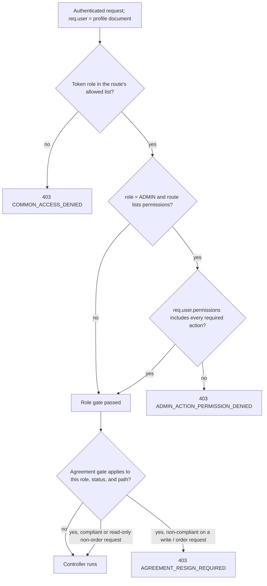

# Authorization

Authentication (covered in [Authentication](./authentication.md)) establishes
*who* the caller is and attaches the resolved profile document to `req.user`.
Authorization decides *what that caller may do*. This page describes the
authorization system exactly as implemented — primarily `auth()` in
`src/app/middlewares/auth.ts`, the `Permission` module, the agreement gate in
`src/app/modules/Agreement/agreement.config.ts`, and the per-service checks that
routes rely on.

Authorization happens in two layers:

| Layer | Where | Decides |
| --- | --- | --- |
| **Route** | `auth(...)` middleware on the route | Whether the caller's **role** (and, for `ADMIN`, its **permissions**) may reach the controller at all; plus the agreement gate |
| **Service** | Explicit checks inside `*.service.ts` | Whether *this* caller may act on *this specific resource* — ownership, scoping, and role-specific state transitions |

---

## Roles (RBAC)

The seven roles from `src/app/constant/GlobalConstant/user.constant.ts`
(`USER_ROLE`). Every access token carries exactly one role; the `auth()`
middleware treats the token's `role` as the effective role after confirming an
`AuthUser` exists for that `{ userId, role }` pair.

| Role | Typical holder | Authorization notes |
| --- | --- | --- |
| `SUPER_ADMIN` | Platform owner (one, seeded from env) | Passes every permission-gated route without a permission check; exempt from the admin self-scoping checks below |
| `ADMIN` | Back-office staff | Gated further by a per-account `permissions[]` list on the `Admin` profile |
| `FLEET_MANAGER` | Manages a pool of delivery partners | Can onboard delivery partners; scoped to its own fleet in services |
| `VENDOR` | Restaurant / store owner (parent account) | Subject to the agreement gate; can onboard its own branches |
| `SUB_VENDOR` | A branch of a vendor | Same `Vendor` collection; scoped via `parentVendorId`; **not** subject to the agreement gate |
| `DELIVERY_PARTNER` | Rider | Scoped to its own assignments; drives rider-only order transitions |
| `CUSTOMER` | End user | Scoped to its own carts, orders, addresses, etc. |

**There is no implicit role hierarchy.** `auth('ADMIN')` rejects a
`SUPER_ADMIN` because `'SUPER_ADMIN'` is not in the list. Routes that both
roles may use list both explicitly — `auth('ADMIN', 'SUPER_ADMIN')` is the
standard admin pairing (~79 routes). Omitting a role from the list is the only
way to exclude it.

---

## The `auth()` middleware as the primary gate

`auth()` is a factory. Its arguments are a list of allowed roles, optionally
followed by an array of required permission actions:

```ts
auth('CUSTOMER')                                   // role only
auth('VENDOR', 'SUB_VENDOR')                       // any of these roles
auth('ADMIN', 'SUPER_ADMIN', ['CAN_MANAGE_AGREEMENTS'])  // roles + permissions
```

The last argument is treated as a permission list only if it is an array
(`Array.isArray(lastArg)`); everything before it is a role.

After the authentication checks (token, `AuthUser`, `isDeleted`, `BLOCKED`,
device session, `passwordChangedAt` — see [Authentication](./authentication.md)),
the middleware runs the authorization checks:



| Check | Uses | Failure | Status |
| --- | --- | --- | --- |
| Role in allowed list | token `role` | `COMMON_ACCESS_DENIED` | 403 |
| Admin has every required permission | `req.user.permissions` (Admin profile) — **only when `role === 'ADMIN'`** | `ADMIN_ACTION_PERMISSION_DENIED` | 403 |
| Agreement signed (if gated) | `Agreement` records | `AGREEMENT_RESIGN_REQUIRED` (with structured `data`) | 403 |

Key consequence: the permission block is `if (role === 'ADMIN' && requiredPermissions.length > 0)`.
A `SUPER_ADMIN` on the same route satisfies the role list and then **skips the
permission check entirely**.

---

## `AuthUser` vs. profile-level authorization

Authorization reads from both documents that make up an account (see the
[Data Model](../02-platform/data-model.md)):

| Concern | Source | Read by |
| --- | --- | --- |
| Effective role | token `role`, confirmed against an `AuthUser` with that `{ userId, role }` | `auth()` role gate |
| Account is usable (`isDeleted`, `status === BLOCKED`) | `AuthUser` | `auth()` |
| Device session still valid | `AuthUser.loginDevices` | `auth()` |
| Credentials not rotated (`passwordChangedAt`) | `AuthUser` | `auth()` |
| **Admin permissions** | `Admin` **profile** `permissions: string[]` | `auth()` permission block |
| Ownership / scoping (`_id`, `userId`, `parentVendorId`, `role`, `businessDetails`, …) | the **profile** document (`req.user`) | service-level checks |

`req.user` is the profile document, with `req.user.authUserId` set to the
`AuthUser._id`. The `permissions` array exists **only on the `Admin` model** —
no other profile type has a permission field, and nothing reads one.

---

## Admin permissions

### The permission actions

`VALID_PERMISSION_ACTIONS` in `src/app/modules/Permission/permission.constant.ts`
defines 14 action codes. They are stored as plain strings in
`Admin.permissions` and compared by string equality in `auth()`.

Only **four** are currently referenced by any `auth(...)` call, i.e. actually
enforced:

| Permission action | Enforced on | Routes |
| --- | --- | --- |
| `CAN_MANAGE_PERMISSIONS` | `POST/PATCH/GET/DELETE /api/v1/permissions/*`, assign/revoke | `permission.route.ts` |
| `CAN_MANAGE_AGREEMENTS` | `/api/v1/agreements/*`, `/api/v1/agreement-versions/*` | `agreement.route.ts`, `agreement-version.route.ts` |
| `CAN_MANAGE_INGREDIENTS` | ingredient create / update / delete / restock | `ingredients.route.ts` |
| `CAN_MANAGE_ACTIVITY_LOGS` | `/api/v1/activity-logs/*` | `activityLog.route.ts` |

The remaining ten — `CAN_VIEW_DASHBOARD`, `CAN_MANAGE_ADMINS`,
`CAN_MANAGE_VENDORS`, `CAN_MANAGE_PARTNERS`, `CAN_MANAGE_FLEET`,
`CAN_MANAGE_CUSTOMERS`, `CAN_MANAGE_ORDERS`, `CAN_MANAGE_COUPONS`,
`CAN_VIEW_ANALYTICS`, `CAN_MANAGE_SYSTEM_SETTINGS` — are valid values that can
be created and assigned, but no route or service checks them. Assigning them to
an admin currently has no effect on access. They are documented here as
**defined but not wired to an enforcement point**, not as active controls.

### Enforcement semantics

- The permission list on a route is checked with **AND** semantics —
  `requiredPermissions.every(p => adminPermissions.includes(p))`. Every
  enforced route currently passes a single-element array, so AND vs. OR is not
  yet observable, but "must hold all listed permissions" is the implemented
  rule.
- The check runs **only for `role === 'ADMIN'`**. `SUPER_ADMIN` bypasses it;
  every other role is already rejected by the role gate before it is reached.
- A missing `permissions` array is treated as `[]` (no permissions).

### The `Permission` collection vs. the string list

| | `Permission` collection | `Admin.permissions` |
| --- | --- | --- |
| Purpose | Catalogue of permission definitions (`name`, `action`, `module`, `displayName`, `isSystemDefined`, `isActive`, `isDeleted`) | The list of action strings an admin actually holds |
| Used at request time for authorization | **No** | **Yes** — this is what `auth()` reads |
| Managed by | `permission.service.ts` CRUD, gated by `CAN_MANAGE_PERMISSIONS` | `assignPermissionsToAdmin` / `revokePermissionsFromAdmin` |

`assignPermissionsToAdmin` takes `permissionIds`, resolves them to `action`
codes from the `Permission` collection (rejecting unknown or soft-deleted ids
via `INVALID_OR_INACTIVE_PERMISSION_IDS`), then `$addToSet`s those strings onto
`Admin.permissions`. `revokePermissionsFromAdmin` takes `action` strings
directly, verifies the admin currently holds each (`REVOKE_FAILED_MISSING_PERMISSIONS`
otherwise), and `$pull`s them. Both are gated by
`auth('SUPER_ADMIN', 'ADMIN', ['CAN_MANAGE_PERMISSIONS'])`, and
`isSystemDefined` permissions cannot be deleted or have their `action` changed.

---

## `SUPER_ADMIN` vs. `ADMIN`

Both live in the `Admin` collection (`role` enum `['ADMIN', 'SUPER_ADMIN']`).
Concrete differences that affect authorization:

| Aspect | `ADMIN` | `SUPER_ADMIN` |
| --- | --- | --- |
| Permission-gated routes | Must hold every required action in `permissions[]` | Passes without a permission check |
| Editing / viewing another admin's profile or document images | Denied — `admin.service.ts` rejects when `currentUser.userId !== adminId` (`COMMON_ACCESS_DENIED`) | Allowed |
| Admin **document-image** upload when the target's `isUpdateLocked` is set | Blocked (`UPDATE_LOCKED`) | Not blocked |
| Onboarding a new `ADMIN` | Not allowed (`ROLE_ONBOARD_PERMISSIONS.admin = ['SUPER_ADMIN']`) | Allowed |
| Password recovery (`/auth/forgot-password`) | Allowed | Refused (`SUPER_ADMIN_PASSWORD_RESET_DENIED`) |
| Creation | Onboarded by a `SUPER_ADMIN` | Seeded once from environment configuration on boot; never onboarded |

> `Admin.isUpdateLocked` is applied inconsistently: `updateAdmin` rejects the
> update for **any** caller when the flag is set (including `SUPER_ADMIN`),
> whereas `adminDocImageUpload` only rejects when `currentUser.role === 'ADMIN'`.
> Only the document-image path is a `SUPER_ADMIN` / `ADMIN` distinction.

Aside from these explicit branches, a route that lists both roles treats them
identically.

---

## Route-level authorization patterns

Every protected route composes `auth(...)` before `validateRequest(...)` and the
controller. Common shapes:

| Pattern | Meaning | Example |
| --- | --- | --- |
| `auth('CUSTOMER')` | Single role | cart, checkout, place order |
| `auth('VENDOR', 'SUB_VENDOR')` | A parent vendor and its branches | catalog management, order accept/prepare |
| `auth('ADMIN', 'SUPER_ADMIN')` | Any admin | admin CRUD, most back-office reads |
| `auth('ADMIN', 'SUPER_ADMIN', ['CAN_MANAGE_X'])` | Admin **with** a permission | permissions, agreements, ingredients, activity logs |
| `auth('ADMIN', 'SUPER_ADMIN', 'VENDOR', 'SUB_VENDOR', 'CUSTOMER', ...)` | Shared read endpoints | e.g. `GET /orders` and `GET /orders/:id`, then scoped in the service |
| *(no `auth`)* | Public | registration, login, OTP, social login, `POST /payment/reduniq/notification` (gateway webhook), `GET /` |

Roughly one in thirteen protected routes adds a permission array; the rest are
role-only. When a shared endpoint lists many roles, the meaningful restriction
is applied in the service (next section).

---

## Service-level authorization patterns

Role membership alone is often not enough — a customer must not read another
customer's order, an `ADMIN` must not edit another admin. Services enforce this
directly on `req.user` (typed `TCurrentUser`). The recurring patterns:

### Ownership / self-scoping

A caller may only act on their own record. Typically:

```ts
if (currentUser.role === 'ADMIN' && currentUser.userId !== adminId) {
  throw new AppError(httpStatus.FORBIDDEN, 'COMMON_ACCESS_DENIED', { ... });
}
```

Seen in `admin.service.ts` (an `ADMIN` may only view/update its own profile and
document images) and, with role-specific variants, throughout
`vendor.service.ts`.

### Query scoping

List endpoints that several roles share build a role-dependent base filter
before handing the query to `QueryBuilder`, so each caller only ever sees their
own rows:

- `transaction.service.ts` — non-admins are forced to
  `{ userId: currentUser._id, userModel: <role's collection> }`; admins see all.
- `order.service.ts` `getAllOrders` — customers, vendors, delivery partners,
  and fleet managers each get a filter derived from their identity; admins are
  unfiltered.

### Role-specific state transitions

The order lifecycle is partitioned by role inside `order.service.ts`:

| Action | Allowed role (checked in the service) |
| --- | --- |
| Create / cancel (pre-accept) / reorder | `CUSTOMER` |
| Accept / reject / prepare / ready / verify pickup code / broadcast | `VENDOR`, `SUB_VENDOR` |
| Accept dispatch / picked up / on the way / delivered / request reassignment | `DELIVERY_PARTNER` |

A call from the wrong role fails with `COMMON_ACCESS_DENIED` even though the
route's `auth(...)` list permitted the request to reach the controller. This is
the deliberate division of labour between the two layers: `auth()` filters by
role class, the service enforces the resource- and state-specific rule.

### Vendor / branch scoping

`SUB_VENDOR` records are the same collection as their parent `VENDOR`, linked by
`parentVendorId`. `vendor.service.ts` uses `currentUser.role` and
`currentUser.parentVendorId` to keep a branch's actions within its brand family
and to let a parent manage its branches.

---

## The agreement gate as an authorization constraint

For roles that must sign a platform agreement, `auth()` adds a final gate after
the role and permission checks. Its configuration lives in
`src/app/modules/Agreement/agreement.config.ts`.

**Who it affects.** Only roles with an `initialAgreementForRole` entry in
`AGREEMENT_CONFIG` — currently **`VENDOR`** (`INITIAL_VENDOR_AGREEMENT`) and
**`FLEET_MANAGER`** (`INITIAL_FLEET_MANAGER_AGREEMENT`). `SUB_VENDOR`,
`DELIVERY_PARTNER`, `CUSTOMER`, `ADMIN`, and `SUPER_ADMIN` are not gated.

**When it runs.** All of:

1. `getInitialAgreementTypeForRole(role)` returns a type (i.e. the role is
   gated), **and**
2. `AuthUser.status === APPROVED`, **and**
3. `req.baseUrl` does **not** start with an exempt prefix:
   `/api/v1/agreements`, `/api/v1/auth/logout`, `/api/v1/auth/change-password`,
   `/api/v1/auth/update-fcm-token`, `/api/v1/notifications/my-notifications`.

**What it blocks.** When a *current* agreement exists for the party and it is
not signed, the request is rejected with `403 AGREEMENT_RESIGN_REQUIRED` (the
error carries a structured `data` payload — `agreementId`, `agreementType`,
`versionNumber`) **if** the request is "restricted":

- `req.method !== 'GET'` (any write), **or**
- `req.baseUrl` starts with `/api/v1/orders` (even a GET).

So an `APPROVED` vendor or fleet manager with an unsigned current agreement can
still perform read-only, non-order requests, but every write and every order
route is blocked until they re-sign. Non-`APPROVED` users never hit this gate —
their access is constrained by the ordinary role checks and by whatever their
`PENDING` / `SUBMITTED` state allows in each flow.

---

## Onboarding authorization

New non-customer accounts are created through
`POST /api/v1/auth/register/onboard` (`AuthServices.onboardUser`). Two gates
apply, in order:

1. **Route** — `auth('ADMIN', 'FLEET_MANAGER', 'SUPER_ADMIN', 'VENDOR')`. No
   other role can call the endpoint.
2. **Service** — the caller must be `APPROVED` (`ONBOARD_UNAPPROVED_USER`
   otherwise), then `onboardUser` consults `ROLE_ONBOARD_PERMISSIONS`
   (`src/app/modules/Auth/auth.constant.ts`), looked up by the **lower-cased
   target role**:

| Target role | Map key | Value (`allowedRoles`) | Enforced? |
| --- | --- | --- | --- |
| `VENDOR` | `vendor` | `ADMIN`, `SUPER_ADMIN` | Yes |
| `CUSTOMER` | `customer` | `ADMIN`, `SUPER_ADMIN` | Yes |
| `ADMIN` | `admin` | `SUPER_ADMIN` | Yes |
| `SUB_VENDOR` | `sub_vendor` → *(map has `sub-vendor`)* | — | **No — key mismatch, see below** |
| `DELIVERY_PARTNER` | `delivery_partner` → *(map has `delivery-partner`)* | — | **No — key mismatch** |
| `FLEET_MANAGER` | `fleet_manager` → *(map has `fleet-manager`)* | — | **No — key mismatch** |

> **Ambiguous / partially enforced.** The lookup is
> `ROLE_ONBOARD_PERMISSIONS[currentOnboardingRole.toLowerCase()]`. Role values
> lower-case with underscores (`SUB_VENDOR` → `sub_vendor`), but the map's keys
> for multi-word roles use hyphens (`sub-vendor`, `delivery-partner`,
> `fleet-manager`). Those three lookups return `undefined`, and the guard is
> `if (allowedRoles && !allowedRoles.includes(currentUser.role))` — so it is
> skipped when the key does not match. Only `vendor`, `customer`, and `admin`
> targets are actually restricted by this map today. This is documented as the
> observed behaviour, not as intended design.

Independently of the map, `SUB_VENDOR` onboarding has explicit branch-parent
rules in `onboardUser`: a `VENDOR` caller onboards its own branch, while an
`ADMIN` / `SUPER_ADMIN` caller must supply a valid `parentVendorId`
(`PARENT_VENDOR_ID_REQUIRED_FOR_SUB_VENDOR` / `PARENT_VENDOR_NOT_FOUND`).

---

## Enforcement points summary

| Rule | Enforced at | Mechanism |
| --- | --- | --- |
| Caller must hold a valid, non-blocked, non-deleted account with a live device session | `auth()` | see [Authentication](./authentication.md) |
| Caller's role must be in the route's allowed list | `auth()` | `requiredRoles.includes(role)` |
| `ADMIN` must hold every listed permission action | `auth()` | `req.user.permissions` string match (skipped for `SUPER_ADMIN`) |
| Gated `VENDOR` / `FLEET_MANAGER` must have signed the current agreement for writes and order routes | `auth()` | `AgreementService.isPartyAgreementSigned` + exempt/restricted prefix lists |
| Caller may act only on their own resource | service | `currentUser.userId` / `_id` / `parentVendorId` comparisons |
| Shared list endpoints return only the caller's rows | service | role-dependent base filter before `QueryBuilder` |
| Order lifecycle actions are restricted to the correct role | `order.service.ts` | explicit `currentUser.role` checks per action |
| Onboarding a role is restricted to specific caller roles | route + `onboardUser` | `auth(...)` list + `ROLE_ONBOARD_PERMISSIONS` (see caveat above) |
| Permission catalogue changes and admin permission assignment | route | `auth('SUPER_ADMIN', 'ADMIN', ['CAN_MANAGE_PERMISSIONS'])` |

---

## Related documentation

- [Authentication](./authentication.md) — identity, tokens, sessions, and the
  authentication half of the `auth()` middleware.
- [Architecture](../01-introduction/architecture.md) — where `auth()` sits in
  the request lifecycle.
- [Data Model](../02-platform/data-model.md) — `AuthUser`, the `Admin` profile,
  and the role → collection map.
- [Conventions](../01-introduction/conventions.md) — the `AppError` /
  message-key pattern used by every denial above.
