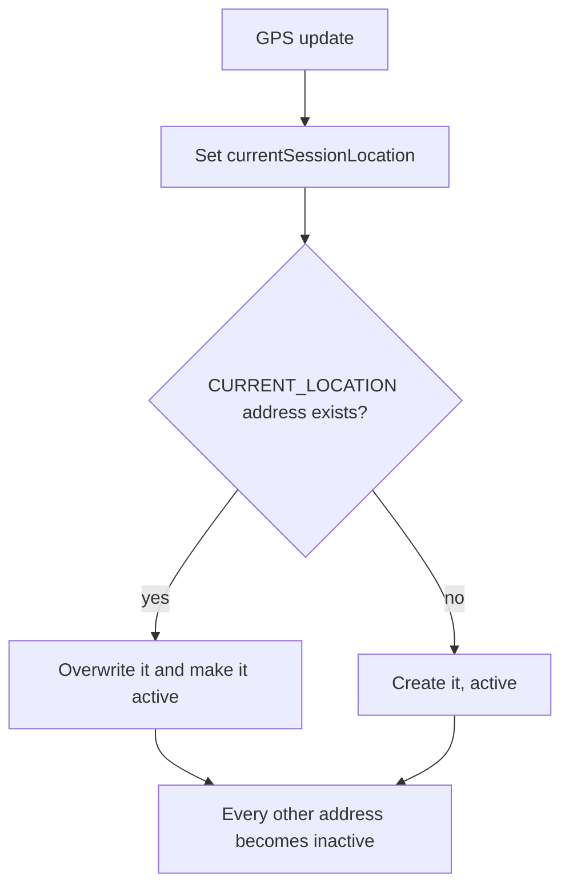

# Customer Addresses and Location

A customer's position in the backend is kept in three places on the `Customer` profile: a
list of saved **delivery addresses** (exactly one of which is "active"), a single `address`
field that mirrors the active one, and a **session location** (`currentSessionLocation`) that
holds the latest GPS point. Checkout delivers to the active address, and vendor discovery uses
the active address or, failing that, the session location. This page covers how these are
written; the read side is documented where it is used.

Paths are relative to `src/app/`; the module is `modules/Customer/`. Statements come from the
committed code, read but not run, unless marked **Executed** (a probe ran real code with no
database), **Inferred** or **Unresolved**. Uncommitted working-tree features are not described.

---

## At a glance

| Question | Answer |
| --- | --- |
| Base path | `/api/v1/customers`. Every address and location route is `CUSTOMER` only. |
| Address limit | 5 saved addresses, counting the current-location one. |
| Active address | Exactly one address is active at a time. Adding, activating or updating the profile address makes one active and the others inactive. |
| Address types | `PRIMARY`, `SECONDARY`, `HOME`, `OFFICE`, `OTHER`, `CURRENT_LOCATION`. Clients may send `HOME`, `OFFICE`, `OTHER`, `CURRENT_LOCATION`. |
| Used by | Checkout (delivery address), customer vendor and product discovery, and [Sponsorships](../02-platform/sponsorships.md). |
| Notifications, audit | None. |

---

## Data model (on `Customer`)

| Field | Notes |
| --- | --- |
| `deliveryAddresses[]` | `street`, `city`, `state`, `country`, `postalCode`, `longitude`, `latitude`, `geoAccuracy`, `detailedAddress`, `notes`, `isActive` (default false), `addressType`, `customAddressType` and `zoneId`. |
| `address` | A single address object. The add, activate and update-of-the-active-address operations copy the active address into it. |
| `currentSessionLocation` | A GeoJSON `Point` (`coordinates` as `[longitude, latitude]`) with `geoAccuracy`, `isMocked`, `lastLocationUpdate`. |
| `referralCode`, `referredBy` | Created and used by the referral flow, see [Points and Referrals](../09-offers-and-coupons/points-and-referrals.md). |

`zoneId` has no input path: **Executed:** the address validation is strict and rejects a
`zoneId` key, and `addressType: PRIMARY` is also rejected, so no API call can set a zone on an
address or create a `PRIMARY` one directly (a `PRIMARY` address comes from the profile update below).

---

## Routes

| Endpoint | Behavior |
| --- | --- |
| `POST /customers/add-delivery-address` | Body `{ deliveryAddress: {...} }` (strict). See [Adding](#adding-an-address). |
| `PATCH /customers/update-delivery-address/:addressId` | Body `{ deliveryAddress: {...partial} }`. See [Updating](#updating-an-address). |
| `PATCH /customers/toggle-delivery-address-status/:addressId` | Makes that address the active one. |
| `DELETE /customers/delete-delivery-address/:addressId` | Removes an address. |
| `GET /customers/delivery-addresses/all` | The caller's `deliveryAddresses` (empty list if none). |
| `PATCH /customers/:customerId/update-live-location` | GPS update, see [below](#live-location-update). `:customerId` is the caller's `userId`. |
| `PATCH /customers/:customerId` | Profile update (`ADMIN`, `SUPER_ADMIN` and the customer itself), see [below](#profile-update-and-the-primary-address). |

An address `:addressId` is the subdocument `_id` from the list.

### Adding an address

- Required: `street`, `city`, `state`, `country`, `postalCode`, `latitude` and `longitude` (non-empty, non-zero); otherwise `DELIVERY_ADDRESS_FIELDS_REQUIRED`. `addressType` defaults to `HOME`; `OTHER` needs a `customAddressType`.
- Refused at 5 addresses (`ADDRESS_LIMIT_REACHED`).
- Refused as a duplicate (`ADDRESS_ALREADY_EXISTS`) when **either** street, city, country and postal code all match an existing address (case and space insensitive) **or** the coordinates are within 0.0001 degrees on both axes.
- The new address becomes **active**, every other one is deactivated, `address` is overwritten with it, and `currentSessionLocation` is set to its coordinates.

### Updating an address

- A partial update of the fields above. Changing an address to or from `PRIMARY` is refused (`PRIMARY_ADDRESS_TYPE_IMMUTABLE`, `CANNOT_SET_PRIMARY_MANUALLY`). `OTHER` needs a custom type, other types clear it.
- New coordinates are checked against the **other** addresses at five-decimal precision (`ADDRESS_COORDINATES_DUPLICATE`). The street, city and postal code duplicate rule of adding is **not** applied.
- If the address is active, `address` is refreshed; `currentSessionLocation` is **not** moved, even when the coordinates changed.

### Activating and deleting

- **Activate** (called "toggle"): it always activates the target and deactivates the rest; calling it on the already active address leaves it active. `address` is set to it; the session location is not changed.
- **Delete** is refused for the active address (`CANNOT_DELETE_ACTIVE_ADDRESS`) and for a `PRIMARY` address (`CANNOT_DELETE_PRIMARY_ADDRESS`). A saved `CURRENT_LOCATION` address can be deleted while inactive and is recreated by the next GPS update.

### Live location update

`PATCH /customers/:customerId/update-live-location` takes `latitude`, `longitude` (range checked),
optional `geoAccuracy`, `isMocked` and optional address text (`street`, `city`, `state`, `country`,
`postalCode`, `detailedAddress`, `notes`). The caller must be `APPROVED` and `customerId` must
equal the caller's `userId`; a `geoAccuracy` above 100 is refused (`LOW_LOCATION_ACCURACY`).

It sets `currentSessionLocation` and **also maintains the `CURRENT_LOCATION` address**: an
existing one is overwritten (merged with the text sent) and activated, otherwise a new one is
created, and every other address is **deactivated**. There is no address-limit check on this path.

**Consequence.** After a GPS update the customer's chosen saved address is no longer active,
and the next checkout uses the GPS address. Because that address only has the text that the
update carried, it often has no street or city, and checkout then fails with
`DELIVERY_ADDRESS_INCOMPLETE` until the customer activates a complete address again
(**Inferred** from the two code paths).

### Profile update and the primary address

`PATCH /customers/:customerId` (strict body: `name`, `emergencyContact`, `profilePhoto`, `NIF`,
`address`) requires an `APPROVED` caller, a customer that has finished OTP verification
(`OTP_VERIFICATION_REQUIRED` otherwise) and, for a customer caller, its own account. An admin
may update any customer.

- If `address` is sent, it is merged into the `PRIMARY` delivery address (created when missing), made **active**, and every other address is deactivated. `currentSessionLocation` is moved to it when it has coordinates. A `geoAccuracy` above 100 is refused.
- If the customer has no `referralCode` yet, one is **generated and saved on this update**, from the first name sent or stored. A customer who never updates the profile never gets a code (see [Points and Referrals](../09-offers-and-coupons/points-and-referrals.md#referral-codes)).
- Email and phone are not changeable here. They change through the OTP flow `PATCH /profile/send-otp` and `PATCH /profile/update-email-or-contact-number`, which checks a 5-minute OTP kept in Redis with a lock on the new value and updates both the `AuthUser` and the profile in one transaction.

---

## What reads these values

| Reader | What it uses |
| --- | --- |
| Checkout (`POST /checkout`, delivery orders) | The **active** address; it must have latitude, longitude, city and street (`DELIVERY_ADDRESS_INCOMPLETE`). The road distance to the vendor is computed from it and the address is copied into the order snapshot. Pickup orders skip this. See [Checkout and Order Creation](../03-orders/checkout-and-order-creation.md). |
| Customer vendor and product discovery | The active address, else the session location (see [Vendors and Branches](../04-vendors/vendors-and-branches.md#customer-vendor-discovery)). |
| Sponsorship visibility | The active address if it has coordinates, else the session location (see [Sponsorships](../02-platform/sponsorships.md#what-a-customer-or-guest-sees)). |

Reading a customer: `GET /customers` is `ADMIN` and `SUPER_ADMIN`. `GET /customers/:customerId`
admits vendors, riders and fleet managers on the route but the service refuses any caller other
than an admin unless `customerId` equals the caller's own id, so it is effectively admin-only
(a customer does not have it in the route list at all). A customer reads its own profile
through `GET /profile`.

---

## Mismatches and inconsistencies

1. **GPS updates silently change the delivery address.** Every live-location call activates the `CURRENT_LOCATION` address and deactivates the customer's selection.
2. **`toggle-delivery-address-status` does not toggle.** It always activates.
3. **The session location is updated unevenly.** Adding an address and the profile update move it; activating and updating an address do not.
4. **`zoneId` is unreachable.** It exists on addresses and is checked when a zone is deleted, but no input sets it.
5. **Three overlapping representations:** `address`, the active entry of `deliveryAddresses`, and `currentSessionLocation` can disagree after the operations that update only some of them.
6. **The 5-address limit and duplicate rules are not applied everywhere.** The live-location path ignores the limit, and updating an address skips the text duplicate rule.
7. **No audit and no notification** for any address or location change.
8. **`SECONDARY` and `PRIMARY` cannot be chosen** by the client but exist in the enum; `PRIMARY` only appears through the profile update.

---

## Unverified or inferred behavior

- Only the address validation (`zoneId`, `PRIMARY`, `CURRENT_LOCATION`) was executed. The service operations, the GPS-to-checkout consequence and the profile merge are read from the code.
- How clients present the active address or react to a GPS update is not known from the backend.

---

## Related documentation

- [Authentication](./authentication.md): customer sign-in and the OTP step (`requiresOtpVerification`) that must be completed before a profile update.
- [Vendors and Branches](../04-vendors/vendors-and-branches.md#customer-vendor-discovery): how discovery uses the address and session location.
- [Checkout and Order Creation](../03-orders/checkout-and-order-creation.md): how the active address becomes a delivery address and a distance charge.
- [Points and Referrals](../09-offers-and-coupons/points-and-referrals.md): the referral code created by the first profile update.
- [Sponsorships](../02-platform/sponsorships.md): zone targeting of campaigns.
