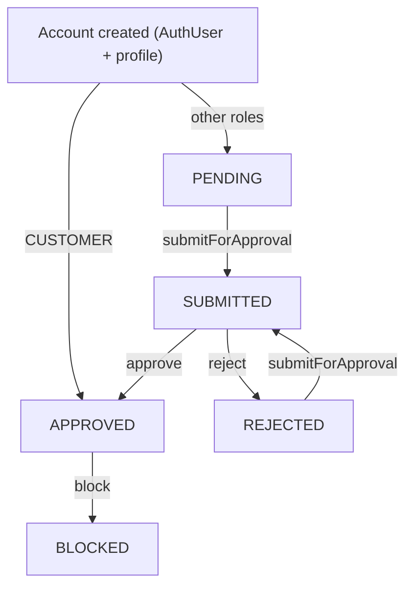
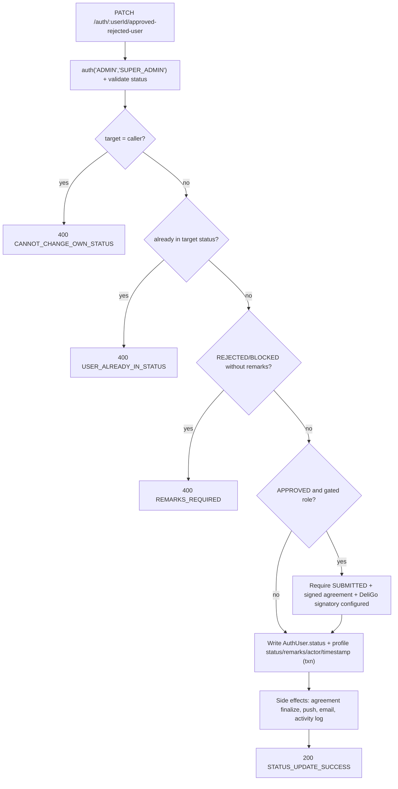

# User Lifecycle

This page follows an account from creation to deletion, using the two-document
identity model from [Authentication](./authentication.md) (a credential
`AuthUser` plus a role profile) and the role rules from
[Authorization](./authorization.md). Every flow below lives in
`src/app/modules/Auth/` (`auth.route.ts`, `auth.controller.ts`,
`auth.service.ts`); the data shapes are in the
[Data Model](../02-platform/data-model.md).

Two fields drive the lifecycle:

| Field | On | Meaning |
| --- | --- | --- |
| `status` | `AuthUser` **and** the profile document (kept in sync) | `PENDING · SUBMITTED · APPROVED · REJECTED · BLOCKED` (`USER_STATUS`) |
| `isDeleted` | `AuthUser` **and** the profile document | Soft-delete flag |

Profile documents also carry `submittedForApprovalAt`,
`approvedOrRejectedOrBlockedAt`, `approvedBy` / `rejectedBy` / `blockedBy`,
`remarks`, and `isUpdateLocked`.

---

## Status lifecycle

| Status | Set by | Notes |
| --- | --- | --- |
| `PENDING` | Account creation (non-customer) | Initial state after `register` / `register/onboard` |
| `SUBMITTED` | `submitForApproval` | Also sets `isUpdateLocked: true` and `submittedForApprovalAt` |
| `APPROVED` | `approvedOrRejectedUser` (admin) | Customers are set to `APPROVED` at creation and never enter the other states through a normal flow |
| `REJECTED` | `approvedOrRejectedUser` (admin) | Requires `remarks`; clears `isUpdateLocked` |
| `BLOCKED` | `approvedOrRejectedUser` (admin) | Requires `remarks`; hard-stops authentication |

**Transition enforcement is only partial.** `submitForApproval` refuses when the
account is already `SUBMITTED` or `APPROVED`, so the normal path is
`PENDING → SUBMITTED` (and `REJECTED → SUBMITTED` on re-submission).
`approvedOrRejectedUser` only refuses a no-op (`status` already equal to the
target) and requires `remarks` for `REJECTED` / `BLOCKED`. The one strict
guard: setting `APPROVED` for a **gated role** (`VENDOR`, `FLEET_MANAGER` — the
roles with an initial agreement, see [Authorization](./authorization.md)) fails
unless the account is currently `SUBMITTED` (`PARTY_NOT_SUBMITTED_FOR_APPROVAL`).
For other roles there is no such precondition, so an admin can move them to
`APPROVED`, `REJECTED`, or `BLOCKED` from any non-equal status.

---

## Registration and account creation

Self-service registration for `VENDOR`, `DELIVERY_PARTNER`, and `FLEET_MANAGER`
(the roles allowed by `registerValidationSchema`).

| Step | Detail |
| --- | --- |
| **Entry** | `POST /api/v1/auth/register` — no `auth()`; `validateRequest(registerValidationSchema)`; `rateLimiter('auth')` |
| **Validation** | `email`, `role ∈ {VENDOR, DELIVERY_PARTNER, FLEET_MANAGER}`, `password` (8–64 chars, complexity — see [Authentication](./authentication.md)) |
| **Service** | `AuthServices.registerUser` |
| **Pre-checks** | If a **verified** non-customer `AuthUser` exists for that email → `EMAIL_ALREADY_REGISTERED`; if a verified account for the *same* role exists → `EMAIL_ALREADY_VERIFIED` |
| **Profile / `AuthUser` changes** | In one transaction: any **unverified** prior non-customer account for that email is deleted first, then the role profile is created (`email`, `userId`, `role`), then the `AuthUser` (`userId`, `profileId`, `profileModel`, `email`, hashed `password`, `role`, `status: 'PENDING'`) |
| **Side effects** | OTP stored in Redis (`otp:<role>:<email>`, 5-min TTL); `verify-email` email sent (fire-and-forget); `createActivityLog(USER_REGISTERED)` |
| **Response** | `200` `REGISTRATION_SUCCESS`, `data: { userId, email, role, status: 'PENDING' }` — no token yet |

### `AuthUser` + role-profile relationship at creation

Both documents are created in the **same transaction** and share the generated
`userId` (`C-…` / `V-…` / `SV-…` / `D-…` / `FM-…` / `A-…`). The `AuthUser`
points at the profile via `profileId` + `profileModel`; the profile stores its
own copy of `userId` and `role`. `ROLE_COLLECTION_MAP` decides the profile
collection (`VENDOR`/`SUB_VENDOR` → `Vendor`, `ADMIN`/`SUPER_ADMIN` → `Admin`,
etc.). A `code 11000` duplicate-key failure inside the transaction rolls back
both writes and surfaces as `EMAIL_CONFLICT_ROLE`.

### Customers

Customers are never created through `register`. Their `AuthUser` + `Customer`
pair is created on first `login-customer` / `social-login` (see
[Authentication](./authentication.md)). A `pre('save')` hook on `AuthUser` and
the `Customer` schema default both force `status: 'APPROVED'` for a new
customer, so customers skip `PENDING` / `SUBMITTED` / approval entirely.

---

## Onboarding

Staff-initiated creation of another account:
`POST /api/v1/auth/register/onboard` → `AuthServices.onboardUser`.

| Difference from self-registration | Detail |
| --- | --- |
| **Auth gate** | `auth('ADMIN', 'FLEET_MANAGER', 'SUPER_ADMIN', 'VENDOR')`; caller must be `APPROVED` (`ONBOARD_UNAPPROVED_USER`); target-role restriction via `ROLE_ONBOARD_PERMISSIONS` — see the caveats in [Authorization](./authorization.md) |
| **Target roles** | `VENDOR`, `SUB_VENDOR`, `DELIVERY_PARTNER`, `FLEET_MANAGER`, `ADMIN` (`registerOnboardingValidationSchema`) |
| **`registeredBy`** | Set on the new profile: `{ id, model }` for `VENDOR`/`SUB_VENDOR`/`DELIVERY_PARTNER`, otherwise the caller's `_id` |
| **`SUB_VENDOR`** | Parent resolved from the caller (a `VENDOR` onboarding its own branch) or from `parentVendorId` (an admin) — `PARENT_VENDOR_ID_REQUIRED_FOR_SUB_VENDOR` / `PARENT_VENDOR_NOT_FOUND` otherwise. `businessName`, `businessType`, `restaurantCuisineType`, `isHalal`, `NIF` are copied from the parent; `businessDetails.activeBranches` / `totalBranches` on the parent are recomputed (`recomputeParentBranchCount`) in the same transaction |
| **`DELIVERY_PARTNER` by a `FLEET_MANAGER`** | `currentFleetManagerId` on the new profile is set to the caller |
| **Cleanup** | Any unverified prior account for the email is removed, plus a `deleteOne({ email })` on the target profile collection, before the new records are created |
| **Result** | Same as registration — `status: 'PENDING'`, OTP stored, `verify-email` sent, `ONBOARD_SUCCESS`; the controller adds `createActivityLog(USER_ONBOARDED)` |

---

## Verification's place in the lifecycle

`POST /api/v1/auth/verify-otp` (covered in
[Authentication](./authentication.md)) completes registration by setting
`isEmailVerified` / `isContactNumberVerified`, clearing
`requiresOtpVerification`, registering the device, and issuing the first token
pair. **It does not change `status`** — a verified non-customer account is still
`PENDING`. Password login only requires a verified email, not an approved
status, so a `PENDING` / `SUBMITTED` account can already authenticate and use
whatever its role and state allow.

---

## Submit for approval

| Step | Detail |
| --- | --- |
| **Entry** | `PATCH /api/v1/auth/:userId/submitForApproval` |
| **Auth gate** | `auth('VENDOR', 'SUB_VENDOR', 'DELIVERY_PARTNER', 'FLEET_MANAGER', 'ADMIN', 'SUPER_ADMIN')` |
| **Service** | `AuthServices.submitForApproval` |
| **Who may submit for whom** | Admins may submit for anyone. Otherwise: a user may submit their own account; a `FLEET_MANAGER` may submit a `DELIVERY_PARTNER` they own (`currentFleetManagerId`); a `VENDOR` may submit its own `SUB_VENDOR` branch (`parentVendorId`). Mismatches → `SUBMIT_APPROVAL_PERMISSION_DENIED` / `SUBMIT_APPROVAL_OWN_PROFILE_ONLY` / `COMMON_UNAUTHORIZED_ACTION` |
| **State guard** | Already `SUBMITTED` → `ALREADY_SUBMITTED_APPROVAL`; already `APPROVED` → `ALREADY_APPROVED` |
| **Agreement pre-check** | For gated roles (`VENDOR`, `FLEET_MANAGER`): the current initial agreement must be party-signed (status `PARTY_SIGNED`, a signature path, and a POS-payment option when the type requires one) or the submit fails with `INITIAL_AGREEMENT_NOT_SIGNED` |
| **Changes (transaction)** | `AuthUser.status = 'SUBMITTED'`; profile `status = 'SUBMITTED'`, `isUpdateLocked = true`, `submittedForApprovalAt = now` |
| **Side effects** | `user-approval-submission-notification` email to the user; `NotificationService.sendToRole(['ADMIN','SUPER_ADMIN'], NEW_SUBMISSION_FOR_APPROVAL_TO_ADMIN)` push; `createActivityLog(USER_APPROVAL_SUBMITTED)` (controller) |
| **Response** | `200` `SUBMIT_APPROVAL_SUCCESS`, `data: { profileId }` |

---

## Approval, rejection, and blocking

| Step | Detail |
| --- | --- |
| **Entry** | `PATCH /api/v1/auth/:userId/approved-rejected-user` |
| **Auth gate** | `auth('ADMIN', 'SUPER_ADMIN')`; `validateRequest(approvedOrRejectedUserValidationSchema)` (`status ∈ {APPROVED, REJECTED, BLOCKED}`, optional `remarks`) |
| **Service** | `AuthServices.approvedOrRejectedUser` |
| **Guards** | Cannot target self (`CANNOT_CHANGE_OWN_STATUS`); target must exist and not be deleted; not already in that status; `remarks` required for `REJECTED` / `BLOCKED`. For `APPROVED` + gated role: must be `SUBMITTED`, the agreement must be party-signed, and a DeliGo default signatory must be configured (`DELIGO_DEFAULT_SIGNATORY_NOT_CONFIGURED_FOR_APPROVAL`) |
| **Changes (transaction)** | `AuthUser.status` and profile `status` set to the target; profile `remarks` (a default congratulatory message is used for `APPROVED` when none is given), `approvedOrRejectedOrBlockedAt = now`; the matching actor field is set to `adminUser.profileId` and the other two are cleared: `APPROVED` → `approvedBy`; `REJECTED` → `rejectedBy` **and `isUpdateLocked = false`**; `BLOCKED` → `blockedBy` |
| **Side effects** | For gated roles on `APPROVED`: `AgreementService.finalizeAgreementForApprovedParty(...)` (fire-and-forget). Always: `NotificationService.sendToUser(ACCOUNT_STATUS_<STATUS>)` push; `user-approval-notification` email (all non-customer roles, and customers with an email). Controller: `createActivityLog(USER_APPROVED / USER_REJECTED / USER_BLOCKED)` |
| **Response** | `200` `STATUS_UPDATE_SUCCESS`, `data: { profileId }` |

---

## `isUpdateLocked` through the lifecycle

`isUpdateLocked` is a profile-level flag that this lifecycle toggles:

| Transition | Effect on `isUpdateLocked` |
| --- | --- |
| `submitForApproval` | Set `true` |
| `approvedOrRejectedUser` → `REJECTED` | Set `false` |
| `approvedOrRejectedUser` → `APPROVED` | **Unchanged** (stays `true`) |
| `approvedOrRejectedUser` → `BLOCKED` | **Unchanged** |

While `isUpdateLocked` is `true`, each role's own profile-update service
refuses self-service edits (`UPDATE_LOCKED`) while still allowing staff to edit
— the exact "staff bypass" condition varies by module (see the note in
[Authorization](./authorization.md)).

> **Inconsistent / notable.** No flow clears `isUpdateLocked` on `APPROVED`.
> After approval a `VENDOR` / `FLEET_MANAGER` / `DELIVERY_PARTNER` profile
> remains locked to self-service edits indefinitely; the only in-code path back
> to `false` is a subsequent `REJECTED`. Treat this as observed behaviour, not
> a documented intent.

---

## Soft delete

| Step | Detail |
| --- | --- |
| **Entry** | `DELETE /api/v1/auth/soft-delete/:userId` |
| **Auth gate** | `auth('ADMIN', 'SUPER_ADMIN', 'FLEET_MANAGER', 'DELIVERY_PARTNER', 'VENDOR', 'SUB_VENDOR', 'CUSTOMER')` |
| **Service** | `AuthServices.softDeleteUser` |
| **Guards** | Caller must be `APPROVED` (`DELETE_UNAPPROVED_DENIED`); target must exist and not already be soft-deleted; `SUPER_ADMIN` can never be deleted (`CANNOT_DELETE_SUPER_ADMIN`); a non-admin caller may only delete **their own** account (`DELETE_PERMISSION_DENIED`); a `FLEET_MANAGER` deleting a `DELIVERY_PARTNER` must own them (`currentFleetManagerId`) or it is their own account |
| **Changes (transaction)** | `AuthUser.isDeleted = true`, `AuthUser.loginDevices = []`; profile `isDeleted = true`. For a `SUB_VENDOR`, the parent vendor's branch counts are recomputed |
| **Side effects** | `createActivityLog(USER_SOFT_DELETED)` (controller). No email or push notification is wired for deletion |
| **Response** | `200` `SOFT_DELETE_SUCCESS`, `data: { profileId }` |

Because `loginDevices` is emptied, every existing session for that account dies
immediately: `auth()` rejects with `DEVICE_LOGGED_OUT` and the refresh flow with
`SESSION_EXPIRED`, in addition to the `ACCOUNT_DELETED` check on `isDeleted`.

---

## Permanent delete

| Step | Detail |
| --- | --- |
| **Entry** | `DELETE /api/v1/auth/permanent-delete/:userId` |
| **Auth gate** | `auth('ADMIN', 'SUPER_ADMIN')` |
| **Service** | `AuthServices.permanentDeleteUser` |
| **Guards** | Caller must be `APPROVED`; `SUPER_ADMIN` can never be deleted; the target **must already be soft-deleted** (`MUST_BE_SOFT_DELETED_FIRST`) |
| **Changes (transaction)** | The profile document is hard-deleted (`findByIdAndDelete`) and the `AuthUser` document is removed (`deleteOne`). For a `SUB_VENDOR`, the parent vendor's branch counts are recomputed |
| **Side effects** | `createActivityLog(USER_PERMANENTLY_DELETED)` (controller) |
| **Response** | `200` `PERMANENT_DELETE_SUCCESS`, `data: { profileId }` |

Permanent delete removes only the `AuthUser` and its profile document. Related
records in other collections (orders, transactions, wallets, agreements, …) are
not touched by this flow.

---

## Role-specific lifecycle behaviour (as implemented)

| Role | Lifecycle specifics |
| --- | --- |
| `CUSTOMER` | Created on first login; auto-`APPROVED`; no submit/approval step; can be `BLOCKED` or soft-deleted by an admin, or self-soft-delete |
| `VENDOR` | Self-registers or is onboarded; agreement must be signed before `submitForApproval` and before `APPROVED`; approval triggers agreement finalization |
| `SUB_VENDOR` | Only created via onboarding (by its parent `VENDOR` or an admin with `parentVendorId`); inherits business fields from the parent; parent branch counts recomputed on create, soft delete, and permanent delete; **not** an agreement-gated role |
| `FLEET_MANAGER` | Same agreement-gated flow as `VENDOR` |
| `DELIVERY_PARTNER` | Self-registers or is onboarded by an admin or `FLEET_MANAGER`; a `FLEET_MANAGER` may submit-for-approval and soft-delete only partners they own (`currentFleetManagerId`); not agreement-gated |
| `ADMIN` | Onboarded only by a `SUPER_ADMIN`; goes through `PENDING → SUBMITTED → APPROVED`; not agreement-gated |
| `SUPER_ADMIN` | Seeded once from environment configuration; cannot be soft- or permanently deleted; cannot use password recovery |

---

## Lifecycle effects on authentication and authorization

| State | Effect |
| --- | --- |
| `status = PENDING` / `SUBMITTED` | Can authenticate (password login needs only a verified email). Not `APPROVED`, so: the agreement re-sign gate does not apply yet; cannot onboard others; cannot soft/permanent-delete anyone |
| `status = APPROVED` | Enables the agreement re-sign gate for gated roles; required to call `onboard`, `soft-delete`, `permanent-delete` |
| `status = REJECTED` | **Not** blocked by `auth()`. Specific flows still refuse it — e.g. `changePassword` (`USER_STATUS_RESTRICTED`) and `resetPassword` (`ACCOUNT_MODIFICATION_RESTRICTED`). Marked as an inconsistency below |
| `status = BLOCKED` | `auth()` rejects every request (`ACCOUNT_BLOCKED`); `loginUser` (`USER_BLOCKED`) and the refresh flow reject too |
| `isDeleted = true` | `auth()` rejects (`ACCOUNT_DELETED`); `loginUser` rejects; soft delete also empties `loginDevices`, killing live sessions |

See [Authorization](./authorization.md) for the `auth()` gate and the agreement
gate in full.

---

## Wired side effects, by transition

| Transition | Email | Push | Activity log | Other |
| --- | --- | --- | --- | --- |
| `register` / `onboard` | `verify-email` | — | `USER_REGISTERED` / `USER_ONBOARDED` | OTP in Redis; `SUB_VENDOR` branch recount |
| `verify-otp` | `welcome-email` (first verification) | — | — | Device registered, tokens issued (see Authentication) |
| `submitForApproval` | `user-approval-submission-notification` | `sendToRole` → admins | `USER_APPROVAL_SUBMITTED` | Profile locked |
| `approve` / `reject` / `block` | `user-approval-notification` | `sendToUser` → `ACCOUNT_STATUS_<STATUS>` | `USER_APPROVED` / `USER_REJECTED` / `USER_BLOCKED` | Agreement finalize (gated roles, `APPROVED` only) |
| `soft-delete` | — | — | `USER_SOFT_DELETED` | `loginDevices` cleared; `SUB_VENDOR` branch recount |
| `permanent-delete` | — | — | `USER_PERMANENTLY_DELETED` | `SUB_VENDOR` branch recount |

All emails and push notifications are dispatched fire-and-forget (failures are
logged, not surfaced). Activity logs are written from the controller after the
service returns. No queue/event-listener system is involved in these
lifecycle transitions — the side effects are inline.

---

## Ambiguous or inconsistent behaviour

- **`isUpdateLocked` is never cleared on `APPROVED`.** Only `submitForApproval`
  (sets `true`) and a `REJECTED` decision (sets `false`) touch it, so an
  approved non-admin profile stays locked to self-service edits. Documented as
  observed, not intended.
- **`REJECTED` is not enforced at the middleware.** `auth()` only hard-stops
  `BLOCKED` and `isDeleted`. A `REJECTED` account is refused by
  `changePassword` and `resetPassword` but not by the general request gate.
- **Loose status-machine enforcement.** Except for gated-role `APPROVED`
  (which requires `SUBMITTED`), `approvedOrRejectedUser` allows a transition to
  any non-equal status. `submitForApproval` only blocks re-submitting from
  `SUBMITTED` / `APPROVED`.
- **Role-restriction gap on onboarding targets** — see the
  `ROLE_ONBOARD_PERMISSIONS` key-case caveat in
  [Authorization](./authorization.md); it affects which callers may onboard
  `SUB_VENDOR` / `DELIVERY_PARTNER` / `FLEET_MANAGER`.
- **Permanent delete does not cascade.** Only the `AuthUser` and profile
  document are removed; references held by other collections are left as-is.
- **A commented-out delivery-partner guard.** In `approvedOrRejectedUser`, a
  block that would reject approving a `DELIVERY_PARTNER` whose
  `registeredBy.id` is unset is present but commented out, so no such check
  runs.

---

## Related documentation

- [Authentication](./authentication.md) — identity model, verification, tokens,
  sessions, and the status checks inside `auth()`.
- [Authorization](./authorization.md) — role gates, admin permissions, the
  agreement gate, and onboarding authorization.
- [Data Model](../02-platform/data-model.md) — `AuthUser`, the profile
  collections, and the `Vendor` parent/branch relationship.
- [Architecture](../01-introduction/architecture.md) — where notifications and
  activity logging sit in the request lifecycle.
