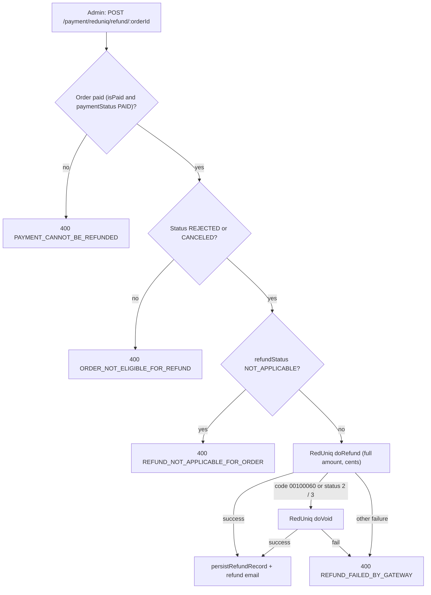

# Cancellations, Refunds and Settlement

This page follows the money and stock side of an order's end states. The status
transitions themselves are in [Order Lifecycle](./order-lifecycle.md); the
payment and order creation that come before are in
[Checkout and Order Creation](./checkout-and-order-creation.md).

Paths are relative to `src/app/`. The main files are
`modules/Order/order.service.ts`, `modules/Order/order.worker.ts` and
`modules/Payment/payment.service.ts`. Statements come from the code unless marked
**Inferred**.

---

## Ways an order ends without delivery

| | Customer cancel | Vendor reject | Vendor cancel | No-show |
| --- | --- | --- | --- | --- |
| Endpoint | `PATCH /orders/:orderId/cancel` (`CUSTOMER`) | `PATCH /orders/:orderId/status`, `type: REJECTED` (`VENDOR` / `SUB_VENDOR`) | Same route, `type: CANCELED` | Vendor `type: NO_SHOW`, or the cron |
| Resulting status | `CANCELED` | `REJECTED` | `CANCELED` | `NO_SHOW` |
| Allowed from | Any non-terminal status (`CANCELED`, `REJECTED`, `DELIVERED`, `PICKED_UP_BY_CUSTOMER`, `NO_SHOW` are refused) | `PENDING` only | `ACCEPTED`, `PREPARING`, `DISPATCHING`, `AWAITING_PARTNER`, `REASSIGNMENT_NEEDED` | Pickup order in `READY_FOR_PICKUP`, after the grace period |
| Blocked when | Order is unpaid or not owned | A rider is assigned | A rider is assigned (`CANNOT_CANCEL_ORDER_RIDER_ALREADY_ASSIGNED`) | Delivery order, wrong status, grace not elapsed |
| Reason | Required (`CANCEL_REASON_REQUIRED`) | Required (`REJECT_REASON_REQUIRED`) | Required (`CANCEL_REASON_REQUIRED`) | Optional; a default text is stored |
| `refundStatus` | `PENDING` **only if canceled from `PENDING`**, else `NOT_APPLICABLE` | `PENDING` | `PENDING` | `NOT_APPLICABLE` |
| Stock restored | Yes (see [below](#stock-restoration)) | Not applicable (no stock was deducted) | Yes | Yes |
| Rider released | Yes, if assigned | Not applicable | Not applicable (no rider) | Not applicable |
| Dispatch pools | `dispatchPartnerPool` cleared | n/a | **Both** `dispatchPartnerPool` and `dispatchRejectedPartnerPool` cleared | n/a |
| Customer told | Not applicable | Push `ORDER_REJECTED_TO_CUSTOMER` and email `REJECTED` | **No notification** | **No notification** |
| Vendor / rider told | Vendor push unless the order is already `PICKED_UP` / `ON_THE_WAY`; assigned rider push | n/a | Not told | n/a |
| Activity log | `ORDER_CANCELED` | `ORDER_REJECTED` | **None** | None |
| Settlement job | No | No | No | Yes (`NO_SHOW`) |

Common to all: the change is written with a `statusHistory` entry, and an
`ORDER_STATUS_UPDATED` socket event is emitted after the commit (see
[Order Tracking and Realtime](./order-tracking-and-realtime.md#order-events)).
Vendor actions require the caller to own the order, be `APPROVED`, and the order
to be paid; repeating the current status returns `ORDER_ALREADY_IN_STATUS`.

Notes on the vendor `CANCELED` action (request bodies, the order of checks and
the error for every status are in
[Order Lifecycle](./order-lifecycle.md#vendor-reject-and-cancel-patch-ordersorderidstatus)):

- It is the way a vendor backs out **after** accepting. Before accepting the
  vendor must reject; a `CANCELED` request on a `PENDING` order fails with
  `CANNOT_CANCEL_PENDING_ORDER_USE_REJECT_INSTEAD`.
- Because it requires no rider on the order, a `PREPARING` **pickup** order can be
  canceled by the vendor, but a `READY_FOR_PICKUP` one cannot.
- After a rider hands an order back (`REASSIGNMENT_NEEDED`) the rider is cleared,
  so the vendor can cancel it again.
- The customer is not notified by push or email. **Inferred:** the customer only
  learns of it through the `ORDER_STATUS_UPDATED` event or by reading the order.

### Stock restoration

Stock is **deducted at acceptance**, only for vendors that are not `RESTAURANT`
(restaurant stock is not tracked), and for simple stock or the chosen variation
option by the ordered quantity.

`restoreOrderItemsStock` adds the quantities back (to `stock.quantity` or the
variation option's `stockQuantity`) in the same transaction as the cancellation.
It is shared by customer cancel and vendor cancel, and it runs only for a
non-`RESTAURANT` vendor **and** when the order was in one of the stages after
acceptance: `ACCEPTED`, `AWAITING_PARTNER`, `DISPATCHING`, `REASSIGNMENT_NEEDED`,
`ASSIGNED`, `PREPARING`, `READY_FOR_PICKUP`.

| Case | Stock |
| --- | --- |
| Customer cancels a `PENDING` order | Nothing to restore (none was deducted) |
| Customer cancels in a stage above | Restored |
| Customer cancels from `PICKED_UP` or `ON_THE_WAY` | **Not** restored |
| Vendor rejects | Nothing to restore |
| Vendor cancels | Restored (it can only happen in a stage above) |
| No-show (vendor or cron) | Restored (a separate copy of the same logic in `updateOrderStatusByVendor` and `autoMarkOrderNoShow`) |
| `DELIVERED`, `PICKED_UP_BY_CUSTOMER` | Never |

Restoration adds the quantity blindly (no cap), so it is only correct when the
deduction really happened. Offer usage counters are also **not** given back on
cancel, reject or refund.

---

## Refunds

Nothing refunds automatically. Cancel and reject only set `Order.refundStatus`
(`REFUND_STATUS`: `NOT_APPLICABLE`, `PENDING`, `REFUNDED`, `FAILED`); the money
moves only when an admin calls:

`POST /api/v1/payment/reduniq/refund/:orderId` (`auth('ADMIN', 'SUPER_ADMIN')`,
no permission action, so any `ADMIN` can call it) → `refundRedUniqPayment`.

- **Full amount only.** The refund is `payoutSummary.grandTotal` (delivery and
  service charge included); there is no partial refund.
- **Void fallback.** If the gateway refuses the refund because the payment is not
  yet settled (result code `00100060`, or transaction status `2` or `3`), the
  service voids the transaction instead. The response then contains
  `refundedBy: 'void'`.
- **Recording (`persistRefundRecord`)** is one transaction: the order gets
  `paymentStatus: REFUNDED`, `isPaid: false`, `refundStatus: REFUNDED`, and a
  `Transaction` of type `REFUND` (`TXN-RF-<nanoid>`, with the gateway reference in
  the remarks) is created. A refund email (`refund-success`, not logged) is sent
  afterwards.
- **No double refund.** After a refund `isPaid` is false, so a second call fails
  the first guard.
- **Failures leave the order unchanged.** A gateway failure throws and leaves
  `refundStatus` as it was; `FAILED` exists in the constant but no code sets it.
  The admin simply retries.
- **Orders that get no refund.** A customer cancel from any status other than
  `PENDING` sets `NOT_APPLICABLE`, and the refund endpoint then refuses it. This
  follows the route comment "refunded only if canceled before vendor accepts". The
  code does not say whether a partial or manual resolution exists outside the API.

---

## Settlement

Settlement happens when an order completes, not when it is paid. It runs on the
BullMQ `order-queue` (3 attempts, exponential backoff starting at 5 s, worker
concurrency 5) in `processOrderPostUpdate` (`order.worker.ts`).

| Trigger (job `PROCESS_ORDER_POST_UPDATE`) | Enqueued by |
| --- | --- |
| `DELIVERED` | Rider status update |
| `PICKED_UP_BY_CUSTOMER` | Vendor pickup-code verification |
| `NO_SHOW` | Vendor `NO_SHOW` action or the no-show cron |

(The same job is also enqueued for other rider transitions, where it does no
money work; see [Order Lifecycle](./order-lifecycle.md#automaticsystem-transitions).)

### What one settlement does

In **one MongoDB transaction** the worker:

1. Awards customer points (`addOrderPoints`), rider points if the order has a
   rider (`addDeliveryPartnerPoints`), and referral bonuses
   (`distributeReferralBonus`). All three are skipped for `NO_SHOW`.
2. Credits wallets from the order's `payoutSummary` snapshot (values fixed at
   checkout, not recomputed):

   | Wallet | Credit |
   | --- | --- |
   | Vendor (`userId` = the vendor row that owns the order) | `vendor.vendorNetPayout` to `currentBalance` and `lifetimeEarnings` |
   | Rider, when **not** managed by a fleet manager | `rider.riderNetEarnings` |
   | Fleet manager, when the rider is managed | `fleet.fee + rider.riderNetEarnings` to `currentBalance`; `lifetimeEarnings` gets only the fee |
   | Platform (`SUPER_ADMIN` admin wallet) | `currentBalance` += vendor net + rider net + fleet fee + platform gross holding; `lifetimeEarnings` += commission + service charge; `currentTaxLiability` and `lifetimeTaxProcessed` += platform payable tax |

   The platform wallet's `currentBalance` therefore reflects the **total** cash
   inflow of the order, which includes the amounts credited to the vendor, rider
   and fleet-manager wallets; the code labels this the admin ledger reserve.

3. Inserts the ledger rows:

   | `Transaction.type` | Id | Party |
   | --- | --- | --- |
   | `VENDOR_EARNING` | `TXN-V-<orderId>` | Vendor |
   | `PLATFORM_COMMISSION` | `TXN-COMM-<orderId>` | Platform admin |
   | `PLATFORM_SERVICE_CHARGE` | `TXN-SC-<orderId>` | Platform admin |
   | `PLATFORM_TAX_COLLECTION` | `TXN-TAX-<orderId>` | Platform admin |
   | `DELIVERY_PARTNER_EARNING` | `TXN-DP-<orderId>` | Rider (only when the order has a rider) |
   | `FLEET_EARNING` | `TXN-F-<orderId>` | Fleet manager (only when the rider is managed) |

4. On `DELIVERED` only, updates the rider's statistics and frees the rider
   (`IDLE`, `currentOrderId: null`); see
   [Delivery Dispatch](./delivery-dispatch.md#after-assignment).

`ORDER_PAYMENT` (written at order creation) and `REFUND` are the customer-side
ledger rows; the wallet-side split above is the completion-time part. Wallet and
`Transaction` field meanings are in [Data Model](../02-platform/data-model.md).

### Behavior worth knowing

- **Pickup orders** have no rider, so only the vendor wallet, platform wallet and
  the four vendor/platform rows apply.
- **`NO_SHOW` is settled like a completed order** (vendor net payout and platform
  amounts are credited) but without points or referrals, and the order keeps
  `refundStatus: NOT_APPLICABLE`.
- **Idempotency.** The ledger ids derive from the order id and `Transaction.transactionId`
  is unique. **Inferred:** a repeated job for the same order fails at the insert
  and aborts the transaction, so wallets are not credited twice; the worker
  rethrows, so BullMQ retries and eventually marks the job failed.
- **A settlement failure does not undo the order status.** The status is already
  `DELIVERED` (or similar) when the job runs; a failed job leaves the order
  completed and its wallets uncredited until the job succeeds.
- **The `DELIVERED` job requires the rider**: if the rider profile is not found
  the job throws `Delivery Partner not found`.
- **Vendor wallets are per row.** A branch's earnings go to the branch's own
  wallet, not the parent's (see
  [Vendors and Branches](../04-vendors/vendors-and-branches.md)).
- **Payouts** (moving wallet balance out to bank accounts) are a separate flow,
  not covered here.

---

## Known implementation notes

- **Vendor cancellation is inconsistent with the other end paths:** it sets
  `refundStatus: PENDING` and needs an admin refund, but sends no notification and
  writes no activity log, unlike vendor rejection.
- **`BLOCKED_FOR_ORDER_CANCEL`** is now used only in vendor rejection, where it is
  redundant.
- **`cancelTimeLimitMinutes` is never read**, so there is no time limit on
  customer cancellation.
- **`REFUND_STATUS.FAILED` is never written.**
- **Stock restoration ignores `RESTAURANT` stock** by design, and the customer
  cancel path does not restore after pickup (`PICKED_UP`, `ON_THE_WAY`).
- **Offer usage is never decremented**, so a canceled, rejected or refunded order
  still consumes an offer's `usageCount` and the customer's per-user usage.

---

## Related documentation

- [Order Lifecycle](./order-lifecycle.md): statuses, transitions and the roles that trigger them.
- [Checkout and Order Creation](./checkout-and-order-creation.md): how the paid order and its `payoutSummary` snapshot are created.
- [Delivery Dispatch and Riders](./delivery-dispatch.md): rider release and statistics.
- [Order Automation](./order-automation.md): the no-show cron.
- [Vendors and Branches](../04-vendors/vendors-and-branches.md): vendor ownership, stock rules for restaurants, and the vendor–product relationship.
- [Data Model](../02-platform/data-model.md): `Transaction`, `Wallet`, `Payout` and the platform commission.
- [Notification Flow](../02-platform/notification-flow.md): the notifications sent for rejection and cancellation.
- [Authorization](../03-identity-access/authorization.md): admin permissions.
