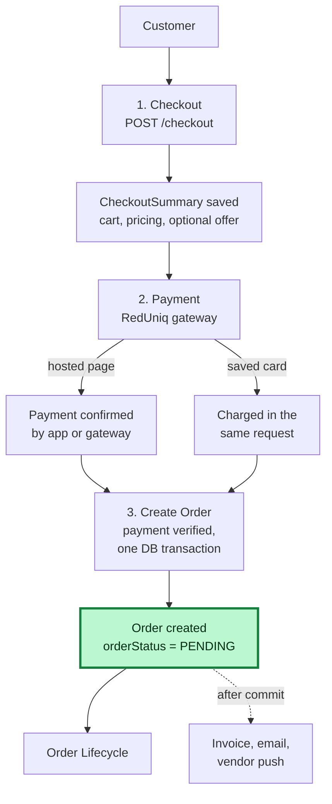
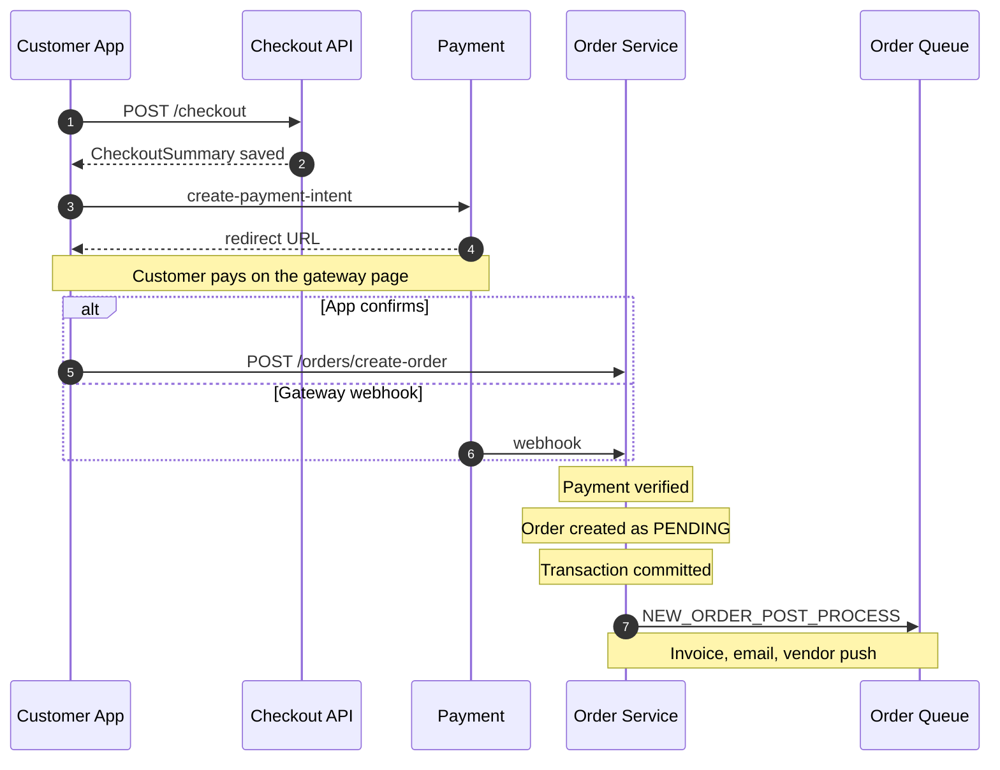

# Checkout and Order Creation

This page follows an order from the customer's checkout request to the moment a
`PENDING` `Order` exists. What happens to the order afterwards is in
[Order Lifecycle](./order-lifecycle.md). Paths are relative to the backend's
`src/app/`; the main modules are `modules/Checkout/`, `modules/Payment/` and
`modules/Order/`.

Statements are taken from the code unless marked **Inferred**.

---

## Overview

1. **Checkout:** the customer sends a cart or one direct item and gets a
   `CheckoutSummary` with the amounts. No order exists yet.
2. **Payment:** the customer pays through RedUniq, on the hosted page or with a
   saved card.
3. **Create Order:** only a verified payment creates the `Order`, once, in one
   database transaction. It starts as `PENDING` and is already paid.
4. **Next:** the vendor accepts or rejects it; see
   [Order Lifecycle](./order-lifecycle.md).

| Step | Endpoint | Role |
| --- | --- | --- |
| Build the summary | `POST /api/v1/checkout` | `CUSTOMER` |
| Read the summary | `GET /api/v1/checkout/summary/:checkoutSummaryId` | `CUSTOMER` (own summary; caller must be `APPROVED`) |
| Apply an offer | `POST /api/v1/offers/validate-apply-offer` | `CUSTOMER` |
| Start hosted-page payment | `POST /api/v1/payment/reduniq/create-payment-intent` | `CUSTOMER` |
| Pay with a saved card | `POST /api/v1/payment/reduniq/pay-with-saved-token` | `CUSTOMER` |
| Gateway callback | `POST /api/v1/payment/reduniq/notification` | none (called by RedUniq) |
| Client confirmation | `POST /api/v1/orders/create-order` | `CUSTOMER` |
| Reset a failed payment | `POST /api/v1/payment/reduniq/handle-payment-failure/:checkoutSummaryId` | `CUSTOMER` |

### Full call sequence

The API calls in the order they happen. Offers, the saved-card path and the
internals of each step are explained below the diagram and in the sections
after it.

- **Offer (optional):** between steps 2 and 3 the customer can call
  `POST /offers/validate-apply-offer`, which rebuilds the summary with the
  discount.
- **Payment start:** `create-payment-intent` opens the gateway's hosted page.
  With a saved card the app calls `pay-with-saved-token` instead. It charges
  synchronously and creates the order in the same request, so there is no
  redirect and no separate confirmation.
- **Confirmation:** on the hosted page path either the app calls
  `create-order` or the gateway calls `POST /payment/reduniq/notification`.
  Whichever arrives first creates the order; the second is stopped by the
  unique `transactionId` (see [Idempotency](#idempotency)).
- **Verification:** on the hosted-page paths the gateway result (`getResult`)
  must be a success before anything is created; the saved-card path uses the
  synchronous charge result instead. See [Order creation](#order-creation).
- **After the commit:** `NEW_ORDER_POST_PROCESS` is queued; the worker's tasks
  are listed in [The transaction](#the-transaction).

---

## The checkout request

`POST /checkout` (`checkout.validation.ts`, strict schema):

| Field | Rule |
| --- | --- |
| `fulfillmentType` | `DELIVERY` (default) or `PICKUP` |
| `pickupTime` | Required when `PICKUP` |
| `vendorInstructions` | Optional note for the vendor |
| `useCart` | `true` to check out the active cart items; default `false` |
| `items[]` | Required when `useCart` is `false`: `productId`, `quantity` ≥ 1, optional `variationSku`. Direct checkout accepts **exactly one** item (`DIRECT_CHECKOUT_SINGLE_ITEM_ONLY`) and has no add-ons |

### Guards, in the order they run (`checkout.service.ts`)

1. **Cart source.** With `useCart`, the cart is read from Redis
   (`cart:data:<customerId>`), falling back to MongoDB. An empty cart gives
   `CHECKOUT_CART_EMPTY`; only items with `isActive === true` are used
   (`NO_ACTIVE_CART_ITEMS`).
2. **Products.** They must exist with `isDeleted: false` and `isApproved: true`
   (`PRODUCTS_NOT_FOUND`), and every one must have `meta.status = 'ACTIVE'`
   (`PRODUCT_UNAVAILABLE`).
3. **Vendor.** Taken from the **first** product. Single-vendor carts are
   guaranteed by cart activation, not re-validated here. The vendor must exist
   and have `isStoreOpen` true (`VENDOR_CLOSED`), and its agreement must be
   signed (`VENDOR_NOT_ACCEPTING_ORDERS`), through
   `AgreementService.isVendorAgreementSigned`, so a branch is judged by its
   parent's agreement. See
   [Vendors and Branches](../04-vendors/vendors-and-branches.md#agreement-and-access-rules).
4. **Delivery only.** The customer needs an active delivery address with
   latitude, longitude, city and street (`DELIVERY_ADDRESS_INCOMPLETE`); the
   vendor needs `businessLocation` coordinates (`VENDOR_LOCATION_NOT_FOUND`);
   the road distance comes from Google Maps and must be greater than zero
   (`DISTANCE_CALCULATION_FAILED`, 503).
5. **Pickup only.** See below.

Not checked here: vendor `status`, and stock. Stock is deducted later, at
vendor acceptance (see [Order Lifecycle](./order-lifecycle.md#important-business-rules)),
which is why an accept can still fail with `INSUFFICIENT_STOCK` after payment.

### Pickup slot rules

For `PICKUP` the checkout computes everything in the **vendor's** timezone
(`businessDetails.timezone`):

| Rule | Error key |
| --- | --- |
| `pickupTime` must parse as a date | `INVALID_PICKUP_TIME` |
| `RESTAURANT` (any non-`STORE` vendor): the slot must be **today** | `PICKUP_TIME_MUST_BE_TODAY` |
| `STORE` vendor: at most 2 days ahead | `PICKUP_DATE_EXCEEDS_MAX_ADVANCE_WINDOW` |
| Must be in the future | `PICKUP_TIME_MUST_BE_IN_FUTURE` |
| Must be on a half-hour (`:00` or `:30`) | `PICKUP_TIME_NOT_HALF_HOUR_SLOT` |
| Not on one of the vendor's `closingDays` | `VENDOR_CLOSED_ON_PICKUP_DAY` |
| Inside `openingHours`–`closingHours` (overnight-aware, inclusive), when both are set | `PICKUP_TIME_OUTSIDE_STORE_HOURS` |

The slot check uses the schedule fields, not the `isStoreOpen` flag. A pickup
slot is one half hour long (`pickupSlotEndTime` is added when the order is
formatted for a response).

---

## How the amounts are calculated

Everything is recomputed on the server from the database; the client never
sends prices. Money is rounded to 2 decimals (`roundTo2`), and **prices are
tax-inclusive**: a tax amount is extracted from a gross amount as
`gross × rate / (100 + rate)`.

### Per line item

| Value | Source |
| --- | --- |
| Base price | Product `pricing.price`, or the selected variation option's `price` (`VARIATION_SKU_REQUIRED` for direct checkout of a product with variations) |
| Store discount | `getStoreDiscountedUnitPrice` from the product's `pricing.discount` / `discountType` |
| Product line total | discounted unit price × quantity |
| Product tax | from the product's `taxRate` (tax-inclusive) |
| Add-ons | Taken from the **cart item snapshot** (`unitPrice`, `quantity`, `taxRate`), not re-read from the add-on group |
| Item grand total | product line total + add-on line totals |
| Commission | `platformPercent` of the item's price **without tax**; VAT on the commission at `platformVatRate`, both from `CommissionRateService.getEffectiveCommissionRate()` |
| Vendor net | item grand total − (commission + commission VAT) |

### Order level

| Value | Formula |
| --- | --- |
| Delivery charge (before VAT) | `baseCharge + min(km, threshold) × chargePerKm + max(km − threshold, 0) × chargePerKmBeyondThreshold`; `0` for pickup (`calculateTieredDistanceCharge`) |
| Delivery VAT | charge × `delivery.vatRate`; **a stored rate of `0` is replaced by `23`** |
| Service charge | `commission.serviceCharge` plus VAT at `serviceChargeVatRate` (default 23) |
| Fleet fee | delivery charge (before VAT) × `fleetManagerPercent` |
| Rider net | delivery charge (before VAT) − fleet fee |
| **Grand total** | items subtotal + delivery charge incl. VAT + service charge + service charge VAT |
| Vendor net payout | items subtotal − (total commission + total commission VAT) |
| Platform gross holding | (commission + service charge) + (commission VAT + service-charge VAT + delivery VAT) |

The global-settings values come from `GlobalSettingsService.getGlobalSettings`
(the `delivery`, `commission`, `order` groups); see
[Data Model](../02-platform/data-model.md).

**Reconciliation guard.** Before anything is saved, the four-way split must add
back up to the grand total:
`grandTotal − (vendorNetPayout + riderNetEarnings + fleetFee + platformGrossHolding)`
must be within ±0.01, otherwise checkout fails with
`PAYOUT_SPLIT_RECONCILIATION_MISMATCH` (500). The offer flow applies the same
check when it rebuilds a summary.

### The saved `CheckoutSummary`

The summary stores the line items, `orderCalculation`, `delivery`,
`payoutSummary`, an empty `offer` (`isApplied: false`), the customer's contact
data, the delivery address (delivery only), `paymentStatus: 'PENDING'`, and
`isConvertedToOrder: false`.

Before creating a new summary, checkout runs `deleteMany` for the same customer
and vendor where `isConvertedToOrder` is false, then `create`. This is **not**
transactional, and it discards the customer's earlier unconverted summaries for
that vendor.

`paymentStatus` values (`PAYMENT_STATUS`): `PENDING`, `PROCESSING`, `PAID`,
`FAILED`, `REFUNDED`.

### Offers

`POST /offers/validate-apply-offer` (`CUSTOMER`) validates an offer against the
summary, then rebuilds it (`rebuildCheckoutSummary`), setting
`orderCalculation.totalOfferDiscount` and `offer.offerApplied`. It refuses a
summary that is already converted (`CANNOT_APPLY_OFFER_TO_COMPLETED_CHECKOUT`)
or that belongs to another customer. Offer types and eligibility rules belong
to the Offer module and are not documented here; the order only reserves usage
(see [Order creation](#order-creation)).

---

## Payment

Both payment routes verify the summary belongs to the caller, is not already
converted (`CHECKOUT_SUMMARY_ALREADY_CONVERTED`), and is not already
`PROCESSING` (`PAYMENT_ALREADY_IN_PROCESS`) or `PAID`
(`PAYMENT_ALREADY_COMPLETED`).

| Flow | What happens |
| --- | --- |
| **Hosted page** (`create-payment-intent`) | Body: `checkoutSummaryId` (24-hex), `paymentMethod` ∈ `CARD, MB_WAY, APPLE_PAY, PAYPAL, GOOGLE_PAY, OTHER`, optional `saveCard`. Calls RedUniq `initPayment` (amount in cents, EUR, immediate sale, `order.ref` = summary id, plus a notification URL). On success stores `paymentMethod`, sets `paymentStatus = 'PROCESSING'` and saves the gateway `gatewayPaymentToken`; returns `redirectUrl` and `paymentToken`. `saveCard` is honoured only for `CARD` and is silently ignored otherwise |
| **Saved card** (`pay-with-saved-token`) | Requires a saved card for the customer (`SAVED_CARD_NOT_FOUND`); charges it synchronously and, on success, **creates the order in the same request** through `finalizeCheckoutIntoOrder`. No redirect |
| **Failure reset** (`handle-payment-failure`) | Sets an unconverted summary's `paymentStatus` to `FAILED` (own summary only) |

---

## Order creation

`finalizeCheckoutIntoOrder` (`order.service.ts`) is the only place an order is
created. It is reached from three callers, which differ only in how the payment
was verified:

| Caller | Verification |
| --- | --- |
| `POST /orders/create-order` (`createOrderAfterRedUniqPayment`) | Summary belongs to the caller and is unconverted; the submitted `paymentToken` must equal the stored `gatewayPaymentToken` (`PAYMENT_TOKEN_MISMATCH`); RedUniq `getResult` must return transaction status `'4'` (`PAYMENT_FAILED_TRY_AGAIN` otherwise) |
| `POST /payment/reduniq/notification` (`handleReduniqNotification`) | No auth. The token in the body must equal the token issued for that summary; `getResult` status `'4'` is required, otherwise the summary is set to `FAILED`. Any failure is logged and the endpoint still answers `200` |
| `pay-with-saved-token` | The synchronous gateway result (`isRedUniqSuccess`) |

`create-order` accepts `checkoutSummaryId`, `paymentToken` and an optional
`deliveryNotes` (stored as `delivery.notes`, the note for the rider; the
customer's note for the vendor is `vendorInstructions`, carried over from
checkout).

### The transaction

Everything below happens in **one MongoDB transaction**:

1. Compute `autoAcceptDeadlineAt = now + autoAcceptTimeoutMinutes`
   (see [Order Automation](./order-automation.md#configuration)).
2. Build the order from the summary as a **snapshot**: items, `orderCalculation`,
   `delivery`, `payoutSummary`, `offer`, address. For a pickup order the
   delivery charge fields, fleet fee and rider earnings are zeroed, no
   `deliveryAddress` is stored, and a six-digit `pickup.code`,
   `pickup.generatedAt` and `pickup.pickupTime` are added.
3. **Reserve the offer**, if one was applied: increment `Offer.usageCount` and
   `perUserUsage.<customerId>` with a conditional update that enforces
   `maxUsageCount` and `userUsageLimit` (`OFFER_USAGE_LIMIT_EXCEEDED`, which
   aborts the whole transaction).
4. Create the `Order` with `orderId = ORD-<nanoid(10)>`, `orderStatus: 'PENDING'`,
   `isPaid: true`, `paymentStatus: 'PAID'`, the gateway `transactionId`, and a
   first `statusHistory` entry ("Order placed and payment verified
   successfully", `updatedBy` = the customer).
5. Create a `Transaction` of type `ORDER_PAYMENT` for the grand total.
6. Mark the summary `isConvertedToOrder = true`, `paymentStatus = 'PAID'`, and
   link `orderId`.

After the commit, `NEW_ORDER_POST_PROCESS` is queued on `order-queue`. The
worker syncs the invoice, emails the customer, pushes to the vendor
(`ORDER_NEW_TO_VENDOR`) and cleans the cart; see
[Notification Flow](../02-platform/notification-flow.md#7-order-notifications).
The card-token save for a `CARD` payment runs **outside** the transaction and
its failure is only logged.

### Idempotency

The client confirmation and the webhook can both arrive for the same payment.
The protection is:

- `Order.transactionId` and `Transaction.transactionId` are unique, so the
  second creation fails on a duplicate key (the webhook swallows error code
  `11000`).
- Both entry points also pre-check `isConvertedToOrder`, but that check is a
  read before the transaction, so the unique index, not the pre-check, is what
  actually stops a duplicate.

### What is not re-checked at creation

`finalizeCheckoutIntoOrder` does not re-read stock, `isStoreOpen`, the vendor's
status or its agreement. Those were checked at cart and checkout time, and stock
is checked only at acceptance. **Inferred:** a store that closes, or an agreement
that lapses, between checkout and payment confirmation does not stop the order
from being created.

---

## Known implementation notes

- **Delivery VAT of `0` is not honoured.** Checkout treats a configured
  `delivery.vatRate` of `0` as `23`. The schema default for `vatRate` is `0`, so
  an unset value also becomes `23` in the calculation.
- **Two payment-confirmation paths, one gate.** Only the unique gateway
  `transactionId` prevents duplicates; there is no lock on the summary.
- **Webhook always answers `200`**, including on rejected tokens and failures,
  and creates the order with language `en` and only the customer's `_id` as the
  acting user.
- **The `deleteMany` + `create` summary replacement is not atomic.**
- **`useCart` checkout takes the vendor from the first product only.**
- **`ORDER_PAYMENT` is the only `Transaction` written at creation.** Earnings and
  commission rows are written at completion; see
  [Cancellations, Refunds and Settlement](./cancellations-refunds-settlement.md).

---

## Related documentation

- [Order Lifecycle](./order-lifecycle.md): statuses and transitions after creation.
- [Order Automation](./order-automation.md): the auto-accept deadline and the other timers set at creation.
- [Cancellations, Refunds and Settlement](./cancellations-refunds-settlement.md): refunds for paid orders and the completion-time ledger.
- [Vendors and Branches](../04-vendors/vendors-and-branches.md): vendor eligibility, store schedule, and the vendor–product relationship.
- [Notification Flow](../02-platform/notification-flow.md): the notifications created after an order is placed.
- [Data Model](../02-platform/data-model.md): the `Order`, `Transaction` and settings collections.
- [Authorization](../03-identity-access/authorization.md): roles and the agreement gate.
