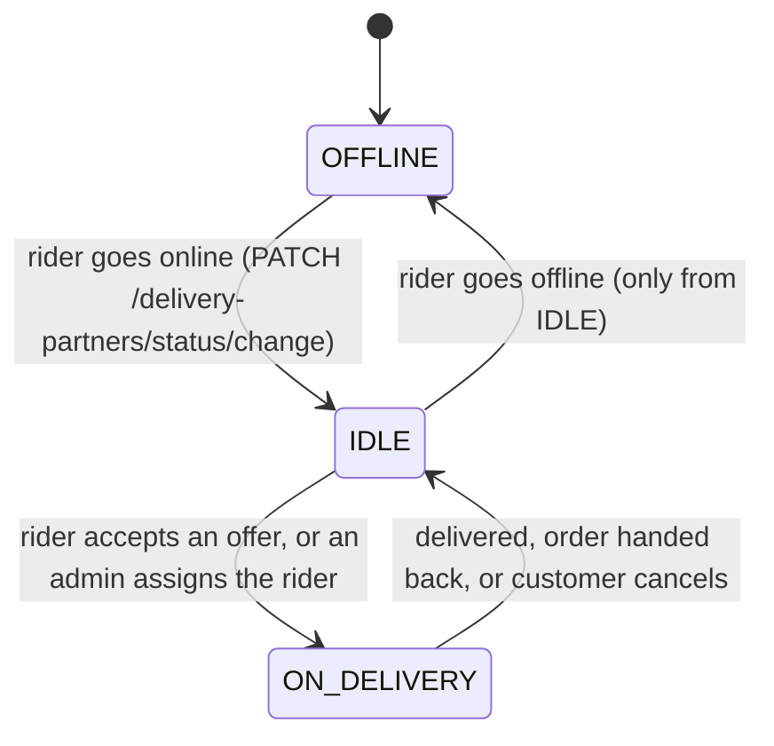
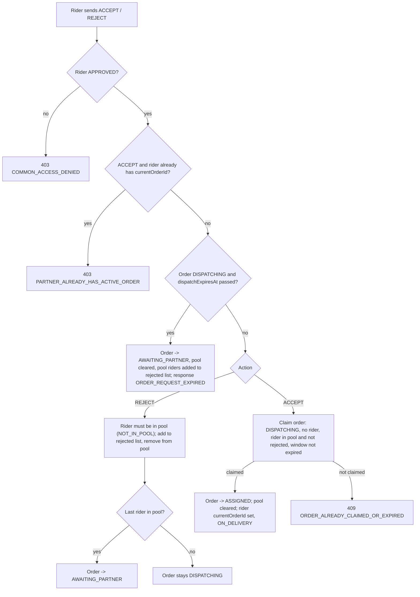

# Delivery Dispatch and Riders

This page covers the delivery-partner side of an order: rider availability,
how offers are built and answered, and how orders without a rider are retried,
escalated and assigned by an admin. Status names, transition rules and the
delivery/pickup flows are in [Order Lifecycle](./order-lifecycle.md); this page
adds the mechanics behind the dispatch statuses (`DISPATCHING`,
`AWAITING_PARTNER`, `ASSIGNED`, `REASSIGNMENT_NEEDED`) and does not repeat the
full transition table.

Paths are relative to `src/app/`. The main files are
`modules/Order/order.service.ts`, `modules/Delivery-Partner/` and
`cron/order.cron.ts`. Statements come from the code unless marked **Inferred**.
Only `DELIVERY` orders are ever dispatched; a `PICKUP` order never enters these
states.

---

## Rider state

A rider is a `DeliveryPartner` document (see
[Data Model](../02-platform/data-model.md)). The fields dispatch relies on:

| Field | Meaning |
| --- | --- |
| `status` | Account status; only `APPROVED` riders can be offered or assigned an order |
| `operationalData.currentStatus` | `OFFLINE` (default), `IDLE`, or `ON_DELIVERY` |
| `operationalData.currentOrderId` | The order the rider currently holds, or `null` |
| `operationalData.capacity` | Default `1` (see [notes](#known-implementation-notes)) |
| `operationalData.isWorking` | `true` while `IDLE` |
| `currentSessionLocation` | GeoJSON point with a 2dsphere index; the position dispatch searches |
| counters | `totalOfferedOrders`, `totalAcceptedOrders`, `totalRejectedOrders`, `completedDeliveries`, `canceledDeliveries`, `totalDeliveryMinutes` |

| Rider action | Endpoint | Rules |
| --- | --- | --- |
| Go online / offline | `PATCH /api/v1/delivery-partners/status/change` (`DELIVERY_PARTNER`) | Body `status` is `IDLE` or `OFFLINE`. `OFFLINE` is accepted only from `IDLE` and `IDLE` only from `OFFLINE`, so a rider on a delivery cannot go offline. The route does not check the profile's `APPROVED` status |
| Update location (HTTP) | `PATCH /api/v1/delivery-partners/:deliveryPartnerId/liveLocation` (`DELIVERY_PARTNER`) | The id is the rider's own `userId` (another id is refused); `geoAccuracy` above 100 is rejected (`GEO_ACCURACY_EXCEEDED`); writes `currentSessionLocation` and `operationalData.lastActivityAt` |
| Update location (socket) | `delivery-location-update` | See [Order Tracking and Realtime](./order-tracking-and-realtime.md) |

---

## Making an offer

All three triggers end in `dispatchOrderToPartners`:

| Trigger | Entry | Search origin |
| --- | --- | --- |
| Auto-dispatch cron | `autoDispatchOrder`, `PREPARING → DISPATCHING` when `estimatedReadyAt` is within `autoDispatchLeadMinutes` | The vendor's `businessLocation` |
| Retry cron | `autoRetryDispatchOrder` / `autoRetryReassignmentOrder` | The vendor's `businessLocation` |
| Vendor manual broadcast | `PATCH /orders/:orderId/broadcast-order` (`VENDOR` / `SUB_VENDOR`) | The vendor's **`currentSessionLocation`** (`VENDOR_LOCATION_NOT_SET` if missing) |

If the vendor's `businessLocation` has no numeric coordinates, the automatic
paths do not search at all: the order moves to `AWAITING_PARTNER` with a
`dispatchExpiresAt` about 120 seconds ahead.

### Candidate search

`dispatchOrderToPartners` runs a `$geoNear` on `DeliveryPartner.currentSessionLocation`:

- Radius tiers `DELIVERY_SEARCH_TIERS_METERS` = 3 km, 4 km, 5 km, tried in order;
  the **first tier that returns anyone** wins, and it stops there.
- Per tier: `isDeleted: false`, `status: 'APPROVED'`,
  `operationalData.currentStatus: 'IDLE'`, not in the order's
  `dispatchRejectedPartnerPool`, and a capacity expression (see notes). At most
  10 riders per search.
- Riders who rejected, timed out, or handed the order back stay in
  `dispatchRejectedPartnerPool` and are never offered this order again.

### Offer window

- The offered riders' ids are merged into `dispatchPartnerPool` (as strings) and
  `dispatchExpiresAt` is set to now + `DISPATCH_WINDOW_SECONDS` (**120 s**).
- A `DISPATCHING` history entry ("Broadcasted to N nearby delivery partners") is
  pushed; `totalOfferedOrders` is incremented for each rider. This is the second
  `DISPATCHING` entry of a dispatch: the claim step that moved the order into
  `DISPATCHING` already recorded why (for example "Manual broadcast:
  re-broadcasting to nearby delivery partners." or "Auto-dispatch triggered:
  preparation window reached."). The two entries come from two separate steps (the
  claim, then the search and offer) and are expected, not a lifecycle error; the
  status, pool and `dispatchExpiresAt` are each written once.
- Each rider gets a push (`ORDER_NEW_DISPATCH_TO_PARTNER`, channel
  `order_notification`) carrying the order id, vendor name, addresses and
  delivery details. There is **no socket offer event**; see
  [Notification Flow](../02-platform/notification-flow.md#7-order-notifications).
- If no rider is found, the order becomes `AWAITING_PARTNER` (window again
  120 s) and the manual broadcast returns `NO_PARTNER_FOUND`.
- Every step is a conditional update on `orderStatus: 'DISPATCHING'`. If the
  order changed in the meantime the call fails with
  `ORDER_STATUS_CHANGED_DURING_DISPATCH` (409).

### Failure recovery

All dispatch paths first claim the order into `DISPATCHING` and then call
`dispatchOrderToPartners`. If the geo search or the dispatch write fails
unexpectedly after the claim, the order would otherwise stay `DISPATCHING` with an
empty pool and no `dispatchExpiresAt`, which nothing expires or retries. The
function therefore recovers it: while the pool is still empty, the order moves back
to `AWAITING_PARTNER` with a fresh `dispatchExpiresAt` (now + 120 s), a history
entry "Dispatch failed unexpectedly, waiting for partner" and a status event, and
the original error is rethrown to the caller. The retry and escalation steps below
then continue as for a normal "no rider found" outcome.

This is a recovery path and does not count as a successful dispatch: no rider was
offered the order and no rider push was sent. It does not apply when the failure
comes after the dispatch write (pool and expiry already set); that order stays
`DISPATCHING` and the expiry cron moves it on. A status change or a no-rider
fallback that already happened is never overwritten.

The manual broadcast additionally requires an `APPROVED` caller that owns the
order, a `DELIVERY` order, an **empty** `dispatchPartnerPool`
(`ORDER_ALREADY_DISPATCHED_TO_PARTNERS`), and a status of `ACCEPTED`,
`PREPARING`, `AWAITING_PARTNER` or `REASSIGNMENT_NEEDED`.

---

## Rider response

`PATCH /api/v1/orders/:orderId/accept-dispatch-order` (`DELIVERY_PARTNER`), body
`{ "action": "ACCEPT" | "REJECT" }` (`partnerAcceptsDispatchedOrder`).

Details:

- **One winner.** Accept is a conditional `findOneAndUpdate` plus a conditional
  rider claim (`currentOrderId: null`) inside one transaction. If the rider
  claim finds the rider busy the transaction rolls back
  (`PARTNER_ALREADY_HAS_ACTIVE_ORDER`), so the order is not left assigned.
- **Vendor already confirmed the food ready.** If the order has `foodReadyAt`
  (the vendor marked it ready before a rider was assigned), the same transaction
  also moves the order from `ASSIGNED` to `READY_FOR_PICKUP` and adds a second
  history entry, so the rider can set `PICKED_UP` immediately without waiting for
  a cron tick. The response, the vendor push and `ORDER_STATUS_UPDATED` then carry
  `READY_FOR_PICKUP`. Without `foodReadyAt` the order stays `ASSIGNED` until the
  vendor marks it ready or the auto-ready fallback runs (see
  [Order Automation](./order-automation.md#auto-ready-autoreadyorder)).
- **Late requests trigger expiry.** The expiry check runs before the action is
  read, so a late accept or a late reject by any approved rider moves the order
  to `AWAITING_PARTNER`. The `handleOrderExpiryCron` does the same every minute.
- **Assignment resets the escalation latch:** `dispatchEscalatedAt` is set back
  to `null`.
- **After acceptance:** the vendor gets a push (`ORDER_ACCEPTED_BY_PARTNER_TO_VENDOR`),
  socket `ORDER_ACCEPTED_BY_PARTNER`, and `ORDER_STATUS_UPDATED`; a
  `REMOVE_ORDER_POPUP` event is emitted to the accepting rider's room and to the
  `partner_pool_<id>` rooms of the offered riders (which nobody joins, see the
  notes below and [realtime events](./order-tracking-and-realtime.md#order-events)).
- **Rider lists.**
  `GET /orders/delivery-partner-dispatch-order` (and the alias
  `/orders/delivery-partner/dispatch-order`) returns orders that are
  `DISPATCHING`, unexpired and contain the caller in `dispatchPartnerPool`
  (404 `NO_DISPATCH_ORDERS_FOUND_FOR_PARTNER` when none).
  `GET /orders/delivery-partner/current-order` returns the order in
  `operationalData.currentOrderId` if it is not `DELIVERED`, `CANCELED` or
  `REJECTED` (404 `NO_ORDER_FOUND_FOR_PARTNER`). Both need an `APPROVED` rider.

---

## Retry, escalation and admin assignment

The cron steps and their exact conditions are in
[Order Lifecycle](./order-lifecycle.md#status-transition-rules) (rows 5, 5b, 7b,
9) and [Order Automation](./order-automation.md). In short:

- An order in `AWAITING_PARTNER` is retried once its `dispatchExpiresAt` has
  passed, and a `REASSIGNMENT_NEEDED` order is retried at the next tick, but only
  while `estimatedReadyAt` is in the future.
- Once `estimatedReadyAt` has passed, automatic dispatch stops. The order is
  escalated: it stays or becomes `AWAITING_PARTNER`, `dispatchPartnerPool` is
  cleared, `dispatchEscalatedAt` is set, and every `ADMIN` / `SUPER_ADMIN` with a
  push token gets `ORDER_DISPATCH_ESCALATED_TO_ADMIN`. The claim is atomic, so the
  notice is sent once per escalation.
- The vendor can still broadcast manually after an escalation.

### Admin tools

Both routes use `auth('ADMIN', 'SUPER_ADMIN', ['CAN_MANAGE_ORDERS'])`. The
permission is enforced only for `ADMIN`; `SUPER_ADMIN` bypasses it (see
[Authorization](../03-identity-access/authorization.md)).

| Route | Behavior |
| --- | --- |
| `GET /orders/:orderId/nearby-partners` | Read-only. `DELIVERY` orders only; needs a usable `pickupAddress` (`ORDER_PICKUP_LOCATION_NOT_SET`). One `$geoNear` within 5 km of the pickup address: approved, not deleted, `IDLE`, `currentOrderId: null`, not in the rejected pool. Returns up to **20** riders nearest-first with name, contact, rating and `distanceKm`, plus `totalAvailablePartners`. **Nothing is reserved.** |
| `PATCH /orders/:orderId/assign-partner` | Body `deliveryPartnerId` (24-hex), optional `note` (≤ 500). Only a `DELIVERY` order in `AWAITING_PARTNER` with no rider (`ORDER_NOT_AWAITING_PARTNER_FOR_ASSIGNMENT`). In one transaction, claims the rider (approved, `IDLE`, no current order) and then the order; errors `PARTNER_NOT_APPROVED_FOR_ASSIGNMENT`, `PARTNER_NOT_AVAILABLE_FOR_ASSIGNMENT`. Sets `ASSIGNED` (or `READY_FOR_PICKUP` in the same transaction when the order already has `foodReadyAt`), clears the pool and the escalation latch, writes an activity log, pushes to the rider and vendor (carrying the order's actual status), and emits the socket events |

The rider list from `nearby-partners` can be stale by the time the admin assigns;
the assign call re-validates the rider.

---

## After assignment

The rider's own status calls are `PATCH /orders/:orderId/update-order-status`
(`DELIVERY_PARTNER`, must be the order's rider). The transition rules
(`READY_FOR_PICKUP → PICKED_UP → ON_THE_WAY → DELIVERED`, hand-back from
`ASSIGNED` only, OTP checks) are in
[Order Lifecycle](./order-lifecycle.md#status-transition-rules). What each one
does to the rider:

| Event | Effect on the rider |
| --- | --- |
| Accept / admin assign | `currentOrderId` set, `currentStatus = ON_DELIVERY`; accept also increments `totalAcceptedOrders` |
| SOS, replacement or fault cancel (`READY_FOR_PICKUP` and in-transit orders; an SOS is refused at `ASSIGNED` and earlier) | See [Delivery Exceptions and Verification](./delivery-exceptions.md): a replaced or fault-canceled rider is set `OFFLINE` and released from the order |
| Hand back (`REASSIGNMENT_NEEDED`) | Order's `deliveryPartnerId` cleared, rider added to `dispatchRejectedPartnerPool`, `deliveryPartnerCancelReason` saved. The worker then sets the rider `IDLE`, clears `currentOrderId` and increments `canceledDeliveries` and `totalRejectedOrders` |
| `DELIVERED` | The worker sets `IDLE`, clears `currentOrderId`, increments `totalDeliveries`, `completedDeliveries` and `totalDeliveryMinutes` (from the `PICKED_UP` history entry to now, at least 1) |
| Customer cancels an assigned order | `currentOrderId` cleared, `IDLE`, `canceledDeliveries` incremented, in the cancellation transaction |
| Vendor cancels | Not possible once a rider is assigned (`CANNOT_CANCEL_ORDER_RIDER_ALREADY_ASSIGNED`); see [Cancellations, Refunds and Settlement](./cancellations-refunds-settlement.md) |

---

## Known implementation notes

- **Capacity is not effective.** The dispatch query compares
  `size(operationalData.currentOrderIds)` with `capacity`, but `currentOrderIds`
  is not in the model, so the size is always 0. A rider holds one order at a time
  in practice because `currentStatus` becomes `ON_DELIVERY`, which the search
  excludes, and accept refuses a rider with `currentOrderId`.
- **Two location fields.** Automatic dispatch searches around the vendor's
  `businessLocation`, manual broadcast around `currentSessionLocation`, and the
  admin list around the order's `pickupAddress` (a snapshot of the vendor's
  `businessLocation` taken at acceptance). See
  [Vendors and Branches](../04-vendors/vendors-and-branches.md#known-implementation-inconsistencies).
- **Expired riders are treated as rejections** (added to
  `dispatchRejectedPartnerPool`), so a rider who simply did not answer is not
  offered the same order again.
- **Cancellation does not remove offers.** Customer cancellation clears
  `dispatchPartnerPool`, but no popup-removal event is emitted for the riders who
  were offered the order. **Inferred:** their apps keep showing the offer until
  they act; accepting then fails with `ORDER_ALREADY_CLAIMED_OR_EXPIRED`.
- **Rider approval is not enforced everywhere.** Accept, the rider lists and
  dispatch require `APPROVED`, but the rider status-update route and the
  online/offline toggle do not.
- **`partner_pool_<id>` socket rooms are never joined** by any server code, so
  `REMOVE_ORDER_POPUP` sent only to those rooms reaches nobody.

---

## Related documentation

- [Order Lifecycle](./order-lifecycle.md): statuses, transitions and the roles allowed to trigger them.
- [Delivery Exceptions and Verification](./delivery-exceptions.md): rider SOS, rider replacement, OTP lock, receipt confirmation, manual completion and fault cancel for in-transit orders.
- [Order Automation](./order-automation.md): the cron jobs that dispatch, retry and escalate.
- [Order Tracking and Realtime](./order-tracking-and-realtime.md): sockets, rider live location and order reads.
- [Cancellations, Refunds and Settlement](./cancellations-refunds-settlement.md): what happens to a rider and the money when an order ends.
- [Notification Flow](../02-platform/notification-flow.md): dispatch and escalation pushes.
- [Vendors and Branches](../04-vendors/vendors-and-branches.md): vendor location fields and store schedule.
- [Authorization](../03-identity-access/authorization.md): admin permissions.
