# Delivery Exceptions and Verification

This page covers what happens when a delivery order is ready for the rider or already
with the rider and the normal hand-over cannot finish. A **rider SOS** can be raised from
`READY_FOR_PICKUP`, `PICKED_UP` and `ON_THE_WAY`; the OTP lock, the verification issue,
receipt confirmation and manual completion exist only once the order is `PICKED_UP` or
`ON_THE_WAY`. None of these flows adds an order status: `orderStatus` stays as it is until an admin
action ends the order as `DELIVERED` or `CANCELED`. The statuses and the normal
transitions are in [Order Lifecycle](./order-lifecycle.md); rider assignment is in
[Delivery Dispatch and Riders](./delivery-dispatch.md).

Paths are relative to `src/app/`. The logic is in
`modules/Order/order.deliveryException.service.ts`; routes are in
`modules/Order/order.route.ts`. Admin routes use
`auth('ADMIN', 'SUPER_ADMIN', ['CAN_MANAGE_ORDERS'])`: the permission is enforced
only for `ADMIN`, and `SUPER_ADMIN` bypasses it (see
[Authorization](../03-identity-access/authorization.md)).

---

## Three separate things

| Concept | What it means | Where it is stored |
| --- | --- | --- |
| **Rider SOS** (`RIDER_SOS`) | The rider cannot continue (breakdown, safety, customer unreachable and similar) | `Order.deliveryException`, plus a `Sos` document |
| **Delivery OTP lock** (`DELIVERY_OTP_LOCKED`) | The rider entered a wrong delivery OTP five times | `Order.deliveryException` and `deliveryOtp.lockedAt` |
| **Delivery verification issue** | The rider reports that OTP verification cannot be completed, and says whether the product was handed over | `Order.deliveryVerification` |

They are deliberately independent. An OTP lock never leads to rider replacement or
fault cancellation, a rider SOS is the only reason to replace the rider, and a
verification issue never creates an exception and never completes the order.

`deliveryException` has `status` `OPEN`, `ACKNOWLEDGED` or `RESOLVED`. Both
`deliveryException` and `deliveryVerification` are admin-only embedded fields
(`select: false`); they are not part of customer, vendor or rider order payloads.

---

## Delivery OTP and the lock

The OTP is generated when the rider sets `PICKED_UP` and goes to the customer
(see [Order Lifecycle](./order-lifecycle.md#important-business-rules)).

- A wrong code returns `401 INVALID_DELIVERY_OTP` and is counted atomically
  (`deliveryOtp.attempts`). The code, the attempt limit and the absence of a lock
  are all part of the single conditional update that moves the order to
  `DELIVERED`.
- The **fifth** wrong code returns `403 DELIVERY_OTP_MAX_ATTEMPTS_EXCEEDED`, sets
  `deliveryOtp.lockedAt` once, opens a `DELIVERY_OTP_LOCKED` exception and alerts
  `ADMIN` / `SUPER_ADMIN` once. Further attempts are refused while the lock stands.
- **Recovery is the OTP reset.** `POST /orders/:orderId/delivery-otp/reset`
  (body `reason`, 10-500 characters) generates a new code, sets attempts to 0,
  clears the lock and closes a `DELIVERY_OTP_LOCKED` exception. **The same rider
  continues**; the new code is sent only to the customer (push, socket and
  email), and the old code can never be valid again. The reset also works when only
  a verification issue was reported. It is refused after the customer has said
  they did not receive the order (see below).

---

## Rider SOS

`POST /orders/:orderId/sos` (`DELIVERY_PARTNER`, the order's own rider). Body:
`userNote` (max 200), `issueTags` (for example `Vehicle Breakdown`,
`Customer Unreachable`, `Unsafe Location`, `Order Issue`), and optionally
`currentLocation`, `occurredAt` and `deviceSnapshot`.

- Repeating the SOS is idempotent (one active alert per rider and order); a later
  report updates the same exception.
- It is allowed only while the order is `READY_FOR_PICKUP`, `PICKED_UP` or
  `ON_THE_WAY`. Any earlier status (including `ASSIGNED`) and `DELIVERED` or
  `CANCELED` are refused with `400 RIDER_SOS_NOT_ALLOWED_AT_ORDER_STATUS`, and
  nothing is created. A rider who cannot do an `ASSIGNED` order uses
  `REASSIGNMENT_NEEDED`, which is unchanged and available only from `ASSIGNED`.
- Every accepted SOS creates the `Sos` alert, opens a `RIDER_SOS` exception, alerts
  admins and leaves `orderStatus` unchanged. The rider can keep delivering; it is a
  flag for admins, not a lock.
- Admins see the exception in `GET /orders/delivery-exceptions` and can
  acknowledge or resolve it.

| Admin action | Route | Rules |
| --- | --- | --- |
| List | `GET /orders/delivery-exceptions` | Open exceptions on `READY_FOR_PICKUP`, `PICKED_UP` and `ON_THE_WAY` orders, and orders with an active verification record |
| Acknowledge | `PATCH /orders/:orderId/delivery-exception/acknowledge` | Marks the open exception `ACKNOWLEDGED` |
| Resolve | `PATCH /orders/:orderId/delivery-exception/resolve` | Body `resolution` (`RIDER_CONTINUES` or `FALSE_ALARM`) and `note`; the rider carries on |
| Replace the rider | `PATCH /orders/:orderId/replace-partner` | Only while a `RIDER_SOS` is open (`READY_FOR_PICKUP`, `PICKED_UP` or `ON_THE_WAY`). Body `deliveryPartnerId` and `note`. The old rider is set `OFFLINE` and added to the rejected pool, the new rider takes the order and any verification report is voided. In transit a **new** delivery OTP is generated for the customer; at `READY_FOR_PICKUP` no code exists yet, so none is created and the new rider is sent to the vendor like an admin assignment |
| Cancel after a fault | `PATCH /orders/:orderId/fault-cancel` | See [Fault cancellation](#fault-cancellation) |

Replacement is the SOS recovery. If the rider cannot continue and no replacement
rider is available, the admin uses fault cancellation.

---

## Delivery verification issue and receipt confirmation

Use this when the rider says the customer has the order but the OTP check cannot
be completed.

```mermaid
flowchart TD
    R["Rider reports a verification issue<br/>productHandedOver: true or false"] --> A{"Admin"}
    A -->|"first recovery"| O["Reset the OTP: the same rider continues"]
    A -->|"only if productHandedOver is true"| Q["Admin requests customer receipt confirmation"]
    Q --> C{"Customer answers"}
    C -->|"YES"| Y["Admin may complete the delivery manually"]
    C -->|"NO"| N["Completion on hold"]
    N -->|"customer corrects to YES"| Y
    N -->|"admin confirms not delivered"| F["Fault cancel, then the existing refund"]
```

1. **Rider report.** `POST /orders/:orderId/delivery-verification-issue`
   (`DELIVERY_PARTNER`, the order's own rider, order `PICKED_UP` or `ON_THE_WAY`).
   `productHandedOver` is **required** and must be an explicit boolean; `note` is
   optional (max 300). It is stored in `deliveryVerification` (`REPORTED`), never
   completes the order, never creates a `DELIVERY_OTP_LOCKED` or `RIDER_SOS`
   exception, and admins are alerted. A repeated report is idempotent; a later
   report may only add the handover statement (`false` to `true`).
2. **OTP reset first.** The admin can reset the OTP and let the same rider
   continue, as above.
3. **Ask the customer.** `PATCH /orders/:orderId/request-receipt-confirmation`
   (no body). Allowed **only if the rider reported `productHandedOver: true`**;
   otherwise it is refused (`RECEIPT_CONFIRMATION_REQUIRES_HANDOVER`, or
   `DELIVERY_VERIFICATION_NOT_REPORTED` when nothing was reported). A failed OTP
   attempt on its own never triggers it. The status becomes
   `CONFIRMATION_REQUESTED` and the customer gets a push and a socket event. A
   second request returns `409`.
4. **Customer answers.** `PATCH /orders/:orderId/confirm-receipt` (`CUSTOMER`),
   body `received: true | false` (required boolean). Only the order's own customer
   can answer (anyone else gets `404`), and only while the order is `PICKED_UP` or
   `ON_THE_WAY`. **The answer never changes `orderStatus`.**
   - **YES** (`CONFIRMED`) makes manual completion possible. A YES is final: it
     cannot be changed back to NO (`409 RECEIPT_CONFIRMATION_ALREADY_ANSWERED`).
   - **NO** (`DECLINED`) puts completion on hold. It blocks manual completion
     for as long as it stands. The customer may still **correct a mistaken NO to
     YES** until an admin resolves the case; the correction is atomic and alerts
     the admins once. OTP reset is not available after a NO.
   - Repeating the same answer is idempotent and sends no second alert.
5. **Admin resolves the case.** After a YES, the admin completes the delivery
   (below). After a NO, the admin either waits for a correction or confirms the
   order as not delivered with fault cancellation. Completing or canceling ends the
   in-transit window, so the customer's answer can no longer be changed
   (`400 ORDER_NOT_IN_TRANSIT_FOR_EXCEPTION`).

Each answer is written to the activity log (`ORDER_RECEIPT_CONFIRMATION_ANSWERED`,
with the previous answer and whether it was a correction).

---

## Manual completion

`PATCH /orders/:orderId/complete-delivery`, body `reason` (10-500 characters).

- **Proof is part of the atomic claim.** The delivery completes only if the
  customer confirmed receipt (YES, including a corrected YES), or the delivery OTP
  was verified while an exception was open. An admin's word alone is never enough:
  without proof it is refused (`MANUAL_COMPLETION_REQUIRES_PROOF`), and while a NO
  stands it is refused for every role, `SUPER_ADMIN` included
  (`MANUAL_COMPLETION_BLOCKED_CUSTOMER_DECLINED`).
- An OTP lock on its own is not proof.
- On success the order becomes `DELIVERED`, any open exception is closed, and the
  normal `PROCESS_ORDER_POST_UPDATE` settlement job is queued exactly once (see
  [Cancellations, Refunds and Settlement](./cancellations-refunds-settlement.md)).
  The status history note records the basis. An `ADMIN` completion also notifies
  every `SUPER_ADMIN`. Concurrent attempts produce a single completion.

---

## Fault cancellation

`PATCH /orders/:orderId/fault-cancel`, body `reason` (10-500 characters). It needs
proof that the delivery failed, checked in the atomic claim:

- an open `RIDER_SOS`, at `READY_FOR_PICKUP` or in transit (the rider cannot continue and
  no replacement is available), or
- the customer explicitly answered **NO** to the receipt confirmation.

A locked OTP alone, an unanswered confirmation request, a verification report on
its own, or an admin's word alone are all refused. On success the order becomes
`CANCELED` with `refundStatus: PENDING`, any open exception is closed in the same
transaction, and the rider is released and set `OFFLINE`. Stock is not restored,
and no vendor, fleet or platform settlement runs, including when the order was
`READY_FOR_PICKUP` and the vendor had already prepared the food. The customer is told they will be
fully refunded; the **refund itself uses the existing admin refund route**
(`POST /payment/reduniq/refund/:orderId`, see
[Cancellations, Refunds and Settlement](./cancellations-refunds-settlement.md#refunds)).
The activity log records the basis (`RIDER_SOS`, `CUSTOMER_DECLINED_RECEIPT`, or both).

---

## Rules at a glance

| Situation | Reset OTP | Replace rider | Complete manually | Fault cancel |
| --- | --- | --- | --- | --- |
| OTP locked, no SOS | Yes | No | Only with customer YES | No |
| Verification reported, no answer | Yes | No | No | No |
| Customer YES | Not needed | No | Yes | No |
| Customer NO | No | No (unless an SOS is open) | No, until corrected to YES | Yes |
| `RIDER_SOS` open | Yes in transit (does not close the SOS) | Yes | Only with customer YES | Yes |

An open `RIDER_SOS` at `READY_FOR_PICKUP` allows acknowledge, resolve, replace and fault
cancel only. OTP reset, receipt confirmation and manual completion need the order to be
`PICKED_UP` or `ON_THE_WAY`.

---

## Notifications and events

| Event | Recipient | Message key |
| --- | --- | --- |
| Rider SOS raised | `ADMIN` / `SUPER_ADMIN`; socket `new-sos-alert` to the SOS monitors | `DELIVERY_SOS_TO_ADMIN` |
| Fifth wrong OTP | `ADMIN` / `SUPER_ADMIN` (once) | `DELIVERY_OTP_LOCKED_TO_ADMIN` |
| Verification issue reported | `ADMIN` / `SUPER_ADMIN` | `DELIVERY_VERIFICATION_ISSUE_TO_ADMIN` |
| Admin requests receipt confirmation | Customer; socket `DELIVERY_RECEIPT_CONFIRMATION_REQUESTED` | `DELIVERY_RECEIPT_CONFIRMATION_TO_CUSTOMER` |
| Customer answers (or corrects) | `ADMIN` / `SUPER_ADMIN` | `DELIVERY_RECEIPT_ANSWER_TO_ADMIN` |
| OTP reset | Customer (new code); the rider | `DELIVERY_OTP_TO_CUSTOMER`, `DELIVERY_OTP_RESET_TO_PARTNER` |
| Rider replaced | In transit: customer (new code); the new rider; the old rider. At `READY_FOR_PICKUP`: no customer push and no code; the new rider gets `ORDER_ASSIGNED_BY_ADMIN_TO_PARTNER`; the old rider is told | `DELIVERY_PARTNER_CHANGED_TO_CUSTOMER`, `ORDER_HANDOVER_ASSIGNED_TO_PARTNER` (in transit) or `ORDER_ASSIGNED_BY_ADMIN_TO_PARTNER` (before pickup), `ORDER_HANDED_OVER_FROM_PARTNER` |
| Exception acknowledged or resolved | The rider | `DELIVERY_EXCEPTION_ACKNOWLEDGED_TO_PARTNER`, `DELIVERY_EXCEPTION_RESOLVED_TO_PARTNER` |
| Manual completion by an `ADMIN` | Every `SUPER_ADMIN` | `DELIVERY_MANUALLY_COMPLETED_TO_SUPER_ADMIN` |
| Fault cancel | Customer; the rider | `ORDER_FAULT_CANCELED_TO_CUSTOMER`, `ORDER_CANCELED_BY_ADMIN_TO_PARTNER` |

Admin monitors that joined `join-sos-monitoring` also join the
`DELIVERY_EXCEPTION_ADMINS` room and receive `DELIVERY_EXCEPTION_UPDATED`
(see [Order Tracking and Realtime](./order-tracking-and-realtime.md#order-events)).
No OTP value appears in any admin notification, log or response; the code goes
only to the customer.

---

## Related documentation

- [Order Lifecycle](./order-lifecycle.md): statuses, transitions and the delivery OTP.
- [Delivery Dispatch and Riders](./delivery-dispatch.md): assignment and rider state.
- [Cancellations, Refunds and Settlement](./cancellations-refunds-settlement.md): the refund route and settlement.
- [SOS](../02-platform/sos.md): the `Sos` model and the admin status workflow behind the rider SOS.
- [Notification Flow](../02-platform/notification-flow.md): push and socket delivery.
- [Data Model](../02-platform/data-model.md): the `Order` fields involved.
