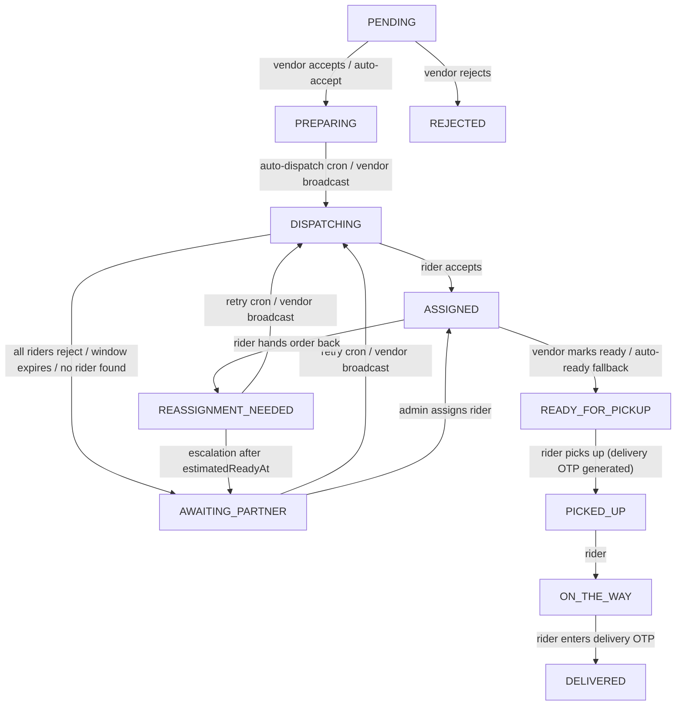
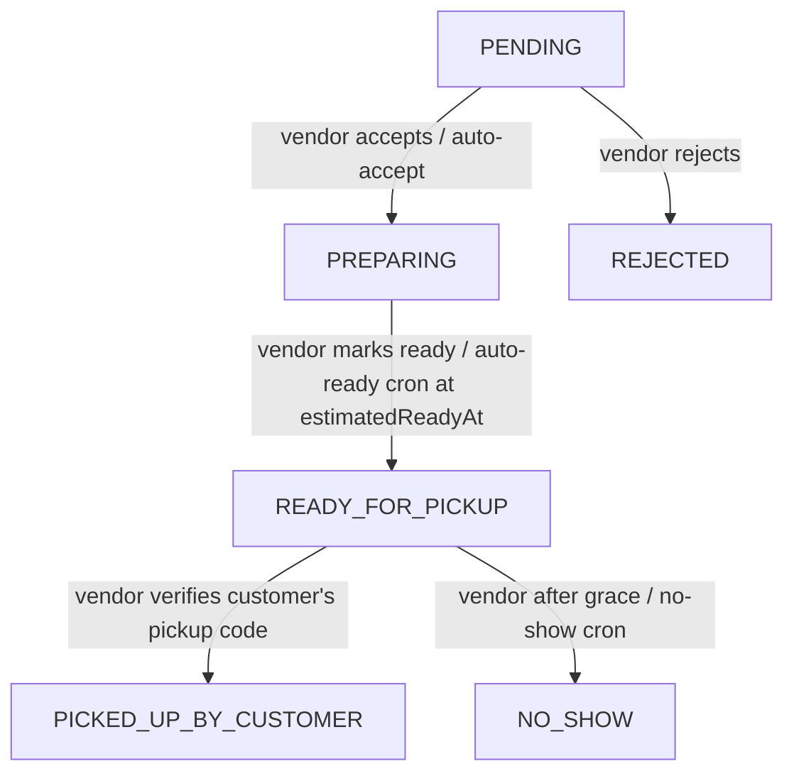

# Order Lifecycle

This page describes the order state machine exactly as implemented. The status
values live in `modules/Order/order.constant.ts` (`ORDER_STATUS`); the
transitions are enforced in `modules/Order/order.service.ts` and, for
time-driven changes, `cron/order.cron.ts`. Source paths on this page are given
relative to the backend's `src/app/` directory.

---

## Overview

- An order is created **only after payment is verified**, always as `PENDING`
  (`finalizeCheckoutIntoOrder`, reached from `POST /orders/create-order` or the
  payment gateway notification). Checkout and payment are covered in
  [Checkout and Order Creation](./checkout-and-order-creation.md).
- The current status is `Order.orderStatus` (default `PENDING`). Every change is
  also recorded in `Order.statusHistory[]` (`status`, `timestamp`, optional
  `updatedBy` and `note`). System-triggered entries carry a `note` and no
  `updatedBy`.
- `fulfillmentType` (`DELIVERY` or `PICKUP`) decides which flow applies.
- There is **no generic "set status" endpoint**. Each transition is a dedicated
  service function with its own preconditions, listed below. Rider, dispatch,
  automatic, and pickup-verification transitions use a conditional
  `findOneAndUpdate` on the expected current status, so a stale or repeated
  request does not move the order. Vendor actions (accept, reject, cancel, mark
  ready, mark no-show, all in `updateOrderStatusByVendor`) and customer cancel instead
  load the order and check its status inside a transaction.
- Who can change an order's status:

| Actor | What it can do to status |
| --- | --- |
| Vendor / sub-vendor (owning `vendorId`) | Accept, reject (while `PENDING`), cancel (after accepting, before a rider is assigned), mark ready (pickup, and delivery before pickup), mark no-show (pickup), verify the pickup code, manually broadcast to riders |
| Delivery partner | Accept a dispatch offer, then `PICKED_UP`, `ON_THE_WAY`, `DELIVERED`, or hand the order back (`REASSIGNMENT_NEEDED`) |
| Customer | Cancel (from any non-terminal status). Answering a receipt confirmation never changes the status (see [Delivery Exceptions and Verification](./delivery-exceptions.md)) |
| Admin / super admin | Manually assign a rider to an order awaiting one; for an in-transit order, complete the delivery manually (`DELIVERED`) or cancel it after a delivery fault (`CANCELED`), both with proof and a reason (see [Delivery Exceptions and Verification](./delivery-exceptions.md)) |
| System (cron / worker) | Auto-accept, auto-dispatch and retry, dispatch expiry, dispatch failure recovery, escalation, auto-ready fallback, auto no-show |

---

## Delivery Order Lifecycle



The customer can also cancel from any non-terminal status, and the vendor can
cancel an order it has already accepted while no rider is assigned (see
[Status Transition Rules](#status-transition-rules)); both end in `CANCELED`.
The diagram omits `CANCELED` to stay readable.

Points that are easy to miss:

- **Accepting jumps straight to `PREPARING`.** The accept writes `ACCEPTED` and
  `PREPARING` to the history but persists `PREPARING` (see
  [Statuses that are not part of the normal flow](#statuses-that-are-not-part-of-the-normal-flow)).
- **`READY_FOR_PICKUP` stays mandatory before pickup.** A rider cannot set it,
  and a rider can move to `PICKED_UP` only from `READY_FOR_PICKUP`; there is no
  `ASSIGNED` to `PICKED_UP` shortcut. Three things can make a delivery order
  `READY_FOR_PICKUP`:
  1. **The vendor marks it ready** (optional). Allowed while the order is
     `PREPARING`, `DISPATCHING`, `AWAITING_PARTNER`, `REASSIGNMENT_NEEDED` or
     `ASSIGNED`. If a rider is already assigned, the order becomes
     `READY_FOR_PICKUP` immediately. Otherwise the status does not change and the
     confirmation is stored in `foodReadyAt`; when a rider is later assigned
     (accepting an offer, or an admin assignment) the order becomes
     `READY_FOR_PICKUP` in the same transaction as the assignment.
  2. **The auto-ready fallback.** If the vendor never confirms, the cron moves an
     `ASSIGNED` order to `READY_FOR_PICKUP` 5 minutes after `estimatedReadyAt`.
  3. A vendor confirmation recorded earlier is released by the auto-ready cron as
     a safety net if the assignment did not already do it.

  Three values are easy to confuse: `estimatedReadyAt` is the **expected**
  readiness, `foodReadyAt` is the **vendor-confirmed** readiness, and the
  `READY_FOR_PICKUP` status is the actual state that allows pickup. Marking the
  order ready does not change dispatch timing; dispatch is driven by
  `estimatedReadyAt` and the vendor's broadcast as before.
- **A rider can hand the order back only from `ASSIGNED`.** Once the order is
  `READY_FOR_PICKUP` or later, `REASSIGNMENT_NEEDED` is no longer allowed.
- Dispatch mechanics (rider search, offer window, pool handling) are outside the
  scope of this page; only their effect on status is described. See
  [Delivery Dispatch and Riders](./delivery-dispatch.md).

---

## Customer Pickup Lifecycle



- A `PICKUP` order never enters the dispatch states (`DISPATCHING`,
  `AWAITING_PARTNER`, `ASSIGNED`, `REASSIGNMENT_NEEDED`); manual broadcast and
  admin assignment reject pickup orders.
- The pickup slot (a future half-hour slot within the vendor's hours and closing
  days) is validated at checkout, and a six-digit `pickup.code` is generated
  with the order.
- The customer can cancel from any non-terminal status, including
  `READY_FOR_PICKUP`. The vendor can cancel a pickup order only while it is
  `PREPARING` (a vendor cancellation is refused from `READY_FOR_PICKUP`).

---

## Status Definitions

All 15 values of `ORDER_STATUS`.

| Status | Meaning | Flow | Terminal? |
| --- | --- | --- | --- |
| `PENDING` | Paid, waiting for the vendor's response | Both | No |
| `ACCEPTED` | Vendor acceptance; written to history only, the order rests in `PREPARING` | Both | No (transient) |
| `REJECTED` | Vendor rejected a `PENDING` order | Both | Yes |
| `PREPARING` | Accepted and being prepared; `estimatedReadyAt` is set | Both | No |
| `DISPATCHING` | Offered to a pool of riders | Delivery | No |
| `AWAITING_PARTNER` | No rider currently holds the order (offers ended or none found) | Delivery | No |
| `ASSIGNED` | A rider is assigned (accepted an offer or was assigned by an admin) | Delivery | No |
| `REASSIGNMENT_NEEDED` | The assigned rider handed the order back; partner cleared | Delivery | No |
| `READY_FOR_PICKUP` | Food is ready: for delivery, the rider may collect it; for pickup, the customer may collect it | Both | No |
| `PICKED_UP` | Rider collected the order; delivery OTP generated | Delivery | No |
| `ON_THE_WAY` | Rider is delivering | Delivery | No |
| `DELIVERED` | Handed over, delivery OTP verified | Delivery | Yes |
| `PICKED_UP_BY_CUSTOMER` | Vendor verified the pickup code | Pickup | Yes |
| `CANCELED` | Canceled by the customer, or by the vendor after accepting and before a rider is assigned | Both | Yes |
| `NO_SHOW` | Pickup order never collected | Pickup | Yes |

---

## Status Transition Rules

Every implemented transition. "Actor" is the role or system component that
triggers it.

| # | From → To | Actor / trigger | Conditions | Source |
| --- | --- | --- | --- | --- |
| 1 | *(none)* → `PENDING` | Customer confirms after verified payment, or the gateway notification | Checkout summary owned by the customer, token matches, not already converted | `finalizeCheckoutIntoOrder` |
| 2 | `PENDING` → `PREPARING` | Vendor `ACCEPTED` (manual accept) | Vendor/sub-vendor owns the order and its profile is `APPROVED`; order is paid; current status is `PENDING`; `preparationTime` ≥ 1 (validated) | `updateOrderStatusByVendor` |
| 2b | `PENDING` → `PREPARING` | System: auto-accept | Only `autoAcceptDeadlineAt` has passed (`autoAcceptTimeoutMinutes`; runtime default 2, see [Order Automation](./order-automation.md#configuration)) and the order is still `PENDING`. The ownership, `APPROVED`-profile, paid and `preparationTime` checks of row 2 are not applied; the vendor's default preparation time is used | `autoAcceptOrder` |
| 3 | `PENDING` → `REJECTED` | Vendor `REJECTED` | Same ownership/approval/paid checks; current status must be `PENDING` **and no rider assigned**; `reason` required; sets `refundStatus: PENDING` | `updateOrderStatusByVendor` |
| 3b | `ACCEPTED` / `PREPARING` / `DISPATCHING` / `AWAITING_PARTNER` / `REASSIGNMENT_NEEDED` → `CANCELED` | Vendor `CANCELED` | Same ownership/approval/paid checks; **no rider assigned** (`CANNOT_CANCEL_ORDER_RIDER_ALREADY_ASSIGNED`, so `ASSIGNED` and later are refused); status in that list (`ORDER_CANNOT_BE_CANCELED_OR_REJECTED_AT_STAGE` otherwise, which also refuses `PENDING` and pickup `READY_FOR_PICKUP`); `reason` required (`CANCEL_REASON_REQUIRED`). Sets `cancelReason` and `refundStatus: PENDING`, clears `dispatchPartnerPool` and `dispatchRejectedPartnerPool`, and restores stock (non-`RESTAURANT` vendors) | `updateOrderStatusByVendor` |
| 4 | `PREPARING` → `DISPATCHING` | System: auto-dispatch | Delivery order, no rider, empty pool, `estimatedReadyAt` within `autoDispatchLeadMinutes` (runtime default 10, see [Order Automation](./order-automation.md#configuration)) | `autoDispatchOrder` |
| 4b | `ACCEPTED` / `PREPARING` / `AWAITING_PARTNER` / `REASSIGNMENT_NEEDED` → `DISPATCHING` | Vendor `broadcast-order` | Delivery order; vendor `APPROVED` with a session location; pool currently empty | `broadcastOrderToPartners` |
| 5 | `AWAITING_PARTNER` → `DISPATCHING` | System: retry | `dispatchExpiresAt` passed and `estimatedReadyAt` still in the future | `autoRetryDispatchOrder` |
| 5b | `REASSIGNMENT_NEEDED` → `DISPATCHING` | System: retry | No rider, empty pool, `estimatedReadyAt` in the future | `autoRetryReassignmentOrder` |
| 6 | `DISPATCHING` → `ASSIGNED` | Delivery partner `ACCEPT` | Rider `APPROVED`, has no active order, is in the live pool and not previously rejected, window not expired; only one rider wins. If the order already has `foodReadyAt`, it goes on to `READY_FOR_PICKUP` in the same transaction (row 6b) | `partnerAcceptsDispatchedOrder` |
| 6b | `DISPATCHING` → `ASSIGNED` → `READY_FOR_PICKUP` | Delivery partner `ACCEPT` | The order has `foodReadyAt` (the vendor confirmed it ready before a rider was assigned). Both history entries are written in the assignment transaction; the second note says the vendor had confirmed | `partnerAcceptsDispatchedOrder` |
| 7 | `DISPATCHING` → `AWAITING_PARTNER` | Last rider in the pool rejects | Rider was in the pool | `partnerAcceptsDispatchedOrder` |
| 7b | `DISPATCHING` → `AWAITING_PARTNER` | System: window expired | `dispatchExpiresAt` passed. Done by the cron, or by a rider's late accept or late reject request (the expiry check runs before the action is looked at) | `handleOrderExpiryCron`, `partnerAcceptsDispatchedOrder` |
| 7c | `DISPATCHING` → `AWAITING_PARTNER` | System: no eligible rider | Dispatch found no rider (manual broadcast then returns `NO_PARTNER_FOUND`); `dispatchExpiresAt` is set to about now + 120 seconds | `dispatchOrderToPartners` |
| 7d | `DISPATCHING` → `AWAITING_PARTNER` | System: vendor location missing | Auto-dispatch, dispatch retry, or reassignment retry found that the vendor's `businessLocation` has no numeric longitude/latitude, so no rider search ran; `dispatchExpiresAt` is set to about now + 120 seconds. The retry cron can pick the order up again (row 5) until `estimatedReadyAt` passes, after which it is escalated | `autoDispatchOrder`, `autoRetryDispatchOrder`, `autoRetryReassignmentOrder` |
| 7e | `DISPATCHING` → `AWAITING_PARTNER` | System: dispatch failure recovery | The order was claimed into `DISPATCHING` but the geo search or the dispatch write failed unexpectedly, and the pool is still empty. It gets a fresh `dispatchExpiresAt` (about now + 120 seconds) and the history note "Dispatch failed unexpectedly, waiting for partner", so retry and escalation continue. A recovery path, not a successful dispatch; the original error still reaches the caller. Not applied once the pool has been written (the normal expiry handles that case) | `dispatchOrderToPartners` |
| 8 | `AWAITING_PARTNER` → `ASSIGNED` | Admin assigns a rider | Delivery order in `AWAITING_PARTNER` without a rider; rider approved, idle and free (checked at write time). If the order has `foodReadyAt`, it becomes `READY_FOR_PICKUP` in the same transaction (the response, push and socket event then carry that status) | `assignDeliveryPartnerByAdmin` |
| 9 | `AWAITING_PARTNER` / `REASSIGNMENT_NEEDED` → `AWAITING_PARTNER` (escalated) | System: escalation | `estimatedReadyAt` passed (or unset) and not already escalated; done once until a rider is assigned (`dispatchEscalatedAt` is set on escalation and reset to `null` when a rider is assigned); automatic dispatch stops | `autoEscalateDispatchOrder` |
| 10 | `ASSIGNED` → `REASSIGNMENT_NEEDED` | Delivery partner | Rider is the assigned rider; `reason` required; clears the partner and blocks that rider for this order | `updateOrderStatusByDeliveryPartner` |
| 11 | `ASSIGNED` → `READY_FOR_PICKUP` | System: auto-ready fallback | Delivery order; the vendor has not confirmed (`foodReadyAt` empty) and `estimatedReadyAt` + 5 minutes has passed. Writes a history note, alerts admins and pushes the assigned rider (see [Order Automation](./order-automation.md#auto-ready-autoreadyorder)) | `autoReadyOrder` |
| 11a | `ASSIGNED` → `READY_FOR_PICKUP` | Vendor `READY_FOR_PICKUP` | Delivery order with a rider assigned; immediate. Before assignment (`PREPARING`, `DISPATCHING`, `AWAITING_PARTNER`, `REASSIGNMENT_NEEDED`) the vendor action only stores `foodReadyAt` and the status is unchanged; other statuses are refused (`ORDER_CANNOT_BE_MARKED_READY_AT_STAGE`) | `updateOrderStatusByVendor` |
| 11b | `PREPARING` → `READY_FOR_PICKUP` | Vendor `READY_FOR_PICKUP` | Pickup order; current status `PREPARING` | `updateOrderStatusByVendor` |
| 11c | `PREPARING` → `READY_FOR_PICKUP` | System: auto-ready fallback | Pickup order; `estimatedReadyAt` + 5 minutes has passed | `autoReadyOrder` |
| 11d | `ASSIGNED` → `READY_FOR_PICKUP` | System: auto-ready (safety net) | Delivery order with `foodReadyAt` set that is `ASSIGNED` (normally already released at assignment; no admin alert or rider push) | `autoReadyOrder` |
| 12 | `READY_FOR_PICKUP` → `PICKED_UP` | Delivery partner | Assigned rider; generates the six-digit delivery OTP | `updateOrderStatusByDeliveryPartner` |
| 13 | `PICKED_UP` → `ON_THE_WAY` | Delivery partner | Assigned rider | `updateOrderStatusByDeliveryPartner` |
| 14 | `ON_THE_WAY` → `DELIVERED` | Delivery partner | Assigned rider; correct six-digit OTP. A wrong code is refused (`401`) and counted; the fifth wrong code locks the OTP (`403`, a `DELIVERY_OTP_LOCKED` exception opens) until an admin resets it (see "Delivery OTP" below) | `updateOrderStatusByDeliveryPartner` |
| 14b | `PICKED_UP` / `ON_THE_WAY` → `DELIVERED` | Admin manual completion | Proof (customer confirmed receipt, or a verified delivery OTP with an open exception) and a reason; one settlement job. See [Delivery Exceptions and Verification](./delivery-exceptions.md) | `completeDeliveryManually` |
| 14c | `PICKED_UP` / `ON_THE_WAY` → `CANCELED` | Admin fault cancel | An open rider SOS, or the customer declined receipt; `refundStatus: PENDING`. See [Delivery Exceptions and Verification](./delivery-exceptions.md) | `faultCancelOrder` |
| 15 | `READY_FOR_PICKUP` → `PICKED_UP_BY_CUSTOMER` | Vendor verifies the pickup code | Pickup order owned by the vendor, status `READY_FOR_PICKUP`, code matches | `verifyPickupCode` |
| 16 | `READY_FOR_PICKUP` → `NO_SHOW` | Vendor `NO_SHOW` | Pickup order; current status `READY_FOR_PICKUP`; at least 15 minutes past the later of the promised pickup time and the ready time | `updateOrderStatusByVendor` |
| 16b | `READY_FOR_PICKUP` → `NO_SHOW` | System | Same grace has elapsed, or the vendor's closing time has passed | `autoMarkOrderNoShow` |
| 17 | any non-terminal → `CANCELED` | Customer | See "Customer cancellation" below | `cancelOrderByCustomer` |

Guards that apply to the vendor action endpoint as a whole: repeating the
current status returns `ORDER_ALREADY_IN_STATUS`; only `ACCEPTED`, `REJECTED`,
`CANCELED`, `READY_FOR_PICKUP`, and `NO_SHOW` are accepted as `type`.

**Customer cancellation.** The customer must own the order, the order must be
paid, and a `reason` is required. Cancellation is refused only from the
terminal statuses `CANCELED`, `REJECTED`, `DELIVERED`, `PICKED_UP_BY_CUSTOMER`,
and `NO_SHOW`. It is therefore allowed in every other status, including after
rider assignment and after pickup (`PICKED_UP`, `ON_THE_WAY`). It clears the
dispatch pool, frees an assigned rider, and (for non-`RESTAURANT` vendors,
which are the ones whose stock is deducted) restores stock for the stages where
it had been deducted (`ACCEPTED`, `AWAITING_PARTNER`, `DISPATCHING`,
`REASSIGNMENT_NEEDED`, `ASSIGNED`, `PREPARING`, `READY_FOR_PICKUP`). Stock is
not restored when canceling from `PICKED_UP` or `ON_THE_WAY`. The full
comparison of cancel, reject, vendor cancel and no-show (refund status, stock,
riders, notifications) is in
[Cancellations, Refunds and Settlement](./cancellations-refunds-settlement.md).

**Vendor cancellation (`CANCELED`).** A vendor that has already accepted an
order can cancel it while no rider is assigned. Allowed from `ACCEPTED`,
`PREPARING`, `DISPATCHING`, `AWAITING_PARTNER` and `REASSIGNMENT_NEEDED`
(`ACCEPTED` never rests, see below); refused from `PENDING` (the vendor must
reject instead), from any status once `deliveryPartnerId` is set, and from pickup
`READY_FOR_PICKUP`. The `reason` is required. It records `cancelReason`, sets
`refundStatus: PENDING`, empties both dispatch pools and restores stock for a
non-`RESTAURANT` vendor. It goes through the generic vendor status path, so it
writes a `statusHistory` entry (the reason as the note) and emits
`ORDER_STATUS_UPDATED`; it does **not** notify the customer, write an activity
log entry, or enqueue any job.

### Vendor reject and cancel (`PATCH /orders/:orderId/status`)

Both actions use the same vendor endpoint
(`PATCH /api/v1/orders/:orderId/status`, `VENDOR` / `SUB_VENDOR`,
`updateOrderStatusByVendor`). The body is validated strictly: only `type`,
`reason` and `preparationTime` are allowed.

**Reject** — the vendor refuses an order it has not accepted yet:

```json
{ "type": "REJECTED", "reason": "Kitchen is closed" }
```

**Cancel** — the vendor accepted the order but backs out before any rider is
assigned:

```json
{ "type": "CANCELED", "reason": "Ingredient unavailable" }
```

A successful call returns `200` with the message "Order status updated to
REJECTED successfully." (or `CANCELED`; key `ORDER_STATUS_UPDATED_SUCCESS_DYNAMIC`)
and the updated order in `data`.

`REJECTED` and `CANCELED` are different outcomes and are never merged:
`REJECTED` means the vendor never accepted the order; `CANCELED` means the vendor
accepted it and later canceled it. Both are terminal and both set
`refundStatus: PENDING`, so an admin has to run the gateway refund.

| | `REJECTED` | `CANCELED` (by the vendor) |
| --- | --- | --- |
| Allowed from | `PENDING` only | `ACCEPTED`, `PREPARING`, `DISPATCHING`, `AWAITING_PARTNER`, `REASSIGNMENT_NEEDED` |
| Requires no rider | Yes | Yes |
| `reason` | Required; saved as `rejectReason` | Required; saved as `cancelReason` |
| Dispatch pools | Not applicable (a `PENDING` order has none) | `dispatchPartnerPool` and `dispatchRejectedPartnerPool` both cleared |
| Stock | Nothing to restore | Restored (non-`RESTAURANT` vendors) |
| Customer told | Push `ORDER_REJECTED_TO_CUSTOMER` and email | Not notified |

**Checks, in the order they run** (the first failure is returned; `400` unless
stated):

| Order | Check | Error key |
| --- | --- | --- |
| 1 | Caller is a vendor / sub-vendor (`403`) | `COMMON_UNAUTHORIZED_ACTION` |
| 2 | Caller's profile is `APPROVED` (`403`) | `NOT_APPROVED_ACCEPT_REJECT_ORDERS` |
| 3 | Order exists and belongs to the caller (`404`) | `NOT_FOUND_MESSAGE` |
| 4 | Order is paid | `ONLY_PAID_ORDER_CAN_ACCEPT_REJECT` |
| 5 | Order is not already in the requested status | `ORDER_ALREADY_IN_STATUS` |
| 6 | **Reject:** no rider assigned | `ORDER_CANNOT_BE_CANCELED_OR_REJECTED_AT_STAGE` |
| 7 | **Reject:** status is `PENDING` | `CANNOT_REJECT_ACCEPTED_ORDER_USE_CANCEL_INSTEAD` |
| 8 | **Reject:** `reason` is present | `REJECT_REASON_REQUIRED` |
| 6 | **Cancel:** no rider assigned | `CANNOT_CANCEL_ORDER_RIDER_ALREADY_ASSIGNED` |
| 7 | **Cancel:** status is not `PENDING` | `CANNOT_CANCEL_PENDING_ORDER_USE_REJECT_INSTEAD` |
| 7b | **Cancel:** status is in the allowed list | `ORDER_CANNOT_BE_CANCELED_OR_REJECTED_AT_STAGE` |
| 8 | **Cancel:** `reason` is present | `CANCEL_REASON_REQUIRED` |

What a `CANCELED` request returns for each current status:

| Current status | Result |
| --- | --- |
| `PENDING` | Refused (`CANNOT_CANCEL_PENDING_ORDER_USE_REJECT_INSTEAD`, "A pending order cannot be canceled. Please reject it instead."): `PENDING → CANCELED` is not allowed, the vendor must reject |
| `ACCEPTED`, `PREPARING`, `DISPATCHING`, `AWAITING_PARTNER`, `REASSIGNMENT_NEEDED` | Allowed (`ACCEPTED` never rests, see below) |
| `ASSIGNED` | Refused (`CANNOT_CANCEL_ORDER_RIDER_ALREADY_ASSIGNED`) |
| Delivery `READY_FOR_PICKUP`, `PICKED_UP`, `ON_THE_WAY`, `DELIVERED` | Refused (`CANNOT_CANCEL_ORDER_RIDER_ALREADY_ASSIGNED`) |
| Pickup `READY_FOR_PICKUP` | Refused (`ORDER_CANNOT_BE_CANCELED_OR_REJECTED_AT_STAGE`; no rider, but the status is not in the list) |
| `PICKED_UP_BY_CUSTOMER`, `REJECTED`, `NO_SHOW` | Refused (`ORDER_CANNOT_BE_CANCELED_OR_REJECTED_AT_STAGE`) |
| `CANCELED` | Refused (`ORDER_ALREADY_IN_STATUS`) |

**After a reject or a vendor cancel nothing continues.** Every automatic job and
action selects orders by status, so a `REJECTED` or `CANCELED` order is skipped by
all of them:

- Auto-accept only reads `PENDING`, auto-dispatch only `PREPARING`, and dispatch
  retry, reassignment retry and escalation only `AWAITING_PARTNER` /
  `REASSIGNMENT_NEEDED`. The vendor's `broadcast-order` refuses the order.
- Admin assignment fails with `ORDER_NOT_AWAITING_PARTNER_FOR_ASSIGNMENT` (the
  current status is returned in the message).
- A rider who still has the offer cannot take it: accept fails with
  `ORDER_ALREADY_CLAIMED_OR_EXPIRED`, and reject fails with `NOT_IN_POOL` because
  the pool was cleared.
- `GET /orders/:orderId/nearby-partners` is read-only and does not check the
  order's status, so it still answers for a canceled order.

**Inferred:** the action runs in a database transaction that loads and then saves
the order. If an automatic job changes the same order at the same moment, the
vendor may get a transient error instead of the result and can simply retry.

---

## Role-Based Actions

| Role | Endpoint | Status effect | Access checks |
| --- | --- | --- | --- |
| `CUSTOMER` | `PATCH /orders/:orderId/cancel` | → `CANCELED` | `auth('CUSTOMER')`; order must belong to the customer |
| `VENDOR`, `SUB_VENDOR` | `PATCH /orders/:orderId/status` | `ACCEPTED` (→ `PREPARING`), `REJECTED`, `CANCELED`, `READY_FOR_PICKUP`, `NO_SHOW` | `auth('VENDOR','SUB_VENDOR')`; the order's `vendorId` must be the caller's own profile; profile must be `APPROVED` |
| `VENDOR`, `SUB_VENDOR` | `PATCH /orders/:orderId/verify-pickup` | → `PICKED_UP_BY_CUSTOMER` | `auth('VENDOR','SUB_VENDOR')`; owns the order |
| `VENDOR`, `SUB_VENDOR` | `PATCH /orders/:orderId/broadcast-order` | → `DISPATCHING` | `auth('VENDOR','SUB_VENDOR')`; owns the order; `APPROVED`; delivery orders only |
| `DELIVERY_PARTNER` | `PATCH /orders/:orderId/accept-dispatch-order` | `DISPATCHING` → `ASSIGNED` (accept) or rejection | `auth('DELIVERY_PARTNER')`; `APPROVED`; must be in the live pool |
| `DELIVERY_PARTNER` | `PATCH /orders/:orderId/update-order-status` | `PICKED_UP`, `ON_THE_WAY`, `DELIVERED`, `REASSIGNMENT_NEEDED` | `auth('DELIVERY_PARTNER')`; `deliveryPartnerId` must be the caller |
| `ADMIN`, `SUPER_ADMIN` | `PATCH /orders/:orderId/assign-partner` | `AWAITING_PARTNER` → `ASSIGNED` (or `READY_FOR_PICKUP` when `foodReadyAt` is set) | `auth('ADMIN','SUPER_ADMIN',['CAN_MANAGE_ORDERS'])`; the permission is enforced only for `ADMIN` |
| `DELIVERY_PARTNER` | `POST /orders/:orderId/sos`, `POST /orders/:orderId/delivery-verification-issue` | None (recorded on the order) | `auth('DELIVERY_PARTNER')`; the order's own rider. See [Delivery Exceptions and Verification](./delivery-exceptions.md) |
| `CUSTOMER` | `PATCH /orders/:orderId/confirm-receipt` | None | `auth('CUSTOMER')`; own order, `PICKED_UP` / `ON_THE_WAY` only |
| `ADMIN`, `SUPER_ADMIN` | `GET /orders/delivery-exceptions`, `.../delivery-exception/acknowledge`, `.../delivery-exception/resolve`, `.../delivery-otp/reset`, `.../replace-partner`, `.../request-receipt-confirmation`, `.../complete-delivery`, `.../fault-cancel` | `complete-delivery` → `DELIVERED`, `fault-cancel` → `CANCELED`; the others none | Same `auth` as `assign-partner`. See [Delivery Exceptions and Verification](./delivery-exceptions.md) |
| `FLEET_MANAGER` | none | Read-only: sees the orders of its managed riders in the order list | — |

Additional notes:

- A parent `VENDOR` and its `SUB_VENDOR` branches each act only on orders whose
  `vendorId` is their own profile; a parent cannot change a branch's orders.
- Approved `VENDOR` accounts are covered by the agreement gate for all
  `/orders` requests (a `SUB_VENDOR` is covered through its parent's
  agreement); an unsigned or outdated agreement blocks these routes. See
  [Authorization](../03-identity-access/authorization.md).
- The rider status endpoint checks the caller's role and that the order is
  assigned to the caller, but does not check the rider profile's `APPROVED`
  status; accepting a dispatch offer does.
- The Zod schemas (`order.validation.ts`) restrict the accepted values:
  vendors may send only the five `type` values; riders only
  `REASSIGNMENT_NEEDED`, `PICKED_UP`, `ON_THE_WAY`, `DELIVERED`, and
  `DELIVERED` requires a six-digit `otp`.

---

## Automatic/System Transitions

All run from `cron/index.ts` and `cron/order.cron.ts`. The every-minute job
runs the order steps in the order listed.

| Schedule | Job | Transition | Condition |
| --- | --- | --- | --- |
| every minute | `handleOrderExpiryCron` | `DISPATCHING` → `AWAITING_PARTNER` | `dispatchExpiresAt` passed; riders that did not respond are added to the order's rejected list |
| every minute | `handleAutoRetryDispatchCron` | escalation, then `AWAITING_PARTNER` → `DISPATCHING`, then `REASSIGNMENT_NEEDED` → `DISPATCHING` | Retry only while `estimatedReadyAt` is in the future; after it, the order is escalated (once until a rider is assigned, row 9) and stays `AWAITING_PARTNER` |
| every minute | `handleAutoAcceptCron` | `PENDING` → `PREPARING` | `autoAcceptDeadlineAt` passed |
| every minute | `handleAutoDispatchCron` | `PREPARING` → `DISPATCHING` | Delivery order, `estimatedReadyAt` within `autoDispatchLeadMinutes` |
| every minute | `handleAutoReadyCron` | `ASSIGNED` → `READY_FOR_PICKUP` (delivery), `PREPARING` → `READY_FOR_PICKUP` (pickup) | The vendor has not confirmed and `estimatedReadyAt` + 5 minutes has passed (a vendor-confirmed `ASSIGNED` delivery order is released at once) |
| every 5 minutes | `handleAutoNoShowCron` | `READY_FOR_PICKUP` → `NO_SHOW` | Pickup order past the 15-minute grace, or past the vendor's closing time (for `RESTAURANT` vendors the current day's closing; otherwise the closing time on the scheduled pickup day) |

The two timing values come from the global settings, and both `autoAcceptDeadlineAt`
(order creation time plus `autoAcceptTimeoutMinutes`) and `estimatedReadyAt` (set
when the order is accepted, from the preparation minutes) are consumed by these
jobs. Settings, defaults and per-job details are in
[Order Automation](./order-automation.md).

Post-transition work is asynchronous, on the `order-queue` worker
(`PROCESS_ORDER_POST_UPDATE`). The job is enqueued by every delivery-partner
status transition (`PICKED_UP`, `ON_THE_WAY`, `DELIVERED`,
`REASSIGNMENT_NEEDED`), by vendor pickup verification, and by vendor or
automatic `NO_SHOW`. The worker acts on the status it is given:

- `DELIVERED`, `PICKED_UP_BY_CUSTOMER`, `NO_SHOW`: credits the wallets and
  writes the transaction rows (points and referral bonuses are skipped for
  `NO_SHOW`). Only `DELIVERED` involves a rider: the worker then updates the
  rider's delivery statistics and frees the rider. `PICKED_UP_BY_CUSTOMER` and
  `NO_SHOW` have no rider to free.
- `REASSIGNMENT_NEEDED`: frees the rider that handed the order back.
- `PICKED_UP`, `ON_THE_WAY`: no ledger or rider change (`ON_THE_WAY` only
  triggers a push to the vendor).

Notification and push behavior for these events is documented in
[Notification Flow](../02-platform/notification-flow.md); the wallet and ledger
side of settlement in
[Cancellations, Refunds and Settlement](./cancellations-refunds-settlement.md#settlement).

---

## Important Business Rules

- **Payment gate.** An order exists only once payment is verified; vendor
  accept/reject/cancel and customer cancel all require `isPaid`.
- **Accept side effects (manual and automatic).** Both paths share the same
  effects: fill `pickupAddress` from the vendor's location, set
  `estimatedReadyAt = now + preparation minutes`, and deduct stock for
  non-`RESTAURANT` vendors. The minutes are the vendor's supplied
  `preparationTime` for a manual accept, and the vendor's default
  (`preparationTimeMinutes`) for an auto-accept. The checks listed in row 2
  (ownership, `APPROVED` profile, paid, `preparationTime`) belong to the manual
  accept only. A stock shortfall fails the accept with
  `INSUFFICIENT_STOCK`; the order stays `PENDING` (auto-accept then retries on
  later ticks).
- **Reject.** Allowed only from `PENDING` and only while no rider is assigned,
  with a reason (`rejectReason`). It sets `refundStatus: PENDING`. (The
  rider-assigned check is redundant in practice: a `PENDING` order has no rider.)
- **Cancel and refund status.** A customer cancel sets `refundStatus: PENDING`
  only when the order was `PENDING`; from any other status it is
  `NOT_APPLICABLE`. A vendor cancel and a vendor reject always set `PENDING`.
  `NO_SHOW` is `NOT_APPLICABLE`. None of cancel, reject or vendor cancel performs
  the gateway refund itself; an admin does (see
  [Cancellations, Refunds and Settlement](./cancellations-refunds-settlement.md#refunds)).
- **Delivery OTP.** Generated when the rider sets `PICKED_UP` and sent to the
  customer. `DELIVERED` requires it. The code, the attempt limit and the absence
  of a lock are checked in the same atomic update that completes the delivery. A
  wrong code (sent while the order is `ON_THE_WAY`) is refused with `401` and
  counted; the fifth wrong code returns `403` and locks the OTP, opening a
  `DELIVERY_OTP_LOCKED` exception for the admins. An admin resets the OTP (new
  code to the customer, attempts back to 0, the same rider continues). The lock,
  the reset and the other recovery paths are described in
  [Delivery Exceptions and Verification](./delivery-exceptions.md).
- **Pickup code.** Generated when the order is created. The vendor's
  `verify-pickup` must supply it; a wrong code is refused (`401`). There is no
  attempt limit.
- **`NO_SHOW`.** The vendor action is available only for pickup orders in
  `READY_FOR_PICKUP`, and only after the grace period. Both the vendor action
  and the automatic no-show set `refundStatus: NOT_APPLICABLE`, set
  `cancelReason` (the vendor's `reason`, or a default text; the automatic path
  writes a fixed text for the grace-period or closing-time trigger), and restore
  stock for non-`RESTAURANT` vendors.
- **Single winner.** Rider acceptance and admin assignment use conditional
  updates plus a rider claim in the same transaction, so two actors cannot both
  take the order.
- **One active order per rider.** A rider with an active order cannot accept
  another.
- **History semantics.** Two mechanisms write `statusHistory`. The helper
  `updateOrderStatusHistory` (`order.utils.ts`) is used by the vendor actions
  (accept, reject, mark ready, mark no-show), the accept's `PREPARING` step, and
  customer cancel: if the new status equals the last entry's status it updates
  that entry (timestamp, and `note`/`updatedBy` when supplied) instead of
  adding one; otherwise it appends. Every `findOneAndUpdate` path (dispatch,
  retry, escalation, rider accept and last-rider reject, admin assign, rider status
  updates, pickup verification, auto-ready, auto no-show) `$push`es a new entry
  unconditionally and never merges. A dispatch can therefore leave two
  consecutive `DISPATCHING` entries: the claim step records why the order
  entered `DISPATCHING` (for example "Manual broadcast: re-broadcasting…" or
  "Auto-dispatch triggered…"), and the partner-broadcast step then records the
  result ("Broadcasted to N nearby delivery partners"). They are separate steps of
  one dispatch, not a duplicate transition; the status, pool and
  `dispatchExpiresAt` are each written once.
- **Real-time updates.** Most transition paths emit the Socket.IO
  `ORDER_STATUS_UPDATED` event. The dispatch-expiry cron is an exception; it
  emits `ORDER_DISPATCH_EXPIRED` to the vendor. All events are listed in
  [Order Tracking and Realtime](./order-tracking-and-realtime.md#order-events).
- **Ratings.** An order can be rated only in `DELIVERED` or
  `PICKED_UP_BY_CUSTOMER`; see [Ratings](../11-ratings/ratings.md).

---

## Statuses that are not part of the normal flow

- **`ACCEPTED`.** Defined in `ORDER_STATUS`, labelled, and accepted as a source
  status by manual broadcast and the cancellation stock logic, but no path
  leaves an order resting in it: manual and automatic accept both write
  `ACCEPTED` and then `PREPARING` in the same save (`applyPreparingTransition`).
  It is visible only in `statusHistory`.
- **`AWAITING_PARTNER`, `REASSIGNMENT_NEEDED`.** Exception states of the
  delivery flow (no rider, or the rider dropped the order). They loop back to
  `DISPATCHING`, or are escalated to an admin who can assign a rider from
  `AWAITING_PARTNER`.
- **`REJECTED`, `CANCELED`, `NO_SHOW`.** Terminal exception outcomes, as
  opposed to the successful terminals `DELIVERED` and `PICKED_UP_BY_CUSTOMER`.

---

## Implementation notes and inconsistencies

- The comments in `order.model.ts` and `order.interface.ts` describe
  `autoAcceptDeadlineAt` and `estimatedReadyAt` as "foundation only — not yet
  consumed by transition logic". This is stale: auto-accept, auto-dispatch,
  retry, escalation, and auto-ready all read them.
- `BLOCKED_FOR_ORDER_CANCEL` lists seven statuses — `ASSIGNED`, `PREPARING`,
  `READY_FOR_PICKUP`, `PICKED_UP`, `ON_THE_WAY`, `DELIVERED`, and
  `PICKED_UP_BY_CUSTOMER` — which is not a contiguous range of the flow (for
  example `DISPATCHING` and `REASSIGNMENT_NEEDED` are absent). It is applied
  only to vendor rejection, where it is redundant because rejection already
  requires `PENDING` (and, now, no rider). Customer cancellation uses its own
  list of blocked statuses (the five terminal ones), and vendor cancellation uses
  an allow-list (`VENDOR_CANCELABLE_STATUSES`).
- The comment on `CANCELED` in `order.constant.ts` reads "canceled
  (vendor/customer/admin)". `CANCELED` is set by `cancelOrderByCustomer`, by the
  vendor `CANCELED` action in `updateOrderStatusByVendor`, and by the admin fault
  cancellation of an in-transit order (`faultCancelOrder`, see
  [Delivery Exceptions and Verification](./delivery-exceptions.md)). A vendor
  rejection ends in `REJECTED`.
- Vendor cancellation is inconsistent with vendor rejection: both set
  `refundStatus: PENDING` (an admin must refund), but rejection notifies the
  customer and writes an activity log entry, and cancellation does neither.
- `PICKUP_AUTO_CANCEL_HOURS` (24) is defined in `order.constant.ts` but not
  referenced anywhere, so pickup orders are not auto-canceled after a delay.
- `verifyPickupCode` reuses the error key
  `ORDER_MUST_BE_READY_FOR_PICKUP_BEFORE_NO_SHOW` when the order is not
  `READY_FOR_PICKUP`.
- The rider status endpoint accepts `PICKED_UP` only from `READY_FOR_PICKUP`,
  so a delivery order cannot be picked up until the vendor has confirmed it ready
  (immediately, or at assignment) or the auto-ready fallback has run 5 minutes
  after `estimatedReadyAt`.

---

## Related documentation

- [Checkout and Order Creation](./checkout-and-order-creation.md) — how a
  checkout summary, its money split and a verified payment become the `PENDING`
  order.
- [Delivery Dispatch and Riders](./delivery-dispatch.md) — rider availability,
  offers, accept/reject, retry, escalation and admin assignment.
- [Order Automation](./order-automation.md) — the cron jobs, settings and timing
  fields behind the automatic transitions.
- [Delivery Exceptions and Verification](./delivery-exceptions.md) — rider SOS,
  the delivery OTP lock and reset, the delivery verification issue and customer
  receipt confirmation, manual completion and fault cancellation.
- [Order Tracking and Realtime](./order-tracking-and-realtime.md) — order reads
  per role, socket events and rider live location.
- [Cancellations, Refunds and Settlement](./cancellations-refunds-settlement.md)
  — the end-state paths, stock restoration, admin refunds and the settlement
  ledger.
- [Vendors and Branches](../04-vendors/vendors-and-branches.md) — vendor
  ownership, agreement rules, store schedule and the vendor–product
  relationship.
- [Notification Flow](../02-platform/notification-flow.md) — the push, email, and
  realtime notifications sent for these transitions.
- [Data Model](../02-platform/data-model.md) — the `Order` collection, its
  status field, and its embedded snapshots.
- [Architecture](../01-introduction/architecture.md) — the request lifecycle,
  cron scheduler, and BullMQ workers that drive the automatic transitions.
- [Authorization](../03-identity-access/authorization.md) — role checks and the
  agreement gate that apply to the order routes.
