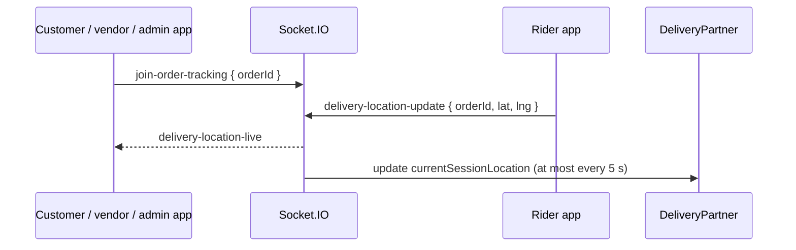

# Order Tracking and Realtime

This page covers how order data reaches clients: the read endpoints and their
per-role scoping, and the Socket.IO events that are emitted alongside status
changes and rider live location. Push and email behavior is in
[Notification Flow](../02-platform/notification-flow.md#7-order-notifications);
status rules are in [Order Lifecycle](./order-lifecycle.md).

Paths are relative to `src/app/`. The main files are
`modules/Order/order.service.ts`, `lib/Socket/` and `lib/Socket/orderSocket.ts`.
Statements come from the code unless marked **Inferred**. In the Order endpoints,
`:orderId` is the display id (`ORD-…`), not the Mongo `_id`.

---

## Reading orders

| Endpoint | Roles at the route | Behavior |
| --- | --- | --- |
| `GET /api/v1/orders` | `CUSTOMER`, `VENDOR`, `SUB_VENDOR`, `DELIVERY_PARTNER`, `FLEET_MANAGER`, `ADMIN`, `SUPER_ADMIN` | Paginated list, scoped by role (below) |
| `GET /api/v1/orders/:orderId` | `CUSTOMER`, `VENDOR`, `SUB_VENDOR`, `DELIVERY_PARTNER`, `ADMIN`, `SUPER_ADMIN` | One order, same scoping. `FLEET_MANAGER` is not allowed at the route, although the service has a branch for it |
| `GET /api/v1/orders/delivery-partner-dispatch-order` (alias `/delivery-partner/dispatch-order`) | `DELIVERY_PARTNER` | Open offers for the rider; see [Delivery Dispatch](./delivery-dispatch.md#rider-response) |
| `GET /api/v1/orders/delivery-partner/current-order` | `DELIVERY_PARTNER` | The rider's active order, with customer and vendor details |
| `GET /api/v1/orders/:orderId/download-invoice-pdf` | `CUSTOMER`, `VENDOR`, `SUB_VENDOR`, `ADMIN`, `SUPER_ADMIN` | Streams the Pasta Digital invoice PDF |
| `POST /api/v1/orders/reorder/:orderId` | `CUSTOMER` | Re-adds the items of an own order to the cart |

The list and single-order calls both need an `APPROVED` profile
(`NOT_APPROVED_TO_VIEW_ORDERS` / `NOT_APPROVED_TO_VIEW_ORDER`).

### Role scoping

| Role | Sees orders where |
| --- | --- |
| `CUSTOMER` | `customerId` is the caller |
| `VENDOR`, `SUB_VENDOR` | `vendorId` is the caller's own profile. A parent vendor does **not** see its branches' orders |
| `DELIVERY_PARTNER` | `deliveryPartnerId` is the caller |
| `FLEET_MANAGER` | `deliveryPartnerId` is one of the riders the manager currently manages (`currentFleetManagerId`) (list only) |
| `ADMIN`, `SUPER_ADMIN` | Unrestricted by this filter; no permission action is required on these routes |

### The list query (`getAllOrders`)

- Filtering, search, sort, pagination and field selection go through
  `QueryBuilder`. The default sort is `-createdAt`. `OrderSearchableFields` are
  `orderId`, `customerId.name.firstName`, `customerId.name.lastName`, and the
  delivery and pickup city and country. `customerId` is a reference to another
  collection, so **Inferred:** the two customer-name paths do not exist on the
  `Order` document and cannot match; only the other fields are effective search
  targets.
- `orderStatus` accepts a comma-separated list and `excludeStatus` another;
  values are upper-cased and anything that is not an `ORDER_STATUS` key is dropped
  silently.
- The role filter is applied first and cannot be overridden by a query
  parameter. `isDeleted: false` is **not** part of the list's base filter, so a
  caller can pass `isDeleted` as an ordinary filter key.
- `pickup.code` and `deliveryOtp.code` are `select: false`. Through `GET /orders`
  the `QueryBuilder` refuses to select, filter or sort on them for every role
  except `CUSTOMER` (`allowRestrictedFields`).

### The single order

- `GET /orders/:orderId` adds `isDeleted: false` and the same role filter, and
  for a `CUSTOMER` also selects `+pickup.code +deliveryOtp.code`, so the customer
  can show the pickup code and the delivery OTP in the app. Other roles never
  receive either code from this endpoint.
- The populated customer, vendor and rider fields are chosen per role by
  `getPopulateOptions`; the response is localized with `formatOrderResponse`
  (items and add-on names to the request language, and a `pickup.pickupSlotEndTime`
  30 minutes after the slot start for pickup orders).

### Reorder

`reorderOrder` requires a `CUSTOMER` and an own, non-deleted order. It calls
`CartServices.addToCart` **once per item**, in order, with the original product,
quantity, variation SKU and add-on SKUs. All cart validations therefore apply
again (product approved and active, store open, vendor agreement, stock,
single-vendor rule), and a failure part-way leaves the earlier items already in
the cart. It returns the last cart result.

### Invoice

`GET /orders/:orderId/download-invoice-pdf` fetches the PDF from Pasta Digital and
returns it inline as `application/pdf`. It works only after the invoice was
synced (`invoiceSync.isSynced` and an invoice number, set by the
`NEW_ORDER_POST_PROCESS` job); otherwise it fails with a plain error. Access:
admins any order, a `CUSTOMER` or `VENDOR` / `SUB_VENDOR` only their own
(`COMMON_ACCESS_DENIED`).

---

## Socket.IO

Every socket authenticates with an access JWT in `handshake.auth.token`. The
middleware verifies the signature only; unlike the HTTP `auth()` it does not
reload the account or check blocked or logged-out state. On connection each
socket joins its personal room `user_<userId>`
(`lib/Socket/events/order.events.ts`). See
[Notification Flow](../02-platform/notification-flow.md#6-socketio-notification-flow)
for the non-order events (support chat, SOS); see also [Support](../02-platform/support.md)
and [SOS](../02-platform/sos.md).

### Order events

| Event | Emitted to | When | Payload |
| --- | --- | --- | --- |
| `ORDER_STATUS_UPDATED` | `order_<orderId>` and the `user_<userId>` rooms of the customer, vendor and rider that the calling code knows | After nearly every status change (vendor actions, customer cancel, rider accept and status updates, admin assign, dispatch, retry, escalation, pickup verification, auto-accept, auto-ready, auto no-show). **Not** after the dispatch-expiry cron | `{ orderId, orderStatus, order, timestamp }` |
| `DELIVERY_OTP_GENERATED` | `user_<customer>` | Rider sets `PICKED_UP` | `{ orderId, otp, generatedAt }` |
| `DELIVERY_EXCEPTION_UPDATED` | `DELIVERY_EXCEPTION_ADMINS` (admins that joined `join-sos-monitoring`) | A rider SOS, OTP lock, verification report, receipt request or answer, replacement, manual completion or fault cancel on an order | `{ orderId, orderStatus, event, exceptionType?, exceptionStatus?, timestamp }` (status only, no names, notes or codes); see [Delivery Exceptions and Verification](./delivery-exceptions.md) |
| `DELIVERY_RECEIPT_CONFIRMATION_REQUESTED` | `user_<customer>` | An admin asks the customer to confirm receipt | `{ orderId, timestamp }` |
| `ORDER_ACCEPTED_BY_PARTNER` | `user_<vendor>` | Rider accepts an offer, or an admin assigns a rider | `{ orderId, partnerName }` |
| `REMOVE_ORDER_POPUP` | `user_<rider>` and `partner_pool_<poolId>` | A rider answers or hits an expired offer; the expiry cron | `{ orderId }` |
| `ORDER_DISPATCH_EXPIRED` | `user_<vendor>` | The offer window expired (cron) | `{ orderId, message }` |
| `vendor-store-status-updated` | `vendor-store-status:<userId>` and `vendor-store-status-customers` | Store toggled or cron changed the state | See [Vendors and Branches](../04-vendors/vendors-and-branches.md#store-openclose-and-timezone) |

Details that matter when consuming these:

- **`ORDER_STATUS_UPDATED` carries the whole order document** as the emitting
  code loaded it, so its content varies by path: populated customer, vendor or
  rider fields differ, and `pickup.code` is present on the paths that select it
  (vendor status update, auto-accept, auto-ready, pickup verification). The
  `deliveryOtp.code` is not selected on any emit path. The same payload goes to
  the customer, vendor and rider rooms.
- **Some events use rooms that nobody joins.** No server code joins
  `order_<orderId>` or `partner_pool_<id>`, so events sent only there reach no
  client; `order_pool_<orderId>` can be joined with `join-order-pool` but nothing
  is emitted to it. The customer, vendor and rider receive the status event
  through their `user_` rooms.
- **Rider offers are pushes, not socket events.** The socket only *removes* the
  popup.
- **The OTP is sent in the clear** over the socket, in the push text and in the
  email; the pickup code is sent in the push text and email.
- Emits are wrapped in `try/catch` and logged on failure. They happen after the
  database write, so a missed event does not roll anything back (**Inferred:**
  clients should treat the REST endpoints as the source of truth after a
  reconnect).

---

## Rider live location

Two paths update a rider's position:

| Path | Details |
| --- | --- |
| `delivery-location-update` (socket) | `DELIVERY_PARTNER` only. Payload `{ orderId, latitude, longitude, geoAccuracy? }`. Silently ignored if the coordinates are out of range or `geoAccuracy` is above 100. Otherwise it is broadcast to the room named by the raw `orderId` as `delivery-location-live` (`{ orderId, latitude, longitude, geoAccuracy, time }`), and the database position is updated at most once every 5 seconds per rider (a per-process in-memory throttle) |
| `PATCH /delivery-partners/:deliveryPartnerId/liveLocation` (HTTP) | Same validation for accuracy (rejected with `GEO_ACCURACY_EXCEEDED`); writes `currentSessionLocation` immediately |

Customers and others follow the rider by joining the tracking room:

Rules and caveats:

- `join-order-tracking` accepts the roles `CUSTOMER`, `ADMIN`, `SUPER_ADMIN`,
  `DELIVERY_PARTNER`, `VENDOR` and `SUB_VENDOR`, and joins a room named by the
  raw `orderId`. **There is no ownership check**: any authenticated user of those
  roles can join the room of any order id.
- `delivery-location-update` does not check that the order is assigned to the
  sending rider or that it is in a delivering status. **Inferred:** a rider
  could publish positions to any order room.
- The tracking room (`<orderId>`) is a different room from the status room
  (`order_<orderId>`).
- The 5-second database throttle is process memory, so it is per server
  instance. The dispatch search reads the stored position, not the socket
  stream.

---

## Related documentation

- [Order Lifecycle](./order-lifecycle.md): statuses, transitions, and who may act.
- [Delivery Dispatch and Riders](./delivery-dispatch.md): rider offers, availability and live location for dispatch.
- [Order Automation](./order-automation.md): the cron jobs that emit some of these events.
- [Notification Flow](../02-platform/notification-flow.md): push and email channels for orders, and the other socket events.
- [Vendors and Branches](../04-vendors/vendors-and-branches.md): vendor scoping and store-status events.
- [Authentication](../03-identity-access/authentication.md): the access token the socket handshake uses.
