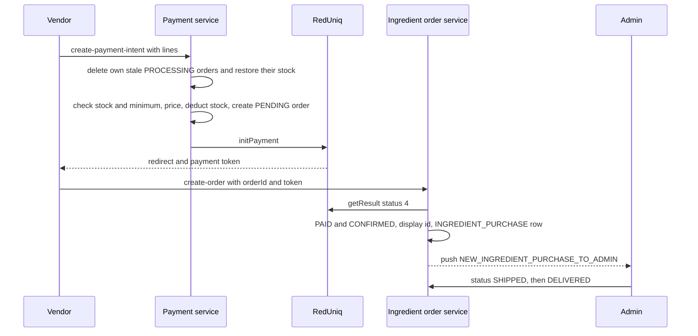

# Ingredient Purchasing

Besides selling food to customers, a vendor or branch can **buy ingredients from the platform**.
Admins maintain an ingredient catalog, vendors order from it and pay through the payment
gateway, and an admin marks the order shipped and delivered. It is separate from customer
orders: it has its own models, statuses and routes, and it does not touch the `Order`
collection.

Paths are relative to `src/app/`; the modules are `modules/Ingredients/` (catalog) and
`modules/Ingredient-Order/` (orders). The payment step lives in `modules/Payment/` and the
abandoned-stock job in `cron/ingredientOrder.crone.ts`. Statements come from the committed
code, read but not run, unless marked **Inferred** or **Unresolved**. Uncommitted
working-tree features are not described.

---

## At a glance

| Question | Answer |
| --- | --- |
| Models | `Ingredient` (catalog) and `IngredientOrder` (purchase). |
| Who manages the catalog | `ADMIN` with `CAN_MANAGE_INGREDIENTS`, and `SUPER_ADMIN`. |
| Who buys | `VENDOR` and `SUB_VENDOR`, each for its own row. |
| Who ships | `ADMIN` and `SUPER_ADMIN` (no permission action). |
| Payment | The same RedUniq gateway, hosted page, no webhook. See [Payments](../10-payments/payments.md#ingredient-purchases). |
| Order statuses | `PENDING`, `CONFIRMED`, `SHIPPED`, `DELIVERED`. Payment status: `PROCESSING`, `PAID`. |
| Stock | Reserved (deducted) when the payment intent is created, returned by a cron if the payment is abandoned. |
| Notifications | Admins are pushed when an order is confirmed. Nothing is sent for shipping or delivery. |
| Audit | Only `INGREDIENT_PERMANENTLY_DELETED`. |

---

## The catalog (`Ingredient`)

| Field | Notes |
| --- | --- |
| `name`, `category`, `description`, `image` | `category` is stored upper-cased. `image` is a **URL string**, required at creation (the file is uploaded separately, **Inferred** through `POST /uploads`). |
| `sku` | Generated on creation as `ING-<first 3 letters of the category>-<4 characters>`, retried until unique. Unique and upper-cased. |
| `price`, `unit` | `unit` is one of `kg`, `g`, `litre`, `ml`, `piece`, `packet`, `box`. |
| `tax` | A reference to a `Tax`, required. At create and update it must exist, be active and not deleted. |
| `stock`, `totalAddedQuantity` | `totalAddedQuantity` starts equal to the initial `stock`; an update of `stock` adds the difference to it (also when the stock is lowered). |
| `minOrder` | Minimum quantity per line, default 1. |
| `bulkDiscount` | A list of `{ minQty, discountPrice }`. |
| `lowStockAlert`, `status` | `lowStockAlert` (default 5) and `status` (`available` or `out-of-stock`) are accepted on create and editable by an admin on update, but **no code reads them**: the purchase flow never checks `status`, nothing compares stock with `lowStockAlert`, and stock reaching zero does not change `status`. |
| `shelfLifeDays`, `isDeleted` | `isDeleted` is the soft-delete flag. |

### Catalog routes (`/api/v1/ingredients`)

| Endpoint | Roles | Behavior |
| --- | --- | --- |
| `POST /create-ingredient` | `ADMIN`, `SUPER_ADMIN` with `CAN_MANAGE_INGREDIENTS` | Creates with a generated SKU. |
| `PATCH /update-ingredient/:ingredientId` | same | Partial update; a new image deletes the old file from storage in the background. |
| `GET /` | `ADMIN`, `SUPER_ADMIN`, `VENDOR`, `SUB_VENDOR` | Non-deleted ingredients, with `tax.taxRate` populated; search on `name`, `category`, `sku`; filter, sort, pagination, fields. Vendors see out-of-stock items too. |
| `GET /:sku` | same | One ingredient by SKU (not a deleted one). |
| `DELETE /soft-delete/:ingredientId` | `ADMIN`, `SUPER_ADMIN` with the permission | Sets `isDeleted`. |
| `DELETE /permanent-delete/:ingredientId` | same | Requires a prior soft delete, removes the row and its image, and writes the `INGREDIENT_PERMANENTLY_DELETED` log. |

The permission array on the read routes matters only for `ADMIN`; vendors are not checked
against it (see [Authorization](../03-identity-access/authorization.md#admin-permissions)).

---

## The purchase flow

### 1. Payment intent (`POST /payment/ingredient/create-payment-intent`)

`VENDOR`, `SUB_VENDOR`. Body: `orderDetails` (lines of `ingredientId` and `quantity`),
`paymentMethod`, optional `deliveryAddress`. In one transaction:

1. The vendor's own earlier `PROCESSING`/`PENDING` ingredient orders are **deleted and their stock restored**, so a vendor has only one order in progress.
2. For each line the ingredient must exist and not be deleted. The quantity must not exceed `stock` (`STOCK_NOT_AVAILABLE`) and must reach `minOrder` (`MINIMUM_ORDER_QUANTITY_REQUIRED`).
3. **Price:** the unit price is `price`, or the `discountPrice` of the bulk tier with the highest `minQty` the quantity reaches. **Tax:** the ingredient's tax rate is applied to the discounted amount (the tax is not re-checked for being active at this point). The line stock is deducted and saved.
4. **Delivery charge:** by the vendor's `businessLocation.city`: `lisbon` or `lisboa` (case-insensitive) uses the Lisbon charge, everything else the outside-Lisbon charge, from the global settings (defaults 20 and 30 with 23% VAT). See [Platform Settings](../02-platform/platform-settings.md#ingredient-order-settings).
5. `grandTotal` = discounted items + item tax + delivery charge incl. VAT. The order is created `PENDING` / `PROCESSING` with the address (the vendor's business location when none is sent).
6. `initPayment` is called for the grand total with the order id as reference and the vendor frontend's success and failure URLs. The gateway token is stored as the order's `transactionId` and `{ redirectUrl, paymentToken }` is returned. No notification URL is sent, so **there is no webhook backup**.

### 2. Confirmation (`POST /ingredients-order/create-order`)

`VENDOR`, `SUB_VENDOR`; body `orderId` (the Mongo id returned by the intent) and `paymentToken`.

- The order must belong to the caller (`401 COMMON_ACCESS_DENIED` otherwise) and not already be `PAID` (`ORDER_ALREADY_PAID_CONFIRMED`).
- RedUniq `getResult` must report transaction status `'4'` (`PAYMENT_VERIFICATION_FAILED`).
- In one transaction: `paymentStatus: PAID`, `orderStatus: CONFIRMED`, `transactionId` = the gateway transaction id, `orderId` = `ING-ORD-<10 characters>`, and an `INGREDIENT_PURCHASE` `Transaction` (status `SUCCESS`, amount `grandTotal`). **Any** error inside the transaction is returned as a generic `400 COMMON_OPERATION_FAILED`.
- After the commit, every `ADMIN` and `SUPER_ADMIN` with an FCM token gets `NEW_INGREDIENT_PURCHASE_TO_ADMIN` (vendor name, item count, order id).

### 3. Abandoned payments

Every 5 minutes `releaseAbandonedIngredientStockCron` finds orders that are still
`PROCESSING` and `PENDING` and older than 15 minutes, **deletes** them and returns their
stock (soft-deleted ones are simply removed). A confirmation arriving after that gets `NOT_FOUND`.

### 4. Shipping (`PATCH /ingredients-order/:orderId/status`)

`ADMIN`, `SUPER_ADMIN` (no permission action). Body `status`: `SHIPPED` or `DELIVERED`;
`:orderId` is the display id (`ING-ORD-...`).

- Only a `PAID` order can be updated (`CANNOT_UPDATE_UNPAID_ORDER`), and the same status twice is refused (`ORDER_ALREADY_MARKED`).
- `DELIVERED` requires `SHIPPED` first; `SHIPPED` after `DELIVERED` is refused.
- The caller is stored as `adminId`, and `statusHistory.shippedAt` or `deliveredAt` is set.

No notification or activity log is produced by a status update.

### Reading orders

| Endpoint | Roles | Behavior |
| --- | --- | --- |
| `GET /ingredients-order/vendor/my-orders` | `VENDOR`, `SUB_VENDOR` | The caller's orders that are `PAID`, not `PENDING` and have a display id. Search on `orderId`, `orderStatus`; filter, sort, pagination, fields. Ingredient details are populated. |
| `GET /ingredients-order/admin/all` | `ADMIN`, `SUPER_ADMIN` | Every such order, with the full vendor document populated. |
| `GET /ingredients-order/:orderId` | `ADMIN`, `SUPER_ADMIN`, `VENDOR`, `SUB_VENDOR` | By display id, `PAID` only. A vendor is restricted to its own. Returns the order plus a three-step timeline (`CONFIRMED`, `SHIPPED`, `DELIVERED`). The vendor document is populated in full. |

Unpaid orders never appear in any list. There is **no refund or cancel route** for an
ingredient order.

---

## Mismatches and inconsistencies

1. **A delivery charge of 0 is ignored.** The code uses `deliveryChargeInsideLisbon || 20` and `deliveryChargeOutsideLisbon || 30`, so configuring `0` still charges 20 or 30. The VAT rates use `??`, so a VAT of 0 is honored.
2. **Stock is deducted at intent time**, not at payment, so a vendor that abandons the payment blocks stock for up to about 15 to 20 minutes (the 15-minute threshold plus the 5-minute cron) and a second intent by the same vendor frees its first reservation.
3. **Status fields without effect.** `Ingredient.status` and `lowStockAlert` can be set by an admin but are never read, so a catalog item marked `out-of-stock` can still be ordered while stock remains.
4. **No low-stock or shipping notification.** Only the confirmation notifies admins; vendors are told nothing about shipping or delivery.
5. **Replays and token binding.** Confirmation does not compare the submitted token with the token stored at intent time nor the gateway amount with `grandTotal`; see [Payments](../10-payments/payments.md#ingredient-purchases). A reused gateway transaction is stopped only by the unique `Transaction.transactionId`, and the failure surfaces as the generic `400`.
6. **Order confirmation endpoint is `create-order`** although it confirms an existing order, and confirmation cannot be retried after the cron deletes the abandoned order.
7. **Whole vendor documents in responses.** The admin list and the single read populate `vendorId` without a field selection.
8. **Catalog audit is thin.** Only permanent deletion is logged; creation and updates, including price and stock changes, are not.

---

## Unverified or inferred behavior

- Nothing on this page was executed. The flow is read from the two services, the payment service and the cron.
- How the client uploads the ingredient image, and how a vendor reaches the confirmation after the gateway redirect, is not known from the backend.

---

## Related documentation

- [Payments](../10-payments/payments.md#ingredient-purchases): the gateway side of the intent and confirmation.
- [Payouts, Wallets and Transactions](../10-payments/payouts-wallets-transactions.md): the `INGREDIENT_PURCHASE` ledger row.
- [Platform Settings](../02-platform/platform-settings.md#ingredient-order-settings): delivery charges and VAT for ingredient orders, and the tax configuration.
- [Notification Triggers](../06-notifications/notification-triggers.md): the admin push for a new ingredient purchase.
- [Vendors and Branches](./vendors-and-branches.md): the vendor and branch rows that buy.
