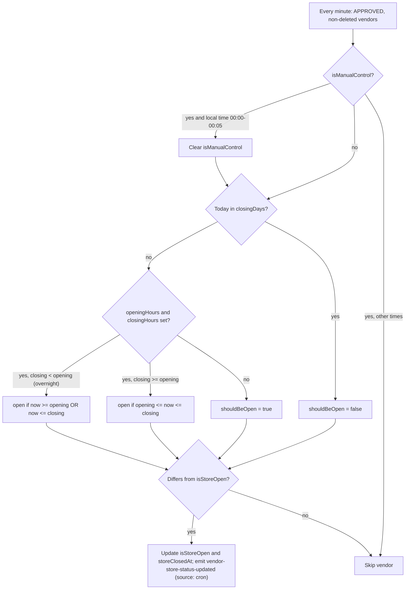
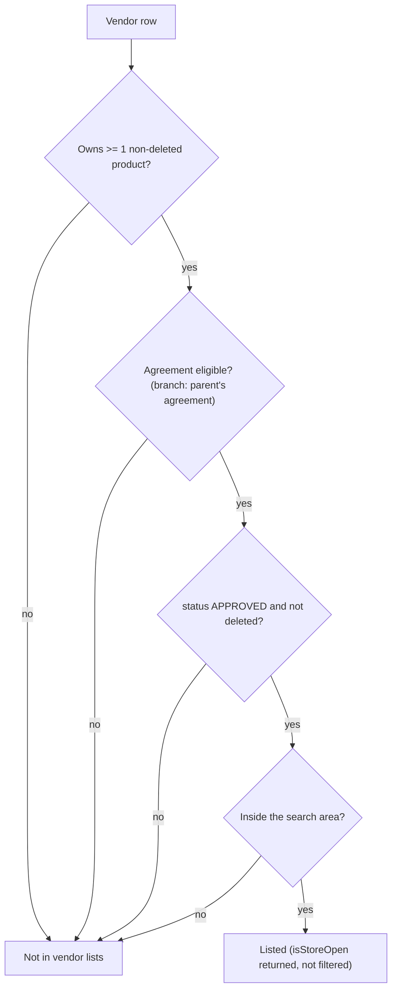

# Vendors and Branches

This page describes vendors and their branches exactly as implemented, including
the places where the code is inconsistent (marked **Inconsistency** and
collected in [Known implementation inconsistencies](#known-implementation-inconsistencies)).
Source paths are relative to the backend's `src/app/` directory; the main
module is `modules/Vendor/`.

Account creation, submission, approval, blocking and deletion are **not**
repeated here. They are covered in [User Lifecycle](../03-identity-access/user-lifecycle.md);
this page only states what is specific to vendors.

---

## Vendor vs SUB_VENDOR

Both roles are stored in the **same `Vendor` collection**, each with its own
`AuthUser` login. A branch is a `Vendor` document with `role: 'SUB_VENDOR'` and a
`parentVendorId` pointing at the parent's `_id`
(see [Data Model](../02-platform/data-model.md)).

| | Parent `VENDOR` | Branch `SUB_VENDOR` |
| --- | --- | --- |
| Collection / login | `Vendor` + own `AuthUser` | `Vendor` + own `AuthUser` |
| `userId` prefix | `V-` | `SV-` |
| `parentVendorId` | `null` | the parent's `_id` |
| Created by | Self-registration, or onboarding by an admin | Onboarding only, by its parent `VENDOR` or an admin (with the parent's `userId`) |
| Own `Agreement` row | Yes (`INITIAL_VENDOR_AGREEMENT`) | **No**; resolved through the parent |
| Agreement gate on its own requests | Yes, when `APPROVED` | Yes, through the parent's agreement (see [Agreement and access rules](#agreement-and-access-rules)) |
| Own status / approval | Yes | Yes, independent of the parent's status |
| Can onboard branches | Yes | No |
| Can copy products to branches | Yes | No |
| Owns its products, categories, add-on groups, orders, ratings, wallet | Yes | Yes, its own |
| Brand fields (`businessName`, `businessType`) | Editable; changes are copied to branches | Not editable (`SUB_VENDOR_CANNOT_CHANGE_BRAND_FIELDS`, even for an admin) |

The two are otherwise separate operating units: a parent does **not** see its
branches' orders, and each row has its own opening hours, location, store
status and catalog. See [Order Lifecycle](../03-orders/order-lifecycle.md) for
order ownership.

---

## Vendor profile and key fields

Defined in `vendor.model.ts` / `vendor.interface.ts`.

| Group | Fields | Notes |
| --- | --- | --- |
| Identity | `userId` (unique), `email` (unique), `role`, `parentVendorId`, `registeredBy { id, model }` | `registeredBy.model` is `Admin` or `Vendor`. |
| Status / workflow | `status`, `isDeleted`, `isUpdateLocked`, `correctionRequest`, `submittedForApprovalAt`, `approvedBy` / `rejectedBy` / `blockedBy`, `approvedOrRejectedOrBlockedAt`, `remarks` | Lifecycle in [User Lifecycle](../03-identity-access/user-lifecycle.md). `status` is mirrored on `AuthUser`. |
| Person | `name`, `contactNumber`, `profilePhoto`, `address` | `profilePhoto` mirrors `documents.myPhoto`. |
| Brand | `businessDetails.businessName` (brand / trading name), `companyLegalName` (registered name), `branchName` (per-location nickname), `businessType` (ref `BusinessCategory`), `restaurantCuisineType[]` (cuisine slugs), `isHalal`, `NIF` | `branchName` is never inherited. |
| Branch counters | `businessDetails.totalBranches` (default `1`), `activeBranches` (default `0`) | See [Branch lifecycle](#branch-lifecycle-and-cloning). |
| Schedule | `openingHours`, `closingHours` (`HH:mm`), `closingDays[]` (weekday names), `timezone` (IANA, default `Europe/Lisbon`) | See [Store open/close](#store-openclose-and-timezone). |
| Store state | `isStoreOpen` (default `true`), `isManualControl` (default `false`), `storeClosedAt` | |
| Operations | `preparationTimeMinutes` (default `15`), `deliveryZoneId` | `deliveryZoneId` is stored but zones are not used for dispatch or pricing. |
| Location | `businessLocation` (address + `latitude` / `longitude`), `currentSessionLocation` (GeoJSON point, 2dsphere index) | See [Inconsistency 8](#known-implementation-inconsistencies). |
| Money | `bankDetails { accountHolderName, iban }`, `posPaymentDecision` / `posPaymentOption` / `posPaymentDecidedAt` | POS fields relate to the agreement flow. |
| Documents | `documents { myPhoto, businessLicenseDoc, taxDoc, idProofFront, idProofBack, storePhoto, menuUpload, agoserisHaccpCertificate, ibanProof }` (each an array of URLs) | Managed through the document-image routes. |

`Vendor.rating` is **not persisted**. Responses derive it from the vendor's
products: the review-count-weighted average of product ratings
(`computeVendorRatingsFromProducts` in `vendor.utils.ts`).

Every `save` or `findOneAndUpdate` on a `Vendor` triggers a Meilisearch resync
of that vendor's products (`post` hooks in `vendor.model.ts`). `updateOne` does
not (the store cron uses it).

---

## Branch lifecycle and cloning

### Creation and counters

A branch is created through onboarding (see
[User Lifecycle](../03-identity-access/user-lifecycle.md)). Vendor-specific
behavior in `registerOnboardingUser` / `cloneSubVendorParentData`
(`modules/Auth/auth.service.ts`):

- The parent is the calling `VENDOR`, or, for an admin, the `VENDOR` whose
  `userId` is supplied as `parentVendorId` (not deleted; must exist).
- The branch starts `PENDING` with its own `AuthUser`, and goes through its own
  submit → approve flow. The parent's approval status is **not** consulted.
- After the branch is created, the parent's counters are recomputed in the same
  transaction (`recomputeParentBranchCount`).

`recomputeParentBranchCount` (also run on branch soft delete and permanent
delete):

| Counter | Rule |
| --- | --- |
| `activeBranches` | Set to the number of non-deleted `SUB_VENDOR` rows under the parent (any status: `PENDING`, `BLOCKED`, etc. all count) |
| `totalBranches` | `$max(existing, activeBranches + 1)`: raised when needed, never lowered |

### What a new branch inherits

Cloned **once**, at onboarding, from the parent (a copy, not a live link):

| Cloned | Details |
| --- | --- |
| `businessDetails` | `companyLegalName`, `businessName`, `businessType`, `restaurantCuisineType`, `isHalal`, `NIF`, `openingHours`, `closingHours`, `closingDays`, `timezone`, `deliveryZoneId`, `preparationTimeMinutes` |
| `bankDetails` | `accountHolderName`, `iban` |
| `documents` | Deep copy of every document array (same file URLs) |

**Not** cloned: `name`, `contactNumber`, `address`, `businessLocation`,
`currentSessionLocation`, `branchName`, `profilePhoto`, and the store-state and
counter fields (they take their defaults).

After creation only two parent fields stay linked:
when a `VENDOR` updates `businessName` or `businessType`, `vendorUpdate`
copies the new value to every non-deleted branch (see
[Profile updates](#profile-updates-the-lock-and-correction-requests)). All other
cloned values (hours, bank details, documents) diverge independently.

### Deletion

Soft delete and permanent delete of a branch recompute the parent's counters.
Deleting or blocking a **parent** does **not** cascade to its branches (see
[Inconsistency 2](#known-implementation-inconsistencies)).

---

## Parent/branch permissions

| Action | Route | Who may do it |
| --- | --- | --- |
| View a vendor profile | `GET /vendors/:vendorId` | The vendor itself; a parent `VENDOR` for its own branch; `ADMIN` / `SUPER_ADMIN`. A branch **cannot** view its parent or a sibling this way. Non-staff never see deleted rows. |
| List a brand's branches | `GET /vendors/:vendorId/branches` | Staff; the vendor itself; the parent (brand owner); any `SUB_VENDOR` of the same parent (so siblings can list each other). Returns branches only, not the parent, each with `coveredByAgreement`. |
| List all vendors | `GET /vendors` | `ADMIN` / `SUPER_ADMIN` (caller must be `APPROVED`) |
| Update profile | `PATCH /vendors/:vendorId` | Owner; a parent `VENDOR` for its own branch; staff |
| Upload / delete a document image | `PATCH` / `DELETE /vendors/:vendorId/docImage` | Same as profile update |
| Toggle store open/close | `PATCH /vendors/toggle/store-open-close` | The calling `VENDOR` / `SUB_VENDOR` for **itself** only |
| Onboard a branch, submit it for approval | Auth module | Parent `VENDOR` (own branches) or admin; a branch may submit itself |
| Create / edit / delete a product | Product module | The owning row (and admins); a parent cannot edit a branch's products |
| List a branch's products | `GET /products?vendorId=…` | A parent `VENDOR` may list its branches' products |
| Copy products to branches | `POST /products/copy-to-sub-vendors` | `VENDOR` (own branches) or admin |
| Orders | Order module | Only the row that owns them (see [Order Lifecycle](../03-orders/order-lifecycle.md)) |

Notes:

- The vendor routes use `auth('VENDOR', 'SUB_VENDOR', 'SUPER_ADMIN', 'ADMIN')`
  with **no permission action**, so any `ADMIN` (not only one with a specific
  permission) can edit vendors. This follows the route-level rules in
  [Authorization](../03-identity-access/authorization.md).
- Ownership is checked in the service (`isParentOfBranch`, `isOwner`, `isStaff`),
  not only by role.
- Only a `VENDOR` counts as a parent; a `SUB_VENDOR` cannot act on another
  branch's profile.

---

## Profile updates, the lock, and correction requests

How `isUpdateLocked` is set and cleared across the account lifecycle (set on
submit, cleared only on rejection, **never on approval**) is documented in
[User Lifecycle](../03-identity-access/user-lifecycle.md#isupdatelocked-through-the-lifecycle).
This section covers what the lock does to vendor edits.

### Profile update (`vendorUpdate`)

The body is validated by a strict Zod schema; only these keys are accepted:
`name`, `contactNumber`, `address`, `businessDetails` (a subset), `businessLocation`,
`bankDetails`, and `isUpdateLocked` (removed by the controller unless the caller
is `ADMIN` / `SUPER_ADMIN`). `status`, `documents`, `email`, `role` and
`parentVendorId` cannot be changed through this route.

| Step | Rule |
| --- | --- |
| Authorization | Owner, parent of the branch, or staff (`COMMON_ACCESS_DENIED` otherwise) |
| Lock | If `isUpdateLocked` and the caller is not staff: allowed only when a correction request is `PENDING` **and** the profile is `SUBMITTED` or `APPROVED`, and every changed field is inside the granted set (`CORRECTION_FIELD_OUTSIDE_GRANT`); otherwise `VENDOR_UPDATE_LOCKED_CONTACT_SUPPORT` |
| Brand fields on a branch | `businessType` or `businessName` in the payload for a `SUB_VENDOR` → `SUB_VENDOR_CANNOT_CHANGE_BRAND_FIELDS` (403), for everyone |
| Business type | The slug must exist (`INVALID_BUSINESS_TYPE`); for `restaurant`, cuisine types are required and must exist |
| Location | If `businessLocation` has numeric `longitude` and `latitude`, `currentSessionLocation` is set to that point. If the coordinates changed and no `timezone` was sent, the timezone is derived from the coordinates through the Google Maps Time Zone API; on failure the timezone is left unchanged, silently |
| Write | Flattened `$set` with `runValidators` |
| Cascade | For a parent `VENDOR`, a changed `businessType` / `businessName` is written to every non-deleted `SUB_VENDOR` (one update per branch, after the parent write, not in a transaction) |

Schedule validation: `HH:mm` 24-hour times; `openingHours` and `closingHours`
must be sent together and cannot be equal; `closingDays` are full weekday names;
`timezone` must be a valid IANA identifier. A closing time earlier than the
opening time is allowed (an overnight schedule).

**Inconsistency (cuisine validation):** the cuisine checks are inside the
`if (businessType)` branch, so a payload that sends only
`restaurantCuisineType` is not validated against the cuisine list.

### Document images

`VENDOR_SELF_EDITABLE_DOC_IMAGE_TITLES` = `myPhoto`, `storePhoto`, `menuUpload`.
While the profile is locked, a non-staff owner may upload or delete one of these
only when the status is `SUBMITTED` or `APPROVED`, or one that an active
correction request lists in `docTitles`. Other rules:

- At most **3** images per document title (`MAXIMUM_IMAGES_ALLOWED_FOR_DOCUMENT`).
- `myPhoto` keeps a single image (the latest) and also sets `profilePhoto`;
  previous photos are deleted from storage.
- Deleting an image removes the file from storage and, for `myPhoto`, clears
  `profilePhoto`; deletion writes an activity log entry.

### Correction requests (vendor specifics)

An admin can open a scoped, temporary grant on a locked `VENDOR` or `SUB_VENDOR`
(`requestCorrections` / `confirmCorrections`, `modules/Auth/auth.service.ts`).

| Aspect | Rule |
| --- | --- |
| When | Profile `status` is `SUBMITTED` or `APPROVED`; only one `PENDING` request at a time |
| Grantable fields | Top-level `name`, `contactNumber`, `address`, `businessDetails`, `businessLocation`, `bankDetails` (a dotted field is checked by its first segment) |
| Grantable documents | Any of the nine document titles |
| Not grantable | `status`, `documents` (as a field), `approvedBy`, … |
| Effect | Sets `correctionRequest { status: 'PENDING', fields, docTitles, remarks, requestedBy, requestedAt }` and `isUpdateLocked: true`; notifies the owner (push and email) |
| Completion | The **owner** calls confirm; the request becomes `FULFILLED` and the profile re-locks; admins are notified |

Because approval never clears the lock, an `APPROVED` vendor can change
business hours, location, bank details and similar fields only through a
correction grant or an admin. Store open/close toggling and the three
self-editable document titles are not affected.

---

## Store open/close and timezone

### State and manual toggle

| Field | Meaning |
| --- | --- |
| `isStoreOpen` | The current open/closed flag (default `true`) |
| `isManualControl` | `true` after a manual toggle; makes the cron leave the store alone |
| `storeClosedAt` | Set when the store closes (`null` when open) |
| `timezone` | IANA zone used for the schedule (default `Europe/Lisbon`) |

`PATCH /vendors/toggle/store-open-close` (`auth('VENDOR', 'SUB_VENDOR')`,
`toggleVendorStoreOpenClose`):

- Requires the caller's status to be `APPROVED`.
- Flips `isStoreOpen`, sets `isManualControl: true`, and sets or clears
  `storeClosedAt`.
- Is **not** blocked by the update lock. It is a non-`GET` request, so the
  agreement gate applies: a vendor with an unsigned or outdated agreement cannot
  toggle the store.
- Saves through the document (`save`, so it also triggers the Meilisearch
  product resync) and emits `vendor-store-status-updated` with `source: 'toggle'`.

### The cron (`cron/vendorStore.crone.ts`)

`vendorStoreOpenCloseCron` is the first step of the every-minute job in
`cron/index.ts`. Verified behavior:

- It loads every vendor with `status: 'APPROVED'` and `isDeleted: false`
  (both `VENDOR` and `SUB_VENDOR`), and evaluates each in its own
  `businessDetails.timezone`.
- **Manual-control expiry:** if `isManualControl` is `true` and the vendor's
  **local time** is between `00:00` and `00:05` inclusive (compared as `HH:mm`
  strings), the cron sets `isManualControl` to `false`. There is no duration
  and no other expiry, so a manual toggle lasts until the next local midnight
  window, even during service hours. Because the cron runs every minute, the
  reset happens on the first tick that falls inside the window (normally at
  `00:00`; a toggle made inside the window is cleared within a minute), and the
  same tick then recomputes the schedule.
- While `isManualControl` is `true` (outside that window) the vendor is skipped.

Details of the schedule evaluation:

- Both boundaries are inclusive (`>=` opening, `<=` closing).
- If `closingDays` contains the local weekday, the store is closed for that whole
  local calendar day. For an overnight schedule this also closes the after-midnight
  part that belongs to the previous day's opening.
- If either hour is empty (and it is not a closing day) the store is **open**.
- The cron writes with `updateOne` (no Mongoose hooks) and sets `storeClosedAt`
  to `null` when opening.
- The vendor loop is inside a single `try`, so an exception (for example an
  invalid `timezone` string, which makes `Intl.DateTimeFormat` throw) stops the
  remaining vendors for that tick. Timezones are validated on update, and the
  default is `Europe/Lisbon`.
- Vendors that are not `APPROVED` are never touched: a vendor that leaves
  `APPROVED` keeps its last `isStoreOpen` value.

### Who reads store state

| Consumer | Behavior |
| --- | --- |
| Cart add (`cart.service.ts`) | Rejects with `STORE_CLOSED_OR_UNAPPROVED` when `isStoreOpen === false` or the vendor row is missing or deleted. The key name suggests an approval check, but only the open flag and existence are checked |
| Checkout (`checkout.service.ts`) | Rejects with `VENDOR_CLOSED` when the vendor is missing or `isStoreOpen` is falsy (deleted rows are not excluded by this lookup) |
| Customer vendor lists | Return `isStoreOpen` but do **not** filter by it |
| Sockets | `vendor-store-status-updated` is sent to the room `vendor-store-status:<userId>` and to the room `vendor-store-status-customers` |

Socket rooms (`lib/Socket/events/shopStatus.events.ts`): every customer socket
joins `vendor-store-status-customers` automatically, so it receives **every**
vendor's update. A customer can also join any vendor's room
(`join-vendor-store-status-room` with the vendor's `userId`); a vendor may join
only its own. Payload: `{ vendorId (userId), isOpen, isManualControl, storeClosedAt, updatedAt, source }`.

---

## Agreement and access rules

The agreement gate itself is described in
[Authorization](../03-identity-access/authorization.md#the-agreement-gate-as-an-authorization-constraint).
The vendor-specific implementation:

- Only `VENDOR` has an agreement row. `getInitialAgreementTypeForRole('SUB_VENDOR')`
  is undefined, so `SUB_VENDOR` submit-for-approval performs no agreement check.
- For requests, `auth.ts` resolves a `SUB_VENDOR` to its parent through
  `AgreementService.resolveAgreementPartyContext` and loads the parent
  (`isDeleted: false`). An `APPROVED` branch is then blocked on order routes
  and all non-`GET` requests when the **parent's** agreement is unsigned or
  outdated (`AGREEMENT_RESIGN_REQUIRED`). If the parent lookup finds nothing (for
  example a soft-deleted parent), the gate is skipped for the branch.
- A `SUB_VENDOR` with no `parentVendorId` has no agreement context, so it is not
  eligible for customer discovery, and cart and checkout treat it as non-compliant.
- "Signed" means a `SIGNED` agreement row with `versionNumber` ≥ the currently
  effective version. If **no version is currently effective**, every party counts
  as compliant.
- `GET /vendors/:vendorId` returns `agreement` (a summary for the vendor) and
  `coveredByAgreement` (the parent's current initial agreement, for a branch, or
  `null`). `GET /vendors/:vendorId/branches` adds `coveredByAgreement` to every
  branch.

| Place | Check |
| --- | --- |
| Cart add and checkout | `AgreementService.isVendorAgreementSigned(vendor)`: the parent's agreement for a branch (`VENDOR_NOT_ACCEPTING_ORDERS`) |
| Customer vendor and product discovery | `resolveCustomerEligibleVendorIds` (`vendor.service.ts`), which adds each branch's parent to the lookup even if the parent is not a candidate |
| Single-vendor customer endpoints | **None** (see below) |

Do not call `isPartyAgreementSigned(vendor._id, …)` for a branch's own id: a
branch has no agreement row of its own.

---

## Customer vendor discovery

| Endpoint | Auth | Location source | Search area |
| --- | --- | --- | --- |
| `GET /vendors/customer` | `CUSTOMER` | The customer's active delivery address (see [Customer Addresses and Location](../03-identity-access/customer-addresses.md)), else the session GPS location; `CUSTOMER_PROFILE_NOT_FOUND_SETUP_FIRST` if no profile | `$near` on the vendor's `currentSessionLocation` within `customerNearestVendorRadiusKm` (global setting); nearest first |
| `GET /vendors/nearby/open` | **None** | `latitude` and `longitude` query parameters (required) | A latitude/longitude **bounding box** around the point on `businessLocation` (radius ÷ 111 km per degree), so it is a square, not a circle |
| `GET /vendors/customer/:vendorId` | `CUSTOMER` | – | – |
| `GET /vendors/nearby/open/:vendorId` | **None** | – | – |

Both list endpoints build the candidate set the same way:

1. Vendors that own at least one non-deleted product (`Product.distinct('vendorId', { isDeleted: false })`).
   Product approval, active status and category visibility are **not** applied
   here.
2. Narrowed to agreement-eligible vendors (`resolveCustomerEligibleVendorIds`).
3. Filtered to `status: 'APPROVED'`, `isDeleted: false`, the location condition,
   and optional filters: business-type slug (`INVALID_BUSINESS_TYPE` if unknown),
   `restaurantCuisineType` slug, `productCategory` (a category id, matched
   against the primary or additional categories of the vendor's products), and
   a search on `businessName`.

Each list item returns `id`, `userId`, `name`, a reduced `businessDetails`
(brand name, business type, cuisines, hours, closing days, `isStoreOpen`),
`businessLocation`, `storePhoto`, the derived `rating`, `currentSessionLocation`,
and `availableCategories` (only active, non-deleted categories that the vendor's
products use).

The single-vendor endpoints look the vendor up by its Mongo `_id` and return
`name`, `userId`, `email`, `contactNumber`, `businessDetails`, `businessLocation`,
`documents.storePhoto`, and the derived `rating`.
**Inconsistency:** the only filter is `isDeleted: false`. Status, agreement
eligibility and distance are not checked, and two of the four routes are
unauthenticated.

The product list endpoints use the same eligibility rule (approved,
non-deleted vendors near the customer, then `resolveCustomerEligibleVendorIds`)
and add product-level conditions, described next.

---

## Vendor–product relationship

Products are owned by a single `Vendor` row through `Product.vendorId`. A branch
has its **own** products, categories and add-on groups.

### Ownership and permissions

- Creating a product (`POST /products/create-product`, `VENDOR` / `SUB_VENDOR`)
  requires the caller to be `APPROVED` (`VENDOR_NOT_APPROVED_TO_ADD_PRODUCTS`).
  The category must belong to the same vendor and be active
  (`CATEGORY_NOT_OWNED_BY_VENDOR`, `CATEGORY_INACTIVE`); add-on groups must too
  (`INVALID_ADDON_GROUPS`).
- Admins create on behalf of a vendor with `POST /products/admin/create-product`
  (the vendor must be `APPROVED`); the product records `approvedBy`.
- **Restaurant vs store stock:** for a `RESTAURANT` vendor, simple stock or
  variation stock greater than zero is rejected and stock is not tracked; other
  business types track stock. Stock is deducted at order acceptance (see
  [Order Lifecycle](../03-orders/order-lifecycle.md)).
- Update, status change, image delete and soft delete are limited to the owning
  row (admins may act on any product). Single-product reads for a vendor are also
  limited to the owning row.
- The vendor product **list** (`GET /products`) returns the caller's own
  products by default; a `VENDOR` may pass `vendorId` for one of its branches to
  list that branch's products. This is read-only: the parent cannot open or edit
  a branch product by id.

### Copy to branches (`POST /products/copy-to-sub-vendors`)

`auth('VENDOR', 'ADMIN', 'SUPER_ADMIN')`: a `SUB_VENDOR` cannot call it. An admin
must supply `sourceVendorId` (a `VENDOR`); a vendor's source is itself.

| Aspect | Implementation |
| --- | --- |
| Targets | The source's own non-deleted `SUB_VENDOR` rows, chosen explicitly or "all"; a target that is not the source's branch fails (`TARGET_VENDOR_NOT_YOUR_BRANCH`). Targets that are not `APPROVED` are **silently skipped** (a run with only unapproved targets returns `copiedCount: 0`) |
| Products | Explicit `productIds` (must be owned by the source) or all of the source's non-deleted products |
| De-duplication | A target that already has a non-deleted product with the same `sourceProductId` is skipped for that product |
| What is copied | Name, description, brand, pricing, `stock` (**quantities copied as-is**), variations (SKUs regenerated), image URL, tax rate re-applied; `sourceProductId` and `sourceVendorId` record the origin |
| Categories | Matched to the target's categories by `slug`; missing ones are created for the target |
| Add-on groups | Matched by English + Portuguese title; missing ones are cloned with new option SKUs |
| Approval | The copy is a new `Product`, so it gets the model default `isApproved: true` |
| Afterwards | Copies are independent; nothing syncs later changes |

Execution is not transactional: products are created in parallel per target, so
a failure part-way can leave a partial copy.

### Customer visibility of a product

A product is shown to customers (customer-facing roles) only if **all** hold:

- its vendor is nearby, `APPROVED`, not deleted, and agreement-eligible (the
  discovery rules above);
- `isApproved` is `true`, `isDeleted` is `false`, and `meta.status` is `ACTIVE`;
- its primary category is active and not deleted.

The cart additionally re-checks the product (`isApproved`, not deleted,
`ACTIVE`), the store-open flag and the vendor agreement. Product approval and
status rules are covered in detail in
[Products and Categories](../05-products/products.md#approval-status-and-deletion).

---

## Important business rules and edge cases

- **Two records per vendor.** Every vendor (and branch) is an `AuthUser` plus a
  `Vendor` profile; the profile `status` is kept in sync with `AuthUser.status`.
- **Ownership is per row.** Orders, ratings, wallets, products, categories and
  add-on groups belong to the row that owns them. The only parent → branch
  actions are profile/document edits, submitting a branch, brand-field
  cascading, read-only product listing, and product copy.
- **A branch is a snapshot at creation.** Hours, bank details, documents and
  cuisines are copied once; only `businessName` and `businessType` follow the
  parent afterwards, and a branch may not change them.
- **Branch location is separate.** `businessLocation` and
  `currentSessionLocation` are not cloned. The authenticated vendor list searches
  `currentSessionLocation`, which the vendor code writes **only** when
  `businessLocation` is updated with both coordinates. A branch without its own
  location does not appear in `GET /vendors/customer`, and manual order
  broadcast fails with `VENDOR_LOCATION_NOT_SET` (see
  [Order Lifecycle](../03-orders/order-lifecycle.md)). The public list uses
  `businessLocation`, which is a different field.
- **Shared document files.** Cloned `documents` point to the same files as the
  parent. Deleting a document image (or replacing `myPhoto`) removes the file
  from storage unconditionally, so on a branch it can remove a file the parent's
  copy still references.
- **`totalBranches` can go up but not down through the system.** The recompute
  only raises it, and the update schema also lets a caller set it directly.
- **Parent state is not checked for branch eligibility.** Blocking or
  soft-deleting a parent leaves its branches' own status untouched, and the
  eligibility check reads only the parent's agreement.
- **Store state is independent of orders.** An already-placed order is not
  affected when the store closes. Closing only blocks new cart adds and
  checkouts.
- **Sub-vendor login is separate.** A branch signs in with its own credentials;
  the parent cannot act as it.

---

## Known implementation inconsistencies

These are described as they are in the code; nothing has been corrected.

1. **No cascade from parent to branches.** Blocking, rejecting or soft-deleting
   a `VENDOR` does not change its branches. Discovery, cart and checkout for a
   branch check the parent's agreement only, not the parent's status or deletion.
   A branch of a blocked parent can still be listed and ordered from. For a
   soft-deleted parent the auth gate is skipped for its branches.
2. **Branch approval ignores the parent.** No agreement check applies to a
   branch on submit or approval, and the parent's status is not consulted.
3. **Single-vendor customer endpoints are unfiltered.**
   `getSingleVendorForCustomer` (`GET /vendors/customer/:vendorId` and the
   unauthenticated `GET /vendors/nearby/open/:vendorId`) checks only
   `isDeleted: false`, and returns `email` and `contactNumber`. The list
   endpoints apply `APPROVED`, agreement and distance filters; these do not.
4. **Cart and checkout do not check vendor approval.** The cart error key
   `STORE_CLOSED_OR_UNAPPROVED` implies it, but only `isStoreOpen` and existence
   are checked. Because the store cron touches only `APPROVED` vendors, a vendor
   that leaves `APPROVED` keeps its last `isStoreOpen` value.
5. **Vendor list pool ignores product state.** Ownership of any non-deleted
   product puts a vendor in the candidate pool, even when every product is
   inactive or rejected.
6. **Update lock never clears on approval.** See
   [User Lifecycle](../03-identity-access/user-lifecycle.md#isupdatelocked-through-the-lifecycle):
   an approved vendor must use a correction grant (or an admin) to change its
   schedule, location or bank details. The two document routes return different
   error keys for the same condition (`VENDOR_UPDATE_LOCKED_CONTACT_SUPPORT` on
   upload, `VENDOR_PROFILE_LOCKED` on delete).
7. **Two different location fields.** The authenticated list uses
   `currentSessionLocation` (`$near`); the public list uses `businessLocation`
   (bounding box); manual order broadcast uses `currentSessionLocation`. They
   stay in sync only when `businessLocation` is updated through `vendorUpdate`,
   and branches do not clone either.
8. **`totalBranches` is client-editable**, although the model comment describes
   it as only ever auto-raised.
9. **Cuisine validation is skipped** unless `businessType` is in the same
    update payload.
10. **Stale model comments.** `openingHours` / `closingHours` are documented as
    `"09:00 AM"` and `closingDays` as including `"Holidays"`; validation and the
    cron use 24-hour `HH:mm` and full weekday names only.
11. **Manual store control has no duration.** It ends only in the local
    `00:00`–`00:05` window, which can be in the middle of service hours for an
    overnight schedule. A closing day also closes the after-midnight part of the
    previous day's overnight hours.
12. **Product approval is post-hoc, and the status endpoint bypasses it.**
    `Product.isApproved` defaults to `true`, so products are live on creation
    and copies are approved automatically. `PATCH /products/:productId/status`
    sets `isApproved = true` when a product is set to `INACTIVE`, and clears
    `isDeleted` on any status change. A vendor can undo an admin rejection or a
    soft delete this way.
13. **Copy-to-branches oddities.** Stock quantities and image URLs are copied
    unchanged; an additional category or add-on group that cannot be mapped keeps
    the **source vendor's** id (a cross-vendor reference); and the copy is not
    transactional.
14. **Approved-only enforcement differs by endpoint.** The product status route
    requires an `APPROVED` caller, but `GET /vendors/:vendorId`, document edits
    and the profile update do not check the vendor's `status`.

---

## Related documentation

- [User Lifecycle](../03-identity-access/user-lifecycle.md) — onboarding,
  submit/approve/reject/block, soft and permanent delete, and the
  `isUpdateLocked` lifecycle.
- [Authorization](../03-identity-access/authorization.md) — roles, admin
  permissions, and the agreement gate.
- [Data Model](../02-platform/data-model.md) — the `Vendor` collection and the
  vendor ↔ branch relationship.
- [Order Lifecycle](../03-orders/order-lifecycle.md) — vendor order actions,
  order ownership, and dispatch's use of the vendor location.
- [Notification Flow](../02-platform/notification-flow.md) — vendor pushes and
  product stock alerts.
- [Architecture](../01-introduction/architecture.md) — where the cron scheduler
  and BullMQ workers start.
- [Products and Categories](../05-products/products.md) — the product model,
  pricing, stock, categories, visibility and the full product endpoint rules.
- [Ingredient Purchasing](./ingredient-purchasing.md) — how vendors and branches
  buy ingredients from the platform.
- [Payouts, Wallets and Transactions](../10-payments/payouts-wallets-transactions.md) —
  the per-row wallets and how earnings are paid out.
- [Customer Addresses and Location](../03-identity-access/customer-addresses.md) —
  the address and session location that customer discovery reads.
