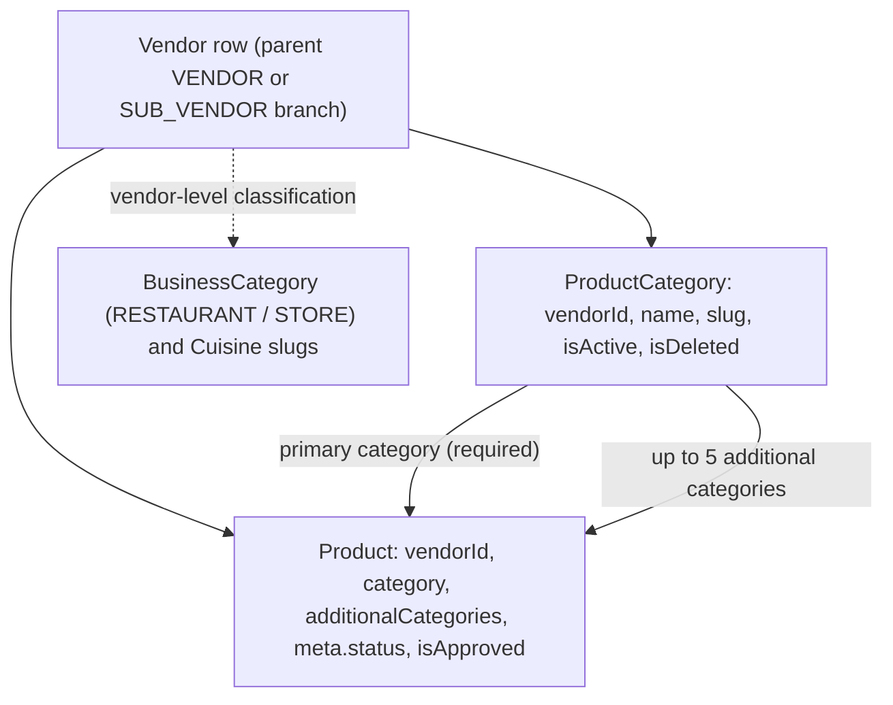
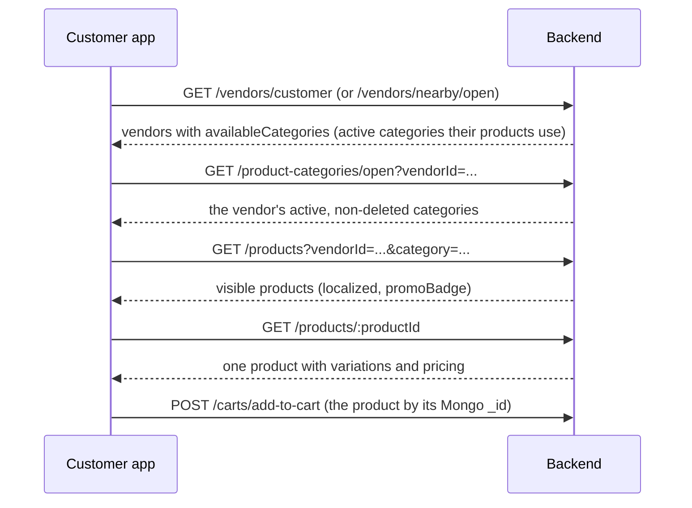
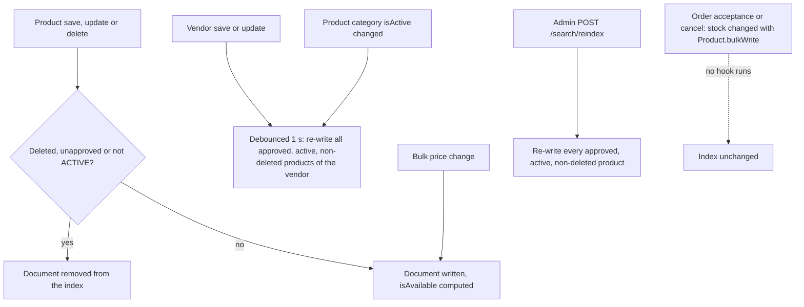

# Menus

This page answers one question precisely: **what is a "menu" in the DeliGo
backend?** In the current code there is **no Menu, MenuSection or menu-item model,
route, service or ordering field**. A vendor's menu is its set of products grouped
by vendor-owned product categories. A Menu/MenuSection module did exist briefly
and was removed; that history, and an unmerged menu-import branch, are described
at the end so nobody mistakes them for current behavior.

Paths are relative to `src/app/`. Statements come from the current code unless
marked **Inferred** or **History** (read from git, not from running code). The
product and category rules themselves are documented in
[Products and Categories](./products.md); this page links to them instead of
repeating them.

---

## Verdict: is there a Menu system?

No. Each of these was checked in the checked-out code:

| Check | Result |
| --- | --- |
| A `Menu`, `MenuSection` or menu-item model, route, controller or service | None. No file under `src/` has "menu" in its name, and `routes/index.ts` mounts no `/menus` path |
| Any reference to a `Menu` model elsewhere (errors, messages, activity log, validation) | None. The only occurrences of the word are the vendor document field `documents.menuUpload` (in the vendor model, interface, constants, validation and the correction-request constants) |
| A persisted ordering field (`sortOrder`, `position`, `displayOrder`, `rank`, `sequence`) on `Product`, `ProductCategory` or `Vendor` | None. `Product` and `ProductCategory` have no ordering field, so **there is no insert-and-shift behavior** |
| A menu availability window (breakfast/lunch style time ranges) | None. Availability is per store (`isStoreOpen`, opening hours, closing days) and per product (`meta.status`, stock) |
| Menu create/update/delete/reorder endpoints | None in the current code |
| Menu import or sync code | None in the current code. Only the search-index sync described [below](#search-and-the-meilisearch-index) exists. A separate, unmerged branch contains an import module (see [History](#history-the-removed-menu-module-and-the-import-branch)) |

`documents.menuUpload` is **not** a menu structure: it is one of the vendor's
onboarding document image arrays (a list of URLs, for example photos of a paper
menu), managed through the document routes and editable by the vendor itself. See
[Vendors and Branches](../04-vendors/vendors-and-branches.md#document-images).

---

## How a vendor's menu is represented today

| Menu idea | What the code has | Notes |
| --- | --- | --- |
| A menu | The vendor's non-deleted `Product` documents | There is only one, implicit "menu" per vendor row. There are no named or time-based menus |
| A section | A `ProductCategory` owned by that vendor row (`vendorId`) | Names are stored upper-cased; `name.en` and `slug` are unique per vendor. See [Product categories](./products.md#product-categories) |
| An item | A `Product` | Owned by exactly one vendor row through `vendorId` |
| An item in several sections | `Product.category` (one, required) plus `additionalCategories` (up to 5) | The only many-to-many link. A product can appear under several categories; there is no separate join record |
| Hiding a section | `ProductCategory.isActive = false` | Customers stop seeing products whose **primary** category is inactive or deleted; additional categories are ignored for that check |
| Hiding an item | `Product.meta.status = INACTIVE`, or soft delete | See [Approval, status and deletion](./products.md#approval-status-and-deletion) |
| Vendor-level classification | `businessDetails.businessType` (`RESTAURANT` or `STORE`) and `restaurantCuisineType` slugs | Platform-managed `BusinessCategory` and `Cuisine` collections under `/api/v1/categories` (admin writes; public reads exist) |

**Branches.** Each branch (`SUB_VENDOR`) is its own vendor row with its **own**
categories and products, so each branch has its own separate "menu". A parent
`VENDOR` can list a branch's products (`GET /products?vendorId=<branch>`) but the
category list endpoint returns only the caller's own categories, so a parent
cannot list a branch's categories through it (**Inference** from the vendor
scoping in `getAllProductCategories`: a vendor role always filters on its own id).
Copying products to branches creates new products and matches or creates
categories by slug; see
[Copying products to branches](./products.md#copying-products-to-branches).

**Mapping "menu tasks" to the real endpoints** (**Inferred** equivalence: the code
never calls these menu operations):

| Menu task | Endpoint that actually does it |
| --- | --- |
| Add a section | `POST /product-categories` (vendor) or `POST /product-categories/admin/create-product-category` |
| Rename or hide a section | `PATCH /product-categories/:id` (`name`, `isActive`) |
| Delete a section | `DELETE /product-categories/soft-delete/:id` then `/permanent-delete/:id`; the category must be inactive and hold no non-deleted product as its primary category |
| Add an item | `POST /products/create-product` |
| Move an item to another section | `PATCH /products/:productId` with `category` or `additionalCategories` |
| Hide, restore or remove an item | `PATCH /products/:productId/status`, `DELETE /products/soft-delete/:productId` |
| Reorder sections or items | **Not possible.** There is no ordering field |

---

## Ordering

Nothing about menu order is stored. What order a client sees is only the default
sort of each endpoint (or a `sortBy` the client passes):

| Surface | Order |
| --- | --- |
| `GET /products`, `GET /products/open` | `-createdAt` (newest first) unless `sortBy` is given. `sortBy` may be any stored field, for example `pricing.price` (the base price, not the discounted one) |
| `GET /product-categories` and `/open` | Same `QueryBuilder` default, `-createdAt`, unless `sortBy` is given |
| `availableCategories` in the customer vendor lists | No explicit sort: the order in which the database returns the matching active categories |
| `GET /search` (Meilisearch) | Relevance, or `sortBy=price` / `sortBy=rating` with `sortOrder` (`asc`, otherwise `desc`) |

**A global sort rewrite.** The `parseLanguage` middleware, applied to every route,
rewrites `sortBy=name` (or `sortBy=-name`) to `name.<language>` using the request
language (`name.en` or `name.pt`), and takes the direction only from `sortOrder`
(default ascending). The leading `-` is stripped before that decision, so
**`sortBy=-name` without `sortOrder=desc` still sorts ascending**. Categories are
stored upper-cased, so an alphabetical sort of category names is case-consistent.

Because there are no position numbers, no insert-and-shift, no renormalization and
no reorder endpoint exist in the current code. The removed module had all of them
(see [History](#history-the-removed-menu-module-and-the-import-branch)).

---

## How customers browse a vendor's menu

There is no single "menu endpoint". A client composes the calls below (**Inferred**
flow: the code does not prescribe it).

| Step | Endpoint | Notes |
| --- | --- | --- |
| Find vendors | `GET /vendors/customer`, `GET /vendors/nearby/open` | Each vendor carries `availableCategories`. See [Customer vendor discovery](../04-vendors/vendors-and-branches.md#customer-vendor-discovery) |
| List a vendor's categories | `GET /product-categories` (customer, needs `vendorId`), `GET /product-categories/open` (public, `vendorId` mandatory) | Only active, non-deleted categories are returned to customers |
| List products of a category | `GET /products?vendorId=&category=` | `category` matches the primary **or** an additional category. Visibility rules: [Visibility and discovery](./products.md#visibility-and-discovery) |
| Read one product | `GET /products/:productId` | Hidden products return `PRODUCT_NOT_FOUND` |
| Search across vendors | `GET /search` | See below |

`availableCategories` is built from the vendor's non-deleted products of **any**
approval and status (it filters only `isDeleted`), then keeps the categories that
are active and not deleted. A category used only by inactive or unapproved products
can therefore still be advertised while listing no visible product (**Inferred**
consequence).

### Two discovery paths, two sets of rules

The product list and the search endpoint do not apply the same visibility rules:

| Rule | `GET /products` (customer view) | `GET /search` |
| --- | --- | --- |
| Product deleted, unapproved or not `ACTIVE` | Hidden | Not indexed (document removed) |
| Vendor store closed (`isStoreOpen: false`) | **Still listed** | Indexed but `isAvailable: false`, filtered out by default |
| Product `availabilityStatus` is `Out of Stock` | **Still listed** | `isAvailable: false`, filtered out by default |
| Primary category inactive or deleted | Hidden | `isAvailable: false`, filtered out by default |
| Vendor agreement eligibility and `APPROVED` vendor | Enforced (nearby, eligible vendors only) | Not checked at query time |
| Location | Latitude/longitude bounding box (`latitude`/`longitude` or `lat`/`lng`), or the customer's saved location | `_geoRadius` on the vendor location; only `lat` and `lng` are read |
| Price shown or filtered | Base price and the discount fields separately | The **base** price (`pricing.price`, or the lowest option price); the store discount is not in the index |

### Search and the Meilisearch index

Mounted at `/api/v1/search` (`modules/Meilisearch/`).

| Endpoint | Auth | Behavior |
| --- | --- | --- |
| `GET /search` | None | Food search. Parameters: `searchTerm`, `limit` (default 20), `offset` (default 0), `cuisine`, `category` (matches the primary or an additional category id), `isHalal`, `isAvailable`, `restaurantId` (the vendor's Mongo id), `minPrice`, `maxPrice`, `lat`, `lng`, `radiusInMeters`, `sortBy` (`price` or `rating`), `sortOrder`. `lat` and `lng` are **required** (`LOCATION_COORDINATES_REQUIRED_FOR_NEARBY_RESTAURANTS`). When `isAvailable` is omitted, `isAvailable = true` is applied |
| `GET /search/key` | None | Returns a search-only Meilisearch key (created once, description "DeliGo Food Search - Public Search-Only Key"), the host and the index name |
| `POST /search/reindex` | `ADMIN`, `SUPER_ADMIN` | Re-indexes every approved, active, non-deleted product in batches of 1,000 |

Details:

- **Radius.** `radiusInMeters` if it is a positive number, otherwise the global
  setting `order.nearestVendorRadiusKm` × 1000. That setting defaults to `0`, and
  a radius of `0` is still added to the filter, so with the default setting and no
  `radiusInMeters` the geo filter is a zero-radius circle (**Inferred**: Meilisearch
  treats it as an exact-point match, so results would normally be empty).
- **Index settings.** Searchable: `name`, `description`, `cuisine`,
  `restaurantName`, `branchName` (name and description contain the English and
  Portuguese text joined). Filterable: `_geo`, `cuisine`, `categoryIds`, `isHalal`,
  `price`, `restaurantId`, `isAvailable`. Sortable: `price`, `rating`.
- **Hit fields.** `id`, `productId`, `name`, `description`, `cuisine`, `categoryIds`,
  `restaurantName`, `branchName`, `restaurantId`, `price`, `rating`, `isHalal`,
  `isAvailable`, `thumbnail`, `currency` and `_geo`. `name`, `description` and
  `cuisine` are localized to `en` or `pt` from the request language.
- **`isAvailable`** is computed when the document is written: false if the product
  is deleted, unapproved or not `ACTIVE`, if its **product-level**
  `stock.availabilityStatus` is `Out of Stock`, if the vendor's `isStoreOpen` is
  `false`, or if its primary category is hidden. Option-level stock is not
  considered (**Inferred** from `isProductAvailable`).
- **Filter values are not escaped.** `cuisine`, `category` and `restaurantId` are
  placed inside double quotes in the filter expression on this unauthenticated
  endpoint. **Inferred:** a value containing a quote can alter the filter.
- **The public key bypasses server rules.** A client that queries Meilisearch
  directly with the key from `/search/key` is not subject to the `isAvailable`
  default or to the location requirement (**Inferred**: those live in the server
  endpoint, not in the index).

Consequences of how the sync works:

- **Order-driven stock changes do not reach the index.** Acceptance and restoration
  change stock with `Product.bulkWrite`, which fires no model hook, and they do not
  recompute `availabilityStatus`. That field, and therefore the index's
  `isAvailable`, changes only through the product update, variation and inventory
  routes (see [Stock and availability](./products.md#stock-and-availability)).
  A product that sells out through orders can still show as available in search.
- **Hooks are fire-and-forget.** Indexing failures are logged and never returned to
  the caller, so the index can drift until the next write or a reindex
  (**Inferred**).
- **Vendor resync is broad and additive.** Any vendor `save` or `findOneAndUpdate`
  triggers the resync (not only a store toggle; a plain `updateOne` does not), and
  it only re-writes products that are still eligible, so it never removes
  documents that became ineligible. Those are removed by their own product write.

---

## How cart, checkout and orders consume product data

There is no menu or section object in any of them. They work from the product, and
the details are on other pages:

| Consumer | Uses | Where documented |
| --- | --- | --- |
| Cart | The product's Mongo `_id`, `variationSku` when the product has variations; stores a **snapshot** of the product `name` and `image` on the item. Reading the cart (`view-cart`) re-derives price, tax and discount from the product but does **not** rewrite the `name`. The `name` snapshot is rewritten only when an existing item is updated through `add-to-cart`, when an item is toggled active, or when an add-on quantity is updated; the `image` is never refreshed | [How other modules use a product](./products.md#how-other-modules-use-a-product) |
| Checkout | Re-validates each product (exists, not deleted, approved, `ACTIVE`) and recomputes amounts from the database | [Checkout and Order Creation](../03-orders/checkout-and-order-creation.md) |
| Orders | Copy `productId`, `name`, `image`, `variationSku` and pricing into `items[]`; **no category or section is stored on a cart item or an order item**. Stock is deducted at acceptance | [Order Lifecycle](../03-orders/order-lifecycle.md) |

Because no category is snapshotted, renaming, deactivating or deleting a category
does not change existing carts or orders, but it can change what a customer sees
when browsing.

---

## Import and sync

- **Search index sync:** the only sync in the current code (previous section).
- **Menu import:** none in the current code. The unmerged `feat-import` branch
  contains a `MenuImport` module; see below.
- **No Socket.IO events** relate to menus, products or categories. The only
  vendor-related socket event is the store status update
  (`vendor-store-status-updated`), documented in
  [Order Tracking and Realtime](../03-orders/order-tracking-and-realtime.md#order-events).

---

## History: the removed Menu module and the import branch

Everything in this section is read from git history (`git show`, `git log`), not
from running code, and none of it is current behavior.

| Date | Commit | What happened |
| --- | --- | --- |
| 2026-08-25 | `2123f4bd` | "implement menu management functionality": added `modules/Menu/` and mounted `/menus` |
| 2026-08-27 | `317e167f`, `ae36d142` | "add Menu/MenuSection/item ordering with insert-and-shift + immediate renormalize" |
| 2026-08-29 | `3b3938d0`, `aa78ecf0` | "remove menu module and related functionalities": deleted the module and its route mount, and added `docs/menu-reimplementation-spec.md` |

These commits are all ancestors of the current branch (and present on `main`).
The removal commit message describes a backend-only removal; the spec it added
states that no data migration was done and that the `menus` and `menusections`
MongoDB collections were left in place, unused. That last point comes from the
spec text and was not checked against a database.

**What the removed module looked like** (from its model, route and utility files
at `aa78ecf0^`):

- **Data.** `Menu` (`vendorId`, localized `name`, optional `description`, an
  `availability` block of weekdays and start/end times, `sortOrder`, `isActive`,
  `isDeleted`) and `MenuSection` (`menuId`, `vendorId`, `name`, `sortOrder`,
  `isActive`, and embedded `items[]` of `{ productId, sortOrder, isAvailable }`). A
  section referenced products, so one product could sit in several sections. Per its
  own spec, `availability` was stored and returned but never evaluated against the
  clock.
- **Ordering.** Positions were zero-based `sortOrder` integers. Creating an entry at
  a requested position inserted it and **shifted** the later entries; deleting
  closed the gap immediately (renormalized to a gapless `0..n-1`); reordering moved
  one entry to a target position and re-numbered the rest. A position outside the
  allowed range was `INVALID_SORT_ORDER_POSITION`.
- **Routes** (mount `/menus`): public `GET /open/:vendorId` and
  `GET /open/:menuId/sections`; vendor and branch create, update, reorder and
  soft delete for menus; section create, update, reorder and delete; item add,
  reorder and remove; `ADMIN` / `SUPER_ADMIN` read access; permanent delete for
  `SUPER_ADMIN` only.

**Current effect.** The routes are unmounted, so a request to `/api/v1/menus/...`
reaches the app's `notFound` handler (**Inferred** from the router and the
`notFound` middleware registered after it). Clients written against the removed
module have no replacement for menus, ordering or availability windows.

**The `feat-import` branch.** Commit `00722a8d` (2026-09-14, "add external menu
import") exists on `feat-import` only. It is not an ancestor of the current branch
and is not on `main`; that branch is 33 commits ahead of its merge base with this
one. From the commit's file list it adds a `MenuImport` module (models for an
import job, a connection and an external-catalog mapping), a BullMQ queue and
worker, an Uber Eats adapter (auth, client, normalizer), Postman and architecture
documents, and storage-related changes. None of it is in the checked-out code, so
its behavior is **not documented or verified here**.

---

## Guards and edge cases

- **No menu object means no menu-level guard.** Every rule about visibility,
  ownership and stock is a product or category rule, in
  [Products and Categories](./products.md).
- **Category-driven hiding looks only at the primary category** (list and detail,
  and the search flag).
- **`availableCategories` is unsorted** and can include categories used only by
  hidden products.
- **A parent vendor cannot list a branch's categories** but can list its products
  (read-only).
- **`sortBy=-name` sorts ascending** unless `sortOrder=desc` is also sent.
- **Search and product list disagree** about closed stores and out-of-stock
  products, and order-driven stock changes do not update the index.
- **Search needs `lat` and `lng`** (not `latitude` / `longitude`); the default
  radius setting is `0`.
- **`documents.menuUpload`** is a vendor document, not menu data, and is not
  exposed to customers by any endpoint reviewed here.

---

## Related documentation

- [Products and Categories](./products.md): the product and category rules that
  make up the menu (fields, visibility, stock, copy to branches, images).
- [Vendors and Branches](../04-vendors/vendors-and-branches.md): vendor and branch
  ownership, customer vendor discovery, store open/close and the document images.
- [Checkout and Order Creation](../03-orders/checkout-and-order-creation.md): how a
  product becomes an order item.
- [Order Tracking and Realtime](../03-orders/order-tracking-and-realtime.md): the
  socket events, none of which concern menus.
