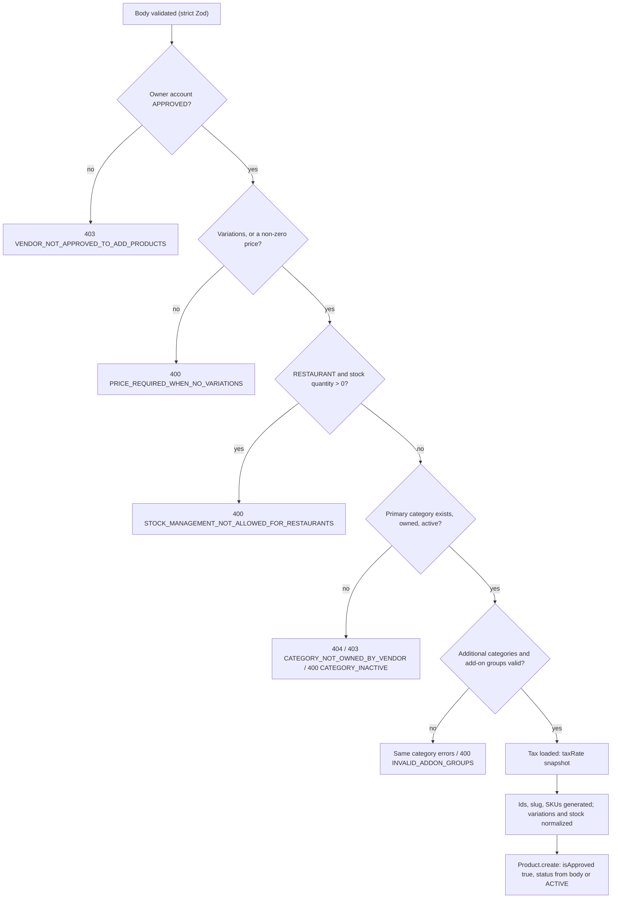
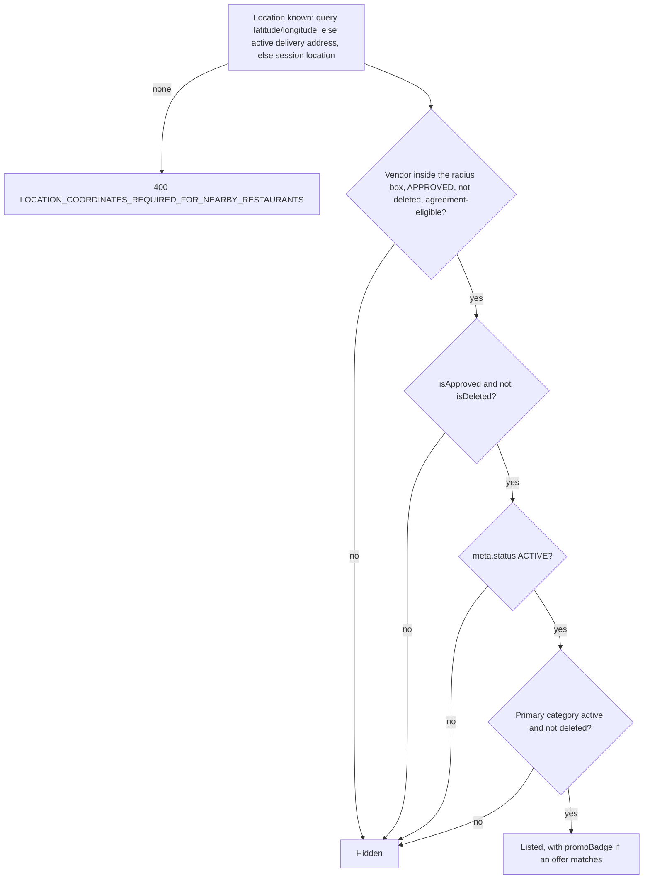

# Products and Categories

This page describes the catalog side of DeliGo: the `Product` collection, the
vendor-owned `ProductCategory` collection, and every endpoint that changes or
reads them. It documents the code as it is, including places where the
implementation is inconsistent (marked **Inconsistency** and collected in
[Known implementation inconsistencies](#known-implementation-inconsistencies)).

Paths are relative to `src/app/`. The main files are `modules/Product/`
(`product.route.ts`, `product.controller.ts`, `product.service.ts`,
`product.validation.ts`, `product.model.ts`, `createProduct.utils.ts`,
`updateProduct.utils.ts`, `product.utils.ts`) and `modules/ProductCategory/`.
Statements come from the code unless marked **Inferred**; a few claims that could
be checked against the real model were executed and are noted as such.

Not repeated here, because other pages cover them properly:

- Vendor and branch accounts, parent/branch ownership, store open/close and the
  copy-to-branches summary: [Vendors and Branches](../04-vendors/vendors-and-branches.md).
- What happens to a product at checkout, order acceptance and cancellation:
  [Checkout and Order Creation](../03-orders/checkout-and-order-creation.md),
  [Order Lifecycle](../03-orders/order-lifecycle.md) and
  [Cancellations, Refunds and Settlement](../03-orders/cancellations-refunds-settlement.md#stock-restoration).
- Roles, permissions and the agreement gate: [Authorization](../03-identity-access/authorization.md).

**There is no Menu or MenuSection.** The backend has no such model, route or
service. A vendor's "menu" is simply its set of `Product` documents grouped by
`ProductCategory`. The only "menu" strings in the code are a vendor document
upload field (`documents.menuUpload`). Add-on groups (`AddonGroup`) are a
separate module that products reference; this page only covers how products use
them. How a menu is represented, browsed and searched, and the history of a
removed Menu module, are on [Menus](./menus.md).

---

## Endpoints and roles

All product routes are mounted at `/api/v1/products`. Unless noted, `:productId`
is the display id (`PROD-…`), not the Mongo `_id`.

| Endpoint | Roles at the route | Purpose |
| --- | --- | --- |
| `POST /create-product` | `VENDOR`, `SUB_VENDOR` | Create a product for the caller |
| `POST /admin/create-product` | `ADMIN`, `SUPER_ADMIN` | Create a product for a given `vendorId` |
| `PATCH /:productId` | `VENDOR`, `SUB_VENDOR`, `ADMIN`, `SUPER_ADMIN` | Edit details, pricing fields, category, status |
| `PATCH /manage-product-variations/:productId` | same four | Add a variation group or options |
| `PATCH /rename-product-variations/:productId` | same four | Rename a group or an option |
| `PATCH /remove-product-variations/:productId` | same four | Remove a group or an option |
| `PATCH /update-inventory-and-pricing/:productId` | same four | Add or reduce stock, set a price |
| `PATCH /adjust-price` | same four | Bulk price or discount change |
| `PATCH /:productId/status` | same four | `ACTIVE` / `INACTIVE` (also restores a soft-deleted product) |
| `PATCH /approveOrReject/:productId` | `ADMIN`, `SUPER_ADMIN` | Admin approval or rejection |
| `DELETE /:productId/images` | same four | Delete stored images (see [Images](#images-and-uploads)) |
| `DELETE /soft-delete/:productId` | same four | Soft delete |
| `DELETE /permanent-delete/:productId` | `ADMIN`, `SUPER_ADMIN` | Hard delete (after a soft delete) |
| `POST /copy-to-sub-vendors` | `VENDOR`, `ADMIN`, `SUPER_ADMIN` | Copy products to branches (**not** `SUB_VENDOR`) |
| `GET /` | `CUSTOMER`, `FLEET_MANAGER`, `DELIVERY_PARTNER`, `VENDOR`, `SUB_VENDOR`, `ADMIN`, `SUPER_ADMIN` | List (scoped by role) |
| `GET /:productId` | same seven | One product (scoped by role) |
| `GET /open`, `GET /open/:productId` | none | Customer-style list and read without a token |
| `GET /out-of-stock-alerts` | `ADMIN`, `SUPER_ADMIN` | Low and out-of-stock products, all vendors |
| `POST /notify-vendor/:productId` | `ADMIN`, `SUPER_ADMIN` | Push and email a stock alert (`:productId` is the **Mongo `_id`**) |

Notes:

- The two admin-only routes use `auth('ADMIN', 'SUPER_ADMIN')` **without** a
  permission action, so no admin permission code is required for any product
  route.
- `VENDOR` is subject to the agreement gate for every write (a vendor with an
  unsigned current agreement gets `AGREEMENT_RESIGN_REQUIRED` on all non-GET
  requests). A `SUB_VENDOR` is gated through its parent vendor's agreement; admins are not gated. See
  [Authorization](../03-identity-access/authorization.md#the-agreement-gate-as-an-authorization-constraint).
- Product categories have their own routes, listed in [Product categories](#product-categories).

---

## The Product model

`modules/Product/product.model.ts`. Important fields:

| Field | Meaning |
| --- | --- |
| `productId` | Unique display id, `PROD-` plus 6 characters from `0-9A-Z` |
| `vendorId` | Owning `Vendor` row (a parent `VENDOR` or a `SUB_VENDOR` branch). Set from the creating vendor, never from the payload |
| `sku` | Unique. Generated as `<first 3 letters of the category's English name>-<3 letters of the product name>-<the 6-character id part>` |
| `name`, `description` | Localized `{ en, pt }`. On create, `name.en` and `name.pt` are both required (at least 2 characters); `description` is optional and may be an empty string |
| `slug` | Derived from the English name (Portuguese if empty). **Not unique**: there is no unique index |
| `category` | Required primary `ProductCategory` |
| `additionalCategories` | Up to 5 more categories (duplicates and the primary are dropped) |
| `brand` | Free text, searchable |
| `variations[]` | Groups with `options[]` (`label`, `price`, `sku`, `stockQuantity`, `totalAddedQuantity`, `isOutOfStock`). See [Variations](#variations) |
| `addonGroups[]` | `AddonGroup` ids owned by the same vendor |
| `pricing` | `price`, `discount`, `discountType` (`PERCENTAGE` / `FLAT`), `taxId`, `taxRate`, `currency` (default `EUR`). See [Pricing and tax](#pricing-and-tax) |
| `stock` | `quantity`, `totalAddedQuantity`, `unit`, `availabilityStatus`, `hasVariations`. Absent for restaurants and when not supplied. See [Stock and availability](#stock-and-availability) |
| `image` | **One** URL string. There is no image array |
| `isApproved`, `approvedBy`, `remarks` | Admin approval state. `isApproved` **defaults to `true`** |
| `isDeleted` | Soft-delete flag |
| `meta.status` | `ACTIVE`, `INACTIVE`, or `DELETED` (set only by soft delete) |
| `meta.isFeatured`, `meta.isAvailableForPreOrder`, `meta.origin` | Stored and editable; **no code outside the product module reads them** (searched the whole `src/app`) |
| `rating` | `average` and `totalReviews`, maintained by the rating flow (see [Rating relationship](#rating-relationship)) |
| `sourceProductId`, `sourceVendorId` | Set only on copies; record the origin |

`productId` and `sku` are unique indexes; `category` and `additionalCategories`
are indexed; `sourceProductId` and `sourceVendorId` are sparse indexes. Prices are
plain numbers, rounded with `roundTo2` where the code computes them.

**Search index.** The model's `post` hooks (`save`, `findOneAndUpdate`,
`findOneAndDelete`, document `deleteOne`) push the product to Meilisearch in the
background; failures are only logged. A product that is deleted, not approved or
not `ACTIVE` is removed from the index instead. `Product.bulkWrite` (used by the
bulk price change) does not fire these hooks, so that code syncs the products
itself afterwards.

---

## Creating a product

`POST /products/create-product` (vendor) and `POST /products/admin/create-product`
(admin, extra body field `vendorId`) share one flow, `createProductForVendor`.
The body is validated by a **strict** Zod schema: unknown keys are rejected, and
clients cannot send `taxRate`, `sku`, `slug`, `productId`, `isApproved` or
`vendorId` (except the admin's `vendorId`).

Details:

| Rule | Behavior |
| --- | --- |
| Owner status | The owning account must be `APPROVED` (`VENDOR_NOT_APPROVED_TO_ADD_PRODUCTS`). For the admin route it is the **vendor's** status that is checked, not the admin's. The admin route accepts any non-deleted `Vendor` row, so a `SUB_VENDOR` id works too (**Inferred** from the lookup: there is no role filter) |
| Price | Zod requires either a non-empty `variations` or `pricing.price`. Separately `validateBasePayload` rejects a falsy price when `variations` is absent, so a simple product with price `0` is rejected even though Zod allows `0` |
| Discount | `pricing.discount` is 0 to 100 (this cap applies to `FLAT` too), `discountType` defaults to `PERCENTAGE` |
| Tax | `pricing.taxId` is required. The `Tax` document is loaded and its `taxRate` is copied onto the product (`NOT_FOUND_MESSAGE` for an unknown tax). Only existence is checked, not `isActive` / `isDeleted` |
| Categories | Every category must belong to the same vendor, not be deleted, and be active. The primary category is also used for the SKU prefix |
| Add-on groups | Each id must be a non-deleted group of the same vendor (`INVALID_ADDON_GROUPS`); `isActive` is not checked |
| Restaurant vendors | If the vendor's business type is `RESTAURANT`, a `stock.quantity` above 0 is rejected and any `stock` is dropped. Option `stockQuantity` above 0 is rejected too (`VARIATION_STOCK_NOT_ALLOWED_FOR_RESTAURANTS`) and option stock fields are removed |
| Stores | For other business types, stock is tracked. Simple products keep the supplied `stock` (`hasVariations: false`, `totalAddedQuantity` = quantity) |
| Status | `meta.status` may be `ACTIVE` (default) or `INACTIVE` |
| Approval | `isApproved` is the model default `true`. The admin route also records `approvedBy` |
| Response | The created document, message `COMMON_CREATED_SUCCESS` |
| Audit | The admin route writes an activity log entry `PRODUCT_CREATED_BY_ADMIN` |

`availabilityStatus` is **not** recalculated on create: it keeps the supplied value
(default `In Stock`) even when the quantity is 0, until a later update or inventory
change recomputes it.

---

## Product categories

`ProductCategory` (`modules/ProductCategory/`) belongs to **one vendor row**
(`vendorId`), so each branch has its own categories. Mounted at
`/api/v1/product-categories`.

| Endpoint | Roles | Notes |
| --- | --- | --- |
| `POST /` | `VENDOR`, `SUB_VENDOR` | Create for the caller. The account must be `APPROVED` (`VENDOR_NOT_APPROVED`) |
| `POST /admin/create-product-category` | `ADMIN`, `SUPER_ADMIN` | Create for a `vendorId`; activity log entry |
| `PATCH /:id` | `VENDOR`, `SUB_VENDOR`, `ADMIN`, `SUPER_ADMIN` | Vendors edit only their own; admins any (logged) |
| `GET /`, `GET /:id` | `ADMIN`, `SUPER_ADMIN`, `VENDOR`, `SUB_VENDOR`, `CUSTOMER` | Scoped by role |
| `GET /open`, `GET /open/:id` | none | `vendorId` query is mandatory for the list |
| `DELETE /soft-delete/:id`, `DELETE /permanent-delete/:id` | `VENDOR`, `SUB_VENDOR` | **Owner only; admins cannot delete** |

Rules:

- **Names are stored upper-cased** (`name.en` and `name.pt`), and `slug` is derived
  from the English name. `name.en` is unique per vendor and `slug` is unique per
  vendor, including soft-deleted rows (the unique indexes do not filter
  `isDeleted`).
- **Reads.** A vendor sees only its own rows. A customer must pass `vendorId` and
  only ever gets active, non-deleted categories. Admins may filter by `vendorId`
  and see everything.
- **Activation.** `isActive` can be toggled with `PATCH /:id`; repeating the same
  value is a `409`. Toggling it triggers a Meilisearch resync of that vendor's
  products.
- **Effect on products.** Products can only be created or moved into an active,
  owned, non-deleted category. Deactivating or deleting a category does **not**
  change its products, but customers stop seeing products whose **primary**
  category is inactive or deleted (see [Visibility](#visibility-and-discovery)).
- **Deleting.** Soft delete requires the category to be **inactive** first
  (`ACTIVE_CATEGORY_CANNOT_DELETE`) and to have no non-deleted product whose
  **primary** `category` is it (`PRODUCT_CATEGORY_HAS_PRODUCTS`). Products that use
  it only as an additional category do not block it. Permanent delete needs a
  prior soft delete and re-checks the same condition.
- **Discovery lists.** The vendor lists shown to customers return only active,
  non-deleted categories that a vendor's products use (see
  [Vendors and Branches](../04-vendors/vendors-and-branches.md#customer-vendor-discovery)).

---

## Pricing and tax

| Field | Behavior |
| --- | --- |
| `pricing.price` | The base price. For a product **with variations** it is always the lowest option price: it is recomputed on create, when variations are added or removed, and when an option price changes through the inventory route |
| `pricing.discount` / `discountType` | A **store discount** applied to the base price. `PERCENTAGE` (0 to 100) or `FLAT` (a currency amount, but capped at 100 by validation) |
| `pricing.taxId` / `taxRate` | Reference to a `Tax` and a **snapshot** of its rate taken at create or when `taxId` changes. Allowed rates in the `Tax` type are 0, 6, 13 and 23 |
| `pricing.currency` | Free string, default `EUR`; not validated against a list |

The model exposes four **virtual** fields, included in `toJSON` / `toObject` and
therefore in normal API responses (not in `.lean()` reads such as the stock-alert
list):

| Virtual | Formula |
| --- | --- |
| `pricing.finalPrice` | `price − discountAmount`, never below 0 |
| `pricing.discountAmount` | `price × discount / 100` (percentage) or `discount` (flat), never above `price` |
| `pricing.taxAmount` | `finalPrice × taxRate / (100 + taxRate)`: the tax is **included** in the price |
| `pricing.basePrice` | `finalPrice − taxAmount` |

Verified by executing the model: a price of 10 with a 10 % discount and 23 % tax
gives `finalPrice 9`, `discountAmount 1`, `taxAmount 1.68`, `basePrice 7.32`; a
flat discount of 3 with 6 % tax gives `7`, `3`, `0.40`, `6.60`; a flat discount
of 50 on a price of 10 gives `finalPrice 0` and `discountAmount 10`.

The virtuals use `pricing.price`. Variation option prices have no discount or tax
of their own: the product's discount and tax rate apply to whichever price is
selected (see [Checkout](../03-orders/checkout-and-order-creation.md#how-the-amounts-are-calculated)).

**Inconsistency.** Checkout computes the discounted unit price with
`getStoreDiscountedUnitPrice`, which does **not** clamp: executed for a price of 10
and a flat discount of 50 it returns `priceAfterStoreDiscount -40`, whereas the
model virtual returns 0. Whether that can reach a stored order depends on later
checkout checks, which this page did not trace.

Tax changes do not propagate: nothing in the `Tax` module touches products, so a
changed tax rate leaves existing `pricing.taxRate` snapshots as they were
(**Inferred** from the absence of any propagation code).

### Bulk price change (`PATCH /products/adjust-price`)

Body: `type` (`INCREASE` or `DECREASE`), `percentage` (> 0, and < 100 for
`DECREASE`), and **exactly one** of `categoryIds` or `productIds`.

| Aspect | Behavior |
| --- | --- |
| Caller | Must be `APPROVED`. Vendors and branches act on their own products only; admins on any |
| `productIds` scope | All ids must exist and be non-deleted (`PRODUCTS_NOT_FOUND`); a vendor naming another vendor's product gets `PRODUCTS_NOT_OWNED_BY_VENDOR` |
| `categoryIds` scope | Non-deleted products whose primary **or** additional category matches. None at all: `CATEGORY_HAS_NO_PRODUCTS`. For a vendor, other vendors' products are filtered out (`CATEGORY_PRODUCTS_NOT_OWNED_BY_VENDOR` if nothing remains). For an admin, **every vendor's** products in those categories are changed |
| `INCREASE` | Multiplies `pricing.price` (and every option price for variation products, then re-derives the minimum) by `1 + percentage/100`, rounded to 2 decimals |
| `DECREASE` | **Does not change prices.** It changes `pricing.discount`: for `PERCENTAGE` products the discount is **set to** `percentage` (replacing any existing value); for `FLAT` products the flat discount is raised by `discount × percentage / 100` |
| Validation | If any product would end up with a price at or below 0, or a discounted price at or below 0 or a percentage above 100, the **whole request fails** (`RESULTING_PRICE_INVALID_BULK`) and nothing is written |
| Write | One `bulkWrite` inside a transaction, then a Meilisearch sync of every touched product |
| Response | `updatedCount`, `percentage`, `direction`, and per-product `priceChanges` or `discountChanges` |

This endpoint does not write an activity log entry, even for admins.

---

## Stock and availability

A product is orderable only if it is visible (see [Visibility](#visibility-and-discovery))
and, for non-restaurant vendors, has enough stock.

### Where stock lives

| Product shape | Stock fields used |
| --- | --- |
| Simple product, store vendor | `stock.quantity`, `totalAddedQuantity`, `unit`, `availabilityStatus` |
| Product with variations, store vendor | Each option's `stockQuantity`, `totalAddedQuantity`, `isOutOfStock`. `stock.quantity` is the sum **only if a `stock` object exists** |
| Restaurant vendor | **No stock.** `stock` and option stock fields are removed on create, and every stock operation ends with `stock` cleared |

`availabilityStatus` is derived by `syncStockStatus`, the variation routes and the
inventory route as: quantity above 0 and below **5** is `Limited`, 5 or more is
`In Stock`, 0 or less is `Out of Stock`. Option `isOutOfStock` is `stockQuantity <= 0`.
The status is informational: no list filter uses it, so an `Out of Stock` product
still appears in customer lists. The cart is what blocks it.

### How stock changes

| Action | Stock effect |
| --- | --- |
| Create | Initial quantity from the body (stores only) |
| `PATCH /update-inventory-and-pricing/:productId` | `addedQuantity` or `reduceQuantity` (not both). Reducing below available is rejected (`INSUFFICIENT_STOCK` / `INSUFFICIENT_STOCK_WITH_AVAILABLE`). A product **with** variations must name the option with `variationSku` (`VARIATION_SKU_REQUIRED_FOR_PRODUCT`); one **without** must not (`PRODUCT_HAS_NO_VARIATIONS_FOR_SKU_UPDATE`). `newPrice` sets the product or option price |
| `PATCH /:productId` (details) | Cannot change quantity; only `stock.unit`. It does recompute `availabilityStatus` from the current quantity |
| Variation routes | Recompute totals, `stock.quantity` and `availabilityStatus` |
| Order **acceptance** | Deducted, non-restaurant vendors only, with a conditional decrement that fails the acceptance if any line lacks stock (`INSUFFICIENT_STOCK`) |
| Cancel, vendor cancel, no-show | Restored for stages where it was deducted |

Acceptance and restoration are documented in
[Order Lifecycle](../03-orders/order-lifecycle.md) and
[Cancellations, Refunds and Settlement](../03-orders/cancellations-refunds-settlement.md#stock-restoration).

### Where stock is checked before an order

| Step | Stock check |
| --- | --- |
| Cart add | For non-restaurant vendors, a requested quantity above the option's `stockQuantity` (or `stock.quantity`, `0` if absent) fails with `INSUFFICIENT_STOCK`. Restaurants are skipped |
| Checkout | **No** stock check |
| Vendor accepts the order | The real check and deduction |

### Alerts

- `GET /products/out-of-stock-alerts` (admin) lists non-deleted products, from **all**
  vendors, where `stock.quantity < 10`, any option `stockQuantity < 10`,
  `availabilityStatus` is `Out of Stock`, or any option is `isOutOfStock`. It
  supports `page`, `limit` (default 10), `sortBy` (default `-createdAt`) and a
  `searchTerm` matched with a case-insensitive regex over `name.en`, `name.pt` and
  `sku`. The alert threshold (10) differs from the `Limited` threshold (5).
- `POST /products/notify-vendor/:productId` (admin) takes the product's **Mongo
  `_id`**, sums option stock or reads `stock.quantity`, and sends the vendor a push
  (`PRODUCT_LOW_STOCK` or `PRODUCT_OUT_OF_STOCK`, notification type `STOCK_ALERT`) and,
  if the vendor has an email, a `low-stock-alert` email in the background.
- This admin action is the **only** sender of these alerts found in the code:
  there is no automatic low-stock notification. See
  [Notification Flow](../02-platform/notification-flow.md#8-other-notification-sources).

---

## Variations

Variations are groups (for example "Size") with priced options. Names and labels
are matched **case-insensitively on the English text**.

| Route | Behavior |
| --- | --- |
| `manage-product-variations` | Body: a group `name` and `options[]`. Both `en` and `pt` are required for the name and every label. If the group exists (by English name) the options are appended, otherwise a new group is added. A duplicate option label in an existing group fails (`OPTION_ALREADY_EXISTS`). A custom `sku` must not exist in **another** product (`VARIATION_SKU_ALREADY_IN_USE`); otherwise `VAR-<name>-<label>-<3 chars>` is generated. Restaurants cannot set option stock. The caller must be `APPROVED` |
| `rename-product-variations` | Rename a group (`oldName` plus `newName`) or an option (`oldLabel` plus `newLabel`), with duplicate checks per language. At least one language is required. **No `APPROVED` check on the caller** |
| `remove-product-variations` | Remove a whole group by name, or one option with `labelToRemove`. A group left with no options is removed. `NO_VARIATIONS_FOUND_TO_REMOVE` if there are none. The caller must be `APPROVED` |

After add or remove, `pricing.price` becomes the lowest option price (on removal,
only options with a price above 0 are considered), and for stores `stock` totals
and `availabilityStatus` are recomputed. Adding variations creates a `stock` object
(`quantity`, `hasVariations: true`) if the product had none; removal only updates an
existing one.

Not enforced: a custom SKU is not checked for uniqueness on **create** or against
options of the **same** product, and there is no unique index on option SKUs.
Removing every variation is allowed and leaves the last computed base price.
The general update route cannot edit variations, but it can overwrite
`pricing.price` for a variation product; the next variation or inventory operation
then replaces it with the minimum option price again.

---

## Updating a product

`PATCH /products/:productId` (strict Zod schema). Everyone, **including admins**,
must be `APPROVED` (`COMMON_ACCESS_DENIED`). A vendor or branch can only load its own
product (`PRODUCT_NOT_FOUND` otherwise); admins can load any.

| Field | Update behavior |
| --- | --- |
| `name` | Each language may be sent alone. The slug is regenerated from the English name (the stored one if only Portuguese is sent) |
| `description` | Each language optionally, empty string allowed |
| `category` | Must be an active, owned, non-deleted category of the **product's owner** (so an admin editing a vendor's product uses that vendor's categories) |
| `additionalCategories` | Replaces the whole list (an empty array clears it); same ownership rules; the primary is dropped |
| `brand` | Applied only if truthy, so it cannot be cleared |
| `addonGroups` | Applied only if non-empty, so it cannot be cleared here. Validated against the owner |
| `pricing.*` | `price`, `discount`, `discountType`, `currency` as sent; a new `taxId` reloads the rate |
| `stock.unit` | The only stock field |
| `image` | Must be a URL. The previous object is not deleted from storage |
| `meta` | `isFeatured`, `isAvailableForPreOrder`, `status` (`ACTIVE`/`INACTIVE`) |

The update runs `findOneAndUpdate` with validators, then recomputes
`availabilityStatus` for non-restaurant products that have `stock`. It does **not**
filter on `isDeleted`, so a soft-deleted product can still be edited. Setting
`meta.status` through this route bypasses the extra effects of the dedicated
status route below. When an admin edits, the controller writes a
`PRODUCT_UPDATED_BY_ADMIN` activity log entry; the same happens for admin calls to
the variation routes, the inventory route and image deletion.

---

## Approval, status and deletion

Three independent flags decide whether a product is live: `isApproved`,
`meta.status` and `isDeleted`.

| Action | Endpoint | Who | Effect |
| --- | --- | --- | --- |
| Reject / approve | `PATCH /approveOrReject/:productId` | Admin | Sets `isApproved` and `approvedBy`. Rejecting **requires** `remarks`; approving clears them. Repeating the current state is `PRODUCT_ALREADY_IN_STATUS`. Logged as `PRODUCT_APPROVED` / `PRODUCT_REJECTED`. The caller's own `APPROVED` status is not checked |
| Activate / deactivate | `PATCH /:productId/status` | Owner or admin | Body `status`: `ACTIVE` or `INACTIVE`. Same status is `PRODUCT_ALREADY_IN_STATUS`. **Always** clears `isDeleted`; setting `INACTIVE` also forces `isApproved = true` |
| Soft delete | `DELETE /soft-delete/:productId` | Owner or admin | Sets `isDeleted` and `meta.status = DELETED`. Blocked if already deleted (`PRODUCT_ALREADY_DELETED`) or if **any** order in an active status contains the product (`CANNOT_DELETE_PRODUCT_WITH_ACTIVE_ORDER`) |
| Restore | `PATCH /:productId/status` | Owner or admin | A soft-deleted product is no longer deleted and takes the requested status (`ACTIVE` makes it live again; `INACTIVE` keeps it hidden but sets `isApproved` to `true`) |
| Permanent delete | `DELETE /permanent-delete/:productId` | Admin | Only after a soft delete (`COMMON_MUST_SOFT_DELETE_FIRST`); removes the document and the search-index entry; logged as `PRODUCT_PERMANENTLY_DELETED` |

The active order statuses that block a soft delete are `PENDING`, `ACCEPTED`,
`AWAITING_PARTNER`, `DISPATCHING`, `ASSIGNED`, `REASSIGNMENT_NEEDED`, `PREPARING`,
`READY_FOR_PICKUP`, `PICKED_UP` and `ON_THE_WAY`. The check is by product
`_id` alone, whichever vendor owns the order. Orders keep a snapshot of the product, so a permanent delete does not
affect historical orders (**Inferred**: no check or cascade exists).

Because new products are created with `isApproved: true`, approval is
**post-hoc**: a product is live at creation and an admin can only reject it
afterwards. Deactivating a rejected product through the status route silently
re-approves it, and a soft delete can be undone by the vendor. These are
recorded as [Vendors and Branches, inconsistency 13](../04-vendors/vendors-and-branches.md#known-implementation-inconsistencies).

---

## Visibility and discovery

### Who sees what

| Caller | `GET /products` | `GET /products/:productId` |
| --- | --- | --- |
| `CUSTOMER`, `FLEET_MANAGER`, `DELIVERY_PARTNER` | Customer rules (below) | Customer rules; anything hidden is `PRODUCT_NOT_FOUND` |
| `VENDOR`, `SUB_VENDOR` | Own products, `isDeleted: false`, **regardless of approval or status**. A `vendorId` parameter is accepted if it is the caller or one of its own branches; any other id returns an empty list, not an error | Only own, non-deleted products. A parent **cannot** open a branch's product by id |
| `ADMIN`, `SUPER_ADMIN` | Every product including deleted, unapproved and inactive ones; optional `vendorId`; an `isDeleted` (or other) filter can be passed | Any product |
| No token (`/open`) | Customer rules; coordinates required | Customer rules; coordinates required |

Every authenticated read requires an `APPROVED` caller (`NOT_APPROVED_TO_VIEW_PRODUCTS`).

### Customer rules

A product appears for customer-facing callers only if all of these hold:

- **Nearby vendors.** Vendors within `customerNearestVendorRadiusKm` (the
  `order.nearestVendorRadiusKm` global setting) of the point, using a latitude/longitude
  **bounding box** (radius ÷ 111 km per degree) on `businessLocation`, then narrowed
  to agreement-eligible vendors, where a branch is covered by its parent's agreement
  (same logic as in [Vendors and Branches](../04-vendors/vendors-and-branches.md#customer-visibility-of-a-product)).
  The setting's default is `0`, which makes the box a single point unless an admin
  raises it.
- **Store state is not checked.** An `isStoreOpen: false` vendor's products are
  still listed; the cart rejects them (`STORE_CLOSED_OR_UNAPPROVED`).
- **Stock is not checked.** Out-of-stock products are listed.
- **Hidden categories.** In the list, products whose **primary** category is inactive
  or deleted are excluded (only that vendor's categories when `vendorId` is given).
  Additional categories are not considered. The single read applies the same
  check to the primary category.
- **`FLEET_MANAGER` and `DELIVERY_PARTNER`** can call the authenticated routes and
  get the same visibility rules and localization as customers, but no vendor summary
  (see below). **Inferred:** the role list is a leftover; nothing in the code gives
  them a product-specific view.
- **`GET /open` and `GET /open/:productId`** apply the same customer rules with no
  authentication and require `latitude`/`longitude` (or `lat`/`lng`).

### List, search, filter and sort

`GET /products` and `GET /products/open` use the shared `QueryBuilder`:

| Parameter | Behavior |
| --- | --- |
| `searchTerm` | Case-insensitive, regex-escaped match on `name.en`, `name.pt`, `description.en`, `description.pt`, `tags`, `brand`, `vendor.vendorName`. `tags` and `vendor.vendorName` are **not fields of the `Product` schema**, so they never match (**Inferred**) |
| `category` | Matches the primary **or** an additional category |
| `vendorId` | Handled per role (above) |
| `sortBy` | Any field, default `-createdAt`. Sorting is on stored fields, so `pricing.price` is the base price, not the discounted one, and virtual prices cannot be sorted |
| `page`, `limit` | Default page 1, limit 10; the response `meta` has `page`, `limit`, `total`, `totalPage` |
| `fields` | Projection |
| Any other top-level key | Applied as an equality filter (for example `brand`, `sku`, `meta.status`), except keys already in the base filter, and values that are objects are dropped. Customer callers cannot override the forced `isApproved`, `isDeleted` and `meta.status` conditions |

See [Conventions](../01-introduction/conventions.md#querybuilder) for the shared
builder. Its `filter()` is not limited to schema fields, and **Inferred** from the
code, a top-level operator-style key such as `$where` passes through when its value is
a string.

### What a response contains

- `category` and `additionalCategories` are populated with `name`. For customer
  roles `category.name` is localized to a string, but `additionalCategories[].name`
  stays a `{ en, pt }` object.
- **Localization.** Vendors and admins receive `{ en, pt }` objects for `name`,
  `description` and variation names. All other roles receive strings resolved from
  the request language (`en` fallback).
- **Vendor summary.** Only `ADMIN`, `SUPER_ADMIN` and `CUSTOMER` (including the `/open`
  routes) get `vendorId` populated (business name, business type, store open flag,
  hours, coordinates, store photo), plus the derived vendor `rating` (see below).
  Every other role, including vendors, `FLEET_MANAGER` and `DELIVERY_PARTNER`, gets
  `vendorId` as a plain id.
- **`promoBadge`** on every product, for every role: see
  [Offers and promo badges](#offers-and-promo-badges).
- `addonGroups` is returned as ids; the add-on groups themselves come from the
  add-on module.

---

## Copying products to branches

`POST /products/copy-to-sub-vendors` is summarised, with its target and product
selection, de-duplication and copied fields, in
[Vendors and Branches](../04-vendors/vendors-and-branches.md#copy-to-branches-post-productscopy-to-sub-vendors).
Additional details from the code:

| Aspect | Behavior |
| --- | --- |
| Request shape | Exactly one of `productIds` or `copyAllProducts`, and exactly one of `targetSubVendorIds` or `copyToAllTargetSubVendors`. Valid combinations: ids + ids, ids + all targets, all products + ids, all products + all targets. Anything else is a validation error |
| Source | A vendor copies from itself (its own status must be `APPROVED`). An admin **must** send `sourceVendorId` (`SOURCE_VENDOR_ID_REQUIRED`), matched on the vendor's `_id` **or** `userId`, and it must be a `VENDOR`. A vendor sending `sourceVendorId` is refused |
| Target ids | Matched on `_id` or `userId`. A target that is not a branch of the source is `TARGET_VENDOR_NOT_YOUR_BRANCH`. If the source has no branches: `NOT_FOUND_MESSAGE` (Sub-vendor) |
| Source products | `copyAllProducts` takes every non-deleted product of the source, **including inactive and rejected ones**. With `productIds`, an id owned by another vendor is `PRODUCTS_NOT_OWNED_BY_VENDOR` (checked first) and a missing one is `PRODUCTS_NOT_FOUND` |
| Copy result | A **new** product: new `productId`, `sku` and option SKUs, regenerated slug, tax rate re-read from `Tax`, `sourceProductId` / `sourceVendorId` set. `meta` is not copied, so the copy is `ACTIVE`, not featured; `isApproved` is `true`; `rating` starts at 0. `pricing` (including the discount) and `stock` are copied as they are, then re-normalized for the **target's** business type. The image is the **same URL** (the file is shared, not duplicated) |
| Categories | Matched by slug against the target's non-deleted categories, created (active) if missing. A matched target category is used **even if it is inactive**, so the copy may be hidden from customers (**Inferred** from the visibility rule) |
| Response | `copiedCount`, `targetCount`, `copiedProductIds`, `copiedTargetSubVendorUserIds`, `copiedCategoryCount`, `copiedAddonGroupCount` |
| Not logged | No activity log entry is written |

Edge cases:

- Sending `productIds` with neither `targetSubVendorIds` nor
  `copyToAllTargetSubVendors` passes validation, then fails inside the service
  with a plain `Error("Please specify at least one target vendor.")`, which the
  global error handler returns as a **500** (not a validation error).
- Copying stock quantities to a `RESTAURANT` branch throws
  `STOCK_MANAGEMENT_NOT_ALLOWED_FOR_RESTAURANTS` for any product with quantity above
  0, after earlier products of the batch may already have been created. There is
  no transaction (**Inferred** for the partial state).

---

## Images and uploads

- A product stores **one** image URL in `image`. It is optional at creation and must
  pass `z.string().url()` on create and update. The product module never accepts a
  file: bodies are JSON.
- Files are uploaded separately with `POST /api/v1/uploads` (multipart field
  `files`, up to 5 files, 5 MB each, `png`, `jpeg`, `jpg`, `webp` or `pdf`). Images
  are resized to at most 800 × 600 (`cover`, no enlargement) and stored as WebP;
  PDFs are stored unchanged. The response is a list of URLs the client then puts in
  `image`. The route allows `ADMIN`, `SUPER_ADMIN`, `CUSTOMER`, `VENDOR`,
  `FLEET_MANAGER` and `DELIVERY_PARTNER` and **does not allow `SUB_VENDOR`**, even
  though branches can create products.
- Nothing ties an uploaded file to a product, and replacing `image` through the update
  route does not delete the old stored file.
- **`DELETE /products/:productId/images` cannot succeed for a product created
  through the current model.** The model has only `image`, so the service builds the
  candidate list as `[image]`; deleting `n ≥ 1` of them leaves fewer than one, which
  is rejected with `AT_LEAST_ONE_IMAGE_MUST_REMAIN`, and any URL that is not the stored
  image is `IMAGES_DO_NOT_BELONG_TO_PRODUCT`. That `images` is not a schema field was
  confirmed by executing the model; the endpoint outcome is derived from reading the
  service, not from a live call. No file is deleted in either case, because the
  checks run before the storage call.
- **Copies share the URL** of the source product, so deleting or replacing a file
  affects every copy that still points at it (**Inferred**).

---

## Rating relationship

`Product.rating` (`average`, `totalReviews`, both default 0) is written by the rating
flow: after a customer rates products of a delivered order, the rating service
recomputes the product's average (one decimal) and review count in the same
transaction. Product creation and copying never set it.

There is no stored vendor rating. A vendor's rating is derived from its products'
ratings (review-count weighted) and attached as `vendorId.rating` to the populated
vendor of product list and detail responses (admin and customer-style reads).
Rules for who may rate what are in [Ratings](../11-ratings/ratings.md).

---

## Offers and promo badges

Every product list and detail response, for every role, includes `promoBadge`: either
`null` or `{ offerId, title, buyQuantity, rewardQuantity }`. It is the first active
`BUY_AND_REWARD` offer of the **same vendor** found for the product (the code takes the
first match) whose buy side matches it:

- the offer is active, not deleted, and inside its `validFrom` / `expiresAt` window;
- its buy `scope` is `SPECIFIC_PRODUCTS` and lists the product's `_id`, or
  `CATEGORIES` and lists the product's primary or an additional category.

Other offer types and scopes produce no badge. `title` is localized to the request
language. The store discount in `pricing` is separate from offers; how offers are
applied to a checkout summary is covered in [Offers](../09-offers-and-coupons/offers.md)
and [Checkout and Order Creation](../03-orders/checkout-and-order-creation.md#offers).

---

## How other modules use a product

| Module | Uses |
| --- | --- |
| Cart | Loads the product by Mongo `_id` and requires `isDeleted: false` and `isApproved: true` (otherwise "not found"), then `meta.status = ACTIVE` (`PRODUCT_UNAVAILABLE`). Requires a `variationSku` exactly when the product has variations (`stock.hasVariations` or a non-empty `variations`). Checks the store, agreement and, for stores, stock |
| Checkout | Requires each product to exist, be non-deleted and approved (`PRODUCTS_NOT_FOUND`) and `ACTIVE` (`PRODUCT_UNAVAILABLE`), and recomputes price, discount and tax from the database |
| Orders | Deduct and restore stock (see above); the order snapshot copies pricing, so later product edits do not rewrite history |
| Vendor discovery | A vendor with at least one non-deleted product enters the candidate pool, whatever the product's approval or status |
| Search | Meilisearch documents are built from active, approved, non-deleted products |

---

## Guards at a glance

| Endpoint | Owner-scoped for vendors | Caller must be `APPROVED` | Excludes deleted products |
| --- | --- | --- | --- |
| Create (vendor) | n/a | Yes | n/a |
| Update details | Yes | Yes (admins too) | No |
| Manage / remove variations | Yes | Yes | No |
| Rename variations | Yes | **No** | No |
| Inventory and pricing | Yes (after loading) | **No** | No |
| Status | Yes (after loading) | Yes | No |
| Approve / reject | n/a (admin only) | **No** | No |
| Image delete | Yes (after loading) | Yes | No |
| Soft delete | Yes (after loading) | Yes | Yes (`PRODUCT_ALREADY_DELETED`) |
| Bulk price change | Yes | Yes | Yes |
| Single read (vendor) | Yes | Yes | Yes |
| Single read (admin) | n/a | Yes | No |

"Owner-scoped" means the caller's row id must equal `Product.vendorId`. A parent
`VENDOR` has no access to a branch's product through any of these endpoints.

---

## Known implementation inconsistencies

1. **Approval is after the fact.** `isApproved` defaults to `true`; the status
   endpoint forces `isApproved = true` on `INACTIVE` and clears `isDeleted` on
   any change; the update route can set `meta.status` without either effect.
2. **Deleted products are still editable.** Update, variation, inventory and
   approval routes look products up by `productId` only. Only the status route
   restores a deleted product.
3. **Stock cannot be added after creation for a store product that had none.**
   The update route cannot change quantity, and the inventory route silently skips
   the quantity change when there is no `stock` object. The cart treats missing
   stock as 0. **Inferred** consequence: a store product created without `stock`
   cannot be added to a cart (variation products have per-option stock and are
   unaffected).
4. **`availabilityStatus` is not computed on create,** and the thresholds differ
   (`Limited` below 5, alerts below 10).
5. **Negative `addedQuantity` is accepted** by validation. It lowers stock and
   `totalAddedQuantity` without the insufficient-stock check that `reduceQuantity`
   gets.
6. **Image delete cannot succeed** (see [Images](#images-and-uploads)).
7. **Flat discount handling differs.** Validation caps `discount` at 100 for `FLAT`
   too; the model virtual clamps at 0 but checkout's `getStoreDiscountedUnitPrice`
   does not.
8. **`DECREASE` in the bulk endpoint changes the discount, not the price,** and for
   percentage products it replaces the discount with the given percentage.
9. **Search targets that do not exist.** `tags` and `vendor.vendorName` are in the
   searchable list but not in the schema.
10. **`meta.isFeatured`, `meta.isAvailableForPreOrder` and `meta.origin` have no
    consumer** in the codebase.
11. **Tax is a snapshot, and inactive or deleted taxes are accepted.**
12. **Id types differ by route.** `notify-vendor` takes the Mongo `_id`; all other
    product routes take the display `productId`; cart and offers use `_id`.
13. **Alert search uses an unescaped regex** built from `searchTerm`
    (`out-of-stock-alerts`), unlike the list endpoint, which escapes it. **Inferred:**
    an invalid pattern surfaces as an error.
14. **Category duplicate check.** The pre-check compares the name as sent against
    stored upper-cased names, so it misses case variants (and ignores soft-deleted
    rows). The unique index, which also covers soft-deleted rows, is what actually
    stops duplicates, and it returns the generic `DUPLICATE_ENTRY_ERROR` (400).
15. **Copy quirks.** A plain `Error` (500) for a missing target list, no
    transaction, inactive target categories reused, copies reset to `ACTIVE` and
    approved.
16. **A stray restaurant check in `handleSimpleStock`.** It compares the business
    category *object* to the string `RESTAURANT`, so the condition is always true.
    It has no effect only because restaurant `stock` is removed earlier.
17. **`SUB_VENDOR` cannot upload files** through the shared upload route, although
    it can create products.
18. **Customer responses mix localization.** `additionalCategories[].name` is not
    localized, and the hidden-category filter looks only at the primary category.
19. **Approved-caller checks are uneven** across product routes (table above).

---

## Related documentation

- [Vendors and Branches](../04-vendors/vendors-and-branches.md): vendor and branch
  ownership, customer discovery and the copy-to-branches summary.
- [Checkout and Order Creation](../03-orders/checkout-and-order-creation.md): how the
  product's price, discount and tax become an order.
- [Order Lifecycle](../03-orders/order-lifecycle.md): stock deduction at acceptance.
- [Cancellations, Refunds and Settlement](../03-orders/cancellations-refunds-settlement.md):
  stock restoration.
- [Notification Flow](../02-platform/notification-flow.md): the stock alert push and email.
- [Authorization](../03-identity-access/authorization.md): roles and the agreement gate.
- [Menus](./menus.md): how a vendor's menu is represented by products and
  categories, browsing and search, ordering, and the removed Menu module.
- [Data Model](../02-platform/data-model.md): the collections overview.
