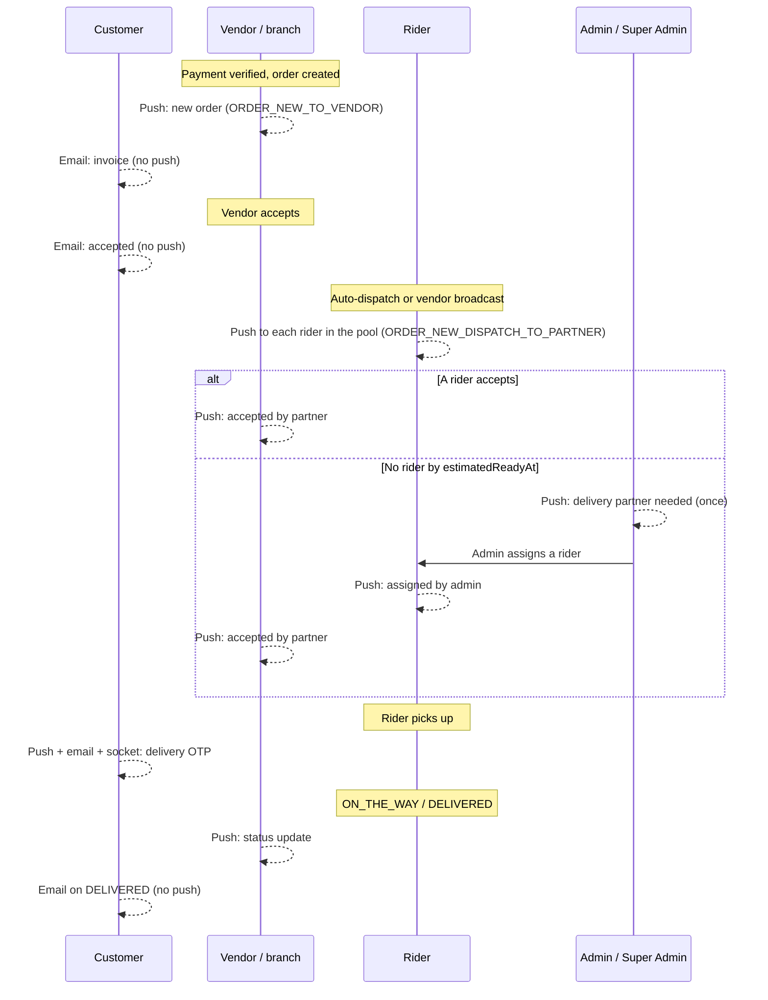

# Notification Triggers and Templates

This page lists what actually sends a notification. Each row was traced from the
call site, not from the template: a message key that is defined but has no caller
is listed separately under
[Templates and types that exist but are not used](#templates-and-types-that-exist-but-are-not-used).
How the notification service, the data model, FCM tokens and the read/delete APIs
work is on [Notifications](./notifications.md).

Paths are relative to `src/app/`. "Push + record" means a push to the recipient's
FCM tokens and a `Notification` document, through `NotificationService`. Order
transition rules themselves live in [Order Lifecycle](../03-orders/order-lifecycle.md)
and [Delivery and Dispatch](../03-orders/delivery-dispatch.md); this page records
only which transition notifies whom.

**Findings in one paragraph.** Of the 44 message
templates, 43 are sent and one (`ORDER_NEED_MORE_TIME_TO_CUSTOMER`) has no caller.
A customer gets a push for only a few order events (vendor rejection, pickup-ready
with code, pickup reminder, delivery OTP, and the delivery-exception messages: the
receipt confirmation request, a new code after a rider replacement, a fault
cancellation); most customer order updates are
email-only or realtime-only. No order notification targets a fleet manager. Nothing
sends SMS or WhatsApp notifications.

---

## Order notifications

### Who is notified at each step of a delivery order

### Order trigger table

All rows are push + record with type `ORDER` unless noted. `data.orderId` is the
**display** order id (for example `ORD-...`), not the Mongo id. Sending functions
are in `modules/Order/order.service.ts` unless another file is named.

| Event | Recipient | Message key | Channel / `data` keys | Guards and notes |
| --- | --- | --- | --- | --- |
| Order created after a verified payment (`NEW_ORDER_POST_PROCESS` job, `order.worker.ts` `processNewOrderPostProcess`) | The owning vendor or branch row (`vendorUserId` of the order) | `ORDER_NEW_TO_VENDOR` | `order_notification`; `orderId` | Sent after the invoice sync and the invoice email in the same job, so those awaits delay it. Does not notify a parent vendor. |
| Vendor rejects from `PENDING` (`updateOrderStatusByVendor`) | Customer | `ORDER_REJECTED_TO_CUSTOMER` | `default`; `orderId` | Also an email (`REJECTED`). Needs the customer's `userId`. |
| Pickup order becomes `READY_FOR_PICKUP`, by vendor action or auto-ready cron (`applyReadyForPickupEffects`) | Customer | `ORDER_PICKUP_CODE_TO_CUSTOMER` | `default`; `orderId`, `status` | Only when the order is a pickup order with a code. The code is in the push body and stored text. Also an email (`PICKUP_CODE`). |
| Pickup ~15 min away (`cron/order.cron.ts` `handlePickupTimeReminderCron`, every 5 min) | Customer | `ORDER_PICKUP_TIME_REMINDER_TO_CUSTOMER` | `default`; `orderId`, `type: PICKUP_TIME_REMINDER` | Guarded by `pickup.reminderSentAt`, which is written **before** the push, so a failed push is not retried. |
| Customer cancels (`cancelOrderByCustomer`) | Vendor | `ORDER_CANCELED_BY_CUSTOMER_TO_VENDOR` | `default`; `orderId` | Sent unless the order was already `PICKED_UP` or `ON_THE_WAY`. |
| Customer cancels | Assigned rider | `ORDER_CANCELED_BY_CUSTOMER_TO_RIDER` | `default`; `orderId` | Only when a rider is assigned (`ASSIGNED`, `PREPARING`, `READY_FOR_PICKUP`, `PICKED_UP`, `ON_THE_WAY` with a partner on the order). Riders who merely received an offer are not told. |
| Dispatch offer: auto-dispatch, retry, vendor broadcast (`dispatchOrderToPartners`) | Each rider in the offered pool (up to 10) | `ORDER_NEW_DISPATCH_TO_PARTNER` | `order_notification`; `orderId`, `orderStatus`, `deliveryDetails`, `vendorName`, `vendorBusinessLocation`, `customerName`, `deliveryAddress` (the last three and `deliveryDetails` are JSON strings) | Each retry sends again; there is no deduplication. The offer is delivered by push only, there is no socket event. Pool selection is in [Delivery and Dispatch](../03-orders/delivery-dispatch.md). |
| Rider accepts an offer (`partnerAcceptsDispatchedOrder`) | Vendor | `ORDER_ACCEPTED_BY_PARTNER_TO_VENDOR` | `default`; `orderId`, `orderStatus`, `type: ORDER_STATUS` | Also socket `ORDER_ACCEPTED_BY_PARTNER` to the vendor. |
| Dispatch deadline reached with no rider (`autoEscalateDispatchOrder`) | Every `ADMIN` / `SUPER_ADMIN` that has a token (`sendToRole`) | `ORDER_DISPATCH_ESCALATED_TO_ADMIN` | `order_notification`; `orderId`, `orderStatus` | Once per order (`dispatchEscalatedAt` latch). Admins without a token get no push and no record. |
| Delivery order auto-marked `READY_FOR_PICKUP` because the vendor did not confirm within 5 minutes of `estimatedReadyAt` (`autoReadyOrder`, fallback) | Every `ADMIN` / `SUPER_ADMIN` that has a token (`sendToRole`) | `ORDER_AUTO_READY_FALLBACK_TO_ADMIN` | `order_notification`; `orderId`, `orderStatus` | Sent once, by the cron run that wins the status update. Also sent for a pickup order that the fallback marks ready. Not sent when the vendor marked the order ready. |
| Same fallback, delivery order | The assigned rider | `ORDER_AUTO_READY_TO_PARTNER` | `order_notification`; `orderId`, `orderStatus`, `type: ORDER_STATUS` | Only for the fallback, to the claim winner. A vendor's manual ready, or the release of a vendor-confirmed order at assignment, sends no rider push. |
| Admin assigns a rider (`assignDeliveryPartnerByAdmin`) | Rider | `ORDER_ASSIGNED_BY_ADMIN_TO_PARTNER` | `order_notification`; `orderId`, `orderStatus`, `type: ORDER_STATUS` | |
| Same call | Vendor | `ORDER_ACCEPTED_BY_PARTNER_TO_VENDOR` | `default`; same keys | Plus socket `ORDER_ACCEPTED_BY_PARTNER`. |
| Rider sets `PICKED_UP`, OTP generated (`updateOrderStatusByDeliveryPartner`) | Customer | `DELIVERY_OTP_TO_CUSTOMER` | `default`; `orderId`, `orderStatus`, `type: ORDER_STATUS` | OTP is in the push body, the stored message and the `DELIVERY_OTP_GENERATED` socket payload. Also an email (`DELIVERY_CODE`). |
| Rider status `ON_THE_WAY` or `DELIVERED` (`PROCESS_ORDER_POST_UPDATE` job, `order.worker.ts` `processOrderPostUpdate`) | Vendor | `ORDER_STATUS_UPDATE_TO_VENDOR` | `default`; `orderId`, `orderStatus`, `type: ORDER_STATUS` | Runs after the settlement transaction; an error in the notification block is caught and logged. |

Rider SOS, delivery OTP lock, verification issue, receipt confirmation, rider replacement, manual completion and fault-cancel notifications are listed in [Delivery Exceptions and Verification](../03-orders/delivery-exceptions.md#notifications-and-events).

Everything above is notification-side. The rules that decide whether the
transition happens at all are in [Order Lifecycle](../03-orders/order-lifecycle.md).

### Vendor notifications (summary)

A vendor or branch receives: new order, customer cancellation, rider accepted or
assigned, and the `ON_THE_WAY` / `DELIVERED` status updates (table above); stock
alerts, account and correction messages, payout messages, agreement versions and
broadcasts (below). Orders notify the row that owns the order. A parent vendor is
not notified about its branches' orders, matching the order-visibility rule in
[Vendors and Branches](../04-vendors/vendors-and-branches.md).

### Rider notifications (summary)

A rider receives dispatch offers, admin assignments, the auto-ready fallback push and
(when assigned) a customer cancellation, plus the delivery-exception messages
(acknowledged, resolved, OTP reset, handover, replaced, canceled by an admin), plus account, correction, payout and broadcast messages. A rider
**does not** receive a push for `REASSIGNMENT_NEEDED` or for a dispatch offer being
withdrawn; the realtime `REMOVE_ORDER_POPUP` socket event handles the popup.

### Admin and fleet manager notifications (summary)

Admins and super admins receive dispatch escalation, the auto-ready fallback alert, the
delivery-exception alerts (rider SOS, OTP lock, verification issue, customer receipt
answer; `SUPER_ADMIN` alone also gets a manual completion by an `ADMIN`), approval submissions,
correction confirmations and ingredient purchases through `sendToRole` (delivery
ignores permission codes). **Fleet managers receive no order notification.** They
receive account, correction, payout and agreement messages and broadcasts.

---

## Account and approval notifications

Sources are in `modules/Auth/auth.service.ts`. The pushes are sent after the
transaction commits; `data` here is `{ userId, role }` where `userId` is the
**profile `_id`** (not `AuthUser.userId`).

| Event | Recipient | Message key | Type | Also sent |
| --- | --- | --- | --- | --- |
| User submits their profile for approval (`submitForApproval`; vendor, branch, rider, fleet manager, admin roles) | All `ADMIN` / `SUPER_ADMIN` with a token | `NEW_SUBMISSION_FOR_APPROVAL_TO_ADMIN` | `ACCOUNT` | An email to the **submitting user's own address** ("New ... Submission for Approval", template `user-approval-submission-notification`), not to admins. |
| Admin approves, rejects or blocks (`approvedOrRejectedUser`, status enum `APPROVED` / `REJECTED` / `BLOCKED`) | The user | `ACCOUNT_STATUS_APPROVED` / `_REJECTED` / `_BLOCKED` | `ACCOUNT` | Email (template `user-approval-notification`) for the listed staff roles and for customers with an email. The push body is the admin's remarks; approval uses a default congratulation text when no remarks are given, rejection and block require remarks. |
| Admin requests corrections (`requestCorrections`) | The profile owner | `CORRECTION_REQUEST_TO_USER` | `ACCOUNT` | Email (`user-correction-request-notification`). |
| Owner confirms corrections (`confirmCorrections`; vendor, branch, fleet manager, rider) | All `ADMIN` / `SUPER_ADMIN` with a token | `CORRECTION_CONFIRMED_TO_ADMIN` | `ACCOUNT` | Push only. |

The state changes behind these are described in [User Lifecycle](../03-identity-access/user-lifecycle.md).

---

## Payout notifications

Sources are in `modules/Payout/payout.service.ts`. Recipients are the payout owner
(a rider, vendor or fleet manager).

| Event | Recipient | Message key | Type | Notes |
| --- | --- | --- | --- | --- |
| Fleet manager initiates a settlement for one of their own riders (`POST /payouts/initiate-settlement`, `FLEET_MANAGER` only) | The rider | `PAYOUT_SETTLEMENT_INITIATED` | `PAYOUT` | After the transaction commits. `data`: `amount`, `status`, `paymentMethod`. The request currently fails the `Payout` schema validation before this point, so the push is not reached (see [Payouts, Wallets and Transactions](../10-payments/payouts-wallets-transactions.md#manual-request-post-payoutsinitiate-settlement)). |
| Initiation blocked because bank name or IBAN is missing | The target user | `PAYOUT_BANK_DETAILS_INCOMPLETE` | `PAYOUT_ALERT` | Sent **before** the request fails with `CANNOT_INITIATE_SETTLEMENT_INCOMPLETE_BANK_DETAILS`. |
| Settlement finalized (`POST /payouts/finalize-settlement/:payoutId`; `ADMIN`, `SUPER_ADMIN`, `FLEET_MANAGER`) | The payout owner | `PAYOUT_SETTLEMENT_COMPLETED` | `PAYOUT` | After commit. `data`: `amount`, `status`, `paymentMethod`. |
| Daily 00:00 automated settlement (`cron/payout.cron.ts` calling `initiateAutomatedSettlement`; runs only when `payout.autoGenerate` is on and today is a payout day) skips a wallet owner with incomplete bank details | That user | `PAYOUT_BULK_BANK_DETAILS_INCOMPLETE` | `PAYOUT_ALERT` | Sent inside the loop **before** the surrounding transaction commits. Riders that belong to a fleet manager are skipped entirely. |

The automated run creates `PENDING` payouts but sends **no** "initiated"
notification for them; only the two failure/completion messages above exist.
Wallet and payout rules are outside this page.

---

## Other notification sources

| Source | Trigger | Recipient | Message key / type | Notes |
| --- | --- | --- | --- | --- |
| Agreement (`modules/Agreement/agreement.worker.ts`) | BullMQ job `NOTIFY_AGREEMENT_VERSION_PUBLISHED` on queue `agreement-queue`, enqueued in `agreement-version.service.ts` when a version is published | Each affected party (vendor or fleet manager) | `AGREEMENT_VERSION_PUBLISHED` / `AGREEMENT`; `data`: `agreementType`, `versionNumber` | The only caller of the awaited `deliverToUser`. Also an email. A party that no longer exists is skipped. Enqueue errors are logged and do not fail the publish. |
| Inventory (`Product/product.service.ts` `notifyVendorStockAlert`) | Admin calls `POST /products/notify-vendor/:productId` (`ADMIN`, `SUPER_ADMIN`) | The product's vendor | `PRODUCT_OUT_OF_STOCK` or `PRODUCT_LOW_STOCK` / `STOCK_ALERT`; `data`: `productId`, `sku` | **Manual only**: no stock threshold or stock change sends it automatically. Also an email (`low-stock-alert`, not logged). |
| Ingredients (`Ingredient-Order/ing-order.service.ts` `confirmIngredientOrder`) | Vendor's ingredient order confirmed | All `ADMIN` / `SUPER_ADMIN` with a token | `NEW_INGREDIENT_PURCHASE_TO_ADMIN` / `OTHER` (no type passed); `data`: `orderId` (the **Mongo id**), `type: INGREDIENT_ORDER` | The text carries the human order id; the `data.orderId` does not. |
| Cart (`cron/cart.cron.ts` `handleCartItemExpiryWarningCron`, every 5 min) | Cart items near the 12 h inactivity expiry and not yet notified | Customer | `CART_ITEM_EXPIRY_WARNING` / `OTHER`; `data`: `type`, `cartId` (the customer id string), `itemKeys` (JSON) | Also an email. Items are marked `isNotified`. The record becomes inactive when the cart changes (see [Notifications](./notifications.md#in-app-notification-apis)). |
| Admin broadcast | `POST /notifications/broadcast` | Selected roles or users | raw title/body / default `PROMOTIONAL` | See [Notifications](./notifications.md#admin-broadcast). |

---

## Who gets what, by role

| Role | Push + record notifications |
| --- | --- |
| `CUSTOMER` | `ORDER_REJECTED_TO_CUSTOMER`, `ORDER_PICKUP_CODE_TO_CUSTOMER`, `ORDER_PICKUP_TIME_REMINDER_TO_CUSTOMER`, `DELIVERY_OTP_TO_CUSTOMER`, `DELIVERY_RECEIPT_CONFIRMATION_TO_CUSTOMER`, `DELIVERY_PARTNER_CHANGED_TO_CUSTOMER`, `ORDER_FAULT_CANCELED_TO_CUSTOMER`, `CART_ITEM_EXPIRY_WARNING`, `ACCOUNT_STATUS_*` (if an admin changes their status), broadcasts |
| `VENDOR`, `SUB_VENDOR` | `ORDER_NEW_TO_VENDOR`, `ORDER_CANCELED_BY_CUSTOMER_TO_VENDOR`, `ORDER_ACCEPTED_BY_PARTNER_TO_VENDOR`, `ORDER_STATUS_UPDATE_TO_VENDOR`, `PRODUCT_LOW_STOCK` / `PRODUCT_OUT_OF_STOCK`, `ACCOUNT_STATUS_*`, `CORRECTION_REQUEST_TO_USER`, `PAYOUT_SETTLEMENT_COMPLETED`, `PAYOUT_BULK_BANK_DETAILS_INCOMPLETE`, `AGREEMENT_VERSION_PUBLISHED` (parent vendor), broadcasts |
| `DELIVERY_PARTNER` | `ORDER_NEW_DISPATCH_TO_PARTNER`, `ORDER_ASSIGNED_BY_ADMIN_TO_PARTNER`, `ORDER_CANCELED_BY_CUSTOMER_TO_RIDER`, `ORDER_AUTO_READY_TO_PARTNER`, `DELIVERY_EXCEPTION_ACKNOWLEDGED_TO_PARTNER`, `DELIVERY_EXCEPTION_RESOLVED_TO_PARTNER`, `DELIVERY_OTP_RESET_TO_PARTNER`, `ORDER_HANDOVER_ASSIGNED_TO_PARTNER`, `ORDER_HANDED_OVER_FROM_PARTNER`, `ORDER_CANCELED_BY_ADMIN_TO_PARTNER`, `ACCOUNT_STATUS_*`, `CORRECTION_REQUEST_TO_USER`, all four `PAYOUT_*` messages (riders under a fleet manager are skipped by the automated run), broadcasts |
| `FLEET_MANAGER` | `ACCOUNT_STATUS_*`, `CORRECTION_REQUEST_TO_USER`, `PAYOUT_SETTLEMENT_COMPLETED`, `PAYOUT_BULK_BANK_DETAILS_INCOMPLETE`, `AGREEMENT_VERSION_PUBLISHED`, broadcasts |
| `ADMIN`, `SUPER_ADMIN` | `ORDER_DISPATCH_ESCALATED_TO_ADMIN`, `ORDER_AUTO_READY_FALLBACK_TO_ADMIN`, `DELIVERY_SOS_TO_ADMIN`, `DELIVERY_OTP_LOCKED_TO_ADMIN`, `DELIVERY_VERIFICATION_ISSUE_TO_ADMIN`, `DELIVERY_RECEIPT_ANSWER_TO_ADMIN` (and `DELIVERY_MANUALLY_COMPLETED_TO_SUPER_ADMIN`, to `SUPER_ADMIN` only), `NEW_SUBMISSION_FOR_APPROVAL_TO_ADMIN`, `CORRECTION_CONFIRMED_TO_ADMIN`, `NEW_INGREDIENT_PURCHASE_TO_ADMIN`, broadcasts, and their own `ACCOUNT_STATUS_*` if another admin changes their status |

Support chat and a plain SOS reach admins (and fleet managers for SOS) only as socket events. A rider SOS on an order is also pushed to admins (`DELIVERY_SOS_TO_ADMIN`; see [Delivery Exceptions and Verification](../03-orders/delivery-exceptions.md#notifications-and-events)).

---

## Events that do not notify

Each of these was checked by looking for a `NotificationService` or email call on
the code path. Where the code carries a comment saying no notification is intended,
that is noted.

- **Vendor `CANCELED` of an accepted order** (before a rider is assigned): no push and no email to anyone; only the `ORDER_STATUS_UPDATED` socket event. The code comment says no customer notification is part of the spec. A vendor *rejection* does notify the customer.
- **Pickup `NO_SHOW`** (vendor action or the auto no-show cron): no push and no email to the customer or anyone else. The queued post-update job only settles the order.
- **Vendor accept and auto-accept**: customer gets an email (`ACCEPTED`) only; no push. `PREPARING`, `ASSIGNED` and `ON_THE_WAY` send nothing to the customer.
- **Rider `REASSIGNMENT_NEEDED`**: no push to the vendor or admins; the retry or escalation that follows is what eventually reaches an admin.
- **`DELIVERED`**: customer gets an email only (also for `PICKED_UP_BY_CUSTOMER`); no push.
- **Payment intent, payment failure, refund**: no push. The admin refund sends the customer an email (`refund-success`, not logged) and does not create a `Notification`.
- **Rating, offers, referrals, points, wallet credits, profile changes, support and a plain SOS**: no `NotificationService` call; the rider SOS on an order is the exception, see [Delivery Exceptions and Verification](../03-orders/delivery-exceptions.md#notifications-and-events) (see [Points and Referrals](../09-offers-and-coupons/points-and-referrals.md), [Support](../02-platform/support.md) and [SOS](../02-platform/sos.md)).

---

## Template inventory

Templates are objects `{ title: { en, pt }, body: { en, pt } }`, where each value is
a string or a function of the variables. They are aggregated in
`utils/notificationTemplates.ts` into `pushNotificationMessages`; the type
`TPushMessageKey` is the set of keys, so a caller cannot use a key that does not
exist. Both languages exist for all 44 keys (the earlier executed check imported the
aggregate and printed every template).

| Defining file | Keys | Sent? |
| --- | --- | --- |
| `modules/Order/order.pushMessages.ts` | `ORDER_PICKUP_CODE_TO_CUSTOMER`, `ORDER_REJECTED_TO_CUSTOMER`, `ORDER_CANCELED_BY_CUSTOMER_TO_VENDOR`, `ORDER_CANCELED_BY_CUSTOMER_TO_RIDER`, `ORDER_NEW_DISPATCH_TO_PARTNER`, `ORDER_DISPATCH_ESCALATED_TO_ADMIN`, `ORDER_AUTO_READY_FALLBACK_TO_ADMIN`, `ORDER_AUTO_READY_TO_PARTNER`, `ORDER_ASSIGNED_BY_ADMIN_TO_PARTNER`, `ORDER_ACCEPTED_BY_PARTNER_TO_VENDOR`, `ORDER_NEW_TO_VENDOR`, `ORDER_STATUS_UPDATE_TO_VENDOR`, `DELIVERY_OTP_TO_CUSTOMER`, `ORDER_PICKUP_TIME_REMINDER_TO_CUSTOMER`, and the delivery-exception keys `DELIVERY_SOS_TO_ADMIN`, `DELIVERY_OTP_LOCKED_TO_ADMIN`, `DELIVERY_EXCEPTION_ACKNOWLEDGED_TO_PARTNER`, `DELIVERY_EXCEPTION_RESOLVED_TO_PARTNER`, `DELIVERY_OTP_RESET_TO_PARTNER`, `ORDER_HANDED_OVER_FROM_PARTNER`, `ORDER_HANDOVER_ASSIGNED_TO_PARTNER`, `DELIVERY_PARTNER_CHANGED_TO_CUSTOMER`, `ORDER_FAULT_CANCELED_TO_CUSTOMER`, `ORDER_CANCELED_BY_ADMIN_TO_PARTNER`, `DELIVERY_MANUALLY_COMPLETED_TO_SUPER_ADMIN`, `DELIVERY_VERIFICATION_ISSUE_TO_ADMIN`, `DELIVERY_RECEIPT_CONFIRMATION_TO_CUSTOMER`, `DELIVERY_RECEIPT_ANSWER_TO_ADMIN` | Yes (28) |
| `modules/Order/order.pushMessages.ts` | `ORDER_NEED_MORE_TIME_TO_CUSTOMER` | **No caller** |
| `modules/Auth/auth.pushMessages.ts` | `NEW_SUBMISSION_FOR_APPROVAL_TO_ADMIN`, `ACCOUNT_STATUS_APPROVED`, `ACCOUNT_STATUS_REJECTED`, `ACCOUNT_STATUS_BLOCKED`, `CORRECTION_REQUEST_TO_USER`, `CORRECTION_CONFIRMED_TO_ADMIN` | Yes (6). The three `ACCOUNT_STATUS_*` keys are built from the status at run time (`` `ACCOUNT_STATUS_${status}` ``) and all three statuses are valid input. |
| `modules/Payout/payout.pushMessages.ts` | `PAYOUT_BANK_DETAILS_INCOMPLETE`, `PAYOUT_BULK_BANK_DETAILS_INCOMPLETE`, `PAYOUT_SETTLEMENT_INITIATED`, `PAYOUT_SETTLEMENT_COMPLETED` | Yes (4) |
| `modules/Product/product.pushMessages.ts` | `PRODUCT_OUT_OF_STOCK`, `PRODUCT_LOW_STOCK` | Yes (2), admin-triggered |
| `modules/Ingredient-Order/ing-order.pushMessages.ts` | `NEW_INGREDIENT_PURCHASE_TO_ADMIN` | Yes (1) |
| `modules/Cart/cart.pushMessages.ts` | `CART_ITEM_EXPIRY_WARNING` | Yes (1) |
| `modules/Agreement/agreement.pushMessages.ts` | `AGREEMENT_VERSION_PUBLISHED` | Yes (1) |

Notes that matter when editing templates:

- No key is defined in two files (executed check), so the aggregate spread cannot shadow a key.
- Some bodies are empty or generic on purpose: `ACCOUNT_STATUS_*` and `CORRECTION_REQUEST_TO_USER` use the admin's remarks as the body; `ORDER_ACCEPTED_BY_PARTNER_TO_VENDOR` has a fixed body and puts the status label in the title.
- The `ORDER_STATUS_UPDATE_TO_VENDOR` title shows the raw status string (for example `ON_THE_WAY`) rather than the `ORDER_STATUS_LABEL` text used by the rider-accepted message.
- **Not the same system:** API messages and errors live in `errors/messages.ts` and `*.messages.ts` (for example `notification.messages.ts` holds the responses of the notification endpoints) and are unrelated to push templates. Order email wording lives in `modules/Order/order.emails.ts`, and other emails use Handlebars templates through `EmailHelper`.

### Templates and types that exist but are not used

| Item | Status |
| --- | --- |
| `ORDER_NEED_MORE_TIME_TO_CUSTOMER` | Template with `extensionMinutes`; no caller found. The code that added preparation extension minutes to global settings was removed earlier, which is the likely reason (**Inferred**). |
| `type` values `OFFER`, `SYSTEM`, `TRANSACTION` | Valid in the model and in the broadcast validation, but no code path uses them. |
| `channelId` `order_notification` | Used by the order-operations pushes (new order to vendor, dispatch offer, dispatch escalation and auto-ready alerts, admin assignment, and the delivery-exception pushes to admins, riders and the receipt request to the customer); everything else is `default` (see [Notifications](./notifications.md#notification-data-model)). |
| `sendTestPushNotification` payload `type: SYSTEM_ALERT` | Only the debug endpoint; nothing is stored. |

---

## Emails that accompany notifications

Email is a separate mechanism (`EmailHelper`, Nodemailer with a circuit breaker).
It does not create a `Notification` and is not sent for every push.

| Event | Email | Logged in `EmailLog` |
| --- | --- | --- |
| Order created | Receipt email to the customer from `order.invoice.ts` (`sendInvoiceEmailWithAttachment`), sent by the post-process job. It carries a signed invoice download link, and for pickup orders the **pickup code and time**. No attachment is passed to `sendEmail`. | No (`shouldLog: false`) |
| Vendor accept or auto-accept | `ACCEPTED` | Yes |
| Vendor rejection | `REJECTED` | Yes |
| Pickup ready | `PICKUP_CODE` | Yes |
| Rider picked up | `DELIVERY_CODE` | Yes |
| `DELIVERED` and `PICKED_UP_BY_CUSTOMER` | `DELIVERED` (includes points earned) | Yes |
| Admin refund processed | `refund-success` | No (`shouldLog: false`) |
| Cart expiry warning | `sendCartExpiringEmail` | Yes |
| Agreement version published | `sendAgreementVersionPublishedEmail` | Yes |
| Admin stock alert | `low-stock-alert` | No |
| Approval submission, approve/reject/block, correction request | Templates listed above | Yes |
| Broadcast (`EMAIL` or `BOTH`) | `broadcast-email` | Yes |

The five order emails (`ACCEPTED`, `PICKUP_CODE`, `DELIVERY_CODE`, `REJECTED`,
`DELIVERED`) share one Handlebars template, are localized with the customer's cached
language and are threaded by `Order.emailThreadMessageId`. Order emails are sent
through `sendOrderNotificationEmail`, which swallows and logs its own errors.

---

## Failure behavior specific to triggers

- **Vendor new-order push depends on job order.** It is the third step of `NEW_ORDER_POST_PROCESS`, after the invoice sync and the invoice email, and before cart cleanup. Invoice sync swallows its own errors, so it does not block the push; its latency does delay it (magnitude not measured).
- **Duplicate new-order pushes on retry (Inferred).** The job's outer `catch` rethrows, and the order queue retries three times. If cart cleanup throws after the push was sent, a retry can send the vendor push and the invoice email again. No guard exists for this.
- **Dispatch retries re-notify.** Each retry dispatch sends a new offer push to its pool with a new record.
- **Escalation notifies admins once per order**; if no admin has a token, nothing is delivered and nothing is recorded.
- **Order notifications are best-effort.** They are fired after the transaction commits, and any failure is logged only. A missed push never blocks or rolls back the order transition.

---

## Unverified or inferred behavior

- **Client behavior.** That apps render the data-only push, use `channelId`, and use `isRead=false` with `meta.total` as a badge.
- **Redis failure path** in `getUserLanguageCache` (whole notification lost): read from code, not executed.
- **Shared-device push leakage** between accounts: read from code (tokens are not cleared on logout and delivery ignores `isLoggedIn`), not executed.
- **Agreement-gate effect on notification writes**: the base-URL mismatch was executed with an Express probe; the resulting `403 AGREEMENT_RESIGN_REQUIRED` for a real vendor with an unsigned agreement was not run against a database.
- **Retry duplication** of the agreement and new-order jobs: read from queue configuration and the `catch` structure; not reproduced.
- **Email delivery** beyond the send call (SMTP availability, template rendering) was not exercised.

---

## Related documentation

- [Notifications](./notifications.md): service architecture, data model, FCM tokens, read/delete APIs, broadcast, failure handling.
- [Notification Flow](../02-platform/notification-flow.md): implementation walkthrough and source map.
- [Order Lifecycle](../03-orders/order-lifecycle.md): statuses and transitions.
- [Delivery and Dispatch](../03-orders/delivery-dispatch.md): rider pools, offers, escalation and manual assignment.
- [Order Automation](../03-orders/order-automation.md): the crons behind auto-accept, auto-ready and reminders.
- [User Lifecycle](../03-identity-access/user-lifecycle.md): submission, approval and correction states.
- [Vendors and Branches](../04-vendors/vendors-and-branches.md): branch ownership and order visibility.
- [Products and Categories](../05-products/products.md): stock fields behind the admin stock alert.
