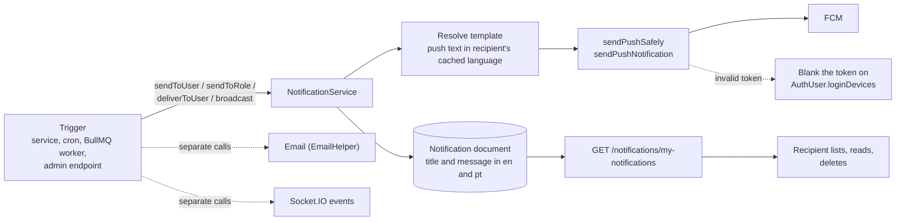

# Notifications

This page describes the notification system as the code implements it today: the
one service every module calls, the `Notification` collection it writes, how FCM
push and device tokens work, who can read and delete notifications, and where
delivery can silently fail. **Which event sends which notification, and every
message template, is on [Notification Triggers and Templates](./notification-triggers.md).**

Paths are relative to `src/app/`. Statements come from the code unless marked
**Inferred** (read from code but not executed) or **History**. Behavior that I
ran is marked **Executed**.

There is already an implementation walkthrough with a source map at
[Notification Flow](../02-platform/notification-flow.md). This section was
re-verified against the code for this pass and is organised for readers who want
the model, the roles, the APIs and the failure modes first; where a detail is
better read there (service internals, retention), this page links to it.

---

## At a glance

| Question | Answer |
| --- | --- |
| Is there one notification system? | Yes: `NotificationService` (`modules/Notification/notification.service.ts`). Every push and every in-app record goes through it. The call sites are spread over the order, auth, payout, product, ingredient-order, cart and agreement modules, the cron jobs and the admin broadcast controller. |
| Where are notifications stored? | MongoDB `Notification` collection. No index, no TTL, no cleanup job. |
| Push channel | FCM, **data-only** messages, sent to every FCM token stored on the user's `loginDevices`. |
| Does a push guarantee a record (or the reverse)? | No. A record is written after the push attempt whether or not the push worked. `sendToRole` writes a record only for users who have a token. |
| Is delivery reliable? | No guarantee. `sendToUser` is fire-and-forget, nothing retries, and failures are only logged. |
| Email | Sent by separate calls next to some notifications. It is **not** part of `NotificationService` (except the admin broadcast). |
| SMS / WhatsApp | **No notification SMS or WhatsApp.** BulkGate (`utils/sendMobileOtp.ts`) is called only from Auth and Profile to send OTP codes. |
| Realtime | `NotificationService` never emits Socket.IO events. Order and support alerts use separate, non-persisted socket events (see [Realtime events](#realtime-events-beside-notifications)). |
| Unread count | No endpoint. Only `isRead=false` as a list filter. |
| Who can receive | Any role with an `AuthUser` record; see [Who can receive and read notifications](#who-can-receive-and-read-notifications). |

---

## Architecture

The four entry points in `notification.service.ts`:

| Function | Recipients | Behavior |
| --- | --- | --- |
| `sendToUser(userId, content, data, channelId, type)` | One `AuthUser` | Wraps `deliverToUser` in `setImmediate`. Errors are only logged. The caller never awaits and never sees a failure. |
| `deliverToUser(...)` | One `AuthUser` | Same work, awaitable. Used directly only by the agreement worker. |
| `sendToRole(roles, content, data, channelId, type)` | Every non-deleted `AuthUser` with one of the roles **and** at least one non-empty `fcmToken` | Runs in `setImmediate`. Users without a token are not selected: no push **and no record**. |
| `sendBroadcastNotification(payload)` | Admin-selected roles/users | See [Admin broadcast](#admin-broadcast). |

Order of operations inside `deliverToUser`:

1. Load the `AuthUser` by the custom string `userId`. If none exists, return silently.
2. Read the user's language from Redis (`user:lang:<userId>`, default `en`) and resolve the push text.
3. Collect the non-empty `loginDevices[].fcmToken` values, de-duplicated. With none, log a warning and skip the push.
4. Send one push per token (`Promise.allSettled`).
5. Write the `Notification` document with the text resolved for **every** supported language.

The record is created after the push attempt, so a push failure never prevents the record, and a slow FCM call delays the record (the circuit breaker times an FCM call out at 8 s). Callers invoke the service after their own database transaction has committed; the notification write is never part of a business transaction.

---

## Notification data model

`modules/Notification/notification.model.ts` (`timestamps: true`, no explicit indexes):

| Field | Type | Notes |
| --- | --- | --- |
| `receiverId` | string, required | The recipient's **`AuthUser.userId`** (custom id such as `C-...`), not an ObjectId. Every ownership check compares against `currentUser.userId`. |
| `receiverRole` | string enum of `USER_ROLE`, required | Copied from `AuthUser.role` when the record is created. |
| `title`, `message` | `{ en, pt }`, both required | Resolved from the template for every supported language at creation. |
| `type` | enum, default `OTHER` | See the type table below. |
| `data` | free-form object | String map sent as the FCM `data` payload and stored. Its own `data.type` (for example `ORDER_STATUS`) is independent of the `type` column. |
| `isRead` | boolean, default `false` | Changed only by the mark-read endpoints. |
| `isActive` | boolean, default `true` | Set to `false` only for cart-expiry warnings. |
| `isDeleted` | boolean, default `false` | Soft-delete flag. |

`type` values (`notificationTypes`) and whether any code sends them:

| `type` | Sent by | Notes |
| --- | --- | --- |
| `ORDER` | Order flows, dispatch, cancellation, escalation | Main order category. |
| `ACCOUNT` | Approval submission, approve/reject/block, correction request/confirmation | |
| `PAYOUT` | Settlement initiated / completed | |
| `PAYOUT_ALERT` | Bank details incomplete (manual and automated settlement) | |
| `STOCK_ALERT` | Admin stock alert to a vendor | |
| `AGREEMENT` | Agreement version published | |
| `OTHER` | Cart-expiry warning, ingredient purchase to admins, and every call that omits `type` | Default. |
| `PROMOTIONAL` | Admin broadcast default | The broadcast `type` field accepts any value in this list, so a broadcast can carry a different type. |
| `OFFER`, `SYSTEM`, `TRANSACTION` | **Nothing** | Allowed by the enum, no sender found. |

`channelId` is not stored. It travels only inside the FCM `data` payload and is `order_notification` for the order-operations pushes (new order to vendor, rider dispatch offer, dispatch escalation and auto-ready alerts to admins and the rider, admin assignment to rider, and the delivery-exception pushes to admins, riders and the receipt confirmation request to the customer); every other call uses `default`.

---

## Who can receive and read notifications

**Receiving.** A recipient is an `AuthUser` identified by `userId`. The service does not look at role, approval status or login state when delivering to a named user, only at the tokens stored on the account. `sendToRole` adds `isDeleted: false` and the token requirement; it does not filter by approval status, `isLoggedIn`, or (for admins) permission codes.

| Role | Receives (see the triggers page for conditions) |
| --- | --- |
| `CUSTOMER` | Order rejected, pickup code, pickup reminder, delivery OTP, cart-expiry warning; account status if an admin changes it; admin broadcasts. |
| `VENDOR` and `SUB_VENDOR` | New order, rider accepted/assigned, delivery status updates, customer cancellation, stock alerts, account/correction messages, payout messages, agreement version (parent vendor only), broadcasts. Orders notify the **branch row that owns the order**, not its parent. |
| `DELIVERY_PARTNER` | Dispatch offer, admin assignment, customer cancellation after assignment, account/correction messages, payout messages, broadcasts. |
| `FLEET_MANAGER` | Account/correction messages, payout messages, agreement version, broadcasts. **No order notification** targets a fleet manager. |
| `ADMIN` and `SUPER_ADMIN` | Approval submissions, correction confirmations, dispatch escalation, ingredient purchases, broadcasts (as recipients of `sendToRole`). Delivery does not check permission codes such as `CAN_MANAGE_ORDERS`. |

**Reading and deleting.** Every `/notifications` route except `POST /notifications/broadcast` accepts all seven roles at the route level; ownership is then enforced in the service. The endpoint list is in [In-app notification APIs](#in-app-notification-apis).

---

## FCM token registration and management

Tokens live on the per-device entry in `AuthUser.loginDevices[]` (`constant/GlobalModel/user.model.ts`): one entry per `deviceId`, field `fcmToken` (default `''`). See [Authentication](../03-identity-access/authentication.md#flow-fcm-token--device-handling) for the session model.

| Path | What happens |
| --- | --- |
| Password login, OTP verification, social login | `deviceDetails.fcmToken` is written onto the device entry. On OTP verification of an existing device the **whole entry is replaced**, so a request without `fcmToken` resets it to `''`. |
| `POST /auth/update-fcm-token` | Body `{ token, deviceId }`. Updates the device whose `deviceId` matches for the caller's `profileId`, and also sets `isLoggedIn: true` and `lastLogin`. `404 DEVICE_NOT_REGISTERED` if the device is unknown; `400 FCM_REQUIRED` if either field is missing. No Zod validation middleware on this route. |
| Logout | `isLoggedIn: false`, `lastLogout` set. The **token is not cleared**. |
| Password reset | Marks every device `isLoggedIn: false`. Tokens stay. |
| Invalid-token cleanup | `sendPushSafely` blanks the token (see below). The only automatic removal. |

Consequences of the code:

- Push delivery **never checks `isLoggedIn`**. A logged-out device keeps receiving pushes until FCM reports its token invalid.
- **Inferred:** if two accounts have used the same device, the first account keeps the same token after logout, so both accounts' pushes can reach that device.
- Several devices per user are supported. Duplicate tokens within one user are collapsed before sending.
- **Agreement gate (Executed for the path check, Inferred for the outcome).** `POST /auth/update-fcm-token` and the mark-read/delete notification routes are non-`GET` requests. The exempt-path list in `AGREEMENT_GATE_EXEMPT_PREFIXES` names `/api/v1/auth/update-fcm-token` and `/api/v1/notifications/my-notifications`, but the gate compares `req.baseUrl`, which is only the router mount (`/api/v1/auth`, `/api/v1/notifications`). A probe Express app with the same mounting printed those base URLs, and neither prefix matches them. So an approved vendor or fleet manager whose current agreement is unsigned is expected to get `403 AGREEMENT_RESIGN_REQUIRED` on the token update and on every notification write, while `GET /notifications/my-notifications` still works because it is a `GET` and not an order route. Only `/api/v1/agreements` and `/api/v1/uploads` match in practice. I did not run the full gate against a database.

---

## Push notification flow

`utils/sendPushNotification.ts`:

- **Data-only message.** No FCM `notification` block. `data` carries `title`, `body`, `imageUrl` (empty string when absent), `sound` (`default`), `channelId`, then the caller's `data` spread last (so a caller key named `title` would overwrite the title). The client app must render the notification itself. All values must be strings.
- **Platform settings.** Android priority `high`; APNs `apns-priority: 5` with `content-available`.
- **Circuit breaker.** `fcm.send` runs through `fcmBreaker` (8 s timeout, 20 s reset, `opossum`). Errors that mean "bad token" are filtered so they do not count toward opening the breaker. With the breaker open, calls fail fast and are only logged; the record is still written.
- **Local token check.** A token that is empty, equals `malmo`, or is shorter than 20 characters is rejected before calling FCM with code `messaging/invalid-argument`.
- **Invalid-token cleanup.** On `registration-token-not-registered`, `invalid-registration-token`, `invalid-argument`, `mismatched-credential`, or an error message containing `not found`, `NotRegistered`, `not a valid FCM registration token` or `SenderId mismatch`, `sendPushSafely` runs `AuthUser.updateOne({ 'loginDevices.fcmToken': token }, { $set: { 'loginDevices.$.fcmToken': '' } })`. That updates one matching device entry. Any other error is logged; there is no retry.
- **Startup.** `config/firebase.ts` exits the process if `FIREBASE_SERVICE_ACCOUNT` is missing or not valid JSON.
- **Test endpoint.** `POST /test/send-notification` (`ADMIN`, `SUPER_ADMIN`) calls `sendTestPushNotification` with a hard-coded payload. It sends `data` only (no `title`/`body` inside `data`) plus an Android `notification` block, so it does **not** exercise the real data-only payload shape. Nothing is stored.

---

## In-app notification APIs

All routes are under `/api/v1/notifications`. Responses are localized with `req.lang` (`en` / `pt`); a legacy plain-string `title`/`message` passes through unchanged.

| Method and path | Roles | Behavior |
| --- | --- | --- |
| `GET /my-notifications` | all seven roles | Own notifications: base filter `receiverId = me` and `isActive != false`. |
| `GET /all` | all seven roles | Non-admin roles are forced to `receiverId = me`. `ADMIN` and `SUPER_ADMIN` see every notification and can filter by `receiverId`. No `isActive` or `isDeleted` base filter. |
| `PATCH /:id/read` | all seven roles | Marks one as read. Another user's notification gives `401 COMMON_ACCESS_DENIED`; an unknown id gives `404`. Works on soft-deleted and inactive rows. |
| `PATCH /mark-all-as-read` | all seven roles | `updateMany({ receiverId: me }, { isRead: true })`, including inactive and soft-deleted rows. |
| `DELETE /:id/soft-delete` | all seven roles | Sets `isDeleted: true` on a not-yet-deleted notification. Own rows only, except `SUPER_ADMIN` (any). `404 NOTIFICATION_NOT_FOUND_OR_ACCESS_DENIED` otherwise. |
| `DELETE /soft-delete` | all seven roles | Body `{ notificationIds: [...] }` (strict, at least one). Same ownership rule. Returns the modified count. |
| `DELETE /soft-delete-all` | all seven roles | Soft-deletes every not-yet-deleted notification of the caller. For `SUPER_ADMIN` the query has no `receiverId`, so it soft-deletes **everyone's**. |
| `DELETE /:id/permanent-delete`, `DELETE /permanent-delete`, `DELETE /permanent-delete-all` | route allows all seven roles | Service requires `SUPER_ADMIN` (`403 COMMON_ACCESS_DENIED`) and only removes rows that are already soft-deleted (`400` otherwise). The "all" form deletes every soft-deleted row platform-wide. |
| `POST /broadcast` | `ADMIN`, `SUPER_ADMIN` | See [Admin broadcast](#admin-broadcast). |

**Listing, searching and filtering** (`getMyNotifications`, `getAllNotifications`, both `QueryBuilder`):

- `searchTerm` matches `title.en`, `title.pt`, `message.en`, `message.pt` and `receiverRole` (escaped, case-insensitive).
- `page` and `limit` (default limit 10); `sortBy` (default `-createdAt`); `fields`.
- Any other top-level key is an equality filter: `isRead`, `type`, `isDeleted`, `receiverRole`. Object-valued query parameters are dropped. Keys already in the base filter (`receiverId`, `isActive` on `/my-notifications`) cannot be overridden by the client.
- `meta` carries `page`, `limit`, `total`, `totalPage`.

**Read and unread.** New notifications are unread. There is no per-notification "unread" endpoint and no unread counter; a client that wants a badge can request `isRead=false` with a small `limit` and read `meta.total` (**Inferred**: this is how the filter and `meta` behave, not a documented client contract). Reading is explicit (`PATCH`), never implied by listing.

**Deleted and inactive rows.** `/my-notifications` hides `isActive: false` rows but **not** `isDeleted: true` rows unless the client sends `isDeleted=false`. `isActive` goes `false` only for cart-expiry warnings, through `deactivateCartExpiryNotifications` (cart cleared, items removed, cart-expiry cron, and after an order is placed).

**Retention.** Nothing deletes old notifications. See [Notification Flow](../02-platform/notification-flow.md#10-notification-retention--cleanup).

---

## Admin broadcast

`POST /notifications/broadcast` (`ADMIN`, `SUPER_ADMIN`; the controller also writes a `NOTIFICATION_BROADCAST_SENT` activity log). The HTTP response returns immediately with `BROADCAST_PROCESSING_STARTED`; the work continues in the same Node process.

| Field | Rules |
| --- | --- |
| `communicationType` | `EMAIL`, `PUSH` or `BOTH`. |
| `targetAudience` | Non-empty array of strings. **Not** validated against the role enum; each value is upper-cased and matched to `AuthUser.role`, so an unknown role matches nobody and nothing reports it. |
| `customUserIds` | Optional array of `AuthUser.userId` to narrow each role. |
| `title` (1-100), `body` (1-1000) | `{name}` in the body is replaced with the profile's first name (`User` if missing). |
| `imageUrl`, `data`, `type` | Optional. `data` is a string record; `type` must be one of the model's types (default `PROMOTIONAL`). |

Behavior: one cursor per audience role, each processed in a `setImmediate` callback, one user at a time.

- For `PUSH` and `BOTH`, a push goes to the user's tokens with `data` plus `type`, channel `default`.
- For `EMAIL` and `BOTH`, the `broadcast-email` template is sent when the user has an email.
- **`BOTH` requires a token for the email too:** the user query adds the token condition whenever the type is not `EMAIL`, so a user with an email but no token gets neither.
- A `Notification` is written for **every** processed user, including users who received only an email. Title and body are copied to both `en` and `pt`; the stored `data` does not include `type`.
- Not queued: a process restart mid-broadcast loses the remainder. **Inferred** from the `setImmediate` design; no BullMQ job is involved.

---

## Realtime events beside notifications

`NotificationService` never touches Socket.IO, and there is no socket event that delivers a stored `Notification`. Related events that exist (none are persisted):

| Event | Room | Purpose |
| --- | --- | --- |
| `ORDER_STATUS_UPDATED` and other order events | `user_<userId>` rooms of customer, vendor and rider | Order progress; see [Order Tracking and Realtime](../03-orders/order-tracking-and-realtime.md). |
| `incoming-notification` | `admin-notifications-room` (joined by `ADMIN` / `SUPER_ADMIN` on connect) | A non-admin sent a support message. Payload: `ticketId`, `senderName`, `messagePreview`, `time`. |
| `new-sos-alert` | `SOS_ALERTS_POOL` | SOS triggered (`modules/Sos/sos.service.ts`). A plain SOS sends no push or record; a rider SOS on an order also pushes `ADMIN` / `SUPER_ADMIN` with a stored record. See [SOS](../02-platform/sos.md#notifications-and-realtime-events). |

Despite its name, `incoming-notification` is a chat alert, not a `Notification` document.

---

## Localization

- Languages: `en` and `pt`.
- **Push text** uses the recipient's cached language at send time, read from Redis `user:lang:<userId>` (written by the HTTP `auth` middleware from `Accept-Language` on each authenticated request, TTL 90 days; default `en`).
- **Stored text** is resolved for both languages at creation, so a user who switches language sees the new language in the list. Raw broadcast text is copied to both languages as written.
- A template key missing from `pushNotificationMessages` yields `title = key`, `body = ''` (and the same in storage). The type system prevents this for the current callers.
- Templates live in the per-module `*.pushMessages.ts` files and are aggregated in `utils/notificationTemplates.ts`; see [Notification Triggers and Templates](./notification-triggers.md#template-inventory).

---

## Guards, failure handling and edge cases

| Situation | What the code does |
| --- | --- |
| Recipient `userId` not found | `deliverToUser` returns; nothing is pushed or stored. |
| Recipient has no FCM token | Warning logged; a record **is** still created for a named user (`sendToUser`). `sendToRole` excludes token-less users entirely. |
| FCM rejects a token as invalid | Token blanked; no retry; the record is still created. |
| FCM slow or down | 8 s timeout per call; the breaker opens after repeated failures and then fails fast; the record is still created. |
| Redis unavailable | **Inferred:** `getUserLanguageCache` throws before the push and before the record. For `sendToUser` the whole notification is lost and only `sendToUser notification failed` is logged; for `sendToRole` that user is skipped. |
| Database write of the record fails | Caught by the `sendToUser` / `sendToRole` wrapper and logged. The push has already been sent. |
| Business flow fails after a notification was triggered | Order flows queue notifications after commit, so they do not fire for rolled-back work. Exception: the manual payout "bank details incomplete" alert (`PAYOUT_BANK_DETAILS_INCOMPLETE`) is sent **before** the request is rejected with `CANNOT_INITIATE_SETTLEMENT_INCOMPLETE_BANK_DETAILS`, so the user is told why even though the request failed. |
| Duplicate triggers | No deduplication. Guards exist only for the pickup reminder (`pickup.reminderSentAt`), the dispatch escalation (`dispatchEscalatedAt`) and the cart warning (`isNotified` on cart items). The agreement worker job is retried by BullMQ; whether a retry after a late failure can create a second record was not traced. |
| Sensitive data | The pickup code and the delivery OTP are placed in the push body and therefore in the stored `message`; the OTP is also in the `DELIVERY_OTP_GENERATED` socket payload. |
| Long-running work | `sendToRole` loads the whole matching audience at once (no cursor). Broadcast uses a cursor but processes users serially. |

---

## Gaps and inconsistencies

1. **No unread counter and no retention.** Clients must filter; the collection grows forever.
2. **Soft-deleted notifications appear in `/my-notifications`** unless `isDeleted=false` is sent; `/all` has no base filter at all.
3. **`POST /notifications/broadcast` types:** `TBroadcastNotificationPayload.targetAudience` is typed as a single role string, but validation and the service treat it as an array of arbitrary strings.
4. **Agreement gate exemptions do not match** (see above and the [gate page](../07-agreements/agreement-gate.md#the-exemption-check-does-not-match-as-documented)).
5. **Logged-out devices keep receiving pushes**, and tokens are not removed on logout.
6. **`401` rather than `403`** when marking another user's notification as read, unlike permanent deletion (`403`).
7. **Templates that are never sent and types that have no sender** are listed on the [triggers page](./notification-triggers.md#templates-and-types-that-exist-but-are-not-used).
8. **Support and plain SOS "notifications"** are socket alerts only; nothing reaches an admin who is not connected. A rider SOS on an order is also pushed to admins.
9. **Vendor cancellation of an accepted order** sends nothing to the customer (see the [triggers page](./notification-triggers.md#events-that-do-not-notify)).

---

## Related documentation

- [Notification Triggers and Templates](./notification-triggers.md): every verified sender, per-role view, template inventory, emails that accompany pushes.
- [Notification Flow](../02-platform/notification-flow.md): the implementation walkthrough and source map.
- [Authentication](../03-identity-access/authentication.md): `loginDevices`, device limits and the FCM update flow.
- [Authorization](../03-identity-access/authorization.md): roles and the agreement gate.
- [Order Lifecycle](../03-orders/order-lifecycle.md) and [Order Tracking and Realtime](../03-orders/order-tracking-and-realtime.md): the order transitions and socket events that surround order notifications.
