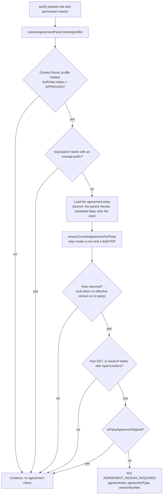
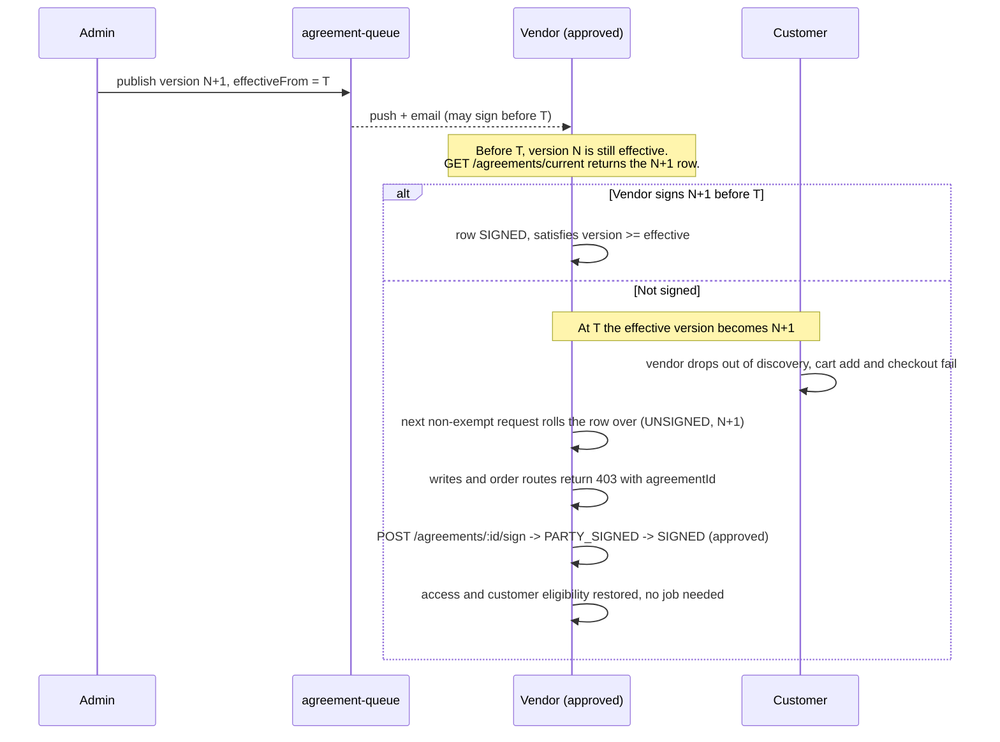

# Agreement Gate and Party Resolution

This page answers two questions precisely: **when is an agreement required**, and
**when is it considered signed**. It then describes the gate in `auth()` and every
place that reads the answer. The agreement model, versions and signing flow are on
[Agreements](./agreements.md).

Paths are relative to `src/app/`. Statements come from the committed code unless
marked **Inferred** (read from code, not run) or **Executed** (a probe ran the real
function or a mounted Express router). Uncommitted working-tree features are not
described.

---

## Short answers

| Question | Answer |
| --- | --- |
| Who needs an agreement? | A `VENDOR` (vendor agreement) and a `FLEET_MANAGER` (fleet manager agreement). A `SUB_VENDOR` is covered by its **parent vendor's** agreement. Nobody else. |
| When is one required? | Only when a version is **effective**: the highest-numbered `PUBLISHED` or `ARCHIVED` version whose `effectiveFrom` is empty or already past. With no effective version, everyone counts as compliant. |
| When is a party "signed"? | An `Agreement` row for the party and type with `status: SIGNED` and `versionNumber` at least the effective version number. `PARTY_SIGNED` (awaiting the DeliGo countersignature) does **not** count. |
| When does the gate apply to a request? | The caller is an `APPROVED` `VENDOR`, `SUB_VENDOR` (with a parent) or `FLEET_MANAGER`, the route uses `auth()`, and the mount path does not match an exempt prefix. It only **blocks** non-`GET` requests and anything under `/api/v1/orders`. |
| What does a block look like? | `403 AGREEMENT_RESIGN_REQUIRED` with `agreementId`, `agreementType`, `versionNumber` in the error data. |
| Do the documented exemptions work? | Only `/api/v1/agreements` and `/api/v1/uploads` do. The other four do not match (see [below](#the-exemption-check-does-not-match-as-documented)). |

---

## Party resolution

`AgreementService.resolveAgreementPartyContext(party)` maps an account to the
party whose agreement applies. **Executed:** the function was called with each shape.

| Input | Result |
| --- | --- |
| `role: 'VENDOR'` | `{ partyId: own _id, partyModel: 'Vendor', agreementType: INITIAL_VENDOR_AGREEMENT }` |
| `role: 'FLEET_MANAGER'` | `{ partyId: own _id, partyModel: 'FleetManager', agreementType: INITIAL_FLEET_MANAGER_AGREEMENT }` |
| `role: 'SUB_VENDOR'` with `parentVendorId` (an id, or a populated object with `_id`) | `{ partyId: the parent's _id, partyModel: 'Vendor', agreementType: INITIAL_VENDOR_AGREEMENT }` |
| `role: 'SUB_VENDOR'` without `parentVendorId` | `null` |
| `CUSTOMER`, `DELIVERY_PARTNER`, `ADMIN`, `SUPER_ADMIN` | `null` |

A `null` context means "no agreement applies" to the gate, and "not eligible /
not compliant" to the vendor checks below (see [Consumers](#who-consumes-the-result)).

`getInitialAgreementTypeForRole(role)` is narrower: it returns a type only for
`VENDOR` and `FLEET_MANAGER` (`null` for `SUB_VENDOR`). Code that uses it instead
of the context function sees branches as having no agreement. That is why a
branch has no agreement summary in its profile and no `resignRequired` flag, even
though the gate covers it.

### Vendor, parent vendor and branch

| | Parent `VENDOR` | `SUB_VENDOR` (branch) |
| --- | --- | --- |
| Own `Agreement` row | Yes | **No** |
| Whose row decides access | Its own | The parent's (by `parentVendorId`) |
| Can read or sign agreements | Yes (`/agreements/*`) | **No** (not in any role list); the parent must sign |
| Gate on its own requests | Yes, when `APPROVED` | Yes, when **the branch** is `APPROVED`, using the parent's row |
| Customer discovery, cart, checkout | Own signed row | Parent's signed row |
| Notified of a new version | Yes | No |

Signing once covers every branch. The branch's own approval status, not the
parent's, decides whether the branch is gated; the parent's status is not consulted.
More on branches is in [Vendors and Branches](../04-vendors/vendors-and-branches.md#agreement-and-access-rules).

---

## When an agreement counts as signed

### The effective version

`findEffectiveAgreementVersion(type)` returns the `AgreementVersion` with the highest
`versionNumber` among `PUBLISHED` and `ARCHIVED` versions where `effectiveFrom` is
`null`, missing or `<= now`. Drafts never count. Because it is evaluated on every
call, nothing has to run when a date passes.

- A version published with a **future** date is not yet effective; the previous version (now `ARCHIVED`) still is.
- If **no** version qualifies (none published, or the first one is still in the future), `resolveEffectiveAgreementVersion` returns `null` and every helper below treats the party as compliant.

### The five helpers

| Helper | Returns | Rule |
| --- | --- | --- |
| `resolveAgreementPartyContext(party)` | context or `null` | Table [above](#party-resolution). |
| `isPartyAgreementSigned(partyId, partyModel, type)` | `boolean` | `true` when there is no effective version; otherwise `true` only if an `Agreement` row exists for that party, model and type with `status: SIGNED` and `versionNumber >= effective`. It does **not** require `isCurrentForParty`, so a pre-signed later version satisfies it. |
| `isVendorAgreementSigned(vendor)` | `boolean` | Resolves the vendor through `resolveAgreementPartyContext`; `false` when the context is `null`; otherwise `isPartyAgreementSigned` on the context's party. For a branch it therefore checks the **parent's** id. The object must carry `role` (and `parentVendorId` for a branch). |
| `getSignedCurrentPartyIds(model, type, candidateIds)` | list of party ids | `[]` for no candidates; the candidates unchanged when there is no effective version; otherwise the distinct `partyId` values with a `SIGNED` row of version `>= effective`. It works on party ids, not branch ids: callers must add each branch's parent to the candidates (as `resolveCustomerEligibleVendorIds` does). |
| `getPartyAgreementSummary(partyId, role)` | summary or `null` | `null` for roles without an initial type. Otherwise the party's newest `PARTY_SIGNED` or `SIGNED` row (by version, then `signedAt`), or, if none, the current row; returns `agreementId`, `status`, `pdfPath` (draft PDF while `UNSIGNED`, otherwise the signed PDF), `versionNumber`, `signedAt`. It does not say whether a re-sign is required. |

`ensureCurrentAgreementForParty` (create or roll the row over) is described on the
[Agreements page](./agreements.md#how-a-partys-agreement-row-is-created).

---

## The gate in `auth.ts`

The gate is the last step of `auth()` (`middlewares/auth.ts`), after the role and
admin-permission checks. It runs for **every route that uses `auth()`**, not for
routes without it.

Properties that follow from the code:

- **Status is the `AuthUser` status.** Only `APPROVED` accounts are gated. A vendor still onboarding (`PENDING`, `SUBMITTED`, `REJECTED`) is not, which is what lets it sign its first agreement.
- **Fail-open cases.** No effective version; a branch without `parentVendorId` (no context); a branch whose parent is soft-deleted or missing (the parent lookup returns nothing, so there is no row to check).
- **`GET` requests are never blocked outside `/api/v1/orders`, but they still do the work.** `ensureCurrentAgreementForParty` runs before the restricted-request test, so a read by an approved vendor can create the current row and generate a draft PDF. **Inferred** cost: one or more database reads and, on rollover, a PDF render per first request after a new version takes effect.
- **A failure inside `ensureCurrentAgreementForParty` fails the request.** It is not caught in the middleware, so `PARTY_PROFILE_INCOMPLETE_FOR_AGREEMENT` or `DRAFT_PDF_GENERATION_FAILED` surfaces from `auth()` on any non-exempt request, including `GET`s.
- **Role list is not involved.** The gate runs for whatever roles the route allows; it keys off the caller's own role and status.

### Which routes are affected

| Request | Effect on an `APPROVED` vendor, branch or fleet manager with no signed effective agreement |
| --- | --- |
| Any `POST`, `PUT`, `PATCH`, `DELETE` on a route that uses `auth()` (products, vendor profile, branches, orders, payouts, notification writes, profile updates, and so on) | Blocked, unless the mount path is exempt |
| Any method, including `GET`, under `/api/v1/orders` | Blocked (`AGREEMENT_GATE_ORDER_RESTRICTED_PREFIXES`) |
| `GET` elsewhere (profile, products, vendor reads, `GET /agreements/current`, `GET /notifications/my-notifications`) | Allowed |
| `/api/v1/agreements/*` (including `POST /:id/sign`) and `/api/v1/uploads` | Allowed (exempt, and these are what the party uses to resolve it) |
| Routes without `auth()` (for example public discovery endpoints, `GET /search`, the payment gateway webhook) | Not gated |

Other roles (`CUSTOMER`, `DELIVERY_PARTNER`, `ADMIN`, `SUPER_ADMIN`) are never gated.

---

## The exemption check does not match as documented

`AGREEMENT_GATE_EXEMPT_PREFIXES` (`agreement.config.ts`) lists six paths, and the
gate tests them with `isAgreementGateExemptPath(req.baseUrl)`. In Express,
`req.baseUrl` inside a route is the **mount path of the router**, not the full
request path. The app mounts each module router with
`router.use('/<module>', routes)` under `/api/v1` (`routes/index.ts`), so the gate
sees `/api/v1/auth`, `/api/v1/notifications`, `/api/v1/agreements`,
`/api/v1/uploads`, and so on.

**Executed:** a probe Express app with the same mounting printed `baseUrl` for each
route, and the real `isAgreementGateExemptPath` was called with those values.

| Exempt prefix | `req.baseUrl` the gate sees | Match | Effect for a non-compliant gated user |
| --- | --- | --- | --- |
| `/api/v1/agreements` | `/api/v1/agreements` | **Yes** | Works: the agreement endpoints stay reachable. |
| `/api/v1/uploads` | `/api/v1/uploads` | **Yes** | Works. |
| `/api/v1/auth/logout` | `/api/v1/auth` | No | `POST` is a restricted request, so **Inferred:** logout is refused with `AGREEMENT_RESIGN_REQUIRED`. |
| `/api/v1/auth/change-password` | `/api/v1/auth` | No | **Inferred:** refused for the same reason. |
| `/api/v1/auth/update-fcm-token` | `/api/v1/auth` | No | **Inferred:** refused, so a blocked user cannot register a push token. |
| `/api/v1/notifications/my-notifications` | `/api/v1/notifications` | No | No practical effect: it is a `GET`, which is not restricted. |

The same function **does** return `true` for the full paths
(`/api/v1/auth/logout` and the other two), so the helper itself is fine; the
mismatch is between what the list contains and what the call site passes.
`/api/v1/agreement-versions` is not exempt either, but only admins use it and
admins are never gated.

The consequence of the non-matching entries is also on
[Notifications](../06-notifications/notifications.md#fcm-token-registration-and-management):
the mark-read and delete notification routes are `PATCH`/`DELETE` and are expected
to be blocked for a non-compliant gated user too. The `403` for a real vendor with an
unsigned agreement was not run against a database; the path comparison was.

This is reported as a mismatch only. The code is unchanged and needs a separate
backend review.

---

## Re-sign when a new version takes effect

- **Customer side changes at T without any vendor request.** The eligibility helpers compare rows with the effective version at query time, so a vendor with only a `SIGNED` row for version N is excluded from customer vendor and product discovery, and cart add and checkout fail (`VENDOR_NOT_ACCEPTING_ORDERS`), from T.
- **Vendor side changes on the next gated request after T**, when the row rolls over and the gate refuses writes and order routes. The same comparison applies, so the two sides agree on whether the vendor is signed.
- **Signing restores access immediately for an approved party**, because the countersignature is applied in the same request. A party that signs but cannot be countersigned (for example the default signature is not configured) stays blocked; see the edge cases on [Agreements](./agreements.md#guards-and-edge-cases).
- **One signature covers every branch.** Branches recover when the parent signs.
- **Existing orders are not affected retroactively.** The vendor cannot reach the order routes, but the order automation jobs do not check agreements. See [Order Automation](../03-orders/order-automation.md) and [Checkout and Order Creation](../03-orders/checkout-and-order-creation.md#known-implementation-notes).

A pre-signed row is found again at rollover: if a non-current row already exists for
the new version it is made current instead of creating a duplicate, so a party who
signed early does not see a new `UNSIGNED` row.

---

## Who consumes the result

| Consumer | Helper | Behavior |
| --- | --- | --- |
| `auth()` middleware | `resolveAgreementPartyContext`, `ensureCurrentAgreementForParty`, `isPartyAgreementSigned` | The gate above. |
| Cart add (`Cart/cart.service.ts`) | `isVendorAgreementSigned(vendor)` | After the store-open check; unsigned gives `400 VENDOR_NOT_ACCEPTING_ORDERS`. A branch is judged by its parent. |
| Checkout (`Checkout/checkout.service.ts`) | `isVendorAgreementSigned(vendor)` | After the store-open check; same error. |
| Customer vendor lists (`getAllVendorsForCustomer` and the public `GET /vendors/nearby/open` list) | `resolveCustomerEligibleVendorIds` | Only agreement-eligible vendors are candidates. |
| Customer product list and nearby-vendor product pool (`Product/product.service.ts`) | `resolveCustomerEligibleVendorIds` | Same filter. |
| `GET /vendors/:vendorId`, vendor branch list (`Vendor/vendor.service.ts`) | `getPartyAgreementSummary` and a direct read of the parent's current row | Adds `agreement` and `coveredByAgreement` to the response. |
| `GET /profile` (`Profile/profile.service.ts`) | `getInitialAgreementTypeForRole`, `getPartyAgreementSummary`, `isPartyAgreementSigned` | Adds `agreement` and `resignRequired` for a vendor or fleet manager only. |
| Fleet manager detail (`Fleet-Manager/fleet-manager.service.ts`) | `getPartyAgreementSummary` | Adds `agreement`. |
| Approval flow (`Auth/auth.service.ts`) | `ensureCurrentAgreementForParty`, `finalizeAgreementForApprovedParty` | Submit and approve require a `PARTY_SIGNED` row; approval finalizes it. See [User Lifecycle](../03-identity-access/user-lifecycle.md). |
| Commission rates | `AgreementVersion` (read directly) | A rate linked to a version starts at that version's `effectiveFrom`. See [Data Model](../02-platform/data-model.md#platform-commission-effective-dated). |

`resolveCustomerEligibleVendorIds` (`Vendor/vendor.service.ts`) works like this: it
loads the candidate rows (non-deleted), adds every branch's parent to the lookup, asks
`getSignedCurrentPartyIds('Vendor', INITIAL_VENDOR_AGREEMENT, lookup)`, then keeps a
`VENDOR` whose own id is signed and a `SUB_VENDOR` whose **parent** id is signed. A
branch without a parent is never eligible. With no effective version every candidate
with a usable party passes. Details are on [Vendors and Branches](../04-vendors/vendors-and-branches.md#customer-vendor-discovery).

### What does not consult agreements

- **`GET /search` (Meilisearch).** No agreement reference exists in `modules/Meilisearch/`. **Inferred:** products of a vendor with an unsigned agreement can still appear in search results, and only the cart and checkout reject them later. See [Menus](../05-products/menus.md#two-discovery-paths-two-sets-of-rules).
- **Single-vendor customer endpoints** (`GET /vendors/customer/:vendorId` and the unauthenticated nearby-open single vendor): only `isDeleted: false` is checked, per [Vendors and Branches](../04-vendors/vendors-and-branches.md#known-implementation-inconsistencies).
- **Order automation** (auto-accept, dispatch, auto-ready crons) and customer order actions: no agreement check.
- **Notifications**: the notification service does not look at agreements. Only the publish job enqueues one, and it targets parties, never branches (see [Notification Triggers and Templates](../06-notifications/notification-triggers.md#other-notification-sources)).

---

## Edge cases

| Situation | Behavior |
| --- | --- |
| No version is effective | Everything passes; the gate creates no rows. |
| Only a `PARTY_SIGNED` row exists for an approved party | Not signed. The gate blocks, and the row cannot be signed again. |
| A newer effective version than the party's `SIGNED` row | Not signed until the new version is signed. A `SIGNED` row for a **higher** version than the effective one counts. |
| Branch without a parent | No gate; not eligible for discovery; cart and checkout refuse it (`isVendorAgreementSigned` is `false`). |
| Soft-deleted parent | The gate is skipped for its branches; `isPartyAgreementSigned` by id (used by cart, checkout and discovery) still reads the parent's rows. |
| Parent blocked or rejected | Not consulted. A branch keeps working while the parent's last signed row is valid. |
| `isVendorAgreementSigned` given an object without `role` | `null` context, `false`. Callers load vendors with their role. |
| Profile `resignRequired` before the gate has created a row | The profile reports `resignRequired: false` when no summary exists yet, even if the effective version would require signing (**Inferred**: the first gated request creates the row). |
| Branch profile | No `agreement` summary and no `resignRequired`; only the vendor endpoints add `coveredByAgreement`. |

---

## Unverified or inferred behavior

- **Real `403` on the four non-matching exemptions.** The path comparison was executed; the refusal of logout, password change, FCM token update and notification writes for a real unsigned vendor was not run against a database.
- **Fail-open and lazy-creation effects** (profile incomplete, PDF failure, soft-deleted parent) are read from the code, not reproduced.
- **Performance cost of the gate on `GET`s** is not measured.
- **Client behavior** after a `403 AGREEMENT_RESIGN_REQUIRED` (using `data.agreementId` to open the signing screen) is assumed from the error payload.
- **Whether branches ever need a signature of their own** is a product decision, not something the code answers.

---

## Related documentation

- [Agreements](./agreements.md): types, models, versioning, signing and the worker.
- [Authorization](../03-identity-access/authorization.md#the-agreement-gate-as-an-authorization-constraint): the gate within the auth pipeline (its branch and exemption statements differ from this page).
- [Vendors and Branches](../04-vendors/vendors-and-branches.md#agreement-and-access-rules): branch behavior and customer discovery.
- [Checkout and Order Creation](../03-orders/checkout-and-order-creation.md): where the vendor agreement is checked at checkout.
- [Order Lifecycle](../03-orders/order-lifecycle.md): the order routes the gate restricts.
- [Products and Categories](../05-products/products.md): customer product visibility.
- [Notifications](../06-notifications/notifications.md#fcm-token-registration-and-management): the same exemption mismatch from the notification side.
