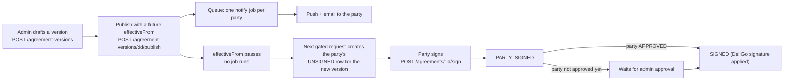
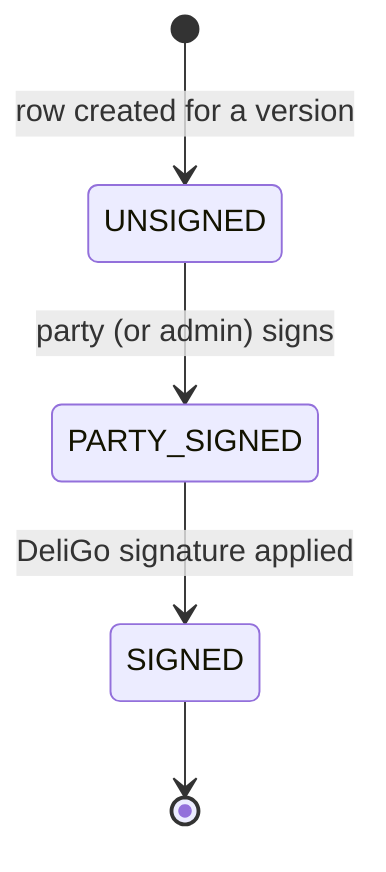
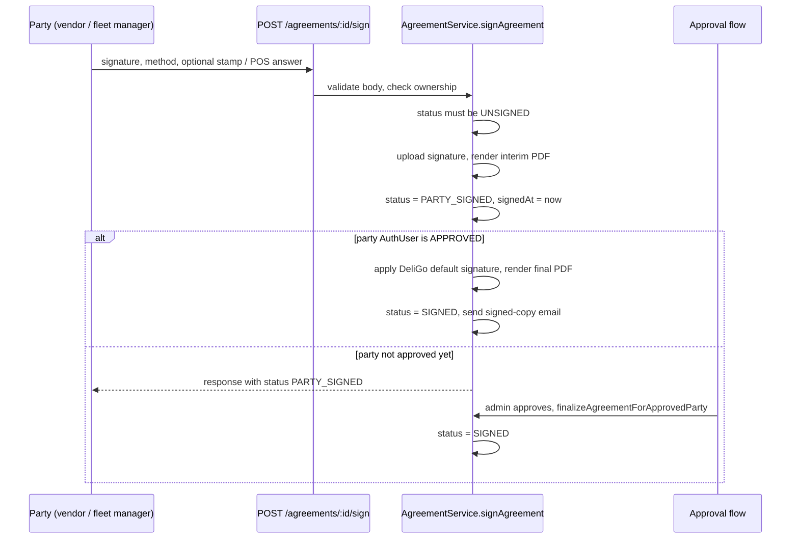

# Agreements

This page describes the legal-agreement system: what an agreement is in the data
model, how versions are created and published, how a party's agreement row is
created and signed, and which endpoints exist. **Who is required to have a signed
agreement, how "signed" is decided, and what the auth gate and other modules do
with that answer is on [Agreement Gate and Party Resolution](./agreement-gate.md).**

Paths are relative to `src/app/`; the module is `modules/Agreement/`. Statements
come from the committed code unless marked **Inferred** (read from code, not
run) or **Executed** (a probe or script was run). Uncommitted working-tree
features are not described.

---

## Overview

| Question | Answer |
| --- | --- |
| Agreement types | Two: `INITIAL_VENDOR_AGREEMENT` (party model `Vendor`, role `VENDOR`) and `INITIAL_FLEET_MANAGER_AGREEMENT` (party model `FleetManager`, role `FLEET_MANAGER`). Configured in `agreement.config.ts` (`AGREEMENT_CONFIG`). |
| Who is a party | Only a `VENDOR` and a `FLEET_MANAGER`. A `SUB_VENDOR` has no agreement row and is covered by its parent (see the [gate page](./agreement-gate.md#party-resolution)). |
| Collections | `Agreement` (one row per party, type and version), `AgreementVersion` (the legal text), `AgreementVersionCounter` (per-type version sequence). |
| Versioned text | Yes. Admins draft and publish versions; every agreement row points at the version it was created from. |
| Signing | The party signs (`PARTY_SIGNED`); DeliGo's stored default signature is then applied (`SIGNED`). |
| Automation | One BullMQ job type on `agreement-queue` that notifies parties when a version is published. No cron, and nothing runs when a version's effective date arrives. |
| Gate | Approved vendors, branches and fleet managers with an unsigned effective agreement are blocked on writes and order routes. See the [gate page](./agreement-gate.md). |

---

## Agreement types and their configuration

`AGREEMENT_CONFIG` holds one entry per type. Both entries currently share the
same behavior flags except as noted.

| Setting | Vendor | Fleet manager | Effect |
| --- | --- | --- | --- |
| `partyModel` / `partyLookupField` | `Vendor` / `userId` | `FleetManager` / `userId` | The collection and the id used in `/agreements/party/:partyId` (the custom `userId`, not the Mongo id). |
| `selfAccessRole` | `VENDOR` | `FLEET_MANAGER` | The role that may act on its own agreements. |
| `template` / `documentTitle` | `agreement.template.hbs` / "Contrato de Comerciante" | `fleet-manager-agreement.template.hbs` / "Acordo de Gestor de Frota" | PDF template and the label used in emails. |
| `initialAgreementForRole` | `VENDOR` | `FLEET_MANAGER` | What `getInitialAgreementTypeForRole(role)` returns. |
| `autoDeriveSnapshotFromParty` | true | true | Legal name, NIF, contact, address and IBAN are copied from the party profile; the create body need not supply them. |
| `representativeRoleRequired` | true | false | An authorized representative must give a role for vendors only. |
| `usesLetteredParts` | false | true | Version text: fleet manager versions need a title on every part; vendor versions must not use part titles. |
| `finalizeOn` | `ON_ADMIN_APPROVAL` | `ON_ADMIN_APPROVAL` | See [Signing](#signing-and-countersigning). |
| `singletonPerParty` | true | true | A unique partial index allows one **current** row per party and type. |
| `requiresPosPayment`, `requiresPartyStamp` | false | false | Neither POS payment nor a company stamp is mandatory. |

The snapshot builders (`agreement.snapshotBuilders.ts`) fail with
`PARTY_PROFILE_INCOMPLETE_FOR_AGREEMENT` (listing the missing fields) when the
party profile lacks a legal name, business name, NIF, contact number or email. For a
vendor the legal name is `businessDetails.companyLegalName`; for a fleet manager it
is the person's first and last name.

---

## Data model

### `Agreement`

One row per party, agreement type and **version**.

| Field | Notes |
| --- | --- |
| `partyId` (`refPath: partyModel`), `partyModel`, `agreementType` | Who and which type. |
| `agreementVersionId`, `versionNumber` | The version this row was created from. Both default to `null`; the signing and PDF code requires the version to exist (`AGREEMENT_TYPE_NOT_PUBLISHED`). |
| `isCurrentForParty`, `supersededAt` | `true` for the party's live row. When a newer effective version appears the old row is set to `false` and `supersededAt` is stamped. |
| Party snapshot | `partyLegalName`, `email` (lower-cased), `contactNumber`, `nif`, optional `commercialName`, `headOfficeAddress`, `zipCode`, `country`, `partyIban`, `partyRepresentativeName`, `partyRepresentativeRole`, `deligoRepresentativeName/Role`. Copied when the row is created, so later profile edits do not change an existing row. |
| `partySignatoryType` | `SELF` or `AUTHORIZED_REPRESENTATIVE`. |
| `status` | `UNSIGNED`, `PARTY_SIGNED`, `SIGNED` (the **artifact** lifecycle; see below). |
| Files | `draftPdfPath`, `partySignaturePath`, `partyStampPath`, `deligoSignaturePath`, `signedPdfPath`. |
| `partySignatureMethod` | `DRAWN` or `UPLOADED`. |
| `posPaymentOption` | `THREE_INSTALLMENTS`, `MONTHLY_RENTAL` or `null`; carried to later versions for a vendor that answered YES. |
| Dates | `signedAt` (party signed), `deligoSignedAt` (DeliGo signature applied), `emailedAt` (signed-copy email sent). |
| `createdBy`, `createdByModel` | `Admin`, `Vendor` or `FleetManager`. |

Indexes: a unique partial index on `{ partyId, partyModel, agreementType }` for
`isCurrentForParty: true` (per type), a unique sparse index on
`{ partyId, partyModel, agreementType, versionNumber }`, and lookup indexes on
`partyId`, `status`, `nif` and others.

### `AgreementVersion`

| Field | Notes |
| --- | --- |
| `agreementType`, `versionNumber` | `versionNumber` is `null` while a draft and is assigned at publish from the per-type counter. Unique per type. |
| `status` | `DRAFT`, `PUBLISHED`, `ARCHIVED`. |
| `isCurrent` | At most one `true` per type (unique partial index). Set at publish; the previous current version becomes `ARCHIVED`. |
| `documentTitle`, `parts[]` | Ordered parts, each with an optional `partTitle` and `clauses[]` (`clauseNumber`, `clauseTitle`, `bodyHtml`, optional `forcePageBreakBefore`, `showPosPaymentWidget`). |
| `effectiveFrom` | When the version becomes binding. Required and future at publish. |
| `createdBy`, `publishedBy`, `publishedAt`, `archivedAt` | Admin ids and timestamps. |

Clause HTML is sanitized on create and edit (`sanitizeClauseHtml`): only `p`,
`strong`, `em`, `br`, `ul`, `ol`, `li`, `table`, `thead`, `tbody`, `tr`, `th`,
`td` and `div` survive, with a few allow-listed classes and no attributes or link
schemes.

### Status meaning

`Agreement.status` records the signature artifact only. It does not by itself say
whether the party may work: that is decided by `SIGNED` **and** a version number at
least the effective version (see the [gate page](./agreement-gate.md#when-an-agreement-counts-as-signed)).

`PARTY_SIGNED` is not "signed" for any access decision. A row in that state is
waiting for the DeliGo countersignature.

---

## Versioning and publishing

All version endpoints are `/api/v1/agreement-versions`, `auth('ADMIN',
'SUPER_ADMIN', ['CAN_MANAGE_AGREEMENTS'])` (the permission is checked for `ADMIN`;
`SUPER_ADMIN` bypasses it).

| Endpoint | Behavior |
| --- | --- |
| `POST /` | Create a **draft** (`agreementType`, optional `documentTitle`, `parts`, optional `effectiveFrom`). Version number `null`, `isCurrent: false`. Activity log `AGREEMENT_VERSION_CREATED`. |
| `GET /`, `GET /:id` | List (QueryBuilder) or read one, with `createdBy` and `publishedBy` populated for a single read. |
| `PATCH /:id` | Edit a **draft** only (`documentTitle`, `parts`, `effectiveFrom`). Any other status gives `AGREEMENT_VERSION_NOT_EDITABLE`. |
| `GET /:id/preview` | Renders the version to a PDF with placeholder party data and returns the bytes inline. |
| `POST /:id/publish` | Publishes a draft. Optional body `effectiveFrom` (must be a future date). |

There is no endpoint to edit a published version, unpublish it or delete it.

**Publish checks** (`validateAgreementVersionForPublish`), each failing with a
`400`:

- `effectiveFrom` must be set (`AGREEMENT_EFFECTIVE_DATE_REQUIRED`) and in the future (`AGREEMENT_EFFECTIVE_DATE_MUST_BE_FUTURE`).
- At least one clause; every clause has a title and non-empty body; clause numbers are unique across the version; for a type with lettered parts every part has a title, otherwise no part has one (`AGREEMENT_VERSION_INCOMPLETE`, with the reasons joined).

**Publish effects**, in one transaction: increment the per-type counter and
assign `versionNumber`; archive the previous `isCurrent` version (`archivedAt` set);
mark this version `PUBLISHED`, `isCurrent: true`, with `publishedAt` and
`publishedBy`. After the commit the notification jobs are enqueued (see
[Automation](#automation-worker-notifications-and-emails)) and the controller writes
the `AGREEMENT_VERSION_PUBLISHED` activity log.

**Publishing does not make the version binding.** The version that applies to
access decisions is computed at query time as the **highest `versionNumber` among
`PUBLISHED` and `ARCHIVED` versions whose `effectiveFrom` is null or already past**
(`findEffectiveAgreementVersion`). Until the new version's date passes, the
previous version stays effective, even though it was archived at publish time.
Nothing needs to run when the date passes. **Inferred** consequence: there is no
moment at which the system "switches"; the first request after the date sees the new
effective version.

The first version of a type behaves the same way: until its date passes there is no
effective version, and every party counts as compliant.

---

## How a party's agreement row is created

Rows are created lazily by `ensureCurrentAgreementForParty`. It is called from
several places, not only from the agreement endpoints:

| Caller | When |
| --- | --- |
| `auth()` middleware | On **every** non-exempt request of an approved gated user (see the [gate](./agreement-gate.md#the-gate-in-authts)). |
| `GET /agreements/current` | Through `getCurrentAgreementForCurrentUser`. |
| `POST /agreements/party/:partyId` | Through `createAgreementForParty`. |
| `GET /agreements/party/:partyId` | For a vendor or fleet manager party, before listing. |
| `submitForApproval` and `approvedOrRejectedUser` | To check the party's current agreement (`modules/Auth/auth.service.ts`). |

What it does, in order:

1. Find the **effective version** for the type. If none exists, return `null` (nothing is created).
2. Load the party's `isCurrentForParty` row.
3. If that row already has the effective version number: return it (for an `UNSIGNED` row with a create payload it may update the signatory and regenerate the draft PDF).
4. Otherwise, in a transaction (retrying up to 10 times on transient errors): mark the old current row `isCurrentForParty: false` with `supersededAt`, then either revive an existing non-current row for this version number (this is how a pre-signed future version becomes current) or create a new `UNSIGNED` row from the party snapshot. A duplicate-key error returns whichever row won the race.
5. Generate and upload the draft PDF (Puppeteer and Handlebars to RustFS). If that fails, the newly created row is **deleted** and `DRAFT_PDF_GENERATION_FAILED` (500) is raised.

`ensurePreSignableFutureAgreement` does the same for the next **upcoming**
version (published, `effectiveFrom` in the future, version number above the current
one). It creates an `UNSIGNED` row with `isCurrentForParty: false`, so a party can
sign the next version before it is binding. A `SIGNED` row for an upcoming version is
skipped and the search moves on to the following version.

`POST /agreements/party/:partyId` body: `agreementType`, `signatoryType` (required),
optional party fields and, for `AUTHORIZED_REPRESENTATIVE`, `partyRepresentativeName`
(and `partyRepresentativeRole` for vendors). `partyId` is the party's `userId`. When
the caller is the party itself **and** already `APPROVED`, the service refuses
(`AGREEMENT_USE_CURRENT_ENDPOINT`): approved parties use `GET /agreements/current`.
If no effective or upcoming version exists the result is
`AGREEMENT_TYPE_NOT_PUBLISHED`.

`GET /agreements/current` (`VENDOR`, `FLEET_MANAGER` only) returns the party's current
row when it is not `SIGNED` (so `UNSIGNED` or `PARTY_SIGNED`); otherwise it returns
the pre-signable row for the next upcoming version, or `null` when there is none. For
a vendor the response adds `hasPosPaymentDecision`.

---

## Signing and countersigning

**Request** (`signAgreementValidationSchema`, strict): `partySignatureMethod`
(`DRAWN` or `UPLOADED`), `partySignature`, optional `partyStamp`, optional
`posPaymentDecision` (`YES`/`NO`) and `posPaymentOption`.

- `DRAWN`: a base64 image data URL (`png`, `jpg`, `jpeg`, `webp`, at most about 5 MB). It is decoded, saved under `uploads/signatures/` and uploaded to RustFS (`signatures`).
- `UPLOADED`: a URL that must start with the RustFS public endpoint and bucket, that is, a file already uploaded through the upload endpoint.
- `partyStamp`, if sent, must be an uploaded-file URL of the same kind.
- `posPaymentOption` is only accepted with `posPaymentDecision: YES`, and is required with it.

**Ownership** (`assertOwnership`): a `VENDOR` or `FLEET_MANAGER` may act only when
`agreement.partyId` equals their own profile id. Other callers (`ADMIN`) must be the
row's `createdBy`; `SUPER_ADMIN` may act on any row.

**Rules inside `signAgreement`:**

- The row must be `UNSIGNED`, otherwise `NOT_READY_FOR_SIGNING` (so a row cannot be signed twice and a failed countersign cannot be retried through this endpoint).
- For a vendor, the POS decision is stored once on the `Vendor` (`posPaymentDecision`, `posPaymentOption`, `posPaymentDecidedAt`). If the vendor already decided, later signings ignore the payload and reuse the stored answer.
- The interim PDF is rendered from the **row's own** snapshot and the version's clauses, then uploaded.
- When `finalizeOn` is `ON_ADMIN_APPROVAL` (both types), the DeliGo signature is applied immediately **only if** the party's `AuthUser.status` is `APPROVED`. A party still in onboarding stays `PARTY_SIGNED`.

**Countersigning** (`applyDeligoSignatureAndFinalize`): reads
`GlobalSettings.agreement` (`deligoSignatureUrl`, `deligoSignatoryName`,
`deligoSignatoryRole`, `deligoCompanyStampUrl`; written through the admin global
settings update, `auth('ADMIN','SUPER_ADMIN')`). Without `deligoSignatureUrl` it
throws `DELIGO_DEFAULT_SIGNATURE_NOT_CONFIGURED`. It renders the final PDF, saves
`signedPdfPath`, sets `SIGNED` and `deligoSignedAt`, sends the signed-copy email to the
row's `email`, and then stores `emailedAt`.

**At approval** (`approvedOrRejectedUser` in the auth service, see [User Lifecycle](../03-identity-access/user-lifecycle.md)):
approving a gated party requires the party to be `SUBMITTED`, the current row to be
`PARTY_SIGNED` with a signature path, and the DeliGo signatory name, role and signature
to be configured. After the status transaction commits,
`finalizeAgreementForApprovedParty` finalizes **every** `PARTY_SIGNED` row of that
party and type; each failure is logged and skipped. `submitForApproval` likewise
requires the current row to be `PARTY_SIGNED`.

**Editing** (`PATCH /agreements/:agreementId`): only while `UNSIGNED`
(`AGREEMENT_ALREADY_SIGNED_CANNOT_EDIT`). Editable fields are `partyLegalName`,
`contactNumber`, `nif`, the optional company fields and `signatoryType`; `email` is not
editable. Switching to `AUTHORIZED_REPRESENTATIVE` without a representative name and
role fails (`AUTHORIZED_REPRESENTATIVE_DETAILS_REQUIRED`). Editing does **not**
regenerate `draftPdfPath`; the signed PDF is rendered at signing time from the
edited fields.

---

## Endpoints and who may call them

`/api/v1/agreements`:

| Method and path | Roles | Notes |
| --- | --- | --- |
| `POST /party/:partyId` | `VENDOR`, `FLEET_MANAGER`, `ADMIN`, `SUPER_ADMIN` | Create or fetch the party's agreement. Activity log `AGREEMENT_CREATED`. |
| `GET /party/:partyId` | same | The party's agreement history. |
| `POST /:agreementId/sign` | same | Activity log `AGREEMENT_SIGNED`. |
| `PATCH /:agreementId` | same | Activity log `AGREEMENT_UPDATED`. |
| `GET /current` | `VENDOR`, `FLEET_MANAGER` | The caller's row to read or sign. |
| `GET /:agreementId` | `VENDOR`, `FLEET_MANAGER`, `ADMIN`, `SUPER_ADMIN` | One row, `createdBy` populated. |
| `GET /` | `ADMIN`, `SUPER_ADMIN` | All rows (QueryBuilder; search on `partyLegalName` and `nif`). |

For `ADMIN` the `CAN_MANAGE_AGREEMENTS` permission is required on every route
except `GET /current`. `SUB_VENDOR` is not in any role list, so **a branch cannot read
or sign an agreement**; the parent vendor must.

**Visibility.** `VENDOR`, `FLEET_MANAGER` and `SUPER_ADMIN` are not filtered by creator.
Every other role (that is, `ADMIN`) is filtered to rows whose `createdBy` is that
admin (`ownershipFilterFor`, and the same check in `assertOwnership`). A row created
by a party itself, or by the auth gate, has `createdBy` set to that party, so a
non-super admin does not see it in `GET /` and cannot read, edit or sign it.
**Inferred** from the code: only a `SUPER_ADMIN` has a full view of all agreements.

---

## Automation: worker, notifications and emails

| Piece | Behavior |
| --- | --- |
| Queue | `agreement-queue` (`BullMQ/Queue/agreement.queue.ts`): 3 attempts, exponential backoff starting at 5 s, completed jobs removed. |
| Worker | `BullMQ/Workers/agreement.worker.ts`, concurrency 5; one job name, `NOTIFY_AGREEMENT_VERSION_PUBLISHED`. Any other name is logged and skipped. |
| Who is enqueued | On publish: every party with a **current** row of that type (any status, any account state), plus every **approved** party of the type's role that has no current row. Deduplicated by party id. Parent vendors only, since branches have no rows and the role filter is `VENDOR`. |
| Job | Loads the party, calls `NotificationService.deliverToUser` (awaited) with `AGREEMENT_VERSION_PUBLISHED`, type `AGREEMENT`, data `agreementType`, `versionNumber`; then, if the party has an email, sends "Action Required: A New DeliGo Agreement Version Is Available". A party that no longer exists is skipped. |
| Push text | With an `effectiveFrom` (always set by publish): "... You can keep working as usual and sign anytime before `<date>`, when it becomes mandatory." The "sign it to continue" wording is used only when no date is passed. |
| Signed copy | On `SIGNED`, `sendAgreementSignedEmail` ("Your Signed Agreement is Ready") goes to the row's `email` with the PDF link. |
| Not sent | No notification or email when the effective date arrives, when a row becomes `UNSIGNED` for a new version, or when a gated request is refused. |
| Activity logs | `AGREEMENT_CREATED`, `AGREEMENT_SIGNED`, `AGREEMENT_UPDATED`, `AGREEMENT_VERSION_CREATED`, `AGREEMENT_VERSION_UPDATED`, `AGREEMENT_VERSION_PUBLISHED`. |

Details of the push and its record are on [Notification Triggers and Templates](../06-notifications/notification-triggers.md#other-notification-sources).
Failing to enqueue is caught and logged, and the publish still succeeds.

---

## Guards and edge cases

| Situation | Behavior |
| --- | --- |
| No version is effective | `ensureCurrentAgreementForParty` returns `null`; every compliance check returns "signed". |
| Party profile incomplete (no NIF, legal name, business name, contact or email) | Row creation fails with `PARTY_PROFILE_INCOMPLETE_FOR_AGREEMENT`. Because the auth gate creates rows lazily, **Inferred:** an approved vendor whose profile lost one of these fields would get this error on non-exempt requests. |
| Draft PDF generation or upload fails | A new row is deleted and the request fails with `DRAFT_PDF_GENERATION_FAILED`. From the gate this is raised from the auth middleware, so **Inferred:** every non-exempt request of that party fails until generation works. |
| Countersign fails for an approved party (for example no default signature configured, or PDF/upload failure) | The party signature is already saved and the row is `PARTY_SIGNED`; the sign request returns an error. The row cannot be signed again (`NOT_READY_FOR_SIGNING`). Only the approval transition re-runs finalization, so **Inferred:** an approved party stays blocked until the row is finalized by other means. Not reproduced. |
| Signed-copy email fails after `SIGNED` is saved | `sendAgreementSignedEmail` is awaited in `applyDeligoSignatureAndFinalize`; **Inferred:** the sign request can return an error although the row is already `SIGNED`, with `emailedAt` unset. |
| Two requests create the row at once | The unique indexes and the duplicate-key handling return the winner. |
| A version number gap | Numbers come from a counter, so a failed publish transaction leaves no gap; a draft never consumes a number. |
| Unused message key | `AGREEMENT_TYPE_ALREADY_EXISTS` exists in `agreement.messages.ts` and has no caller. |

---

## Mismatches and inconsistencies found

1. **The gate's exempt-path list mostly does not work.** See [Agreement Gate and Party Resolution](./agreement-gate.md#the-exemption-check-does-not-match-as-documented). Needs a separate backend fix.
2. **Rows created through the gate for a `SUB_VENDOR`** are created with `createdBy` set to the branch's id and `createdByModel` `Admin` (the model name is chosen by comparing the caller's role with `VENDOR`). The parent's row is thereby attributed to a non-admin id. **Inferred** from `ensureCurrentAgreementForParty`; not reproduced.
3. **Admin visibility is per creator**, so `GET /agreements` does not list agreements for a non-super admin unless they created them.
4. **`AGENTS.md` names `agreement.subVendor.test.ts`**, but no such file exists (the only `*.test.ts` under `src` is for Meilisearch).

---

## Related documentation

- [Agreement Gate and Party Resolution](./agreement-gate.md): who needs a signed agreement, the signed check, the auth gate and its exempt paths, and every consumer.
- [Authorization](../03-identity-access/authorization.md#the-agreement-gate-as-an-authorization-constraint): roles, permissions and the gate in the request pipeline.
- [User Lifecycle](../03-identity-access/user-lifecycle.md): submit-for-approval and approval, where the agreement is checked and finalized.
- [Vendors and Branches](../04-vendors/vendors-and-branches.md#agreement-and-access-rules): parent and branch behavior.
- [Notification Triggers and Templates](../06-notifications/notification-triggers.md#other-notification-sources): the publish notification.
- [Data Model](../02-platform/data-model.md#platform-commission-effective-dated): commission rates that follow a vendor agreement version's effective date.
