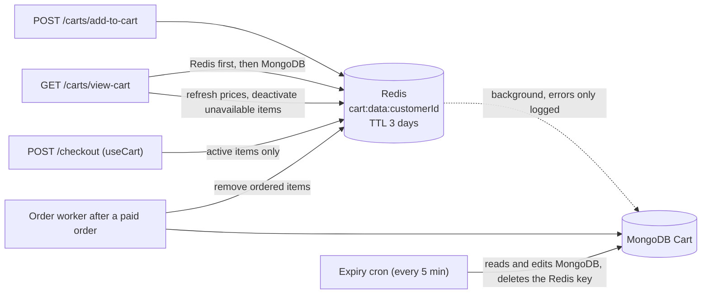
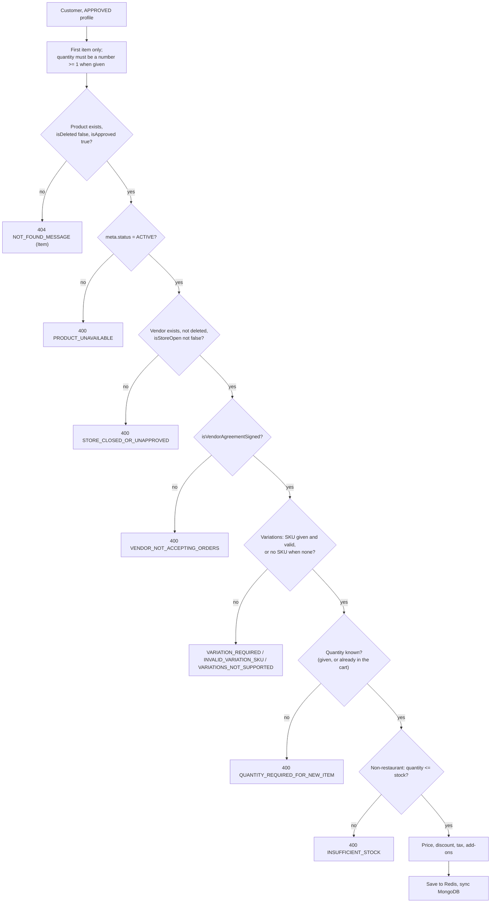
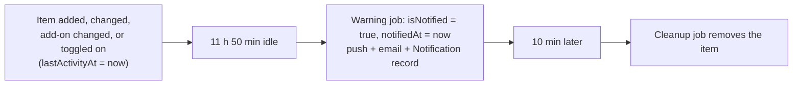

# Cart

This page describes the cart from the code: what a cart and a cart item contain,
where they are stored, what each endpoint does, which checks run when an item is
added, how prices are computed and refreshed, how checkout reads the cart, and
how items expire. Product, offer and order rules are linked, not repeated.

Paths are relative to `src/app/`; the module is `modules/Cart/` and the expiry jobs
are in `cron/cart.cron.ts`. Statements come from the committed code unless marked
**Inferred** (read from code, not run) or **Executed** (a probe ran the real
validation schema or helper). Uncommitted working-tree features are not described.

---

## At a glance

| Question | Answer |
| --- | --- |
| Who has a cart | A `CUSTOMER`. One cart per customer, looked up by `customerId` from the token, never from the request. |
| Where it lives | Redis `cart:data:<customerId>` is read first; MongoDB `Cart` is the persistent copy. See [Storage](#storage-and-consistency). |
| Endpoints | `/api/v1/carts`: add, toggle, add-on quantity, delete items, clear, view, and an admin list. There is **no** separate "update quantity" endpoint: add-to-cart sets the quantity. |
| Single vendor | Only one vendor's items can be **active** at a time. Items of other vendors stay in the cart but inactive. Checkout uses active items only. |
| Offers, coupons | The cart holds none. Product-level discounts are priced into the items; offers are applied on the checkout summary. |
| Delivery address, pickup time | Not stored on the cart. Checkout reads them. |
| Expiry | Each item is removed about 12 hours after its last activity, with a push and email warning about 10 minutes before. |
| Cleanup after an order | The post-payment worker removes the ordered items from Redis and MongoDB. Payment failure does not touch the cart. |
| Sockets | None. The only notification is the expiry warning. |

---

## Data model

### `Cart` (MongoDB, `modules/Cart/cart.model.ts`)

`timestamps: true`, `versionKey: false`, **no explicit indexes**.

| Field | Notes |
| --- | --- |
| `customerId` | `ObjectId` of the `Customer` (the profile `_id`, not the string `userId`). |
| `items[]` | Cart items, see below. |
| `totalItems`, `totalQuantity` | Counts over **active** items only. |
| `cartCalculation` | `totalOriginalPrice`, `totalProductDiscount`, `totalTaxAmount`, `grandTotal`, over active items only. |
| `isDeleted` | Default `false`. No code path sets it to `true`; carts are deleted for real (see [Clear and remove](#update-quantity-remove-and-clear)). |

### Cart item

| Field | Notes |
| --- | --- |
| `productId`, `vendorId` | Mongo ids. `vendorId` is the product's owner: the branch row when the product belongs to a branch. |
| `name` | `{ en, pt }` snapshot of the product name, with the variation label appended (`"Pizza - Large"`). |
| `image` | Snapshot of the product image. Never refreshed. |
| `hasVariations`, `variationSku` | The chosen option, or `null`. |
| `isActive` | Whether the item takes part in checkout. |
| `lastActivityAt`, `isNotified`, `notifiedAt` | Expiry bookkeeping, see [Expiry](#expiry-and-the-warning-notification). |
| `addons[]` | Per add-on: `name`, `sku`, `originalPrice`, `unitPrice`, `quantity`, `lineTotal`, `taxRate`, `taxAmount`. A snapshot; never re-read from the add-on group by checkout. |
| `productPricing` | `originalPrice` (option or base price), `productDiscountAmount` (per unit), `discountType`, `unitPrice` (after discount), `lineTotal`, `taxRate`, `taxAmount`. |
| `itemSummary` | `quantity` (minimum 1), `totalTaxAmount`, `totalProductDiscount`, `grandTotal` (product line plus add-on lines). |

An item is identified by **`productId` plus `variationSku`**. Every endpoint that
targets an item matches on that pair (a missing SKU means `null`).

---

## Storage and consistency

- **Reads** (`viewCart`, every mutation, checkout): Redis `cart:data:<customerId>` first; if absent, `Cart.findOne({ customerId, isDeleted: false })`. A MongoDB-only cart is **not** copied back to Redis on read, except when `viewCart` had to change it.
- **Writes** (add, toggle, add-on, partial delete): the cart is written to Redis with a TTL of `259200` s (3 days), then `Cart.updateOne({ customerId }, { items, cartCalculation, totalItems, totalQuantity }, { upsert: true })` runs **in the background**. A failure there is only logged (`Background DB Sync Failed`), so Redis and MongoDB can differ. **Inferred:** a cart that loses its Redis key in that state comes back from MongoDB in the older shape.
- **Redis TTL is refreshed only by writes.** A cart that is only viewed is dropped from Redis after 3 days and served from MongoDB afterwards.
- **Clear and remove-all** delete the Redis key and `Cart.deleteOne({ customerId })`.
- **The expiry jobs work on MongoDB**, then delete the Redis key so the next read rebuilds from MongoDB.
- There is no unique index on `customerId`; uniqueness relies on the upsert.

---

## Endpoints

All under `/api/v1/carts`. Mutating routes are `auth('CUSTOMER')`. `CUSTOMER` accounts are not subject to the agreement gate.

| Method and path | Roles | Purpose |
| --- | --- | --- |
| `POST /add-to-cart` | `CUSTOMER` | Add an item, change its quantity, or change its add-ons. |
| `PATCH /toggle-item-status` | `CUSTOMER` | Activate or deactivate items (by item, or all of one vendor's). |
| `PATCH /update-addon-quantity` | `CUSTOMER` | Set one add-on's quantity on an existing item (0 removes it). |
| `DELETE /delete-item` | `CUSTOMER` | Remove items. The body is an **array** of `{ productId, variationSku? }`. |
| `DELETE /clear-cart` | `CUSTOMER` | Remove the whole cart. |
| `GET /view-cart` | `CUSTOMER`, `ADMIN`, `SUPER_ADMIN` | Read (and refresh) a cart. Staff must pass `?customerId=`. Optional `?vendorId=` filters the items. |
| `GET /` | `ADMIN`, `SUPER_ADMIN` | All carts, Redis and MongoDB merged. |

Checks common to the service functions: `addToCart` requires the caller's role to be
`CUSTOMER` (`CUSTOMER_ONLY_ACTION`) and the profile status `APPROVED`
(`ACCOUNT_UNAPPROVED`). The other functions require status `APPROVED`
(`CART_UPDATE_RESTRICTED`, or `CART_VIEW_RESTRICTED` for reads). No admin permission
code is required for the staff routes.

**Mutation responses carry no cart outside development.** The controllers for add,
toggle, add-on update, delete and clear return `data: null` unless
`NODE_ENV === 'development'`. A client must call `GET /carts/view-cart` to read the
result. `view-cart` and the admin list always return data. Responses are localized
(`name` becomes the requested language) through `formatCartResponse`.

**Validation (`cart.validation.ts`, strict schemas). Executed** against the real
schema:

- `items[]` has no minimum length and only **the first element is processed**; any others are silently ignored. An empty array reaches the service and fails with `NO_ITEMS_PROVIDED`.
- `quantity` must be at least 1 when present but is **not required to be an integer**: `1.5` passes validation. `quantity` may be omitted (see below).
- Add-on `quantity` in `add-to-cart` may be `0` (removes) and fractional; the service floors it.
- `delete-item` needs a non-empty array; a single object is rejected.

---

## Adding an item

`addToCart` applies these checks in this order. Each failure stops the request.

### The rules

| Rule | Behavior |
| --- | --- |
| **Quantity is absolute** | `quantity` replaces the current quantity of a matching item; it does not add to it. Sending the same product twice with `quantity: 2` leaves 2. |
| **Quantity may be omitted for an existing item** | The item keeps its current quantity. This is how add-ons are changed from `add-to-cart`. A new item without `quantity` fails with `QUANTITY_REQUIRED_FOR_NEW_ITEM`. |
| **Product** | Loaded by Mongo `_id` with `isDeleted: false` and `isApproved: true`, then `meta.status` must be `ACTIVE`. Category status, `availabilityStatus` and the vendor's `APPROVED` status are **not** checked. See [Products and Categories](../05-products/products.md#how-other-modules-use-a-product). |
| **Vendor and store** | The vendor row must exist and not be deleted, and `businessDetails.isStoreOpen` must not be `false` (an unset flag passes). The vendor's approval status is not checked, although the error key is `STORE_CLOSED_OR_UNAPPROVED`. |
| **Agreement** | `AgreementService.isVendorAgreementSigned(vendor)`. A branch is judged by its parent's agreement. See [Agreement Gate and Party Resolution](../07-agreements/agreement-gate.md#who-consumes-the-result). |
| **Variations** | A product with variations (`stock.hasVariations` or a non-empty `variations`) requires a `variationSku` that exists (`VARIATION_REQUIRED`, `INVALID_VARIATION_SKU`). A product without variations rejects a SKU (`VARIATIONS_NOT_SUPPORTED`). The option's price, label and stock are used. |
| **Stock** | For vendors whose business type is **not** `RESTAURANT`, the quantity must not exceed the option's `stockQuantity` (or `stock.quantity`, `0` if absent): `INSUFFICIENT_STOCK`. Restaurants skip the check. Stock is checked again only when the vendor accepts the order; checkout does not check it. See [Stock and availability](../05-products/products.md#stock-and-availability). |
| **Existing item** | A matching item is updated in place: price fields re-derived, quantity set, `isActive` set to `true`, `lastActivityAt` reset, `isNotified` cleared. The second `INSUFFICIENT_STOCK_WITH_QUANTITY` check in that branch repeats the first check and can never fire (**Inferred** from the code). |

### Add-ons

Add-ons are only processed when `addons` is non-empty. The product's add-on groups
are populated (group, options and option tax).

- An option must belong to an **active, non-deleted group** and be **active**, otherwise `ADDON_UNAVAILABLE`.
- `quantity` is floored to a whole number; `0` removes the add-on from the item.
- For every active group, the sum of selected add-on quantities may not exceed `maxSelectable` (`ADDON_LIMIT_REACHED`). `minSelectable` is **not** enforced by the cart (it is only returned with `view-cart`).
- Each add-on stores `unitPrice = option.price` and the option's tax rate; line total and tax are computed from them.

### Single-vendor rule

Adding an item sets its `isActive` to `true` and sets every item of **another
vendor** to `isActive: false`. Nothing is removed. Items of the same vendor that were
already inactive stay inactive until toggled.

---

## Pricing

All amounts are rounded to two decimals (`roundTo2`). Tax is **inclusive**: prices
already contain tax and the tax amount is extracted.

| Quantity | Formula |
| --- | --- |
| Base | The option price for a variation, otherwise `pricing.price` |
| Unit discount | `FLAT`: `discount`; `PERCENTAGE`: `base x discount / 100` |
| Unit price | `base - unit discount` |
| Product line total | `unit price x quantity` |
| Product tax | `line total x taxRate / (100 + taxRate)` |
| Add-on line | `addon unitPrice x addon quantity`, tax with the same inclusive formula; **no product discount** applies to add-ons |
| `itemSummary.grandTotal` | product line total + add-on lines |
| `itemSummary.totalTaxAmount` | product tax + add-on tax |
| `itemSummary.totalProductDiscount` | unit discount x quantity |
| `cartCalculation` | Sums over **active items only**: original price (base x quantity plus add-ons), discount, tax, `grandTotal` |

The cart has no delivery charge, service charge, commission or offer discount. Those
are added by checkout; see [Checkout and Order Creation](../03-orders/checkout-and-order-creation.md#how-the-amounts-are-calculated).
The full product pricing rules (discount types, tax) are in
[Products and Categories](../05-products/products.md#pricing-and-tax).

### When prices are refreshed

| Moment | Refreshes | Notes |
| --- | --- | --- |
| Add or change an item | That item | Uses the product as loaded. |
| Toggle to **active** | The toggled items (`refreshItemPricingAndTotals`) | Also rewrites the item `name` and throws `PRODUCT_UNAVAILABLE` if the product is deleted or unapproved. |
| `update-addon-quantity` | The item's product price fields | Loads the product by `_id` **without** the deleted/approved filter. |
| `GET /carts/view-cart` | **Every** item | Re-derives price, discount and tax from the product; see [Viewing](#viewing-the-cart). It does not rewrite `name`. |
| Checkout | At checkout time | Product price, discount and tax come from the database; add-on prices and the item name come from the cart snapshot. |

Product name and image snapshots therefore go stale in the cart until an add,
toggle-on or add-on change rewrites the name; the image is never refreshed.

---

## Update quantity, remove and clear

| Action | How | Result |
| --- | --- | --- |
| Change quantity | `POST /add-to-cart` with the new `quantity` | Replaces the quantity; stock is checked again for non-restaurants. |
| Change add-on | `PATCH /update-addon-quantity` (`productId`, optional `variationSku`, `optionSku`, `quantity`) | `quantity` is floored, negative becomes `0`, `0` removes the add-on. Group `maxSelectable` is enforced against the other selections. It resets `lastActivityAt`/`isNotified`. It does not check store, agreement or stock and does not re-activate an inactive item. `PRODUCT_NOT_IN_CART` if the item is absent. |
| Remove items | `DELETE /delete-item` with an array | Removes every matching `productId` + `variationSku`; `REMOVE_ITEMS_NOT_FOUND` if none matched, `CART_EMPTY` if the cart is empty. Removing the **last** item deletes the Redis key and the MongoDB cart. Otherwise totals are recalculated and the expiry warnings for the removed items are deactivated. |
| Clear | `DELETE /clear-cart` | Deletes the Redis key and the MongoDB cart, then deactivates all cart-expiry notifications. `NOT_FOUND` (`Cart`) if there is no cart. |

`DECREMENT_UNDER_MINIMUM`, `QUANTITY_UPDATE_SUCCESS`, `ADDON_NOT_IN_CART`,
`CART_TAX_CONFIG_MISSING` and `TAX_RECORD_INVALID` exist in `cart.messages.ts` and
have no caller in the current code (from a search of the repository).

---

## Toggling items active and inactive

`PATCH /toggle-item-status` has two modes.

| Mode | Body | Behavior |
| --- | --- | --- |
| `ITEM_LEVEL` | `productIds[]` (matches items **without** a variation SKU) **or** `variationSku[]` (matches items with those SKUs) | The state of the **first matched item** decides: if it is inactive, all matched items become active, otherwise all become inactive. Activating is refused with `MULTIPLE_VENDORS_DENIED` when an active item of another vendor exists. `PRODUCT_NOT_IN_CART` if nothing matched. |
| `VENDOR_BULK` | `vendorId` | If any of that vendor's items is active, all of them become inactive; otherwise all become active **and every other vendor's items are deactivated**. `NO_ITEMS_FOUND_FOR_THIS_VENDOR` if none. |

Activation refreshes the items' prices, resets `lastActivityAt` and `isNotified`, and
fails with `PRODUCT_UNAVAILABLE` if a product is deleted or unapproved. It does **not**
check `meta.status`, stock, store status or agreement. Deactivation only flips the
flag and does not reset the expiry clock.

---

## Viewing the cart

`GET /carts/view-cart` is both a read and a repair pass.

- A customer always reads their own cart; a customer with no cart gets an empty cart shape (`hasActiveItems: false`), not an error. Staff must send `customerId` (`CUSTOMER_ID_REQUIRED`) and get `NOT_FOUND` when no cart exists.
- For every item it loads the product (`isDeleted: false`, `isApproved: true`). An item whose product is **missing** is set to `isActive: false` (it is not removed).
- For the others it recomputes price (the variation's price for variation items), discount and tax, and rewrites the item's pricing when they differ from the stored values. If anything changed, totals are recalculated and the cart is written to Redis and MongoDB (awaited, without upsert).
- It adds vendor details to each item (`businessName`, business type, opening and closing hours, store photo, and a rating derived from the vendor's products), the add-on group `minSelectable` / `maxSelectable`, and `hasActiveItems`.
- With `?vendorId=` only that vendor's items are returned and the totals are recomputed for them.
- It does **not** check store open status, agreement, stock or `meta.status`, so an item can look fine in the cart and fail at checkout.

**Executed:** the "price changed" test compares the stored `productDiscountAmount`
(already rounded to two decimals) with the **unrounded** percentage discount. For
example a 15 percent discount on 9.99 is stored as `1.5` but compared with
`1.4985`, and 7 percent on 12.5 is `0.88` against `0.875`, so the item is treated as
changed on **every** view. The recomputation gives the same values, so the visible
effect is one Redis write and one MongoDB write per view for such items. Whole-cent
discounts (for example 10 percent of 10) do not trigger it.

`GET /carts` (staff) reads every `cart:data:*` key with `KEYS`, merges those carts with
the non-deleted MongoDB carts (Redis wins for a customer present in both), and
paginates the merged list in memory. **Inferred:** `KEYS` scans the whole Redis keyspace
and is costly on a large instance.

---

## Vendor and branch ownership

- Each item carries the `vendorId` of the product's owner. A product copied to a branch is a separate product owned by the branch, so a cart item points at the **branch row**, and the branch is the "vendor" of the order.
- The single-vendor rule compares these ids, so a parent and its branch count as two different vendors.
- The agreement check for a branch uses the parent's agreement; the store-open check uses the branch's own flag. See [Vendors and Branches](../04-vendors/vendors-and-branches.md#agreement-and-access-rules).
- Nothing rechecks the vendor after the item is added, except at checkout.

---

## Offers, coupons and promotions

The cart has no offer, coupon or promo fields and no endpoint to apply one. The only
price reduction in the cart is the product's own `discount` (percentage or flat) on
`pricing`. Offers (percentage, flat, buy-and-reward) are applied on the `CheckoutSummary`,
which is built from the active cart items; see
[Checkout and Order Creation](../03-orders/checkout-and-order-creation.md). The
`Coupon` model has no routes.

## Delivery address and pickup

The cart stores neither. Checkout reads the customer's active delivery address (for
delivery) or the requested `pickupTime` (for pickup); see
[The checkout request](../03-orders/checkout-and-order-creation.md#the-checkout-request).

---

## Checkout transition

```mermaid
sequenceDiagram
  participant C as Customer
  participant Co as Checkout service
  participant R as Redis / MongoDB cart
  participant P as Products, vendor, agreement
  C->>Co: POST /checkout { useCart: true }
  Co->>R: read cart (Redis, then MongoDB)
  Co->>Co: empty -> CHECKOUT_CART_EMPTY, no active items -> NO_ACTIVE_CART_ITEMS
  Co->>P: load the active items' products (not deleted, approved)
  Co->>P: any product not ACTIVE -> PRODUCT_UNAVAILABLE
  Co->>P: vendor of the FIRST product, store open, agreement signed
  Co->>Co: price, discount, tax from the database, add-ons and name from the cart
  Co-->>C: CheckoutSummary (the cart itself is not changed)
```

What checkout takes from the cart and what it re-derives:

| Item | Source |
| --- | --- |
| Which items | Only `isActive === true` items (`NO_ACTIVE_CART_ITEMS` if none) |
| Quantity | The cart's `itemSummary.quantity` |
| Product price, discount, tax | Recomputed from the product in the database (the variation option's price for variation items) |
| Add-on prices and tax | The **cart snapshot** (`unitPrice`, `quantity`, `taxRate`); a later price change or deactivation of the option is not seen |
| Item name | The cart's `name` snapshot (for direct checkout the product name is used) |
| Vendor | The **first** product's vendor. Single-vendor is assumed to hold because of the activation rules above and is not re-validated |
| Store open, agreement | Checked (`VENDOR_CLOSED`, `VENDOR_NOT_ACCEPTING_ORDERS`). Vendor approval status is not checked |
| Stock | **Not** checked |

Checkout does not modify the cart. Cart-side problems reach checkout as follows:

- A cart item whose product was deleted or unapproved makes the whole checkout fail with `NOT_FOUND_MESSAGE` (Item), unless `view-cart` already deactivated the item.
- A product that is no longer `ACTIVE` fails the checkout with `PRODUCT_UNAVAILABLE` (the cart's view does not deactivate these).
- The summary replaces any unconverted summary for the same customer and vendor; the cart is untouched either way.

Reorder (`POST /orders/reorder/:orderId`) re-adds an old order's items through
`addToCart` one at a time, so every add check applies and a failure part-way leaves
the earlier items in the cart ([Order Tracking and Realtime](../03-orders/order-tracking-and-realtime.md#reorder)).

---

## Cleanup after an order, and failed payments

- **After a paid order**, the `NEW_ORDER_POST_PROCESS` job (`modules/Order/order.worker.ts`) removes from the customer's cart every item whose `productId` and `variationSku` match an ordered line, in **both** Redis (recalculated, TTL reset to 3 days; key deleted if empty) and MongoDB (recalculated; an emptied cart stays as a document with zero totals). Items of other vendors and inactive items remain. It then deactivates the matching cart-expiry notifications. The cleanup is the last step of that job, after the invoice sync, the receipt email and the vendor push; see [Notification Triggers and Templates](../06-notifications/notification-triggers.md#failure-behavior-specific-to-triggers).
- **Failed payment or failed checkout**: no cart code runs. The cart keeps all its items. Nothing in the Payment module touches the cart (a search of the module found no cart reference). The customer retries checkout from the same cart.
- **Order cancelled or rejected later**: the cart was already cleaned when the order was created and is not restored.
- **Direct checkout** (`useCart: false`) also triggers the same cleanup by product and SKU, so a matching cart line is removed.

---

## Expiry and the warning notification

Two jobs run every five minutes (`cron/index.ts`); constants in `cron/cart.cron.ts`:
`CART_ITEM_EXPIRY_MS` 12 hours and `CART_ITEM_WARNING_LEAD_MS` 10 minutes.

| Job | Selects | Does |
| --- | --- | --- |
| `handleCartItemExpiryWarningCron` | MongoDB carts with an item whose `lastActivityAt` is at least 11 h 50 min old and `isNotified` is not true | Marks those items `isNotified` with `notifiedAt`, saves, deletes the Redis key, then pushes `CART_ITEM_EXPIRY_WARNING` (type `OTHER`, channel `default`) and sends the cart-expiry email to the customer. One notification per cart covers all due items, with the soonest remaining minutes. |
| `handleCartItemExpiryCron` | Carts with an item that `isNotified` and whose `notifiedAt` is at least 10 min old | Removes those items, recalculates totals, saves, deletes the Redis key and deactivates the matching warning notifications. An emptied cart is deleted (`Cart.deleteOne`). |

Properties of the implementation:

- **The clock is `lastActivityAt`**, reset by add or quantity change, by toggle to active, and by an add-on change. **Viewing the cart, deactivating an item, or checking out does not reset it.**
- **Inactive items expire too.** Neither job looks at `isActive`.
- **Only the item is removed**, not the cart (unless it becomes empty). Removal happens about 12 hours after the last activity, because the cleanup runs 10 minutes after the warning.
- `AGENTS.md` describes the warning as 30 minutes before expiry and the comment above the cleanup job says it runs every 30 minutes; the code uses **10 minutes** and the schedule is **every 5 minutes**.
- The notification's text says the cart items "have a lifetime of 12 hours" and will be removed in `minutesRemaining` minutes. Its `data` is `type`, `cartId` (the customer id string) and `itemKeys` (a JSON array of `productId:variationSku`).
- `isNotified` is cleared when the item is re-added, toggled on or has an add-on change, but **no code deactivates the old warning notification** at that point. **Inferred:** the stale warning stays in the customer's list until the item is later removed, the cart is cleared, or an order removes it. The deactivation rule itself is on [Notifications](../06-notifications/notifications.md#in-app-notification-apis).
- Both jobs read MongoDB, so a change that only reached Redis (failed background sync) is invisible to them.

---

## When a product, vendor or agreement becomes invalid

| Change after the item is in the cart | Cart behavior | Checkout behavior |
| --- | --- | --- |
| Product deleted or unapproved | `view-cart` sets `isActive: false`; toggle-on fails (`PRODUCT_UNAVAILABLE`) | Fails (`NOT_FOUND_MESSAGE`) if the item is still active |
| Product set to a non-`ACTIVE` status | Not noticed by the cart view or by toggle | Fails (`PRODUCT_UNAVAILABLE`) |
| Product price, discount or tax changes | `view-cart` re-prices; otherwise the stored figures are stale | Re-priced from the database |
| Variation option removed | `view-cart` finds no matching option, so it falls back to the product's **base** price and re-prices the item to it | Fails (`NOT_FOUND_MESSAGE` for the variation) |
| Stock runs out | Not noticed | Not checked; acceptance may fail with `INSUFFICIENT_STOCK` after payment |
| Store closes | Not noticed | `VENDOR_CLOSED` |
| Vendor's agreement becomes unsigned | Not noticed | `VENDOR_NOT_ACCEPTING_ORDERS` |
| Vendor blocked, rejected or soft-deleted parent | Not checked (a soft-deleted vendor row fails `addToCart`, but existing items are not revisited) | Vendor row must exist; approval status is not checked |
| Add-on option changed or deactivated | Kept as snapshot | Snapshot used |

---

## Notifications and sockets

The cart emits no Socket.IO event and listens to none. Its only notification is
`CART_ITEM_EXPIRY_WARNING` with its email (see
[Notification Triggers and Templates](../06-notifications/notification-triggers.md#other-notification-sources)).
Adding, changing or checking out does not notify anyone.

---

## Guards and edge cases

| Situation | Behavior |
| --- | --- |
| Customer profile not `APPROVED` | `ACCOUNT_UNAPPROVED` on add; `CART_UPDATE_RESTRICTED` / `CART_VIEW_RESTRICTED` elsewhere |
| Another customer's cart | Not reachable: the customer id comes from the token. Staff read another cart with `customerId` |
| Two quick adds for the same customer | Both read the same cart and overwrite each other in Redis (no lock or versioning). **Inferred** from the read-modify-write code |
| Only the first item of `items[]` is used | Extra entries are ignored without an error |
| Fractional item quantity | Accepted by validation; how downstream code treats it was not checked |
| Active items from more than one vendor | Cannot be created through the endpoints; checkout trusts the first product's vendor |
| Redis unavailable | **Inferred:** every function reads Redis first and throws; the cart cannot be read or changed |
| `clear-cart` when only MongoDB has a cart | Deletes it; the Redis check uses `EXISTS`, then falls back to MongoDB |

---

## Mismatches and inconsistencies

1. **Menus page wording.** [Menus](../05-products/menus.md#how-cart-checkout-and-orders-consume-product-data) says reading the cart also rewrites the item `name`. `viewCart` re-prices but does not rewrite the name; the name is rewritten by add-to-cart on an existing item, by toggle-on and by `update-addon-quantity`.
2. **Mutation responses are empty outside development** (`data: null`), so clients must re-read the cart.
3. **`view-cart` re-writes such carts on every call** because of the unrounded comparison (Executed above).
4. **Vendor, store and agreement checks run only on add.** Toggle, add-on update and view do not repeat them.
5. **Cart deletion is a hard delete** although the model has `isDeleted`, and `AGENTS.md` calls the expiry job a soft delete; it removes items and deletes emptied carts.
6. **Expiry timing in `AGENTS.md`** (30 minutes) does not match the code (10 minutes).
7. **`update-addon-quantity` loads the product without the deleted/approved filter**, unlike every other path.
8. **Unused message keys** listed above.

---

## Unverified or inferred behavior

- Concurrency (overlapping writes), Redis outage behavior and `KEYS` cost are read from the code, not measured.
- The stale-warning-notification effect and the divergence after a failed background sync were not reproduced.
- How clients use `hasActiveItems`, the empty-cart shape or the `data: null` mutation responses is not known from the code.
- Fractional quantities: only the validation was executed.

---

## Related documentation

- [Checkout and Order Creation](../03-orders/checkout-and-order-creation.md): how the active cart items become a `CheckoutSummary`, offers, payment and order creation.
- [Products and Categories](../05-products/products.md): product status, pricing, stock and variations as the cart reads them.
- [Menus](../05-products/menus.md): how customers browse to the cart.
- [Vendors and Branches](../04-vendors/vendors-and-branches.md#agreement-and-access-rules): branch ownership and the store-open check.
- [Agreement Gate and Party Resolution](../07-agreements/agreement-gate.md): the agreement rule used by add-to-cart and checkout.
- [Order Tracking and Realtime](../03-orders/order-tracking-and-realtime.md#reorder): reorder through the cart.
- [Notification Triggers and Templates](../06-notifications/notification-triggers.md#other-notification-sources): the expiry warning and its email.
