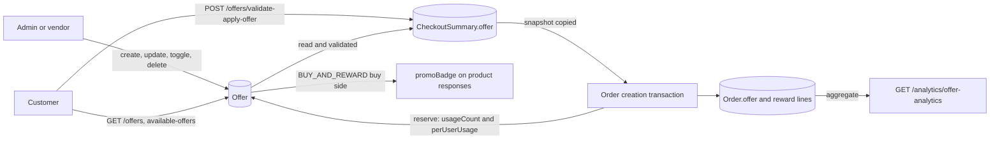
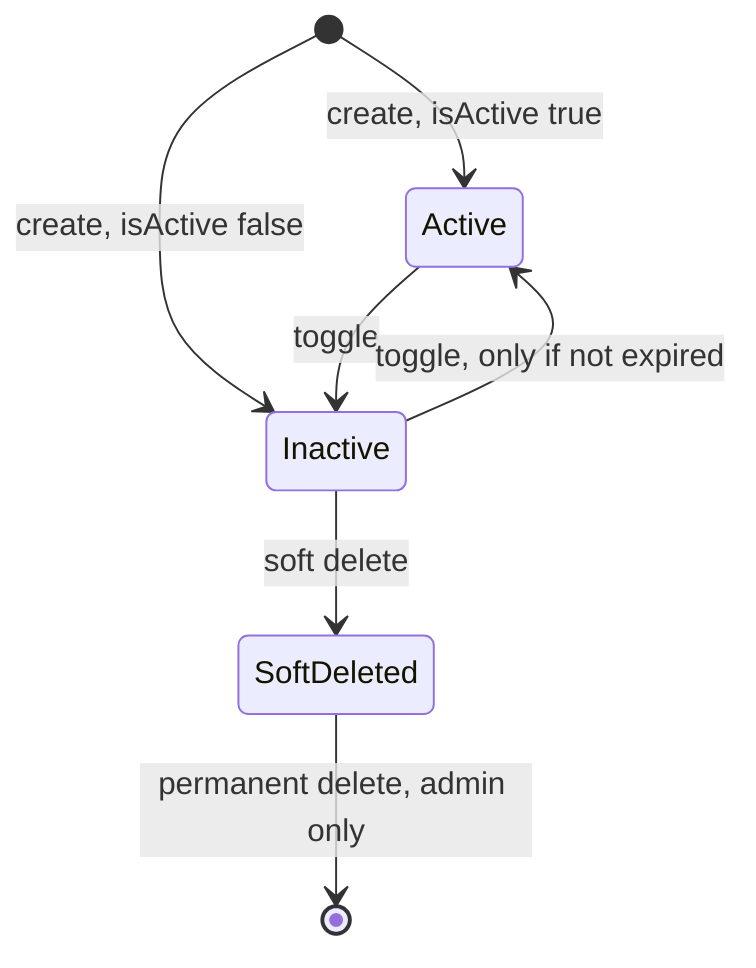
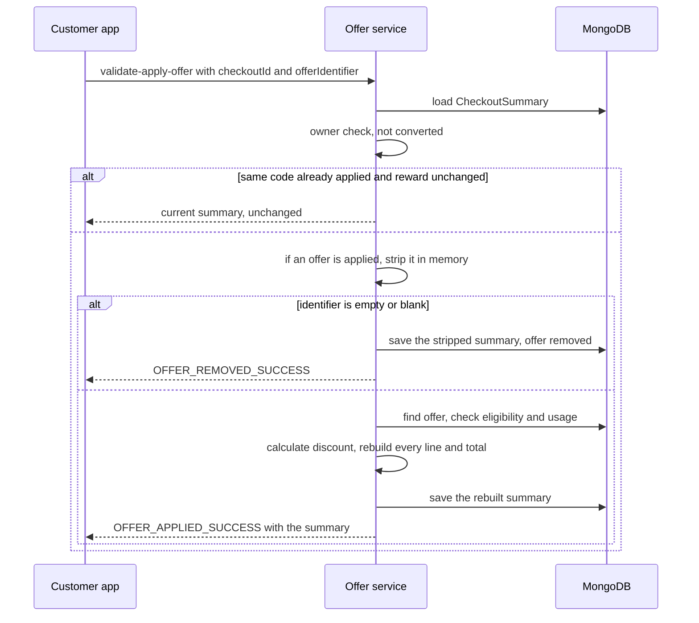
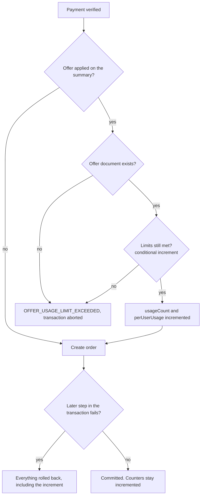

# Offers

This page describes the Offer engine from the code: what an offer contains, which
types exist and which of them work, who can create and change offers, how a customer
applies one to a checkout, how the discount is calculated, and how usage is counted
and reserved when the order is created. Cart, product, checkout and order rules are
linked, not repeated. Coupons are a separate, much smaller system; see
[Coupons](./coupons.md).

Paths are relative to `src/app/`; the module is `modules/Offer/`. Statements come from
the committed code unless marked **Inferred** (read from code, not run) or **Executed**
(a probe ran the real validation schema or calculation helpers on synthetic data).
Uncommitted working-tree features are not described.

---

## At a glance

| Question | Answer |
| --- | --- |
| Base path | `/api/v1/offers`. |
| Offer types in the schema | `PERCENT`, `FLAT`, `FREE_DELIVERY`, `BUY_AND_REWARD`. |
| Types that can be created and applied | `PERCENT`, `FLAT`, `BUY_AND_REWARD`. `FREE_DELIVERY` is rejected on create and update and excluded from every customer-facing query, so it is **disabled**. See [Offer types](#offer-types). |
| Who creates offers | `ADMIN`, `SUPER_ADMIN`, `VENDOR`, `SUB_VENDOR`, with an `APPROVED` account. Admin offers are global; vendor offers belong to the creating vendor row. |
| Who applies offers | A `CUSTOMER`, on an unconverted `CheckoutSummary` they own, with `POST /offers/validate-apply-offer`. |
| One offer per checkout | Yes. Applying another offer replaces the first one. |
| "Auto-apply" | A label only. Nothing applies an offer automatically; the client still calls validate-apply with the offer's id. See [Promo code versus auto-apply](#promo-code-versus-auto-apply). |
| Where the discount lands | On the checkout's item lines (tax-inclusive) for `PERCENT`, `FLAT` and in-cart rewards, or as an extra zero-price line for most free rewards. The delivery charge and service charge are never discounted. |
| Who bears the cost | The vendor. Payout is recomputed from the reduced item totals, and there is no platform-funded branch, even for global offers. |
| Usage limits | `userUsageLimit` (per customer) and optional `maxUsageCount` (total). The total limit is enforced **only** when the order is created. |
| Reservation | Inside the order-creation transaction. Counters are never decremented afterwards. |
| Notifications | None. The only write to the activity log is a permanent delete. |



---

## Data model

### `Offer` (`offer.model.ts`)

`timestamps: true`. Indexes: `{ isGlobal, isActive }`, `{ vendorId, isActive }`,
`{ code, isActive }`, `{ isActive, isDeleted, expiresAt }`, and a **unique, sparse**
index on `code` (only documents where `code` is a string).

| Field | Notes |
| --- | --- |
| `title`, `description` | Localized `{ en, pt }`. `title` needs at least 2 characters in each language (request validation). |
| `offerType` | `PERCENT`, `FLAT`, `FREE_DELIVERY`, `BUY_AND_REWARD`. |
| `code` | Upper-cased and trimmed by request validation. Present only on manual-code offers. |
| `isAutoApply` | Required. When `true` the offer has no `code`; when `false` it must have one. |
| `adminId`, `vendorId`, `isGlobal` | Ownership. Admin-created offers: `adminId` set, `vendorId: null`, `isGlobal: true`. Vendor-created offers: `vendorId` set, `isGlobal: false`, `adminId: null`. |
| `discountValue` | Percent (`PERCENT`) or amount (`FLAT`). Forced to `0` for `BUY_AND_REWARD`. |
| `maxDiscountAmount` | Cap used by `PERCENT` only; a value of `0` or unset means no cap. |
| `minOrderAmount` | Default `0`. Compared with the cart total **before** the offer. |
| `scopeType`, `scopeCategories`, `scopeProducts` | Item scope for `PERCENT` and `FLAT`. `ALL_PRODUCTS`, `CATEGORIES` or `SPECIFIC_PRODUCTS`. |
| `buyAndReward` | `buy` (`scope`, `categoryIds` or `productIds`, optional `variationSku`, `quantity`) and `reward` (`type`, `quantity`, `productId`, `variationSku`, `options[]`, `includeAddons`). |
| `validFrom`, `expiresAt` | Required window. |
| `maxUsageCount`, `usageCount` | Total limit (optional) and the running total. |
| `userUsageLimit`, `perUserUsage` | Per-customer limit (default `1`) and a map of customer id to count. |
| `isActive`, `isDeleted` | Switch and soft-delete flag. |

### Where an applied offer is stored

| Place | What is stored |
| --- | --- |
| `CheckoutSummary.offer` | `{ isApplied, offerApplied }`. `offerApplied` holds `promoId`, `title` (flattened to the request language), `code`, `promoType` (`OFFER`), `discountType` (the offer type), `discountValue`, `maxDiscountAmount` and, for rewards, `rewardSnapshot`. A fresh summary starts with `isApplied: false`, `offerApplied: null`. |
| `rewardSnapshot` | `buyQuantity`, `rewardQuantity`, `freeQty`, `rewardType`, `productId`, `productName`, `variationSku`, `wasInsertedAsNewLine`, `selectedFromOptions[]`. |
| `CheckoutSummary.orderCalculation.totalOfferDiscount` | The discount amount (see [a caveat for reward lines](#promo-reward-lines)). |
| Item lines | `productPricing.promoDiscountAmount`, `itemSummary.totalPromoDiscount`, and `isPromoRewardLine` on inserted reward lines. |
| `Order.offer` | The same `{ isApplied, offerApplied }` copied at order creation (`offerApplied` is a free-form `Mixed` field), plus the items, including reward lines. |

The summary and the order keep a snapshot. Editing, deactivating or deleting the offer
later does not change a summary or order that already carries it.

---

## Offer types

| Type | Create and update | Offered to customers | Applied | What it does |
| --- | --- | --- | --- | --- |
| `PERCENT` | Yes | Yes | Yes | `discountValue` percent of the eligible lines, capped by `maxDiscountAmount`. |
| `FLAT` | Yes | Yes | Yes | `discountValue` amount, capped by the eligible lines' total. |
| `BUY_AND_REWARD` | Yes | Yes | Yes | Buy a quantity of a product or category, get a reward quantity. Reward types `SAME_PRODUCT`, `FIXED_PRODUCT`, `CUSTOMER_CHOICE`. |
| `FREE_DELIVERY` | **Rejected** (`FREE_DELIVERY_CREATION_DISABLED`, `FREE_DELIVERY_UPDATE_DISABLED`) | **Excluded** from the available list | **Excluded** from the apply lookup | Would set the delivery charge to `0`. The calculation branch exists but is unreachable. |

Request validation alone accepts `FREE_DELIVERY` (**Executed**); the service is what
rejects it. An existing `FREE_DELIVERY` document (none can be created now) can be
toggled or soft-deleted, but not edited, and a customer cannot apply it. It still
appears in the `offerType` list of the analytics endpoint.

The delivery charge, service charge and their VAT are **never** changed by any type
that can be applied. Only the item lines move.

---

## Who can do what

All offer routes require authentication. None of them passes a permission-action
array to `auth()`, so any `ADMIN` can manage offers; the `CAN_MANAGE_COUPONS`
permission code is not used here (see [Coupons](./coupons.md#permissions)).

| Endpoint | Roles at the route | Rules in the service |
| --- | --- | --- |
| `POST /create-offer` | `ADMIN`, `SUPER_ADMIN`, `VENDOR`, `SUB_VENDOR` | Account must be `APPROVED`. Ownership fields are forced from the role. |
| `PATCH /:offerId` | same | `APPROVED`. A vendor or branch can change only its own offer (`offer.vendorId` equals the caller's `_id`). Admins can change any offer. |
| `PATCH /toggle-status/:offerId` | same | `APPROVED`, same ownership rule. |
| `DELETE /soft-delete/:offerId` | same | `APPROVED`, same ownership rule, offer must be inactive. |
| `DELETE /permanent-delete/:offerId` | `ADMIN`, `SUPER_ADMIN`, `VENDOR` | The service refuses anyone but an admin role (`COMMON_ACCESS_DENIED`), so a vendor passes the route and is rejected there. |
| `GET /` | admin roles, vendors, `CUSTOMER` | See [Reading offers](#reading-offers). |
| `GET /:offerId` | same | See [Reading offers](#reading-offers). |
| `GET /available-offers/:checkoutId` | `CUSTOMER` | The checkout must belong to the caller. |
| `POST /validate-apply-offer` | `CUSTOMER` | The checkout must belong to the caller and not be converted. |

A `SUB_VENDOR` is a branch with its own `Vendor` row, so an offer it creates has that
row's id as `vendorId` and applies only to checkouts of that branch. The parent's
offers do not apply to a branch's checkout, and the parent cannot edit a branch's
offer (the ownership check compares exact ids).

Vendor writes are also subject to the agreement gate (non-`GET` requests of an
unsigned vendor); see [Agreement Gate and Party Resolution](../07-agreements/agreement-gate.md#the-gate-in-authts).

---

## Creating an offer

Two layers run, in this order.

**Request validation (`offer.validation.ts`, strict: unknown keys are rejected).**

- `title` (localized), `offerType`, `validFrom`, `expiresAt` are required; `validFrom` must be before `expiresAt`.
- `PERCENT` and `FLAT` need `discountValue` and `scopeType`; scope arrays must match the scope (`ALL_PRODUCTS` empty, `CATEGORIES` only categories, `SPECIFIC_PRODUCTS` only products).
- `BUY_AND_REWARD` needs `buyAndReward`. `buy.quantity` and `reward.quantity` are positive integers; `CATEGORIES` needs `categoryIds`, `SPECIFIC_PRODUCTS` needs `productIds`; `FIXED_PRODUCT` needs `productId`; `CUSTOMER_CHOICE` needs at least 2 `options`; `SAME_PRODUCT` must **not** carry a `variationSku`; a product id must not repeat between `buy.productIds` and `reward.options`.
- `isAutoApply` defaults to `false`. Without auto-apply a `code` is required; with auto-apply a `code` is refused.
- `userUsageLimit` positive integer (default `1`), `maxUsageCount` positive integer (optional), `minOrderAmount` at least `0` (default `0`).

**Service (`createOffer`).**

1. Account status must be `APPROVED` (`NOT_AUTHORIZED_WITH_ACCOUNT_STATUS`, 403).
2. Ownership is set from the role: vendor or branch means `vendorId` = caller, `isGlobal: false`, `adminId: null`; any other role means `adminId` = caller, `isGlobal: true`, `vendorId: null`. An admin cannot create an offer for one vendor.
3. A manual code must not match an existing **non-deleted** offer (`OFFER_CODE_ALREADY_EXISTS`, 409).
4. By type: `PERCENT` and `FLAT` need `discountValue > 0` and pass the scope checks (categories and products must exist and not be deleted; a vendor can reference only its own). `BUY_AND_REWARD` sets `discountValue = 0` and checks that every referenced product exists, is not deleted, belongs to the vendor (vendor callers only), has a `variationSku` when it has variations (fixed and choice rewards), and that any `variationSku` exists. `FREE_DELIVERY` is refused.
5. `expiresAt` must be after `validFrom` and in the future (`END_DATE_CANNOT_BE_IN_PAST`). A `validFrom` in the past is allowed.
6. An auto-apply offer must not duplicate an active one of the same owner and type (same discount and scope for `PERCENT` and `FLAT`; same buy and reward configuration for `BUY_AND_REWARD`): `DUPLICATE_AUTO_APPLY_OFFER`, 409.
7. The offer is stored with `usageCount: 0`, `isDeleted: false`, `isActive` from the request (default `true`).

A `PERCENT` value above 100 is **not** rejected on create; see [Guards and edge cases](#guards-and-edge-cases).

### Updating an offer

The request schema is the create schema made partial. The service then:

- finds a non-deleted offer, and for a vendor or branch requires ownership;
- refuses an **expired** offer unless the request also sends `expiresAt` (`EXPIRED_OFFER_UPDATE_REQUIRES_DATE_EXTENSION`); it does not check that the new date is in the future;
- for an auto-apply offer clears `code`; for a manual one requires a code (the new one must not be in use by another non-deleted offer: `CODE_ALREADY_IN_USE`);
- checks `expiresAt` after `validFrom` using stored values for the missing one;
- on an `offerType` change, resets `discountValue` to `0` (to `BUY_AND_REWARD`) or drops `buyAndReward`, and resets the scope when the new type is not `PERCENT` or `FLAT`;
- for `PERCENT`, requires `0 < discountValue <= 100` when sent; for `FLAT`, `discountValue > 0`;
- refuses any `FREE_DELIVERY` offer (`FREE_DELIVERY_UPDATE_DISABLED`);
- re-validates scope references (`PERCENT`, `FLAT`) and the merged `buyAndReward` configuration and its products (`BUY_AND_REWARD`);
- requires `maxUsageCount` not below the current `usageCount` (`MAX_USAGE_LESS_THAN_CURRENT_USAGE`);
- writes the flattened payload with `$set` and `runValidators: false`.

The update schema also accepts `adminId`, `vendorId`, `isGlobal`, `usageCount` and
`isActive` (**Executed**: the schema parses them), and the service does not remove them
before the `$set`. See [Mismatches](#mismatches-and-inconsistencies).

### Toggle and delete

| Action | Rule |
| --- | --- |
| Toggle | Flips `isActive`. Refused for a deleted offer (`CANNOT_TOGGLE_DELETED_OFFER`) and when activating an offer whose `expiresAt` has passed (`CANNOT_ACTIVATE_EXPIRED_OFFER`). Deactivating always works. |
| Soft delete | The offer must already be inactive (`ACTIVE_OFFER_MUST_BE_DEACTIVATED_BEFORE_DELETING`). Sets `isDeleted: true`, `isActive: false`. A second call returns `OFFER_ALREADY_DELETED` (409). |
| Permanent delete | Admin only. The offer must be soft-deleted (`SOFT_DELETE_REQUIRED_BEFORE_PERMANENT_DELETE`) and inactive. Removes the document and writes an activity log entry `OFFER_PERMANENTLY_DELETED` (type `DANGER`) from the controller. |



### Activation and expiry

- An offer is **usable** only when `isActive`, not `isDeleted`, `validFrom <= now <= expiresAt`, and the type is not `FREE_DELIVERY`.
- Expiry is **passive**. No cron or hook deactivates expired offers (the order crons do not touch offers), so an expired offer keeps `isActive: true`; it is simply filtered out by date wherever it is looked up.
- An expired offer cannot be reactivated by toggle, and cannot be edited without a new `expiresAt`.
- A `validFrom` in the future keeps the offer out of apply and available results until it starts.

---

## Scope and visibility

### Which offers a checkout can see

The apply lookup and the available list use the same base filter: active, not
deleted, not `FREE_DELIVERY`, inside the window, and one of:

- `vendorId` equals the **checkout's** `vendorId` (the row that owns the products, so a branch for branch products);
- `vendorId` is `null` (admin offers);
- `isGlobal` is `true`.

### Scope for `PERCENT` and `FLAT`

| `scopeType` | Eligible lines |
| --- | --- |
| `ALL_PRODUCTS` | Every line. |
| `CATEGORIES` | Lines whose product's primary `category` or any `additionalCategories` entry is in `scopeCategories`. |
| `SPECIFIC_PRODUCTS` | Lines whose `productId` is in `scopeProducts`. |

The offer is applicable only if at least one line is eligible
(`OFFER_NOT_VALID_FOR_CART_PRODUCTS` otherwise). The discount is then computed on the
eligible lines only. An eligible line's base is its whole `grandTotal`, add-ons
included (**Executed** for the product scope; the category scope uses the same
path with a product lookup, **Inferred**).

### Scope for `BUY_AND_REWARD`

The buy side has its own scope (`CATEGORIES` or `SPECIFIC_PRODUCTS`, optionally one
`variationSku`) and does not use `scopeType`. The reward side is described in
[BUY_AND_REWARD](#buy-and-reward).

### Minimum order

`minOrderAmount` is compared with the cart total **before** the offer
(`itemsSubtotal + totalOfferDiscount` of the summary). A `FLAT` offer also needs that
total to be at least `discountValue`. Both failures use
`MIN_ORDER_AMOUNT_REQUIRED_TEMPLATE`. The minimum is compared with the whole cart,
not with the eligible lines.

---

## Reading offers

| Read | Who sees what |
| --- | --- |
| `GET /offers` | **Vendor or branch**: only offers with its own `vendorId`, not deleted (global offers are not listed). **Customer**: any vendor's and any global offer that is active, not deleted, and inside its window. `isExpired=true` lists expired ones instead, and `isExpired=false` keeps only the `expiresAt` bound (it drops the `validFrom` bound). **Admin**: everything, including deleted offers unless `isDeleted` is filtered. Search covers `title.en`, `title.pt`, `code`; pagination and sorting use the shared query builder. |
| `GET /offers/:offerId` | Admin: any offer. Others: not deleted. Customer: also active (no date check). A vendor may not read another vendor's non-global offer (403). |
| `GET /offers/available-offers/:checkoutId` | Every offer that passes the base filter for that checkout, each with `isEligible`, a localized `message` and the reason it is not eligible. Not sorted. |

Customers receive titles and descriptions in the request language; other roles receive
the `{ en, pt }` objects. Responses are whole offer documents, without a field
projection. Customers therefore receive manual promo `code` values, and the
available-offers payload (built from lean documents) also carries `usageCount`,
`maxUsageCount` and `perUserUsage`, which maps **other customers' ids** to counts.
See [Mismatches](#mismatches-and-inconsistencies).

### How `isEligible` is decided

An offer is eligible for a checkout when all of these hold: minimum order met (cart
total before the offer), the `FLAT` amount reachable, the customer's own usage below
`userUsageLimit`, and the scope or buy trigger matched (for `BUY_AND_REWARD`, at least
one full `buy.quantity` tier is in the cart). The `message` names the first failing
reason: not valid for the cart's products, add more quantity (`BUY_AND_REWARD`), add
more to reach the amount, or usage limit reached. `maxUsageCount` is **not** part of
this check.

---

## Applying an offer

`POST /offers/validate-apply-offer` with `{ checkoutId, offerIdentifier, selectedReward? }`
(strict body; `checkoutId` is 24 hex characters).



### Order of the checks

1. The summary must exist (404), belong to the caller (403) and not be converted (`CANNOT_APPLY_OFFER_TO_COMPLETED_CHECKOUT`).
2. If the same code is already applied and, for `CUSTOMER_CHOICE`, the selected reward is unchanged, the call returns the stored summary without recalculating.
3. If another offer is applied, it is stripped **in memory only** (see [Remove and replace](#remove-and-replace)).
4. A blank `offerIdentifier` means "remove the offer" and ends here.
5. Lookup with the base filter above. An identifier that is a valid 24-character id is looked up by `_id`; anything else is looked up as an upper-cased `code`. No match: `INVALID_OFFER_OR_PROMO_CODE`.
6. An offer found **by id** must be auto-apply; otherwise `OFFER_REQUIRES_VALID_PROMO_CODE`.
7. Minimum order, then the `FLAT` amount, both against the cart total before the offer (`MIN_ORDER_AMOUNT_REQUIRED_TEMPLATE`).
8. `PERCENT` and `FLAT` scope match (`OFFER_NOT_VALID_FOR_CART_PRODUCTS`).
9. `BUY_AND_REWARD` trigger: at least one full buy tier in the cart (`BUY_AND_REWARD_ADD_MORE_QTY_TO_UNLOCK`, with the missing quantity and the product or category label).
10. Reward selection, see below.
11. Per-customer usage: the number of the customer's orders that carry this offer must be below `userUsageLimit` (`OFFER_USAGE_LIMIT_EXCEEDED`).

Not checked at apply time: `maxUsageCount`, the vendor's agreement or store status (checkout did that), and the state of the payment (see [Guards](#guards-and-edge-cases)).

### Promo code versus auto-apply

- A manual-code offer (`isAutoApply: false`) is applied by **code**. Passing its id is refused.
- An auto-apply offer has no code and is applied by **id**.
- `isAutoApply` is read only by create, update and this lookup. No checkout or cart step applies an offer on its own, so "auto-apply" means only "no code is needed"; the client must still send the id. **Inferred** from the absence of any other reader (searched the whole `src/`).
- Codes are compared upper-cased. A code that is itself 24 hex characters would be treated as an id and could not be applied (**Executed**: only 24-character hex strings pass the id check; 12-character strings do not).

### Reward selection (`CUSTOMER_CHOICE`)

`selectedReward` is required for a `CUSTOMER_CHOICE` offer (`SELECTED_REWARD_REQUIRED`) and forbidden for any other
(`SELECTED_REWARD_NOT_APPLICABLE`). Its `productId` must be one of the offer's `options`
(`SELECTED_REWARD_NOT_IN_OPTIONS`), its `variationSku` must match that option exactly
(`SELECTED_REWARD_VARIATION_MISMATCH`), and the product must be approved, active, not
deleted, have the variation if one is given, and belong to the checkout's vendor
(`SELECTED_REWARD_PRODUCT_UNAVAILABLE`). Sending a different selection for the same
code re-applies the offer.

### Remove and replace

- **Remove:** apply with a blank `offerIdentifier`. The service rebuilds the summary from
  the stored lines without promo reward lines and with every promo discount reset, sets
  `offer.isApplied: false`, and clears `offerApplied`.
- **Replace:** applying a different offer strips the current one in memory and
  calculates the new one on the clean lines. If the new offer fails any check, **nothing is saved** and the old offer stays applied. Only a successful apply, or an explicit
  remove, writes the summary.
- **New checkout:** `POST /checkout` deletes the customer's unconverted summaries for that vendor and
  creates a new one with `offer.isApplied: false`, so the offer has to be applied
  again. Creating a checkout does not consume offer usage.

The summary is rebuilt by `rebuildCheckoutSummary` (item lines, tax, commission, payout
split, delivery VAT, service-charge VAT, grand total). If the vendor payout would be
negative or the split does not reconcile within 0.01, the apply fails with
`PAYOUT_SPLIT_RECONCILIATION_MISMATCH`.

---

## Discount calculation

All item amounts are **tax-inclusive**. The offer reduces a line's `grandTotal`; tax is
then recomputed from the reduced total (`total × rate / (100 + rate)`), commission is
recomputed on the net-of-tax amount, and the vendor's net payout follows. The product's
own store discount has already been applied to `priceAfterProductDiscount`, so the two
**stack**. See [Products and Categories](../05-products/products.md) for the product price
fields and [Checkout and Order Creation](../03-orders/checkout-and-order-creation.md#how-the-amounts-are-calculated)
for the rest of the summary.

| Type | Discount |
| --- | --- |
| `PERCENT` | `eligibleSubtotal × discountValue / 100`, limited to `maxDiscountAmount` when that is greater than `0`. |
| `FLAT` | The smaller of `discountValue` and `eligibleSubtotal`. |
| `BUY_AND_REWARD` | The value of the free units (see below). |

The discount is spread over the eligible lines in proportion to each line's
`grandTotal`, with the last eligible line taking the rounding remainder. Add-ons of a
discounted line are discounted by the same ratio. Amounts use two-decimal rounding.

### Executed examples

Synthetic cart: Burger 3 × 10.00 and Fries 2 × 5.00 (23% tax included, 40.00 subtotal),
delivery 3.00 net, service charge 1.00, commission 10% plus 23% VAT, fleet fee 10%.
Results from the real `calculateOfferDiscount` and `rebuildCheckoutSummary`.

| Scenario | `totalOfferDiscount` | `itemsSubtotal` after | Grand total | Vendor net payout |
| --- | --- | --- | --- | --- |
| No offer | 0 | 40.00 | 44.92 | 36.00 |
| `PERCENT` 10, all products | 4.00 | 36.00 | 40.92 | 32.39 |
| `PERCENT` 50, max 5 | 5.00 | 35.00 | 39.92 | 31.51 |
| `PERCENT` 10, only Fries | 1.00 | 39.00 | 43.92 | 35.10 |
| `FLAT` 7 | 7.00 | 33.00 | 37.92 | 29.71 |
| `FLAT` 20, only Fries (eligible subtotal 10) | 10.00 | 30.00 | 34.92 | 27.00 |
| `PERCENT` 150 | error | n/a | n/a | `PAYOUT_SPLIT_RECONCILIATION_MISMATCH` |
| `SAME_PRODUCT` buy 2 get 1, Burger × 3 | 10.00 | **40.00** | **44.92** | 36.00 |
| `SAME_PRODUCT` buy 1 get 2, Burger × 3 | 30.00 | **40.00** | **44.92** | 36.00 |
| `FIXED_PRODUCT` reward Fries (in cart), buy 2 Burger | 5.00 | 35.00 | 39.92 | 31.50 |

The grand total keeps the delivery charge (3.00 plus 23% VAT), service charge and
service-charge VAT untouched in every row. The `SAME_PRODUCT` rows are explained in the
next section.

---

## Buy and reward

### Trigger

The buy side counts cart units. `SPECIFIC_PRODUCTS` counts lines whose `productId` is in
`buy.productIds`; `CATEGORIES` counts lines of products in any `buy.categoryIds` (primary or additional
category). If `buy.variationSku` is set, only units of that variation count. Every unit of every
matching line counts together.

```text
eligibleRewardQty = floor(triggerQty / buy.quantity) × reward.quantity
```

(**Executed**: buy 2 reward 1 gives 1 at 3 units and 2 at 4 units; buy 3 reward 2 gives 4 at 7 units.)
The offer is unavailable while `eligibleRewardQty` is `0`. The reward quantity repeats for each
complete tier, so a bigger cart earns more, up to the limits below.

### Reward types

| `reward.type` | Reward product | Where the reward lands | `freeQty` |
| --- | --- | --- | --- |
| `SAME_PRODUCT` | The bought product. No configured variation; the free unit mirrors the matching cart line's variation. | An **extra zero-price line** inserted after the cart lines. One line per consumed source line, cheapest unit price first. | `min(eligibleRewardQty, units in the matching lines)` |
| `FIXED_PRODUCT` | `reward.productId` (and `reward.variationSku`). | If the reward product (and variation) is **already in the cart**: the discount is applied to the **cheapest** matching line for `freeQty` units of it. Otherwise an extra zero-price line is inserted. | `min(eligibleRewardQty, units of the target line)` when in the cart, else `eligibleRewardQty` |
| `CUSTOMER_CHOICE` | The option the customer selected at apply time. | Same as `FIXED_PRODUCT`. | Same as `FIXED_PRODUCT` |

A reward product that must be added as a new line is priced from the current product
(approved, active, not deleted, same vendor as the checkout, variation resolved, store
discount applied). If it cannot be resolved the offer still applies but with **no** reward
and a discount of `0` (**Inferred**: read from `calculateOfferDiscount`; the in-cart and
`SAME_PRODUCT` paths were executed, the product lookup path was not).

### Promo reward lines

An inserted reward line has:

- `isPromoRewardLine: true`, `addons: []`;
- `productPricing.unitPrice`, `lineTotal` and `taxAmount` of `0`, with `promoDiscountAmount` equal to the unit price after the store discount;
- `itemSummary`: `quantity` = the free quantity, `grandTotal` `0`, `totalPromoDiscount` = unit price × quantity;
- zero commission and zero vendor earnings.

Handling elsewhere:

- Reward lines are excluded from `itemsSubtotal`, tax and the original-price total, and are skipped by discount distribution.
- They are ordinary lines in `items`, so `totalItems` and `totalQuantity` count them, and they are copied into `Order.items`.
- Removing or replacing the offer deletes every `isPromoRewardLine` line.
- Stock is deducted for them like any other line at vendor acceptance, for vendors whose stock is checked (see [Order Lifecycle](../03-orders/order-lifecycle.md)). An out-of-stock reward can therefore fail acceptance with `INSUFFICIENT_STOCK` after payment.
- **Caveat (Executed):** for an **inserted** reward line the paid lines are *not* reduced. The customer pays the same amount as without the offer and receives the free units in addition, while `totalOfferDiscount` records the value of those units. So for `SAME_PRODUCT` the "discount" is the retail value of the bonus units, not a reduction of the total. For an **in-cart** reward (the `FIXED_PRODUCT` row above) the target line is reduced and the total goes down.
- The vendor's payout does not change in the `SAME_PRODUCT` rows (36.00 in both), so the cost of the free goods sits outside the ledger.

### `includeAddons`

It matters only when the reward lands on an existing cart line. The line's discount amount is unchanged, but when `includeAddons` is `false` the add-ons are exempt and the whole discount sits on the product part; when `true` the same discount is spread over product and add-ons in proportion. **Inferred** from `rebuildCheckoutSummary`; not executed with add-ons. Inserted reward lines have no add-ons, so the flag has no effect on them.

---

## Usage limits, reservation and rollback

| Limit | Field | Checked at apply | Checked in the available list | Checked at order creation |
| --- | --- | --- | --- | --- |
| Per customer | `userUsageLimit` | Yes: counts the customer's orders that carry this offer, below the limit | Yes (same count) | Yes: `perUserUsage.<customerId>` below the limit |
| Total | `maxUsageCount` | **No** | **No** | Yes: `usageCount` below the limit |

### Reservation

`finalizeCheckoutIntoOrder` runs inside one MongoDB transaction and has three call sites:
`POST /orders/create-order`, the saved-card payment, and the gateway notification
webhook. When the summary has an applied offer it:

1. reads the offer (`maxUsageCount`, `userUsageLimit`) inside the session; a missing offer document gives `OFFER_USAGE_LIMIT_EXCEEDED`;
2. runs one conditional update: `_id` matches, `perUserUsage.<customerId>` is absent or below `userUsageLimit` (default `1`), and `usageCount` is below `maxUsageCount` when that is set; the update increments `perUserUsage.<customerId>` and `usageCount` by `1`;
3. gives `OFFER_USAGE_LIMIT_EXCEEDED` if nothing matched, which aborts the whole transaction;
4. then creates the `Order`, the `ORDER_PAYMENT` transaction and marks the summary converted.

The conditional update is what makes the limits race-safe. The offer is **not**
re-validated at this point: its active flag, dates, deletion, scope, minimum order and
reward availability are not re-read, and the discount on the summary is trusted. An offer
deactivated or expired between apply and payment is still honored; a permanently deleted
one fails the reservation.



### What is never given back

- The counters are **never decremented**: not on customer cancellation, vendor rejection, admin refund or no-show. See [Cancellations, Refunds and Settlement](../03-orders/cancellations-refunds-settlement.md).
- The apply-time per-customer count excludes orders with status `'CANCELLED'`, but the order status is spelled `CANCELED`, so the exclusion never matches and canceled orders still count.
- Nothing releases an offer that was applied to a summary that is never paid. Only a committed order reserves usage, so an abandoned summary costs nothing.

### Failure after payment

Because `maxUsageCount` is checked only at order creation, a customer can apply an offer, pay, and then fail the reservation. In all three call sites the payment is already captured when `finalizeCheckoutIntoOrder` throws. The only gateway void in the code belongs to the admin refund route, so **nothing reverses the payment automatically**; recovery would be manual (**Inferred**: the three paths were read, the gateway behavior was not run). The webhook path only logs the failure.

---

## Interaction with cart, product and order

| Area | Interaction |
| --- | --- |
| Cart | None. The cart has no offer fields; the offer is applied on the summary built from the active cart items. See [Cart](../08-cart/cart.md#offers-coupons-and-promotions). |
| Checkout | The summary starts with no offer and a `totalOfferDiscount` of `0`. Nothing recalculates an applied summary except apply and remove. Prices, tax and delivery are fixed at checkout time; the offer works on those snapshots. |
| Payment | The gateway amount is the summary's `grandTotal` at payment-intent time. The apply endpoint does not check the summary's `paymentStatus` or `gatewayPaymentToken`, and the hosted-page order creation (`create-order` and the webhook) checks only that the gateway status is paid, not the amount. **Inferred:** applying or removing an offer after a payment intent on that flow leaves the gateway amount and the order total out of step. The saved-card flow charges the summary's current total at the moment of payment. |
| Product | The buy side of `BUY_AND_REWARD` offers feeds `promoBadge` on product responses (same vendor only, active and in window, first match). Global offers and other types give no badge, and usage limits are not considered. See [Products and Categories](../05-products/products.md#offers-and-promo-badges). |
| Order | `Order.offer` and `Order.items` (with reward lines) are snapshots. Settlement uses the order's `payoutSummary`, so the offer discount has already reduced the vendor's payout. |
| Analytics | `GET /api/v1/analytics/offer-analytics` (`ADMIN`, `SUPER_ADMIN`, `VENDOR`, `SUB_VENDOR`) aggregates offers and the orders that carry one, excluding `CANCELED` orders. |

---

## Expired, invalid and used offers

| Situation | Result |
| --- | --- |
| Unknown code, inactive, deleted, expired, not started, other vendor's offer, `FREE_DELIVERY` | `INVALID_OFFER_OR_PROMO_CODE` (400). The lookup cannot tell these apart. |
| Manual offer sent by id | `OFFER_REQUIRES_VALID_PROMO_CODE` (400) |
| Cart below `minOrderAmount` or below a `FLAT` amount | `MIN_ORDER_AMOUNT_REQUIRED_TEMPLATE` (400) |
| No eligible line for the scope | `OFFER_NOT_VALID_FOR_CART_PRODUCTS` (400) |
| Buy quantity not reached | `BUY_AND_REWARD_ADD_MORE_QTY_TO_UNLOCK` (400) |
| Customer already used the offer `userUsageLimit` times | `OFFER_USAGE_LIMIT_EXCEEDED` (400) |
| Total limit or per-customer limit hit at order creation | `OFFER_USAGE_LIMIT_EXCEEDED` (400), after payment |
| Summary converted or another customer's | `CANNOT_APPLY_OFFER_TO_COMPLETED_CHECKOUT` (400) / `COMMON_ACCESS_DENIED` (403) |
| Offer expires between apply and payment | Still honored (not re-checked) |
| Offer expires while a summary carries it | The summary keeps it until paid or replaced |

---

## Guards and edge cases

| Situation | Behavior |
| --- | --- |
| Applying the same code again | Returns the stored summary. Reward selection must be unchanged for `CUSTOMER_CHOICE`. |
| Applying a second offer that fails | Nothing saved; the first offer stays applied. |
| Two offers on one checkout | Impossible; there is one `offer` slot. |
| Offer applied, then a new `POST /checkout` | The old summary is deleted and the offer must be applied again. |
| `PERCENT` above 100 on create | Accepted by validation and service (only update caps at 100). **Executed:** applying 150 percent throws `PAYOUT_SPLIT_RECONCILIATION_MISMATCH`, so such an offer cannot be applied, but it is stored and listed. |
| `FLAT` larger than the cart | Refused at apply when the whole cart is below `discountValue`. When only the eligible lines are smaller (scoped offer), the discount is capped to them (**Executed**). |
| Discount makes the items free | Allowed. The customer still pays delivery and service charge plus VAT (**Executed**: `PERCENT` 100, or `FLAT` 40 on a 40.00 cart, leaves a grand total of 4.92 and a vendor payout of 0). |
| `userUsageLimit` of `0` or missing on a stored offer | Apply treats the limit as `0` (always exceeded) while the available list treats it as unlimited. Schema and validation make `1` the default, so this needs legacy data. **Inferred** |
| Reward lines and the trigger | The trigger counts every line in the stored summary, including existing reward lines; apply strips them first, so only the available list can be affected. **Inferred** |
| Available list after a `SAME_PRODUCT` reward | The cart total used for `minOrderAmount` adds `totalOfferDiscount` back even though the paid lines were not reduced, so it can overstate the total. **Inferred** |
| Offer by code that matches the id format | Treated as an id; only works for auto-apply offers. |
| Parent vendor's offer and a branch's checkout | Does not apply (different `vendorId`) unless the offer is global. |
| Vendor deactivates or deletes an offer that a checkout already carries | The checkout keeps the snapshot and the reservation still succeeds unless the document was permanently deleted. |
| Order creation races (webhook and client) | The unique gateway transaction id lets only one order be created; **Inferred:** the loser's transaction aborts and its counter increment is rolled back with it. |

---

## Notifications and logs

- No notification, email or socket event is sent for offers: not on creation, expiry, application or exhaustion. The notification type `OFFER` exists in the model but no code path uses it (see [Notification Triggers and Templates](../06-notifications/notification-triggers.md)).
- The activity log records only `OFFER_PERMANENTLY_DELETED`. Create, update, toggle and soft delete are not logged.

---

## Mismatches and inconsistencies

1. **`CANCELLED` versus `CANCELED`.** Apply-time usage counting filters out `'CANCELLED'`, which is not an order status, so canceled and rejected orders count toward the per-customer limit. The analytics endpoint uses the correct `CANCELED`. The reservation counters also never decrement, so the two mechanisms agree: a canceled order still consumes one use.
2. **`maxUsageCount` enforced too late.** Apply and the available list ignore it; order creation enforces it after payment, with no automatic reversal of a captured payment.
3. **Update accepts ownership and usage fields.** The update schema parses `adminId`, `vendorId`, `isGlobal`, `usageCount` and `isActive`, and the service writes them, so an owner could change `isGlobal` (making a vendor offer visible to every vendor's checkouts), hand the offer to another `vendorId`, or reset `usageCount`. **Inferred** for the effect; **Executed** for the schema accepting them.
4. **`PERCENT` range is checked only on update.** Create allows values above 100.
5. **"Auto-apply" does not apply automatically.** The flag only decides whether a code is needed.
6. **Promo codes and usage data are readable by customers.** `GET /offers` and the available list return the stored documents, including manual `code` values, and the available list returns `perUserUsage`, which contains other customers' ids.
7. **Code uniqueness.** The service checks only non-deleted offers, and its message says "active", but the unique sparse index on `code` also covers soft-deleted offers, so reusing the code of a soft-deleted offer would hit the index (duplicate-key error). **Inferred**: the index and the check disagree; the error path was not run.
8. **`SAME_PRODUCT` rewards do not reduce the total.** They add free units on top of the paid lines. The stored `totalOfferDiscount` and the `promoDiscountAmount` fields describe the value of those units.
9. **Global offers are funded by the vendor.** Payout is computed from reduced item totals with no funding branch, so an admin's global offer reduces each vendor's payout like a vendor's own offer.
10. **Unused message key.** `OFFER_SCOPE_TYPE_REQUIRED` exists in `offer.messages.ts` but no code uses it (the request validation uses its own English text).
11. **Expired offers stay active.** Expiry is never written back to `isActive`.

---

## Unverified or inferred behavior

- Category-scoped lookups (`CATEGORIES` scope, `CATEGORIES` buy side) and the reward-product lookup for an inserted `FIXED_PRODUCT` or `CUSTOMER_CHOICE` reward depend on product queries; they were read from the code, not run.
- `includeAddons` and add-on discounting were read from `rebuildCheckoutSummary`; the examples above have no add-ons.
- The payment-after-offer-change effect, the payment left captured when reservation fails, and the duplicate-key effect on reusing a soft-deleted code were derived from the code paths, not reproduced.
- How clients show `isEligible`, `message` and the reward options is not known from the code.
- The per-user count uses `$expr` with `$toString` on the order snapshot; its performance on large order collections was not measured.

---

## Related documentation

- [Coupons](./coupons.md): the separate `Coupon` model, how referral milestones create coupons, and why none can be redeemed.
- [Checkout and Order Creation](../03-orders/checkout-and-order-creation.md): the summary that offers modify, payment and the order transaction that reserves usage.
- [Cart](../08-cart/cart.md): the active cart items that become the summary.
- [Products and Categories](../05-products/products.md#offers-and-promo-badges): product pricing fields and `promoBadge`.
- [Cancellations, Refunds and Settlement](../03-orders/cancellations-refunds-settlement.md): why usage is never released and how refunds work.
- [Agreement Gate and Party Resolution](../07-agreements/agreement-gate.md): the gate that applies to vendor offer writes.
- [Vendors and Branches](../04-vendors/vendors-and-branches.md): branch rows and ownership.
