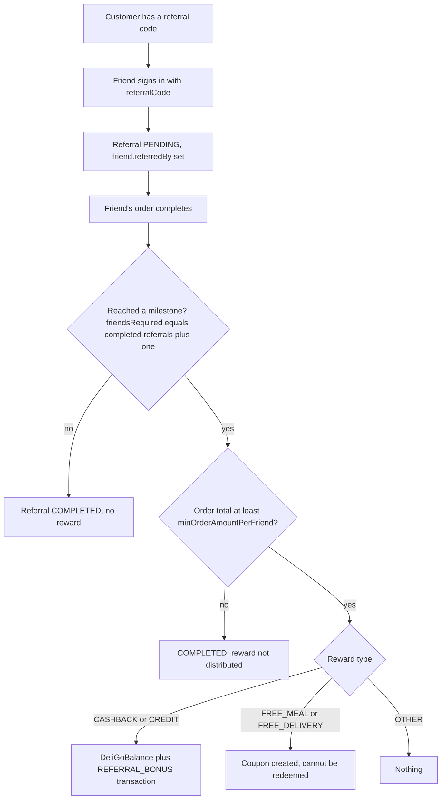

# Points and Referrals

Two reward mechanisms sit next to [Offers](./offers.md) and [Coupons](./coupons.md):

- **Points**: a customer earns points for each completed order and a rider for each delivery. There is a balance and a log, but no way to spend the points.
- **Referrals**: a customer can attach a referral code when they sign in. When the referred customer completes an order, the referrer may reach a milestone and receive a reward.

Both are driven by the order settlement worker rather than by a customer action, and both
are configured in the global settings.

Paths are relative to `src/app/`; the modules are `modules/Points/`, `modules/Referral/` and
`modules/DeliGo_Balance/`. Statements come from the committed code, read but not run,
unless marked **Inferred** or **Unresolved**. Uncommitted working-tree features are not described.

---

## At a glance

| Question | Answer |
| --- | --- |
| Models | `Points` (balance), `PointsLog` (history), `Referral`, `DeliGoBalance` (referral cash), `Coupon` (see [Coupons](./coupons.md)). |
| Who earns points | A `CUSTOMER` per completed order, a `DELIVERY_PARTNER` per delivered order. Nobody else. |
| When | Automatically in the settlement transaction when an order completes; also by two client routes that repeat the same call. |
| Redemption | None. A `REDEEM` type exists in the balance helper but no code calls it. |
| Expiry | A date is stored on the balance; nothing ever reads it. |
| Who refers | Customers only, in practice (only customers get a referral code and only customer sign-in accepts one). |
| Reward types | `CASHBACK` and `CREDIT` (added to the `DeliGoBalance`), `FREE_MEAL` and `FREE_DELIVERY` (create a `Coupon` that cannot be used), `OTHER` (nothing). |
| Notifications | None for points or referrals. |

---

## Points

### Earning

`PointsServices.addOrderPoints` and `addDeliveryPartnerPoints` run inside the settlement
transaction (see [Cancellations, Refunds and Settlement](../03-orders/cancellations-refunds-settlement.md#settlement)),
for `DELIVERED` and `PICKED_UP_BY_CUSTOMER` orders and **not** for `NO_SHOW`. A failure here
**aborts the whole settlement** because the worker passes its own session and the service
rethrows.

| | Customer | Rider |
| --- | --- | --- |
| Condition | Order status `DELIVERED` or `PICKED_UP_BY_CUSTOMER`, the order belongs to the customer | Order status `DELIVERED`, the order's rider is this rider |
| Amount | `floor(payoutSummary.grandTotal x rewards.customerPointsPerEuro)` | `rewards.riderPointsPerDelivery`, **or 20 when that setting is 0 or unset** |
| Skipped when | The amount is 0 (nothing is written and no log row exists) | Never |
| Duplicate guard | A `PointsLog` row of type `EARN` for the same user and order | same |

The settings default to 0, so with an untouched configuration **customers earn nothing** while
riders earn 20 points per delivery. The customer amount uses the order's grand total, which
includes delivery and service charges.

Each earn upserts the `Points` balance (`currentPoints`, `totalEarned`, `expiryDate`) and adds
a `PointsLog` row. The expiry date is `now + rewards.pointsExpiryDays` for a rider, with 365
days when the setting is 0; for a customer the configured value is passed as is, so with the
default 0 the stored date is "now" (**Inferred**). Each new earn overwrites `expiryDate` for
the whole balance. No job, query or endpoint reads `expiryDate`, so points never expire.

### Routes (`/api/v1/points`)

| Endpoint | Roles | Behavior |
| --- | --- | --- |
| `POST /add-order-points` | `CUSTOMER` | Body `orderId` (Mongo `_id`, strict). Runs the customer earn for the caller. Repeating it after the worker already granted points returns `POINTS_ALREADY_GRANTED_FOR_ORDER` with 0 earned. |
| `POST /add-rider-points` | `DELIVERY_PARTNER` | The same for a rider. |
| `GET /my-points` | `CUSTOMER`, `DELIVERY_PARTNER` | `currentPoints`, `totalEarned`, `totalSpent` (0 when there is no balance). |
| `GET /all-points` | `ADMIN`, `SUPER_ADMIN` | Every balance with the owner populated. The query chain applies no search, filter or pagination, so it returns all rows (**Inferred**). |

When the service is called from these routes (not from the worker) a failure is **swallowed**:
it writes a `FAILED_LOG` `PointsLog` row with 0 points and returns an error object, and the
controller still answers HTTP 200 with `success: true` and no data (**Inferred**). There is
no route to read the log.

### Balance and log models

`Points` has one row per user (`userId.id` and `userId.model`, unique). `PointsLog` types are
`EARN`, `REDEEM`, `REFERRAL_BONUS`, `REFUND`, `ADJUSTMENT`, `FAILED_LOG`, `OTHER`; only `EARN` and
`FAILED_LOG` are ever written. A partial unique index blocks two `EARN` rows for the same
user and reference. `referralPoints` and `REFERRAL_BONUS` in the points helper are unused.

---

## Referrals

### Referral codes

- A customer's `referralCode` is generated **the first time the customer profile is updated** through `PATCH /customers/:id` (four letters of the first name, padded with `X`, plus four random characters, unique across the customer, vendor and rider collections). It is **not** created at sign-up, so a customer who never updates the profile has an empty code and the stats show `N/A`.
- Only the `Customer` model has a `referralCode` field. `GET /referrals/my-referrals` is open to `CUSTOMER`, `DELIVERY_PARTNER` and `VENDOR`, but riders and vendors have no code (`N/A`), and no rider or vendor sign-in flow accepts a code.

### Attaching a code

`referralCode` is accepted on `POST /auth/login-customer` (email and phone) and `POST /auth/social-login`.

- A new customer with a code gets a `PENDING` `Referral` and `Customer.referredBy`.
- An existing customer with **no** `referredBy` can attach a code at a later login, even after ordering.
- A customer who already has `referredBy` and sends a code again gets `ALREADY_REFERRED`.
- An unknown code fails with `404 INVALID_REFERRAL_CODE` and a customer's own code with `SELF_REFERRAL_NOT_ALLOWED`; both abort the sign-in transaction.
- `Referral.referredId` is unique, so a user is referred at most once.

### Rewards

`ReferralServices.distributeReferralBonus` runs in the same settlement transaction, for the
customer of a completed, non-`NO_SHOW` order. Details of the milestone, coupon and minimum
order rules are on [Coupons](./coupons.md#how-a-coupon-is-created); in short:

1. It looks for that customer's `PENDING`, undistributed referral. None means nothing happens.
2. It counts the referrer's `COMPLETED` referrals plus this one and looks for a milestone whose `friendsRequired` equals that number exactly.
3. The referral is marked `COMPLETED` in every case. If the order total is below the milestone's minimum, no reward is given.
4. `CASHBACK` and `CREDIT` increase the referrer's `DeliGoBalance` (`totalBalance`, `totalEarned`) and write a `REFERRAL_BONUS` `Transaction` (payment method `WALLET`).
5. `FREE_MEAL` and `FREE_DELIVERY` create a `Coupon`, which no route can list or redeem.

The referral's reward status uses `isRewardDistributed` (true only when a milestone existed),
`distributedAt` and `referenceOrderId`.

### The DeliGo balance

`DeliGoBalance` (`totalBalance`, `pendingBalance`, `totalEarned`, `status`) is separate from the
[wallet](../10-payments/payouts-wallets-transactions.md). It is written only by referral rewards and the
rider welcome bonus and read only by the referral statistics. **No route withdraws, spends or
pays out the balance**, and `pendingBalance` and `status` are never used.

### Rider welcome bonus

When a referral entry is created for a `DELIVERY_PARTNER`, the rider's `DeliGoBalance` is
credited `rewards.newRiderWelcomeBonus` (default 0). **Inferred:** this path is not reachable
today, because the sign-in flows that accept a code only create customers.

### Statistics (`GET /referrals/my-referrals`)

For the caller it returns the referral code, a summary (total, successful and pending invites,
total earned and current `DeliGoBalance`, friends remaining for the next milestone), the list of
milestones with `isCompleted` and `isNext` flags, and the referral history (friend name,
photo, status, date). The friend's name is built by string concatenation, so a missing
profile shows `undefined undefined` instead of the intended `DeliGo User` fallback.

---

## Mismatches and inconsistencies

1. **Points can never be spent.** `REDEEM`, `totalSpent`, `REFERRAL_BONUS` and `ADJUSTMENT` exist in the code, but nothing redeems, adjusts or expires points.
2. **Defaults favour riders.** `customerPointsPerEuro` is 0 by default while `riderPointsPerDelivery: 0` is treated as 20, so a zero configured for riders cannot turn their points off.
3. **`expiryDate` is inconsistent and unused.** It is `now` for customers with the default setting and 365 days ahead for riders, and is never enforced.
4. **Referral codes are created late.** They only exist after the first profile update.
5. **Referral rewards are not spendable.** Cash and credit go to a `DeliGoBalance` with no outflow, and coupon rewards cannot be redeemed.
6. **A points failure blocks settlement.** An error in either points call inside the worker aborts the settlement transaction; wallets are not credited until a retry succeeds.
7. **Client point routes hide failures** behind a 200 response and a `FAILED_LOG` row.
8. **Unused settings and types:** `rewards.referralPoints`, `pendingBalance`, `DeliGoBalance.status`, and the `REFUND`, `ADJUSTMENT` and `OTHER` points log types.
9. **Referrer model is assumed to equal the referred model** when a referral is stored, which only holds because every referred user is a customer.

---

## Unverified or inferred behavior

- Nothing on this page was executed. Rates, fallbacks and the failure handling are read from the services.
- How clients display points, milestones or the `DeliGoBalance`, and whether any external process reads the balance, is not known from the backend.

---

## Related documentation

- [Coupons](./coupons.md): the coupon created by a free-meal or free-delivery milestone and why it cannot be used.
- [Platform Settings](../02-platform/platform-settings.md#rewards-settings): where the reward settings are set.
- [Cancellations, Refunds and Settlement](../03-orders/cancellations-refunds-settlement.md#settlement): the transaction that awards points and referral rewards.
- [Customer Addresses and Location](../03-identity-access/customer-addresses.md): the customer profile update that creates the referral code.
- [Authentication](../03-identity-access/authentication.md): the customer sign-in that accepts a referral code.
