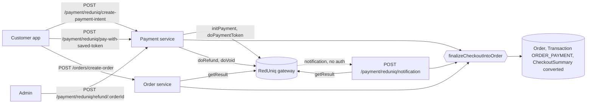
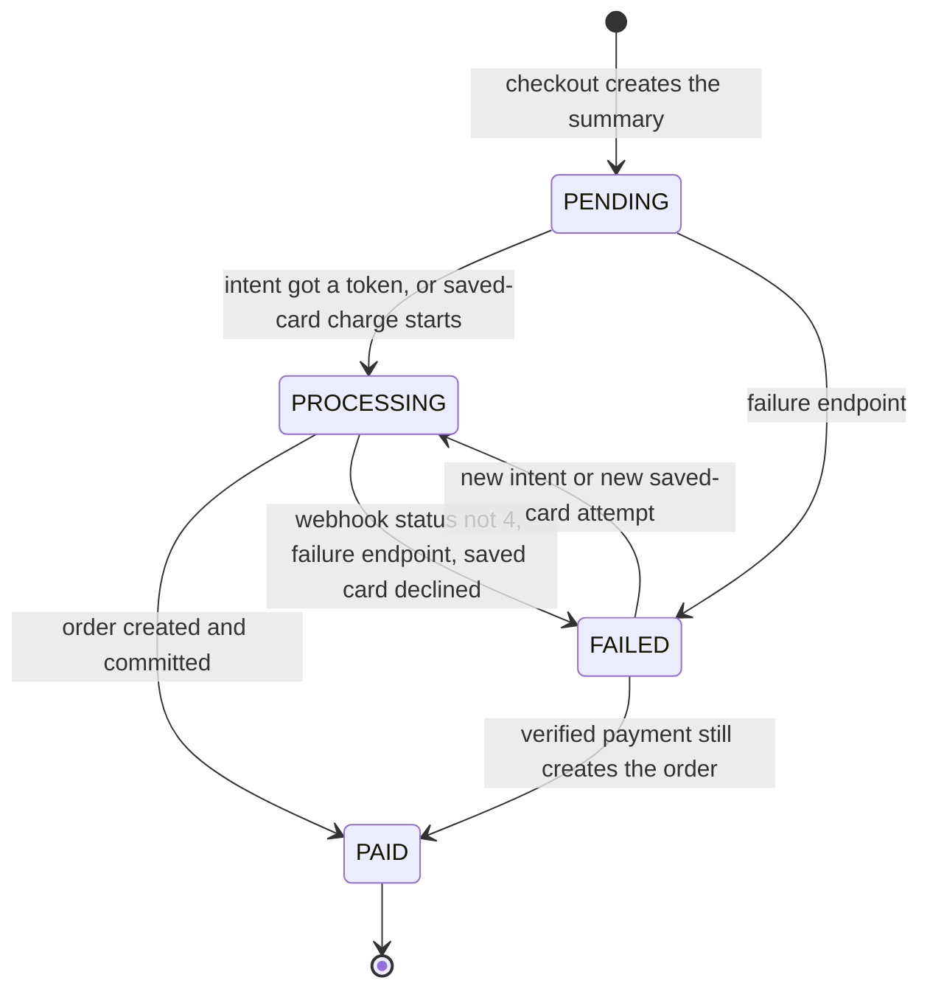
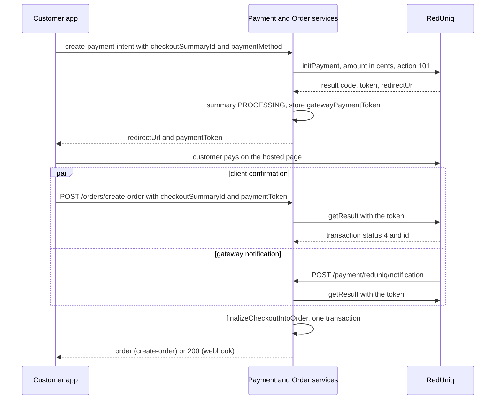
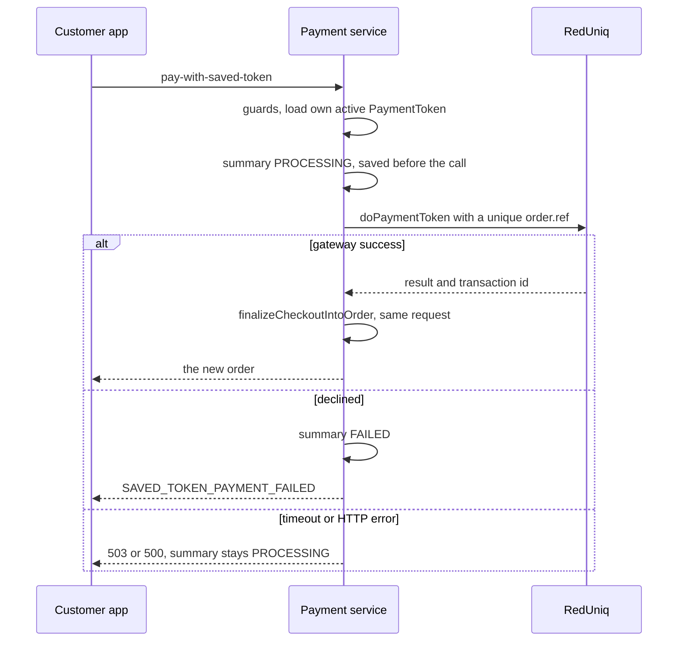
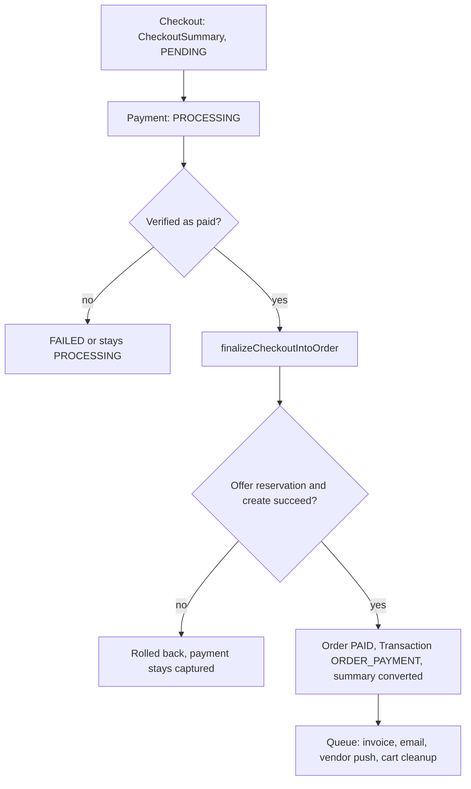

# Payments

This page describes payments from the code: which gateway is used and how it is
called, where payment state lives, how the three confirmation paths (client
confirmation, webhook, synchronous saved-card charge) reach order creation, what is
verified and what is not, and how refunds and voids work. Checkout amounts, order
creation internals and offer rules are linked, not repeated. Saved cards have their
own page: [Saved Cards](./saved-cards.md).

Paths are relative to `src/app/`; the main modules are `modules/Payment/`,
`modules/Payment-Token/`, `modules/Transaction/` and the gateway client
`lib/httpClients/redUniqClient.ts`. Statements come from the committed code unless
marked **Inferred** (read from code, not run) or **Executed** (a probe ran the real
service code against a local fake gateway with the database calls stubbed).
Uncommitted working-tree features are not described.

---

## At a glance

| Question | Answer |
| --- | --- |
| Provider | **RedUniq** only, through one HTTP endpoint (`REDUNIQ_API_URL`). Every call is a `POST` whose JSON body carries a `method` name and the credentials. |
| Payment model | **None.** There is no `Payment` collection. Payment state is spread over `CheckoutSummary`, `Order`, `Transaction` and `PaymentToken`. See [Where payment state lives](#where-payment-state-lives). |
| Methods | `CARD`, `MB_WAY`, `APPLE_PAY`, `PAYPAL`, `GOOGLE_PAY`, `OTHER`. Only `CARD` can be saved. |
| Flows | Hosted page (redirect), saved card (synchronous), and a gateway webhook that backs up the hosted page. |
| Authorization | Only a payment that is **verified as paid** creates an order. The order is created once, in one MongoDB transaction. |
| Sale type | Immediate sale (`action: 101`). There is no authorize-then-capture step. |
| Refund | Admin only, full amount only, after a cancel or reject. A void is used as a fallback. See [Refunds and voids](#refunds-and-voids). |
| Amount check | The gateway amount is **not** compared with the order total when a payment is verified. |
| Notifications | No push for payments. A refund email goes to the customer; the order receipt email comes from the order worker. |

---

## Where payment state lives

| Place | Fields | Written by |
| --- | --- | --- |
| `CheckoutSummary` (`modules/Checkout/checkout.model.ts`) | `paymentStatus` (`PENDING`, `PROCESSING`, `PAID`, `FAILED`, `REFUNDED`), `paymentMethod`, `gatewayPaymentToken`, `transactionId`, `orderId`, `isConvertedToOrder` | Checkout (initial `PENDING`), the payment service, `finalizeCheckoutIntoOrder` |
| `Order` | `paymentMethod`, `paymentStatus`, `isPaid`, `transactionId` (unique, sparse), `refundStatus` | Order creation (`PAID`, `isPaid: true`); refund (`REFUNDED`, `isPaid: false`) |
| `Transaction` (`modules/Transaction/`) | `transactionId` (unique), `orderId`, `userId`, `type`, `status`, `totalAmount`, `paymentMethod`, `remarks` | `ORDER_PAYMENT` at order creation; `REFUND` at refund; `INGREDIENT_PURCHASE` for ingredient orders; earnings and settlement types by the settlement worker |
| `PaymentToken` | Saved card metadata and the gateway token id | See [Saved Cards](./saved-cards.md) |
| `IngredientOrder` | `paymentStatus` (`PROCESSING`, `PAID`), `transactionId` | The vendor ingredient purchase, see [Ingredient purchases](#ingredient-purchases) |

An `Order` is created only after a verified payment, so its `paymentStatus` is only
ever `PAID` or, after a refund, `REFUNDED`. The other enum values (`PENDING`,
`PROCESSING`, `FAILED`) are never written to an order. `Transaction.status` is always
`SUCCESS` for payment rows written by this code; `PENDING` (the schema default) and
`FAILED` are never set by any payment path.

### Gateway references and identifiers

| Identifier | Where it comes from | Where it is used |
| --- | --- | --- |
| `order.ref` (hosted) | The checkout summary id (24-hex) | Sent on `initPayment`; the webhook reads it back to find the summary |
| `order.ref` (saved card) | `<summaryId>-<nanoid6>`, unique per attempt | Sent on `doPaymentToken`; the webhook cuts any ref longer than 24 characters back to 24 to recover the summary id (**Executed**) |
| Payment token (`token`) | Returned by `initPayment` | Stored as `CheckoutSummary.gatewayPaymentToken`; returned to the client as `paymentToken`; sent back on `create-order`; used by `getResult` |
| `transaction.id` | Returned by `getResult` (hosted) or `doPaymentToken` (saved card) | Stored as `Order.transactionId`, `CheckoutSummary.transactionId` and `Transaction.transactionId` (the `ORDER_PAYMENT` row). It is also the id sent on `doRefund` and `doVoid` |
| Refund reference | `transaction.id` of the refund or void reply, or none | Kept only inside the `REFUND` row's remarks as `(gateway ref: ...)` |
| `TXN-RF-<nanoid8>` | Generated locally | `Transaction.transactionId` of the `REFUND` row |
| Ingredient order `transactionId` | The payment token at intent time, the gateway transaction id after confirmation | `IngredientOrder.transactionId` |

---

## Gateway integration

`callReduniq(payload)` posts the payload to `REDUNIQ_API_URL` with an 8 second HTTP
timeout, behind a circuit breaker (10 second timeout, opens after a failure
percentage in a rolling window, 20 second reset). Only `getResult` is retried (one
retry, 400 ms delay, on retryable transport errors); every other method is sent once.
If `REDUNIQ_API_URL` is missing the payment routes answer `PAYMENT_GATEWAY_CONFIG_MISSING`
(500). An open breaker or a breaker timeout becomes `PAYMENT_GATEWAY_TEMP_UNAVAILABLE_502`
(503); an HTTP error from the gateway keeps its status with `GATEWAY_ERROR`, except a
`502`, which becomes the same temporary-unavailable key.

| Gateway `method` | Used for | Key fields |
| --- | --- | --- |
| `initPayment` | Start a hosted-page payment | `payment.amount` (cents), `action: 101`, `currency: '978'` (EUR), `solution`, `order.ref`, `returnUrlOk`, `returnUrlError`, `languageCode: 'pt'`, `notificationUrl`, optional `payToken.action: 500` |
| `getResult` | Verify a hosted payment | `token` |
| `doPaymentToken` | Charge a saved card | `payToken.id`, `payToken.action: 503`, `payment.action: 101`, `notificationUrl` (no currency field is sent) |
| `doRefund` | Refund | `transaction.id`, `payment.amount` (cents), `payment.action: 300` |
| `doVoid` | Cancel a payment that cannot be refunded | `transaction.id`, `comment` |
| `createPaymentToken`, `disablePaymentToken` | Saved cards | See [Saved Cards](./saved-cards.md) |

`solution` ids: `CARD` `113`, `MB_WAY` `110`, `APPLE_PAY` `115`, `PAYPAL` `105`,
`GOOGLE_PAY` `114`, and `null` for `OTHER`.

`returnUrlOk` and `returnUrlError` are built from `FRONTEND_PAYMENT_URL`
(`/payment-success?summaryId=...`, `/payment-failed?summaryId=...`). `notificationUrl` is
`BACKEND_BASE_URL + /payment/reduniq/notification` and is sent **only if**
`BACKEND_BASE_URL` is set, so without it the client's `create-order` call is the only
confirmation path. **Inferred:** the configured base URL has to contain the API prefix itself, because the code
appends only `/payment/...`.

### What counts as success

The code uses three different criteria, depending on the call.

| Call | Success when |
| --- | --- |
| `initPayment`, `createPaymentToken` | `result.code` is `00000000` or `17000000000` |
| `getResult` (hosted confirmation, webhook, ingredient confirmation) | `transaction.status` is the string `'4'` |
| `doPaymentToken`, `doRefund`, `doVoid` (`isRedUniqSuccess`) | `transaction.status === '1'`, or `result.code` is one of `00000000`, `17000000000`, `900000000`, `13000000000` |

**Executed** on the real helper: code `00100060` alone is not a success; status `'4'`
is **not** a success for `isRedUniqSuccess`; status `'1'` is. What the gateway means by
each status number is not described anywhere in the code (see
[Unverified or inferred behavior](#unverified-or-inferred-behavior)).

---

## Payment status lifecycle

The lifecycle that matters is `CheckoutSummary.paymentStatus`.

| Transition | Trigger |
| --- | --- |
| `PENDING` to `PROCESSING` | `create-payment-intent` succeeds **and the gateway returned a token**; or `pay-with-saved-token` starts (set before the gateway call) |
| `PROCESSING` to `PAID` | `finalizeCheckoutIntoOrder` commits (all three confirmation paths) |
| to `FAILED` | The webhook's `getResult` status is not `'4'`; `POST /payment/reduniq/handle-payment-failure/:checkoutSummaryId`; a saved-card reply that is not a success |
| `FAILED` to `PROCESSING` | A new intent (which also **replaces** `gatewayPaymentToken`) or a new saved-card attempt |
| `FAILED` to `PAID` | Nothing checks `paymentStatus` on confirmation, so a verified payment still creates the order (**Executed** for the webhook) |
| `REFUNDED` | Never written to the summary. Only the order moves to `REFUNDED` |

There is no cancel state. A customer who closes the hosted page ends up in the same
place as a failed payment, and no code tells the two apart.

---

## Hosted-page flow

### Payment intent

`POST /api/v1/payment/reduniq/create-payment-intent`, `CUSTOMER`. Body (strict):
`checkoutSummaryId` (24-hex), `paymentMethod` (`CARD`, `MB_WAY`, `APPLE_PAY`, `PAYPAL`,
`GOOGLE_PAY`, `OTHER`), optional boolean `saveCard` (**Executed**: `CASH`, a bad id, an
unknown key such as `amount`, and a string `saveCard` are all rejected).

Guards, in order: summary exists; belongs to the caller (`COMMON_UNAUTHORIZED_ACTION`,
403); not converted (`CHECKOUT_SUMMARY_ALREADY_CONVERTED`); not `PROCESSING`
(`PAYMENT_ALREADY_IN_PROCESS`); not `PAID` (`PAYMENT_ALREADY_COMPLETED`); gateway
configured. `FAILED` and `PENDING` summaries may start a payment.

The amount is `Math.round(payoutSummary.grandTotal * 100)`; the client cannot send one.
`saveCard` is applied only for `CARD` (it adds `payToken.action: 500`); for other methods it is
silently ignored and the response says `cardWillBeSaved: false` (**Executed**).

If the gateway answers with a code other than the two success codes, the call fails with
`PAYMENT_INITIATION_FAILED_BY_GATEWAY` (400) and the summary is **not** changed. On success
the summary gets `paymentMethod`, `paymentStatus = PROCESSING` and `gatewayPaymentToken`,
and the response carries `redirectUrl`, `paymentToken` and `cardWillBeSaved`.

**Executed:** if the gateway returns a success code but **no token**, the call still
answers 200 (with `paymentToken` empty) and leaves the summary `PENDING` with no token
stored. No order could then be confirmed for that attempt.

### Client confirmation

`POST /api/v1/orders/create-order`, `CUSTOMER`, body `{ checkoutSummaryId, paymentToken, deliveryNotes? }`
(strict). The checks, in order, are in
[Checkout and Order Creation](../03-orders/checkout-and-order-creation.md#order-creation):
summary belongs to the caller and is unconverted, `paymentToken` equals the stored
`gatewayPaymentToken` (`PAYMENT_TOKEN_MISMATCH`), the vendor still exists, then
`getResult` must return `transaction.status === '4'` (`PAYMENT_FAILED_TRY_AGAIN`).
After that a card save (see below) and `finalizeCheckoutIntoOrder` run. The amount that
the gateway reports is never read.

---

## Saved-card flow

`POST /api/v1/payment/reduniq/pay-with-saved-token`, `CUSTOMER`, body
`{ checkoutSummaryId, paymentTokenId }` (strict; both are plain strings and are not
format-checked, so a malformed id surfaces as a cast error).

- Same guards as the hosted intent (owner, not converted, not `PROCESSING`, not `PAID`).
- The card must belong to the caller and be active (`SAVED_CARD_NOT_FOUND`, 404). Expiry is not checked.
- The vendor must exist; the gateway must be configured.
- The summary is saved as `PROCESSING` with `paymentMethod = CARD` **before** the gateway is called. `gatewayPaymentToken` is **not** set.
- Success is decided by the synchronous reply (`isRedUniqSuccess`). No `getResult` call is made. A success without `transaction.id` fails with `PAYMENT_TOKEN_NOT_RECEIVED` (500).
- Not a success: the summary becomes `FAILED` and `SAVED_TOKEN_PAYMENT_FAILED` (400) is returned, with the gateway code and message.
- Transport errors: an open breaker, a timeout, a `500` or a `502` give 503 (`SAVED_TOKEN_PAYMENT_TEMPORARILY_UNAVAILABLE` or the `502` key); other HTTP errors keep their status with `GATEWAY_ERROR`. **In all of these the summary stays `PROCESSING`** (**Executed** for the 500 case).
- On success the order is created inside the same request and returned, formatted for the caller's language.

---

## Webhook flow

`POST /api/v1/payment/reduniq/notification`. No `auth()`. The controller **always**
answers `200` with `NOTIFICATION_RECEIVED`, including when the handler threw.

### Authentication: there is none, but the body is not trusted

There is no signature, HMAC, shared secret or IP allow-list. Instead the handler:

1. reads the summary reference from `order.ref`, `ref` or `transaction.ref` and the token from `token` or `transaction.token`, and cuts a reference longer than 24 characters to 24;
2. ignores the call if the summary does not exist or is already converted;
3. rejects it if there is no token, or if the token is not **exactly** the `gatewayPaymentToken` stored for that summary (so a token of another checkout cannot be replayed against this one);
4. **never reads the posted status**: it asks the gateway with `getResult` and uses that answer;
5. marks the summary `FAILED` if `transaction.status` is not `'4'` and stops;
6. for a `CARD` payment, tries to save the card token (errors only logged);
7. loads the vendor, then runs `finalizeCheckoutIntoOrder` with the summary's customer as the actor and language `en`.

Errors from `getResult` (network or breaker) are logged and the call ends without changing anything. A duplicate-key
error (`11000`) from order creation is swallowed silently; other errors are logged.

**Executed** against the real handler with stubbed models and a fake gateway:

| Case | Result |
| --- | --- |
| No reference, unknown summary, already converted | Returns silently, no gateway call |
| No token, or token differs from the issued one | Logged and rejected |
| Summary has no `gatewayPaymentToken` (every saved-card summary) | Rejected as a token mismatch |
| `getResult` status `4`, `CARD` | Card save attempted, order finalized with the gateway `transaction.id` |
| `getResult` status `4`, `MB_WAY` | Order finalized, no card save |
| `getResult` status `2`, or no `transaction` object | Summary becomes `FAILED`, no order |
| Summary already `FAILED`, then status `4` | Order is still created |
| Finalization throws a duplicate-key error | Silent |
| Finalization throws another error | Logged, nothing else happens |

The global rate limiter (100 requests per minute per IP, Redis-backed) applies to this
route like every other.

### Idempotency and duplicate payments

- **Duplicate order for one payment.** The hosted client call and the webhook can both
  arrive. Both pre-check `isConvertedToOrder`, but that is a read before the
  transaction. What actually stops a second order is the unique `transactionId` on
  `Order` and on `Transaction`. See
  [Checkout and Order Creation](../03-orders/checkout-and-order-creation.md#idempotency).
- **Duplicate payment start.** A summary that is `PROCESSING` or `PAID` cannot start another payment.
  A `FAILED` one can, which replaces the stored token. Two parallel intents that both read
  a non-`PROCESSING` summary can both reach the gateway; no lock exists (**Inferred**).
- **Saved-card retry.** `order.ref` is unique per attempt (`-<nanoid>` suffix) so the gateway
  does not reject a retry as a duplicate reference.
- **Replaced token.** After a new intent the old token no longer matches, so a late success for
  the old attempt can be confirmed by neither `create-order` nor the webhook (see
  [Payment succeeded but no order](#payment-succeeded-but-no-order-was-created)).

---

## Payment failure

| Situation | What the backend does | Customer can retry? |
| --- | --- | --- |
| Gateway refuses `initPayment` | `400 PAYMENT_INITIATION_FAILED_BY_GATEWAY`, summary unchanged | Yes |
| Customer fails or abandons the hosted page | Nothing, unless the client calls `handle-payment-failure` or the webhook reports a non-`4` status; the summary stays `PROCESSING` | Only after a reset (below) |
| `POST /payment/reduniq/handle-payment-failure/:checkoutSummaryId` | Sets an unconverted summary to `FAILED` (another customer's summary gives 401) | Yes |
| Webhook with a non-`4` status | Summary becomes `FAILED` (any non-`4` status, including one that may still be pending) | Yes |
| `create-order` with a non-paid `getResult` | `400 PAYMENT_FAILED_TRY_AGAIN`; the summary is **not** changed | Yes, same token |
| Saved card declined | Summary `FAILED`, `SAVED_TOKEN_PAYMENT_FAILED` | Yes |
| Saved card timeout or gateway error | Summary stays `PROCESSING` | Only after a reset |

A summary stuck in `PROCESSING` blocks a second intent with `PAYMENT_ALREADY_IN_PROCESS`.
No timer, cron or job resets it. The ways out are the failure endpoint, or creating a new checkout
(`POST /checkout` deletes the customer's unconverted summaries for that vendor). No payment
failure sends a push, email or socket event to anyone.

---

## Payment succeeded but no order was created

`finalizeCheckoutIntoOrder` can throw after the gateway has taken the money. The known
causes are an offer that fails its usage reservation
(`OFFER_USAGE_LIMIT_EXCEEDED`, see [Offers](../09-offers-and-coupons/offers.md#usage-limits-reservation-and-rollback)),
a database error, or a validation error while creating the order or `Transaction`.
Everything in that transaction is rolled back, and **no code voids or refunds the payment
automatically**: `doVoid` is called only by the admin refund route (**verified** by
searching all callers).

| Path | What the customer sees | Recovery in the code |
| --- | --- | --- |
| Hosted, `create-order` | The error of the failed step | The client can call `create-order` again with the same token. The summary is unconverted and the token still matches, so a transient failure can succeed on retry. A permanent one (for example an exhausted offer) cannot |
| Hosted, webhook | Nothing (always `200`); the error is logged | The gateway may notify again (**Inferred**: its retry behavior is not in the code); the client can still call `create-order` |
| Saved card | The error of the failed step | **None through the API.** The summary is left `PROCESSING`, it has no `gatewayPaymentToken`, so `create-order` answers `PAYMENT_TOKEN_MISMATCH` and the webhook rejects the notification. The gateway `transaction.id` is held only in memory and is not stored or logged, so the charge would have to be found on the gateway side (**Inferred**) |
| Hosted, but a newer intent replaced the token | A failure or no response | None through the API: the old token no longer matches |

Removing the offer from the summary to get past `OFFER_USAGE_LIMIT_EXCEEDED` is possible
(the apply endpoint accepts an unconverted summary) but changes the order total, and
confirmation never compares the paid amount with the total (**Inferred** effect: an order
for more than was charged).

Nothing scans for `PROCESSING` summaries or for paid-but-unconverted payments, so there
is no reconciliation job.

---

## Amount calculation and reconciliation

| Step | Where | What |
| --- | --- | --- |
| Split and totals | Checkout, offer apply | The item, delivery, service-charge and VAT amounts, the commission and fleet split, and the check that vendor payout, rider earnings, fleet fee and platform holding add up to the grand total within 0.01 (`PAYOUT_SPLIT_RECONCILIATION_MISMATCH`). See [Checkout and Order Creation](../03-orders/checkout-and-order-creation.md#how-the-amounts-are-calculated) and [Offers](../09-offers-and-coupons/offers.md#applying-an-offer) |
| Gateway amount | `initPayment` or `doPaymentToken` | `Math.round(payoutSummary.grandTotal * 100)`, read when the payment starts |
| Verification | `getResult` and saved-card reply | Status and code only; **no amount, currency or reference comparison** |
| Order total | Order creation | Copied from the summary at creation, not from the gateway |
| `ORDER_PAYMENT` row | Order creation | `totalAmount` is the order's grand total; `baseAmount` and `taxAmount` are not set |
| Refund amount | Refund | The order's `payoutSummary.grandTotal` at refund time, as cents |

Checkout and the offer endpoint have no guard against changing the summary after a payment
has started: applying or removing an offer does not look at `paymentStatus`
(**Inferred** effect on the hosted flow: the gateway amount and the order total can differ).
The saved-card flow charges the summary as it is at that moment.

---

## Relationship between Checkout, Payment and Order

The payment module never creates an order itself; it calls
`OrderServices.finalizeCheckoutIntoOrder`, from `pay-with-saved-token` and the webhook
(the third caller is `create-order`, inside the Order module). The order transaction, its
snapshot of the summary and the post-commit job are described in
[Checkout and Order Creation](../03-orders/checkout-and-order-creation.md#order-creation).

---

## Refunds and voids

`POST /api/v1/payment/reduniq/refund/:orderId`, `auth('ADMIN', 'SUPER_ADMIN')` with **no
permission action**, so any `ADMIN` can call it. `:orderId` is the display id (`ORD-...`).
The order-side rules (which cancellations and rejections owe a refund) are in
[Cancellations, Refunds and Settlement](../03-orders/cancellations-refunds-settlement.md#refunds).

| Check | Failure |
| --- | --- |
| Order exists and is not deleted | `NOT_FOUND_MESSAGE` (404) |
| `isPaid` and `paymentStatus === 'PAID'` | `PAYMENT_CANNOT_BE_REFUNDED` (400) |
| `orderStatus` is `REJECTED` or `CANCELED` | `ORDER_NOT_ELIGIBLE_FOR_REFUND` (400) |
| `refundStatus` is not `NOT_APPLICABLE` | `REFUND_NOT_APPLICABLE_FOR_ORDER` (400) |
| `transactionId` present | `TRANSACTION_ID_NOT_FOUND` (400) |
| Gateway configured | `PAYMENT_GATEWAY_CONFIG_MISSING` (500) |

Then `doRefund` is sent for the full amount (`action: 300`). **Executed** outcomes:

| Gateway reply | Result |
| --- | --- |
| Success | Order `paymentStatus: REFUNDED`, `isPaid: false`, `refundStatus: REFUNDED`, plus a `REFUND` `Transaction` (`TXN-RF-...`, `Full refund for Order <id> (gateway ref: <gateway id>)`), in one database transaction. A `refund-success` email is sent afterwards. Response: `{ refundTransactionId, _id, amount }` |
| Not a success, and `result.code` is `00100060` or `transaction.status` is `'2'` or `'3'` | `doVoid` is tried on the same transaction. If it succeeds the same records are written with `Void refund for Order <id>`, and the response adds `refundedBy: 'void'` |
| The void is not a success | `400 REFUND_FAILED_BY_GATEWAY` (with gateway code, message and status); nothing is written |
| Any other non-success | `400 REFUND_FAILED_BY_GATEWAY`, no void attempt; nothing is written |

- **Full amount only.** There is no partial refund, and no standalone void or capture route.
- **Failed refund.** The order stays `PAID` with `refundStatus: PENDING`; the `FAILED` refund status is never written, and the `PAYMENT_ALREADY_REFUNDED` message key is unused.
- **After a refund** `isPaid` is `false`, so a second call fails with `PAYMENT_CANNOT_BE_REFUNDED` (**Executed**).
- **Audit:** the controller writes an activity log entry `PAYMENT_REFUNDED` (type `WARNING`, amount and `EUR`).
- **Email:** `refund-success` (template `views/refund-success.template.hbs`) to the customer, sent after the record is written, not stored in the email log, with errors swallowed.
- **Race (Inferred).** The checks are read-then-act with no lock or conditional update, so two admins clicking at once can both reach the gateway. If the gateway refund succeeds but the database write fails, the money is refunded while the order still shows `PAID`; a retry then depends on how the gateway answers a second refund.
- **Delivered orders.** The route refuses them, and nothing else refunds a completed order.

---

## Settlement and the ledger

Settlement does not move gateway money; it is bookkeeping done when an order completes.
The `ORDER_PAYMENT` row written at creation is the customer-side ledger entry. The worker
credits the vendor, rider, fleet manager and platform wallets from the order's
`payoutSummary`, not from the gateway, and writes earning rows
(see [Cancellations, Refunds and Settlement](../03-orders/cancellations-refunds-settlement.md#settlement)).
Only `REJECTED` and `CANCELED` orders can be refunded and they are never settled, so a
refund has no wallet entries to reverse; a `NO_SHOW` order is settled and cannot be refunded.
`GET /api/v1/transactions` returns the caller's own rows (and all rows for an admin);
`GET /api/v1/transactions/:id` (admin) looks a row up by `transactionId`, which can be a gateway id or a `TXN-RF-` id.
Moving wallet balances out to bank accounts is described in
[Payouts, Wallets and Transactions](./payouts-wallets-transactions.md).

---

## Ingredient purchases

Vendors pay for ingredient orders through the same gateway, with a simpler flow. The
catalog, pricing rules, statuses and shipping are in
[Ingredient Purchasing](../04-vendors/ingredient-purchasing.md).

- `POST /api/v1/payment/ingredient/create-payment-intent` (`VENDOR`, `SUB_VENDOR`) first deletes the vendor's own stale `PROCESSING` orders and restores their stock, then reserves stock, prices the order (bulk discounts, tax, a Lisbon or non-Lisbon delivery charge), creates an `IngredientOrder` in `paymentStatus: PROCESSING` and calls `initPayment` with `order.ref` = the ingredient order id. The payment token is saved as `transactionId`. There is **no** `notificationUrl`, so there is no webhook backup.
- `POST /api/v1/ingredients-order/create-order` (`VENDOR`, `SUB_VENDOR`) verifies with `getResult` (`'4'`), then in one transaction sets `PAID`, `CONFIRMED`, the gateway `transactionId` and a display id, and writes an `INGREDIENT_PURCHASE` `Transaction`. Admins are then notified (`NEW_INGREDIENT_PURCHASE_TO_ADMIN`).
- The 5-minute cron `releaseAbandonedIngredientStockCron` deletes `PROCESSING` ingredient orders older than 15 minutes and returns their stock.
- **Inferred:** confirmation does not compare the submitted token with the one stored at intent time, nor the gateway amount with `grandTotal`; a replay of the same gateway transaction is stopped by the unique `Transaction.transactionId`.
- There is no refund route for ingredient orders.

---

## Payment-related emails and notifications

| Event | Recipient | What |
| --- | --- | --- |
| Order created after a verified payment | Customer | Receipt email with a signed invoice link (not a payment-specific message), sent by the order worker; vendor push `ORDER_NEW_TO_VENDOR`. See [Notification Flow](../02-platform/notification-flow.md#7-order-notifications) |
| Refund processed | Customer | Email `refund-success`, not logged |
| Ingredient purchase confirmed | `ADMIN`, `SUPER_ADMIN` | Push `NEW_INGREDIENT_PURCHASE_TO_ADMIN` |
| Payment intent, failure, cancel, saved-card events | Nobody | No `NotificationService` call, email or socket event |

---

## Access control and permissions

| Endpoint | Auth | Notes |
| --- | --- | --- |
| `POST /payment/reduniq/create-payment-intent` | `CUSTOMER` | Own summary only |
| `POST /payment/reduniq/pay-with-saved-token` | `CUSTOMER` | Own summary and own active card |
| `POST /payment/reduniq/notification` | **None** | Gateway callback; token equality plus `getResult` re-verification |
| `POST /payment/reduniq/handle-payment-failure/:checkoutSummaryId` | `CUSTOMER` | Own summary only |
| `POST /payment/reduniq/refund/:orderId` | `ADMIN`, `SUPER_ADMIN` | No permission action |
| `POST /payment/ingredient/create-payment-intent` | `VENDOR`, `SUB_VENDOR` | |
| `POST /orders/create-order` | `CUSTOMER` | Own summary only |
| `GET /transactions` | Any authenticated role | Own rows; admins see all |
| `GET /transactions/:id` | `ADMIN`, `SUPER_ADMIN` | Lookup by `transactionId` |

Customer approval status is not checked by any payment route (`auth` lets non-approved users
through and these services do not add a check). Ownership is checked against the token, never
the request.

---

## Guards and edge cases

| Situation | Behavior |
| --- | --- |
| Client sends an amount | Rejected by the strict schema; the amount always comes from the summary |
| Another customer's summary | `COMMON_UNAUTHORIZED_ACTION` (403) on intent and saved card; 401 on the failure endpoint |
| `saveCard` with a non-card method | Ignored, `cardWillBeSaved: false` |
| Card token save after a `CARD` payment | Runs whenever the method is `CARD`, not only when `saveCard` was sent; it saves only if the gateway reply carries a token id and card digits; errors are logged |
| Hosted intent without a gateway token | 200, summary unchanged |
| `handle-payment-failure` after a payment has already succeeded but before the order exists | Sets `FAILED`, which does not prevent confirmation |
| `getResult` status `4` without a transaction id (hosted paths) | Nothing checks for the id first; **Inferred:** the `Transaction` insert then fails on the required `transactionId` and the whole order transaction rolls back |
| Webhook for a saved-card payment | Rejected, because the summary has no token |
| Webhook and client confirm together | One order; the other fails on the unique transaction id |
| Breaker open or timeout | 503 `PAYMENT_GATEWAY_TEMP_UNAVAILABLE_502` |
| Refund on an order with no `transactionId` | `TRANSACTION_ID_NOT_FOUND` |

---

## Mismatches and inconsistencies

1. **No `Payment` record.** There is no table of payment attempts; a failed or abandoned attempt leaves only `CheckoutSummary.paymentStatus` and the last token. A captured saved-card payment whose order creation fails leaves no stored gateway reference.
2. **Saved-card webhook cannot work.** `pay-with-saved-token` never stores `gatewayPaymentToken`, yet sends a `notificationUrl`; the handler rejects any notification without a matching stored token (**Executed**).
3. **Three success criteria** (`'4'`, `'1'` or codes, and initiation codes) are used for different calls, and the meaning of the gateway statuses is not documented in the code.
4. **No amount verification.** Confirmation and the webhook never compare the gateway amount with the order.
5. **`FAILED` is not terminal and not authoritative.** The webhook sets it for any non-`4` status, the client can set it at any time, and a later verified payment still creates the order.
6. **`PROCESSING` has no timeout.** A timed-out saved-card attempt or an abandoned hosted page blocks payment until the failure endpoint is called or a new checkout is made.
7. **Unused states.** Order `paymentStatus` `PENDING`, `PROCESSING`, `FAILED`; `Transaction.status` `PENDING` and `FAILED`; `REFUND_STATUS.FAILED`; the message key `PAYMENT_ALREADY_REFUNDED`.
8. **Success with no money trail on rollback.** When the order transaction fails after payment, nothing voids or refunds and nothing alerts an admin.
9. **Ingredient confirmation** does not bind the token to the order or check the amount (see above).
10. **Comments versus behavior.** A code comment in `payWithSavedToken` says the gateway's `doPaymentToken` returns an empty 500 for this merchant account; the code turns it into a 503 and leaves the summary `PROCESSING`. This is a comment about the gateway, not verified here.

---

## Unverified or inferred behavior

- What each gateway `transaction.status` value means, whether `getResult` can be called repeatedly for one token, what the gateway sends to the notification URL (body shape, repeat policy, whether it sends one for saved-card payments) and whether it verifies the amount itself are not in the code. The fake-gateway probes prove only what this backend does with the replies.
- The race conditions (two intents, two refunds), the effect of a changed summary after an intent, the missing-transaction-id case and the ingredient replay case are derived from the code paths, not reproduced.
- The probes stubbed the database models and sessions, so the real transaction commit and rollback behavior was not exercised.
- How the client reacts to `returnUrlOk`, `returnUrlError` and the error keys, and whether it always calls `handle-payment-failure`, is not known from the backend.

---

## Related documentation

- [Saved Cards](./saved-cards.md): tokenization, listing and removing cards, and how a saved token is stored.
- [Payouts, Wallets and Transactions](./payouts-wallets-transactions.md): wallets, payouts and the transaction ledger.
- [Ingredient Purchasing](../04-vendors/ingredient-purchasing.md): the vendor ingredient purchase flow that uses the same gateway.
- [Checkout and Order Creation](../03-orders/checkout-and-order-creation.md): the summary, the amounts, and the order transaction that follows a verified payment.
- [Offers](../09-offers-and-coupons/offers.md): offer reservation at order creation, the most common cause of a failed creation after payment.
- [Cancellations, Refunds and Settlement](../03-orders/cancellations-refunds-settlement.md): which orders owe a refund and how completed orders are settled.
- [Notification Flow](../02-platform/notification-flow.md): the receipt and refund emails.
- [Authorization](../03-identity-access/authorization.md): roles and the auth middleware.
