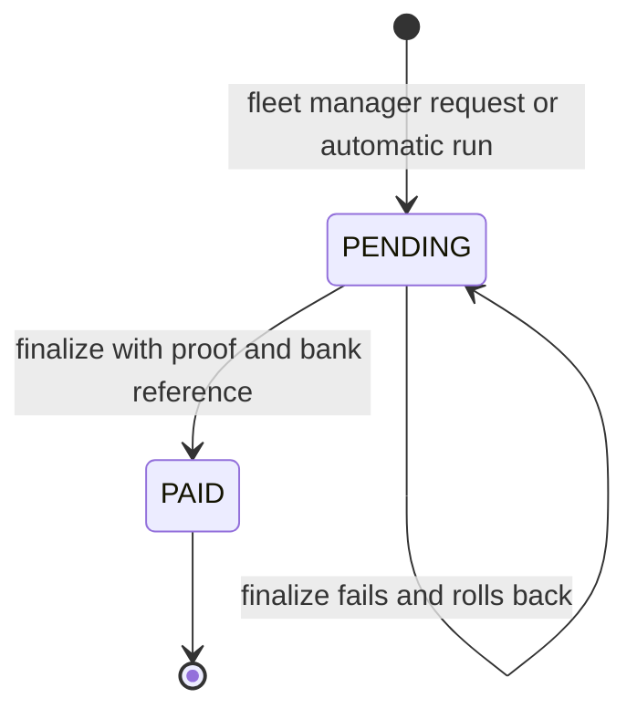

# Payouts, Wallets and Transactions

Orders credit wallets when they complete (see
[Cancellations, Refunds and Settlement](../03-orders/cancellations-refunds-settlement.md#settlement)).
This page covers what happens **after** that: moving a wallet balance out to a bank
account (a **payout**), and reading wallets and the `Transaction` ledger. The
customer-side payment flows are in [Payments](./payments.md).

Paths are relative to `src/app/`. Statements come from the committed code, read but not
run, unless marked **Executed** (a probe ran the real model schema with no database),
**Inferred** (derived from the code) or **Unresolved** (the code does not settle the
question). Uncommitted working-tree features are not described.

---

## At a glance

| Question | Answer |
| --- | --- |
| Collections | `Wallet` (`modules/Wallet`), `Payout` (`modules/Payout`), `Transaction` (`modules/Transaction`). There is no separate settlement-batch or bank-transfer collection. |
| Who has a wallet | Rows are created lazily, on the first credit by the settlement worker, for a vendor row, a rider, a fleet manager and the platform (`SUPER_ADMIN`). Customers never get one. |
| Who can start a payout by API | Only a `FLEET_MANAGER`, for its own riders (`POST /payouts/initiate-settlement`). **Executed:** the payload it builds fails the `Payout` schema, see [the mismatches](#mismatches-and-inconsistencies). |
| Who can finalize a payout | `ADMIN`, `SUPER_ADMIN`, or the `FLEET_MANAGER` for its own riders (`POST /payouts/finalize-settlement/:payoutId`), with a proof file. |
| Automatic payouts | A daily cron creates `PENDING` payouts for eligible wallets when enabled in the global settings. It never finalizes them. |
| Real money movement | None in the code. A payout records a bank transfer that a person made; the backend only checks, locks and writes the ledger. |
| Payout states | `PENDING` and `PAID`. `PROCESSING` exists only inside the finalize transaction. |

---

## Data model

### `Wallet` (`wallet.model.ts`)

| Field | Notes |
| --- | --- |
| `walletId` | Unique. `WAL-V-`, `WAL-D-`, `WAL-F-` or `WAL-A-` plus 8 characters, set on first insert. |
| `userId`, `userModel` | `userId` is unique across the collection and points at the profile `_id`. `userModel` allows `Admin`, `Customer`, `Vendor`, `FleetManager`, `DeliveryPartner`. |
| `currentBalance` | Money owed to the owner. Credited by settlement, reduced by a finalized payout. |
| `lockedBalance` | The part of the balance reserved by a `PENDING` payout. |
| `lifetimeEarnings` | Only ever increased by settlement. |
| `currentTaxLiability`, `lifetimeTaxProcessed` | Used by the platform wallet only. |
| `lastSettlementDate` | Set when a payout is finalized. It is the `startDate` of the next automatic payout. |

The amount available to pay out is `currentBalance - lockedBalance`, rounded to two decimals.

### `Payout` (`payout.model.ts`)

| Field | Notes |
| --- | --- |
| `payoutId` | Unique, `PAY-` plus 8 characters. The API addresses payouts by this id. |
| `userId`, `userModel` | The recipient: `Vendor`, `DeliveryPartner` or `FleetManager`. |
| `senderId`, `senderModel` | Whose wallet funds it: `Admin` or `FleetManager`. |
| `startDate`, `endDate` | The window the payout covers. See [below](#automatic-payouts). |
| `amount` | The snapshot of the available balance when it was created. |
| `status` | `PENDING`, `PROCESSING`, `PAID`. |
| `paymentMethod` | Always `BANK_TRANSFER` in the code. The enum also allows `MOBILE_BANKING` and `CASH`. |
| `bankDetails` | Copied from the recipient at creation (manual path only) and again at finalization. |
| `bankReferenceId`, `payoutProof`, `paymentDate`, `remarks` | Written at finalization. |
| `failedAt`, `failedReason`, `retryAt`, `retryRemarks` | In the schema and type, written by nothing. |

A partial unique index allows **at most one `PENDING` payout per recipient**.

### `Transaction` (`transaction.model.ts`)

The ledger row types and their meaning are listed in [Data Model](../02-platform/data-model.md#transaction--the-ledger).
Who writes which row:

| Type | Written by |
| --- | --- |
| `ORDER_PAYMENT`, `REFUND` | Order creation and the admin refund, see [Payments](./payments.md). |
| `VENDOR_EARNING`, `DELIVERY_PARTNER_EARNING`, `FLEET_EARNING`, `PLATFORM_*` | The settlement worker when an order completes. |
| `VENDOR_SETTLEMENT`, `DELIVERY_PARTNER_SETTLEMENT`, `FLEET_SETTLEMENT` | `finalizeSettlement`, one per payout, `TXN-SETTLE-<Date.now()>`, with `payoutId`, `processedBy` and `processorModel`. |
| `INGREDIENT_PURCHASE` | The ingredient order confirmation, see [Ingredient Purchasing](../04-vendors/ingredient-purchasing.md). |
| `REFERRAL_BONUS` | Referral cash or credit milestones, see [Points and Referrals](../09-offers-and-coupons/points-and-referrals.md). |

---

## How wallets are created and credited

No code creates a wallet explicitly. The settlement worker upserts it with
`$setOnInsert` the first time it credits that owner, inside the settlement
transaction. Consequences:

- A vendor, rider or fleet manager with no completed order has **no wallet**, and `GET /wallets/me` answers `404 WALLET_NOT_FOUND_FOR_USER`.
- A rider managed by a fleet manager is **not** credited: the worker adds the rider's net earnings to the **fleet manager's** wallet (see the settlement table linked above). **Inferred:** such a rider's own wallet only holds what was earned before the rider was assigned to the fleet manager.
- Branches (`SUB_VENDOR`) have their own wallet rows; a parent does not see them.

---

## Reading wallets

| Endpoint | Roles | Behavior |
| --- | --- | --- |
| `GET /api/v1/wallets` | `ADMIN`, `SUPER_ADMIN`, `FLEET_MANAGER` | Paginated list with the owner's `userId`, name and email. A fleet manager only gets wallets of riders whose `currentFleetManagerId` is its own (`userModel` is forced to `DeliveryPartner`); it does not get its own wallet here. |
| `GET /api/v1/wallets/:walletId` | same | By `walletId`. A fleet manager gets `403` unless the owner is one of its riders. |
| `GET /api/v1/wallets/me` | `ADMIN`, `SUPER_ADMIN`, `FLEET_MANAGER`, `VENDOR`, `SUB_VENDOR`, `DELIVERY_PARTNER` | The caller's wallet by profile `_id`. For `ADMIN` and `SUPER_ADMIN` it returns the wallet whose `userId` is the **hard-coded** ObjectId `694a088c43ee1acbe0e9c87d`, not the caller's. |

**Unresolved:** the settlement worker credits the platform wallet of the `SUPER_ADMIN`
found by role. The admin view above only matches it if that account's `_id` equals the
hard-coded value, which depends on the environment's data.

---

## Payout lifecycle

`PROCESSING` is written by the finalize step's compare-and-swap, but the whole step runs in
one transaction, so a failure aborts it and the payout stays `PENDING`. There is no reject,
cancel or retry route: `RejectPayoutValidationSchema` exists but nothing uses it.

### Manual request (`POST /payouts/initiate-settlement`)

`FLEET_MANAGER` only. Body: `targetUserId` (the rider's `userId`), strict. In one
transaction the service:

1. Finds the target. A fleet manager may only target a `DELIVERY_PARTNER` it manages (`FLEET_MANAGER_ONLY_SETTLE_DELIVERY_PARTNERS`, `ONLY_OWN_DELIVERY_PARTNERS_SETTLEMENT`).
2. Requires the target's `bankDetails` to have both holder name and IBAN. Otherwise it **pushes a `PAYOUT_BANK_DETAILS_INCOMPLETE` alert to the target** and fails with `CANNOT_INITIATE_SETTLEMENT_INCOMPLETE_BANK_DETAILS`.
3. Refuses a second open payout (`EXISTING_PENDING_PAYOUT_SESSION_ACTIVE`).
4. Requires a wallet with a positive available balance (`NO_UNPAID_EARNINGS_TO_SETTLE`).
5. Adds the available amount to `lockedBalance` and creates the `PENDING` payout with the amount, bank details copy and `BANK_TRANSFER`. `startDate` and `endDate` are **not set** on this path although the schema requires them. **Executed:** validating that payload reports errors on `startDate` and `endDate`, so the create throws inside the transaction, the transaction aborts and the locked balance is not kept.

On success, which the validation result above makes impossible with the committed
schema, the target would get a `PAYOUT_SETTLEMENT_INITIATED` push and the controller would
write the activity log `PAYOUT_INITIATED`.

### Automatic payouts

`handlePayoutAutomatedCron` runs daily at 00:00 in the platform timezone (see
[Architecture](../01-introduction/architecture.md#node-cron--srcappcronindexts)). It does
nothing unless `payout.autoGenerate` is on and the weekday name (in the platform timezone)
is in `payout.payoutDays`. Then `initiateAutomatedSettlement`, in one transaction:

1. Reads `payout.minPayoutAmount` and `payout.payoutWindowDays` and sets `endDate` to now minus that many days.
2. Selects `Vendor`, `FleetManager` and `DeliveryPartner` wallets whose available balance is at least `minPayoutAmount`, excluding owners that already have a `PENDING` payout.
3. **Skips every rider that has a `currentFleetManagerId`** (those are settled through the fleet manager).
4. For an owner without complete bank details it sends `PAYOUT_BULK_BANK_DETAILS_INCOMPLETE` and moves on.
5. Otherwise locks the available balance and creates a `PENDING` payout whose sender is the `SUPER_ADMIN` (`senderModel: Admin`), with `startDate` = the wallet's `lastSettlementDate` or creation date, and `endDate` as above.

Things to know:

- `payoutWindowDays` only moves the recorded `endDate`; the **amount** is always the whole available balance, not the balance up to that date.
- The created payout sends **no** notification to the owner (only the incomplete-bank alert does).
- The whole run is one transaction and its errors are caught and printed (`[Cron Worker] Automated Settlement System Failure`). **Executed:** a payload with an undefined `senderId` fails validation, so if no `SUPER_ADMIN` exists the first create fails and the run aborts without any payout.
- Updating the settings rejects `autoGenerate: true` without at least one payout day (`PAYOUT_DAYS_REQUIRED_FOR_AUTOGENERATE`); see [Platform Settings](../02-platform/platform-settings.md#payout-settings).

### Finalizing (`POST /payouts/finalize-settlement/:payoutId`)

`ADMIN`, `SUPER_ADMIN`, `FLEET_MANAGER`. Multipart: one file (`file`, the payout proof) and
body `bankReferenceId` (required) and `remarks`. No permission action is required of an
`ADMIN`. In one transaction:

1. A `FLEET_MANAGER` is checked to own the payout's rider (`FLEET_MANAGER_ONLY_SETTLE_DELIVERY_PARTNERS`, `ONLY_OWN_DELIVERY_PARTNERS_SETTLEMENT`).
2. An atomic compare-and-swap moves the payout from `PENDING` to `PROCESSING`. A missing or already paid payout gives `INVALID_PAYOUT_SESSION_OR_ALREADY_PAID`.
3. A missing proof file gives `PAYOUT_PROOF_MANDATORY`. Because this runs after the swap, the abort puts the payout back to `PENDING`.
4. The recipient wallet must hold at least the amount: `currentBalance` and `lockedBalance` are both reduced by it and `lastSettlementDate` is set (`INSUFFICIENT_WALLET_BALANCE_FOR_FINALIZATION`).
5. The **sender** wallet's `currentBalance` is reduced by the amount (`SENDER_TREASURY_POOL_INSUFFICIENT_FUNDS` if too low).
6. A settlement `Transaction` is written (`VENDOR_SETTLEMENT`, `DELIVERY_PARTNER_SETTLEMENT` or `FLEET_SETTLEMENT`), with `processedBy` set to the caller.
7. The payout becomes `PAID` with the bank reference, proof URL, remarks and `paymentDate`.

After the commit the recipient gets a `PAYOUT_SETTLEMENT_COMPLETED` push and the controller
writes `PAYOUT_FINALIZED`.

The sender wallet is the one named on the payout, **not** the caller's. So when an
`ADMIN` finalizes a payout that a fleet manager requested, the **fleet manager's** wallet is
reduced (**Inferred** from the code), and for an automatic payout it is the `SUPER_ADMIN`'s
wallet. The platform wallet's `currentBalance` includes the amounts credited to the other
wallets, which is what makes that debit possible.

---

## Reading payouts

| Endpoint | Roles | Scope |
| --- | --- | --- |
| `GET /api/v1/payouts` | `ADMIN`, `SUPER_ADMIN`, `FLEET_MANAGER`, `DELIVERY_PARTNER`, `VENDOR`, `SUB_VENDOR` | Admins see all. A fleet manager sees payouts it sent or received (a `userId` query narrows). Others see only `userId` = themselves. |
| `GET /api/v1/payouts/:payoutId` | same | Admins any. Others only as recipient or sender, otherwise `403`. The recipient is populated with bank details, email and phone. |

The list uses `QueryBuilder` (search none, `filter`, sort, pagination, fields) plus
`startDate` and `endDate` query parameters that bound `createdAt` (whole days). For a fleet
manager each row gets `payoutCategory`: `RECEIVED_FROM_ADMIN` (it is the recipient) or
`PAID_TO_PARTNER` (it is the sender); otherwise `GENERAL`. Each recipient's NIF is unified
from `NIF`, `businessDetails.NIF` or `personalInfo.NIF`.

---

## Reading transactions

| Endpoint | Roles | Behavior |
| --- | --- | --- |
| `GET /api/v1/transactions` | all seven roles | Admins see every row. Everyone else sees rows whose `userId` is their profile `_id` and `userModel` matches (a `SUB_VENDOR` maps to `Vendor`). |
| `GET /api/v1/transactions/:id` | `ADMIN`, `SUPER_ADMIN` | By `transactionId`. |

The list chain is `paginate`, `sort`, `search(transactionId, type)`: **`filter()` is not
applied**, so `type` or `status` query parameters do not filter (**Inferred** from the
builder chain). Each row is reshaped into amounts taken from the related order's payout
snapshot (`orderGrandTotal`, `platformFee`, `vendorNetEarning`, `riderNetEarnings`,
`fleetEarnings`), the customer, a delivery address string, item summaries, the payment
method and timestamps. The list also returns the **whole populated `order`** document
(**Inferred:** fields marked `select: false` stay out). Every recipient therefore sees the
full order split, including the platform's commission, for the orders in their own rows.
For a row with no order (for example a settlement) the list shows `N/A`, while the single
read builds the address by string concatenation and yields `undefined, undefined, undefined`.

---

## Notifications and logs

| Event | Notification | Activity log |
| --- | --- | --- |
| Payout requested | `PAYOUT_SETTLEMENT_INITIATED` to the rider (push and record, type `PAYOUT`) | `PAYOUT_INITIATED`, target text hard-coded as `Vendor #<id>` even for a rider |
| Incomplete bank details | `PAYOUT_BANK_DETAILS_INCOMPLETE` or `PAYOUT_BULK_BANK_DETAILS_INCOMPLETE` (type `PAYOUT_ALERT`) | none |
| Payout finalized | `PAYOUT_SETTLEMENT_COMPLETED` (type `PAYOUT`) | `PAYOUT_FINALIZED` |
| Automatic payout created | none | none (system action) |

Templates are in [Notification Triggers](../06-notifications/notification-triggers.md). Activity
log behavior is in [Activity Logs](../12-activity-logs/activity-logs.md).

---

## Mismatches and inconsistencies

1. **The manual request cannot succeed.** `Payout.startDate` and `endDate` are required and `initiateSettlement` creates the payout without them. **Executed:** the schema validation of that payload fails on both fields. The automatic run sets both, so payouts created by the cron are valid. The service itself was not run against a database.
2. **Managed riders' wallets.** The worker credits a managed rider's earnings to the fleet manager, yet a fleet manager's request needs a positive balance in the **rider's** wallet. The two rules only meet for balances earned before the assignment.
3. **No admin-initiated payout route.** `Payout.senderModel` and the service allow an admin sender, but the only initiate route is `auth('FLEET_MANAGER')`. Vendors and unmanaged riders are paid out only by the automatic run.
4. **Finalizer is not the debited wallet** (see above), which may surprise an admin who finalizes a fleet manager's payout.
5. **`/wallets/me` for admins uses a hard-coded id.**
6. **`payoutWindowDays` does not limit the amount.**
7. **Unused fields and validation:** `failedAt`, `failedReason`, `retryAt`, `retryRemarks`, `RejectPayoutValidationSchema`, and the `MOBILE_BANKING` and `CASH` methods.
8. **`TXN-SETTLE-<Date.now()>`** is unique only per millisecond; two finalizations in the same millisecond would collide on the unique `transactionId` (**Inferred**, unlikely).
9. **Transactions expose the whole order snapshot** to the row owner, and type or status filters are ignored.

---

## Unverified or inferred behavior

- Only the schema validation of the two payloads was executed. The transaction, wallet and notification steps of every payout path are read from the code, not run.
- Which role a real deployment uses to create payouts for vendors, and how the bank transfer itself is performed, is outside the code.
- Whether the hard-coded admin wallet id matches production data is not known.

---

## Related documentation

- [Cancellations, Refunds and Settlement](../03-orders/cancellations-refunds-settlement.md#settlement): how wallets are credited and the ledger rows written at completion.
- [Payments](./payments.md): customer payments, refunds and the `ORDER_PAYMENT` and `REFUND` rows.
- [Platform Settings](../02-platform/platform-settings.md#payout-settings): the `payout` settings that drive the automatic run.
- [Data Model](../02-platform/data-model.md#money-wallet-transaction-payout): the collections in context.
- [Vendors and Branches](../04-vendors/vendors-and-branches.md): per-row wallets for branches.
