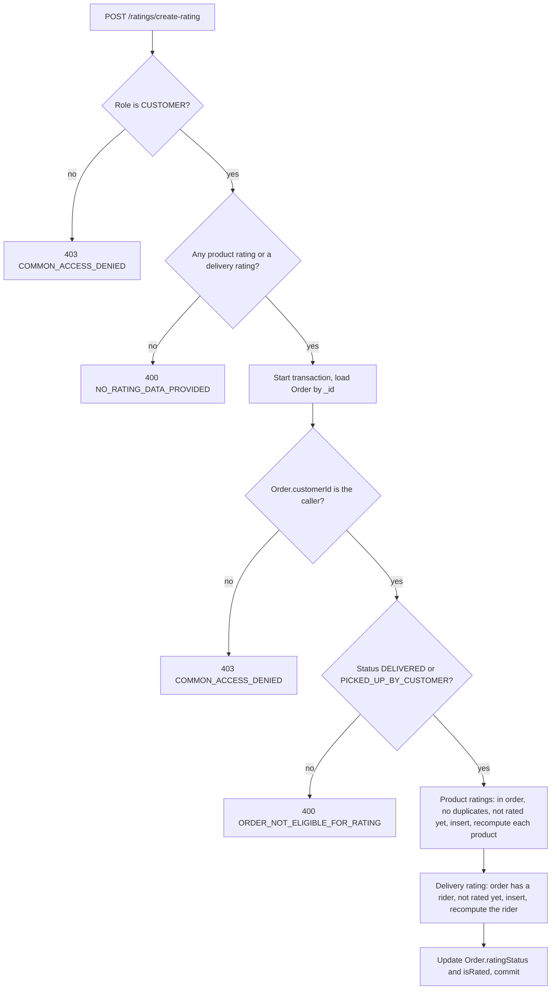

# Ratings

Customers rate the products and the delivery partner of a finished order. This page
describes that flow from the code: the `Rating` model, who may create and read
ratings, how the order relationship is verified, how averages are recomputed, and
what is stored versus derived. Product and order rules are linked, not repeated.

Paths are relative to `src/app/`; the module is `modules/Rating/`. Statements come
from the committed code unless marked **Inferred** (read from code, not run) or
**Executed** (a probe ran the real validation schemas and service code with the
database models stubbed in memory, so the aggregation itself and transaction
rollback were not run against MongoDB). Uncommitted working-tree features are not
described.

---

## At a glance

| Question | Answer |
| --- | --- |
| Base path | `/api/v1/ratings`. |
| Rating types | `PRODUCT` and `DELIVERY_PARTNER`. There is no vendor rating type and no fleet-manager rating type. |
| Who can rate | Only a `CUSTOMER`, only for their own order. |
| Allowed order status | `DELIVERED` (delivery) or `PICKED_UP_BY_CUSTOMER` (pickup). Nothing else, including `NO_SHOW`. |
| One rating per | Product per order, and rider per order, per customer. Checked by reading first, with **no unique index**. |
| Edit or delete | Not possible. There is no update or delete route or service. |
| Score | A number from 1 to 5. **Decimals are accepted.** |
| Stored aggregates | `Product.rating` and `DeliveryPartner.rating` (`average`, `totalReviews`), recomputed from all ratings on every new rating. |
| Vendor rating | **Derived** from the vendor's products at read time, never stored. |
| Notifications, sockets | None. |



---

## Data model

`Rating` (`rating.model.ts`), `timestamps: true`.

| Field | Notes |
| --- | --- |
| `ratingType` | `PRODUCT` or `DELIVERY_PARTNER`. Indexed. |
| `rating` | Number, `min: 1`, `max: 5`. Not restricted to integers. |
| `sentiment` | `POSITIVE`, `NEUTRAL` or `NEGATIVE`, derived from the score (see [Sentiment](#sentiment)). Indexed. |
| `review` | Trimmed text, default empty. No length limit. |
| `tags` | Array of strings, default empty. No list or length limit. |
| `reviewerId`, `reviewerModel` | The rater. `reviewerModel` can only be `Customer`; `reviewerId` is the `Customer` profile `_id`. |
| `targetId`, `targetModel` | What is rated. `targetModel` is `Product` or `DeliveryPartner`. |
| `productId` | Set for product ratings (equal to `targetId`), absent for rider ratings. |
| `orderId` | The order's Mongo `_id` (not the display id `ORD-...`). Required and indexed. |

Indexes: `{ targetId, ratingType }`, `{ createdAt: -1 }`, plus the field indexes above.
There is **no unique index** on order, reviewer and target, which matters for
[duplicate protection](#one-rating-per-product-and-per-rider).

### Fields that exist elsewhere

| Model | Field | Written by the rating flow? |
| --- | --- | --- |
| `Product` | `rating.average`, `rating.totalReviews` (default `0`) | Yes |
| `DeliveryPartner` | `rating.average`, `rating.totalReviews` (default `0`, indexed on `average`) | Yes |
| `Order` | `ratingStatus.isProductRated`, `ratingStatus.isDeliveryRated`, `isRated` (default `false`) | Yes |
| `FleetManager` | `rating.average`, `rating.totalReviews` | **No.** Nothing in the code writes it, so it stays `0`. Fleet analytics still read it |
| `Vendor` | none | Not stored. See [Vendor rating](#vendor-rating-is-derived) |

The fleet-manager update validation accepts a `rating` object under `operationalData`, but
the schema has no `operationalData.rating` path (the stored `rating` is top level), so
that input has no stored field to land on (**Inferred** from the schemas).

---

## Rating types and target rules

| Type | Target | `targetId` | `productId` | Requirement |
| --- | --- | --- | --- | --- |
| `PRODUCT` | A product in the order's items | The product `_id` | The product `_id` | The product must be one of the order's items |
| `DELIVERY_PARTNER` | The rider assigned to the order | `Order.deliveryPartnerId` at rating time | Not set | The order must have a delivery partner |

- The reviewer is always the order's own customer; the route and the service both refuse any other role.
- The rider is never named by the client. The target is read from the order, so a customer cannot rate an arbitrary rider.
- **Vendors and fleet managers are not rated directly.** A vendor is rated through its products; a fleet manager has no rating path at all.

---

## Creating ratings

`POST /api/v1/ratings/create-rating`, `CUSTOMER`. Body (strict, **Executed**):

```json
{
  "orderId": "<order _id>",
  "productRatings": [{ "productId": "<product _id>", "rating": 5, "review": "", "tags": [] }],
  "deliveryRating": { "rating": 4, "review": "", "tags": [] }
}
```

### Request validation

| Rule | Result |
| --- | --- |
| Neither a non-empty `productRatings` nor a `deliveryRating` | Rejected: "Provide at least one product rating or a delivery partner rating." |
| `rating` outside 1 to 5, or a string | Rejected |
| Unknown keys (for example `vendorRating`, or `orderId` inside a product rating) | Rejected (`.strict()`) |
| `rating` 3.5 | **Accepted** |
| `review` of 1 MB and 1000 tags | **Accepted**; there is no size limit |
| `orderId` or `productId` not a valid id | Accepted by the schema (plain strings) |

An `orderId` that is not a valid ObjectId throws an `ObjectId` parsing error in the service
before the transaction starts (**Executed**), which the global handler returns as a 500
with the library's message. A bad `productId` fails the "in the order" check instead.

### Checks, in order

1. Role must be `CUSTOMER` (`COMMON_ACCESS_DENIED`, 403). The route already enforces the same.
2. At least one product or delivery rating (`NO_RATING_DATA_PROVIDED`, 400).
3. A transaction starts and the order is loaded by `_id` (`NOT_FOUND_MESSAGE`, 404). An order with `isDeleted: true` is not excluded.
4. **Ownership:** `order.customerId` must equal the caller's profile `_id` (`COMMON_ACCESS_DENIED`, 403).
5. **Status:** the order must be `DELIVERED` or `PICKED_UP_BY_CUSTOMER` (`ORDER_NOT_ELIGIBLE_FOR_RATING`, 400). **Executed:** `PENDING`, `PREPARING`, `ON_THE_WAY`, `CANCELED` and `NO_SHOW` are refused. The order statuses themselves are in [Order Lifecycle](../03-orders/order-lifecycle.md).
6. **Product ratings**, if any:
   - the order must have items (`NO_PRODUCTS_FOUND_IN_ORDER`);
   - no product may repeat in the payload (`DUPLICATE_PRODUCT_IN_RATING_PAYLOAD`);
   - every `productId` must be the `productId` of one of the order's items (`RATING_PRODUCT_NOT_IN_ORDER`);
   - none may already be rated by this customer for this order (`ALREADY_SUBMITTED_RATING_FOR_CATEGORY_IN_ORDER`);
   - one `Rating` document per product is inserted, then each product's average is recomputed.
7. **Delivery rating**, if any: the order must have a `deliveryPartnerId` (`NO_DELIVERY_PARTNER_ASSIGNED_TO_ORDER`); none may already exist for this customer and order (`ALREADY_SUBMITTED_DELIVERY_RATING`); one document is inserted and the rider's average is recomputed.
8. The order's rating flags are updated, the transaction commits, and the response is `RATING_CREATED_SUCCESS` with `{ productRatings, deliveryRating }` (the created documents).

The order relationship is verified in exactly two ways: the order's `customerId` against the
caller, and, for product ratings, the order's `items[].productId`. A promotional reward line
(a free unit added by an offer, see [Offers](../09-offers-and-coupons/offers.md#promo-reward-lines))
is an ordinary entry in `items`, so a product that appears only as a reward can be rated too
(**Inferred** from the check reading `items`).

The status check accepts the order as it is now. An order's delivery partner is whoever holds
`deliveryPartnerId` at that time; the rider is not compared with riders who had the order earlier.

### One rating per product and per rider

The service reads existing `Rating` rows (same order, same reviewer, same product or type)
and refuses to insert if any exist. There is **no unique index**, and the read and the insert are
separate operations. **Inferred:** two simultaneous requests for the same product can both
pass the read and both insert, producing two ratings for one product of one order.

### Partial ratings and the order flags

A customer can rate in several requests, for example some products first and the rider later.

| Flag | Set when |
| --- | --- |
| `Order.ratingStatus.isProductRated` | The customer has rated **every distinct product** of the order |
| `Order.ratingStatus.isDeliveryRated` | A rider rating was created in this request |
| `Order.isRated` | Both flags are true, or, for a pickup order with no delivery partner, `isProductRated` alone |

Each update also removes the legacy `ratingStatus.isVendorRated` field from the order. **Executed**
outcomes:

| Request | Result |
| --- | --- |
| Product 1 of 2 | Created, order flags unchanged |
| Then product 2 | `isProductRated` set |
| Then the rider (delivery order) | `isDeliveryRated` and `isRated` set |
| Pickup order, both products, no rider | `isProductRated` and `isRated` set |
| Delivery order with no partner, rider rating | Refused |
| Rating the same product or the rider again | Refused |
| Product and rider together, the rider already rated | The whole request fails |

`isRated` is informational: nothing in the create flow reads it, so the duplicate rules alone
decide what can still be rated.

The request is one transaction, so a failure anywhere (for example a duplicate rider rating
after the product ratings were inserted) aborts it. **Executed:** the abort is issued, while
the actual rollback of the inserts is MongoDB's behavior (**Inferred**).

### Sentiment

`sentiment` is derived when the rating is created: a score of 4 or more is `POSITIVE`, exactly 3 is
`NEUTRAL`, anything else is `NEGATIVE`. Because scores may be decimals, **Executed:** 3.5 and 3.9 are
`NEGATIVE`, 2.9 is `NEGATIVE`, and 4.5 is `POSITIVE`; only an integer 3 is `NEUTRAL`.

---

## Immutability

Ratings cannot be changed through the API.

- The router has four routes: `POST /create-rating` and three `GET`s. There is no `PATCH`, `PUT` or `DELETE`.
- The service exports `createRating`, `getAllRatings`, `getSingleRating` and `getRatingSummary` only.
- Nothing else in `src/` updates or deletes `Rating` documents (searched all callers of the model).
- The only other writes are the derived counters on `Product`, `DeliveryPartner` and `Order`.

Because ratings are never removed, deleting a product, blocking a rider or cancelling anything
does not change existing ratings. The model itself is not write-protected (no schema-level
immutability); the guarantee is that no code path modifies a rating after creation.

---

## Aggregation

### Product and rider averages

After inserting, the service recomputes from **all** ratings of that target and type:

```text
average       = round(avg(rating), 1 decimal)   // $avg over Rating for targetId and ratingType
totalReviews  = count of those ratings
```

written with `$set` to `Product.rating` or `DeliveryPartner.rating`, inside the same transaction.
Because it always recomputes from the rating documents, a new rating also corrects a stale counter.
**Executed** (aggregation stubbed in memory): ratings 5, 4, 4, 2, 5, 3 give `3.8` over 6 reviews, and 5, 4, 4 give `4.3` over 3.

- A product rating recomputes only the products in that request; a rider rating recomputes that rider.
- The stored average has one decimal, so any later weighting (below) works on rounded values.
- Each product update is a separate `findByIdAndUpdate`; the repeated recompute is last-writer-wins but idempotent.
- `Product.rating` is copied to the search index when the product changes, see the next section.

### Search index lag

The product update runs through `findByIdAndUpdate` without `new: true`, and the `Product` model's
`findOneAndUpdate` hook syncs the document it receives to Meilisearch. **Inferred:** by the Mongoose default that
document is the product **before** the update, so the indexed `rating` (used by `sortBy=rating` in
search, see [Menus](../05-products/menus.md)) is one rating behind until the product is next re-synced. This was derived from
the code, not observed in Meilisearch.

### Vendor rating is derived

There is no vendor rating type, no vendor counter and no `Vendor.rating` field. A vendor's rating is computed on
read by `computeVendorRatingsFromProducts` (`modules/Vendor/vendor.utils.ts`):

```text
average       = Σ(product.rating.average × product.rating.totalReviews) / Σ(product.rating.totalReviews)
totalReviews  = Σ(product.rating.totalReviews)
```

over the vendor's products with `isDeleted: false` and at least one review; a vendor with none gets
`{ average: 0, totalReviews: 0 }`. The result is attached to vendor profile, vendor list and detail,
cart item vendors, product vendor and analytics responses. A branch is its own `Vendor` row, so its rating
comes from its own products only; it is not merged with the parent. Deleting a product removes its reviews from
the vendor's derived rating, although the `Rating` rows and the product's own counters stay. See
[Products and Categories](../05-products/products.md#rating-relationship) and
[Vendors and Branches](../04-vendors/vendors-and-branches.md).

### Fleet manager

`FleetManager.rating` exists in the schema but is never written, so it stays `0`. The fleet
analytics (top fleet performers) read it and therefore rank on a constant (**Inferred** from the query
reading `rating.average`, which was not run).

---

## Reading ratings

| Endpoint | Roles at the route |
| --- | --- |
| `GET /ratings/get-all-ratings` | `ADMIN`, `SUPER_ADMIN`, `DELIVERY_PARTNER`, `FLEET_MANAGER`, `VENDOR`, `SUB_VENDOR`, `CUSTOMER` |
| `GET /ratings/get-rating-summary` | `ADMIN`, `SUPER_ADMIN`, `DELIVERY_PARTNER`, `FLEET_MANAGER`, `VENDOR`, `SUB_VENDOR` |
| `GET /ratings/:ratingId` | the seven roles above |

There is no public or product-level review list. Another customer never sees review text; they only see the
product's `average` and `totalReviews`.

### List scoping (`get-all-ratings`)

| Role | Sees |
| --- | --- |
| `ADMIN`, `SUPER_ADMIN` | Every rating |
| `VENDOR`, `SUB_VENDOR` | Ratings whose target is one of the caller's own **non-deleted** products. A client `targetId` filter is ignored. Product ratings only; rider ratings never appear |
| `FLEET_MANAGER` | Ratings of riders whose `currentFleetManagerId` is the caller (and of the caller's own id, for which none exist). Ratings follow a rider to their current fleet |
| `CUSTOMER` | Only their own ratings (`reviewerId` is forced to the caller) |
| `DELIVERY_PARTNER` | Only ratings where they are the target (`targetId` is forced to the caller) |

### Pagination, filter and sort

The list uses the shared query builder.

| Parameter | Behavior |
| --- | --- |
| `page`, `limit` | Default `limit` 10, no maximum. The response `meta` is `{ page, limit, total, totalPage }` |
| `sortBy` | Default `-createdAt`. Any field name, with `-` for descending |
| `searchTerm` | Case-insensitive regex (escaped) over `review` and `ratingType` |
| `fields` | Field projection |
| Other parameters | Equality filters on top-level fields, for example `ratingType`, `sentiment`, `rating`, `orderId`, `productId`, `reviewerId`. Object-valued parameters are dropped, and any key already fixed by the role scope is dropped |

### What each response contains

| Part | Content |
| --- | --- |
| `productId` | Always populated with `name` and `image`. The `name` is the raw localized `{ en, pt }` object; no language formatting is applied |
| `orderId` | Populated with the display id (`orderId` field) for every role |
| `reviewerId`, `targetId` | Populated with `name userId role` only for `ADMIN`, `SUPER_ADMIN`, `VENDOR`, `SUB_VENDOR` and `FLEET_MANAGER`. For `CUSTOMER` and `DELIVERY_PARTNER` they stay plain ids |
| Extra | `lean()` documents, no formatter |

### Single rating (`GET /ratings/:ratingId`)

Allowed for an admin role, the reviewer, the target, a vendor or branch that owns the rated product, or the fleet manager
whose `currentFleetManagerId` matches the rated rider; anyone else gets `COMMON_ACCESS_DENIED` (403). The product-owner check
does not exclude deleted products, unlike the list. This endpoint populates reviewer, target, product and order for
**every** allowed role, so a rider who opens a rating of themselves also receives the customer's name and `userId`, which
the list endpoint withholds from riders (code-backed inconsistency).

### Summary (`get-rating-summary`)

The route admits six roles, but the service always builds its set from `Product.find({ vendorId: caller })`. For every
role other than a vendor or branch that set is empty, so **the summary is effectively vendor-only**; an admin, rider or fleet
manager receives zeros. For a vendor, over ratings of its non-deleted products it returns:

- `summary`: `totalRatings`, `avgRating` (one decimal), star buckets as percentages (`$floor` of the score, so 4.5 counts as four stars), and sentiment percentages;
- `chart`: the average rating per day for the last 30 days, grouped by a `dd Mon, yyyy` string and sorted by that **string**, which orders by day of month before month and year (**Inferred** from the pipeline, not run). Days use UTC (the default), not the platform timezone.

With no ratings the summary is all zeros and the chart is empty.

---

## Consumers of ratings

| Consumer | Uses |
| --- | --- |
| Product list, detail and search | `Product.rating` (`average`, `totalReviews`) and the `sortBy=rating` search sort. See [Menus](../05-products/menus.md) and [Products and Categories](../05-products/products.md) |
| Vendor, profile, cart and product responses | The derived vendor rating |
| Admin nearby-partners list for manual assignment | `DeliveryPartner.rating.average` and `totalReviews` in the projection |
| Analytics | Stored product, rider and fleet averages, and the derived vendor rating (for top lists and leaderboards); not traced query by query |

Dispatch does not use rider ratings to choose candidates (the only order-module use is the admin list projection).

---

## Notifications and sockets

Nothing. The rating module has no `NotificationService` call, email or Socket.IO event, and nothing tells a vendor or rider
that they were rated (see [Notification Triggers and Templates](../06-notifications/notification-triggers.md)).

---

## Guards and edge cases

| Situation | Behavior |
| --- | --- |
| Customer of another order | `COMMON_ACCESS_DENIED` (403) |
| Order not finished, canceled, rejected or no-show | `ORDER_NOT_ELIGIBLE_FOR_RATING` |
| Pickup order, rider rating sent | `NO_DELIVERY_PARTNER_ASSIGNED_TO_ORDER` (a pickup order has no partner) |
| Product later deleted or unapproved | Can still be rated (only the order's items are checked) |
| Order soft-deleted | Not checked, can still be rated |
| Customer account status | Not checked beyond authentication |
| Same product rated by the same customer on two different orders | Allowed, one per order |
| Rating after `isRated` is true | Nothing blocks it except the per-product and per-rider duplicate checks |
| Decimal scores | Accepted, stored as given, sentiment may read oddly (see above) |
| Very long review or many tags | Accepted |
| Bad `orderId` | 500 with an ObjectId parsing message |

---

## Mismatches and inconsistencies

1. **Duplicates are prevented only by a read.** No unique index exists, so concurrent requests can create duplicates (**Inferred**).
2. **Decimals are accepted** although the UI-facing terms are stars. Sentiment then treats 3.1 to 3.9 as negative, and the summary floors scores into star buckets.
3. **No input limits** on `review` or `tags`.
4. **`get-rating-summary` is open to six roles but works only for vendors.** The other roles get zeros.
5. **List and single read disagree about what a rider may see**: the list hides reviewer details from riders, the single read shows them.
6. **List hides ratings of deleted products from vendors** and the derived vendor rating ignores them, while the single read and the product counters keep them.
7. **Fleet manager rating is a dead field** that analytics still read.
8. **Search index may lag one rating** because the product update does not request the new document (**Inferred**).
9. **Bad `orderId` gives a 500**, not a validation error.
10. **Chart ordering** sorts day labels as text (**Inferred**).
11. **`Order.isRated` is not read** by the create flow and no other reader was found; it is a status flag only.

---

## Unverified or inferred behavior

- The aggregation, the transaction rollback and the concurrent-duplicate case were reasoned from the code. The probe replaced the models with in-memory stubs.
- The Meilisearch one-rating lag and the summary chart ordering were not observed.
- How clients use `ratingStatus` and `isRated` to hide the rating prompt is not known from the backend.
- Analytics queries that read ratings were identified but not traced individually.

---

## Related documentation

- [Order Lifecycle](../03-orders/order-lifecycle.md#important-business-rules): which order statuses allow a rating.
- [Products and Categories](../05-products/products.md#rating-relationship): `Product.rating` and the derived vendor rating on product responses.
- [Vendors and Branches](../04-vendors/vendors-and-branches.md): why a vendor's rating is derived and is per branch row.
- [Menus](../05-products/menus.md): search results that sort by rating.
- [Delivery Dispatch and Riders](../03-orders/delivery-dispatch.md): the rider whose `deliveryPartnerId` is rated.
- [Offers](../09-offers-and-coupons/offers.md): promotional reward lines in order items.
- [Authorization](../03-identity-access/authorization.md): roles and the auth middleware.
