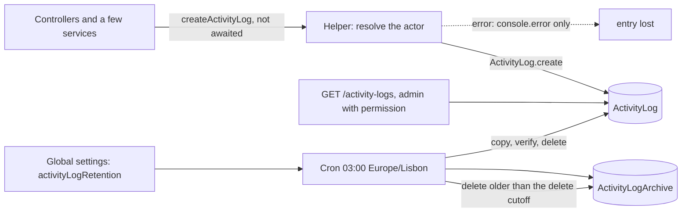

# Activity Logs

The activity log is a business-event trail: a record of who did a notable thing to
which resource. This page describes it from the code: the models, the single helper
that writes entries, every place that calls it, who can read the entries, and how
old entries are archived and deleted. The rules of the operations being logged live in
the module pages and are linked, not repeated.

Paths are relative to `src/app/`; the module is `modules/ActivityLog/`. This page
describes the **committed** code (the call inventory was extracted from the committed
sources). Statements are code-backed unless marked **Inferred** (read from code, not
run) or **Executed** (a probe ran the real model, helper, query builder or retention
service, with the database calls replaced by in-memory stubs).

---

## At a glance

| Question | Answer |
| --- | --- |
| What it is | An audit-style trail of selected admin, account and order-exception events. It is **not** a full audit log. |
| Collections | `ActivityLog` (active) and `ActivityLogArchive` (older entries). |
| Who writes | Application code only, through `createActivityLog`. There is no create endpoint. |
| Write style | Fire-and-forget: the helper returns at once, errors are only logged. A lost entry is never retried. |
| Callers | 72 call sites (including 3 small helpers) using 73 defined actions, all of which have a caller. |
| Who reads | `ADMIN` with the `CAN_MANAGE_ACTIVITY_LOGS` permission, and `SUPER_ADMIN`. Nobody else, not even for their own entries. |
| API | `GET /api/v1/activity-logs` (list) and `GET /api/v1/activity-logs/:id` (one). |
| Edit or delete | Not possible through the API. Only the retention job deletes entries. |
| Retention | Archived after 12 months, deleted from the archive after 18 months (defaults, editable in global settings). Archived entries cannot be read through any endpoint. |
| Not stored | IP address, user agent, request id, the before and after values of a change, and the outcome of failed attempts. |

---

## Data model

### `ActivityLog` (`activityLog.model.ts`)

`timestamps: true` (so `createdAt` and `updatedAt` exist). The interface lists `createdAt` only.

| Field | Notes |
| --- | --- |
| `authUserId` | Required. The acting account's `AuthUser` `_id`. |
| `userName` | Required. The actor's full name, `Unknown User` when none is known, or the email or phone number for a self-registration. |
| `email` | Required, **copied** from the actor at write time. |
| `role` | Required. The actor's role (`CUSTOMER`, `VENDOR`, `ADMIN` and so on), copied at write time. |
| `action` | Required string. The schema has no enum, so any text is valid; the code uses the `ActivityAction` constants. |
| `entityType` | Required string. One of the `ActivityEntityType` constants, or, for user flows, a role string (see below). |
| `entityId` | Optional `ObjectId` of the affected resource. A value that is not an `ObjectId` makes the write fail (**Executed**). |
| `target` | Free text label such as `Order #ORD-1`, `User #CUS-1`, an email, or a title. Default empty. |
| `type` | `INFO` (default), `WARNING` or `DANGER`. A severity label, not a category. |
| `metadata` | Optional free-form object (`Mixed`). |

Indexes: `{ createdAt: -1 }`, `{ authUserId: 1, createdAt: -1 }`, `{ entityType: 1, entityId: 1, createdAt: -1 }`.
There is no TTL index; deletion is done by the retention job.

### `ActivityLogArchive` (`activityLogArchive.model.ts`)

The same fields (with `entityType` optional, to accept older records), the original `_id`, `createdAt`
kept from the original, and `archivedAt` (default now). `versionKey: false`, index on `createdAt`.

### What is not recorded

| Not stored | Consequence |
| --- | --- |
| IP address, user agent, device, request id | **Executed:** the schema has no such path. The separate `ErrorLog` and `LoginHistory` collections hold their own request data and are not part of this trail |
| Before and after values | Only the selective `metadata` below, for a few actions |
| Attempts that failed | Logs are written after the service succeeded, so a refused or failed action leaves nothing |
| Actor profile id | Only the `AuthUser` id is kept. Name, email and role are copies and do not change if the account changes later |
| System and background actions | No cron, worker or queue job writes an entry (searched `cron/`, `BullMQ/`, `lib/` and `utils/`). For example, automatic acceptance of an order is not logged |

---

## How an entry is written

`createActivityLog(payload)` (`activityLog.utils.ts`) starts an **un-awaited** async function and returns `undefined`
immediately. Callers never wait for it and never see its errors. The payload carries `action`, `entityType`, optional
`entityId`, `target`, `type` (default `INFO`) and `metadata`, plus one of three ways to name the actor:

| Actor path | Used when | What it does |
| --- | --- | --- |
| `currentUser` | Every authenticated call | Uses `req.user`, whose `authUserId` is attached by the `auth` middleware. No database read. `userName` is the profile's first and last name, else `Unknown User` |
| `actor` | Self-registration, where there is no session yet | The caller passes `{ authUserId, userName, email, role }` for the account it has just created |
| `customUserId` or `email` | Only `resetPassword`, which is unauthenticated | Looks the `AuthUser` up by id or email and uses the profile name and the account's role |

**Executed:**

| Case | Result |
| --- | --- |
| `currentUser` has `authUserId` | Entry written, `type` defaults to `INFO`, `target` to empty |
| `currentUser` without a name | `userName` is `Unknown User` |
| `currentUser` without `authUserId` and no other actor information | **Nothing is written, silently** |
| Email lookup finds no account | Nothing written; `Activity Log Warning: User not found for ID: <email>` is printed |
| No actor information at all | Nothing written, silently |
| `ActivityLog.create` throws (for example validation) | Nothing propagates; `Background Activity Log Error` is printed |

### Where the call sits

Almost every call is in a controller and runs **after** the service succeeded and **before** `sendResponse`. The exceptions are
calls inside services: the registration and social-login paths in `auth.service.ts` (after the transaction commits), the order
exception helper in `order.service.ts` (after the vendor-reject, customer-cancel or rider-handback update), and the two document-deletion services
(`vendor.service.ts`, `fleet-manager.service.ts`). Because the write is not awaited, a response can be sent before the entry exists, and a crash
between the action and the write loses the entry (**Inferred**).

### Failure handling

- A failed write never affects the business operation or the response.
- There is no retry, queue, dead-letter store or alert; the only trace is a `console.error` line.
- There is no metric or admin-visible indicator of dropped entries.
- Entries with invalid data are dropped too (see [a known case](#mismatches-and-gaps)).

---

## Trigger inventory

All committed callers, extracted from the source by script: **72 call sites** in 30 files, using **73 distinct actions** (every defined action has a caller).
"Helper" call sites are shared by several routes. Entity types are `ActivityEntityType` values unless noted. The actor column is the role admitted by the route
(verified against the route definitions); the entry records whichever authenticated user actually called.

### Accounts and identity

| Action | Type | Entity | Actor | Notes |
| --- | --- | --- | --- | --- |
| `USER_REGISTERED` | `INFO` | The role, or `CUSTOMER` | The new account itself (explicit actor) | `registerUser`, new customers in `loginCustomer` (email and phone paths) and new social-login customers. See the phone-path gap below |
| `USER_ONBOARDED` | `INFO` | `req.body.role` | `ADMIN`, `SUPER_ADMIN`, `FLEET_MANAGER`, `VENDOR` | `POST /auth/register/onboard`; `target` is the email |
| `PASSWORD_CHANGED` | `INFO` | `AUTH_USER` | Any authenticated role | |
| `PASSWORD_RESET` | `WARNING` | `AUTH_USER` | Unauthenticated (found by email) | No `entityId` |
| `USER_APPROVAL_SUBMITTED` | `INFO` | The profile's role | Vendor, branch, rider, fleet manager, admin roles | |
| `USER_APPROVED` | `INFO` | The profile's role | `ADMIN`, `SUPER_ADMIN` | `metadata.newStatus` |
| `USER_REJECTED`, `USER_BLOCKED` | `DANGER` | The profile's role | `ADMIN`, `SUPER_ADMIN` | Same call as above; the action follows the requested status |
| `USER_CORRECTION_REQUESTED` | `INFO` | The profile's role | `ADMIN`, `SUPER_ADMIN` | `metadata.fields`, `metadata.docTitles` |
| `USER_CORRECTION_CONFIRMED` | `INFO` | The profile's role | Vendor, branch, fleet manager, rider | |
| `USER_SOFT_DELETED` | `DANGER` | The profile's role | Any role, including `CUSTOMER` | |
| `USER_PERMANENTLY_DELETED` | `DANGER` | The profile's role | `ADMIN`, `SUPER_ADMIN` | |
| `ACCOUNT_CONTACT_UPDATED` | `INFO` | `AUTH_USER` | Any authenticated role | `PATCH /profile/update-email-or-contact-number` |
| `ADMIN_UPDATED` | `INFO` | `ADMIN` | `ADMIN`, `SUPER_ADMIN` | |
| `VENDOR_DOCUMENT_DELETED` | `DANGER` | `VENDOR` | Vendor, branch, admin roles | Logged from the service |
| `FLEET_MANAGER_DOCUMENT_DELETED` | `DANGER` | `FLEET_MANAGER` | Fleet manager, admin roles | Logged from the service |
| `DELIVERY_PARTNER_ASSIGNED_TO_FLEET_MANAGER` | `INFO` | `DELIVERY_PARTNER` | `ADMIN`, `SUPER_ADMIN` | `metadata.fleetManagerId` |

Flows: [User Lifecycle](../03-identity-access/user-lifecycle.md), [Authentication](../03-identity-access/authentication.md).

### Permissions and agreements

| Action | Type | Entity | Actor | Notes |
| --- | --- | --- | --- | --- |
| `PERMISSION_CREATED`, `PERMISSION_UPDATED` | `INFO` | `PERMISSION` | `ADMIN` with `CAN_MANAGE_PERMISSIONS`, `SUPER_ADMIN` | |
| `PERMISSION_DELETED` | `DANGER` | `PERMISSION` | same | |
| `PERMISSION_ASSIGNED` | `WARNING` | `ADMIN` | same | `metadata.previousPermissions`, `metadata.newPermissions` |
| `PERMISSION_REVOKED` | `DANGER` | `ADMIN` | same | same metadata |
| `AGREEMENT_VERSION_CREATED`, `AGREEMENT_VERSION_UPDATED`, `AGREEMENT_VERSION_PUBLISHED` | `INFO` | `AGREEMENT` | `ADMIN` with `CAN_MANAGE_AGREEMENTS`, `SUPER_ADMIN` | |
| `AGREEMENT_CREATED`, `AGREEMENT_SIGNED`, `AGREEMENT_UPDATED` | `INFO` | `AGREEMENT` | Vendor, fleet manager, admin roles | See [Agreements](../07-agreements/agreements.md) |

### Orders, payments and money

| Action | Type | Entity | Actor | Notes |
| --- | --- | --- | --- | --- |
| `ORDER_REJECTED` | `DANGER` | `ORDER` | Vendor or branch | Written after the commit; `metadata.previousStatus`, `metadata.reason` |
| `ORDER_CANCELED` | `WARNING` | `ORDER` | Customer | After the commit; `metadata.previousStatus`, `metadata.reason` |
| `ORDER_REASSIGNMENT_NEEDED` | `WARNING` | `ORDER` | Delivery partner | `metadata.previousDeliveryPartnerId`, `metadata.reason` |
| `ORDER_MANUALLY_ASSIGNED` | `INFO` | `ORDER` | `ADMIN` with `CAN_MANAGE_ORDERS`, `SUPER_ADMIN` | `metadata.deliveryPartnerId`, `metadata.note` |
| `PAYMENT_REFUNDED` | `WARNING` | `ORDER` | `ADMIN`, `SUPER_ADMIN` | `metadata.amount`, `metadata.currency: 'EUR'` (logged for a void refund too) |
| `PAYMENT_TOKEN_CREATED` | `INFO` | `PAYMENT_TOKEN` | Customer | `metadata.last4` |
| `PAYMENT_TOKEN_REMOVED` | `WARNING` | `PAYMENT_TOKEN` | Customer | |
| `PAYOUT_INITIATED` | `INFO` | `PAYOUT` | `FLEET_MANAGER` (the route's only role) | `metadata.amount`. Written only after the service succeeds, which the current `Payout` schema prevents, so it is not reached today; see [Payouts, Wallets and Transactions](../10-payments/payouts-wallets-transactions.md#manual-request-post-payoutsinitiate-settlement) |
| `PAYOUT_FINALIZED` | `INFO` | `PAYOUT` | `ADMIN`, `SUPER_ADMIN`, `FLEET_MANAGER` | `metadata.amount` |

The order log is deliberately limited to exceptions; normal transitions stay in the order's own status history. **Not logged:**
a vendor cancellation of an accepted order, a no-show, and every normal status change
(see [Order Lifecycle](../03-orders/order-lifecycle.md) and [Cancellations, Refunds and Settlement](../03-orders/cancellations-refunds-settlement.md)). Payments are covered in [Payments](../10-payments/payments.md).

### Catalog

| Action | Type | Entity | Actor | Notes |
| --- | --- | --- | --- | --- |
| `PRODUCT_CREATED_BY_ADMIN` | `INFO` | `PRODUCT` | `ADMIN`, `SUPER_ADMIN` | |
| `PRODUCT_UPDATED_BY_ADMIN` | `INFO` | `PRODUCT` | Only when the caller is an admin role | Helper used by six product edit routes; a vendor editing its own product is not logged |
| `PRODUCT_APPROVED` | `INFO` | `PRODUCT` | `ADMIN`, `SUPER_ADMIN` | |
| `PRODUCT_REJECTED` | `DANGER` | `PRODUCT` | `ADMIN`, `SUPER_ADMIN` | Same route, `isApproved: false` |
| `PRODUCT_PERMANENTLY_DELETED` | `DANGER` | `PRODUCT` | `ADMIN`, `SUPER_ADMIN` | |
| `PRODUCT_CATEGORY_CREATED_BY_ADMIN` | `INFO` | `PRODUCT_CATEGORY` | `ADMIN`, `SUPER_ADMIN` | |
| `PRODUCT_CATEGORY_UPDATED_BY_ADMIN` | `INFO` | `PRODUCT_CATEGORY` | Only when the caller is an admin role | The route also admits vendors, who are not logged |
| `PRODUCT_CATEGORY_PERMANENTLY_DELETED` | `DANGER` | `PRODUCT_CATEGORY` | The route admits `VENDOR` and `SUB_VENDOR` | |
| `ADDON_GROUP_CREATED_BY_ADMIN` | `INFO` | `ADDON_GROUP` | `ADMIN`, `SUPER_ADMIN` | |
| `ADDON_GROUP_UPDATED_BY_ADMIN` | `INFO` | `ADDON_GROUP` | Only when the caller is an admin role | Helper used by four routes |
| `ADDON_GROUP_DELETED` | `DANGER` | `ADDON_GROUP` | `VENDOR`, `SUB_VENDOR` | Soft delete |
| `INGREDIENT_PERMANENTLY_DELETED` | `DANGER` | `INGREDIENT` | `ADMIN` with `CAN_MANAGE_INGREDIENTS`, `SUPER_ADMIN` | |
| `BUSINESS_CATEGORY_PERMANENTLY_DELETED`, `CUISINE_CATEGORY_PERMANENTLY_DELETED` | `DANGER` | `BUSINESS_CATEGORY`, `CUISINE_CATEGORY` | `ADMIN`, `SUPER_ADMIN` | |
| `OFFER_PERMANENTLY_DELETED` | `DANGER` | `OFFER` | `ADMIN`, `SUPER_ADMIN` | The route admits vendors, but the service refuses them before the log is written. See [Offers](../09-offers-and-coupons/offers.md) |
| `SPONSORSHIP_PERMANENTLY_DELETED` | `DANGER` | `SPONSORSHIP` | `ADMIN`, `SUPER_ADMIN` | |

Products and categories: [Products and Categories](../05-products/products.md).

### Platform configuration and operations

| Action | Type | Entity | Actor | Notes |
| --- | --- | --- | --- | --- |
| `GLOBAL_SETTINGS_UPDATED` | `INFO` | `GLOBAL_SETTING` | `ADMIN`, `SUPER_ADMIN` | Used by both create and update; no metadata on what changed |
| `COMMISSION_RATE_CREATED` | `INFO` | `COMMISSION_RATE` | `ADMIN`, `SUPER_ADMIN` | `metadata.platformPercent`, `platformVatRate`, `agreementVersionId` |
| `COMMISSION_RATE_CANCELLED` | `INFO` | `COMMISSION_RATE` | `ADMIN`, `SUPER_ADMIN` | |
| `TAX_CREATED`, `TAX_UPDATED` | `INFO` | `TAX` | `ADMIN`, `SUPER_ADMIN` | |
| `TAX_SOFT_DELETED`, `TAX_PERMANENTLY_DELETED` | `DANGER` | `TAX` | `ADMIN`, `SUPER_ADMIN` | |
| `ZONE_CREATED`, `ZONE_UPDATED` | `INFO` | `ZONE` | `ADMIN`, `SUPER_ADMIN` | `metadata.areaKm2`; update adds `changedFields` |
| `ZONE_STATUS_TOGGLED`, `ZONE_RESTORED` | `WARNING` | `ZONE` | `ADMIN`, `SUPER_ADMIN` | Toggle adds `isOperational`, `reason` |
| `ZONE_SOFT_DELETED` | `DANGER` | `ZONE` | `ADMIN`, `SUPER_ADMIN` | |
| `ZONE_PERMANENTLY_DELETED` | `DANGER` | `ZONE` | `SUPER_ADMIN` only | |
| `RESTRICTED_ITEM_CREATED`, `RESTRICTED_ITEM_UPDATED` | `INFO` | `RESTRICTED_ITEM` | `ADMIN`, `SUPER_ADMIN` | |
| `RESTRICTED_ITEM_SOFT_DELETED`, `RESTRICTED_ITEM_PERMANENTLY_DELETED` | `DANGER` | `RESTRICTED_ITEM` | `ADMIN`, `SUPER_ADMIN` | |
| `NOTIFICATION_BROADCAST_SENT` | `INFO` | `NOTIFICATION` | `ADMIN`, `SUPER_ADMIN` | `metadata.title`. See [Notifications](../06-notifications/notifications.md) |
| `SOS_STATUS_CHANGED` | `WARNING` | `SOS` | `ADMIN`, `SUPER_ADMIN` | `metadata.newStatus` |
| `SUPPORT_TICKET_CLOSED` | `WARNING` | `SUPPORT_TICKET` | `ADMIN`, `SUPER_ADMIN` | |

Everything else is **not** logged. Notable absences: logins (kept separately as login history), offer creation, update, toggle and soft delete, order and cart activity,
ratings, vendor profile edits, vendor product edits, cron and worker actions, and failed attempts.

---

## Actor, target and entity details

- **Actor.** `authUserId`, `userName`, `email` and `role` are copied when the entry is written. Every role can appear, because customers, vendors, riders and fleet managers trigger some actions.
- **Target.** Always a human-readable string made by the caller (for example `User #<userId>`, `Order #<orderId>`, an email address, a zone name, a product or tax name). It is what the list's text search matches, so it is not a stable key.
- **Entity.** `entityType` and `entityId` identify the resource. For user flows `entityType` is the profile's **role string** (`VENDOR`, `DELIVERY_PARTNER`...) taken from the service result or request body, with `AUTH_USER` as the fallback; `entityId` is then the profile id (approvals, approval submission) or the auth user id (onboarding, registration). `SUB_VENDOR` exists as an `ActivityEntityType` constant that no code uses, although a role string of that value can still appear at runtime.
- **Metadata.** Only the keys listed in the inventory above; for permissions it holds full before and after permission lists, for zones the list of changed field names, for refunds the amount. Nothing redacts or limits it.

---

## Reading the log

| Endpoint | Auth | Behavior |
| --- | --- | --- |
| `GET /api/v1/activity-logs` | `auth('ADMIN', 'SUPER_ADMIN', ['CAN_MANAGE_ACTIVITY_LOGS'])` | Paginated list of every active entry |
| `GET /api/v1/activity-logs/:id` | same | One entry by Mongo `_id` |

The permission action is enforced for `ADMIN` only; `SUPER_ADMIN` bypasses it (see [Authorization](../03-identity-access/authorization.md)). There is no
non-admin view, no "my activity" endpoint and no per-user scoping in the service: an admin with the permission sees every entry, including those about other admins.

### List parameters (shared query builder, **Executed** on the real query)

| Parameter | Behavior |
| --- | --- |
| `page`, `limit` | Default `limit` 10, no maximum. The response `meta` is `{ page, limit, total, totalPage }` |
| `sortBy` | Default `-createdAt` (newest first). Any field, `-` for descending |
| `searchTerm` | Case-insensitive, regex-escaped match over `userName`, `email`, `action` and `target` |
| `fields` | Field projection |
| Other parameters | Equality filters on top-level fields: `authUserId`, `role`, `action`, `entityType`, `entityId`, `type`. Object-valued parameters are dropped, so there is **no date-range filter** |

The three indexes cover the default sort, a user's history (`authUserId`) and a resource's history (`entityType` with `entityId`).
A filter on a `metadata.` key compares a string, so it never matches a numeric value such as an amount (**Inferred**: `Mixed` paths are not cast).

### Single entry

`findById` and no populate. An unknown id returns HTTP **200** with `success: true`, `data: null` and the not-found message (the service returns the key and the controller always answers 200).
A malformed id is a cast error and gives a 400.

### Not readable

Archived entries are not exposed by any endpoint: nothing other than the retention service and a verification script touches `ActivityLogArchive`.
After the archive cutoff an entry disappears from the API even though it still exists.

---

## Immutability and retention

### Immutable through the API

- The router has two `GET` routes. There is no `POST`, `PATCH` or `DELETE`, and the service exports only reads.
- Nothing in `src/` outside the retention service and the verification script updates or deletes `ActivityLog` or `ActivityLogArchive` documents.
- The model itself is not write-protected; the guarantee is that no request path modifies an entry.
- The only way an entry leaves the active collection is the retention job.

### The retention job

`handleActivityLogRetentionCron` runs daily at **03:00 in the platform timezone** (`Europe/Lisbon`). It:

1. takes a Redis lock (`activity-log:retention:lock`, `SET NX`, one hour TTL) so only one instance runs; if Redis is unavailable it proceeds without the lock; a process-local flag also skips a tick if the previous run is still going;
2. **archive phase:** entries with `createdAt` older than the archive cutoff are copied to `ActivityLogArchive` in batches (`createdAt` ascending), each batch is **verified** by reading the copies back, and only verified entries are deleted from `ActivityLog`;
3. **cleanup phase:** archive entries with `createdAt` older than the delete cutoff are deleted in batches;
4. logs counts for both phases and releases the lock.

| Setting | Default | Where |
| --- | --- | --- |
| `archiveAfterMonths` | 12 | Global settings `activityLogRetention`, read at each run |
| `deleteAfterMonths` | 18 | same |
| `batchSize` | 500 | same |

Both cutoffs are calendar months back from the run time and use the entry's original `createdAt`, so an entry lives about 12 months in the active
collection and up to about 6 more months in the archive. A run stops after 500 batches (so at most 500 times `batchSize` entries per phase).

**Settings rules.** `activityLogRetention` is part of the global settings create and update endpoints (`ADMIN`, `SUPER_ADMIN`). Each value must be a whole number of at least 1, and `deleteAfterMonths`
must be **greater than** `archiveAfterMonths` (`ACTIVITY_LOG_RETENTION_ORDER_INVALID`), checked against the stored value when only one is sent.

**Executed** (in-memory stores, batch size 2):

| Case | Result |
| --- | --- |
| 3 old entries and 1 recent | Two batches; 3 archived and deleted, the recent one stays |
| The archive insert fails | 0 archived, 0 deleted, 2 counted as failed; the originals stay and are retried on the next run |
| The delete from the active collection fails after the copy | The copy and the original both exist; the next run tolerates the duplicate key and then deletes the original |
| Archive entries older than the delete cutoff | Only the expired one is deleted |

`pnpm verify:activity-log-retention` is a script that checks these behaviors against a real database (it writes and removes marked test entries; it is not run by the server).
The per-action hook `getArchiveAfterMonthsForAction` in the retention service is exported but never called, so every action uses the same global cutoff.

---

## Security and privacy

What the code directly supports:

- **Read access is narrow.** Only admins with the permission, and super admins, can read entries.
- **Personal data is stored.** Each entry keeps the actor's name, email and role. Registration entries keep the new user's email or phone number as both `userName` and `target`, and `PASSWORD_RESET` keeps the requested email as `target`.
- **Card data is limited.** `PAYMENT_TOKEN_CREATED` stores `last4` only (no number, expiry or security code).
- **Free text is stored as sent.** `target` and `metadata` can contain caller-supplied strings (for example a broadcast title or an email) and are neither validated nor redacted.
- **Permission changes keep full before and after lists**, which is useful for review and is readable by any admin with the log permission.
- **No network metadata.** There is no IP or user agent to leak, and equally none to investigate with.
- **Deletion is scheduled.** Entries are permanently removed after the configured number of months; nothing prevents an admin from shortening the window through the settings.

---

## Mismatches and gaps

1. **Phone registrations are never logged.** `loginCustomer` calls the helper with `email: ''` for a customer who registers with a phone number, but `email` is required; **Executed:** the model rejects an empty string, so the entry is dropped and only a console error remains.
2. **Fire-and-forget loses entries silently.** There is no retry or alert, and a write whose actor cannot be resolved produces no entry at all.
3. **Coverage is partial.** Many admin-visible events are not logged (see the list under the inventory), and some actions are logged only when the caller is an admin, so a vendor doing the same thing leaves no entry.
4. **No request metadata** (IP, user agent, request id) and no before and after values.
5. **Archived entries are invisible** to every endpoint while they still exist for up to about 6 more months.
6. **No date-range filter** and no way to filter numeric metadata.
7. **A missing entry returns 200** with null data.
8. **Free-text `action` and `entityType`.** The schema accepts any string, so the constants are a convention, not a constraint. `SUB_VENDOR` is a defined entity type that nothing uses.
9. **`GLOBAL_SETTINGS_UPDATED` carries no details**, and is used for creation as well as updates.
10. **The per-action retention hook is unused.**
11. **Log and response can disagree.** The entry is written after the service succeeds but without waiting, so it can exist for an operation whose HTTP response then fails, or be missing for one that succeeded (**Inferred**).

---

## Unverified or inferred behavior

- The probes replaced the database with in-memory stubs, so real index use, transaction behavior and the retention job against MongoDB were not exercised; the verification script is meant for that.
- The ordering race between the response and the write, and the effect of a crash in between, are reasoned from the code.
- How the admin UI presents `type`, `target` and `metadata` is not known from the backend.
- Whether archived entries are read by any tool outside this repository is not known.

---

## Related documentation

- [User Lifecycle](../03-identity-access/user-lifecycle.md): the account actions that write most entries.
- [Authorization](../03-identity-access/authorization.md): the permission action `CAN_MANAGE_ACTIVITY_LOGS` and how `SUPER_ADMIN` bypasses it.
- [Payments](../10-payments/payments.md): the refund and saved-card entries.
- [Cancellations, Refunds and Settlement](../03-orders/cancellations-refunds-settlement.md): which order endings are logged.
- [Architecture](../01-introduction/architecture.md): the cron schedule.
- [Data Model](../02-platform/data-model.md): where `ActivityLog` sits among the platform collections.
