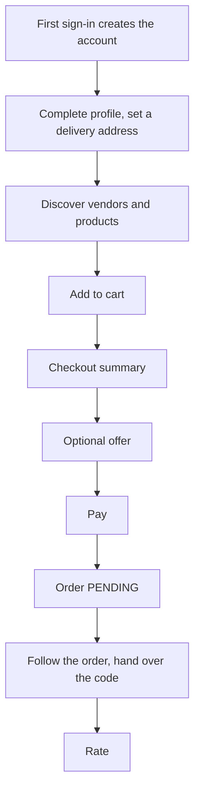

# Customer Panel

This page describes the **customer role** as the backend implements it: the routes a
`CUSTOMER` can call, the workflows built from them, and the places where the role is
treated differently from the others. It builds on
[User Panel Flows Overview](./overview.md), [Onboarding Journey](./onboarding-journey.md)
and [Order Journey](./order-journey.md), and links to the technical pages for every
rule instead of repeating them.

Paths are relative to `src/app/`. Statements come from the committed backend code.
Behavior read from code but not run is marked **Inferred**. Uncommitted working-tree
features are not described. The backend has no concept of a panel or a screen, so this
page says nothing about how a client presents these routes.

---

## 1. Role purpose

The customer browses vendors and products near it, builds a cart, pays, and then
follows the order to delivery or collection. Its stake in an order is **paying for it,
cancelling it if needed, handing over the delivery or pickup code, and rating it
afterwards**. A customer has no wallet, no payouts and no approval or agreement.

---

## 2. Account and access

| Topic | Behavior | Owning page |
| --- | --- | --- |
| Creation | The first `POST /auth/login-customer` (email or phone) or `POST /auth/social-login` creates the `Customer` and `AuthUser`. There is no registration route | [Authentication](../03-identity-access/authentication.md#flow-customer-otp-login) |
| Verification | A 4-digit OTP (5-minute TTL) submitted to `POST /auth/verify-otp` with role `CUSTOMER`; a social token needs no OTP | Same page |
| Status | `APPROVED` at creation. No submit, approval or correction steps | [User Lifecycle](../03-identity-access/user-lifecycle.md#customers) |
| Agreement | None. A customer is never subject to the agreement gate | [Agreement Gate](../07-agreements/agreement-gate.md#short-answers) |
| Sessions | Per-device sessions with refresh-token rotation; `POST /auth/refresh-token`, `POST /auth/logout`, `POST /auth/update-fcm-token` | [Authentication](../03-identity-access/authentication.md#per-device-sessions-logindevices) |
| Password | **None.** A customer cannot use password login, `change-password`, `forgot-password` or `reset-password` | [Authentication](../03-identity-access/authentication.md#flow-forgot--reset-password) |
| Email or phone change | `PATCH /profile/send-otp`, then `PATCH /profile/update-email-or-contact-number` | [Customer Addresses](../03-identity-access/customer-addresses.md#profile-update-and-the-primary-address) |
| Deleting the account | `DELETE /auth/soft-delete/:userId`, own account only. Sessions end at once | [User Lifecycle](../03-identity-access/user-lifecycle.md#soft-delete) |
| Blocking | An admin can set `BLOCKED`; `auth()` then refuses every request | [User Lifecycle](../03-identity-access/user-lifecycle.md#approval-rejection-and-blocking) |

A customer may also pass a `referralCode` when it first signs in. See
[Points and Referrals](../09-offers-and-coupons/points-and-referrals.md#attaching-a-code).

---

## 3. Main capabilities

| Area | Routes | Owning page |
| --- | --- | --- |
| Profile | `GET /profile`, `PATCH /customers/:customerId` (own record, after the OTP step is complete) | [Customer Addresses](../03-identity-access/customer-addresses.md#routes) |
| Addresses and location | `POST /customers/add-delivery-address`, `PATCH /customers/update-delivery-address/:addressId`, `PATCH /customers/toggle-delivery-address-status/:addressId`, `DELETE /customers/delete-delivery-address/:addressId`, `GET /customers/delivery-addresses/all`, `PATCH /customers/:customerId/update-live-location` | [Customer Addresses](../03-identity-access/customer-addresses.md) |
| Discovery | `GET /vendors/customer`, `GET /vendors/customer/:vendorId`, `GET /products`, `GET /products/:productId`, `GET /search`, `GET /categories/businessCategory`, `GET /categories/cuisine`, `GET /product-categories`, `GET /add-ons`; public variants for vendors, products, categories and search | [Vendors and Branches](../04-vendors/vendors-and-branches.md#customer-vendor-discovery), [Products](../05-products/products.md#visibility-and-discovery), [Menus](../05-products/menus.md#how-customers-browse-a-vendors-menu) |
| Cart | `POST /carts/add-to-cart`, `PATCH /carts/toggle-item-status`, `PATCH /carts/update-addon-quantity`, `DELETE /carts/delete-item`, `DELETE /carts/clear-cart`, `GET /carts/view-cart` | [Cart](../08-cart/cart.md#endpoints) |
| Checkout and offers | `POST /checkout`, `GET /checkout/summary/:checkoutSummaryId`, `GET /offers`, `GET /offers/:offerId`, `GET /offers/available-offers/:checkoutId`, `POST /offers/validate-apply-offer` | [Checkout and Order Creation](../03-orders/checkout-and-order-creation.md), [Offers](../09-offers-and-coupons/offers.md#who-can-do-what) |
| Payment | `POST /payment/reduniq/create-payment-intent`, `POST /payment/reduniq/pay-with-saved-token`, `POST /payment/reduniq/handle-payment-failure/:checkoutSummaryId` | [Payments](../10-payments/payments.md) |
| Saved cards | `POST /payment-tokens/save-card`, `GET /payment-tokens`, `PATCH /payment-tokens/:paymentTokenId/disable` | [Saved Cards](../10-payments/saved-cards.md) |
| Orders | `POST /orders/create-order`, `GET /orders`, `GET /orders/:orderId`, `PATCH /orders/:orderId/cancel`, `POST /orders/reorder/:orderId`, `GET /orders/:orderId/download-invoice-pdf` | [Order Lifecycle](../03-orders/order-lifecycle.md), [Order Tracking and Realtime](../03-orders/order-tracking-and-realtime.md#reading-orders) |
| Ratings | `POST /ratings/create-rating`, `GET /ratings/get-all-ratings`, `GET /ratings/:ratingId` | [Ratings](../11-ratings/ratings.md) |
| Points and referrals | `GET /points/my-points`, `POST /points/add-order-points`, `GET /referrals/my-referrals` | [Points and Referrals](../09-offers-and-coupons/points-and-referrals.md#routes-apiv1points) |
| Sponsorships | `GET /sponsorships`, `GET /sponsorships/:id`; public `GET /sponsorships/open` | [Sponsorships](../02-platform/sponsorships.md#what-a-customer-or-guest-sees) |
| Support | `POST /support/send-message`, `GET /support/tickets`, `GET /support/tickets/:ticketId/messages`, `PATCH /support/tickets/:ticketId/read` | [Support](../02-platform/support.md) |
| Notifications | All `/notifications` routes except `broadcast` (own rows) | [Notifications](../06-notifications/notifications.md#in-app-notification-apis) |
| Ledger and history | `GET /transactions` (own rows), `GET /login-histories` (own rows), `POST /uploads` | [Payouts, Wallets and Transactions](../10-payments/payouts-wallets-transactions.md#reading-transactions) |

---

## 4. End-to-end workflows

| Workflow | Steps | Where the detail is |
| --- | --- | --- |
| **First session** | `login-customer` or `social-login`, then `verify-otp`; `PATCH /customers/:customerId` to set a name and a primary address (this also creates the referral code the first time); add a delivery address if it differs | [Onboarding Journey](./onboarding-journey.md#customer), [Customer Addresses](../03-identity-access/customer-addresses.md) |
| **Order a delivery** | Discover, cart, `POST /checkout`, optional offer, payment, `create-order` (or the gateway notification), then follow the order | [Order Journey](./order-journey.md#phase-1-before-the-order-exists) |
| **Order a pickup** | Same, with `fulfillmentType: PICKUP` and a `pickupTime` slot at checkout; no address or rider; collect with the pickup code | [Checkout and Order Creation](../03-orders/checkout-and-order-creation.md#pickup-slot-rules), [Order Journey](./order-journey.md#pickup-orders) |
| **Pay with a saved card** | Save a card (`save-card`, or `saveCard` on a hosted payment), then `pay-with-saved-token`, which charges and creates the order in one request | [Saved Cards](../10-payments/saved-cards.md#paying-with-a-saved-card) |
| **Reorder** | `POST /orders/reorder/:orderId` re-adds each item to the cart through the normal add rules. A failure part-way leaves earlier items in the cart | [Order Tracking and Realtime](../03-orders/order-tracking-and-realtime.md#reorder) |
| **Cancel** | `PATCH /orders/:orderId/cancel` with a reason | [Order Lifecycle](../03-orders/order-lifecycle.md#status-transition-rules) |
| **Rate** | `POST /ratings/create-rating` after `DELIVERED` or `PICKED_UP_BY_CUSTOMER`; products and the rider, each once | [Ratings](../11-ratings/ratings.md#creating-ratings) |
| **Recover a failed payment** | `handle-payment-failure` resets the summary; a payment that succeeded without an order is a separate case | [Payments](../10-payments/payments.md#payment-failure) |

The cart's mutation routes return `data: null` outside development, so a client must
call `GET /carts/view-cart` to read the result. See [Cart](../08-cart/cart.md#endpoints).

---

## 5. Order responsibilities

What the customer does, and must be ready to do, at each point. The full state machine
is on [Order Lifecycle](../03-orders/order-lifecycle.md).

| When | Customer's part | Notes |
| --- | --- | --- |
| Before payment | Needs an active address with coordinates, city and street for a delivery order | `DELIVERY_ADDRESS_INCOMPLETE` otherwise. A GPS update can change which address is active |
| Order creation | The customer's `create-order` call or the gateway notification creates the order; an optional `deliveryNotes` is the note for the rider | Whichever confirmation arrives first wins |
| `PENDING` | Waits for the vendor. May cancel | A cancel here is the only customer cancel that sets `refundStatus: PENDING` |
| `PREPARING` to `ASSIGNED` | Waits. May cancel | Cancel is allowed in every non-terminal status; the assigned rider is told |
| `READY_FOR_PICKUP` (pickup) | Shows the pickup code to the vendor, who verifies it | The code is sent to the customer by push and email. No attempt limit |
| `PICKED_UP` (delivery) | Receives the delivery code | By push, email and socket. May still cancel; the vendor is not told |
| `ON_THE_WAY` | Gives the delivery code to the rider, who submits it | Five failed attempts lock the code, and no committed recovery exists |
| `DELIVERED`, `PICKED_UP_BY_CUSTOMER` | May rate and download the invoice | The invoice works only after it has synced |
| `REJECTED`, `CANCELED` | Waits for an admin refund where one is owed | Nothing refunds automatically |
| `NO_SHOW` | None | The order is settled like a completed one |

The customer reads its codes from the order: `GET /orders/:orderId` selects
`pickup.code` and `deliveryOtp.code` for the customer only, and on `GET /orders` only a
customer may request them through `fields`. See
[Order Tracking and Realtime](../03-orders/order-tracking-and-realtime.md#the-single-order).

---

## 6. Money, payment and settlement

| Topic | Behavior | Owning page |
| --- | --- | --- |
| What is charged | The order's grand total, fixed at checkout, in euros through RedUniq (hosted page or saved card) | [Checkout and Order Creation](../03-orders/checkout-and-order-creation.md#how-the-amounts-are-calculated), [Payments](../10-payments/payments.md) |
| Ledger rows | An `ORDER_PAYMENT` row at creation and a `REFUND` row after a refund, both under the customer | [Payouts, Wallets and Transactions](../10-payments/payouts-wallets-transactions.md#reading-transactions) |
| Refunds | An admin runs the gateway refund for `REJECTED` or `CANCELED` orders with a refund owed. Full amount only; the customer gets an email | [Cancellations, Refunds and Settlement](../03-orders/cancellations-refunds-settlement.md#refunds) |
| Offers | Usage is reserved at order creation and never given back, even if the order is cancelled, rejected or refunded | [Offers](../09-offers-and-coupons/offers.md#usage-limits-reservation-and-rollback) |
| Points | Earned at settlement as `floor(grand total x customerPointsPerEuro)`; with the default setting of 0 a customer earns nothing. **No redemption exists**, and the stored expiry date is never read | [Points and Referrals](../09-offers-and-coupons/points-and-referrals.md#points) |
| Referrals | Rewards go to a separate `DeliGoBalance` that no route can withdraw or spend; free-meal and free-delivery rewards create coupons that cannot be redeemed | [Points and Referrals](../09-offers-and-coupons/points-and-referrals.md#referrals), [Coupons](../09-offers-and-coupons/coupons.md) |
| Wallet and payouts | **None.** A customer never gets a wallet and is not in any payout route | [Payouts, Wallets and Transactions](../10-payments/payouts-wallets-transactions.md#at-a-glance) |

A customer cancel after the vendor has accepted ends with `refundStatus: NOT_APPLICABLE`,
which the refund route then refuses. The code does not say whether a manual resolution
exists outside the API.

---

## 7. Notifications and realtime

| Channel | What the customer receives | Owning page |
| --- | --- | --- |
| Push | Vendor rejection, pickup ready (with the code), pickup reminder, delivery code, cart-expiry warning, account status changes, admin broadcasts | [Notification Triggers and Templates](../06-notifications/notification-triggers.md), [Notifications](../06-notifications/notifications.md#who-can-receive-and-read-notifications) |
| Email | Receipt with the invoice link, accepted, rejected, pickup code, delivery code, delivered or picked up, refund | [Notification Flow](../02-platform/notification-flow.md#7-order-notifications) |
| Socket | `ORDER_STATUS_UPDATED` and `DELIVERY_OTP_GENERATED` through the customer's own `user_<id>` room; `vendor-store-status-updated` for every vendor, because every customer socket joins the shared room automatically | [Order Tracking and Realtime](../03-orders/order-tracking-and-realtime.md#order-events), [Vendors and Branches](../04-vendors/vendors-and-branches.md#who-reads-store-state) |
| Tracking | `join-order-tracking` then `delivery-location-live` positions from the rider | [Order Tracking and Realtime](../03-orders/order-tracking-and-realtime.md#rider-live-location) |

There is **no push** for acceptance, preparation, assignment, on the way or delivery
(delivery sends an email only). Payment intent, payment failure and rating send no
notification. Points and referrals send none either. Socket events are not stored.

---

## 8. Support and SOS

| Topic | Behavior |
| --- | --- |
| Support | Allowed. `POST /support/send-message` opens or continues the customer's single open ticket; an optional `referenceOrderId` must be the customer's own order. The customer lists its tickets, reads its messages and marks them read, and cannot close a ticket over REST |
| Support sockets | The customer can use `send-message`, `typing`, `mark-read` and `close-conversation`. A message sent over REST is stored but not pushed to any socket |
| SOS | **Not available.** `POST /sos/trigger` does not list the customer role, and a customer is in none of the SOS read routes |

Owning pages: [Support](../02-platform/support.md#who-can-do-what),
[SOS](../02-platform/sos.md#at-a-glance).

---

## 9. Restrictions and route gaps

### Asymmetries the customer will notice

| Area | Asymmetry | Owning page |
| --- | --- | --- |
| Own record | A customer reads itself through `GET /profile`. `GET /customers/:customerId` does not list the customer and is effectively admin-only | [Customer Addresses](../03-identity-access/customer-addresses.md#what-reads-these-values) |
| Passwords | `change-password` lists the customer at the route, but the service rejects it, and customers have no recovery flow. The staff-type roles have both, with exceptions listed in Authentication | [Authentication](../03-identity-access/authentication.md#flow-forgot--reset-password) |
| Profile update | `PATCH /customers/:customerId` needs a finished OTP step; the address routes do not | [Customer Addresses](../03-identity-access/customer-addresses.md#profile-update-and-the-primary-address) |
| Active address | A live-location update activates a `CURRENT_LOCATION` address and deactivates the chosen one. A checkout may then fail with `DELIVERY_ADDRESS_INCOMPLETE`. `toggle-delivery-address-status` always activates and never toggles | [Customer Addresses](../03-identity-access/customer-addresses.md#live-location-update) |
| Zones | `zoneId` on an address cannot be set through any route, though sponsorship targeting reads zones | [Customer Addresses](../03-identity-access/customer-addresses.md#data-model-on-customer) |
| Discovery | Vendor lists exclude vendors with an unsigned agreement; `GET /search` does not consult agreements and `isStoreOpen` is returned but not filtered, so cart add and checkout reject later | [Menus](../05-products/menus.md#two-discovery-paths-two-sets-of-rules), [Vendors and Branches](../04-vendors/vendors-and-branches.md#who-reads-store-state) |
| Checkout | Order creation does not re-check the store, the vendor's status or its agreement (**Inferred** effect) | [Checkout and Order Creation](../03-orders/checkout-and-order-creation.md#what-is-not-re-checked-at-creation) |
| Cancellation | Allowed from any non-terminal status, with no time limit (`cancelTimeLimitMinutes` is never read) | [Cancellations, Refunds and Settlement](../03-orders/cancellations-refunds-settlement.md#known-implementation-notes) |
| Refund | Only a cancel from `PENDING` is marked refundable | [Cancellations, Refunds and Settlement](../03-orders/cancellations-refunds-settlement.md#refunds) |
| Ratings | Cannot be edited or deleted. A customer sees only its own ratings and no other customer's review text | [Ratings](../11-ratings/ratings.md#immutability) |
| Rewards | Points have no redemption; referral cash and coupons cannot be used | [Points and Referrals](../09-offers-and-coupons/points-and-referrals.md#mismatches-and-inconsistencies) |
| Referral code | Exists only after the first profile update | [Points and Referrals](../09-offers-and-coupons/points-and-referrals.md#referral-codes) |
| Sponsorships | `GET /sponsorships/:id` does not re-check the date window or zone | [Sponsorships](../02-platform/sponsorships.md#what-a-customer-or-guest-sees) |
| Transactions | The list returns the whole populated order for each of the customer's rows, including the platform split | [Payouts, Wallets and Transactions](../10-payments/payouts-wallets-transactions.md#reading-transactions) |
| Wallet, payouts, SOS | No route at all for the customer | See sections 6 and 8 |

### Realtime caveats

- `join-order-tracking` has no ownership check, so any signed-in customer can join the
  tracking room of any order id. See
  [Order Tracking and Realtime](../03-orders/order-tracking-and-realtime.md#rider-live-location).
- Support's `join-conversation` and `close-conversation` have no ownership check. See
  [Support](../02-platform/support.md#socketio-events).
- The socket connection checks only the token signature, so a blocked customer's open
  socket is not re-checked.

---

## Unresolved and ambiguous points

- **Client behavior.** Which screen starts payment, shows the codes, or reacts to a GPS
  update is not defined by the backend.
- **Refund eligibility** for a customer who cancels after acceptance is not stated.
- **Delivery code lock.** No committed recovery for a customer whose order reaches five
  failed code attempts.
- **Intent of the missing routes.** Whether a customer should have a password recovery,
  an editable rating, or a way to redeem points is not answered by the code.
- **Search and agreements.** That `GET /search` can show products of a vendor whose
  agreement is unsigned is **Inferred**.

---

## Related documentation

- [User Panel Flows Overview](./overview.md), [Onboarding Journey](./onboarding-journey.md), [Order Journey](./order-journey.md): the shared layer.
- [Authentication](../03-identity-access/authentication.md) and [Customer Addresses](../03-identity-access/customer-addresses.md): sign-in, sessions, addresses and location.
- [Cart](../08-cart/cart.md), [Checkout and Order Creation](../03-orders/checkout-and-order-creation.md), [Payments](../10-payments/payments.md), [Saved Cards](../10-payments/saved-cards.md): from cart to a paid order.
- [Order Lifecycle](../03-orders/order-lifecycle.md), [Order Tracking and Realtime](../03-orders/order-tracking-and-realtime.md), [Cancellations, Refunds and Settlement](../03-orders/cancellations-refunds-settlement.md): the order after payment.
- [Offers](../09-offers-and-coupons/offers.md), [Points and Referrals](../09-offers-and-coupons/points-and-referrals.md), [Ratings](../11-ratings/ratings.md), [Support](../02-platform/support.md): the customer's other features.
