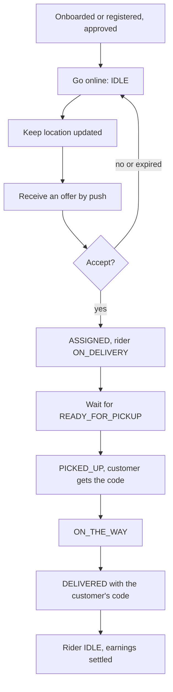

# Delivery Partner Panel

This page describes the **delivery partner role** (`DELIVERY_PARTNER`, the rider) as the
backend implements it: the routes a rider can call, the workflows built from them, and
the places where its access is narrower or looser than the other roles'. It builds on
[User Panel Flows Overview](./overview.md), [Onboarding Journey](./onboarding-journey.md)
and [Order Journey](./order-journey.md), and links to the technical pages for every rule
instead of repeating them.

Paths are relative to `src/app/`. Statements come from the committed backend code.
Behavior read from code but not run is marked **Inferred**. Uncommitted working-tree
features are not described. The backend has no concept of a panel or a screen, so this
page says nothing about how a client presents these routes.

---

## 1. Role purpose

The rider receives offers for delivery orders near it, collects an order from the vendor,
delivers it to the customer with the customer's delivery code, and earns money for each
delivery. A rider works alone or under a **fleet manager**; the link decides who is paid.
A rider has no part in pickup orders.

---

## 2. Account and access

| Topic | Behavior | Owning page |
| --- | --- | --- |
| Creation | `POST /auth/register` (role `DELIVERY_PARTNER`), or onboarded by a fleet manager (linked to it) or by an admin (not linked) | [Onboarding Journey](./onboarding-journey.md#delivery-partner) |
| Verification | Email OTP at `POST /auth/verify-otp`; status stays `PENDING`. The profile cannot be updated until the email is verified | [Authentication](../03-identity-access/authentication.md#flow-customer-otp-login) |
| Profile and documents | `PATCH /delivery-partners/:deliveryPartnerId` and `.../docImage`, by the rider, its own fleet manager, or staff. Refused while the profile is locked, unless an admin has opened a correction grant | [User Lifecycle](../03-identity-access/user-lifecycle.md#isupdatelocked-through-the-lifecycle), [Onboarding Journey](./onboarding-journey.md#correction-requests) |
| Approval | `PENDING` → `SUBMITTED` → `APPROVED` by an admin. The rider, its fleet manager or an admin may submit. No agreement | [Onboarding Journey](./onboarding-journey.md#approval-rejection-correction-and-blocking) |
| Agreement | None. A rider is never subject to the agreement gate | [Agreement Gate](../07-agreements/agreement-gate.md#short-answers) |
| Fleet manager | Set at onboarding by a fleet manager, or by an admin through `assign-fleet-manager`. **No route clears or changes it afterwards** | [Onboarding Journey](./onboarding-journey.md#delivery-partner) |
| Sign-in and sessions | Password login with a verified email; per-device sessions; `change-password`, `forgot-password` and `reset-password` available | [Authentication](../03-identity-access/authentication.md) |
| Deleting the account | `DELETE /auth/soft-delete/:userId`, its own account only (its fleet manager is refused), or an admin | [User Lifecycle](../03-identity-access/user-lifecycle.md#soft-delete) |

**Approval is what makes a rider eligible for orders**, but it is not checked on every
route; see [Restrictions and route gaps](#9-restrictions-and-route-gaps).

---

## 3. Main capabilities

| Area | Routes | Owning page |
| --- | --- | --- |
| Availability | `PATCH /delivery-partners/status/change` (`IDLE` or `OFFLINE`) | [Delivery Dispatch](../03-orders/delivery-dispatch.md#rider-state) |
| Location | `PATCH /delivery-partners/:deliveryPartnerId/liveLocation`; socket `delivery-location-update` | [Delivery Dispatch](../03-orders/delivery-dispatch.md#rider-state), [Order Tracking and Realtime](../03-orders/order-tracking-and-realtime.md#rider-live-location) |
| Offers | `GET /orders/delivery-partner-dispatch-order` (alias `/orders/delivery-partner/dispatch-order`) | [Delivery Dispatch](../03-orders/delivery-dispatch.md#rider-response) |
| Answering an offer | `PATCH /orders/:orderId/accept-dispatch-order` with `ACCEPT` or `REJECT` | Same |
| Current order | `GET /orders/delivery-partner/current-order` | Same |
| Delivery steps | `PATCH /orders/:orderId/update-order-status` with `PICKED_UP`, `ON_THE_WAY`, `DELIVERED` (with the code) or `REASSIGNMENT_NEEDED` | [Order Lifecycle](../03-orders/order-lifecycle.md#role-based-actions) |
| Order history | `GET /orders`, `GET /orders/:orderId` (own assigned orders) | [Order Tracking and Realtime](../03-orders/order-tracking-and-realtime.md#reading-orders) |
| Profile | `GET /profile`, `GET /delivery-partners/:deliveryPartnerId`, `PATCH /profile/send-otp`, `PATCH /profile/update-email-or-contact-number` | [Authentication](../03-identity-access/authentication.md) |
| Wallet and payouts | `GET /wallets/me`, `GET /payouts`, `GET /payouts/:payoutId`, `GET /transactions` | [Payouts, Wallets and Transactions](../10-payments/payouts-wallets-transactions.md) |
| Earnings | `GET /analytics/partner/earning-analytics` | [Analytics](../02-platform/analytics.md#fleet-manager-and-rider-reports) |
| Points and referrals | `GET /points/my-points`, `POST /points/add-rider-points`, `GET /referrals/my-referrals` | [Points and Referrals](../09-offers-and-coupons/points-and-referrals.md) |
| Ratings received | `GET /ratings/get-all-ratings`, `GET /ratings/:ratingId` (only ratings where it is the target) | [Ratings](../11-ratings/ratings.md#list-scoping-get-all-ratings) |
| Support | `POST /support/send-message`, `GET /support/tickets`, messages, read | [Support](../02-platform/support.md) |
| SOS | `POST /sos/trigger` | [SOS](../02-platform/sos.md) |
| Notifications, history, files | `/notifications` (own rows), `GET /login-histories` (own rows), `POST /uploads` | [Notifications](../06-notifications/notifications.md#in-app-notification-apis) |

---

## 4. End-to-end workflows

| Workflow | Steps | Where the detail is |
| --- | --- | --- |
| **Start a shift** | `status/change` to `IDLE`; send location by HTTP or socket. Dispatch searches the rider's stored position, so a rider whose position is not being updated is searched where it was last seen | [Delivery Dispatch](../03-orders/delivery-dispatch.md#candidate-search) |
| **Take an order** | A push arrives; the rider lists open offers; `ACCEPT` within the 120-second window. Only one rider wins | [Delivery Dispatch](../03-orders/delivery-dispatch.md#making-an-offer) |
| **Decline** | `REJECT`, or let the window expire. Either way the rider is never offered that order again | [Delivery Dispatch](../03-orders/delivery-dispatch.md#known-implementation-notes) |
| **Hand an order back** | `REASSIGNMENT_NEEDED` with a reason, only while `ASSIGNED`. The rider is barred from that order and is freed by the worker | [Delivery Dispatch](../03-orders/delivery-dispatch.md#after-assignment) |
| **Deliver** | `PICKED_UP`, `ON_THE_WAY`, then `DELIVERED` with the customer's six-digit code | [Order Journey](./order-journey.md#delivery-orders) |
| **Get paid** | Settlement credits a wallet; payouts follow, section 6 | [Payouts, Wallets and Transactions](../10-payments/payouts-wallets-transactions.md) |

---

## 5. Order responsibilities

| Status | Rider's part | Route | Result |
| --- | --- | --- | --- |
| `DISPATCHING` | Answer the offer | `accept-dispatch-order` | `ACCEPT` → `ASSIGNED` and the rider becomes `ON_DELIVERY`. `REJECT` removes the rider from the pool; the last rejection sends the order to `AWAITING_PARTNER` |
| `ASSIGNED` | Wait. May hand the order back | `update-order-status` with `REASSIGNMENT_NEEDED` | The order goes back to dispatch |
| `READY_FOR_PICKUP` | Collect the order from the vendor | `PICKED_UP` | A six-digit code is generated and sent to the customer |
| `PICKED_UP` | Travel | `ON_THE_WAY` | The vendor is pushed |
| `ON_THE_WAY` | Hand over and submit the customer's code | `DELIVERED` with `otp` | The order completes; settlement queued; the rider is freed |

Rules that shape the rider's role:

- **The rider cannot mark an order ready.** `READY_FOR_PICKUP` is set by the vendor
  (immediately when the rider is assigned, or at assignment if the vendor confirmed
  earlier) or by the auto-ready fallback 5 minutes after `estimatedReadyAt`.
  `PICKED_UP` is accepted only from it, so a rider that arrives early waits for the
  vendor's confirmation or the fallback.
- **One order at a time.** A rider with `currentOrderId` cannot accept another. The
  `capacity` setting has no effect.
- **The delivery code has five attempts.** After five wrong attempts further attempts are
  refused, and no committed recovery exists for a locked code.
- **A customer can cancel at any stage**, including after pickup. The rider is pushed and
  freed. Offers already sent are not removed, so a rider who still sees one gets
  `ORDER_ALREADY_CLAIMED_OR_EXPIRED` on accept (**Inferred**).
- **An unanswered offer counts as a rejection.**
- **If no rider takes the order**, it is retried while `estimatedReadyAt` is ahead and then
  escalated to admins, who can assign a specific rider. The rider is pushed on assignment.
- **Pickup orders never involve a rider.**

Details: [Order Lifecycle](../03-orders/order-lifecycle.md#status-transition-rules),
[Delivery Dispatch](../03-orders/delivery-dispatch.md#retry-escalation-and-admin-assignment).

---

## 6. Money, payment and settlement

| Topic | Behavior | Owning page |
| --- | --- | --- |
| Per-delivery earning | `riderNetEarnings`, fixed in the order's payout snapshot at checkout | [Cancellations, Refunds and Settlement](../03-orders/cancellations-refunds-settlement.md#settlement) |
| Whose wallet is credited | A rider **without** a fleet manager: its own wallet. A rider **with** a fleet manager: the fleet manager's wallet receives the rider's earnings plus its fee, and the rider's own wallet is not credited | Same page |
| Wallet | Created on the first credit, so a rider with no credited delivery gets `404 WALLET_NOT_FOUND_FOR_USER` from `GET /wallets/me`. **Inferred:** a managed rider's wallet holds only what it earned before the link | [Payouts, Wallets and Transactions](../10-payments/payouts-wallets-transactions.md#how-wallets-are-created-and-credited) |
| Payouts, unmanaged rider | Only the automatic daily run can create one (when enabled and on a payout day). An admin then finalizes it. The rider cannot request one | [Payouts, Wallets and Transactions](../10-payments/payouts-wallets-transactions.md#automatic-payouts) |
| Payouts, managed rider | The automatic run **skips** it. The only request route is the fleet manager's, and it currently fails schema validation | [Payouts, Wallets and Transactions](../10-payments/payouts-wallets-transactions.md#manual-request-post-payoutsinitiate-settlement) |
| Bank details | Needed for any payout. An incomplete record triggers a push alert to the rider | Same page |
| Points | `rewards.riderPointsPerDelivery` per `DELIVERED` order, or **20 when the setting is 0 or unset**. No redemption exists | [Points and Referrals](../09-offers-and-coupons/points-and-referrals.md#points) |
| Referrals | `GET /referrals/my-referrals` is open to riders, but a rider has no referral code and no rider sign-in accepts one; the welcome bonus path is unreachable (**Inferred**) | [Points and Referrals](../09-offers-and-coupons/points-and-referrals.md#referral-codes) |
| Transactions | The list returns the whole populated order for each of the rider's rows, including the platform split | [Payouts, Wallets and Transactions](../10-payments/payouts-wallets-transactions.md#reading-transactions) |
| Order not delivered | A handed-back order earns nothing. A customer cancel after assignment frees the rider and counts as a cancelled delivery | [Delivery Dispatch](../03-orders/delivery-dispatch.md#after-assignment) |

A rider has no refund or collection duty: customers pay the gateway, not the rider.

---

## 7. Notifications and realtime

| Channel | What the rider receives | Owning page |
| --- | --- | --- |
| Push | Dispatch offer; assignment by an admin; customer cancellation after assignment; account and correction messages; payout alerts and completion; admin broadcasts | [Notifications](../06-notifications/notifications.md#who-can-receive-and-read-notifications), [Notification Triggers and Templates](../06-notifications/notification-triggers.md) |
| Email | Account, approval and correction emails. No order emails were found | [Notification Flow](../02-platform/notification-flow.md#7-order-notifications) |
| Socket, orders | `ORDER_STATUS_UPDATED` through the rider's `user_<id>` room, and `REMOVE_ORDER_POPUP` when an offer is answered or expires | [Order Tracking and Realtime](../03-orders/order-tracking-and-realtime.md#order-events) |
| Socket, location | The rider publishes with `delivery-location-update`; accuracy above 100 or bad coordinates are dropped silently; the database position is saved at most every 5 seconds | [Order Tracking and Realtime](../03-orders/order-tracking-and-realtime.md#rider-live-location) |

Offers are delivered **only by push**; there is no socket offer event. The rider gets
**no push** when the vendor marks an order ready or when another rider wins an offer, and no
push when it hands an order back or completes one. The one ready-related push is
`ORDER_AUTO_READY_TO_PARTNER`, sent when the auto-ready fallback marks the rider's
order `READY_FOR_PICKUP`.
Some `REMOVE_ORDER_POPUP` events go to rooms nobody joins, and a customer cancellation
emits none, so an offer can stay visible to the rider until it acts.

---

## 8. Support and SOS

| Topic | Behavior |
| --- | --- |
| Support | Allowed over REST and the socket. One open ticket; a referenced order must be the rider's own. The rider can list tickets, read messages and mark them read, and cannot close over REST |
| Raise an SOS | Yes. On an order, `POST /orders/:orderId/sos` (or `POST /sos/trigger` with an `orderId`), for the rider's own order only; a fresh location can be sent. Without an order, `POST /sos/trigger` takes the **stored** session location, and fails without one |
| After raising | Admins and fleet managers in the monitoring room receive `new-sos-alert`. Over REST a fleet manager lists only its own riders' alerts, but a fleet manager in the monitoring room receives every alert. For a rider SOS on an order, `ADMIN` and `SUPER_ADMIN` are also pushed |
| Allowed order statuses | Only `READY_FOR_PICKUP`, `PICKED_UP` and `ON_THE_WAY`. `ASSIGNED` and earlier, `DELIVERED` and `CANCELED` are refused (`400`); to give back an `ASSIGNED` order the rider uses `REASSIGNMENT_NEEDED` |
| Order effect | An accepted SOS opens a `RIDER_SOS` exception that an admin acknowledges, resolves (the rider continues) or answers with a rider replacement or a fault cancellation. The order status never changes, the rider can keep delivering, an SOS never cancels an order by itself, and the customer is not told about it |
| Listing its own alerts | **Not possible.** `GET /sos` does not list riders, and `GET /sos/:id` is for admins and fleet managers. A rider cannot read back an alert it raised |

A plain SOS (no order) is socket-only. A rider SOS on an order pushes the admins, and the rider later gets a push when an admin acknowledges it, resolves it or replaces the rider; there is no email. Owning pages:
[Delivery Exceptions and Verification](../03-orders/delivery-exceptions.md#rider-sos),
[Support](../02-platform/support.md#who-can-do-what), [SOS](../02-platform/sos.md#triggering).

---

## 9. Restrictions and route gaps

### Approval checks that are not applied everywhere

| Route | Checks `APPROVED`? | Effect |
| --- | --- | --- |
| `accept-dispatch-order`, the offer list, the current-order read | **Yes** | A rider that is not approved cannot take an order |
| Dispatch candidate search, admin assignment | **Yes** | A rider that is not approved is not offered or assigned an order |
| `PATCH /delivery-partners/status/change` | **No** | A `PENDING` rider can go online |
| `PATCH /orders/:orderId/update-order-status` | **No** | The route checks the caller is the assigned rider only |
| `PATCH /delivery-partners/:id/liveLocation` | **No** (read from the service: role, own id and accuracy only) | A rider can publish its location regardless |

See [Delivery Dispatch](../03-orders/delivery-dispatch.md#known-implementation-notes) and
[Order Lifecycle](../03-orders/order-lifecycle.md#role-based-actions).

### Route asymmetries

| Area | Asymmetry | Owning page |
| --- | --- | --- |
| Fleet manager link | Permanent through the API. A rider with a fleet manager cannot be paid by the automatic run, and the fleet manager's request route fails | [Onboarding Journey](./onboarding-journey.md#delivery-partner) |
| Wallet | `GET /wallets/me` exists, but a payout request does not for a rider. Only a fleet manager can request, and only for its riders | [Payouts, Wallets and Transactions](../10-payments/payouts-wallets-transactions.md) |
| Order reads | A rider can open an order assigned to it but cannot download the invoice (`download-invoice-pdf` lists customers, vendors and admins) | [Order Tracking and Realtime](../03-orders/order-tracking-and-realtime.md#reading-orders) |
| Rider reads | `GET /customers/:customerId` lists riders on the route but is effectively admin-only | [Customer Addresses](../03-identity-access/customer-addresses.md#what-reads-these-values) |
| Ratings | A rider sees only ratings where it is the target; the list withholds the reviewer's name, but opening a single rating returns it. The rating summary is vendor-only, so a rider gets zeros | [Ratings](../11-ratings/ratings.md#single-rating-get-ratingsratingid) |
| SOS | A rider can raise an alert but not list or open its own | [SOS](../02-platform/sos.md#reading-alerts-over-rest) |
| Fleet-managed orders | A fleet manager sees its riders' orders in the list but cannot open one order | [Order Tracking and Realtime](../03-orders/order-tracking-and-realtime.md#role-scoping) |
| Support close | Not allowed over REST, but the socket path has no role check | [Support](../02-platform/support.md#socketio-events) |
| Offers | Cancellation does not remove offers; the capacity check is ineffective | [Delivery Dispatch](../03-orders/delivery-dispatch.md#known-implementation-notes) |
| Transactions | The list exposes the order's platform split | [Payouts, Wallets and Transactions](../10-payments/payouts-wallets-transactions.md#reading-transactions) |

### Realtime caveats

- `delivery-location-update` does not check that the order is assigned to the rider or that
  it is in a delivering status. A rider could publish positions to any order room
  (**Inferred**). Any signed-in customer, vendor, branch, rider or admin can join an order's
  tracking room. See
  [Order Tracking and Realtime](../03-orders/order-tracking-and-realtime.md#rider-live-location).
- The socket connection checks only the token signature, so a blocked rider's open socket is
  not re-checked.
- SOS's `sos-location-stream` only accepts a live alert owned by the connected socket's user.
  See [SOS](../02-platform/sos.md#socketio).

---

## Unresolved and ambiguous points

- **Client behavior.** How the rider app shows an offer, keeps location fresh, or waits for
  the ready state is not defined by the backend.
- **Waiting for `READY_FOR_PICKUP`.** Whether a rider is meant to wait for a cron after
  arriving is not stated.
- **Going online before approval.** Whether a `PENDING` rider should be able to go online is
  not stated.
- **Payouts for managed riders.** With the request route failing and the automatic run
  skipping them, the code has no working way to create a payout for a managed rider.
- **Wallet of a managed rider.** What it holds after the link is **Inferred**.
- **Code lock.** A delivery code locked after five wrong attempts is recovered by an admin OTP reset, and a rider can raise an order SOS or report a verification issue; see [Delivery Exceptions and Verification](../03-orders/delivery-exceptions.md).
- **Readback of SOS.** Whether a rider should see its own alerts is not stated.

---

## Related documentation

- [User Panel Flows Overview](./overview.md), [Onboarding Journey](./onboarding-journey.md), [Order Journey](./order-journey.md): the shared layer.
- [Delivery Dispatch and Riders](../03-orders/delivery-dispatch.md): rider state, offers, retries, escalation and admin assignment.
- [Order Lifecycle](../03-orders/order-lifecycle.md) and [Order Tracking and Realtime](../03-orders/order-tracking-and-realtime.md): statuses, reads and live location.
- [Cancellations, Refunds and Settlement](../03-orders/cancellations-refunds-settlement.md) and [Payouts, Wallets and Transactions](../10-payments/payouts-wallets-transactions.md): how a rider is paid.
- [Points and Referrals](../09-offers-and-coupons/points-and-referrals.md), [Analytics](../02-platform/analytics.md): points and earnings.
- [Support](../02-platform/support.md) and [SOS](../02-platform/sos.md): help and safety.
