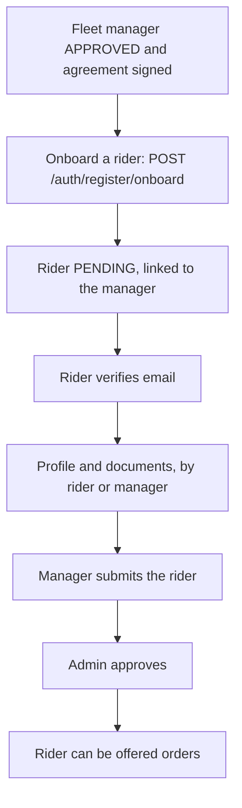

# Fleet Manager Panel

This page describes the **fleet manager role** (`FLEET_MANAGER`) as the backend
implements it: the routes it can call, the workflows built from them, and where its
access is narrower, looser or broken compared with the other roles. It builds on
[User Panel Flows Overview](./overview.md), [Onboarding Journey](./onboarding-journey.md),
[Order Journey](./order-journey.md) and [Delivery Partner Panel](./delivery-partner-panel.md),
and links to the technical pages for every rule instead of repeating them.

Paths are relative to `src/app/`. Statements come from the committed backend code.
Behavior read from code but not run is marked **Inferred**; behavior a probe ran is marked
**Executed**. Uncommitted working-tree features are not described. The backend has no
concept of a panel or a screen, so this page says nothing about how a client presents
these routes.

---

## 1. Role purpose

A fleet manager owns a pool of riders. It onboards them, can maintain their profiles and
documents, and is meant to pay them. Its stake in the platform's money is large: for every
order a managed rider completes, **the fleet manager's wallet is credited, not the rider's**.
Its stake in orders is small: it has **no order-handling route at all**, only a scoped
list. It is also one of the two roles (with `VENDOR`) that must sign an agreement.

---

## 2. Account and access

| Topic | Behavior | Owning page |
| --- | --- | --- |
| Creation | `POST /auth/register` (role `FLEET_MANAGER`), or onboarded by an admin | [Onboarding Journey](./onboarding-journey.md#fleet-manager) |
| Verification | Email OTP at `POST /auth/verify-otp`; status stays `PENDING`. The profile cannot be updated until the email is verified | [Authentication](../03-identity-access/authentication.md#flow-customer-otp-login) |
| Profile and documents | `PATCH /fleet-managers/:fleetManagerId`, `PATCH` and `DELETE /fleet-managers/:fleetManagerId/docImage`, by the manager itself or an admin. Refused while locked, unless an admin has opened a correction grant (which for this role can also cover `operationalData`) | [Onboarding Journey](./onboarding-journey.md#correction-requests) |
| Agreement | **Required.** Needs a party-signed agreement to submit, and a countersigned one after approval | Section 9 |
| Approval | `PENDING` → `SUBMITTED` → `APPROVED` by an admin; only an approved manager can onboard others | [Onboarding Journey](./onboarding-journey.md#approval-rejection-correction-and-blocking) |
| Lock | Locked on submit and still locked after approval; changes need a correction grant or an admin | [User Lifecycle](../03-identity-access/user-lifecycle.md#isupdatelocked-through-the-lifecycle) |
| Sessions, password | Password login, per-device sessions, `change-password` and `forgot-password` | [Authentication](../03-identity-access/authentication.md) |
| Deleting | `DELETE /auth/soft-delete/:userId`: its own account, or a rider it owns | [User Lifecycle](../03-identity-access/user-lifecycle.md#soft-delete) |

---

## 3. Main capabilities

| Area | Routes | Owning page |
| --- | --- | --- |
| Onboard a rider | `POST /auth/register/onboard` with role `DELIVERY_PARTNER` | [Onboarding Journey](./onboarding-journey.md#delivery-partner) |
| List and read riders | `GET /delivery-partners`, `GET /delivery-partners/:deliveryPartnerId` (own riders only) | Section 4 |
| Edit a rider | `PATCH /delivery-partners/:deliveryPartnerId`, `PATCH .../docImage` (own riders) | Section 4 |
| Submit a rider for approval | `PATCH /auth/:userId/submitForApproval` (own riders) | [User Lifecycle](../03-identity-access/user-lifecycle.md#submit-for-approval) |
| Confirm a correction request | `PATCH /auth/:userId/confirm-corrections` (own account) | [Onboarding Journey](./onboarding-journey.md#correction-requests) |
| Orders | `GET /orders` (riders' orders). **No** single-order read, no invoice | [Order Tracking and Realtime](../03-orders/order-tracking-and-realtime.md#role-scoping) |
| Analytics | `GET /analytics/fleet/dashboard-analytics`, `partner-performance-analytics`, `fleet/earning-analytics` | [Analytics](../02-platform/analytics.md#fleet-manager-and-rider-reports) |
| Wallet | `GET /wallets/me`, `GET /wallets`, `GET /wallets/:walletId` | [Payouts, Wallets and Transactions](../10-payments/payouts-wallets-transactions.md#reading-wallets) |
| Payouts | `POST /payouts/initiate-settlement`, `POST /payouts/finalize-settlement/:payoutId`, `GET /payouts`, `GET /payouts/:payoutId` | [Payouts, Wallets and Transactions](../10-payments/payouts-wallets-transactions.md#payout-lifecycle) |
| Agreement | `GET /agreements/current`, `POST /agreements/party/:partyId`, `POST /agreements/:agreementId/sign`, `PATCH /agreements/:agreementId`, `GET /agreements/party/:partyId` | [Agreements](../07-agreements/agreements.md#endpoints-and-who-may-call-them) |
| Ratings | `GET /ratings/get-all-ratings`, `GET /ratings/:ratingId` (its riders' ratings) | [Ratings](../11-ratings/ratings.md#list-scoping-get-all-ratings) |
| Support | `POST /support/send-message`, `GET /support/tickets`, messages, read | [Support](../02-platform/support.md) |
| SOS | `POST /sos/trigger`, `GET /sos`, `GET /sos/:id`, socket `join-sos-monitoring` | [SOS](../02-platform/sos.md) |
| Profile, ledger, history | `GET /profile`, `GET /fleet-managers/:fleetManagerId` (itself, with a short list of its riders), `GET /transactions` (own rows), `GET /login-histories` (own rows), `POST /uploads`, `/notifications` | [Notifications](../06-notifications/notifications.md#in-app-notification-apis) |

---

## 4. Onboarding and rider management

| Step | Who | Route | Notes |
| --- | --- | --- | --- |
| Create the rider | Fleet manager (must be `APPROVED`) | `POST /auth/register/onboard`, role `DELIVERY_PARTNER` | The manager chooses the rider's initial password. `currentFleetManagerId` is set to the manager and `registeredBy` records it. The rider gets an OTP email and must verify |
| Complete the profile and documents | Rider, its manager, or staff | `PATCH /delivery-partners/:id`, `PATCH .../docImage` | Refused until the rider's email is verified, and while the profile is locked unless a correction grant is open. A manager may act only on a rider it owns |
| Submit | Rider, its manager, or an admin | `PATCH /auth/:userId/submitForApproval` | No agreement for a rider. A manager may submit only riders it owns |
| Decide | Admin only | `PATCH /auth/:userId/approved-rejected-user` | **A fleet manager cannot approve, reject, block or request corrections** |
| Correct | Rider or manager, after an admin grant | The normal update routes | The grant is tied to the rider's profile. A manager may edit within it for an owned rider; only the rider confirms (`confirm-corrections` is own-account only) |
| Remove | Fleet manager | `DELETE /auth/soft-delete/:userId` | A rider it owns; sessions end at once |

What the manager sees of its riders:

- **`GET /delivery-partners`** forces `currentFleetManagerId` to the caller, so only its own
  riders appear. The list adds **no `isDeleted` filter**, so soft-deleted riders may still be
  listed (**Inferred** from the query).
- **`GET /delivery-partners/:id`** is refused for a rider it does not own.
- **`GET /fleet-managers/:fleetManagerId`** works only for itself and also returns a
  paginated, searchable list of its **non-deleted** riders (name, photo, email, `userId`).
  This is a second rider list with a different `isDeleted` rule from the one above.
- The rider document carries the operational fields dispatch uses (online state, current
  order, counters). Which of them each role receives depends on a per-role populate that was
  not traced line by line (**Inferred**).

Owning pages: [User Lifecycle](../03-identity-access/user-lifecycle.md#onboarding),
[Delivery Dispatch](../03-orders/delivery-dispatch.md#rider-state).

---

## 5. Fleet assignment

| Fact | Behavior |
| --- | --- |
| How a rider joins a fleet | Only two writers of `currentFleetManagerId` exist: onboarding by the manager, and the admin route `PATCH /delivery-partners/:deliveryPartnerId/assign-fleet-manager` (body `fleetManagerId`; the manager must be `APPROVED`) |
| Who can assign | **Admins only.** A fleet manager cannot attach an existing rider to itself |
| Changing or removing | **No route does it.** The assign route refuses a rider that already has a manager, a different one or the same one. No unassign or transfer route was found |
| Notification | None to the rider or the manager when a rider is assigned |
| Why it matters | Orders, ratings, wallets, SOS alerts and payouts all follow the rider's *current* manager, so the link also decides who is paid and who can see what |

A rider who registers itself has no manager until an admin assigns one. See
[Onboarding Journey](./onboarding-journey.md#delivery-partner).

---

## 6. Order visibility and responsibilities

A fleet manager has **no order-handling responsibility**.

| Question | Answer | Owning page |
| --- | --- | --- |
| Can it list orders? | Yes: `GET /orders` returns orders whose `deliveryPartnerId` is one of its current riders | [Order Tracking and Realtime](../03-orders/order-tracking-and-realtime.md#role-scoping) |
| Can it read one order? | **No.** `GET /orders/:orderId` does not list the role, although the service has a branch for it | Same page |
| Can it download an invoice? | No | Same page |
| Can it act on an order? | No: not accept, assign, cancel, reorder or change status. Only a rider, a vendor, a customer or an admin can | [Order Lifecycle](../03-orders/order-lifecycle.md#role-based-actions) |
| Is it notified? | **No order notification targets a fleet manager**, and no order socket event reaches it | [Notifications](../06-notifications/notifications.md#who-can-receive-and-read-notifications) |
| Does an order depend on it? | Only for money: a managed rider's earnings go to the manager's wallet at settlement | [Cancellations, Refunds and Settlement](../03-orders/cancellations-refunds-settlement.md#settlement) |

Dispatch ignores the manager: rider search and admin assignment do not consider the fleet.
See [Delivery Dispatch](../03-orders/delivery-dispatch.md#candidate-search).

---

## 7. Rider performance

| Source | What it gives | Owning page |
| --- | --- | --- |
| `GET /analytics/fleet/dashboard-analytics` | Riders online now, deliveries today, availability rate, fleet composition, partner status (on delivery, waiting, offline) and top-rated riders, for its riders. `DELIVERED` orders | [Analytics](../02-platform/analytics.md#fleet-manager-and-rider-reports) |
| `GET /analytics/partner-performance-analytics` | Per-rider performance with `sortBy` and `timeframe` | Same page |
| `GET /ratings/get-all-ratings` | Ratings of riders whose current manager is the caller; ratings follow a rider to their current fleet | [Ratings](../11-ratings/ratings.md#list-scoping-get-all-ratings) |
| `GET /ratings/get-rating-summary` | The route admits the role, but the summary is **vendor-only**, so a manager gets zeros | [Ratings](../11-ratings/ratings.md#summary-get-rating-summary) |
| Rider counters | Offered, accepted, rejected, completed and cancelled deliveries and delivery minutes live on the rider profile | [Delivery Dispatch](../03-orders/delivery-dispatch.md#rider-state) |
| `GET /sos` | SOS alerts raised by its riders | [SOS](../02-platform/sos.md#reading-alerts-over-rest) |

Analytics count `DELIVERED` orders only, which is correct for riders because pickup orders
have no rider. See the analytics gaps on
[Analytics](../02-platform/analytics.md#mismatches-and-inconsistencies).

---

## 8. Rider settlement and wallet

### Whose money is where

| Topic | Behavior | Owning page |
| --- | --- | --- |
| Credit at settlement | When a **managed** rider's order completes, the manager's wallet receives `fleet.fee + rider.riderNetEarnings` into `currentBalance`; `lifetimeEarnings` gets only the fee. The rider's own wallet is not credited | [Cancellations, Refunds and Settlement](../03-orders/cancellations-refunds-settlement.md#settlement) |
| Ledger rows | `FLEET_EARNING` for the manager (and `DELIVERY_PARTNER_EARNING` for the rider) | Same page |
| Own wallet | `GET /wallets/me`. It exists only after the first credit, so a new manager gets `404 WALLET_NOT_FOUND_FOR_USER` | [Payouts, Wallets and Transactions](../10-payments/payouts-wallets-transactions.md#how-wallets-are-created-and-credited) |
| Riders' wallets | `GET /wallets` and `GET /wallets/:walletId` return **only its riders' wallets**; the list does not include the manager's own wallet, and by id its own wallet is refused (**Inferred**) | [Payouts, Wallets and Transactions](../10-payments/payouts-wallets-transactions.md#reading-wallets) |
| Being paid itself | The automatic daily run (when enabled and on a payout day) creates a `PENDING` payout for the manager's own wallet from the `SUPER_ADMIN`, for the whole available balance. An admin finalizes it | [Payouts, Wallets and Transactions](../10-payments/payouts-wallets-transactions.md#automatic-payouts) |

### Paying its riders

| Step | Route | Behavior |
| --- | --- | --- |
| Request | `POST /payouts/initiate-settlement` with the rider's `userId` | Only an owned rider; the rider needs complete bank details (otherwise the rider is pushed an alert and the call fails); no second open payout; positive balance. **Executed:** the payout payload lacks `startDate` and `endDate`, which the schema requires, so the create fails and no payout results |
| Finalize | `POST /payouts/finalize-settlement/:payoutId` with a proof file and `bankReferenceId` | Only for an owned rider's payout. Debits the **payout's sender** wallet, not the caller's |
| Read | `GET /payouts`, `GET /payouts/:payoutId` | Payouts it sent or received, each tagged `RECEIVED_FROM_ADMIN` or `PAID_TO_PARTNER` |

Consequences, all stated by the technical page:

- **A managed rider cannot be paid by any working path.** The automatic run skips every
  rider that has a manager, and the manager's request route fails validation. Their earnings
  sit in the manager's wallet.
- **The wallet still pays out to the manager.** The manager's own automatic payout covers
  the whole balance, including the share earned by its riders.
- **The finalize route can only act on a payout that already exists**, so with no way to
  create one for a managed rider it has nothing to finalize for them.
- **An admin finalizing a manager's request** would debit the manager's wallet
  (**Inferred**).

Bank details on the manager's own profile are locked after approval, like the rest of the
profile. See [Payouts, Wallets and Transactions](../10-payments/payouts-wallets-transactions.md#manual-request-post-payoutsinitiate-settlement).

---

## 9. Agreements

| Topic | Behavior | Owning page |
| --- | --- | --- |
| Type | `INITIAL_FLEET_MANAGER_AGREEMENT`, one party per manager | [Agreements](../07-agreements/agreements.md#agreement-types-and-their-configuration) |
| Signing | `GET /agreements/current` (or `POST /agreements/party/:userId`), then `POST /agreements/:agreementId/sign`. `PARTY_SIGNED` until approval, then countersigned | [Agreements](../07-agreements/agreements.md#signing-and-countersigning) |
| Submit and approve | A party-signed row is required to submit and to be approved (when a version is effective) | [Onboarding Journey](./onboarding-journey.md#fleet-manager) |
| Gate | Once `APPROVED`, an unsigned effective agreement gives `403 AGREEMENT_RESIGN_REQUIRED` on **every write**. Reads still work. `/orders` is blocked too, but the manager has no use for it | [Agreement Gate](../07-agreements/agreement-gate.md#the-gate-in-authts) |
| What the gate stops | Onboarding or submitting riders, rider edits, payout requests and finalizing, correction confirmation, support messages and the payout routes are all writes | [Onboarding Journey](./onboarding-journey.md#agreement-gate-and-access-consequences) |
| Exemptions | Only `/api/v1/agreements` and `/api/v1/uploads` match. Logout, password change and push-token update are **Inferred** to be blocked too | [Agreement Gate](../07-agreements/agreement-gate.md#the-exemption-check-does-not-match-as-documented) |
| Profile hints | `GET /profile` adds `agreement` and `resignRequired` for a fleet manager | [Agreement Gate](../07-agreements/agreement-gate.md#who-consumes-the-result) |
| Version notices | A push and an email when an admin publishes a new version | [Agreements](../07-agreements/agreements.md#automation-worker-notifications-and-emails) |

An admin can read and sign only agreements it created, so the manager's own row, created
through the gate or by itself, is outside a non-super admin's view.

---

## 10. Notifications and realtime

| Channel | What the fleet manager receives | Owning page |
| --- | --- | --- |
| Push | Account status changes and correction requests; payout messages (alerts and completion); agreement version published; admin broadcasts | [Notifications](../06-notifications/notifications.md#who-can-receive-and-read-notifications), [Notification Triggers and Templates](../06-notifications/notification-triggers.md) |
| Email | Account, approval, correction and agreement emails | [Notification Flow](../02-platform/notification-flow.md#8-other-notification-sources) |
| Order events | **None.** No order push and no order socket event | [Order Tracking and Realtime](../03-orders/order-tracking-and-realtime.md#order-events) |
| SOS | May join `SOS_ALERTS_POOL` with `join-sos-monitoring` and receives **every** `new-sos-alert`, not only its riders' | [SOS](../02-platform/sos.md#socketio) |
| Support | The support socket events | [Support](../02-platform/support.md#socketio-events) |

The manager is **not told** when a rider is assigned to it, when a managed rider completes an
order, or when its wallet is credited.

---

## 11. Support and SOS

| Topic | Behavior |
| --- | --- |
| Support | Allowed: send, list own tickets, read, mark read. A referenced order is **not** checked for a fleet manager. Cannot close over REST; the socket path has no role check |
| Trigger an SOS | Yes. The location is its stored session location, so the trigger fails without one |
| List alerts | `GET /sos` returns alerts of riders it manages |
| Read one alert | `GET /sos/:id` is refused unless the sender is one of its riders, so **Inferred:** it cannot read an alert it raised itself |
| Monitoring | Joins the alert room and receives every alert; cannot change a status |

See [Support](../02-platform/support.md#who-can-do-what) and [SOS](../02-platform/sos.md).

---

## 12. Restrictions and route asymmetries

| Area | Asymmetry | Owning page |
| --- | --- | --- |
| Approving riders | A manager can onboard and submit a rider but cannot approve it. Only an admin can, and an admin can also assign a rider to a manager | [Onboarding Journey](./onboarding-journey.md#delivery-partner) |
| Single order | The list admits the role; `GET /orders/:orderId` does not | [Order Tracking and Realtime](../03-orders/order-tracking-and-realtime.md#reading-orders) |
| Wallet | `GET /wallets/me` is its own, but `GET /wallets` shows only its riders' wallets | [Payouts, Wallets and Transactions](../10-payments/payouts-wallets-transactions.md#reading-wallets) |
| Rider payouts | The manager is the only role that can request one, and that route fails. The automatic run skips its riders | [Payouts, Wallets and Transactions](../10-payments/payouts-wallets-transactions.md#automatic-payouts) |
| Ratings summary | Admitted at the route, effectively vendor-only | [Ratings](../11-ratings/ratings.md#summary-get-rating-summary) |
| Referrals, points | No route. `GET /referrals/my-referrals` and the points routes do not list the role | [Points and Referrals](../09-offers-and-coupons/points-and-referrals.md) |
| Customers | `GET /customers/:customerId` lists the role on the route but is effectively admin-only | [Customer Addresses](../03-identity-access/customer-addresses.md#what-reads-these-values) |
| Rider documents | `PATCH .../docImage` exists for riders, but there is no `DELETE` route for rider documents | [Onboarding Journey](./onboarding-journey.md#delivery-partner) |
| Onboarding targets | The service's role map is meant to limit who may create which role, but its keys do not match for `delivery-partner`, `fleet-manager` and `sub-vendor`, so a fleet manager passes the route for any of them. `VENDOR` and `ADMIN` targets are refused. A branch created this way has no parent (**Inferred**) | [Onboarding Journey](./onboarding-journey.md#which-callers-can-onboard-whom) |
| Agreement | Branches and riders have no agreement; the manager has one and is gated like a vendor | [Agreement Gate](../07-agreements/agreement-gate.md#short-answers) |
| Realtime | The monitoring room delivers every alert regardless of fleet. The socket does not recheck blocked state | [SOS](../02-platform/sos.md#socketio) |
| Transactions | The list returns the whole populated order for each of its rows, including the platform split | [Payouts, Wallets and Transactions](../10-payments/payouts-wallets-transactions.md#reading-transactions) |

---

## Unresolved and ambiguous points

- **Client behavior.** Which screen lists riders, shows wallets or starts a payout is not
  defined by the backend.
- **No working rider payout path.** The code has no way to create a payout for a managed
  rider at HEAD. Whether the intended flow is to pay riders from the manager's wallet outside
  the API is not stated.
- **Fleet link.** Whether a rider should be movable between managers, or removable, is not
  stated.
- **Rider approval.** Whether a manager should have a say in approving its own riders is not
  stated.
- **Order access.** Whether the omission of the single-order read is intended is not stated.
- **Soft-deleted riders** appearing in the rider list is **Inferred**.
- **Gate behavior on logout and push-token routes** for an unsigned manager is **Inferred**.
- **Wallet of a rider after the link** is **Inferred**.
- **Manager and rider money in one balance.** The manager's `currentBalance` mixes its fee
  and its riders' earnings, while `lifetimeEarnings` counts only the fee. Whether anything
  tracks what is owed to each rider beyond the analytics cards is not stated.

---

## Related documentation

- [User Panel Flows Overview](./overview.md), [Onboarding Journey](./onboarding-journey.md), [Order Journey](./order-journey.md), [Delivery Partner Panel](./delivery-partner-panel.md): the shared layer and the riders it manages.
- [Payouts, Wallets and Transactions](../10-payments/payouts-wallets-transactions.md) and [Cancellations, Refunds and Settlement](../03-orders/cancellations-refunds-settlement.md): how the manager and its riders are credited and paid.
- [Agreements](../07-agreements/agreements.md) and [Agreement Gate](../07-agreements/agreement-gate.md): signing and the gate.
- [Delivery Dispatch](../03-orders/delivery-dispatch.md), [Order Tracking and Realtime](../03-orders/order-tracking-and-realtime.md): what riders do and what the manager can see.
- [Analytics](../02-platform/analytics.md), [Ratings](../11-ratings/ratings.md), [SOS](../02-platform/sos.md), [Support](../02-platform/support.md): performance, safety and help.
