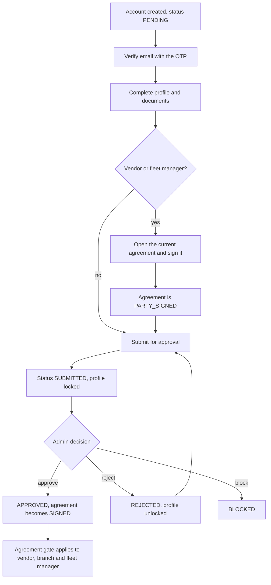

# Onboarding Journey

Every role except the customer follows the same spine: **create → verify →
complete the profile → (sign the agreement) → submit → admin decision**. What
differs is who creates the account, whether an agreement is required, and what
the account can do once it is approved. This page follows that spine for each of
the seven roles and links to the pages that own the rules.

Paths are relative to `src/app/`. Statements come from the committed backend code.
Behavior read from code but not run is marked **Inferred**. Uncommitted
working-tree features are not described. The role and route overview is on
[User Panel Flows Overview](./overview.md).

---

## The journey at a glance

The customer skips all of this: the first successful login creates an
`APPROVED` account.

### Entry points by role

| Role | Created by | Route | Who may call it | Status after creation |
| --- | --- | --- | --- | --- |
| `CUSTOMER` | The first login itself | `POST /auth/login-customer` or `POST /auth/social-login` | Anyone | `APPROVED` |
| `VENDOR` | Self-registration | `POST /auth/register` | Anyone | `PENDING` |
| `VENDOR` | Onboarding | `POST /auth/register/onboard` | `ADMIN`, `SUPER_ADMIN` (enforced) | `PENDING` |
| `SUB_VENDOR` | Onboarding only | `POST /auth/register/onboard` | The parent `VENDOR`, or an admin who sends `parentVendorId` | `PENDING` |
| `DELIVERY_PARTNER` | Self-registration | `POST /auth/register` | Anyone | `PENDING` |
| `DELIVERY_PARTNER` | Onboarding | `POST /auth/register/onboard` | A fleet manager or an admin | `PENDING` |
| `FLEET_MANAGER` | Self-registration | `POST /auth/register` | Anyone | `PENDING` |
| `FLEET_MANAGER` | Onboarding | `POST /auth/register/onboard` | An admin | `PENDING` |
| `ADMIN` | Onboarding only | `POST /auth/register/onboard` | `SUPER_ADMIN` (enforced) | `PENDING` |
| `SUPER_ADMIN` | Seeded at server start | None | Not applicable | `APPROVED` |

Self-registration accepts only `VENDOR`, `DELIVERY_PARTNER` and `FLEET_MANAGER`.
The onboarding route is `auth('VENDOR','FLEET_MANAGER','ADMIN','SUPER_ADMIN')`; the
service then checks the caller is `APPROVED`. The "who may call" column for
`SUB_VENDOR`, `DELIVERY_PARTNER` and `FLEET_MANAGER` is the **intended** rule; see
[Which callers can onboard whom](#which-callers-can-onboard-whom) for what the code
enforces. The state machine itself is in
[User Lifecycle](../03-identity-access/user-lifecycle.md#status-lifecycle).

---

## Role by role

### Customer

| # | Actor | Action | Route | State or effect |
| --- | --- | --- | --- | --- |
| 1 | Customer | Asks for a sign-in code with an email **or** a phone number (and optionally a `referralCode`) | `POST /auth/login-customer` | A `Customer` and `AuthUser` are created if none exists, `APPROVED`, `requiresOtpVerification: true`. A 4-digit OTP (5-minute TTL) goes to the email or phone |
| 2 | Customer | Submits the code with device details | `POST /auth/verify-otp` (role `CUSTOMER`) | Contact marked verified; access and refresh tokens issued |
| alt | Customer | Signs in with Google or Facebook instead | `POST /auth/social-login` | Account created or linked, email treated as verified, tokens issued; no OTP step |
| 3 | Customer | Fills in the profile | `PATCH /customers/:customerId` | Not required to sign in. The referral code is created on the first profile update |
| 4 | Customer | Adds a delivery address (needed for a delivery checkout) | `POST /customers/add-delivery-address` | See [Customer Addresses](../03-identity-access/customer-addresses.md) |

There is no submission, approval or agreement. An admin can still block or delete
a customer account through the shared account routes. Details:
[Authentication](../03-identity-access/authentication.md#flow-customer-otp-login),
[Points and Referrals](../09-offers-and-coupons/points-and-referrals.md).

### Vendor

| # | Actor | Action | Route | State or effect |
| --- | --- | --- | --- | --- |
| 1 | Vendor | Registers with email and password | `POST /auth/register` (role `VENDOR`) | Profile and `AuthUser` created in one transaction, `PENDING`; OTP emailed |
| alt | Admin | Onboards the vendor, choosing its initial password | `POST /auth/register/onboard` (role `VENDOR`) | Same result; the new account must still verify its email |
| 2 | Vendor | Verifies the email | `POST /auth/verify-otp` | Tokens issued. **Status stays `PENDING`** |
| 3 | Vendor | Completes profile, business details, bank details | `PATCH /vendors/:vendorId` | Allowed while the profile is not locked |
| 4 | Vendor | Uploads documents | `PATCH /vendors/:vendorId/docImage` | Up to 3 images per document title |
| 5 | Vendor | Opens and signs the current vendor agreement | `GET /agreements/current` or `POST /agreements/party/:partyId`, then `POST /agreements/:agreementId/sign` | Agreement row `PARTY_SIGNED`. It is not `SIGNED` yet because the vendor is not `APPROVED` |
| 6 | Vendor | Submits for approval | `PATCH /auth/:userId/submitForApproval` | Requires the current agreement to be `PARTY_SIGNED`. `SUBMITTED`, profile locked; admins are pushed |
| 7 | Admin | Approves | `PATCH /auth/:userId/approved-rejected-user` | Requires `SUBMITTED`, a party-signed agreement and a configured DeliGo signatory. `APPROVED`; the agreement is countersigned (`SIGNED`) |

Notes:

- **The agreement needs a complete profile.** Creating the agreement row fails
  with `PARTY_PROFILE_INCOMPLETE_FOR_AGREEMENT` when a field the agreement is built
  from is missing, so steps 3 and 4 come before step 5 in practice.
- **Signing before approval is the only way to submit.** The `PARTY_SIGNED` check is
  what lets step 6 succeed; the countersignature (`SIGNED`) waits for step 7.
- **No agreement version published means no agreement step.** Creating the agreement
  returns `AGREEMENT_TYPE_NOT_PUBLISHED`, and the submit and approve checks are
  skipped, including the DeliGo-signatory check.
- **A vendor owns its branches' onboarding** (next section) but not their agreement
  signing.

Owning pages: [User Lifecycle](../03-identity-access/user-lifecycle.md),
[Vendors and Branches](../04-vendors/vendors-and-branches.md#profile-updates-the-lock-and-correction-requests),
[Agreements](../07-agreements/agreements.md#signing-and-countersigning).

### Sub-vendor

A branch is a `SUB_VENDOR` row in the same collection as its parent. It is created
only by onboarding.

| # | Actor | Action | Route | State or effect |
| --- | --- | --- | --- | --- |
| 1 | Parent vendor, or an admin sending the parent's `userId` as `parentVendorId` | Onboards the branch, choosing its password | `POST /auth/register/onboard` (role `SUB_VENDOR`) | `PENDING`. Business name, type, cuisine, halal flag, NIF, hours, bank details and document references are **copied once** from the parent; the parent's branch counts are recomputed |
| 2 | Branch contact | Verifies the email | `POST /auth/verify-otp` (role `SUB_VENDOR`) | Tokens issued |
| 3 | Branch or parent | Completes branch-specific fields (name, contact, address, location) | `PATCH /vendors/:vendorId` | Brand fields cannot be changed on a branch |
| 4 | Branch or parent vendor | Submits the branch | `PATCH /auth/:userId/submitForApproval` | No agreement check: a branch has no agreement row. `SUBMITTED` |
| 5 | Admin | Approves | `PATCH /auth/:userId/approved-rejected-user` | No agreement precondition and no `SUBMITTED` precondition for this role |

A branch **cannot read or sign an agreement** (it is not in any agreement route
list). Its access is decided by the **parent's** agreement: once the branch is
`APPROVED` it is gated through the parent's signed row, and customers see it only
while the parent's agreement is signed. A branch without a `parentVendorId` is
never gated and never eligible for discovery. See
[Agreement Gate and Party Resolution](../07-agreements/agreement-gate.md#vendor-parent-vendor-and-branch)
and [Vendors and Branches](../04-vendors/vendors-and-branches.md#agreement-and-access-rules).

### Delivery partner

| # | Actor | Action | Route | State or effect |
| --- | --- | --- | --- | --- |
| 1 | Rider, fleet manager or admin | Registers or onboards the rider | `POST /auth/register` (role `DELIVERY_PARTNER`) or `POST /auth/register/onboard` | `PENDING`. A fleet manager's onboarding sets `currentFleetManagerId` to that manager; an admin's does not |
| 2 | Rider | Verifies the email | `POST /auth/verify-otp` | Tokens issued |
| 3 | Rider, its fleet manager, or staff | Completes the profile | `PATCH /delivery-partners/:deliveryPartnerId` | Refused until the email is verified (`EMAIL_VERIFICATION_REQUIRED_FOR_UPDATE`); refused while locked |
| 4 | Same | Uploads documents | `PATCH /delivery-partners/:deliveryPartnerId/docImage` | Same lock rule |
| 5 | The rider, its fleet manager, or an admin | Submits | `PATCH /auth/:userId/submitForApproval` | No agreement. `SUBMITTED` |
| 6 | Admin | Approves | `PATCH /auth/:userId/approved-rejected-user` | `APPROVED`. A rider is only offered or assigned orders while `APPROVED` |
| opt | Admin | Attaches a rider to a fleet manager | `PATCH /delivery-partners/:deliveryPartnerId/assign-fleet-manager` | Sets `currentFleetManagerId` (the fleet manager must be `APPROVED`) |

Facts worth knowing:

- **Fleet attachment is permanent through the API.** The only writers of
  `currentFleetManagerId` in the committed code are fleet-manager onboarding and the
  assign route, and the assign route refuses a rider who already has a fleet manager
  (`DELIVERY_PARTNER_ALREADY_ASSIGNED_TO_FLEET_MANAGER`, or `..._TO_THIS_FLEET_MANAGER`
  for the same one). **No route that clears or changes it was found.**
- **Attachment has money consequences.** A rider with a fleet manager is settled
  through the fleet manager: the fleet manager's wallet receives the rider's earnings
  plus its fee, and the rider's own wallet is skipped for payouts. See
  [Payouts, Wallets and Transactions](../10-payments/payouts-wallets-transactions.md).
- **Going online is not tied to approval.** `PATCH /delivery-partners/status/change`
  does not check the rider's status; dispatch and assignment do. See
  [Delivery Dispatch](../03-orders/delivery-dispatch.md#rider-state).
- **Self-registration does not attach a fleet manager.** A rider who registers
  itself has none until an admin assigns one. The assign route sends no push or email
  to the rider or the fleet manager (none is called in the service).

### Fleet manager

| # | Actor | Action | Route | State or effect |
| --- | --- | --- | --- | --- |
| 1 | Fleet manager or admin | Registers or onboards | `POST /auth/register` (role `FLEET_MANAGER`) or `POST /auth/register/onboard` | `PENDING` |
| 2 | Fleet manager | Verifies the email | `POST /auth/verify-otp` | Tokens issued |
| 3 | Fleet manager | Completes profile and documents | `PATCH /fleet-managers/:fleetManagerId`, `PATCH /fleet-managers/:fleetManagerId/docImage` | Refused while locked |
| 4 | Fleet manager | Opens and signs the fleet manager agreement | `GET /agreements/current`, then `POST /agreements/:agreementId/sign` | `PARTY_SIGNED` |
| 5 | Fleet manager | Submits | `PATCH /auth/:userId/submitForApproval` | Requires a party-signed agreement. `SUBMITTED` |
| 6 | Admin | Approves | `PATCH /auth/:userId/approved-rejected-user` | Same preconditions as a vendor. `APPROVED`, agreement `SIGNED` |
| 7 | Fleet manager | Onboards its own riders | `POST /auth/register/onboard` (role `DELIVERY_PARTNER`) | Requires the manager to be `APPROVED`; each rider is linked to it |

The gate applies to an approved fleet manager exactly as to a vendor, so one with an
unsigned effective agreement cannot onboard riders or submit them (both are writes).
Owning pages: [Agreements](../07-agreements/agreements.md),
[User Lifecycle](../03-identity-access/user-lifecycle.md#role-specific-lifecycle-behaviour-as-implemented).

### Admin and super admin

| # | Actor | Action | Route | State or effect |
| --- | --- | --- | --- | --- |
| 1 | Super admin | Onboards the admin, choosing its password | `POST /auth/register/onboard` (role `ADMIN`) | `PENDING`. Only a `SUPER_ADMIN` may create an admin |
| 2 | Admin | Verifies the email | `POST /auth/verify-otp` | Tokens issued |
| 3 | Admin | Edits its own profile | `PATCH /admins/:adminId` | An `ADMIN` can only edit itself; refused while the profile is locked |
| 4 | Admin, or another admin | Submits | `PATCH /auth/:userId/submitForApproval` | No agreement. `SUBMITTED` |
| 5 | A different admin or the super admin | Approves | `PATCH /auth/:userId/approved-rejected-user` | An admin cannot change its own status (`CANNOT_CHANGE_OWN_STATUS`) |
| 6 | Super admin | Grants permissions | `PATCH /permissions/assign-permissions/:adminId` | Needed only for the five enforced permission codes |

The `SUPER_ADMIN` is never onboarded. It is created at server start from environment
configuration as `APPROVED` with a verified email, and on later starts its email,
contact number and password are re-synchronised from the environment if they differ.
It cannot be deleted and cannot use password recovery. Permission codes are described
in [Authorization](../03-identity-access/authorization.md#admin-permissions).

---

## Which callers can onboard whom

The route allows `VENDOR`, `FLEET_MANAGER`, `ADMIN` and `SUPER_ADMIN`. A map in the
service (`ROLE_ONBOARD_PERMISSIONS`) is meant to limit each caller to specific target
roles, but it is looked up by the lower-cased role name (`sub_vendor`, `delivery_partner`,
`fleet_manager`) while its keys use hyphens. Those three lookups find nothing and the
check is skipped.

| Target | Intended callers | Enforced at HEAD |
| --- | --- | --- |
| `VENDOR`, `ADMIN` | Admin, super admin (admin target: super admin only) | **Yes** |
| `SUB_VENDOR` | Parent vendor, admin, super admin | **No role check.** A vendor creates a branch of itself; an admin must send `parentVendorId` |
| `DELIVERY_PARTNER` | Fleet manager, admin, super admin | **No role check.** Any of the four route roles |
| `FLEET_MANAGER` | Admin, super admin | **No role check.** Any of the four route roles, so a vendor or another fleet manager can reach it |

**Inferred** from `onboardUser`: a fleet manager that onboards a `SUB_VENDOR`
produces a branch with no `parentVendorId`, because the parent is resolved only for a
`VENDOR` or admin caller. Such a branch is never gated and never eligible for customer
discovery. This was not run. It is a backend matter, listed here only because it
changes who can appear in an admin's approval queue. See
[Authorization](../03-identity-access/authorization.md#onboarding-authorization).

---

## Verification

| Question | Answer |
| --- | --- |
| What is verified | The email for every non-customer role. A customer verifies the email or phone it signed in with, or is treated as verified by a social token |
| How | A 4-digit OTP, single use, 5-minute TTL, sent by the `verify-email` email (or SMS for a customer phone) and submitted to `POST /auth/verify-otp` with the role |
| Resend | `POST /auth/resend-otp`; a non-customer whose email is already verified is refused |
| When it happens | After creation, for self-registration and for onboarding alike. An onboarded user is given the password by the creator and must still verify |
| What it unlocks | The first token pair. Password login needs a verified email; a rider's profile update needs one too |
| What it does **not** do | Change `status`. A verified account is still `PENDING` |
| Replaced accounts | Registering or onboarding again with the same email deletes any **unverified** non-customer account for that email first |
| Later changes | `PATCH /profile/send-otp` then `PATCH /profile/update-email-or-contact-number` change an email or contact number with a fresh OTP |

Because status is not part of sign-in, a `PENDING`, `SUBMITTED` or `REJECTED` account
can already call every route its role allows. The service-level `APPROVED` checks are
what hold back real work (see [Status by status](#status-by-status)). Owning page:
[Authentication](../03-identity-access/authentication.md#flow-customer-otp-login).

---

## Approval, rejection, correction and blocking

### The admin decision

`PATCH /auth/:userId/approved-rejected-user` (`ADMIN`, `SUPER_ADMIN`). The admin
cannot target itself, the target cannot already be in that status, and `REJECTED` and
`BLOCKED` need `remarks`.

| Decision | Effect on the account | Lock | What the user is told | Next step |
| --- | --- | --- | --- | --- |
| `APPROVED` | `status` set on `AuthUser` and profile; `approvedBy` set; a default remark is used if none is given. For a vendor or fleet manager the agreement is finalized (`SIGNED`) afterwards | **Unchanged** (stays locked) | Push `ACCOUNT_STATUS_APPROVED` and the `user-approval-notification` email | Normal operation; the agreement gate now applies |
| `REJECTED` | `rejectedBy` and `remarks` set | **Cleared** | Push and email with the remarks | The owner edits the profile and calls `submitForApproval` again |
| `BLOCKED` | `blockedBy` and `remarks` set | Unchanged | Push and email | None. `auth()` refuses every request from the account |

Rules that vary by role:

- **Vendor and fleet manager can only be approved from `SUBMITTED`**, with a
  party-signed agreement and a configured DeliGo signatory (when an agreement version
  is effective).
- **Every other role has no precondition.** An admin can move a branch, rider or admin
  to `APPROVED`, `REJECTED` or `BLOCKED` from any other status, including `PENDING`.
  A commented-out guard that would have refused approving a rider without a fleet
  assignment does not run.
- **Every decision is written to the activity log** (`USER_APPROVED`,
  `USER_REJECTED`, `USER_BLOCKED`) by the controller.

### Correction requests

An approved or submitted profile is locked. An admin can open a scoped, temporary
grant so the owner can fix specific fields or re-upload specific documents without
unlocking the whole profile.

| Step | Actor | Route | Effect |
| --- | --- | --- | --- |
| 1 | Admin | `PATCH /auth/:userId/request-corrections` | Allowed for `VENDOR`, `SUB_VENDOR`, `FLEET_MANAGER`, `DELIVERY_PARTNER` while the status is `SUBMITTED` or `APPROVED`, and only one `PENDING` request at a time. Stores the granted `fields`, `docTitles` and `remarks`; locks the profile. Pushes the owner and emails the `user-correction-request-notification` |
| 2 | Owner | The role's normal update routes | Only the granted top-level fields and document titles are accepted while the grant is `PENDING` |
| 3 | Owner | `PATCH /auth/:userId/confirm-corrections` | The request becomes `FULFILLED`, the profile re-locks, and every admin is pushed (`CORRECTION_CONFIRMED_TO_ADMIN`) |

What an admin may grant, per role (a dotted field is checked by its first segment;
`status`, `documents` and approval fields can never be granted):

| Role | Grantable top-level fields | Grantable document titles |
| --- | --- | --- |
| `VENDOR`, `SUB_VENDOR` | `name`, `contactNumber`, `address`, `businessDetails`, `businessLocation`, `bankDetails` | `myPhoto`, `businessLicenseDoc`, `taxDoc`, `idProofFront`, `idProofBack`, `storePhoto`, `menuUpload`, `agoserisHaccpCertificate`, `ibanProof` |
| `FLEET_MANAGER` | The vendor list plus `operationalData` | `myPhoto`, `idProofFront`, `idProofBack`, `businessLicense`, `proofOfAddress`, `activityDocument`, `ibanProof` |
| `DELIVERY_PARTNER` | `name`, `contactNumber`, `address`, `personalInfo`, `legalStatus`, `bankDetails`, `vehicleInfo`, `criminalRecord`, `workPreferences` | `myPhoto`, `idProofFront`, `idProofBack`, `drivingLicenseFront`, `drivingLicenseBack`, `vehicleRegistration`, `criminalRecordCertificate`, `activity`, `insurancePolicy`, `ibanProof` |

Vendor-specific behavior (document limits, the self-editable titles, the update lock) is
on [Vendors and Branches](../04-vendors/vendors-and-branches.md#correction-requests-vendor-specifics).
Confirming does not check that anything was actually changed: it only closes the
request. Notification detail is on
[Notification Triggers and Templates](../06-notifications/notification-triggers.md).

### The lock after approval

Submission sets `isUpdateLocked`; approval does not clear it, and only a later
`REJECTED` does. An approved vendor, branch, fleet manager or rider therefore edits its
profile only through a correction grant or an admin. Treat this as observed behavior,
not documented intent. See
[User Lifecycle](../03-identity-access/user-lifecycle.md#isupdatelocked-through-the-lifecycle).

---

## Agreement gate and access consequences

Approval is where the agreement gate starts to apply. It affects only the roles with an
agreement, plus branches through their parent.

| Account | Agreement that decides access | Gated once `APPROVED`? | Can sign it? |
| --- | --- | --- | --- |
| `VENDOR` | Its own vendor agreement | Yes | Yes |
| `SUB_VENDOR` (with a parent) | The parent vendor's | Yes | No: the parent signs |
| `SUB_VENDOR` (no parent) | None | No | No |
| `FLEET_MANAGER` | Its own fleet manager agreement | Yes | Yes |
| `CUSTOMER`, `DELIVERY_PARTNER`, `ADMIN`, `SUPER_ADMIN` | None | Never | Not applicable |

The gate is the last step of `auth()`. It runs only when the caller resolves to an
agreement party **and** its `AuthUser.status` is `APPROVED`, so a vendor still in
onboarding is never blocked. That is what lets it sign its first agreement.

What happens to an approved account whose effective agreement is not signed:

| Request | Result |
| --- | --- |
| Any write (`POST`, `PUT`, `PATCH`, `DELETE`) on a route that uses `auth()` | `403 AGREEMENT_RESIGN_REQUIRED` with `agreementId`, `agreementType`, `versionNumber`, unless the mount path is exempt |
| Any request under `/api/v1/orders`, including reads | `403 AGREEMENT_RESIGN_REQUIRED` |
| `GET` on other routes | Allowed |
| Anything under `/api/v1/agreements` or `/api/v1/uploads` | Allowed, so the party can sign |

Effects across roles and journeys:

- **Customers stop seeing the vendor.** From the moment a new version becomes
  effective, the vendor drops out of customer discovery and cart add and checkout fail
  with `VENDOR_NOT_ACCEPTING_ORDERS`, even before the vendor makes any request. See
  [Cart](../08-cart/cart.md#when-a-product-vendor-or-agreement-becomes-invalid).
- **The vendor panel loses the order routes.** An unsigned approved vendor or branch
  cannot list or act on orders. Existing orders keep moving: the automatic jobs
  (auto-accept, dispatch, auto-ready) do not check agreements. See
  [Order Automation](../03-orders/order-automation.md).
- **A fleet manager loses its writes.** That includes onboarding and submitting riders
  and the payout routes.
- **Signing restores access at once** for an approved party, because the DeliGo
  countersignature is applied in the same request. Signing for a branch means the
  parent signing, and it restores every branch.
- **Rollover is lazy.** Nothing runs when a version's effective date arrives. The first
  gated request afterwards creates the new unsigned row, and the gate then refuses
  writes. See
  [Re-sign when a new version takes effect](../07-agreements/agreement-gate.md#re-sign-when-a-new-version-takes-effect).
- **Exemptions are mostly ineffective.** The code lists six exempt paths but compares
  the router's mount path, so only `/api/v1/agreements` and `/api/v1/uploads` match.
  Logout, change password and FCM-token update (all `POST`) are therefore **Inferred**
  to be refused for a blocked vendor or fleet manager. See
  [the gate page](../07-agreements/agreement-gate.md#the-exemption-check-does-not-match-as-documented).

---

## Status by status

What each account status means for a panel. "Role routes" are the routes in the
[capability matrix](./overview.md#capability-matrix-route-level).

| Status | Can sign in | Role routes | Agreement gate | Notable service checks |
| --- | --- | --- | --- | --- |
| `PENDING` | Yes, once the email is verified | All the role lists allow | Not applied | Services that need `APPROVED` (product creation, order actions, store toggle, onboarding others, deleting accounts) refuse |
| `SUBMITTED` | Yes | Same | Not applied | Profile locked. A correction grant can be opened |
| `APPROVED` | Yes | Same | **Applied** to vendor, branch (via parent) and fleet manager | Required to onboard, delete, take order actions, create products, be discovered by customers, or be offered orders (rider) |
| `REJECTED` | Yes (not refused by `auth()`) | Same | Not applied | `changePassword` and `resetPassword` refuse it. Profile unlocked for edits |
| `BLOCKED` | No: `auth()` refuses every request; login and refresh refuse it | None | Not applicable | Socket.IO connections only check the token signature, so an open socket is not re-checked against the status |

---

## Unresolved and ambiguous points

- **`isUpdateLocked` after approval.** Whether the permanent lock on an approved profile
  is intended is not stated in the code.
- **Role limits on onboarding.** Whether a vendor or fleet manager should be able to
  onboard a rider or fleet manager is not answered by the code; the intended map is
  not enforced.
- **A branch's lack of its own agreement and its missing agreement routes.** Whether a
  branch should ever sign separately is a product decision.
- **Behavior of a blocked-by-gate account on logout and push-token routes** is
  **Inferred** from a path comparison, not reproduced against a database.
- **Client behavior.** Which client opens the agreement, shows `REJECTED` remarks, or
  handles a `403 AGREEMENT_RESIGN_REQUIRED` is not defined by the backend.
- **Rider access before approval.** A rider can go online while `PENDING`; whether that
  is intended is not stated.
- **Email delivery.** Verification, approval and correction emails are sent
  fire-and-forget; a failure is logged and not surfaced, so a user may never receive an
  OTP without the request failing.

---

## Related documentation

- [User Lifecycle](../03-identity-access/user-lifecycle.md): states, transitions, submit, approve, lock and delete.
- [Authentication](../03-identity-access/authentication.md): OTP, tokens, sessions and password flows.
- [Authorization](../03-identity-access/authorization.md): route roles, admin permissions, onboarding authorization.
- [Agreements](../07-agreements/agreements.md) and [Agreement Gate and Party Resolution](../07-agreements/agreement-gate.md): versions, signing and the gate.
- [Vendors and Branches](../04-vendors/vendors-and-branches.md): branches, the profile lock and correction details.
- [Order Journey](./order-journey.md): what an approved account does next.
